<!-- vim-markdown-toc GFM -->

* [terminal simulator (终端模拟器)](#terminal-simulator-终端模拟器)
    * [alacritty](#alacritty)
    * [tabby](#tabby)
    * [ttyd: 浏览器terminal](#ttyd-浏览器terminal)
* [File](#file)
    * [advcpmv](#advcpmv)
        * [instead cp,mv](#instead-cpmv)
    * [ranger](#ranger)
    * [visidata: 支持查看sqlite的文件管理器](#visidata-支持查看sqlite的文件管理器)
    * [broot](#broot)
    * [nnn](#nnn)
    * [lf: go ranger](#lf-go-ranger)
    * [joshuto: rust ranger](#joshuto-rust-ranger)
    * [mc](#mc)
    * [fd](#fd)
        * [instead find](#instead-find)
    * [tmsu](#tmsu)
        * [taging file and mount tag file](#taging-file-and-mount-tag-file)
    * [massren](#massren)
        * [using editor rename file](#using-editor-rename-file)
    * [fselect: sql语句的ls](#fselect-sql语句的ls)
    * [jql: json查看器](#jql-json查看器)
    * [dsq: sql语句查看json, csv, nginxlog](#dsq-sql语句查看json-csv-nginxlog)
    * [htmlq](#htmlq)
    * [OctoSQL: sql语句查看文件](#octosql-sql语句查看文件)
    * [termscp: tui文件传输](#termscp-tui文件传输)
* [git](#git)
    * [gh](#gh)
        * [github-cli官方文档](#github-cli官方文档)
    * [lazygit](#lazygit)
        * [git tui](#git-tui)
    * [gitui](#gitui)
    * [bit](#bit)
        * [instead git](#instead-git)
    * [tig](#tig)
        * [git log](#git-log)
    * [hub](#hub)
    * [forgit](#forgit)
* [char](#char)
    * [exa](#exa)
        * [highlight ls](#highlight-ls)
    * [lsd](#lsd)
        * [highlight ls and support icon](#highlight-ls-and-support-icon)
    * [nat](#nat)
        * [highlight ls](#highlight-ls-1)
    * [bat](#bat)
        * [highlight cat](#highlight-cat)
    * [alder](#alder)
        * [highlight tree](#highlight-tree)
    * [ag](#ag)
        * [instead grep](#instead-grep)
    * [fzf](#fzf)
    * [skim](#skim)
        * [rust 版fzf](#rust-版fzf)
    * [diff-so-fancy](#diff-so-fancy)
        * [highlight git diff](#highlight-git-diff)
    * [icdiff](#icdiff)
        * [instead diff](#instead-diff)
    * [git-split-diffs: github style diff](#git-split-diffs-github-style-diff)
        * [instead git diff](#instead-git-diff)
    * [pet](#pet)
        * [Simple command-line snippet manager](#simple-command-line-snippet-manager)
    * [multitail](#multitail)
        * [instead tail](#instead-tail)
    * [cheat](#cheat)
        * [instead man](#instead-man)
    * [glow](#glow)
        * [markdown preview cli version](#markdown-preview-cli-version)
    * [fx](#fx)
        * [Command-line JSON processing tool](#command-line-json-processing-tool)
    * [navi: fzf command bookmark](#navi-fzf-command-bookmark)
    * [trash-cli](#trash-cli)
        * [回收站](#回收站)
    * [choose: instead od](#choose-instead-od)
* [disk](#disk)
    * [dfc](#dfc)
        * [instead df](#instead-df)
    * [cfdisk](#cfdisk)
        * [instead fdisk](#instead-fdisk)
    * [duf](#duf)
    * [ncdu](#ncdu)
    * [dust](#dust)
        * [instead du](#instead-du)
* [process](#process)
    * [procs](#procs)
        * [instead ps](#instead-ps)
* [net](#net)
    * [prettyping](#prettyping)
    * [curlie](#curlie)
        * [instead curl](#instead-curl)
    * [dog](#dog)
        * [instead dig](#instead-dig)
* [好看的字符](#好看的字符)
    * [neofetch](#neofetch)
    * [cpufetch](#cpufetch)
    * [figlet](#figlet)
    * [cmatrix](#cmatrix)
    * [lolcat](#lolcat)
    * [colorscript](#colorscript)
* [Social media](#social-media)
    * [googler(google)](#googlergoogle)
    * [ddgr(DuckDuckGo)](#ddgrduckduckgo)
    * [rtv(reddit cli)](#rtvreddit-cli)
    * [rainbowstream(twitter)](#rainbowstreamtwitter)
    * [haxor-news(hacknew)](#haxor-newshacknew)
* [压缩](#压缩)
    * [svgo: svg压缩](#svgo-svg压缩)
* [other](#other)
    * [Termshark](#termshark)
        * [wireshark cli version with vim keybinds](#wireshark-cli-version-with-vim-keybinds)
    * [baidupcs](#baidupcs)
        * [The terminal utility for Baidu Network Disk.](#the-terminal-utility-for-baidu-network-disk)
    * [aliyunpan](#aliyunpan)
        * [阿里网盘 go 客户端](#阿里网盘-go-客户端)
    * [bypy](#bypy)
        * [百度网盘 Python 客户端](#百度网盘-python-客户端)
    * [haxor-news](#haxor-news)
        * [Browse Hacker News](#browse-hacker-news)
    * [fim: 图片浏览器](#fim-图片浏览器)
    * [timg: 在终端下查看图片和视频](#timg-在终端下查看图片和视频)
    * [imgdiff](#imgdiff)
        * [pixel-by-pixel image difference tool.](#pixel-by-pixel-image-difference-tool)
    * [onedrive](#onedrive)
        * [本地同步 onedrive](#本地同步-onedrive)
    * [xonsh](#xonsh)
    * [python shell](#python-shell)
    * [ytfzf](#ytfzf)
    * [ix](#ix)
    * [cloc(统计代码)](#cloc统计代码)
    * [openrefine: json, csv...网页操作](#openrefine-json-csv网页操作)
    * [npkill: 查找和清理node_module](#npkill-查找和清理node_module)
    * [zx: 更优秀的shell编程,Google用nodejs写的一个shell包装器](#zx-更优秀的shell编程google用nodejs写的一个shell包装器)
    * [syncthing: 同步文件](#syncthing-同步文件)
    * [croc: 文件传输](#croc-文件传输)
    * [slidev: markdown写ppt](#slidev-markdown写ppt)
    * [q: sql语法查询文件](#q-sql语法查询文件)
    * [sunloginclient-cli(向日葵运程控制cli版)](#sunloginclient-cli向日葵运程控制cli版)
    * [fanyi(翻译)](#fanyi翻译)
    * [cheat.sh: 更好的man](#cheatsh-更好的man)
    * [tokei(统计编程语言占比)](#tokei统计编程语言占比)
    * [termpair: 网页操作终端](#termpair-网页操作终端)
    * [markdown写ppt](#markdown写ppt)
* [reference](#reference)

<!-- vim-markdown-toc -->

# terminal simulator (终端模拟器)

## [alacritty](https://github.com/alacritty/alacritty)

- [滚动性能对比](https://jwilm.io/blog/alacritty-lands-scrollback/)

- 缺点:

    - [启动速度慢](https://github.com/alacritty/alacritty/issues/782)
    ```sh
     sudo perf stat -r 10 -d alacritty -e false
    ```

## [tabby](https://github.com/Eugeny/tabby)

## [ttyd: 浏览器terminal](https://github.com/tsl0922/ttyd)

# File

## [advcpmv](https://github.com/jarun/advcpmv)

### instead cp,mv

```sh
alias mv="advmv -g"
alias cp="advcp -g"
```

## [ranger](https://github.com/ranger/ranger)


## [visidata: 支持查看sqlite的文件管理器](https://github.com/saulpw/visidata)

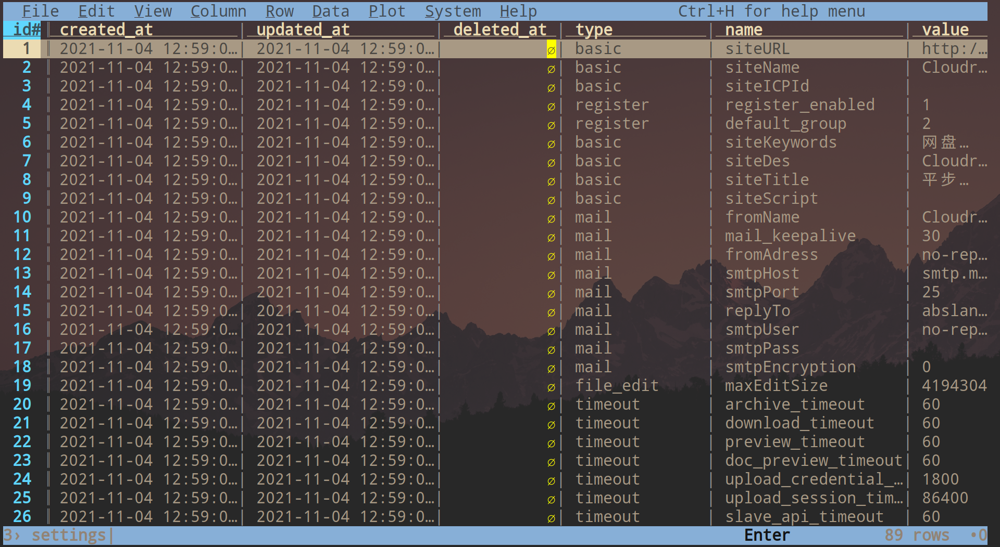

## [broot](https://github.com/Canop/broot)


## [nnn](https://github.com/jarun/nnn)

```sh
git clone https://github.com/jarun/nnn.git
cd nnn
sudo cp nnn /bin/
# 显示图标
sudo make O_NERD=1
```


## [lf: go ranger](https://github.com/gokcehan/lf)
## [joshuto: rust ranger](https://github.com/kamiyaa/joshuto)
## [mc](https://github.com/MidnightCommander/mc)

支持鼠标操作


## [fd](https://github.com/sharkdp/fd)

### instead find

## [tmsu](https://github.com/oniony/TMSU)

### taging file and mount tag file

## [massren](https://github.com/laurent22/massren)

### using editor rename file

## [fselect: sql语句的ls](https://github.com/jhspetersson/fselect)

## [jql: json查看器](https://github.com/cube2222/jql)


## [dsq: sql语句查看json, csv, nginxlog](https://github.com/multiprocessio/dsq)

```sh
# 查看mac地址
ip --json addr show | dsq -s json "SELECT address FROM {}"
```

## [htmlq](https://github.com/mgdm/htmlq)

## [OctoSQL: sql语句查看文件](https://github.com/cube2222/octosql)

## [termscp: tui文件传输](https://github.com/veeso/termscp)

# git

## [gh](https://github.com/cli/cli)

```sh
# 登陆
gh auth login

# 查看登陆
gh auth status

# 创建仓库
gh repo create gh-test

# 查看所有仓库
gh repo list

# 查看指定仓库
gh repo view https://github.com/ztoiax/nvim

# 创建issue
gh issue create

# 查看issue
gh issue list

# 创建release
gh release create r1

# 查看release
gh release list
```

### github-cli[官方文档](https://cli.github.com/manual/)

## [lazygit](https://github.com/jesseduffield/lazygit)

### git tui


## [gitui](https://github.com/extrawurst/gitui)

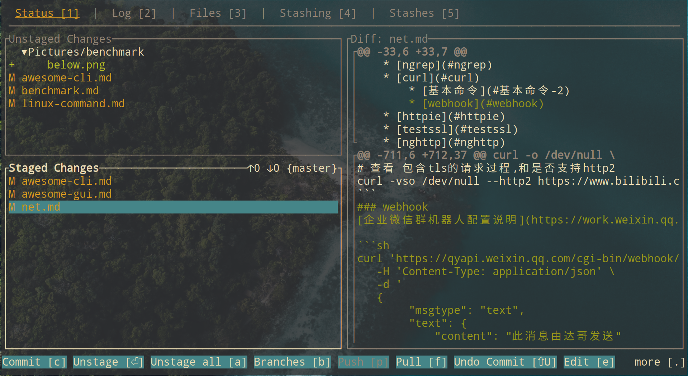

## [bit](https://github.com/chriswalz/bit)

### instead git


## [tig](https://github.com/jonas/tig)

### git log


## [hub](https://hub.github.com/)

## [forgit](https://github.com/wfxr/forgit)


# char

## [exa](https://github.com/ogham/exa)

### highlight ls


## [lsd](https://github.com/Peltoche/lsd)

### highlight ls and support icon


## [nat](https://github.com/willdoescode/nat)

### highlight ls

## [bat](https://github.com/sharkdp/bat)


### highlight cat

## alder

### highlight tree


## ag

### instead grep

## [fzf](https://github.com/junegunn/fzf)


```sh
# 模糊搜索
fzf

# -e 取消模糊搜索
fzf -e
```
## [skim](https://github.com/lotabout/skim)

### rust 版fzf

## [diff-so-fancy](https://github.com/so-fancy/diff-so-fancy)


### highlight git diff

## [icdiff](https://github.com/jeffkaufman/icdiff)

### instead diff

## [git-split-diffs: github style diff](https://github.com/banga/git-split-diffs)

### instead git diff

## [pet](https://github.com/knqyf263/pet)


### Simple command-line snippet manager

## multitail

### instead tail

## [cheat](https://github.com/cheat/cheat)


### instead man

## [glow](https://github.com/charmbracelet/glow)

### markdown preview cli version


## [fx](https://github.com/antonmedv/fx)

### Command-line JSON processing tool

## [navi: fzf command bookmark](https://github.com/denisidoro/navi)

## [trash-cli](https://github.com/andreafrancia/trash-cli)

### 回收站

## [choose: instead od](https://github.com/theryangeary/choose)

```sh
# 选取第1列
echo '1 2 3' | choose 0

# 选取最后第1列
echo '1 2 3' | choose -1

# 选取第2到3列
echo '1 2 3' | choose 1:2

# 选取第2到最后一列
echo '1 2 3' | choose 1:

# -f 设置分隔符
cat /etc/passwd | choose -f ':' -1
```

# disk

## [dfc](https://github.com/Rolinh/dfc)


### instead df

## cfdisk

### instead fdisk


## [duf](https://github.com/muesli/duf)


## [ncdu](https://github.com/rofl0r/ncdu)


## [dust](https://github.com/bootandy/dust)

### instead du

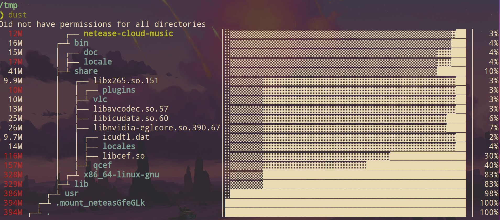

# process

## [procs](https://github.com/dalance/procs)

### instead ps

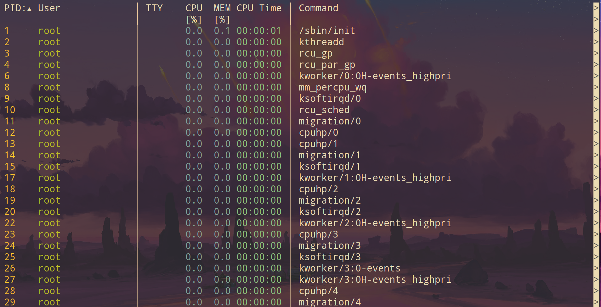

# net

## [prettyping](https://github.com/denilsonsa/prettyping)

## [curlie](https://github.com/rs/curlie)

### instead curl


## [dog](https://github.com/ogham/dog)

### instead dig

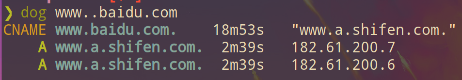

# 好看的字符

## [neofetch](https://github.com/dylanaraps/neofetch)

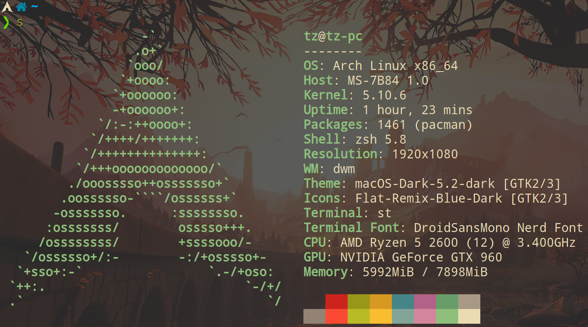

## [cpufetch](https://github.com/Dr-Noob/cpufetch)

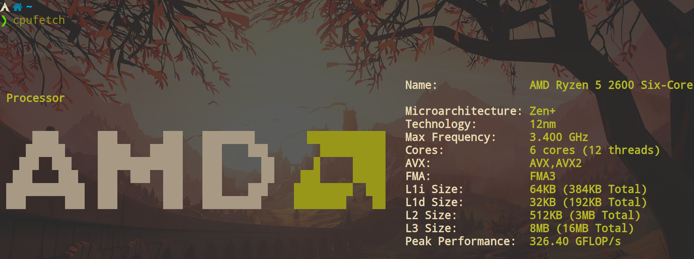

## [figlet](https://github.com/cmatsuoka/figlet)


## [cmatrix](https://github.com/abishekvashok/cmatrix)


## [lolcat](https://github.com/busyloop/lolcat)

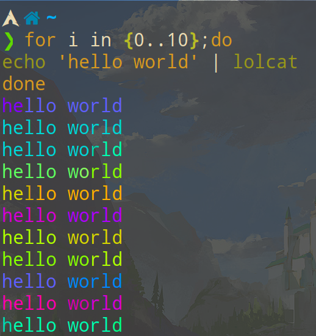

## [colorscript](https://gitlab.com/dwt1/shell-color-scripts)

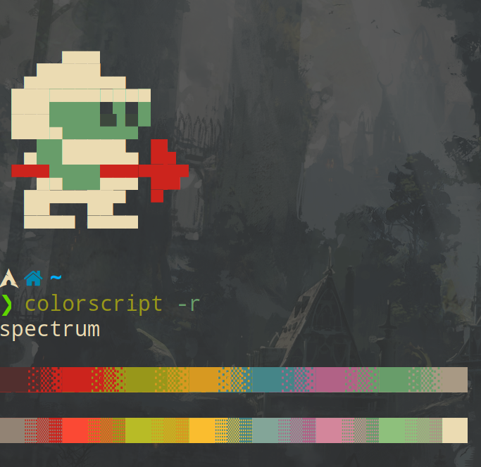

# Social media

## [googler(google)](https://github.com/jarun/googler)
## [ddgr(DuckDuckGo)](https://github.com/jarun/ddgr)

## [rtv(reddit cli)](https://github.com/michael-lazar/rtv)
## [rainbowstream(twitter)](https://github.com/orakaro/rainbowstream)


## [haxor-news(hacknew)](https://github.com/donnemartin/haxor-news)

# 压缩

## [svgo: svg压缩](https://github.com/svg/svgo)
```sh
svgo file.svg -o newfile.svg
```

# other

## [Termshark](https://github.com/gcla/termshark)

### wireshark cli version with vim keybinds


## [baidupcs](https://github.com/GangZhuo/BaiduPCS)

### The terminal utility for Baidu Network Disk.

## [aliyunpan](https://github.com/tickstep/aliyunpan#linux--macos)

### 阿里网盘 go 客户端

## [bypy](https://github.com/houtianze/bypy)

### 百度网盘 Python 客户端

## [haxor-news](https://github.com/donnemartin/haxor-news)

### Browse Hacker News

## fim: 图片浏览器

## [timg: 在终端下查看图片和视频](https://github.com/hzeller/timg)

```sh
# 在kitty终端模拟器可以全像素显示
timg filename.jpeg -p kitty

# --loops循环
timg --loops=3 filename.gif
```

## [imgdiff](https://github.com/n7olkachev/imgdiff)

### pixel-by-pixel image difference tool.

## [onedrive](https://github.com/skilion/onedrive)

### 本地同步 onedrive

## [xonsh](https://github.com/xonsh/xonsh)


## python shell

- [xonsh 插件](https://xon.sh/xontribs.html)

## ytfzf

- [fzf搜索,播放youtube](https://github.com/pystardust/ytfzf)

## ix

- [pastbin](http://ix.io/)

    - [bpa:一个在线网页版](https://bpa.st/)

```sh
cat test.py | curl -F 'f:1=<-' ix.io
```

## [cloc(统计代码)](https://github.com/AlDanial/cloc)

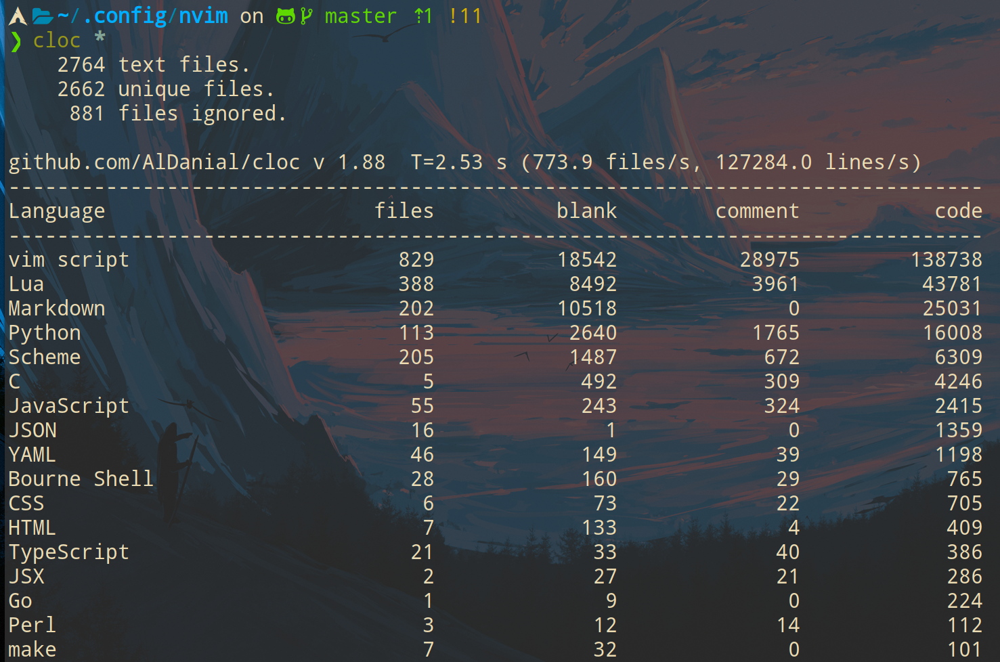

## [openrefine: json, csv...网页操作](https://github.com/OpenRefine/OpenRefine)

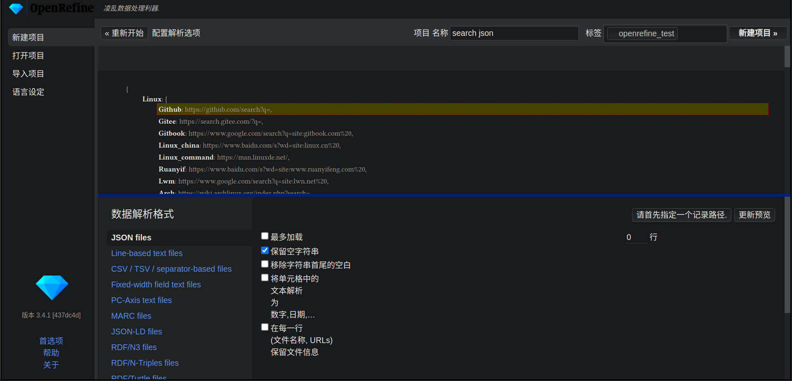

## [npkill: 查找和清理node_module](https://github.com/voidcosmos/npkill)

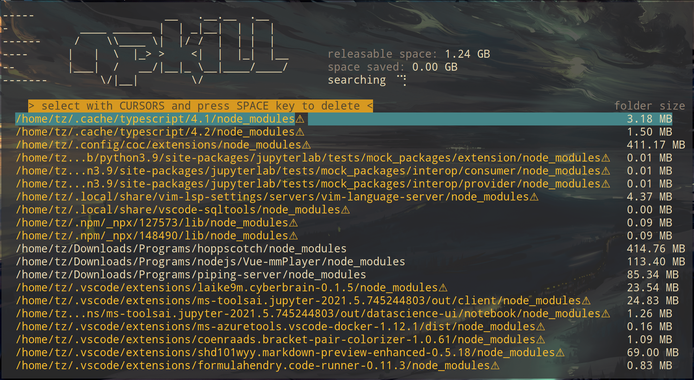

## [zx: 更优秀的shell编程,Google用nodejs写的一个shell包装器](https://github.com/google/zx)

## [syncthing: 同步文件](https://github.com/syncthing/syncthing)

## [croc: 文件传输](https://github.com/schollz/croc)

## [slidev: markdown写ppt](https://github.com/slidevjs/slidev)

## [q: sql语法查询文件](https://github.com/harelba/q)
```sh
q "SELECT * FROM mysql_slow.log"

# 只显示前两列
q "SELECT c1, c2 FROM mysql_slow.log"

# 只显示前两列, 并且第一列包含COUNT
q "SELECT c1, c2 FROM mysql_slow.log WHERE c1 LIKE '%COUNT%'"

ps -ef | q -H "select count(UID) from - where UID='root'"
```
## [sunloginclient-cli(向日葵运程控制cli版)](https://sunlogin.oray.com/download)

## [fanyi(翻译)](https://github.com/afc163/fanyi)
```sh
# 需要安装festival
pacman -S festival
```

## [cheat.sh: 更好的man](https://github.com/chubin/cheat.sh#usage)
- 1.使用curl获取(未安装的使用方法):
    ```sh
    # 获取rsync命令
    curl https://cheat.sh/rsync

    # 获取python requests
    curl https://cheat.sh/python/requests

    # 获取python requests get
    curl https://cheat.sh/python/requests+get
    ```
- 2.安装后的用法:
    ```sh
    cht.sh rsync
    cht.sh python requests
    cht.sh python requests get
    ```

## tokei(统计编程语言占比)

## [termpair: 网页操作终端](https://github.com/cs01/termpair)

## [markdown写ppt](https://github.com/webpro/reveal-md/)

# reference

- [modern-unix: 类似项目](https://github.com/ibraheemdev/modern-unix)

- [命令行基础工具的更佳替代品](https://linux.cn/article-4042-1.html)

- [命令行：增强版](https://linux.cn/article-10171-1.html)
