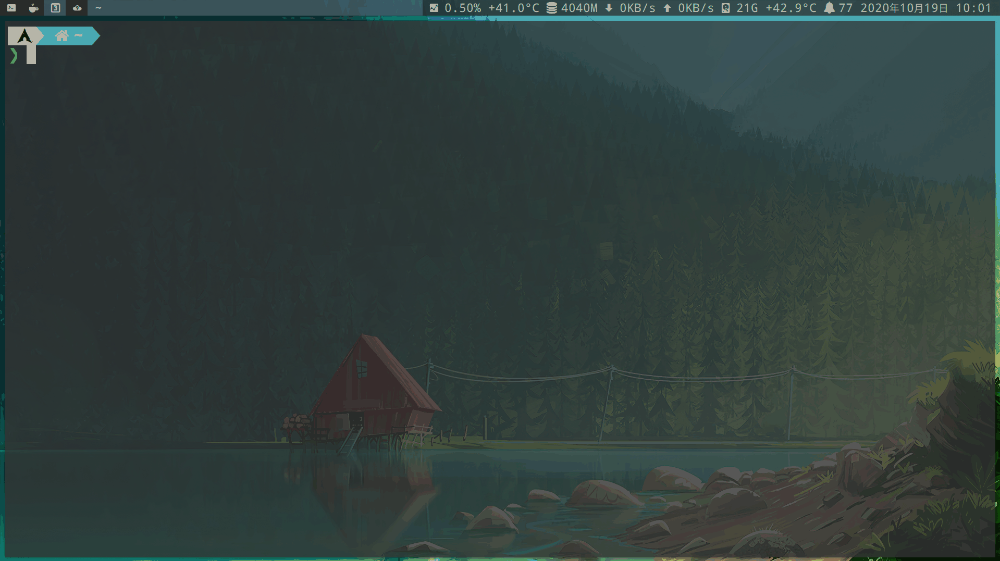

<!-- mtoc-start -->

* [terminal simulator (终端模拟器)](#terminal-simulator-终端模拟器)
  * [alacritty](#alacritty)
  * [wezterm:用rust写, 支持gpu加速](#wezterm用rust写-支持gpu加速)
  * [warp：自带ai的termianl](#warp自带ai的termianl)
  * [tabby](#tabby)
  * [ttyd: 浏览器terminal](#ttyd-浏览器terminal)
  * [termpair: 网页操作终端](#termpair-网页操作终端)
  * [sshx：通过浏览器远程访问，共享的终端。体验有点卡](#sshx通过浏览器远程访问共享的终端体验有点卡)
  * [ghostty：用zig写的](#ghostty用zig写的)
  * [waveterm：ts写的，支持ai提醒](#wavetermts写的支持ai提醒)
  * [WindTerm：c写的类似vscode布局的终端](#windtermc写的类似vscode布局的终端)
  * [Nexterm：适合多服务器管理。支持SSH, VNC and RDP，支持SFTP、支持Proxmox LXC 和 QEMU containers](#nexterm适合多服务器管理支持ssh-vnc-and-rdp支持sftp支持proxmox-lxc-和-qemu-containers)
* [File Browser](#file-browser)
  * [ranger](#ranger)
  * [visidata: 支持查看sqlite的文件管理器](#visidata-支持查看sqlite的文件管理器)
  * [broot](#broot)
  * [nnn](#nnn)
  * [lf: go ranger](#lf-go-ranger)
  * [joshuto: rust ranger](#joshuto-rust-ranger)
  * [yazi：rust ranger](#yazirust-ranger)
  * [mc](#mc)
  * [twf：vim模式的文件树](#twfvim模式的文件树)
  * [superfile](#superfile)
* [File](#file)
  * [mmv：批量命名mv](#mmv批量命名mv)
  * [[advcpmv: instead cp, my(https://github.com/jarun/advcpmv)](#advcpmv-instead-cp-myhttpsgithubcomjarunadvcpmv)
  * [fd: instead find](#fd-instead-find)
  * [tmsu: taging file and mount tag file](#tmsu-taging-file-and-mount-tag-file)
  * [massren: using editor rename file](#massren-using-editor-rename-file)
  * [fselect: sql语句的ls](#fselect-sql语句的ls)
  * [jq:json处理](#jqjson处理)
  * [jql: json过滤器](#jql-json过滤器)
  * [jless:json查看器](#jlessjson查看器)
  * [jo:生成json对象](#jo生成json对象)
  * [jc:以json文本输出命令](#jc以json文本输出命令)
  * [jnv：交互式搜索json](#jnv交互式搜索json)
  * [dsq: sql语句查看json, csv, nginxlog](#dsq-sql语句查看json-csv-nginxlog)
  * [htmlq:html版jq](#htmlqhtml版jq)
  * [yq:yaml查看器](#yqyaml查看器)
  * [xsv:csv查看器](#xsvcsv查看器)
  * [tabiew：tui查看csv、tsv、json](#tabiewtui查看csvtsvjson)
  * [csvlens：tui查看csv、json](#csvlenstui查看csvjson)
  * [OctoSQL: sql语句查看文件](#octosql-sql语句查看文件)
  * [termscp: tui文件传输](#termscp-tui文件传输)
  * [fq: 二进制查看器](#fq-二进制查看器)
  * [vidir: 编辑器批量改名](#vidir-编辑器批量改名)
  * [mutagen：文件同步到远程服务器，也可以充当中间人在2个远程文件系统之间同步](#mutagen文件同步到远程服务器也可以充当中间人在2个远程文件系统之间同步)
  * [zrok：端对端共享文件](#zrok端对端共享文件)
  * [termscp：ftp、scp等的tui](#termscpftpscp等的tui)
  * [entr：监控文件变化时，执行命令](#entr监控文件变化时执行命令)
* [git](#git)
  * [gh](#gh)
    * [github-cli官方文档](#github-cli官方文档)
  * [lazygit：git tui](#lazygitgit-tui)
  * [gitui](#gitui)
  * [bit：instead git](#bitinstead-git)
  * [tig：git log](#tiggit-log)
  * [hub](#hub)
  * [forgit](#forgit)
  * [gitoxide:rust版git](#gitoxiderust版git)
  * [delta：highlight git diff](#deltahighlight-git-diff)
* [char](#char)
  * [tp：tui实时输出基础命令。如find、grep、jq等](#tptui实时输出基础命令如findgrepjq等)
  * [docfd：tui的grep。支持fuzzy](#docfdtui的grep支持fuzzy)
  * [viddy:instead watch](#viddyinstead-watch)
  * [eza：highlight ls](#ezahighlight-ls)
  * [exa：highlight ls.很久没更新了，建议使用eza](#exahighlight-ls很久没更新了建议使用eza)
  * [erd：highlight ls](#erdhighlight-ls)
  * [lsd：highlight ls](#lsdhighlight-ls)
  * [nat](#nat)
    * [highlight ls](#highlight-ls)
  * [bat](#bat)
    * [highlight cat](#highlight-cat)
  * [alder](#alder)
    * [highlight tree](#highlight-tree)
  * [ag](#ag)
    * [instead grep](#instead-grep)
  * [fzf](#fzf)
  * [television：rust版fzf](#televisionrust版fzf)
  * [skim：rust 版fzf](#skimrust-版fzf)
  * [zf：zig版fzf](#zfzig版fzf)
  * [diff-so-fancy：highlight git diff](#diff-so-fancyhighlight-git-diff)
  * [riff：instead diff](#riffinstead-diff)
  * [icdiff：instead diff](#icdiffinstead-diff)
  * [git-split-diffs: github style diff](#git-split-diffs-github-style-diff)
  * [meld：diff gui工具](#melddiff-gui工具)
  * [moar：instead more](#moarinstead-more)
  * [pet：Simple command-line snippet manager](#petsimple-command-line-snippet-manager)
  * [multitail：instead tail](#multitailinstead-tail)
  * [cheat：instead man](#cheatinstead-man)
  * [tealdeer：instead man tldr ](#tealdeerinstead-man-tldr-)
  * [fx](#fx)
    * [Command-line JSON processing tool](#command-line-json-processing-tool)
  * [navi: fzf command bookmark](#navi-fzf-command-bookmark)
  * [trash-cli：回收站。instead rm](#trash-cli回收站instead-rm)
  * [gtrash：带tui的回收站。instead rm、trash-cli](#gtrash带tui的回收站instead-rmtrash-cli)
  * [choose: instead od](#choose-instead-od)
  * [peco: 搜索过滤器](#peco-搜索过滤器)
  * [grex：自动生成正则表达式](#grex自动生成正则表达式)
  * [sd：instead sed](#sdinstead-sed)
  * [sad：instead sed](#sadinstead-sed)
  * [CopyQ：剪切板管理，支持图片](#copyq剪切板管理支持图片)
* [disk](#disk)
  * [dfc](#dfc)
    * [instead df](#instead-df)
  * [cfdisk](#cfdisk)
    * [instead fdisk](#instead-fdisk)
  * [duf](#duf)
  * [ncdu](#ncdu)
  * [dust](#dust)
    * [instead du](#instead-du)
  * [gdu：tui模式的du](#gdutui模式的du)
* [process](#process)
  * [px：instead ps、top](#pxinstead-pstop)
  * [procs](#procs)
    * [instead ps](#instead-ps)
  * [pueue(任务管理)](#pueue任务管理)
  * [killport：输入指定端口，杀掉进程](#killport输入指定端口杀掉进程)
  * [devbox：隔离空间运行](#devbox隔离空间运行)
  * [nq：轻量级命令行队列工具，用户可以将任务添加到队列中，并在后台按顺序执行。](#nq轻量级命令行队列工具用户可以将任务添加到队列中并在后台按顺序执行)
* [net](#net)
  * [curlconverter：将curl转换为编程语言的代码](#curlconverter将curl转换为编程语言的代码)
  * [prettyping: instead ping](#prettyping-instead-ping)
  * [curlie: instead curl](#curlie-instead-curl)
  * [hurl：通过文件定义curl](#hurl通过文件定义curl)
  * [dog: instead dig](#dog-instead-dig)
  * [doggo：human doggo](#doggohuman-doggo)
  * [Termshark: wireshark cli](#termshark-wireshark-cli)
* [好看的字符](#好看的字符)
  * [neofetch](#neofetch)
  * [fastfetch：比neofetch更快，显示信息更多](#fastfetch比neofetch更快显示信息更多)
  * [onefetch：显示git仓库信息](#onefetch显示git仓库信息)
  * [cpufetch](#cpufetch)
  * [figlet](#figlet)
  * [cmatrix](#cmatrix)
  * [lolcat](#lolcat)
  * [colorscript](#colorscript)
  * [cmd-wrapped：读取你的命令行操作历史记录，并生成详细的分析报告。](#cmd-wrapped读取你的命令行操作历史记录并生成详细的分析报告)
* [硬件](#硬件)
  * [amdgpu：tui](#amdgputui)
* [Social media](#social-media)
  * [googler(google)](#googlergoogle)
  * [ddgr(DuckDuckGo)](#ddgrduckduckgo)
  * [rtv(reddit cli)](#rtvreddit-cli)
  * [rainbowstream(twitter)](#rainbowstreamtwitter)
  * [haxor-news(hacknew)](#haxor-newshacknew)
* [压缩](#压缩)
  * [svgo: svg压缩](#svgo-svg压缩)
* [音乐](#音乐)
  * [mpd](#mpd)
* [多媒体](#多媒体)
  * [cwebp](#cwebp)
  * [image magick: 图片的ffmpeg](#image-magick-图片的ffmpeg)
  * [squoosh:Google开发的图片压缩](#squooshgoogle开发的图片压缩)
  * [fim: 图片浏览器](#fim-图片浏览器)
  * [timg: 在终端下查看图片和视频](#timg-在终端下查看图片和视频)
  * [imgdiff:图片对比](#imgdiff图片对比)
  * [video2x：视频和图像无损放大工具。该项目集成了多种超分辨率算法（如 Waifu2x、Anime4K、Real-ESRGAN），能够有效提高视频和图像的分辨率，并提供了图形界面（GUI）、Docker 和命令行界面（CLI）的使用方式](#video2x视频和图像无损放大工具该项目集成了多种超分辨率算法如-waifu2xanime4kreal-esrgan能够有效提高视频和图像的分辨率并提供了图形界面guidocker-和命令行界面cli的使用方式)
  * [manga-image-translator：一键翻译图片内文字的工具。这是一个用于识别并翻译图片内文字的 Python 项目，支持日语、中文、英语和韩语等多种语言，适用于翻译漫画、插图中的文字内容。](#manga-image-translator一键翻译图片内文字的工具这是一个用于识别并翻译图片内文字的-python-项目支持日语中文英语和韩语等多种语言适用于翻译漫画插图中的文字内容)
* [downloader](#downloader)
  * [cobalt：下载视频、音频](#cobalt下载视频音频)
  * [lux: 视频下载器](#lux-视频下载器)
* [网盘客户端](#网盘客户端)
  * [baidupcs: 百度网盘客户端](#baidupcs-百度网盘客户端)
  * [aliyunpan:阿里网盘go客户端](#aliyunpan阿里网盘go客户端)
  * [bypy: 百度网盘python客户端](#bypy-百度网盘python客户端)
  * [onedrive](#onedrive)
* [国内知名网站的第三方客户端](#国内知名网站的第三方客户端)
  * [fav：b站收藏下载](#favb站收藏下载)
  * [netease-music-tui：网易云音乐tui](#netease-music-tui网易云音乐tui)
* [游戏相关](#游戏相关)
  * [shadPS4：开源的 PS4 模拟器。虽然项目仍处于早期开发阶段，能运行的游戏有限，但最新版已经能够成功运行《血源诅咒》和《黑暗之魂II》等游戏。](#shadps4开源的-ps4-模拟器虽然项目仍处于早期开发阶段能运行的游戏有限但最新版已经能够成功运行血源诅咒和黑暗之魂ii等游戏)
* [代码相关](#代码相关)
* [other](#other)
  * [chsrc：全平台通用换源工具与框架](#chsrc全平台通用换源工具与框架)
  * [progress：显示cp、mv进度条](#progress显示cpmv进度条)
  * [haxor-news: hacker new](#haxor-news-hacker-new)
  * [xonsh: python shell](#xonsh-python-shell)
  * [ytfzf](#ytfzf)
  * [ix](#ix)
  * [cloc(统计代码)](#cloc统计代码)
  * [openrefine: json, csv...网页操作](#openrefine-json-csv网页操作)
  * [npkill: 查找和清理node_module](#npkill-查找和清理node_module)
  * [zx: 更优秀的shell编程,Google用nodejs写的一个shell包装器](#zx-更优秀的shell编程google用nodejs写的一个shell包装器)
  * [syncthing: 同步文件](#syncthing-同步文件)
  * [croc: 文件传输](#croc-文件传输)
  * [q: sql语法查询文件](#q-sql语法查询文件)
  * [sunloginclient-cli(向日葵运程控制cli版)](#sunloginclient-cli向日葵运程控制cli版)
  * [fanyi(翻译)](#fanyi翻译)
  * [cheat.sh: 更好的man](#cheatsh-更好的man)
  * [tokei(统计编程语言占比)](#tokei统计编程语言占比)
  * [sql语句检查](#sql语句检查)
  * [osquery: sql语句查询系统配置和参数](#osquery-sql语句查询系统配置和参数)
  * [firejail：沙箱运行](#firejail沙箱运行)
  * [screen：虚拟终端](#screen虚拟终端)
  * [xdotool：模拟键盘](#xdotool模拟键盘)
  * [vhs:命令行录制生成gif](#vhs命令行录制生成gif)
  * [silicon：对代码文件，生成图片](#silicon对代码文件生成图片)
  * [taskwarrior：任务管理](#taskwarrior任务管理)
  * [ast-grep：结构化搜索与替换（SSR）](#ast-grep结构化搜索与替换ssr)
  * [lazynpm：npm的tui](#lazynpmnpm的tui)
  * [sshs：ssh的tui](#sshsssh的tui)
  * [termpscp：scp的tui](#termpscpscp的tui)
  * [ugm：用户、组的tui](#ugm用户组的tui)
  * [glance：自定义dashboard：rss、github release、twitch channel等](#glance自定义dashboardrssgithub-releasetwitch-channel等)
  * [amber：编译成bash的编程语言，包含类型安全](#amber编译成bash的编程语言包含类型安全)
  * [trufflehog：发现和验证 Git 仓库中泄露的凭证和敏感信息。](#trufflehog发现和验证-git-仓库中泄露的凭证和敏感信息)
  * [newsboat：rss订阅](#newsboatrss订阅)
  * [HivisionIDPhotos：ai证件。能够生成标准证件照和六寸排版照。它提供了简洁的 Web 界面和 API 服务](#hivisionidphotosai证件能够生成标准证件照和六寸排版照它提供了简洁的-web-界面和-api-服务)
  * [devzat：程序员专属的 SSH 聊天室。这是一个通过 SSH 连接的聊天室，用户无需安装客户端，仅需一条 SSH 命令即可登录。它支持私人消息、多聊天室、图片和代码高亮等功能，还可以集成第三方服务、自托管 SSH 聊天室。](#devzat程序员专属的-ssh-聊天室这是一个通过-ssh-连接的聊天室用户无需安装客户端仅需一条-ssh-命令即可登录它支持私人消息多聊天室图片和代码高亮等功能还可以集成第三方服务自托管-ssh-聊天室)
  * [upx：可执行文件压缩工具，支持多种可执行文件格式（Windows、Linux、macOS）。它拥有出色的压缩比（50-70%），压缩后的文件可直接运行，适用于程序分发和大规模存储的场景。](#upx可执行文件压缩工具支持多种可执行文件格式windowslinuxmacos它拥有出色的压缩比50-70压缩后的文件可直接运行适用于程序分发和大规模存储的场景)
  * [bunster：把 shell 脚本转换为 Go 代码，然后利用 Go 工具链将其编译为二进制可执行文件，弥补了传统 shell 脚本在性能、可移植性和安全性方面的不足。](#bunster把-shell-脚本转换为-go-代码然后利用-go-工具链将其编译为二进制可执行文件弥补了传统-shell-脚本在性能可移植性和安全性方面的不足)
  * [direnv：不同目录不同环境变量](#direnv不同目录不同环境变量)
  * [mise：node、python、neovim等版本管理；有类似direnv的环境变量功能；有task功能](#misenodepythonneovim等版本管理有类似direnv的环境变量功能有task功能)
  * [ttyd：把终端变成服务，可以用浏览器访问](#ttyd把终端变成服务可以用浏览器访问)
* [系统相关](#系统相关)
  * [kmon：内核模块、dmesg的tui](#kmon内核模块dmesg的tui)
  * [nemu：qemu的tui](#nemuqemu的tui)
  * [osqueryi：使用sql语句查询操作系统](#osqueryi使用sql语句查询操作系统)
  * [isd：systemd tui](#isdsystemd-tui)
* [磁盘备份](#磁盘备份)
  * [restic](#restic)
* [pdf、mobi、epub、md](#pdfmobiepubmd)
  * [转换工具](#转换工具)
    * [在线使用](#在线使用)
    * [pandoc 文档转换](#pandoc-文档转换)
    * [MinerU：pdf转markdown、html。支持布局检测、ocr图片识别、数学公式识别、表格识别](#minerupdf转markdownhtml支持布局检测ocr图片识别数学公式识别表格识别)
    * [marker：pdf和图片转markdown、html](#markerpdf和图片转markdownhtml)
    * [ocrmypdf: pdf图片转文字](#ocrmypdf-pdf图片转文字)
    * [kreuzberg：python提取库。提取 PDF、图片、office 文档](#kreuzbergpython提取库提取-pdf图片office-文档)
    * [Web2pdf](#web2pdf)
    * [zerox：pdf转markdown](#zeroxpdf转markdown)
    * [markitdown：微软官方推出的工具，将各种格式的文件（主要是 Office 文件）转成 Markdown 格式。](#markitdown微软官方推出的工具将各种格式的文件主要是-office-文件转成-markdown-格式)
  * [PDF-Guru：pdf gui处理工具](#pdf-gurupdf-gui处理工具)
  * [weread-exporter：将微信读书中的书籍导出成epub、pdf、mobi等格式](#weread-exporter将微信读书中的书籍导出成epubpdfmobi等格式)
  * [olmocr：使用视觉大模型提取pdf文件的文字、表格、公式等](#olmocr使用视觉大模型提取pdf文件的文字表格公式等)
  * [OCRmyPDF：通过ocr搜索和复制扫描版的pdf文本](#ocrmypdf通过ocr搜索和复制扫描版的pdf文本)
  * [Stirling-PDF：自部署 PDF 处理工具](#stirling-pdf自部署-pdf-处理工具)
  * [PDFMathTranslate：pdf翻译中文](#pdfmathtranslatepdf翻译中文)
  * [ebook2audiobook：电子书转为有声书](#ebook2audiobook电子书转为有声书)
  * [audiblez：将 Epub 电子书转成有声书，支持中文。](#audiblez将-epub-电子书转成有声书支持中文)
  * [AI-reads-books-page-by-page：AI 逐页从 PDF 提取知识与生成摘要](#ai-reads-books-page-by-pageai-逐页从-pdf-提取知识与生成摘要)
* [markdown](#markdown)
  * [浏览markdown文件](#浏览markdown文件)
  * [mdq：jq版markdown](#mdqjq版markdown)
  * [mdBook：markdown转book，可以在线浏览](#mdbookmarkdown转book可以在线浏览)
  * [mlc:检测markdown文件的连接](#mlc检测markdown文件的连接)
  * [slidev: markdown写ppt](#slidev-markdown写ppt)
  * [markdown写ppt](#markdown写ppt)
  * [presenterm：以ppt形式在终端播放markdown](#presenterm以ppt形式在终端播放markdown)
  * [rucola：markdown管理tui](#rucolamarkdown管理tui)
  * [mermaid-cli：markdown转思维导图](#mermaid-climarkdown转思维导图)
* [log](#log)
  * [lnav：tui的vim模式，查看log、json文件](#lnavtui的vim模式查看logjson文件)
  * [logdy](#logdy)
* [modern unix](#modern-unix)
* [邮件](#邮件)
* [ai](#ai)
  * [llm大模型](#llm大模型)
    * [awesome-chatgpt](#awesome-chatgpt)
    * [ollama](#ollama)
      * [Ollama对比vllm](#ollama对比vllm)
      * [open-webui：ollama web ui](#open-webuiollama-web-ui)
      * [hollama：ollama web ui](#hollamaollama-web-ui)
      * [oterm：Ollama cli客户端](#otermollama-cli客户端)
      * [MaxKB：ollama web ui，知识库](#maxkbollama-web-ui知识库)
      * [rag-web-ui](#rag-web-ui)
      * [LM Studio：ollama gui版](#lm-studioollama-gui版)
      * [anything-llm：一个gui。支持本地的ollama、也支持在线的（输入api即可），还支持向量数据库](#anything-llm一个gui支持本地的ollama也支持在线的输入api即可还支持向量数据库)
      * [cherry-studio：gui。支持本地的ollama、也支持在线的（输入api即可），还支持向量数据库](#cherry-studiogui支持本地的ollama也支持在线的输入api即可还支持向量数据库)
    * [transformers.js：在浏览器运行大模型（如deepseek-r1）](#transformersjs在浏览器运行大模型如deepseek-r1)
  * [other](#other-1)
* [reference](#reference)

<!-- mtoc-end -->

# terminal simulator (终端模拟器)

## [alacritty](https://github.com/alacritty/alacritty)

- [滚动性能对比](https://jwilm.io/blog/alacritty-lands-scrollback/)

- 缺点:

    - [启动速度慢](https://github.com/alacritty/alacritty/issues/782)
    ```sh
     sudo perf stat -r 10 -d alacritty -e false
    ```

## [wezterm:用rust写, 支持gpu加速](https://github.com/wez/wezterm)

## [warp：自带ai的termianl](https://github.com/warpdotdev/Warp)

## [tabby](https://github.com/Eugeny/tabby)

## [ttyd: 浏览器terminal](https://github.com/tsl0922/ttyd)

## [termpair: 网页操作终端](https://github.com/cs01/termpair)

## [sshx：通过浏览器远程访问，共享的终端。体验有点卡](https://github.com/ekzhang/sshx?tab=readme-ov-file)

## [ghostty：用zig写的](https://github.com/ghostty-org/ghostty)

## [waveterm：ts写的，支持ai提醒](https://github.com/wavetermdev/waveterm)

## [WindTerm：c写的类似vscode布局的终端](https://github.com/kingToolbox/WindTerm)

## [Nexterm：适合多服务器管理。支持SSH, VNC and RDP，支持SFTP、支持Proxmox LXC 和 QEMU containers](https://github.com/gnmyt/Nexterm)

# File Browser

## [ranger](https://github.com/ranger/ranger)


## [visidata: 支持查看sqlite的文件管理器](https://github.com/saulpw/visidata)


## [broot](https://github.com/Canop/broot)



## [nnn](https://github.com/jarun/nnn)

```sh
git clone https://github.com/jarun/nnn.git
cd nnn
sudo cp nnn /bin/
# 显示图标
sudo make O_NERD=1
```


## [lf: go ranger](https://github.com/gokcehan/lf)
## [joshuto: rust ranger](https://github.com/kamiyaa/joshuto)
## [yazi：rust ranger](https://github.com/sxyazi/yazi)
## [mc](https://github.com/MidnightCommander/mc)

支持鼠标操作


## [twf：vim模式的文件树](https://github.com/wvanlint/twf)

## [superfile](https://github.com/yorukot/superfile)


# File

## [mmv：批量命名mv](https://github.com/itchyny/mmv)

- [运维漫谈：比mv命令更强大！教你如何在Linux用mmv命令实现高级文件重命名](https://mp.weixin.qq.com/s/Y-Q4XyYOfhjx1cSUWOv0-w)

## [advcpmv: instead cp, my(https://github.com/jarun/advcpmv)

```sh
alias mv="advmv -g"
alias cp="advcp -g"
```

## [fd: instead find](https://github.com/sharkdp/fd)

## [tmsu: taging file and mount tag file](https://github.com/oniony/TMSU)

## [massren: using editor rename file](https://github.com/laurent22/massren)

## [fselect: sql语句的ls](https://github.com/jhspetersson/fselect)

## [jq:json处理](https://github.com/jqlang/jq)

```sh
# 格式化
echo '{"people" : {"name": "tz", "age": 26}}' | jq '.'
curl http://api.open-notify.org/iss-now.json | jq '.'

# 读取文件
echo '{"people" : {"name": "tz", "age": 26}, "people1": {"name": "joe", "age": 10}}' > /tmp/test
jq '.' /tmp/test
# 内嵌读取
jq '.people' /tmp/test
jq '.people.name' /tmp/test

# 获取所有key
jq '. | keys' /tmp/test
jq '.people | keys' /tmp/test
jq '.[].age | min' /tmp/test
```

## [jql: json过滤器](https://github.com/cube2222/jql)


## [jless:json查看器](https://github.com/PaulJuliusMartinez/jless)

## [jo:生成json对象](https://github.com/jpmens/jo)

```sh
jo -p name=jo n=17 parser=false
seq 1 10 | jo -a
```

## [jc:以json文本输出命令](https://github.com/kellyjonbrazil/jc)

```sh
# dig命令
jc dig example.com
dig example.com | jc --dig

# arp命令 -p 加入换行符，显示更直观
jc -p arp
arp | jc --arp -p

# df命令
jc -p df
```

## [jnv：交互式搜索json](https://github.com/ynqa/jnv)

```sh
cat test.json | jnv
# or
jnv test.json
```

## [dsq: sql语句查看json, csv, nginxlog](https://github.com/multiprocessio/dsq)

```sh
# 查看mac地址
ip --json addr show | dsq -s json "SELECT address FROM {}"
```

## [htmlq:html版jq](https://github.com/mgdm/htmlq)

```sh
# 显示a标签
curl www.baidu.com | htmlq 'a' | bat --language html
```

## [yq:yaml查看器](https://github.com/mikefarah/yq)

- [官方文档](https://mikefarah.gitbook.io/yq/)

## [xsv:csv查看器](https://github.com/BurntSushi/xsv)

```sh
# 查看csv文件
xsv table test.csv

# 查看第一行
xsv headers test.csv

# 统计长度
xsv stats test.csv --everything | xsv table

# 创建索引，可以提升速度。会在当前目录创建test.csv.idx文件
xsv index test.csv

# 只显示input列和显示input + output列
xsv select input test.csv
xsv select input,output test.csv

# 只显示input列并且字符是包含0-4
xsv search -s input '[0-4]' test.csv
```

## [tabiew：tui查看csv、tsv、json](https://github.com/shshemi/tabiew)

## [csvlens：tui查看csv、json](https://github.com/YS-L/csvlens)

## [OctoSQL: sql语句查看文件](https://github.com/cube2222/octosql)

## [termscp: tui文件传输](https://github.com/veeso/termscp)

## [fq: 二进制查看器](https://github.com/wader/fq)

## vidir: 编辑器批量改名
```sh
find . -type f | vidir -
```

## [mutagen：文件同步到远程服务器，也可以充当中间人在2个远程文件系统之间同步](https://github.com/mutagen-io/mutagen)

## [zrok：端对端共享文件](https://github.com/openziti/zrok)
```sh
zrok share public localhost:8080
```

## [termscp：ftp、scp等的tui](https://github.com/veeso/termscp)

## [entr：监控文件变化时，执行命令](https://github.com/eradman/entr)

```sh
# 当前目录文件发生变化时，执行echo hello。注意：只是文件变化，并不包括文件创建和删除
ls * | entr "echo hello"

# -r 在每次文件变更时，会先杀死之前启动的子进程（如果有的话），然后再重新执行指定的命令。
find . -name "*.c" | entr -r make
ls *.js | entr -r node app.js
```

# git

## [gh](https://github.com/cli/cli)

```sh
# 登陆
gh auth login

# 查看登陆
gh auth status

# 创建仓库
gh repo create gh-test

# 查看所有仓库
gh repo list

# 查看指定仓库
gh repo view https://github.com/ztoiax/nvim

# 创建issue
gh issue create

# 查看issue
gh issue list

# 创建release
gh release create r1

# 查看release
gh release list
```

### github-cli[官方文档](https://cli.github.com/manual/)

## [lazygit：git tui](https://github.com/jesseduffield/lazygit)


## [gitui](https://github.com/extrawurst/gitui)


## [bit：instead git](https://github.com/chriswalz/bit)


## [tig：git log](https://github.com/jonas/tig)


## [hub](https://hub.github.com/)

## [forgit](https://github.com/wfxr/forgit)


## [gitoxide:rust版git](https://github.com/Byron/gitoxide)

## [delta：highlight git diff](https://github.com/dandavison/delta)

# char

## [tp：tui实时输出基础命令。如find、grep、jq等](https://github.com/minefuto/tp)

## [docfd：tui的grep。支持fuzzy](https://github.com/darrenldl/docfd)
## [viddy:instead watch](https://github.com/sachaos/viddy)

## [eza：highlight ls](https://github.com/eza-community/eza)
## [exa：highlight ls.很久没更新了，建议使用eza](https://github.com/ogham/exa)


## [erd：highlight ls](https://github.com/solidiquis/erdtree)

## [lsd：highlight ls](https://github.com/Peltoche/lsd)


## [nat](https://github.com/willdoescode/nat)

### highlight ls

## [bat](https://github.com/sharkdp/bat)


### highlight cat

## alder

### highlight tree


## ag

### instead grep

## [fzf](https://github.com/junegunn/fzf)


```sh
# 模糊搜索
fzf

# -e 取消模糊搜索
fzf -e
```

## [television：rust版fzf](https://github.com/alexpasmantier/television)

## [skim：rust 版fzf](https://github.com/lotabout/skim)

## [zf：zig版fzf](https://github.com/natecraddock/zf)

## [diff-so-fancy：highlight git diff](https://github.com/so-fancy/diff-so-fancy)


## [riff：instead diff](https://github.com/walles/riff)

## [icdiff：instead diff](https://github.com/jeffkaufman/icdiff)

## [git-split-diffs: github style diff](https://github.com/banga/git-split-diffs)

## [meld：diff gui工具](https://github.com/GNOME/meld)

## [moar：instead more](https://github.com/walles/moar)

## [pet：Simple command-line snippet manager](https://github.com/knqyf263/pet)


## multitail：instead tail

## [cheat：instead man](https://github.com/cheat/cheat)


## [tealdeer：instead man tldr](https://github.com/tealdeer-rs/tealdeer) 

## [fx](https://github.com/antonmedv/fx)

### Command-line JSON processing tool

## [navi: fzf command bookmark](https://github.com/denisidoro/navi)

## [trash-cli：回收站。instead rm](https://github.com/andreafrancia/trash-cli)

## [gtrash：带tui的回收站。instead rm、trash-cli](https://github.com/umlx5h/gtrash)

## [choose: instead od](https://github.com/theryangeary/choose)

```sh
# 选取第1列
echo '1 2 3' | choose 0

# 选取最后第1列
echo '1 2 3' | choose -1

# 选取第2到3列
echo '1 2 3' | choose 1:2

# 选取第2到最后一列
echo '1 2 3' | choose 1:

# -f 设置分隔符
cat /etc/passwd | choose -f ':' -1
```

## [peco: 搜索过滤器](https://github.com/peco/peco)

```sh
ps aux | peco
```

## [grex：自动生成正则表达式](https://github.com/pemistahl/grex)

```sh
# 生成匹配haha和HAHA的正则表达式
grex -c haha HAHA
```

## [sd：instead sed](https://github.com/chmln/sd)

```sh
# sed和sd的对比
sed -i -e 's/before/after/g' file.txt
sd before after file.txt
```

## [sad：instead sed](https://github.com/ms-jpq/sad)

```sh
# 将filename 中的1替换成2
ls filename | sad '1' '2'

# 通过diff-so-fancy显示替换前后的不同。不进行替换
ls filename | sad '1' '2' | diff-so-fancy | less

# 通过delta显示替换前后的不同。不进行替换
ls filename | sad '1' '2' | delta
```

## [CopyQ：剪切板管理，支持图片](https://hluk.github.io/CopyQ/)

# disk

## [dfc](https://github.com/Rolinh/dfc)


### instead df

## cfdisk

### instead fdisk


## [duf](https://github.com/muesli/duf)


## [ncdu](https://github.com/rofl0r/ncdu)


## [dust](https://github.com/bootandy/dust)

### instead du


## [gdu：tui模式的du](https://github.com/dundee/gdu)

# process

## [px：instead ps、top](https://github.com/walles/px)

```sh
paru -S px_ptop
```

## [procs](https://github.com/dalance/procs)

### instead ps


## [pueue(任务管理)](https://github.com/Nukesor/pueue/wiki/Get-started)

## [killport：输入指定端口，杀掉进程](https://github.com/jkfran/killport)

## [devbox：隔离空间运行](https://github.com/jetpack-io/devbox)

```sh
# 先生成devbox.json
devbox init

# 启动shell。需要安装nix
devbox shell
```


## [nq：轻量级命令行队列工具，用户可以将任务添加到队列中，并在后台按顺序执行。](https://github.com/leahneukirchen/nq)

# net

## [curlconverter：将curl转换为编程语言的代码](https://github.com/curlconverter/curlconverter)

- [各种curl命令](https://www.httpbin.org/)

- [官方在线转换](https://curlconverter.com/)

## [prettyping: instead ping](https://github.com/denilsonsa/prettyping)

## [curlie: instead curl](https://github.com/rs/curlie)

## [hurl：通过文件定义curl](https://github.com/Orange-OpenSource/hurl)

- 新建文件：`/tmp/test`
    ```
    # Get home:
    GET https://example.org
    HTTP 200
    [Captures]
    csrf_token: xpath "string(//meta[@name='_csrf_token']/@content)"


    # Do login!
    POST https://example.org/login?user=toto&password=1234
    X-CSRF-TOKEN: {{csrf_token}}
    HTTP 302
    ```

```sh
# 执行文件
hurl /tmp/test
```

## [dog: instead dig](https://github.com/ogham/dog)


## [doggo：human doggo](https://github.com/mr-karan/doggo?ref=terminaltrove)

## [Termshark: wireshark cli](https://github.com/gcla/termshark)


# 好看的字符

## [neofetch](https://github.com/dylanaraps/neofetch)


## [fastfetch：比neofetch更快，显示信息更多](https://github.com/fastfetch-cli/fastfetch)

## [onefetch：显示git仓库信息](https://github.com/o2sh/onefetch)

## [cpufetch](https://github.com/Dr-Noob/cpufetch)


## [figlet](https://github.com/cmatsuoka/figlet)


## [cmatrix](https://github.com/abishekvashok/cmatrix)


## [lolcat](https://github.com/busyloop/lolcat)


## [colorscript](https://gitlab.com/dwt1/shell-color-scripts)


## [cmd-wrapped：读取你的命令行操作历史记录，并生成详细的分析报告。](https://github.com/YiNNx/cmd-wrapped)

# 硬件

## [amdgpu：tui](https://github.com/Umio-Yasuno/amdgpu_top)

# Social media

## [googler(google)](https://github.com/jarun/googler)
## [ddgr(DuckDuckGo)](https://github.com/jarun/ddgr)

## [rtv(reddit cli)](https://github.com/michael-lazar/rtv)
## [rainbowstream(twitter)](https://github.com/orakaro/rainbowstream)


## [haxor-news(hacknew)](https://github.com/donnemartin/haxor-news)

# 压缩

## [svgo: svg压缩](https://github.com/svg/svgo)
```sh
svgo file.svg -o newfile.svg
```

# 音乐

## mpd
- mpc：mpd的cli
- ncmpcpp：mpd的tui

# 多媒体

## cwebp

```sh
# png转webp
cwebp -lossless input.png -o output.webp
```

## [image magick: 图片的ffmpeg](https://github.com/ImageMagick/ImageMagick)

- [官方文档](https://legacy.imagemagick.org/Usage/)

- `identify`

```sh
# 查看支持的格式
identify -list format

# 查看图片的信息
identify -verbose file.png
```

- `display`

```sh
# 显示图片
display file.png
display *.png

# 缩小50%
display -resize 50% file.png

# 黑白显示
display -monochrome file.png
display -charcoal 1.2 file.png

# 只显示8种颜色
display -colors 8 TSO.png
```

- `convert`

```sh
# 转换编码
convert file.png file.webp
convert file.png file.avif

# 转换为黑白图片
convert -monochrome file.png file.avif
# 转换为黑白图片，再把黑白反过来
convert  -canny 0x1 TSO.png TSO.avif
```

- 压缩图片
```sh
# 转换为avif
magick -quality 75 file.png file.avif

# 压缩效果比上一条要好，但处理更慢
magick -define heic:speed=2 file.png file.avif
```

- `compare`

```sh
# 对比
compare file.png file.png x:
```

- `montage`(蒙太奇)

```sh
montage -label %f wallhaven-1.jpg wallhaven-2.jpg -geometry +10 -shadow -title 'charcoal demo' charcoal_demo.jpg
```

## [squoosh:Google开发的图片压缩](https://github.com/GoogleChromeLabs/squoosh)

```sh
# 安装
npm i @squoosh/cli

# 转换为avif
squoosh-cli --avif '{speed: 2}' file.jpg
```


## fim: 图片浏览器

## [timg: 在终端下查看图片和视频](https://github.com/hzeller/timg)

```sh
# 在kitty终端模拟器可以全像素显示
timg filename.jpeg -p kitty

# --loops循环
timg --loops=3 filename.gif
```

## [imgdiff:图片对比](https://github.com/n7olkachev/imgdiff)

## [video2x：视频和图像无损放大工具。该项目集成了多种超分辨率算法（如 Waifu2x、Anime4K、Real-ESRGAN），能够有效提高视频和图像的分辨率，并提供了图形界面（GUI）、Docker 和命令行界面（CLI）的使用方式](https://github.com/k4yt3x/video2x)

- [官方文档](https://github.com/k4yt3x/video2x/wiki/CLI)

```sh
python -m video2x \               # execute the video2x module
    -i input.mp4 -o output.mp4 \  # input and output file path
    upscale \                     # set mode to upscale
    -h 1080 \                     # set output height to 720px (aspect ratio is preserved)
    -a waifu2x \                  # use waifu2x to upscale
    -n3                           # set noise level to 3
```

## [manga-image-translator：一键翻译图片内文字的工具。这是一个用于识别并翻译图片内文字的 Python 项目，支持日语、中文、英语和韩语等多种语言，适用于翻译漫画、插图中的文字内容。](https://github.com/zyddnys/manga-image-translator)

# downloader

## [cobalt：下载视频、音频](https://github.com/imputnet/cobalt)

- 1、bilibili.com 和 bilibili.tv：支持视频 + 音频、仅音频、仅视频下载，提供丰富的文件名。

- 2、dailymotion：支持视频 + 音频、仅音频、仅视频下载，提供元数据和丰富的文件名。

- 3、Instagram 帖子和故事：支持视频 + 音频、仅音频、仅视频下载。

- 4、Instagram Reels：支持视频 + 音频、仅音频、仅视频下载。

- 5、其他支持的服务包括 ok 视频、Pinterest、Reddit、rutube、SoundCloud、Streamable、TikTok、Tumblr、Twitch Clips、Twitter 等。

## [lux: 视频下载器](https://github.com/iawia002/lux)

```sh
# -i 查看清晰度
lux -i "https://www.bilibili.com/video/BV1x54y1B7RE"
```

# 网盘客户端

## [baidupcs: 百度网盘客户端](https://github.com/GangZhuo/BaiduPCS)

## [aliyunpan:阿里网盘go客户端](https://github.com/tickstep/aliyunpan#linux--macos)

## [bypy: 百度网盘python客户端](https://github.com/houtianze/bypy)

## [onedrive](https://github.com/skilion/onedrive)

# 国内知名网站的第三方客户端

## [fav：b站收藏下载](https://github.com/kingwingfly/fav)

## [netease-music-tui：网易云音乐tui](https://github.com/betta-cyber/netease-music-tui)

# 游戏相关

## [shadPS4：开源的 PS4 模拟器。虽然项目仍处于早期开发阶段，能运行的游戏有限，但最新版已经能够成功运行《血源诅咒》和《黑暗之魂II》等游戏。](https://github.com/shadps4-emu/shadPS4)

# 代码相关

- [code2prompt：将代码库转换为 LLM 提示的工具。会将所有代码变成markdown格式的文件](https://github.com/mufeedvh/code2prompt)

# other

## [chsrc：全平台通用换源工具与框架](https://github.com/RubyMetric/chsrc)

```sh
# docker源
sudo chsrc set docker
```
## [progress：显示cp、mv进度条](https://github.com/Xfennec/progress)

## [haxor-news: hacker new](https://github.com/donnemartin/haxor-news)

## [xonsh: python shell](https://github.com/xonsh/xonsh)

    

    - [xonsh 插件](https://xon.sh/xontribs.html)

## ytfzf

- [fzf搜索,播放youtube](https://github.com/pystardust/ytfzf)

## ix

- [pastbin](http://ix.io/)

    - [bpa:一个在线网页版](https://bpa.st/)

```sh
cat test.py | curl -F 'f:1=<-' ix.io
```

## [cloc(统计代码)](https://github.com/AlDanial/cloc)


## [openrefine: json, csv...网页操作](https://github.com/OpenRefine/OpenRefine)


## [npkill: 查找和清理node_module](https://github.com/voidcosmos/npkill)


## [zx: 更优秀的shell编程,Google用nodejs写的一个shell包装器](https://github.com/google/zx)

## [syncthing: 同步文件](https://github.com/syncthing/syncthing)

## [croc: 文件传输](https://github.com/schollz/croc)

## [q: sql语法查询文件](https://github.com/harelba/q)
```sh
q "SELECT * FROM mysql_slow.log"

# 只显示前两列
q "SELECT c1, c2 FROM mysql_slow.log"

# 只显示前两列, 并且第一列包含COUNT
q "SELECT c1, c2 FROM mysql_slow.log WHERE c1 LIKE '%COUNT%'"

ps -ef | q -H "select count(UID) from - where UID='root'"
```
## [sunloginclient-cli(向日葵运程控制cli版)](https://sunlogin.oray.com/download)

## [fanyi(翻译)](https://github.com/afc163/fanyi)
```sh
# 需要安装festival
pacman -S festival
```

## [cheat.sh: 更好的man](https://github.com/chubin/cheat.sh#usage)
- 1.使用curl获取(未安装的使用方法):
    ```sh
    # 获取rsync命令
    curl https://cheat.sh/rsync

    # 获取python requests
    curl https://cheat.sh/python/requests

    # 获取python requests get
    curl https://cheat.sh/python/requests+get
    ```
- 2.安装后的用法:
    ```sh
    cht.sh rsync
    cht.sh python requests
    cht.sh python requests get
    ```

## tokei(统计编程语言占比)

## [sql语句检查](https://github.com/sqlfluff/sqlfluff)

## [osquery: sql语句查询系统配置和参数](https://github.com/osquery/osquery)

- [官方文档](https://osquery.readthedocs.io/en/stable/introduction/sql/)

```sh
# 进入osquery数据库
osqueryi

# 查询用户
SELECT * FROM users;

# 查询进程
SELECT * FROM processes;
```

## [firejail：沙箱运行](https://github.com/netblue30/firejail)

- 默认会让chrome沙箱运行，保存文件到home目录，可能会有问题

## screen：虚拟终端

- [腾云先锋团队：Linux终端命令神器--Screen命令详解。助力Linux使用和管理](https://cloud.tencent.com/developer/article/1844735)

```sh
# 查看虚拟终端
screen -ls

# 创建
screen -R name

# 创建后按Ctril+a，返回主终端

# 返回
screen -r pid/name

# 退出终端
exit
```

## [xdotool：模拟键盘](https://github.com/jordansissel/xdotool)

```sh
xdotool type "Hello world"

xdotool key ctrl+l
```

## [vhs:命令行录制生成gif](https://github.com/charmbracelet/vhs)

## [silicon：对代码文件，生成图片](https://github.com/Aloxaf/silicon)

```sh
silicon test.py -o main.png
```

## [taskwarrior：任务管理](https://github.com/GothenburgBitFactory/taskwarrior)

- [taskwarrior-tui：任务管理tui](https://github.com/kdheepak/taskwarrior-tui)

## [ast-grep：结构化搜索与替换（SSR）](https://github.com/ast-grep/ast-grep)

## [lazynpm：npm的tui](https://github.com/jesseduffield/lazynpm)

## [sshs：ssh的tui](https://github.com/quantumsheep/sshs)

## [termpscp：scp的tui](https://github.com/veeso/termscp)

## [ugm：用户、组的tui](https://github.com/ariasmn/ugm)

## [glance：自定义dashboard：rss、github release、twitch channel等](https://github.com/glanceapp/glance)

## [amber：编译成bash的编程语言，包含类型安全](https://amber-lang.com/)

## [trufflehog：发现和验证 Git 仓库中泄露的凭证和敏感信息。](https://github.com/trufflesecurity/trufflehog)

## [newsboat：rss订阅](https://github.com/newsboat/newsboat)

## [HivisionIDPhotos：ai证件。能够生成标准证件照和六寸排版照。它提供了简洁的 Web 界面和 API 服务](https://github.com/Zeyi-Lin/HivisionIDPhotos)

## [devzat：程序员专属的 SSH 聊天室。这是一个通过 SSH 连接的聊天室，用户无需安装客户端，仅需一条 SSH 命令即可登录。它支持私人消息、多聊天室、图片和代码高亮等功能，还可以集成第三方服务、自托管 SSH 聊天室。](https://github.com/quackduck/devzat)

## [upx：可执行文件压缩工具，支持多种可执行文件格式（Windows、Linux、macOS）。它拥有出色的压缩比（50-70%），压缩后的文件可直接运行，适用于程序分发和大规模存储的场景。](https://mp.weixin.qq.com/s/BB9Y3QT59zJp8w1y8IgYEQ)

## [bunster：把 shell 脚本转换为 Go 代码，然后利用 Go 工具链将其编译为二进制可执行文件，弥补了传统 shell 脚本在性能、可移植性和安全性方面的不足。](https://github.com/yassinebenaid/bunster)

```sh
# 创建shell脚本
cat > test.sh <<EOF
echo 'hello world'
EOF

# 转换成二进制文件
bunster build test.sh -o my-program
# 执行
./my-program

# 转换成go语言代码
bunster generate test.sh -o my-module
```

## [direnv：不同目录不同环境变量](https://github.com/direnv/direnv)

```sh
# 添加进配置文件。这样才能将direnv的设置和配置同步到系统。
echo 'eval "$(direnv hook bash)"' >> ~/.bashrc

# 设置环境变量
MY_VAR=1

# 新建目录
mkdir /tmp/test
# 在当前目录添加环境变量进配置文件
echo export MY_VAR=2 > .envrc
# 启动加载配置文件.envrc
direnv allow .
# 查看
direnv status

# 修改.envrc配置文件后，重启
direnv reload

# 测试
echo $MY_VAR
# 离开目录后测试
cd ..
echo $MY_VAR

# 关闭direnv
cd /tmp/test
direnv deny
```

## [mise：node、python、neovim等版本管理；有类似direnv的环境变量功能；有task功能](https://github.com/jdx/mise)

- [官方文档](https://mise.jdx.dev/getting-started.html)

- 启动：

    ```sh
    mise activate
    # 添加到配置文件。这样才能将mise的设置和配置同步到系统。
    echo 'eval "$(~/.local/bin/mise activate bash)"' >> ~/.bashrc
    ```

- 版本管理：

    - 基本命令

        ```sh
        # 查看可以安装的binary
        mise plugins list-all

        # 查看当前node版本
        mise exec -- node -v
        # 或者。前提是把mise activate添加到配置文件
        node -v

        # 下载安装node22版本
        mise use --global node@22

        # 查看安装的版本是否成功应用
        which node
        # 或者
        node -v

        # 查看已经安装binary
        mise ls

        # 只更新你选择的当前node版本，如选择了22也只会更新22版本。
        mise upgrade node
        # 更新你选择的node版本，如选择了22会更新到最新的比如24版本
        mise upgrade --bump node

        # 删除安装的node22版本
        mise rm node@22
        ```

    - 配置文件：`~/.config/mise/config.toml`

        ```ini
        [tools]
        node = "22"

        [env]
        # 安装的路径
        _.path = "./node_modules/.bin"
        ```

- 自动化版本切换。当您修改 .mise.toml 文件（例如将 Node.js 版本改为 18.0.0）时，mise watch 会自动检测到变化并重新加载环境，切换到新的 Node.js 版本。

    - 基本命令
        ```sh
        mise watch
        ```

    - 配置文件：`.mise.toml`
        ```ini
        [tools]
        nodejs = "16.14.0"
        python = "3.9.7"
        ```

- 环境变量：

    - 基本命令
        ```sh
        mise set MY_VAR=123
        # 前提是把mise activate添加到配置文件
        echo $MY_VAR
        ```

    - 配置文件：`~/.config/mise/config.toml`
        ```ini
        [env]
        MY_VAR = "123"
        ```

- Tasks：定义项目执行的命令

    - 基本命令
        ```sh
        mise run build
        mise run test
        ```

    - 配置文件：`~/.config/mise/config.toml`
        ```ini
        [tasks]
        build = "npm run build"
        test = "npm test"
        ```

    - 在`mise-tasks/build`目录下
        ```sh
        #!/bin/bash
        npm run build
        ```

## [ttyd：把终端变成服务，可以用浏览器访问](https://github.com/tsl0922/ttyd)

```sh
# 启动服务
ttyd bash


# 浏览器打开
http://127.0.0.1:7681/

# 指定端口启动服务
ttyd -p 8080 bash
```


# 系统相关

## [kmon：内核模块、dmesg的tui](https://github.com/orhun/kmon)

## [nemu：qemu的tui](https://github.com/nemuTUI/nemu)

## [osqueryi：使用sql语句查询操作系统](https://github.com/osquery/osquery)

```sql
# 启动osqueryi
osqueryi

-- 查询用户
select * from users;

-- 进程名、监听端口、pid
SELECT DISTINCT processes.name, listening_ports.port, processes.pid
  FROM listening_ports JOIN processes USING (pid)
  WHERE listening_ports.address = '0.0.0.0';
```

## [isd：systemd tui](https://github.com/isd-project/isd)

```sh
pip install isd-tui
```

# 磁盘备份

## [restic](https://github.com/restic/restic)

- [官方文档](https://restic.readthedocs.io/en/latest/)

- 一款强大的开源备份工具。该项目提供了简单、快速、安全的开源备份解决方案。它无需繁琐的配置，即可轻松完成备份和恢复操作。

- 采用增量备份策略，备份数据经过加密和压缩处理，保障数据安全且节省空间，支持灵活的存储选择，包括本地磁盘和云存储。可设置自动备份时间，确保数据得到定期的备份保护。

```sh
# 需要输入密码
restic init --repo /tmp/backup

# 备份~/st目录。需要验证密码。执行后变成了一个文件/tmp/backup/data/c1/c14f12ee55181fb97ef8c94a92ea72a3c72e8845bd36edb399800bc6da507734
restic --repo /tmp/backup backup ~/st
```

# pdf、mobi、epub、md

## 转换工具

### 在线使用

- [MinerU：pdf转markdown、html。支持布局检测、ocr图片识别、数学公式识别、表格识别](https://mineru.net/)

- [mathpix：pdf转换工具](https://snip.mathpix.com/home)

- [pdf24：pdf工具箱](https://tools.pdf24.org/zh/)

- [deeppdf：免费的 PDF 文件翻译网站，比如英文 PDF 翻译成中文，保留排版不变。](https://deeppdf.ai/pdf-translator)

### [pandoc 文档转换](https://github.com/jgm/pandoc)

```sh
# 列出支持的文档格式
pandoc --list-output-formats

# md转word
pandoc README.md -o README.docx

# md转html
pandoc README.md -o README.html

# md转ppt
pandoc README.md -o README.html -t revealjs -s

# md转ppt 指定主题
pandoc Resume.md -o README.html -t revealjs -s -V theme=beige

# 输入不一定是文件, 可以输入url, 将html文件转换mardown
pandoc -f html -t markdown https://www.sogou.com > sogou.md
```

### [MinerU：pdf转markdown、html。支持布局检测、ocr图片识别、数学公式识别、表格识别](https://github.com/opendatalab/MinerU)

### [marker：pdf和图片转markdown、html](https://github.com/VikParuchuri/marker)

### [ocrmypdf: pdf图片转文字](https://github.com/ocrmypdf/OCRmyPDF)

```sh
# 安装程序
pip install ocrmypdf

# 安装中文简体、英文语言包
pacman -S tesseract-data-chi_sim tesseract-data-eng

# -l选择语言包
ocrmypdf -l chi_sim file.pdf new_file.pdf
```

### [kreuzberg：python提取库。提取 PDF、图片、office 文档](https://github.com/Goldziher/kreuzberg)

### [Web2pdf](https://github.com/dvcoolarun/web2pdf)

### [zerox：pdf转markdown](https://github.com/getomni-ai/zerox)

### [markitdown：微软官方推出的工具，将各种格式的文件（主要是 Office 文件）转成 Markdown 格式。](https://github.com/microsoft/markitdown)

```sh
# 安装
pip install markitdown

# pdf传md
markitdown path-to-file.pdf > document.md
```

## [PDF-Guru：pdf gui处理工具](https://github.com/kevin2li/PDF-Guru)

## [weread-exporter：将微信读书中的书籍导出成epub、pdf、mobi等格式](https://github.com/drunkdream/weread-exporter)

## [olmocr：使用视觉大模型提取pdf文件的文字、表格、公式等](https://github.com/allenai/olmocr)

## [OCRmyPDF：通过ocr搜索和复制扫描版的pdf文本](https://github.com/ocrmypdf/OCRmyPDF)

## [Stirling-PDF：自部署 PDF 处理工具](https://github.com/Stirling-Tools/Stirling-PDF)

## [PDFMathTranslate：pdf翻译中文](https://github.com/Byaidu/PDFMathTranslate)

## [ebook2audiobook：电子书转为有声书](https://github.com/DrewThomasson/ebook2audiobook)

## [audiblez：将 Epub 电子书转成有声书，支持中文。](https://github.com/santinic/audiblez)

## [AI-reads-books-page-by-page：AI 逐页从 PDF 提取知识与生成摘要](https://github.com/echohive42/AI-reads-books-page-by-page)

# markdown

## 浏览markdown文件

- [see：markdown好看的浏览](https://github.com/guilhermeprokisch/see)

- [glow：markdown好看的浏览](https://github.com/charmbracelet/glow)
    

- [mdcat：markdown好看的浏览](https://github.com/swsnr/mdcat)

- [frogmouth：markdown浏览的文件管理器（tui）](https://github.com/Textualize/frogmouth)

- [grip：GitHub README 文件本地预览工具。这是一款用于本地预览 GFM（GitHub Flavored Markdown）文件的工具。它通过 Flask 和 GitHub Markdown API，能在本地环境中渲染并显示与 GitHub 完全一致的 Markdown 文件效果。](https://github.com/joeyespo/grip)

    ```sh
    grip ai.md
    ```

## [mdq：jq版markdown](https://github.com/yshavit/mdq)

## [mdBook：markdown转book，可以在线浏览](https://github.com/rust-lang/mdBook)

- [官方文档](https://rust-lang.github.io/mdBook/guide/creating.html)

- 初始化

    ```sh
    # 初始化，并创建my-first-book目录
    mdbook init my-first-book
    cd my-first-book

    # 开启服务，自定义端口
    mdbook serve --open -p 8000 -n 127.0.0.1
    ```

- 打开`/src/SUMMARY.md`，编辑书本目录
    ```md
    # Summary
    [Introduction](README.md)

    - [nginx](nginx.md)
    - [awesome-cli](awesome-cli.md)
        - [awesome-gui](awesome-gui.md)
    ```

- 最后发布书本
    ```sh
    mdbook build
    ```

## [mlc:检测markdown文件的连接](https://github.com/becheran/mlc)

## [slidev: markdown写ppt](https://github.com/slidevjs/slidev)

## [markdown写ppt](https://github.com/webpro/reveal-md/)

## [presenterm：以ppt形式在终端播放markdown](https://github.com/mfontanini/presenterm)

## [rucola：markdown管理tui](https://github.com/Linus-Mussmaecher/rucola)

## [mermaid-cli：markdown转思维导图](https://github.com/mermaid-js/mermaid-cli)

```sh
mmdc -i input.md -o output.svg
```

# log

## [lnav：tui的vim模式，查看log、json文件](https://github.com/tstack/lnav)

```sh
# 查看nginx的access日志
lnav /usr/local/nginx/logs/access.log

# 查看json文集
lnav file.json

# 查看journalctl
journalctl | lnav

# 滚动模式
journalctl -f | lnav

# 设置输出模式
journalctl -o short-iso | lnav
journalctl -o json | lnav
```

## [logdy](https://github.com/logdyhq/logdy-core)
# modern unix

- [tailspin](https://github.com/bensadeh/tailspin)

# 邮件

- [himalaya：邮件tui](https://github.com/pimalaya/himalaya)

# ai

## llm大模型

### [awesome-chatgpt](https://github.com/sindresorhus/awesome-chatgpt)

### [ollama](https://github.com/ollama/ollama)

- [公共 Ollama 服务列表](https://freeollama.oneplus1.top/)
    > 其实大部分人部署并不专业，把服务暴漏在公网上。

- [漫谈云原生：最全 Ollama 大模型部署指南](https://mp.weixin.qq.com/s/Esqw0zViQBiq_4VXEXKz_Q)

- [ollama：支持的大模型](https://ollama.com/search)

- 基本命令

    ```sh
    # 启动ollama
    sudo systemctl restart ollama

    # 所有可供下载的模型 https://ollama.com/search
    # 下载并运行deepseek-v3（被称为拼多多版大模型）
    ollama run nezahatkorkmaz/deepseek-v3

    # 从内存中卸载模型
    ollama stop nezahatkorkmaz/deepseek-v3

    # 下载文本嵌入式模型
    ollama pull nomic-embed-text
    # 比nomic更好的文本嵌入式模型
    ollama pull snowflake-arctic-embed2

    # /show parameters 查看参数
    ollama run deepseek-r1:latest
    >>> /show parameters
    Model defined parameters:
    stop                           "<｜begin▁of▁sentence｜>"
    stop                           "<｜end▁of▁sentence｜>"
    stop                           "<｜User｜>"
    stop                           "<｜Assistant｜>"

    # 修改参数。默认情况下，Ollama 上下文窗口大小为 2048，要改成 4096 可以执行
    >>> /set parameter num_ctx 4096
    ```

- 使用[modelscope（魔塔）](https://www.modelscope.cn/models)加速下载大模型文件，比ollama快
    ```sh
    pip install modelscope

    # 下载千问qwq-32B大模型
    modelscope download --model"Qwen/QwQ-32B-GGUF" --local_dir=./QwQ-32B

    # 比较大的模型是拆分多个文件的需要进行使用llama.cpp项目工具合并
    llama.cpp merge <所有gguf文件>

    ```

- Kubernetes 运行 Ollama
    ```sh
    # 配置 Helm Chart
    helm repo add ollama <https://feisky.xyz/ollama-kubernetes>
    helm repo update

    # 部署 Ollama
    helm upgrade --install ollama ollama/ollama \
        --namespace=ollama \
        --create-namespace

    # 开启端口转发
    kubectl -n ollama port-forward \
       service/ollama-webui 8080:80
    ```

- 变量：

    - Ollama 的存储路径为：

        - macOS: `~/.ollama/models`
        - Linux: `/usr/share/ollama/.ollama/models`
        - Windows: `C:\Users\%username%\.ollama\models`

        ```sh
        # 修改存储路径
        export OLLAMA_MODELS=~/ollama-data
        ```

    - 默认情况下，模型会在内存中保留 5 分钟后卸载。如果短时间向 LLM 发送大量请求，这可以提供更快的响应时间。

        ```sh
        # 设置为 1 小时
        export OLLAMA_KEEP_ALIVE=1h
        ```

    - Flash Attention 是大多数现代模型的一项功能，可以在上下文大小增加时显著减少内存使用。

        ```sh
        # 开启Flash Attention
        export OLLAMA_FLASH_ATTENTION=1
        ```

    - 设置 K/V 缓存的量化类型：启用 Flash Attention 时，K/V 上下文缓存可以进行量化，以显著减少内存使用。

        - 缓存量化对模型质量的影响：

            - 通常 GQA 分高的模型（比如 Qwen2）可能比 GQA 分低的模型更容易受到量化对精度影响。

            - 建议你尝试不同的量化类型，通过测试找到内存使用与质量之间最佳平衡点。


        - 要在 Ollama 中使用量化的 K/V 缓存，可以设置 `OLLAMA_KV_CACHE_TYPE` 环境变量：

        - `f16` - 高精度和高内存使用（默认）。
        - `q8_0` - 8 位量化，使用约为 f16 一半的内存，精度损失非常小，这通常对模型质量没有明显影响。
        - `q4_0` - 4 位量化，使用约为 f16 四分之一的内存，在较大上下文大小时会出现精度损失。

- 运行第三方 GGUF 模型

    - GGUF 是 llama.cpp 定义的一种高效存储和交换大模型预训练结果的二进制格式。你可以通过 Modelfile 文件中导入 GGUF 模型。

    - 首先创建一个 Modelfile：

        ```
        FROM <model-path>.gguf
        PARAMETER temperature 1
        PARAMETER num_ctx 4096
        SYSTEM You are Mario from super mario bros, acting as an assistant.
        ```
    - 然后，执行下面的命令加载运行模型：

        ```sh
        # 你可以加上 -q Q4_K_M 对模型量化
        ollama create myllama -f Modelfile
        ollama run myllama
        ```

    - 对于其他格式的模型，你可以通过 llama.cpp 转换为 GGUF 格式再使用。

#### Ollama对比[vllm](https://github.com/vllm-project/vllm)

- Ollama 是一个运行大模型的工具，可以看成是大模型领域的 Docker，可以下载所需的大模型并暴露 Ollama API，极大的简化了大模型的部署。

- vLLM 与 Ollama 类似，也是一个运行大模型的工具，但它针对推理做了很多优化，提高了模型的运行效率和性能，使得在资源有限的情况下也能高效运行大语言模型，另外，它提供兼容 OpenAI 的 API。

- 选择 Ollama 还是 vLLM？

    - Ollama 的特点：个人用户或本地开发环境使用 Ollama 很方便，对各种 GPU 硬件和大模型的兼容性很好，不需要复杂的配置就能跑起来，但性能上不如 vLLM。

    - vLLM 的特点：推理性能更好，也更节约资源，适合部署到服务器供多人使用，还支持多机多卡分布式部署，上限更高，但能适配的 GPU 硬件比 Ollama 少，且需要根据不同 GPU 和大模型来调整 vllm 的启动参数才能跑起来或者获得更好的性能表现。

    - 选型建议：如果有一定的技术能力且愿意折腾，能用 vLLM 成功跑起来更推荐用 vLLM 将大模型部署到 Kubernetes 中，否则就用 Ollama ，两种方式在本文中都有相应的部署示例。

#### [open-webui：ollama web ui](https://github.com/open-webui/open-webui)

#### [hollama：ollama web ui](https://github.com/fmaclen/hollama)

#### [oterm：Ollama cli客户端](https://github.com/ggozad/oterm)

#### [MaxKB：ollama web ui，知识库](https://github.com/1Panel-dev/MaxKB)

- [（视频）Rontalks：Ollama + deepseek + maxkb 搭建本地个人专属AI机器人，或者叫本地专属问答知识库](https://www.bilibili.com/video/BV15gFbefEYP)

- 自带知识库中的嵌入文本模型maxkb-embedding

#### [rag-web-ui](https://github.com/rag-web-ui/rag-web-ui)

#### [LM Studio：ollama gui版](https://lmstudio.ai/)

- [lms：LM Studio command line](https://github.com/lmstudio-ai/lms)

#### [anything-llm：一个gui。支持本地的ollama、也支持在线的（输入api即可），还支持向量数据库](https://github.com/Mintplex-Labs/anything-llm)

```sh
# linux安装
curl -fsSL https://cdn.useanything.com/latest/installer.sh | sh

# 启动
./AnythingLLMDesktop/start
```

#### [cherry-studio：gui。支持本地的ollama、也支持在线的（输入api即可），还支持向量数据库](https://github.com/CherryHQ/cherry-studio)

### [transformers.js：在浏览器运行大模型（如deepseek-r1）](https://github.com/huggingface/transformers.js-examples/tree/main/deepseek-r1-webgpu)

- [（视频）五里墩茶社：在浏览器内运行DeepSeek R1 = WebGPU + Transformers.js](https://www.bilibili.com/video/BV1ZbFneCEkr)

- 显卡要支持webgpu：
    - 浏览器开启webgpu：`chrome://flags`下搜索`webgpu`然后启用。

## other

- [shell_gpt：生成命令行](https://github.com/TheR1D/shell_gpt)

- [reor：ai私人助手](https://github.com/reorproject/reor)

- [reader：将网址放到https://r.jina.ai/便可获取markdown文档的总结](https://github.com/jina-ai/reader)
    - [在线网址](https://jina.ai/reader/)

    ```sh
    curl -H "Accept: text/event-stream" https://r.jina.ai/https://www.bilibili.com/video/BV1bD421n7dg
    ```

- [aider](https://github.com/paul-gauthier/aider)这是一款运行在终端里的 AI 辅助编码工具，能够将你本地 git 仓库中的代码与 LLMs 结合起来。开发者通过 add 命令引入文件，然后用自然语言描述需求，它就可以对现有的代码进行修改并自动提交，支持接入多种大模型，包括 GPT 3.5、GPT-4 和 Claude 3 Opus 等。

- [exo：组建ai集群](https://github.com/exo-explore/exo)

# reference

- [现代版命令行基础工具](https://jvns.ca/blog/2022/04/12/a-list-of-new-ish--command-line-tools/)

- [modern-unix: 类似项目](https://github.com/ibraheemdev/modern-unix)

- [terminaltrove：专注于 CLI 和 TUI 工具的网站](https://terminaltrove.com/list/)
