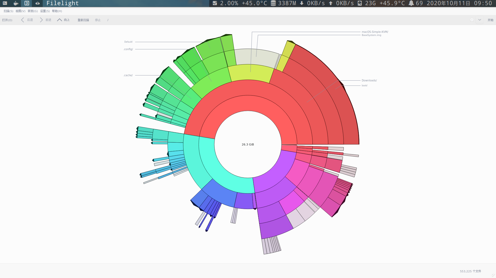
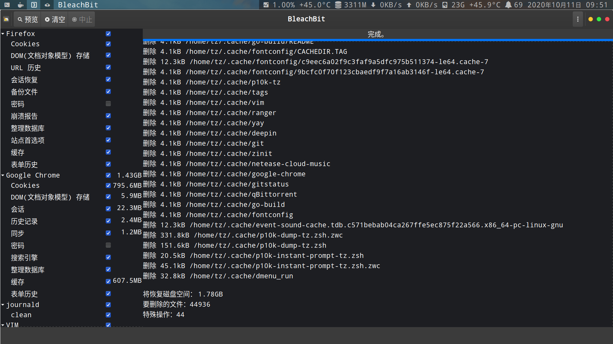
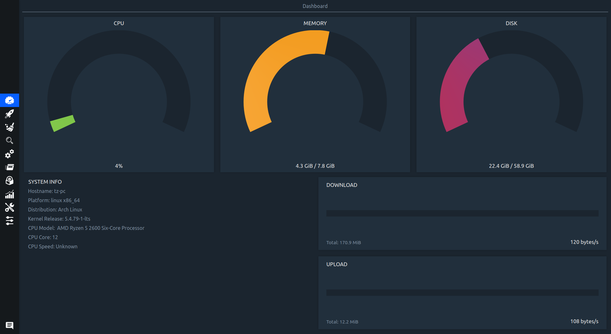
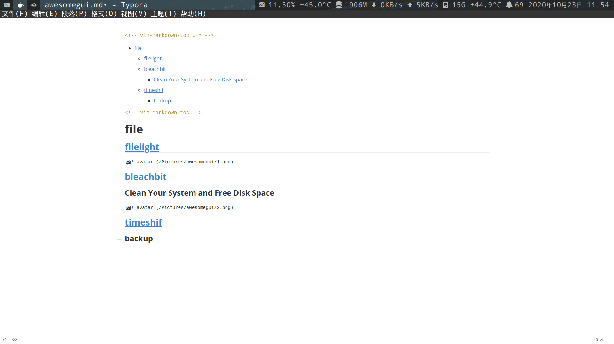

<!-- vim-markdown-toc GFM -->

* [file](#file)
    * [filelight](#filelight)
    * [bleachbit](#bleachbit)
        * [Clean Your System and Free Disk Space](#clean-your-system-and-free-disk-space)
    * [stacer](#stacer)
    * [timeshif](#timeshif)
        * [backup](#backup)
    * [typora](#typora)
    * [qimgv(图片查看器)](#qimgv图片查看器)
    * [pcmanfm(文件管理器)](#pcmanfm文件管理器)
    * [aliyunpan(阿里云盘)](#aliyunpan阿里云盘)
* [other](#other)
    * [ToDesk(手机电脑投屏幕)](#todesk手机电脑投屏幕)
    * [sunloginclient(向日葵运程控制gui版)](#sunloginclient向日葵运程控制gui版)
* [其他项目](#其他项目)
    * [linux 下的惬意生活](#linux-下的惬意生活)

<!-- vim-markdown-toc -->

# file

## [filelight](https://kde.org/applications/en/filelight)

## [bleachbit](https://www.bleachbit.org/)

### Clean Your System and Free Disk Space

## [stacer](https://github.com/oguzhaninan/Stacer)

## [timeshif](https://github.com/teejee2008/timeshift.png)

### backup

## [typora](https://www.typora.io/)

## [qimgv(图片查看器)](https://github.com/easymodo/qimgv)

## pcmanfm(文件管理器)

## [aliyunpan(阿里云盘)](https://github.com/liupan1890/aliyunpan)

# other

## [ToDesk(手机电脑投屏幕)](https://github.com/ji4ozhu/ToDesk)

## [sunloginclient(向日葵运程控制gui版)](https://sunlogin.oray.com/download)

# 其他项目

## [linux 下的惬意生活](https://github.com/yangyangwithgnu/the_new_world_linux#%E7%9B%AE%E5%BD%95)
