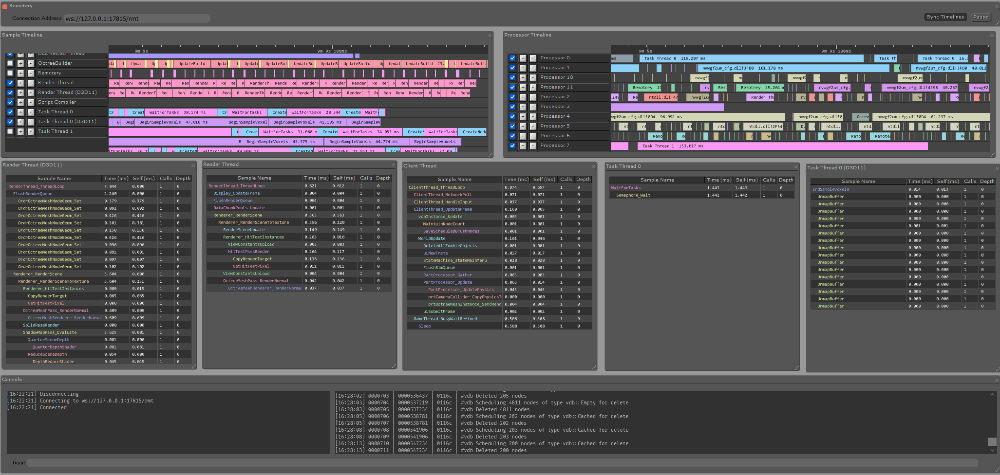

<!-- vim-markdown-toc GFM -->

* [分析方法](#分析方法)
    * [CPU 使用有问题？](#cpu-使用有问题)
    * [内存使用有问题？](#内存使用有问题)
    * [磁盘 I/O 使用有问题？](#磁盘-io-使用有问题)
    * [网络 I/O 使用有问题？](#网络-io-使用有问题)
* [性能](#性能)
    * [基准测试](#基准测试)
    * [性能指标](#性能指标)
    * [性能调优](#性能调优)
        * [tuned性能调优工具](#tuned性能调优工具)
        * [cpu优化](#cpu优化)
* [基本说明](#基本说明)
* [all-have 综合](#all-have-综合)
    * [top命令](#top命令)
        * [逐行解释top命令](#逐行解释top命令)
    * [flent：可以同时运行多个 netperf/iperf/ping 实例并聚合结果，通过交互式 GUI 和可扩展的绘图功能展示数据，支持本地和远程主机，支持采集 CPU 使用率、WiFi、qdisc 和 TCP 套接字统计信息等。](#flent可以同时运行多个-netperfiperfping-实例并聚合结果通过交互式-gui-和可扩展的绘图功能展示数据支持本地和远程主机支持采集-cpu-使用率wifiqdisc-和-tcp-套接字统计信息等)
    * [sysbench](#sysbench)
    * [vmstat](#vmstat)
    * [dstat](#dstat)
    * [sar(sysstat)](#sarsysstat)
    * [sadf(sysstat)](#sadfsysstat)
    * [nmon：tui观察系统资源，以及压测时的图表统计](#nmontui观察系统资源以及压测时的图表统计)
    * [sysbench](#sysbench-1)
    * [below](#below)
    * [tiptop](#tiptop)
    * [bottom](#bottom)
    * [Remotery：cpu和gpu](#remoterycpu和gpu)
* [CPU](#cpu)
    * [cpu info](#cpu-info)
    * [mpstat(sysstat)：单独监测单个 CPU 情况](#mpstatsysstat单独监测单个-cpu-情况)
    * [获取保留两位小数的 CPU 占用率：](#获取保留两位小数的-cpu-占用率)
    * [taskset (进程绑定 cpu)](#taskset-进程绑定-cpu)
    * [hyperfine: 高级time命令](#hyperfine-高级time命令)
* [Memory](#memory)
    * [smem](#smem)
    * [hugepage(巨型页)](#hugepage巨型页)
    * [KSM](#ksm)
    * [base](#base)
    * [pmap](#pmap)
    * [slabtop：内核内存](#slabtop内核内存)
    * [bytehound](#bytehound)
* [Net](#net)
    * [TCP/UDP](#tcpudp)
        * [tplist(bcc)](#tplistbcc)
    * [IP](#ip)
        * [nstat(iproute2)](#nstatiproute2)
    * [iperf3](#iperf3)
    * [masscan](#masscan)
    * [iftop](#iftop)
    * [nethogs](#nethogs)
    * [bmon](#bmon)
    * [speedometer](#speedometer)
    * [httpstat](#httpstat)
    * [bandwhich: tui](#bandwhich-tui)
    * [iptraf-ng：统计端口收发包（tui）](#iptraf-ng统计端口收发包tui)
* [Web](#web)
    * [ab：web 压力测试](#abweb-压力测试)
    * [httperf](#httperf)
* [File](#file)
    * [VFS](#vfs)
        * [cache](#cache)
            * [cachetop(bcc)](#cachetopbcc)
            * [cachestat(bcc)](#cachestatbcc)
            * [pcstat](#pcstat)
            * [hcache](#hcache)
        * [opensnoop(bcc)](#opensnoopbcc)
        * [fileslower(bcc)](#fileslowerbcc)
    * [File system](#file-system)
    * [Block devices interface](#block-devices-interface)
        * [iostat(sysstat)：显示各个进程、线程的磁盘读取实时速率](#iostatsysstat显示各个进程线程的磁盘读取实时速率)
        * [biosnoop(bcc)](#biosnoopbcc)
* [Disk](#disk)
    * [inotify-tools](#inotify-tools)
    * [blktrace](#blktrace)
    * [btrace](#btrace)
    * [dd](#dd)
        * [WoeUSB-ng: 安装windows iso](#woeusb-ng-安装windows-iso)
    * [hdparm](#hdparm)
    * [agedu](#agedu)
        * [只统计.conf 文件](#只统计conf-文件)
* [Process](#process)
    * [ps命令](#ps命令)
    * [htop](#htop)
    * [bpytop](#bpytop)
    * [btop](#btop)
    * [bottom](#bottom-1)
    * [Procmon](#procmon)
    * [SysMonTask](#sysmontask)
    * [pidstat：对某个进程进行全面具体的追踪](#pidstat对某个进程进行全面具体的追踪)
* [开机](#开机)
    * [bootchart](#bootchart)
* [Special file system](#special-file-system)
    * [proc](#proc)
        * [`/proc/stats`](#procstats)
        * [`/proc/<pid>/syscall`(系统调用)](#procpidsyscall系统调用)
        * [`proc/locks`(当前被锁的文件)](#proclocks当前被锁的文件)
        * [`/proc/zoneinfo`(内存碎片)](#proczoneinfo内存碎片)
    * [sys](#sys)
        * [cgroup(进程组资源限制)](#cgroup进程组资源限制)
        * [debugfs](#debugfs)
        * [查看 `cpu` 的缓存](#查看-cpu-的缓存)
        * [查看 `I/O Scheduler(调度器)` 的缓存](#查看-io-scheduler调度器-的缓存)
* [GPU](#gpu)
    * [nvidia-smi](#nvidia-smi)
    * [nvtop](#nvtop)
    * [gpustat](#gpustat)
    * [gmonitor](#gmonitor)
* [Debug](#debug)
    * [strace](#strace)
    * [eBPF](#ebpf)
        * [bcc](#bcc)
            * [stackcount](#stackcount)
    * [perf-tool](#perf-tool)
        * [perf list](#perf-list)
        * [perf stat](#perf-stat)
        * [perf record](#perf-record)
        * [perf sched](#perf-sched)
        * [perf other](#perf-other)
    * [enhance pstree (进程树)](#enhance-pstree-进程树)
    * [trace-cmd](#trace-cmd)
* [reference](#reference)

<!-- vim-markdown-toc -->

# 分析方法

- [腾讯云开发者：程序员必备Linux性能分析工具和方法](https://mp.weixin.qq.com/s/B845AYy-TjOU2IXOgsRcSQ)

## CPU 使用有问题？

- 使用 top 等命令查看 CPU 使用率和负载是否过高。

- 1.内核空间占了大多数 CPU？

    - 通过 `top` 命令查看内核占用 CPU 比例是否过大。

- 2.内核处理了很多中断吗？

    - 使用 `procinfo` 或 `cat /proc/interrupts` 查看中断次数和频率，以及造成中断数量较高的设备。

- 3.内核的时间花在哪了？

    - 使用 `oprofile` 分析哪些内核函数消耗大量时间，并查询这些函数的功能，确定它们处于哪个子系统（内存、网络、磁盘等）并了解可能被调用的原因。如果这些函数是设备特定的，尝试着找出为什么需要使用这种特定的设备（尤其是在1.2中造成高中断的设备），或许就可以判断出哪里出了问题。

- 4.用户空间占了大多是 CPU？

    - 通过 `top` 命令查看用户态是否占了大量 CPU。

- 5.哪个进程占用了大多数 CPU？

    - 通过 `top` 命令进程排序列表确定占用大量 CPU 的进程。

- 6.进程在内核还是用户空间花费了时间？

    - 使用 `time` 命令查看进程在内核和用户空间花费的时间，这里不一定非得任意一方非得占大多数时间。如进程在内核占用超过25%以上的时间，说明内核也排查是重点。

- 7.进程在哪些系统调用上花费了较多时间？

    - 使用 `strace` `oprofile` 查看进程调用了哪些系统调用和找出主要耗时时长的系统调用，通过减少系统调用次数或者更改性能更好的系统调用来提升性能。

- 8.进程在哪些函数上花费了时间？

    - 使用 `ltrace` `oprofile` 确定哪些函数消耗了大多数时间。如果函数调用次数过多，则检查是否存在不必要的调用次数，如 for 循环判断条件里不断调用某个函数或者 debug 日志里调某个函数得到一个字符串序列。如果单次调用就已经很耗时，使用 oprofile/cachegrind 分析函数是否存在热点代码大量 cache 缺失，通过调整数据结构或调整代码提高热点代码 cache 命中。

## 内存使用有问题？

- 通过 top/vmstat/procinfo 等确定内存使用是否过高，内存交换空间不断增加。

- 1.内核使用内存在增加？

    - 使用 `slabtop` 查看内核使用内存是否增加或者使用量过大。

- 2.内核使用的内存类型是什么？

    - 使用 `slabtop` 排序内核使用内存情况，找出使用内存较大的对象名字。通过搜索或查询相关分配对象名字（如 inode_cache），确定它用于哪些文件或属于哪个子系统，就有可能弄清楚内存分配的原因。

- 3.进程使用内存在增加？

    - 使用 `top` `ps` 按内存使用量排序并观察 rss 等字段看进程使用物理内存是否增加。

- 4.进程使用的内存类型是什么？

    - 通过 /proc/<pid>/status 查看内存使用情况。
        - VmExe 值很大，则说明可执行文件本身很大，需要确定哪些函数文本比较大。
        - VmLib 很大，则说明应用程序使用了大量或者体积比较大的共享库，需要确定哪些库导致了 VmLib 很大。
        - VmData 较大并在增加，说明进程的数据区或堆在增加。

- 5.哪些函数使用大量的栈空间？

    - 使用 `gdb attach` 进程，根据调用栈信息计算当前栈指针和前一个栈指针的差值，这个差值即为函数的栈容量，找到栈容量比较大的函数。

- 6.哪些函数分配大量的堆内存？

    - 使用`memprof`找到哪些函数分配了堆内存并观察哪些进程的堆内存在增加，确定是否存在不合理的分配或者内存泄漏问题。

- 7.哪些库比较大？

    - 通过 /proc/<pid>/maps 查看进程使用了哪些共享库和以及这些库的大小，对于太大的共享库是否可能替换成大小更小的版本。或者某个库已经被其他进程加载到内存使用，只是版本不同，则可以改成共用一个版本。

- 8.哪些函数文本较大？

    - 如果进程的可执行文件本身比较大，加载到内存后会占用更多的空间。可以通过 `nm` 命令排序符号大小，找出文本段较大的函数看是否可以删除或者减小其大小。

- 9.共享内存使用量在增加？

    - 使用 `ipcs` 查看共享内存信息，是否存在过大或者共享内存数量不断增加。

- 10.哪个进程在使用共享内存？

    - 使用 `ipcs -p` 查看哪些进程创建和使用了共享内存。对于共享内存过大问题，可以查看其程序代码看分配是否合理。对于共享内存数不断增加，是否存在创建后未删除等问题。

## 磁盘 I/O 使用有问题？

- 运行 iostat，查看 await 平均等待时间，await 越高则说明磁盘负荷越大。

- 1.哪个进程访问了磁盘？

    - 通过 `iotop` 找到产生大量 IO 的进程。

- 2.进程访问了哪些文件？

    - 通过 strace 跟踪高 IO 进程与文件操作相关的系统调用，查看其调用详情和耗时时长，找到耗时长的读写操作。并通过其操作的文件描述符 fd 映射回磁盘上的文件，了解为什么需要读写这些文件，进而查看是否可以优化。

## 网络 I/O 使用有问题？

- 使用 ethool 查看网卡的最大流量限制 ，并通过 iptraf-ng 查看流经端口的流量是否饱和。

- 1.网络设备产生了大量错误？

    - 使用 `ifconfig` `ip` 命令查看网络接口是否产生大量错误，如果是可能是硬件配置的有问题，联系网管帮忙排查解决。

- 2.网络设备存流量类型是什么？

    - 使用 `iptraf-ng` 查看流量类型（协议/端口号）。

是否有进程处理该类型的流量？

使用 netstat 查看是否有进程在流经该网络端口的流量。

哪个远程系统发送了流量？

如果没有指定进程在处理这个流量，可能来自网络上其他系统的流量攻击。可使用 etherape/wireshark 尝试跟踪或者找网管咨询。

哪个套接字在处理流量？

在确定了处理流量的进程后，使用 strace/lsof 找到是哪个套接字产生了这些通信流量。

# 性能

## 基准测试

- [北大未名超算队 高性能计算入门讲座（七）:CPU和GPU上的性能分析](https://www.bilibili.com/list/watchlater?oid=538893258&bvid=BV1oi4y1i7Ef)

## 性能指标


- 响应时间（RT）：
    - P50表示响应时间的中位数，即有一半的请求在400毫秒以下完成。
    - P90表示90%的请求在1200毫秒以下完成。
    - P99表示99%的请求在2000毫秒以下完成。

- 并发数：同一时间点请求服务器的用户数。通过并发连接或线程进行模拟

- 吞吐量（TPS/QPS）：每秒处理的事务数，一个事务对一次请求响应的过程

    - 吞吐量=并发数/响应时间

    - 拿 5% 来计算，就是 10000 用户 x5%=500(TPS)，注意哦，这里是 TPS，而不是并发线程数。如果这时响应时间是 100ms，那显然并发线程数是 500TPS/(1000ms/100ms)=50(并发线程)。

- 最佳线程数计算：

    - 单线程的场景QPS公式：QPS=1/RT，实际上RT应该=CPU time + CPU wait time，如果将线程数提高到2，那么`QPS=2/(CPU time + CPU wait time)`

    - 假设CPU time是49ms，CPU wait time是200ms，那么QPS=1000ms/249ms=4.01

        - 200ms的wait时间我们可以认为CPU一直处于等待状态啥也没干，理论上来说200ms还可以接受200/49≈4个请求，不考虑上下文切换和其他开销的话，可以认为总线程数=(200+49)/49=5

        - 如果再考虑上CPU多核和利用率的问题，我们大致可以认为：最佳线程数=`RT/CPUTime * CPU核心数 * CPU利用率`

- 最大QPS=最佳线程数*单线程QPS=（RT/CPU Time * CPU核心数 * CPU利用率）*（1/RT) = CPU核心数*CPU利用率/CPUTime

- 压测还需要关注：系统资源用量，响应错误率等

- 一般测试方法：逐步加大系统的并发数，观察系统性能指标变化以及拐点的出现
    - 当并发数达到一定的数量后，系统的吞吐量开始呈现平稳的趋势，当压力持续增大，并超过系统负荷之后，吞吐量反而会降低，此时也伴随着响应时间的增大

    

## 性能调优

### tuned性能调优工具

- tuned是RedHat开发的一个性能调优工具，它会根据不同的需求、参数提供“最合适”的效能，如省电方案、高网络吞吐方案、低延迟方案等，例如使用它的客户端可以看到所有支持的策略。

- 查看所有策略。最后一行代表，当前使用的策略（默认为balanced）
```sh
tuned-adm  list
```

- 查看balanced的配置

    ```sh
    cat /usr/lib/tuned/profiles/balanced/tuned.conf
    [cpu]
    priority=10
    governor=conservative|powersave
    energy_perf_bias=normal
    energy_performance_preference=balance_performance
    ```

    - `energy_perf_bias` 参数决定了 CPU 性能和功率的平衡。

        - `performance` 模式下，CPU 会倾向于提供更高的性能，这意味着它会消耗更多的功率。

        - `normal` 模式下，CPU 会倾向于更多地考虑功率节约，这会导致性能稍微降低。

### cpu优化

- [Redis开发运维实战：Redis机器CPU异常降频问题梳理](https://mp.weixin.qq.com/s/s98d9KL2t7PkZJLFqqQjFA)

- CPU功耗管理有以下几种模式：

| 模式         | 说明                                                                                            |
|--------------|-------------------------------------------------------------------------------------------------|
| performance  | 运行于最大频率                                                                                  |
| powersave    | 运行于最小频率                                                                                  |
| userspace    | 运行于用户指定的频率                                                                            |
| ondemand     | 按需快速动态调整CPU频率， 一有cpu计算量的任务，就会立即达到最大频率运行，空闲时间增加就降低频率 |
| conservative | 按需快速动态调整CPU频率， 比 ondemand 的调整更保守                                              |
| schedutil    | 基于调度程序调整 CPU 频率                                                                       |

- 查看当前使用模式：
    ```sh
    cat /sys/devices/system/cpu/cpu0/cpufreq/scaling_available_governors
    performance powersave
    ```

- 修改使用模式：例如修改为performance
    ```sh
    cpupower frequency-set -g performance
    ```

- 查看详情
    ```sh
    cpupower frequency-info
    ```

- 优化cpu

    ```sh
    cpupower frequency-set -g performance
    cpupower idle-set -D 0
    ```

    - 在rc.local中添加：

        ```sh
        cpupower frequency-set -g performance
        cpupower idle-set -D 0
        tuned-adm profile throughput-performance
        ```

    - 以防万一tuned被重启

        - 修改/etc/tuned/tuned-main.conf
            ```
            dynamic_tuning = 0 #禁用动态调整。
            recommend_command = 0 #禁用推荐功能。
            ```

    - 修改/usr/lib/tuned/balanced/tuned.conf中改为

        ```
        governor=performance
        energy_perf_bias=performance
        ```

    - 修改`/usr/lib/tuned/recommend.conf`
        ```
        只保留[throughput-performance]，其他删除或者注释掉
        ```

# 基本说明

image from brendangregg:


data from brendangregg book: [Systems Performance](http://www.brendangregg.com/systems-performance-2nd-edition-book.html)

| 事件                        | 延时     | 相对时间比例 1s |
| --------------------------- | -------- | --------------- |
| 1 个 CPU 周期               | 0.3ns    | 1s              |
| L1 缓存访问                 | 0.9ns    | 3s              |
| L2 缓存访问                 | 2.8ns    | 9s              |
| L3 缓存访问                 | 12.9ns   | 43s             |
| 主存访问（从 CPU 访问 DRAM) | 120ns    | 6 分            |
| 固态硬盘 I/O（闪存）        | 50-150μs | 2-6 天          |
| 旋转磁盘 V/0                | 1-10ms   | 1-12 月         |
| 互联网：从旧金山到纽约      | 40ms     | 4 年            |
| 互联网：从旧金山到英国      | 81ms     | 8 年            |
| 互联网：从旧金山到澳大利亚  | 183ms    | 19 年           |
| TCP 包重传                  | 1-3s     | 105-317 年      |
| OS 虚拟化系统重启           | 4s       | 423 年          |
| SCSI 命令超时               | 30s      | 3 千年          |
| 硬件處担化系统典鞋！        | 40s      | 4 千年          |
| 物理系统重启                | 5m       | 32 千年         |

以下表示: sar 命令是 `sysstat` 包,biosnoop 是 `bcc` 包

- sar(sysstat)
- biosnoop(bcc)

计数器:几乎没有开销,在内核默认就是开启的,一般在 `/proc` 上进行读取

- sar
- vmstat
- iostat
- netstat

追踪:类似调试器,开销大

- perf
- bcc
- tcpdump
- strace

# all-have 综合

## top命令

- [咸鱼运维杂谈：聊聊 Linux iowait](https://mp.weixin.qq.com/s/LMUp0IYrAzBf1QNIGXXq2A)

- top命令实时显示系统中各个进程的资源占用情况，包括CPU使用率、内存占用、运行时间等信息。

```sh
# 看到多个核，每个核的cpu的使用情况
top -1

# 查看某个进程下的线程资源使用情况
top -H -p pid值
```
### 逐行解释top命令

- [鹅厂架构师：性能分析入门：使用top命令分析Linux系统性能](https://zhuanlan.zhihu.com/p/685911924)

```sh
top - 11:22:43 up  2:21,  2 users,  load average: 0.70, 0.80, 0.96
Tasks: 374 total,   2 running, 372 sleeping,   0 stopped,   0 zombie
%Cpu(s):  0.5 us,  0.6 sy,  0.0 ni, 98.4 id,  0.0 wa,  0.5 hi,  0.0 si,  0.0 st
MiB Mem :  12774.9 total,    539.1 free,   7911.2 used,   4979.5 buff/cache
MiB Swap:   4096.0 total,   4095.7 free,      0.2 used.   4863.7 avail Mem

    PID USER      PR  NI    VIRT    RES    SHR S  %CPU  %MEM     TIME+ COMMAND
   1499 tz        20   0 5018652 282796 184412 S   6.6   2.2   7:24.33 netease-cloud+
    903 root      20   0 1183828 146996  97512 S   3.0   1.1   6:37.93 Xorg
```

- 第一行：`top - 11:22:43 up  2:21,  2 users,  load average: 0.70, 0.80, 0.96`
    - 显示当前时间，系统运行时间，登录用户数，以及过去1分钟、5分钟和15分钟的系统负载平均值。

- 第二行： `Tasks: 374 total,   2 running, 372 sleeping,   0 stopped,   0 zombie`
    - 统计了系统的任务状态信息
        - running 很自然不必多说，包括正在 CPU 上运行的和将要被调度运行的；
        - sleeping 通常是等待事件(比如 IO 操作)完成的任务
            - 细分可以包括 interruptible 和 uninterruptible 的类型；
        - stopped 是一些被暂停的任务，通常发送 SIGSTOP 或者对一个前台任务操作 Ctrl-Z 可以将其暂停；
        - zombie 僵尸任务，虽然进程终止资源会被自动回收，但是含有退出任务的 task descriptor 需要父进程访问后才能释放，这种进程显示为 defunct 状态，无论是因为父进程提前退出还是未 wait 调用，出现这种进程都应该格外注意程序是否设计有误。


- 第三行： `%Cpu(s):  0.5 us,  0.6 sy,  0.0 ni, 98.4 id,  0.0 wa,  0.5 hi,  0.0 si,  0.0 st`


    | 参数 | 说明              |
    |------|-------------------|
    | us   | "user CPU time"   |
    | sy   | "system CPU time" |
    | ni   | "nice CPU time"   |
    | id   | "idle"            |
    | wa   | "iowait"          |
    | hi   | "hardware irq"    |
    | si   | "software irq"    |
    | st   | "steal time"      |

    | 参数 | 说明                                                                                                                                                                                                                                                                                     |
    |------|------------------------------------------------------------------------------------------------------------------------------------------------------------------------------------------------------------------------------------------------------------------------------------------|
    | us   | 用户空间占用CPU百分比                                                                                                                                                                                                                                                                    |
    | sy   | 内核空间占用CPU百分比 --sy比较大的时候，是否有多线程操作，排查有没有死锁，当服务器执行的 IO 比较密集的时候，该值会比较大                                                                                                                                                                                                                 |
    | ni   | 用户进程空间内改变过优先级的进程占用CPU百分比 --nice值是用于调整进程优先级的参数，范围从-20到+19，其中-20表示最高优先级，+19表示最低优先级，只影响CPU调度的优先级，而不是实际的性能。它只是一种相对的优先级调整机制，具体的CPU时间分配还受到其他因素的影响，如系统负载、实时性要求等。 |
    | id   | 空闲CPU百分比，表示CPU在这段时间内没有执行任何任务。                                                                                                                                                                                                                                     |
    | wa   | 等待输入输出的CPU时间百分比 如果wa%>5,IO已经成为瓶颈                                                                                                                                                                                                                                     |
    | hi   | 硬件中断 硬中断是由硬件设备（例如网络适配器或磁盘驱动器）发出的信号，通知CPU有紧急任务需要处理                                                                                                                                                                                           |
    | si   | 软件中断 软中断是由内核产生的信号，用于处理非紧急任务，如网络数据包的处理。记住软中断分为 softirqs、tasklets (其实是前者的特例)、work queues，不知道这里是统计的是哪些的时间，毕竟 work queues 的执行已经不是中断上下文了                                                                                                                                                                                                              |
    | st   | 在虚拟化环境中才有意义，表示虚拟CPU在等待真实CPU的时间。                                                                                                                                                                                                                   |


- 第四行： `MiB Mem :  12774.9 total,    539.1 free,   7911.2 used,   4979.5 buff/cache`


    | 参数           | 说明                           |
    |----------------|--------------------------------|
    | "total"        | 表示系统的总内存大小           |
    | "used"         | 表示当前已使用的内存大小       |
    | "free"         | 表示当前可用的空闲内存大小     |
    | "buffer/cache" | 表示被系统用于缓冲区的内存大小 |

    - total = free + used + buff/cache

    - buffers和cached Mem 对应 `/proc/meminfo` 中的 Buffers 和 Cached 字段

        - Buffers 是针对 raw disk 的块缓存，主要是以 raw block 的方式缓存文件系统的元数据(比如超级块信息等)，这个值一般比较小(20M左右)；
        - Cached 是针对于某些具体的文件进行读缓存，以增加文件的访问效率而使用的，可以说是用于文件系统中文件缓存使用。

    - avail Mem 大致和 free + buff/cached 相当
        - 用于指示在不进行交换的情况下，可以给新开启的程序多少内存空间，

- 第五行： `MiB Swap:   4096.0 total,   4095.7 free,      0.2 used.   4863.7 avail Mem`

    - "KiB Swap: 0 total"：表示系统的总交换空间大小为0 KiB，即没有设置交换空间。
    - "0 free"：表示当前可用的空闲交换空间大小为0 KiB，即没有可用的交换空间。
    - "0 used"：表示当前已使用的交换空间大小为0 KiB，即没有使用交换空间。
    - "6291892 avail Mem"：表示系统可用的内存大小为6291892 KiB，即系统当前可用的物理内存大小。

    - 缓冲区（buffer）是磁盘虚拟出来的一个缓冲区，用于临时存储数据的内存区域。它用于在数据传输过程中临时存储数据，以提高数据传输的效率和性能
    - 缓存（cache）是一种用于存储临时数据的高速存储器，通常位于内存和CPU之间。它的目的是提高数据访问的速度和效率；
    - 交互分区（swap partition）是一种在硬盘上划分的用于交换内存空间的特定分区，它也是由磁盘虚拟而来，一般为物理内存的1.5倍到2倍
    - 任何一个程序启动，都会在内存中占用：虚拟内存和 物理内存


- 第七行以下：各进程（任务）的状态监控，列信息说明如下：

    | 参数    | 说明                                                                            |
    |---------|---------------------------------------------------------------------------------|
    | PID     | 进程ID，唯一标识一个进程                                                        |
    | USER    | 进程所有者，即运行该进程的用户                                                  |
    | PR      | 进程优先级，表示进程在调度时的优先级，PR值是根据进程的nice值计算 越小优先级越高
    | NI      | nice值，用于调整进程的优先级                                                    | 负值表示高优先级，正值表示低优先级                                                         |
    | VIRT    | 进程使用的虚拟内存总量，以千字节（KB）为单位                                    | VIRT = SWAP + RES                                                                          |
    | RES     | 进程使用的未被换出的物理内存大小，以千字节（KB）为单位                          | RES = CODE + DATA                                                                          |
    | SHR     | 共享内存大小，以千字节（KB）为单位                                              |
    | S       | 进程状态                                                                        | 常见的状态包括D（不可中断的睡眠状态）、R（运行）、S（睡眠）、T（跟踪/停止）和Z（僵尸进程） |
    | %CPU    | 进程在上次更新到现在的CPU时间占用百分比                                         |
    | %MEM    | 进程使用的物理内存占总内存的百分比                                              |
    | TIME+   | 进程占用的CPU时间总计，以1/100秒为单位                                          |
    | COMMAND | 进程名称，即进程的命令名或命令行                                                |

- 进程状态（S）

    

    - 1.R：可执行状态（runnable），表示进程正在被 CPU 执行或者处在 CPU 队列中等待分配 CPU 时间片。
    - 2.S：可中断睡眠状态（interrupted sleep），表示进程处于睡眠状态，当特定条件或者信号到达时，就会被唤醒，状态也由 S 变成 R。
    - 3.D：不可中断睡眠状态（uninterrupted sleep），跟状态 S 类似，只是进程在接收到信号时不会被唤醒。这类状态的进程一般在等待 I/O 结束。
    - 4.Z：僵尸状态（zombie），表示进程已经终止（死透了），但父进程还没有发出 wait4() 系统调用去读取它的结束信息。（可以理解为进程死【终止】后 父进程要给它收尸【获取该进程的终止状态】）
    - 5.T：暂停状态（stopped），表示进程已经暂停（还没死透），是可以恢复的（比如我们给进程发送 SIGSTOP 或者按 CTRL+Z，就可以将进程置为暂停状态，可以通过 bg/fg 命令，或者发送 SIGCONT 信号恢复。）

- CPU状态：user，sys，idle，iowait

    - sar、top会用百分比表示 CPU 分别处于这四种状态的时间，这四种状态相加的结果是 100%。

    - 上面提到的 4 种 CPU 状态，其实只有 2 种：

        - 1.工作/忙碌（busy）
        - 2.非工作/空闲（idle）

    - 其中 busy 状态下又分成了：

        - 1.user：表示 CPU 目前正在执行用户空间的代码
        - 2.system：表示 CPU 目前正在执行内核空间的代码

    - idle 状态下又分成了：

        - idle：系统中没有 R 状态的进程了

        - iowait：系统中没有 R 状态的进程但有进程卡在 I/O 上

            - iowait 很低，不能代表进程没有阻塞在 I/O 上。

            - 实验

                - 假设有一个进程需要花 70% 的时间等待 I/O 完成，把它放到一个空闲的单 CPU 的系统中，显示的 iowait 是 70%。

                - 但是我在这个系统中增加一个非 I/O 的计算任务，iowait 就变成 0 了。而我们之前的那个进程依然需要花 70% 的时间等待 I/O。

                ```sh
                # 使用dd命令，提高iowait。对应top中的wa
                taskset 1 dd if=/dev/sda of=/dev/null bs=1MB

                # 此时 CPU 就没有精力处理其他任务了呢？我们再输入下面这条命令：执行一个死循环，用于模拟计算密集型任务。
                taskset 1 sh -c "while true; do true; done"

                # 可以看到：CPU0 的 wa 降低为 0 了，与此同时 us 和 sy 的时间占比接近 100% 。CPU 在 iowait 状态的时候能执行了其他任务。但这就说明 dd 命令产生的进程没有阻塞在 I/O 上吗？并不是。
                ```

## [flent：可以同时运行多个 netperf/iperf/ping 实例并聚合结果，通过交互式 GUI 和可扩展的绘图功能展示数据，支持本地和远程主机，支持采集 CPU 使用率、WiFi、qdisc 和 TCP 套接字统计信息等。](https://github.com/tohojo/flent)

- [官方文档](https://flent.org/contents.html)

- 安装
```sh
# 安装netperf和fping
sudo pacman -S netperf fping

# 安装flent
pip install flent matplotlib
```

- 基本使用
```sh
# 在本地主机运行netperf
netserver &

# all_scaled。-H为指定开启netserver的主机；-l为收集时间为60秒。以下命令会生成filename.png和rrul-2024-02-03T230134.682312.text-to-be-included-in-plot.flent.gz
flent rrul -p all_scaled -l 60 -H 127.0.0.1 -t text-to-be-included-in-plot -o filename.png

# ping_cdf。
flent rrul -p ping_cdf -l 60 -H 127.0.0.1 -t text-to-be-included-in-plot -o filename.png

# tcp_upload。
flent tcp_upload -p totals -l 60 -H 127.0.0.1 -t text-to-be-included-in-plot -o filename.png

# tcp_upload。
flent tcp_upload -p totals -l 60 -H 127.0.0.1 -t text-to-be-included-in-plot -o filename.png

# tcp_download。
flent tcp_download -p totals -l 60 -H 127.0.0.1 -t text-to-be-included-in-plot -o filename.png
```

## sysbench

cpu:

```bash
# 设置10个线程,计算1000000个质数
sysbench --num-threads=10 --test=cpu --cpu-max-prime=10000 run
```

## vmstat

建议使用 `dstat`

| 选项 | 操作                     |
| ---- | ------------------------ |
| si   | 匿名页换入内存           |
| so   | 匿名页换出交换设备       |
| pi   | 所有类型的页换入内存     |
| po   | 所有类型的页换出交换设备 |

```bash
vmstat 1

# MB显示
vmstat 1 -Sm
```

## [dstat](http://dag.wiee.rs/home-made/dstat/)

- 已经被[dool](https://github.com/scottchiefbaker/dool)取代

| 参数          | 监控选项                     |
| ------------- | ---------------------------- |
| --list        | 列出监控选项                 |
| -c            | cpu                          |
| -n            | net                          |
| -d            | disk                         |
| -m            | memory                       |
| -p            | process                      |
| -g            | page                         |
| -l            | load 等同于 uptime           |
| -t            | time                         |
| --top-cpu     | cpu 使用率最高的进程         |
| --top-io      | io 使用率最高的进程          |
| --top-bio     | bio 使用率最高的进程         |
| --top-memory  | memory 使用率最高的进程      |
| --top-latency | 延迟最高的进程               |
| --top-cpu-adv | 进程的 cpu 使用率,read,write |
| --float       | 小数显示                     |
| --output      | 输出                         |
| -D            | 选择硬盘                     |
| -N            | 选择网卡                     |

```bash
# 以 vmstat 格式显示
dstat --vmstat

# 显示cpu,硬盘,网络,cpu使用率最高的进程,memory使用率最高的进程
dstat -cdn --top-cpu --top-mem

# 小数显示
dstat -cdn --top-cpu --top-mem --float

# 每 2 秒(默认是 1 秒)输出, 一共 5 次
dstat -cdn --top-cpu --top-mem --float 2 5

# 显示 5 次,输出time,load,保存为 csv 文件
dstat --time --load --output report.csv 1 5
```

```bash
# 选择 sda1 硬盘
dstat -d -D sda1
```

## sar(sysstat)

image from brendangregg:


| 参数 | 操作           |
| ---- | -------------- |
| -u   | 使用率         |
| -P   | 核心           |
| -b   | IO             |
| -B   | 内存速率       |
| -W   | 交换分区速率   |
| -r   | 内存和交换分区 |
| -d   | 硬盘(块设备)   |
| -I   | 中断           |
| -n   | 网络           |
| -x   | 进程(pid)      |
| -q   | 进程负载       |

from brendangregg:

| 参数 | 统计内容  | 描述                                                                                   | 单位      |
| ---- | --------- | -------------------------------------------------------------------------------------- | --------- |
| -B   | pgpgin/s  | 页面换入单位                                                                           | 千字节/秒 |
| -B   | pgpgout/s | 页面换出                                                                               | 千字节/秒 |
| -B   | fault/s   | 严重及轻微缺页                                                                         | 次数/秒   |
| -B   | majflt/s  | 严重缺页                                                                               | 次数/秒   |
| -B   | pgfree/s  | 页面加入空闲链表                                                                       | 次数/秒   |
| -B   | pgscank/s | 被后台页面换出守护进程扫描过的页面（kswapd）                                           | 次数/秒   |
| -B   | pgscand/s | 直接页面扫描                                                                           | 次数/秒   |
| -B   | pgsteal/s | 页面及交换高速缓存回收                                                                 | 次数/秒   |
| -B   | %vmeff    | 页面盗取/页面扫描比率，显示页面回收的效率                                              | 百分比    |
| -H   | hbhugfree | 空闲巨型页面存储器（大页面尺寸）                                                       | 千字节    |
| -H   | hbhugused | 占用的巨型页面存储器                                                                   | 千字节    |
| -r   | kbmemfree | 空闲存储器                                                                             | 千字节    |
| -r   | kbmemused | 占用存储器（不包括内核）                                                               | 千字节    |
| -r   | kbbuffers | 缓冲高速缓存尺寸                                                                       | 千字节    |
| -r   | kbcached  | 页面高速缓存尺寸                                                                       | 千字节    |
| -r   | kbcommit  | 提交的主存储器：服务当前工作负载需要量的估计                                           | 千字节    |
| -r   | %commit   | 为当前工作负载提交的主存储器，估计值                                                   | 百分比    |
| -r   | kbactive  | 活动列表存储器尺寸                                                                     | 千字节    |
| -r   | kbinact   | 非活动列表存储器尺寸                                                                   | 千字节    |
| -R   | frpg/s    | 释放的存储器页面，负值表明分配                                                         | 页面/秒   |
| -R   | bufpg/s   | 缓冲高速缓存增加值（增长）                                                             | 页面/秒   |
| -R   | campg/    | 页面 高速缓存增加值（增长）                                                            | 页面/秒   |
| -S   | kbswpfree | 释放交换空间                                                                           | 千字节    |
| -S   | kbswpused | 占用交换空间                                                                           | 千字节    |
| -S   | kbswpcad  | 高速缓存的交换空间：它同时保存在主存储器和交换设备中，因此不需要磁盘 VO 就能被页面换出 | 千字节    |
| -W   | pswpin/s  | 页面换人（Linux 换人）                                                                 | 页面/秒   |
| -W   | pswpout/s | 页面换出（Linux 换出）                                                                 | 页面/秒   |

- 1 间隔时间
- 10 次数

```bash
# cpu使用率
sar -u 1 10
# 网络统计数据
sar -n DEV 1 10
sar -n EDEV 1 10
```

```bash
# 打印 cpu 序号为 5,7,1,3 核心的 cpu 使用率
sar -P 5,7,1,3 1

# 打印每个核心的cpu使用率
sar -P ALL 1 10

# 打印 idle 小于 10 的 cpu 核心
sar -P ALL 1 | tail -n+3 | awk '$NF<10 {print $0}'

# 打印所有中断的统计数据
sar -I ALL 1 10
```

- network

```sh
# 查看每秒收发包的情况（txkB/s是指当前每秒发送的字节（byte）总数，rxkB/s是指每秒接收的字节（byte）总数）
sar -n DEV 1
```


## sadf(sysstat)

多种方式显示 sar 数据

- [官方文档](http://sebastien.godard.pagesperso-orange.fr/man_sadf.html)

```bash
# 生成svg图片
sadf -g > test.svg
```

## nmon：tui观察系统资源，以及压测时的图表统计


```sh
# 每隔5s进行一次数据采集，采集10000次
nmon -s 5 -c 10000 -F result.nmon &

# 压测停止时，终止nmon
pkill nmon
```

## sysbench

```bash
# cpu测试,计算素数到某个最大值的时间
sysbench --test=cpu --cpu-max-prime=20000 run

# 文件I/O
sysbench --test=fileio --file-total-size=5G prepare
```

## [below](https://github.com/facebookincubator/below)


## [tiptop](https://github.com/nschloe/tiptop)

## [bottom](https://github.com/ClementTsang/bottom)

## [Remotery：cpu和gpu](https://github.com/Celtoys/Remotery)



# CPU

## cpu info

| 系统自带命令       | 操作内容            |
| ------------------ | ------------------- |
| more /proc/cpuinfo | 查看每个 cpu 的信息 |
| lscpu              | 查看简短 cpu 信息   |
| numactl --hardware | 查看 numa 信息      |

| 第三方命令   | 操作内容          |
| ------------ | ----------------- |
| cpuid        | 查看 cpu 指令集   |
| x86info -a   | 查看寄存器        |
| cpupower-gui | 查看设置 cpu 频率 |
| lstopo       | 如下图            |

lstopo:


| 硬件技术 | 内容                                                                                                     |
| -------- | -------------------------------------------------------------------------------------------------------- |
| NX       | 对内存里的指令存储和数据存储,进行标志区分(可防止缓冲区溢出攻击)                                          |
| SMEP     | CR3 寄存器 20 位(第 21 位)为 1 表示开启.cpl < 3 的程序不能访问用户模式(cpl=3)的内存指令,否则会发生 fault |
| SMAP     | SMEP 是禁止执行,SMAP 进一步补充,禁止读写                                                                 |
| AVX      | simd 单指令多数据                                                                                        |
| XSAVE    | guest 虚拟机动态迁移时,保存 AVX 寄存器的状态                                                             |

```bash
# 查看是否支持某项技术(这里列举nx,其他技术同理)
grep nx /proc/cpuinfo
```

## mpstat(sysstat)：单独监测单个 CPU 情况

| 参数    | 内容                               |
| ------- | ---------------------------------- |
| %usr    | 用户态时间                         |
| %sys    | 系统态时间（内核）                 |
| %nice   | 以 nice 优先级运行的进程用户态时间 |
| %iowait | I/O 等待                           |
| %irq    | 硬件中断 CPU 用量                  |
| %soft   | 软件中断 CPU 用量                  |
| %steal  | 耗费在服务其他租户的时间           |
| %guest  | 花在访客虚拟机的时间               |
| %idle   | 空闲                               |

```bash
# 每秒显示1次
mpstat 1

# 每秒显示1次,只显示10次
mpstat 1 10

# 指定显示的cpu0,cpu1
mpstat -P 0,1 1

# 显示的所有cpu0
mpstat -P ALL 1
```

## 获取保留两位小数的 CPU 占用率：

top -b -n1 | grep ^%Cpu | awk '{printf("Current CPU Utilization is : %.2f%"), 100-\$8}'

## taskset (进程绑定 cpu)

```bash
# 设置只能在cpu7-10上运行
taskset -pc 7-10 <pid>
```

设置 cpu 组,并分配进程

```bash
# 挂着cpuset
mkdir /dev/cpuset
mount -t cpuset cpuset /dev/cpuset
df /dev/cpuset

# 创建cpu组,名为nginx
mkdir /dev/cpuset/nginx
cd /dev/cpuset/nginx

# 绑定cpu7 到 10
echo 7-10 > cpus
echo 1 > cpu exclusive

# 分配进程
echo <pid> > tasks
```

## [hyperfine: 高级time命令](https://github.com/sharkdp/hyperfine)

# Memory

- [内存的基本知识](https://blog.heroix.com/blog/linux-memory-use)

| 概念                    | 内容                                                                               |
| ----------------------- | ---------------------------------------------------------------------------------- |
| major fault             | 要从磁盘载入内存页面(可能是由于读取已写入交换文件的内存页而导致的)                 |
| minor fault             | 不需要从磁盘读取其他数据到内存(可能是在多个进程之间共享内存页)                     |
| VSZ(虚拟内存)           | 不是真实内存,(包括共享内存,交换分区)                                               |
| RSS(常驻内存)           | 真实内存,当前映射到进程中的页面总数(包含共享内存,不包含交换内存)                   |
| PSS(比例内存)           | 进程内共享内存占总内存的比例                                                       |
| USS(独占内存)           | 进程独自占用的物理内存（不包含共享库占用的内存）                                   |
| 匿名内存                | 没有系统数据,文件路径名的内存                                                      |
| copy-on-write(写时复制) | 子进程被创建后,会共享父进程的全部内存,当子进程想要修改的时候,再单独分配一块新内存  |
| KSM(内存同页合并)       | ksmd 守护进程扫描内存,将相同的内存页合并为一页,当进程想要修改时,进行 copy-on-write |

查看进程内存的文件 `/proc/pid/smaps`

统计程序的 `RSS`:

```bash
awk '/Rss:/{ sum += $2 } END { print sum " KB" }' /proc/pid/smaps
```

## smem

```sh
# 程序的百分比占用
smem -p

# 指定程序
smem -k -P nginx

# 用户占用
smem -u
```

## hugepage(巨型页)

- 配置 `/sys/kernel/mm/hugepages/`

- 缺点:

  - 未分配的巨型页,会占用内存

  - 不能被 swap out

- 透明巨页

  - 优点:

    - 对于所有程序都是透明

    - 可以 swap out,会分割为普通的 4k 页

  - 缺点:
    - 只支持匿名内存

```bash
查看巨型页 分配
grep -i huge /proc/meminfo

# 查看巨型页 大小
ls /sys/kernel/mm/hugepages

# 查看巨型页 pool(池)
cat /sys/kernel/mm/hugepages/hugepages-2048kB/nr_hugepages

# 查看巨型页 空闲pool(池)
cat /sys/kernel/mm/hugepages/hugepages-2048kB/free_hugepages
```

THP(透明巨型页)

```bash
grep -i AnonHugePages /proc/meminfo
```

创建巨型页挂载点(我这里是 2M,1G 也是一样)

```bash
# 分配池后会立即减少内存
echo 1000 > /sys/kernel/mm/hugepages/hugepages-2048kB/nr_hugepages

# 挂载
mkdir /mnt/2M-hugepage
mount -t hugetlbfs -o pagesize=2M,size=2G,min_size=1G nodv /mnt/2M-hugepage

# 查看未分配的(总数减去刚才min_size)的pool
cat /sys/kernel/mm/hugepages/hugepages-2048kB/resv_hugepages
```

## KSM

- 配置 `/sys/kernel/mm/ksm/`
  - `pages_sharing`的值越大越好

```bash
# 激活ksmd
echo 1 > /sys/kernel/mm/ksm/run

# 修改每次扫描内存页的数量
echo 1200 > /sys/kernel/mm/ksm/pages_to_scan

# ksmd扫描的时间间隔
echo 10 > /sys/kernel/mm/ksm/sleep_millisecs
```

`ksmtuned` 动态调整 ksm 的后台服务

- 配置文件 /etc/ksmtuned.conf

```bash
yum install ksmtuned

systemctl enable ksmtuned.service
systemctl start ksmtuned.service
```

## base

```bash
ps -auxf | sort -k4nr | head -K
ps auxf --sort -rss | head
top -c -b -o +%MEM | head -n 20 | tail -15
```

## pmap

```bash
# 查看 nvim 的内存映射
pmap -x $(pgrep -of nvim)
```

## slabtop：内核内存

## [bytehound](https://github.com/koute/bytehound)

# Net

## TCP/UDP

### tplist(bcc)

```bash
# 显示tcp tracepoints(追踪点)
tplist -v 'tcp*' | grep ^tcp
```

| tracepoints               | 操作                                                              |
| ------------------------- | ----------------------------------------------------------------- |
| tcp:tcp_retransmit_skb    | 追踪重传                                                          |
| tcp:tcp_retransmit_synack | 追踪 SYN 和 SYN/ACK 重传,可以显示服务器饱和(listen backlog drops) |
| tcp:tcp_destroy_sock      | 追踪 TCP session,可以知道 session 什么时候关闭                    |
| tcp:tcp_send_reset        | 追踪在 socket 期间的 RST send(重置发送)                           |
| tcp:tcp_receive_reset     | 追踪 RST receive(重置接受)                                        |
| tcp:tcp_probe             | 追踪 TCP 窗口拥塞                                                 |
| sock:inet_sock_set_state  | 可以做很多时,比如实现 tcplife,tcpconnect,tcpaccept,这些 bcc 功能  |

reference:

- [tcp-tracepoints](http://www.brendangregg.com/blog/2018-03-22/tcp-tracepoints.html)

## IP

### nstat(iproute2)

```bash
nstat -a
# 所有包括值为0的
nstat -a --zero
```

## iperf3

服务端:

```bash
iperf3 -s
```

客户端:

```bash
iperf3 -c

# 选择bbr拥塞算法
iperf3 -C bbr -c 127.0.0.1:5201
```

## [masscan](https://github.com/robertdavidgraham/masscan)

- [1.4 万 Star！迄今为止速度最快的端口扫描器](https://mp.weixin.qq.com/s?src=11&timestamp=1607576697&ver=2757&signature=EZccuiVphxpLvYprZNgS7xjfuXqW2kgBwRLM35AWvstT-obGhkL-6e9aFmxHBdGU3oE5R7WyeVEgUfHY1jQqO6v0xsfDna4fqFrbyK1VxRgBX4zD60M5wB6hAZm6EV*B&new=1)

```bash
masscan 0.0.0.0/4 -p80 --rate 100000000 --router-mac 66-55-44-33-22-11

# 保存文件
masscan -p80,8000-8100 192.168.1.0/24 --echo > /tmp/xxx.conf
# 执行文件
masscan -c /tmp/xxx.conf --rate 1000
```

## iftop


## nethogs


## bmon


## speedometer

**useage** `speedometer -rx eth0`


## [httpstat](https://github.com/reorx/httpstat)

[使用教程](https://linux.cn/article-8039-1.html)


## [bandwhich: tui](https://github.com/imsnif/bandwhich)

```sh
# 提供永久权限, 不需要每次启动bandwhich都需要加sudo
sudo setcap cap_sys_ptrace,cap_dac_read_search,cap_net_raw,cap_net_admin+ep `which bandwhich`

# 只查看firefox的网络流量
bandwhich --raw | grep firefox
```

## [iptraf-ng：统计端口收发包（tui）](https://github.com/iptraf-ng/iptraf-ng)


# Web

## ab：web 压力测试

- 安装包`apache-tools`

| 参数 | 说明                                  |
|------|---------------------------------------|
| n    | 总共的请求数                          |
| c    | 并发的请求数                          |
| t    | 测试所进行的最大秒数，默认值 为 50000 |
| p    | 包含了需要的 POST 的数据文件          |
| T    | POST 数据所使用的 Content-type 头信息 |

```sh
ab -c 1 -n 10000 https://127.0.0.1/index.html

# 每次发送1000并发的请求数，请求数总数为5000。
ab -n 1000 -c 5000 http://127.0.0.1/
```

> ```bash
> # 摘取重要的输出
> # 每秒8906次
> Requests per second:    8906.78 [#/sec] (mean)
>
> # 平均每次0.112ms
> Time per request:       0.112 [ms] (mean)
>
> # 带宽速率
> Transfer rate:          7593.38 [Kbytes/sec] received
> ```

## httperf

- `--num-conns` 次数
- `--wsess` 模拟会话请求

`httperf --hog --server=127.0.0.1 --uri=index.html --num-conns=10000`

> ```bash
> # 摘取重要的输出
> # 每秒建立14398次链接
> Connection rate: 14398.2 conn/s (0.1 ms/conn, <=1 concurrent connections)
>
> # 最长链接,平均链接的时间
> Connection time [ms]: min 0.0 avg 0.1 max 18.0 median 0.5 stddev 0.2
>
> # 返回请求统计
> Reply status: 1xx=0 2xx=0 3xx=0 4xx=10000 5xx=0
> # 性能
> CPU time [s]: user 0.11 system 0.41 (user 16.3% system 58.6% total 74.9%)
> Net I/O: 5343.1 KB/s (43.8*10^6 bps)
>
> # 失败的请求(这里是0)
> Errors: total 0 client-timo 0 socket-timo 0 connrefused 0 connreset 0
> ```

```bash
# --wsess=10,10,0.1 表示10个会话，每个会话10次请求，每次请求1秒
httperf --hog --server=127.0.0.1 --uri=index.html --num-conns=10000 --wsess=10,10,0.1
```

# File

用户在用户空间中处理的内容，不会直接写入磁盘。它们首先写入 VFS 页缓存，从中有各种 I/O 调度程序，设备驱动程序将与磁盘交互以写入数据。

## VFS

### cache

#### cachetop(bcc)

#### cachestat(bcc)

#### [pcstat](https://github.com/tobert/pcstat)

```bash
pcstat *
```

#### [hcache](https://github.com/silenceshell/hcache)

```bash
hcache --top 10
```

### opensnoop(bcc)

FD:
| FD | 操作 |
|------|------|
| 0x3 | 读取 |
| 0x1b | 写入 |

```bash
opensnoop -p $(pgrep -of nvim)
```

### fileslower(bcc)

检查 page fault

```bash
# 延迟大于 1 ms(毫秒)的文件
fileslower 1
```

## File system

## Block devices interface

### iostat(sysstat)：显示各个进程、线程的磁盘读取实时速率


```bash
# -p 指定刷新秒数，每秒刷新
iostat -p 1

# 每秒刷新,一共刷新5次
iostat -p 1 5

# -p 指定 sda 分区,每秒刷新
iostat -p sda 1
```

| 列                   | 操作                          |
| -------------------- | ----------------------------- |
| tps                  | 每秒事务数（IOPS）            |
| kB_read/s、kB-wztn/s | 每秒读取 KB 数,每秒写入 KB 数 |
| kBread、kB-wrtn      | 总共读取和写入的 KB 数        |

```bash
# -x 更多参数
iostat -x -p sda 1

# -z 不显示0值
iostat -xkdz -p sda 1
```

| 列       | 操作                                                               |
| -------- | ------------------------------------------------------------------ |
| rrqm/s   | 每秒合并放入驱动请求队列的读请求数                                 |
| wrqm/s   | 每秒合并放入驱动请求队列的写请求数                                 |
| r/s      | 每秒发给磁盘设备的读请求数                                         |
| w/s      | 每秒发给磁盘设备的写请求数                                         |
| rkB/s    | 每秒从磁盘设备读取的 KB 数                                         |
| wkB/s    | 每秒向磁盘设备写人的 KB 数                                         |
| avgrq-sz | 平均请求大小，单位为扇区（512B）                                   |
| avgqu-sz | 在驱动请求队列和在设备中活跃的平均请求数                           |
| await    | 平均 I/O 响应时间,包括在驱动请求队列里等待和设备的 IO 响应时间(ms) |
| r_await  | 和 await 一样，不过只针对读（ms）                                  |
| w_await  | 和 await 一样，不过只针对写（ms）                                  |
| svctm    | （推断）磁盘设备的 IO 平均响应时间（ms）                           |
| %util    | 设备忙处理 I/O 请求的百分比（使用率）                              |

### biosnoop(bcc)

查看进程 I/O 延迟

```bash
# -Q 显示包括队列的时间
biosnoop -Q
```

# Disk

- [smartmontools: 查看硬盘信息](https://wiki.archlinux.org/index.php/S.M.A.R.T.)

    - `gsmartcontrol`: gui版

## [inotify-tools](https://github.com/inotify-tools/inotify-tools)

监控 `/tmp` 目录下的文件操作

```bash
sudo inotifywait -mrq --timefmt '%Y/%m/%d-%H:%M:%S' --format '%T %w %f' \
 -e modify,delete,create,move,attrib .
```

## blktrace

```bash
blktrace /dev/sda

blktrace -d /dev/sda -o -|blkparse -i -

# 统计30秒每个cpu的io事件
blktrace -w 30 -d /dev/sda -o io-debugging
# 查看io-debugging.blktrace.0文件的事件
blkparse io-debugging.blktrace.0
# seekwatcher 图形化
seekwatcher -t io-debugging.blktrace.0 -o seek.png
seekwatcher -t io-debugging.blktrace.0 -o seekmoving.mpg --movie
```

## btrace

| 列  | 操作                                                                              |
| --- | --------------------------------------------------------------------------------- |
| 1   | 设备主要、次要编号                                                                |
| 2   | CPU ID                                                                            |
| 3   | 序号                                                                              |
| 4   | 活动时间,以秒为单位                                                               |
| 5   | 进程 ID                                                                           |
| 6   | 活动标识符(见下)                                                                  |
| 7   | RWBS 描述:可能包括了 R(读)、W(写)、D(块丢弃)、B(屏障操作)、s(同步)                |
| 8   | 184773879+8[cksum]意味着一个位于块地址 184773879 大小为 8(扇区)、cksum 进程的 I/O |

| 第 6 列标识符 | 操作                                  |
| ------------- | ------------------------------------- |
| A             | Io was remapped to a different device |
| B             | IO bounced                            |
| C             | IO completion                         |
| D             | IO issued to driver                   |
| F             | IO front merged with request on queue |
| G             | Get request                           |
| I             | IO inserted onto request queue        |
| M             | IO back merged with request on queue  |
| P             | Plug request                          |
| Q             | IO handled by request queue code      |
| S             | Sleep request                         |
| T             | Unplug due to timeout                 |
| U             | Unplug request                        |
| X             | Split                                 |

```bash
btrace /dev/nvme0n1

# 只追踪issue事件,第 6 列标识符为D
btrace -a issue /dev/nvme0n1p5
```

## dd

```bash
# iflag=direct oflag=direct绕过内核缓存并显著提高性能

# 备份/dev/nvme0n1p5,包含日期年月日的文件名
dd if=/dev/nvme0n1p5 of=/tmp/centos8-$(date +"%Y-%m-%d").gz

# 通过 pv 命令显示速度
dd if=/dev/nvme0n1p5 | pv | dd of=/tmp/centos8-$(date +"%Y-%m-%d").gz

# gzip压缩
dd if=/dev/nvme0n1p5 | gzip > /tmp/centos8.gz
# 还原
gzip -dc /tmp/centos8.gz | dd of=/dev/nvme0n1p5

# xz压缩
dd if=/dev/nvme0n1p5 | xz > /tmp/centos8.xz
# 还原
xz -dc /tmp/centos8.xz | dd of=/dev/nvme0n1p5
```

```bash
# pigz多线程压缩, bs=64可以让解压速度快10倍
dd if=/dev/nvme0n1p5  conv=sync,noerror status=progress bs=64K | pigz > $backup/arch-$(date +"%Y-%m-%d:%H:%M:%S").gz

# 还原
pigz -dc /mnt/Z/linux/arch.gz | pv | dd of=/dev/nvme0n1p5 status=progress bs=64K
```

```bash
# 可以清离缓存后，多次运行dd测试
echo 3 > /proc/sys/vm/drop_caches
```

- 擦出磁盘数据
```sh
# 使用随机数，擦除 /dev/sdb 设备中的数据
dd if=/dev/urandom of=/dev/sdb bs=512 status=progress

# 使用0，擦除 /dev/sdb 设备中的数据
dd if=/dev/zero of=/dev/sdb bs=4096 status=progress
```

- `conv=fdatasync` 保证写入硬盘

---

`dd if=/dev/zero of=/tmp/iotest bs=1M count=1024 conv=fdatasync`

> ```bash
> # output
> 记录了1024+0 的读入
> 记录了1024+0 的写出
> 1073741824字节（1.1 GB，1.0 GiB）已复制，0.433301 s，2.5 GB/s
> ```

### WoeUSB-ng: 安装windows iso

> 由于dd 命令安装的windows iso没法启动, 可以使用WoeUSB-ng

```sh
woeusb --device windows.iso /dev/sdb
```

## hdparm

`hdparm -t /dev/sda`

> ```bash
> # output
> /dev/sda:
>  Timing buffered disk reads: 306 MB in  3.00 seconds = 101.89 MB/sec
> ```

```bash
# 内存速度
hdparm -T /dev/sda
```

> ```bash
> # output
> /dev/sda:
> Timing cached reads:   17800 MB in  2.00 seconds = 8912.51 MB/sec
> ```

## agedu

```bash
# 扫描根目录
agedu -s /

# 对刚才扫描的结果,在网页显示
agedu -w

# 指定文件,在网页显示
agedu -w -f 2021-04-17:19:21:44-agedu.dat

# 只查看过去12个月或更长时间内未被访问的旧文件。
agedu -t /home/tz -a 12m
```

### 只统计.conf 文件

```bash
sudo agedu -s / --exclude "*" --include "*.conf"
agedu -w
```


# Process

## ps命令

- 基本命令

    ```sh
    # 显示进程树结构，显示效果比pstree详细美观的多
    ps axjf
    ```

## [htop](https://github.com/hishamhm/htop)


```sh
# 监控进程pid的 CPU 和内存资源使用情况
htop -p 20316
```

## [bpytop](https://github.com/aristocratos/bpytop)

> instead bashtop


## [btop](https://github.com/aristocratos/btop)

> c++ version of bpytop

## [bottom](https://github.com/ClementTsang/bottom)


## [Procmon](https://github.com/Sysinternals/ProcMon-for-Linux)

> Sysinternals Process Monitor cli for Linux

## [SysMonTask](https://github.com/KrispyCamel4u/SysMonTask)

> windows process monitor for linux

## pidstat：对某个进程进行全面具体的追踪

> 监控单个进程的 CPU,MEM,I/O,上下文切换等。如果查看单个尤其是多线程的任务时候，pidstat比常用的ps更好使！

- 基本使用

    ```sh
    # 每秒输出
    pidstat 1

    # 每秒输出十次
    pidstat 1 10

    # --human 自动转换单位
    pidstat --human 1

    # -C 指定程序名
    pidstat -C nvim 1

    # -t 显示线程
    pidstat -t -C nvim 1

    # -l可以显示完整的程序名和参数
    pidstat -l -C nvim  1

    # -p 指定pid
    pidstat -p 1234 1

    # 监控CPU,MEM,I/O,上下文切换
    pidstat --human -udrw -C nvim 1
    ```

- `-u` cpu(default option):

    | 参数    | 说明                      |
    |---------|---------------------------|
    | %usr    | 用户的百分比              |
    | %system | 内核的百分比              |
    | %guest  | 虚拟程序的百分比          |
    | %wait   | 等待的CPU百分比           |
    | %CPU    | 总CPU用时                 |
    | CPU     | 程序运行具体的CPU number* |

    ```sh
    pidstat -u -t -C nvim 1
    05:14:16 PM   UID      TGID       TID    %usr %system  %guest   %wait    %CPU   CPU  Command
    05:14:17 PM  1000      3221         -   58.00   10.00    0.00    0.00   68.00     4  nvim
    05:14:17 PM  1000         -      3221   58.00    8.00    0.00    0.00   66.00     4  |__nvim
    05:14:17 PM  1000         -      3330    0.00    1.00    0.00    0.00    1.00     5  |__nvim

    05:14:17 PM   UID      TGID       TID    %usr %system  %guest   %wait    %CPU   CPU  Command
    05:14:18 PM  1000      3221         -    8.00    5.00    0.00    0.00   13.00    12  nvim
    05:14:18 PM  1000         -      3221    8.00    6.00    0.00    0.00   14.00    12  |__nvim

    Average:      UID      TGID       TID    %usr %system  %guest   %wait    %CPU   CPU  Command
    Average:     1000      3219         -    0.00    0.11    0.00    0.00    0.11     -  nvim
    Average:     1000         -      3219    0.00    0.11    0.00    0.00    0.11     -  |__nvim
    Average:     1000      3221         -   21.26    3.63    0.00    0.00   24.89     -  nvim
    Average:     1000         -      3221   21.15    3.52    0.00    0.00   24.67     -  |__nvim
    Average:     1000         -      3330    0.11    0.11    0.00    0.00    0.22     -  |__nvim
    Average:     1000         -      3333    0.11    0.11    0.00    0.00    0.22     -  |__nvim
    ```

- `-d` I/O:

    | 参数      | 说明                           |
    |-----------|--------------------------------|
    | kB_rd/s   | 任务从硬盘上的读取速度（kb）   |
    | kB_wr/s   | 任务向硬盘中的写入速度（kb）   |
    | kB_ccwr/s | 任务写入磁盘被取消的速率（kb） |

    ```sh
    # 监控指定程序I/O
    pidstat -d -t -C nvim 1
    # 或者
    pidstat -d -t -p $(pgrep nvim) 1

    05:16:04 PM   UID      TGID       TID   kB_rd/s   kB_wr/s kB_ccwr/s iodelay  Command
    05:16:05 PM  1000      3221         -      0.00     92.00      0.00       0  nvim
    05:16:05 PM  1000         -      3221      0.00     92.00      0.00       0  |__nvim

    05:16:06 PM   UID      TGID       TID   kB_rd/s   kB_wr/s kB_ccwr/s iodelay  Command
    05:16:07 PM  1000      3221         -      0.00      4.00      0.00       0  nvim
    05:16:07 PM  1000         -      3221      0.00      4.00      0.00       0  |__nvim

    Average:      UID      TGID       TID   kB_rd/s   kB_wr/s kB_ccwr/s iodelay  Command
    Average:     1000      3221         -      0.00     10.33      0.00       0  nvim
    Average:     1000         -      3221      0.00     10.33      0.00       0  |__nvim
    ```

- `-r`：显示缺页错误和内存使用状况

    - 缺页错误是程序需要访问映射在虚拟内存空间中但是还尚未被加载到物理内存中的一个分页，缺页错误两个主要类型是：

        - 1.minflt/s 指的 minor faults，当需要访问的物理页面因为某些原因(比如共享页面、缓存机制等)已经存在于物理内存中了，只是在当前进程的页表中没有引用，MMU 只需要设置对应的 entry 就可以了，这个代价是相当小的

        - 2.majflt/s 指的 major faults，MMU 需要在当前可用物理内存中申请一块空闲的物理页面(如果没有可用的空闲页面，则需要将别的物理页面切换到交换空间去以释放得到空闲物理页面)，然后从外部加载数据到该物理页面中，并设置好对应的 entry，这个代价是相当高的，和前者有几个数据级的差异

    ```bash
    # 监控指定程序mem
    pidstat -r -t -C nvim 1
    05:17:09 PM   UID      TGID       TID  minflt/s  majflt/s     VSZ     RSS   %MEM  Command
    05:17:10 PM  1000      3221         -   8469.00      0.00  473436  173820   1.33  nvim
    05:17:10 PM  1000         -      3221   8469.00      0.00  473436  173820   1.33  |__nvim
    05:17:10 PM  1000         -      3330      0.00      0.00  473436  173820   1.33  |__nvim
    05:17:10 PM  1000         -      3331      0.00      0.00  473436  173820   1.33  |__nvim
    05:17:10 PM  1000         -      3332      0.00      0.00  473436  173820   1.33  |__nvim
    05:17:10 PM  1000         -      3333      0.00      0.00  473436  173820   1.33  |__nvim

    05:17:10 PM   UID      TGID       TID  minflt/s  majflt/s     VSZ     RSS   %MEM  Command
    05:17:11 PM  1000      3221         -   2589.00      0.00  473436  173820   1.33  nvim
    05:17:11 PM  1000         -      3221   2589.00      0.00  473436  173820   1.33  |__nvim

    Average:      UID      TGID       TID  minflt/s  majflt/s     VSZ     RSS   %MEM  Command
    Average:     1000      3221         -  22539.55      0.00  472878  173262   1.32  nvim
    Average:     1000         -      3221  22168.93      0.00  472878  173262   1.32  |__nvim
    Average:     1000         -      3330     96.89      0.00  472878  173262   1.32  |__nvim
    Average:     1000         -      3331     86.16      0.00  472878  173262   1.32  |__nvim
    Average:     1000         -      3332     80.79      0.00  472878  173262   1.32  |__nvim
    Average:     1000         -      3333    106.78      0.00  472878  173262   1.32  |__nvim
    ```

- `-s`：栈使用状况
    - 包括 StkSize 为线程保留的栈空间，以及 StkRef 实际使用的栈空间。
    - 使用`ulimit -s`发现CentOS 6.x上面默认栈空间是10240K，而 CentOS 7.x、Ubuntu系列默认栈空间大小为8196K

    ```sh
    pidstat -s -t -C nvim 1
    ```

- `-w` 上下文切换:

    | 参数      | 说明                   |
    |-----------|------------------------|
    | cswch/s   | 每秒自愿的上下文切换   |
    | nvcswch/s | 每秒非自愿的上下文切换 |

    ```sh
    # 监控指定程序switch
    pidstat -w -t -C nvim 1
    05:18:20 PM   UID      TGID       TID   cswch/s nvcswch/s  Command
    05:18:21 PM  1000      3219         -     17.00      2.00  nvim
    05:18:21 PM  1000         -      3219     17.00      2.00  |__nvim
    05:18:21 PM  1000      3221         -     26.00      2.00  nvim
    05:18:21 PM  1000         -      3221     26.00      2.00  |__nvim
    05:18:21 PM  1000         -      3330      2.00      0.00  |__nvim

    05:18:21 PM   UID      TGID       TID   cswch/s nvcswch/s  Command
    05:18:22 PM  1000      3219         -     11.00      0.00  nvim
    05:18:22 PM  1000         -      3219     11.00      0.00  |__nvim
    05:18:22 PM  1000      3221         -     45.00      3.00  nvim
    05:18:22 PM  1000         -      3221     45.00      3.00  |__nvim
    05:18:22 PM  1000         -      3331      1.00      0.00  |__nvim
    05:18:22 PM  1000         -      3332      1.00      1.00  |__nvim

    Average:      UID      TGID       TID   cswch/s nvcswch/s  Command
    Average:     1000      3219         -     10.35      0.33  nvim
    Average:     1000         -      3219     10.35      0.33  |__nvim
    Average:     1000      3221         -     38.66      5.18  nvim
    Average:     1000         -      3221     38.66      5.18  |__nvim
    Average:     1000         -      3330      0.77      0.00  |__nvim
    Average:     1000         -      3331      0.33      0.00  |__nvim
    Average:     1000         -      3332      0.33      0.11  |__nvim
    Average:     1000         -      3333      0.33      0.00  |__nvim
    ```

# 开机

## bootchart

```bash
sudo bootchartd
```


# Special file system

## proc

- [官方文档](https://www.kernel.org/doc/html/latest/filesystems/proc.html)

- [arch文档](https://man.archlinux.org/man/proc.5.en)

  | 目录      | 内容                                          |
  | --------- | --------------------------------------------- |
  | limits    | 实际的资源限制                                |
  | maps      | 映射的内存区域                                |
  | sched     | CPU 调度器的各种统计                          |
  | schedstat | CPU 运行时间、延时和时间分片                  |
  | smaps     | 映射内存区域的使用统计                        |
  | stat      | 进程状态和统计，包括总的 CPU 和内存的使用情况 |
  | statm     | 以页为单位的内存使用总结                      |
  | status    | stat 和 statm 的信息，用户可读                |
  | task      | 每个任务的统计目录                            |

```bash
# 可以清离缓存后，多次运行dd测试
echo 3 > /proc/sys/vm/drop_caches
```

### `/proc/stats` 

> cpu运行的统计

### `/proc/<pid>/syscall`(系统调用)

- [syscalls number(系统调用编号文档)](https://chromium.googlesource.com/chromiumos/docs/+/master/constants/syscalls.md)

| 系统调用编号| 参数寄存器|stack pointer(堆栈指针)|  pc(程序计数器)|

### `proc/locks`(当前被锁的文件)

### `/proc/zoneinfo`(内存碎片)

- [Linux 不分 Swap 直接开启 zRam，这样做是否合理？](https://www.zhihu.com/question/24264611)

```
Node 0, zone   Normal
  pages free     12273184   # 空闲内存页数，此处大概空闲 46GB
        min      16053      # 最小水位线，大概为 62MB
        low      1482421    # 低水位线，大概为 5.6GB
        high     2948789    # 高水位线，大概为 11.2GB
...
      nr_free_pages 12273184         # 同 free pages
      nr_zone_inactive_anon 1005909  # 不活跃的匿名页
      nr_zone_active_anon 60938      # 活跃的匿名页
      nr_zone_inactive_file 878902   # 不活跃的文件页
      nr_zone_active_file 206589     # 活跃的文件页
      nr_zone_unevictable 0          # 不可回收页
...

```

| 状态                                | 内存压力                                                                                                                       |
|-------------------------------------|--------------------------------------------------------------------------------------------------------------------------------|
| pages free > pages high             | 小                                                                                                                             |
| pages low < pages free < pages high | 中                                                                                                                             |
| pages min < pages free < pages low  | 大                                                                                                                             |
| pages free < pages low              | 过大. 表现为系统卡死,分配内存被阻塞,开始尝试碎片整理,内存压缩,如果都不奏效. 则开始执行 OOM Killer,直到pages free大于pages high |

- `/etc/sysctl.conf`文件下的参数 `vm.swappiness=60`

| `vm.swappiness` | 操作                 |
|-----------------|----------------------|
| 60(默认)        | 优先回收文件页       |
| 100             | 平等回收文件, 匿名页 |
| 大于100         | 优先回收匿名页       |

## sys

### cgroup(进程组资源限制)

```bash
# 查看cgroup
mount -t cgroup

cd /sys/fs/cgroup/blkio
# 创建不同 I/O 优先级
mkdir high_prio
mkdir low_prio

# 查看
ls high_prio/

# 分配weight(权重),取值100-1000
echo 1000 > high_prio/blkio.bfq.weight
echo 100 > low_prio/blkio.bfq.weight

# 分配进程
echo $(pgrep -of nvim) > high_prio/cgroup.procs

# 查看cgroup的进程
cat high_prio/tasks
```

```bash
查看资源使用情况
systemd-cgtop
```

### debugfs

内核开发人员向用户空间提供信息的一种方法

```bash
mount -t debugfs debugfs /sys/kernel/debug
```

### 查看 `cpu` 的缓存

```bash
# 查看 cpu0 的缓存
grep . /sys/devices/system/cpu/cpu0/cache/index*/level
grep . /sys/devices/system/cpu/cpu0/cache/index*/size
```

### 查看 `I/O Scheduler(调度器)` 的缓存

```bash
cat /sys/block/sda/queue/scheduler

# 获取可用的调度器
grep "" /sys/block/*/queue/scheduler

# 修改调度器
echo bfq > /sys/block/sda/queue/scheduler
```

# GPU

## [nvidia-smi]()

```bash
# monitor process gpu usage
nvidia-smi pmon -i 0 -s u -o T
```

## [nvtop](https://github.com/Syllo/nvtop)


## [gpustat](https://github.com/wookayin/gpustat)


## [gmonitor](https://github.com/mountassir/gmonitor)


# Debug

- 进程卡死分析:如果是用户态cpu使用率会很高,如果是内核态io使用率会很高

- 如果是内核态:

```sh
# 查看阻塞的内核函数
sudo cat /proc/pid/wchan

# 查看当前系统调用, 第一列是系统调用id,其它则是参数
sudo cat /proc/24067/syscall
# 再查看系统调用id的信息
grep syscall_id /usr/include/asm/unistd_64.h

# man查看系统调用信息的网站
https://man7.org/linux/man-pages/dir_section_2.html

# 查看在内核的系统调用
sudo cat /proc/pid/stack
```

## strace

> 连接程序,在系统调用是暂停,类似调试器,开销大

```sh
# 查看系统调用
strace ls

# grep需要使用2>&1重定向
strace ls 2>&1 | grep ioctl

# -e 指定系统调用(我这里是ioctl)
strace -e ioctl ls

# -t 记录发起时间
strace -t ls

# -tt 显示微妙
strace -tt ls

# -r 记录系统调用之间的时间
strace -r ls

# -c 统计系统调用的次数, 时间, 报错
strace -c ls

# -p 指定程序
strace -p pid

# -p 配合 -c
strace -cp pid

# -o 输出至文件
strace -o file ls
```

## eBPF

- [官方文档](https://ebpf.io/)

- [鹅厂架构师：eBPF介绍及HTTPS明文抓包分析](https://zhuanlan.zhihu.com/p/687679080)

- `eBPF` 可以在不修改内核代码,和不加载内核模块的情况下, 在内核运行sandbox程序

- eBPF（Extended Berkeley Packet Filter）是一种基于内核的轻量级虚拟机，它允许用户在内核中运行自定义的程序，以实现对系统事件的实时监控和分析。eBPF程序通常以C语言编写，并通过专用的编译器将其编译为eBPF字节码。然后，这些字节码将被加载到内核中，并在eBPF虚拟机上运行。

- 由于eBPF程序运行在内核空间，它能够实现对系统事件的实时监控，同时避免了频繁的内核态与用户态切换，从而大大降低了性能开销。

- 此外，eBPF程序在加载到内核之前需要经过严格的验证过程，以确保其不会对系统安全和稳定性产生负面影响。

- 最后，eBPF技术具有良好的可扩展性，可以通过编写不同类型的eBPF程序来实现多种功能，如性能监控、网络安全策略控制、故障排查等。

- 随着eBPF技术的不断发展，越来越多的Linux发行版开始支持eBPF，同时也涌现出了一系列基于eBPF的开源项目和工具，如BCC（BPF Compiler Collection）、bpftrace、Cilium等。这些工具和项目为eBPF技术的普及和应用提供了有力支持，使其在Linux系统中的地位日益稳固。

- eBPF核心组件

    > eBPF技术的核心组件包括eBPF虚拟机、程序类型、映射（Maps）、加载和验证机制以及助手函数（Helper Functions）：

    - eBPF虚拟机：是一种轻量级的内核虚拟机，它允许用户在内核空间运行自定义的eBPF程序。eBPF虚拟机具有独立的寄存器集、堆栈空间和指令集，支持基本的算术、逻辑、条件跳转和内存访问等操作。由于eBPF虚拟机运行在内核空间，它能够实现对系统事件的实时监控，同时避免了频繁的内核态与用户态切换，从而大大降低了性能开销。

    - eBPF程序类型：

        > eBPF程序根据其功能和挂载点可以分为多种类型，包括：

        | 类型                    | 说明                                   |
        |-------------------------|----------------------------------------|
        | kprobe                  | 用于监控内核函数的调用和返回事件       |
        | uprobes                 | 用于监控用户空间函数的调用和返回事件   |
        | tracepoints             | 用于监控内核预定义的静态追踪点         |
        | perf events             | 用于监控硬件和软件性能计数器事件       |
        | XDP (Express Data Path) | 用于实现高性能的数据包处理和过滤       |
        | cgroup                  | 用于实现基于cgroup的网络和资源控制策略 |
        | socket filters          | 用于实现套接字级别的数据包过滤和分析   |

        - 通过组合不同类型的eBPF程序，用户可以实现多种功能，如性能监控、网络安全策略控制、故障排查等。


    - eBPF映射（Maps）：是一种内核态与用户态之间共享数据的机制。它允许eBPF程序在内核空间存储和检索数据，同时也可以通过用户态工具对这些数据进行访问和修改。eBPF映射支持多种数据结构，如哈希表、数组、队列等，可以满足不同场景下的数据存储和检索需求。

    - eBPF加载和验证机制：

        - eBPF程序在加载到内核之前需要经过严格的验证过程，以确保其不会对系统安全和稳定性产生负面影响。验证过程主要包括以下几个方面：

        | 验证过程     | 说明                                           |
        |--------------|------------------------------------------------|
        | 语法检查     | 确保eBPF程序的字节码符合指令集规范             |
        | 控制流检查   | 确保eBPF程序不包含无限循环和非法跳转等风险操作 |
        | 内存访问检查 | 确保eBPF程序不会访问非法的内存地址和敏感数据   |
        | 助手函数检查 | 确保eBPF程序只调用允许的内核助手函数           |

        - 只有通过验证的eBPF程序才能被加载到内核并在eBPF虚拟机上运行。

    - eBPF辅助函数（Helper Functions）

        -  eBPF助手函数（Helper Functions）是一组内核提供的API，用于帮助eBPF程序实现与内核和用户态之间的交互。eBPF助手函数支持多种操作，如读写eBPF映射、获取系统时间、发送网络数据包等。通过调用助手函数，eBPF程序可以实现更加复杂和强大的功能，从而为系统提供更高效和灵活的性能监控、网络安全、负载均衡等方面的解决方案。

- eBPF的功能与应用

    - 从图中可以看到eBPF技术具有广泛的功能与应用，主要包括性能监控与优化、网络安全与策略控制以及故障排查与诊断。

    

    - 性能监控与优化

        > eBPF技术可以实现对Linux系统的实时性能监控和优化，包括CPU利用率分析、内存使用监控和I/O性能调优等。

        - CPU利用率分析：eBPF可以通过kprobe、uprobes和tracepoints等程序类型实时监控内核和用户空间函数的调用和返回事件，从而分析CPU利用率和热点函数。这有助于发现性能瓶颈，优化程序代码和系统配置，提高CPU利用率。

        - 内存使用监控：eBPF可以实时监控内核和用户空间的内存分配和释放事件，以分析内存使用情况、内存泄漏和碎片化等问题。这有助于优化内存管理策略，提高内存利用率和系统稳定性。

        - I/O性能调优：eBPF可以通过监控内核I/O子系统的事件，如磁盘I/O、网络I/O和文件系统操作等，来分析I/O性能瓶颈和异常行为。这有助于优化I/O调度策略，提高I/O吞吐量和响应时间。

    - 网络安全与策略控制

        > eBPF技术在网络安全与策略控制领域具有广泛的应用，包括流量监控与分析、防火墙策略与访问控制以及负载均衡与服务发现等。

        - 流量监控与分析：eBPF可以通过XDP和socket filters等程序类型实时监控和分析网络数据包，从而实现对网络流量的统计、审计和异常检测等功能。这有助于发现网络攻击、滥用和故障，提高网络安全和可用性。

        - 防火墙策略与访问控制：eBPF可以实现基于IP地址、端口号、协议类型等条件的数据包过滤和转发，从而实现灵活的防火墙策略和访问控制功能。这有助于保护内部网络资源，阻止未经授权的访问和攻击。

        - 负载均衡与服务发现：eBPF可以实现基于四层（L4）或七层（L7）的负载均衡和服务发现功能，以实现高可用、高性能和可扩展的网络服务架构。这有助于提高服务响应时间，降低故障风险，提高资源利用率。

    - 故障排查与诊断

        > eBPF技术在故障排查与诊断领域具有重要应用，包括系统调用追踪、应用程序性能分析和内核调试与故障排查等。

        - 系统调用追踪：eBPF可以通过kprobe和uprobes等程序类型实时监控内核和用户空间的系统调用事件，以分析系统调用的性能和异常行为。这有助于发现程序错误、资源泄漏和内核故障，提高系统稳定性和可靠性。

        - 应用程序性能分析：eBPF可以通过uprobes和tracepoints等程序类型实时监控应用程序的函数调用和性能指标，如延迟、吞吐量和错误率等。这有助于发现应用程序的瓶颈、异常和优化点，提高应用程序的性能和用户体验。

        - 内核调试与故障排查：eBPF可以通过kprobe、tracepoints和perf events等程序类型实时监控内核的事件和性能指标，以分析内核的性能瓶颈、异常行为和故障原因。这有助于优化内核配置和代码，提高内核的性能和稳定性。

- eBPF工作流程

    

    - eBPF的工作流程图如上，这里使用C/C++语言开发，其他语言也是类似，总的来说大概可以分为4个步骤：
        - 1.编写、编译eBPF程序，程序主要用来处理上面介绍的不同类型应用。
        - 2.加载eBPF程序：将eBPF程序编译成字节码，一般由应用程序通过bpf系统调用加载到内核中。
        - 3.执行eBPF程序：事件触发时执行，处理数据保存到Maps中。
        - 4.消费数据：eBPF应用程序从BPF Maps中读出数据并处理。

    - 目前eBPF程序开发（eBPF+应用）支持多种开发语言，主流的有C+C（libxdp、libbpf），C+Golang（Cllium、libbpfgo）和Rust（Aya）等

### [bcc](https://github.com/iovisor/bcc)

- [BPF-tools](https://github.com/brendangregg/BPF-tools)

- 配合[FlameGraph](http://www.brendangregg.com/flamegraphs.html)

通过 `cpu stack(堆栈)` 可生成:

- 冰柱图
- 火焰图
- 太阳图


bcc 安装后加入`$PATH`:

```bash
export PATH="/usr/share/bcc/tools:$PATH"
```

#### stackcount

追踪 nvim 的使用 ` malloc()` 的次数:

```bash
# -U 只跟踪用户层堆栈
stackcount -p $(pgrep -of nvim) -U c:malloc > out.stacks

# 使用flame graph工具,输出火焰图
stackcollapse.pl < out.stacks | flamegraph.pl --color=mem \
    --title="malloc() Flame Graph" --countname="calls" > out.svg
```

追踪 `page falut(缺页)`:

```bash
stackcount 't:exceptions:page_fault_*' > out.stacks

# 使用flame graph工具,输出火焰图
stackcollapse.pl < out.stacks | flamegraph.pl --color=mem \
    --title="malloc() Flame Graph" --countname="calls" > out.svg
```


**reference:**

- [Memory Leak (and Growth) Flame Graphs](http://www.brendangregg.com/FlameGraphs/memoryflamegraphs.html)

## [perf-tool](http://www.brendangregg.com/perf.html)

查看追踪点(image from brendangregg):


from brendangregg:

| 子命令    | 操作                                                                       |
| --------- | -------------------------------------------------------------------------- |
| annotate  | 描述读取 perf.data（由 perfrecord 创建）并显示注释过的代码                 |
| diff      | 读取两个 perf.data 文件并显示两份剖析信息之间的差异                        |
| evlist    | 列出一个 perf.data 文件里的事件名称                                        |
| inject    | 过滤以加强事件流，在其中加入额外的信息                                     |
| kmem      | 跟踪/测量内核内存（slab）属性的工具 kvm 跟踪/测量 kvm 客户机操作系统的工具 |
| list      | 列出所有的符号事件类型                                                     |
| lock      | 分析锁事件                                                                 |
| probe     | 定义新的动态跟踪点                                                         |
| record    | 运行一个命令，并把剖析信息记录在 perf.data 中                              |
| report    | 读取 perf.data（由 perf record 创建）并显示剖析信息                        |
| sched     | 跟踪/测量调度器属性（延时）的工具                                          |
| script    | 读取 perf.data（由 perf record 创建）并显示跟踪输出                        |
| stat      | 运行一个命令并收集性能计数器统计信息                                       |
| timechart | 可视化某一个负载期间系统总体性能的工具                                     |
| top       | 系统剖析工具下面演示了如何使用一些关键命令                                 |

### perf list

```bash
# 网络追踪
perf list 'tcp:*' 'sock:inet*'

# sched
perf list 'sched:*'

# 硬件追踪
perf list | grep -i hardware

# 软件追踪
perf list | grep -i "software event"
```

### perf stat

> CPU 性能计数器

- 性能开销比 perf record 小

| 参数  | 操作                    |
| ----- | ----------------------- |
| -h    | 显示参数内容            |
| -d    | 详细信息                |
| -a    | 追踪整个系统            |
| -p    | 追踪指定 pid            |
| -e    | 追踪指定事件`perf list` |
| -r    | 运行次数                |
| sleep | 持续时间                |

- [linux syscall list](https://chromium.googlesource.com/chromiumos/docs/+/master/constants/syscalls.md#x86_64-64_bit)

```bash
# 追踪 ls 命令
perf stat ls

# 追踪 ls 命令,详细信息
perf stat -d ls

# -r 运行10次
perf stat -r 10 -d ls

# 追踪 nvim 进程
perf stat -p $(pgrep -of nvim)

# 追踪整个系统 5 秒
perf stat -a sleep 5

# 只追踪 ls 命令,L1缓存相关的事件
perf stat -e L1-dcache-loads,L1-dcache-load-misses,L1-dcache-stores ls

# 只追踪整个系统的 ext4 事件,持续10秒
perf stat -e 'ext4:*' -a sleep 10

# 追踪并统计 ls 的syscall(性能比strace -c ls 要好)
perf stat -e 'syscalls:sys_enter_*' ls 2>&1 | awk '$1 != 0'
```

### perf record

- 性能开销取决于追踪的事件

参数和以上`perf stat`基本相同,以下列出不同的部分:

| 参数               | 操作                                                                     |
| ------------------ | ------------------------------------------------------------------------ |
| -F                 | 指定频率收集                                                             |
| -a                 | 追踪所有 cpu                                                             |
| -b                 | 追踪 cpu 分支                                                            |
| -o                 | 指定输出文件                                                             |
| -c                 | 每过多少次事件,才收集 1 次 stack                                         |
| --call-graph dwarf | 使用 dwarf:解决用户堆栈中缺少帧指针(软件编译缺少帧指针,symbols 会不完整) |
| --call-graph lbr   | 使用 lbr(cpu 处理器硬件特性):解决 symbols 不完整                         |

record 会保存为 `perf.data` 文件, 使用 perf report 命令显示:

```bash
perf record -g ls
perf report
# 树形文本显示
perf report --stdio
```

配合[FlameGraph](http://www.brendangregg.com/flamegraphs.html) 可生成火焰图.以下的 record 同理:

from brendangregg:

```bash
perf record -F 99 -g ls
# 生成火焰图
perf script | stackcollapse-perf.pl | flamegraph.pl > perf.svg

# grep过滤后,生成火焰图
perf script | stackcollapse-perf.pl > out.perf-folded
grep -v cpu_idle out.perf-folded | flamegraph.pl > nonidle.svg
grep ext4 out.perf-folded | flamegraph.pl > ext4internals.svg
egrep 'system_call.*sys_(read|write)' out.perf-folded | flamegraph.pl > rw.svg
```

- 写个函数, 方便日后使用
```sh
function flamegraph(){
    # 生成堆栈火焰图
    perf record -F 99 -g $@
    perf script | stackcollapse-perf.pl | flamegraph.pl > /tmp/$1.svg
    xdg-open /tmp/$1.svg
    rm perf.data
}
```


```bash
# 指定 99hz 频率收集,运行的 ls 命令
# 选择99赫兹，而不是100赫兹，是为了避免周期性产生偏差的结果
perf record -F 99 ls

# 指定 99hz 频率收集,运行的 nvim,持续10秒
perf record -F 99 -p $(pgrep -of nvim) sleep 10

# 收集 CPU 内核指令,持续5秒
perf record -e cycles:k -a -- sleep 5

# 收集 CPU 用户指令,持续5秒
perf record -e cycles:u -a -- sleep 5

# 收集 sched 调度器
perf sched record

# 收集 lock 锁
perf lock record

# 指定 49hz 频率实时显示
perf top -F 49 -ns comm,dso
```

```bash
# 指定 99hz 频率,使用 dwarf 收集整个系统
perf record -F 99 -a --call-graph dwarf

# 指定 99hz 频率,使用 lbr 收集整个系统
perf record -F 99 -a --call-graph lbr
```

静态追踪:

```bash
# page-faults(缺页)
perf record -e page-faults -p $(pgrep -of nvim) -g -- sleep 120

# context-switches(上下文切换)
perf record -e context-switches -p $(pgrep -of nvim) -g -- sleep 5

# 追踪谁发出了磁盘I/O(sync reads & writes)
perf record -e block:block_rq_insert -ag -- sleep 60

# 追踪 minor faults (RSS growth)
perf record -e minor-faults -ag

# 追踪统计新启动的进程
perf record -e sched:sched_process_exec -a

# 追踪统计进程启动的网络连接
perf record -e syscalls:sys_enter_connect -ag
perf report --stdio
```

动态追踪:

> 动态追踪使用不稳定的 kernel api,应优先使用静态追踪

```bash
# 显示当前动态追踪
perf probe -l

# 添加tcp_sendmsg追踪点
perf probe --add tcp_sendmsg

# 追踪tcp_sendmsg
perf record -e probe:tcp_sendmsg

# 删除tcp_sendmsg追踪点
perf probe -d tcp_sendmsg
```

```bash
# malloc
perf probe -x /lib/x86_64-linux-gnu/libc-2.15.so --add malloc
perf record -e probe_libc:malloc -a
```

### perf sched

统计进程在 cpu 上的调度:

```bash
perf sched record -- sleep 1
perf script --header

# 显示延迟
perf sched latency

# 显示每个的cpu的当前执行和上下文切换
perf sched map

# 显示等待时间,唤醒后的调度延迟(sch delay)
perf sched timehist

# 显示cpu可视化等
perf sched timehist -MVw
```

### perf other

perf trace 使用 buffer tracing 性能比`strace`好:

```bash
perf trace ls
```

## enhance pstree (进程树)


- [Colony Graphs: Visualizing the Cloud](http://www.brendangregg.com/ColonyGraphs/cloud.html#Implementation)

## trace-cmd
```sh
# 查看追踪器
trace-cmd list -t

# 启动function追踪器
trace-cmd start -p function

# 查看追踪器的输出
trace-cmd show | head -n 50

# 停止追踪器
trace-cmd stop

# 清楚缓冲区
trace-cmd clear

# 设置函数调用的深度
trace-cmd start -p function_graph --max-graph-depth 5

# 查看内核模块
lsmod | grep ext4

# 查看可以追踪的内核函数
trace-cmd list -f | grep ext4

# 追踪内核函数
trace-cmd record -l "ext4_*" -p function_graph

# 查看追踪记录
trace-cmd report | head -20

# 追踪指定进程(echo $$表示当前shell进程)
trace-cmd record -P $(echo $$) -p function_graph
```

# reference

- [当 Linux 内核遭遇鲨鱼—kernelshark](https://mp.weixin.qq.com/s?__biz=MzI3NzA5MzUxNA==&mid=2664608433&idx=1&sn=e19f0b6e311e12c4cbfda284c35b04c4&chksm=f04d9f54c73a1642b557617f2048fc74c924c53f633d735b4f89fa68013bcceb1f1fac02f30c&mpshare=1&scene=1&srcid=10093X7r15gdQX99G0DTR42o&sharer_sharetime=1602206243755&sharer_shareid=5dbb730cd6722d0343328086d9ad7dce#rd)
- [LinuxCast.net 每日播客](https://study.163.com/course/courseMain.htm?courseId=221001)
- [又一波你可能不知道的 Linux 命令行网络监控工具](https://linux.cn/article-5461-1.html)
- [Linux 性能优化：CPU 篇](https://zhuanlan.zhihu.com/p/180402964)
- [Linux 统计/监控工具 SAR 详细介绍](https://www.jianshu.com/p/08cc9a39a265)
- [Linux 统计/监控工具 SAR 详细介绍](https://www.jianshu.com/p/08cc9a39a265)

- [Unix System Monitoring and Diagnostic CLI Tools](https://monadical.com/posts/system-monitoring-tools.html)
