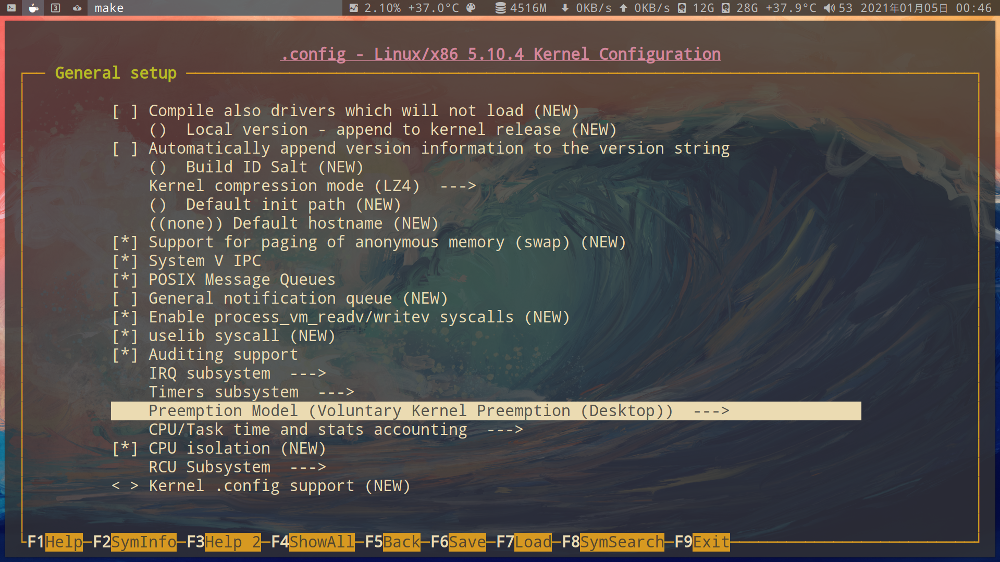

# 编译内核

查看当前运行的`linux config`

```bash
zcat /proc/config.gz
```

- 1.下载 `kernel`

```bash
# 下载内核
wget https://cdn.kernel.org/pub/linux/kernel/v5.x/linux-5.10.6.tar.xz
# 国内镜像下载
wget http://mirrors.163.com/kernel/v5.x/linux-5.10.6.tar.xz

# 解压
tar xvf linux-5.10.6.tar.xz
# 如果安装了pixz(多线程xz解压缩)
tar -I pixz -xvkf linux-5.10.6.tar.xz

# 设置config
cd linux-5.10.6
```

- 2.编译安装

```bash
# 查看make
make help

# 配置内核
make nconfig
# 或者
make menuconfig

# 注意如果配置成M(模块),日后需要用命令加载
morprobe <module_name>
lsmod | grep -i <module_name>

# 编译
sudo make -j$(nproc)
sudo make modules_install

# 复制到boot分区
sudo make install
```

或者手动复制到 boot 分区(等同于 sudo make install):

```bash
# 将内核,复制到boot分区
sudo cp -v arch/x86/boot/bzImage /boot/vmlinuz-linux5.10.6

# 将symbol文件,复制到boot分区
sudo cp System.map /boot/System.map-vmlinuz-linux5.10.6
ln -sf /boot/System.map-vmlinuz-linux5.10.6 /boot/System.map

# 生成initramfs
sudo cp /etc/mkinitcpio.d/linux.preset /etc/mkinitcpio.d/linux5.10.6.preset
sudo sed -i 's/linux/linux5.10.6/g' /etc/mkinitcpio.d/linux5.10.6.preset

sudo mkinitcpio -p linux5.10.6
```

- 3.最后

```bash
# 重新配置grub引导
sudo grub-mkconfig -o /boot/grub/grub.cfg

# 如果使用nvidia私有驱动,需要重新安装,不然会进不了图形界面
pacman -S nvidia-dkms

# 重启
reboot

# 查看内核
uname -a
```

## General setup

### [Kernel compression mode (内核压缩算法)](https://git.kernel.org/pub/scm/linux/kernel/git/torvalds/linux.git/tree/init/Kconfig?id=aefcf2f4b58155d27340ba5f9ddbe9513da8286d#n200)


- 压缩速度只影响编译内核
- 解压速度只影响每次开机
- 压缩大小只影响磁盘空间

  1.对于大多数情况下解压速度才是第一优先考虑

  - [x] `LZ4`

    2.综合解压,压缩比

  - [x] `zstd`

    3.对于小磁盘空间

  - [x] `xz`

[详情](https://lwn.net/Articles/817134/)

### [preemption model (线程抢占模型)](https://devarea.com/understanding-linux-kernel-preemption/)



1.如果是服务器选择不强制抢占,减少切换上下文

- [x] `No Forced Preemption`

[实时强制抢占内核补丁](https://rt.wiki.kernel.org/index.php/Main_Page)

## Power management and ACPI options

### CPU Frequency scaling

# reference

- [戴文的 Linux 内核专题：12 配置内核(8)](https://linux.cn/article-2386-1.html)

```

```
