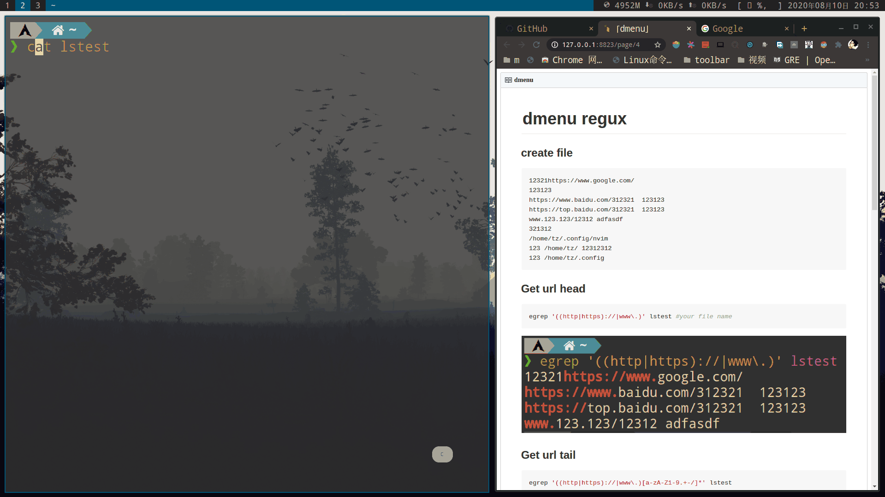
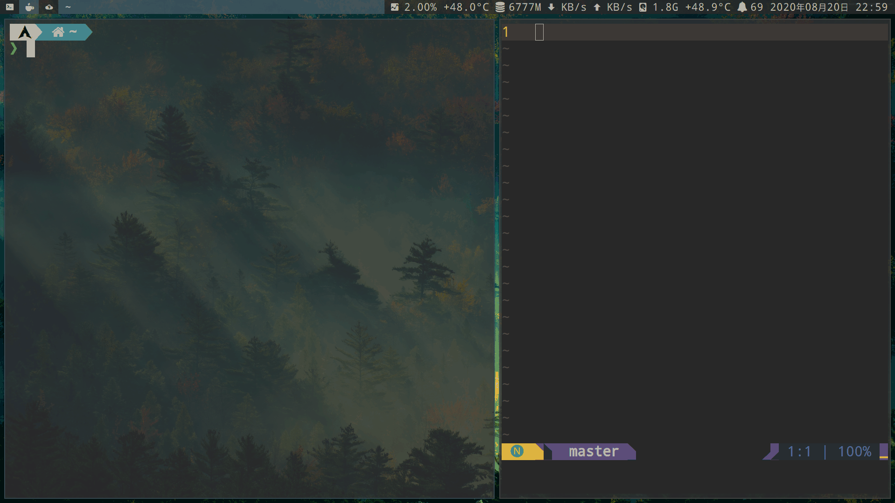
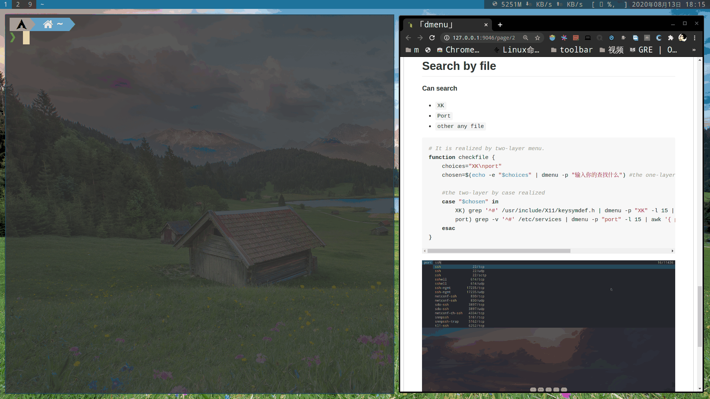

<!-- mtoc-start -->

* [dmenu 的正确使用方式](#dmenu-的正确使用方式)
  * [Create a messy file](#create-a-messy-file)
    * [Get url head](#get-url-head)
    * [Get url tail](#get-url-tail)
    * [-o cut](#-o-cut)
    * [获取上一条命令所输出的网址,并用浏览器打开](#获取上一条命令所输出的网址并用浏览器打开)
    * [For dir regux](#for-dir-regux)
    * [Copy the path in the same way](#copy-the-path-in-the-same-way)
    * [当然也以行为单位，复制命令的输出](#当然也以行为单位复制命令的输出)
  * [通过 dmenu menu 二级菜单，可快速获取并复制文件内容，代替 grep](#通过-dmenu-menu-二级菜单可快速获取并复制文件内容代替-grep)
  * [建一个搜索引擎合集脚本，配合 dmenu 使用](#建一个搜索引擎合集脚本配合-dmenu-使用)

<!-- mtoc-end -->

# dmenu 的正确使用方式

### Create a messy file

```bash
#my file name is lstest
12321https://www.google.com/
123123
https://www.baidu.com/312321  123123
https://top.baidu.com/312321  123123
www.123.123/12312 adfasdf
321312
/home/tz/.config/nvim
123 /home/tz/ 12312312
123 /home/tz/.config
```

### Get url head

```bash
egrep '((http|https)://|www\.)' lstest #your file name
```


### Get url tail

```bash
egrep '((http|https)://|www\.)[a-zA-Z1-9.+-/]*' lstest
```


### -o cut

```bash
egrep -o '((http|https)://|www\.)[a-zA-Z1-9.+-/]*' lstest
```


### 获取上一条命令所输出的网址,并用浏览器打开

```bash
# add function
function searchurl {
    $(history | tail -n 1 | awk '{$1="";print $0}') | egrep -o '((http|https)://|www\.)[a-zA-Z1-9.+-/]*' | dmenu -p "search url" -l 10 | xargs xdg-open &> /dev/null
#如果只需要复制网址，把"xargs xdg-open &> /dev/null" 替换成"xclip -selection clipboard"
}
# zsh bindkey
zle -N searchurl
# Alt + u
bindkey "^[u" searchurl
```



### For dir regux

```bash
dir="bin|boot|dev|etc|home|lib|lib64|lost+found|mnt|opt|proc|root|run|sbin|srv|sys|tmp|usr|var"
egrep -o "/($dir)/[a-zA-Z0-9/.]*" lstest
```


### Copy the path in the same way

```bash
function cpdir {
# set dir varible
    dir="bin|boot|dev|etc|home|lib|lib64|lost+found|mnt|opt|proc|root|run|sbin|srv|sys|tmp|usr|var"
    $(history | tail -n 1 | awk '{$1="";print $0}') | egrep -o "/($dir)/[a-zA-Z0-9/.]*" | dmenu -p "copy url" -l 10 | xclip -selection clipboard
}
```


### 当然也以行为单位，复制命令的输出

```bash
# 复制上一条执行的命令的输出
function cpline {
    $(history | tail -n 1 | awk '{$1="";print $0}') | dmenu -p "copy line" -l 10 | xclip -selection clipboard
}

# 通过历史记录,选择要复制的命令的输出,注意命令会重复执行
function cpcommand {
    $(history | sort -nr | awk '{$1="";print $0}' | dmenu -p "copy content" -l 10) | xclip -selection clipboard
}
```



## 通过 dmenu menu 二级菜单，可快速获取并复制文件内容，代替 grep

**Can search**

- `XK`
- `Port`
- `other any file`

```bash
# It is realized by two-layer menu.
function checkfile {
    choices="XK\nport"
    chosen=$(echo -e "$choices" | dmenu -p "输入你的查找什么") #the one-layer

    #the two-layer by case realized
    case "$chosen" in
        XK) grep '^#' /usr/include/X11/keysymdef.h | dmenu -p "XK" -l 15 | awk '{ print $2 }' | xclip -selection clipboard ;;
        port) grep -v '^#' /etc/services | dmenu -p "port" -l 15 | awk '{ print $1 }' | xclip -selection clipboard;;
    esac
}
```


## 建一个搜索引擎合集脚本，配合 dmenu 使用

This is a [script code link](https://github.com/ztoiax/userfulscripts/blob/master/dmenu-search.sh "With a Title").


