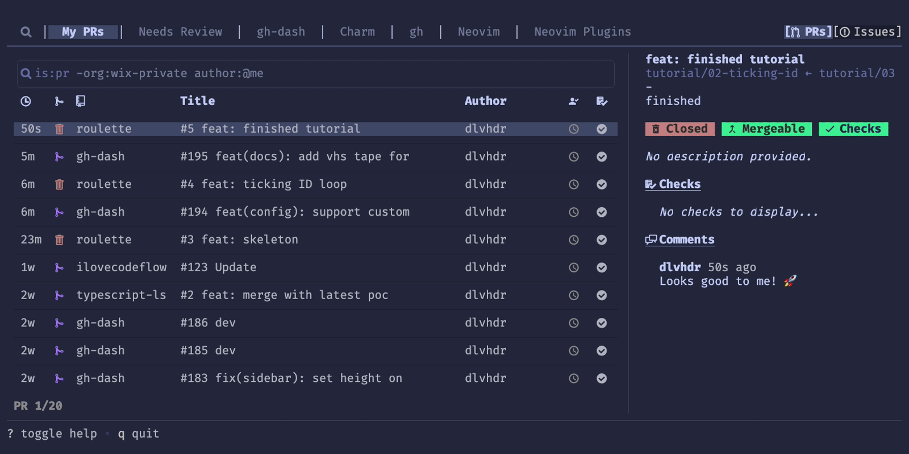

<!-- vim-markdown-toc GFM -->

* [Git](#git)
    * [git的缺点](#git的缺点)
    * [初次运行 Git 前的配置](#初次运行-git-前的配置)
    * [连接远程github仓库](#连接远程github仓库)
    * [基本命令](#基本命令)
    * [push多个仓库](#push多个仓库)
    * [branch(分支)](#branch分支)
        * [分支策略](#分支策略)
        * [分支合并](#分支合并)
            * [处理合并冲突](#处理合并冲突)
            * [merge](#merge)
            * [rebase](#rebase)
        * [worktree](#worktree)
    * [commit](#commit)
        * [小而完整的 commit](#小而完整的-commit)
        * [基本命令](#基本命令-1)
        * [撤销](#撤销)
            * [基本命令](#基本命令-2)
            * [合并 3 次分支(保留文件)](#合并-3-次分支保留文件)
            * [回退单个文件](#回退单个文件)
            * [stash(暂存)](#stash暂存)
    * [bisect](#bisect)
    * [remote](#remote)
    * [LFS](#lfs)
    * [一些问题](#一些问题)
    * [第三方git工具](#第三方git工具)
        * [git-extras](#git-extras)
        * [pre-commit](#pre-commit)
        * [sapling(facebook的版本控制工具兼容git)](#saplingfacebook的版本控制工具兼容git)
        * [git-sim（可视化git）](#git-sim可视化git)
        * [commitgpt（ai自动生成git commit）](#commitgptai自动生成git-commit)
        * [git-cliff：对history生成markdown日志](#git-cliff对history生成markdown日志)
        * [github/gitignore：A collection of useful .gitignore templates](#githubgitignorea-collection-of-useful-gitignore-templates)
        * [gitbutler：git的gui](#gitbutlergit的gui)
* [repo：google的git](#repogoogle的git)
* [VFSForGit：微软的git](#vfsforgit微软的git)
* [scalar：微软的新git](#scalar微软的新git)
* [github](#github)
    * [api](#api)
    * [github工作流](#github工作流)
    * [code action](#code-action)
    * [第三方github工具](#第三方github工具)
* [reference](#reference)
* [优秀文章](#优秀文章)
* [关于 Git 的书](#关于-git-的书)
* [online tools](#online-tools)

<!-- vim-markdown-toc -->

# Git

- [git 命令思维导图](https://www.processon.com/view/link/5c6e2755e4b03334b523ffc3#map)

## git的缺点

- 当然，git 不是完美的，有些地方仍然比其他 VCS 有些缺点。解决这些问题的办法，有，但支持并不广泛。

- 缺乏分支权限管理

    - Git 没有内建权限管理（来自于 Linus Torvalds 的设计理念）。当一个人获得访问 repo 的权限，所有的分支都能访问到。
    - 有些服务通过控制“.git/refs/heads”下的文件访问，提供了基于分支的权限管理。这就能有基本的权限管理，又不需要修改 git。

- 巨型库（单一库）

    - 当 Linus Torvalds 设计 git 的时候，首要目标是支持 Linux 内核的开发，需求限于这样的中等规模。对于一个巨大的项目，git 的性能并不好。想想在“git status”的时候，git 需要穷举目录下的所有文件，比较当前的和 repo 里的区别。这肯定会花不少时间。

    - 这几年，git 也在这上面做了一些改进。Git 2.25里引入的部分 clone 和稀疏 checkout 可以让你不需要把整个 repo 都 clone 或者 checkout，只要你需要的一部分子目录就行。但这些还比较新，不是所有服务提供方都支持。

    - 要解决存放 Android 源代码的需求，Google 有个工具叫“repo”。它可以管理多个 git repo，就好像一个巨大的 repo 一样。这个工具支持 Linux 和 macOS，但是 Windows 上基本没法用。
        - 同时，因为本质上其实还是一堆git库的集合，把文件从一个 git 挪到另一个，就会丢失历史。Google 的另一个工作是 Git protocol v2。它可以加速 repo 之间传输的速度。

    - 微软的 Windows 长期以来一直用的 fork 的 p4，叫做 source depot（SD），作为版本控制。在2015年的某个时候，p4 已经无法满足现代的敏捷开发和协作的需求，于是考虑切换到 git。即便代价非常大（切换了一个用了20年以上的系统，大量修改 bug 跟踪、自动编译、测试、部署系统，培训部门里的每个人，配发大容量 SSD。），也要坚持去做，因为都知道这才是未来。直接转的话，单个 git 库的大小是270GB，clone 一次得花12小时，checkout 花3小时，甚至连“git status”都要10分钟，简直没法用。于是有人开始考虑通过引入一些主从的特性来改进 git。但因为他们对开源社区的无知，甚至连搜索一下都不，就给这个东西起名叫 gvfs（git virtual files ystem)，全然不顾已经有叫这个名字的知名项目 GNOME virtual file system。被诟病了几年才改名叫 VFSForGit。

        - 它不是 git 的直接替代。首先是引入了一个新的协议，用于虚拟化 repo 里的文件。在克隆的时候，不用 git clone，而用 gvfs clone。
            - 在 .git 和工作目录下的所有文件都只是个符号链接，指向服务器上的真实文件（有了中心服务器的概念），在本地硬盘上不占空间。然后有个后台驻留程序在监视这个虚拟化。读文件的时候，它就把文件内容从服务器取到本地的 cache，修改文件的时候，它就把符号链接替换成硬盘上的普通文件（相当于自动 checkout）。同时这个驻留程序还监控文件读写的操作。如果文件没有被写过，就认为内容不变。这样就只需要比较被写过的文件，而不是目录下所有文件（相当于不按内容判断是否相同）。然而，这其实破坏了 git 的很多设计原则，以及放弃了按文件内容决定是否发生改变的规则。
            - 显而易见没可能被官方的 git 采纳。这些对规则的破坏，这也使得 VFSForGit 无法和很多 git GUI 很好地配合使用，包括 TortoiseGit。

        - 因此，微软换了个方向，新做了一个叫做 Scalar 的系统。这个就不用虚拟化了，也不会改变 git 的工作流。它是以扩展的形式，优化原有 git 的部分 clone 和稀疏 checkout，不再修改 git 的基础。但它的适用性仍然是个问题。目前只有微软 fork 的 git 和 Azure devops 支持这个。实际上 meta 和 google 也一直在等待着 git 能更好地支持单一巨型库，并时不时尝试从自己开发的系统里切换过去。

## 初次运行 Git 前的配置

```bash
# 设置userid，email，editor
git config --global user.name "John Doe"
git config --global user.email johndoe@example.com
git config --global core.editor emacs

# 如果不想在每一次推送时都输入用户名与密码，你可以设置一个 “credential cache”
git config --global credential.helper cache

# 显示设置
git config --list
```

```bash
# 生成git ssh密钥
ssh-keygen -t rsa -C <userid> #your userid
```

## 连接远程github仓库

- [技术蛋老师：给学完Git，还不会用GitHub的朋友们](https://www.bilibili.com/video/BV1RC411W7UE)

```sh
# 添加远程github仓库地址。可以是https、ssh的地址
git remote add origin <url>

# 修改远程仓库地址
git remote set-url origin <url>

# 查看远程仓库地址
git remote -v

# 把当前分支改为main
git branch -m main
# -M强制执行
git branch -M main

# 把远程仓库同步到本地
git pull origin main

# 如果本地的commit log与远程不一致，rebase参数可以将本地的commit作为最新的commit
git pull rebase origin main

# 同步到远程仓库。-u表示以后默认这个远程地址
git push -u origin main
```

- 如果是ssh连接。需要生成密钥对。然后将公钥复制到github个人主页中的`settings`中的`SSH and GPG keys`

    ```sh
    # -T 进行连接测试
    ssh -T git@github.com
    # -i 指定私钥路径
    ssh -i ~/.ssh/id_rsa -T git@github.com
    ```

## 基本命令

```sh
# 克隆仓库
git clone
# 把github.com改为以下域名, 解决国内github访问慢的问题
git clone https://hub.fastgit.org/

# 初始化仓库
git init

# 查看状态
git status
# 添加进暂存区
git add <FILE>

# 当前目录下所有文件全部添加
git add --all
# 或者
git add .

# 同一文件进行多次添加
git add -p <FILE>

# 撤销进暂存区，并删除文件
git rm <FILE>

# 只撤销进暂存区
git rm --cached <FILE>

# 改名
git mv <FILE>

# 显示工作区与暂存区的不同
git diff

# 显示暂存区与最近的版本 (commit) 的不同
git diff --cached

# 显示工作区与最近的版本 (commit) 的不同
git diff HEAD

# 显示两个 commit 之间的文件变动
git diff <commit-id> <commit-id>

# 查看文件是谁写的。blame 的意思为 责怪
git blame <file>

# 提交
git commit -m "commit name"

# 查看提交数量
git rev-list --count master

# 查看git跟踪的文件
git ls-files

# 查看未跟踪的文件
git ls-files --others

# 对未跟踪的文件打包压缩
git ls-files --others --exclude-standard -z |\
xargs -0 tar rvf ~/backup-untracked.zip

# 垃圾回收, 删除孤立(orphaned)的git对象
git gc --prune=now --aggressive
```

- 不要 `pull`，要  `fetch`

    - 很多教程都说 push 和 pull 是在本地和远程 repo 之间同步的指令。但是其实 push 是基础指令，pull 不是。它是 fetch 当前分支->和本地分支合并->reset 到合并后的顶端。
    - 这里就产生了不必要的合并。

## push多个仓库


- 为什么需要多个远程仓库？

    - 备份：确保代码在不同平台上有备份，例如 GitHub 和 GitLab。
    - 协作：团队成员在不同的远程仓库上工作，需要确保代码同步。

- 1.配置多个远程仓库
    - 假设我们已经有一个远程仓库 origin，现在需要添加一个名为 backup 的远程仓库。
    ```sh
    # 添加 backup 仓库：
    git remote add backup https://gitlab.com/user/backup-repo.git

    # 确保远程仓库添加成功：
    git remote -v
    origin    https://github.com/user/main-repo.git (push)
    backup    https://gitlab.com/user/backup-repo.git (fetch)
    backup    https://gitlab.com/user/backup-repo.git (push)
    ```

- 2.推送到两个远程仓库

    - 方法 1: 分别推送
        ```sh
        git push origin <branch-name>
        git push backup <branch-name>
        ```

    - 方法 2: 创建自定义的 remote

        ```sh
        # 创建一个自定义的 remote，将两个远程仓库的 URL 都添加到这个 remote 中：
        git remote set-url --add --push origin https://github.com/user/main-repo.git
        git remote set-url --add --push origin https://gitlab.com/user/backup-repo.git
        ```

    - 方法 3: 使用 git config
        ```sh
        # 通过配置文件来设置多个 push URL：
        git config --add remote.origin.pushurl https://gitlab.com/user/backup-repo.git
        ```

- 推送代码
    ```sh
    # 推送到默认的分支：这会将代码推送到 origin 配置的两个 URL，即 origin 和 backup 仓库。
    git push origin

    # 推送所有分支：这样，你的所有分支都会被推送到 origin 的两个 URL。
    git push --all origin
    ```

## branch(分支)

- [Learn Git Branching](https://learngitbranching.js.org/?demo=&locale=zh_CN)

```sh
# 显示本地分支
git branch

# 显示远程分支
git branch -r

# 显示本地和远程分支
git branch -a

# 新建分支
git branch <name>

# 对当前分支改名
git branch -M <new_name>

# 删除分支
git branch -d <name>

# 切换分支
git checkout <name>

# 新建一个log的commit的分支
git checkout <hash>

# 切换上一个分支
git checkout -
```

### 分支策略

- [腾讯云开发者：Git还能这样用？一文看懂Git最佳实践！](https://mp.weixin.qq.com/s/oLb1A7Tyw_itYUJiYcH8Ng)

- 因为 Git 的本质是一个基于目录的分布式 VCS，这里面并没有中心服务器的角色。去中心化是未来。
    - 同个项目的所有 repo 都是平等的端点。一个 repo 可以在服务器、本地目录、其他人的电脑上。只是为了团队协作的目的，会认为指定一个或多个端点作为“服务器”。是的，可以同时有多个上游服务器。很多时候这么做很有必要。比如对内开发的 repo 和对外开源的 repo，就是两个不同的端点。可以有不同的分支和推送频率。本地只要一个 repo 就都管理了。

- Fork

    - Fork 仍然也是 Git 服务网站的功能，用来简化协作流程。在没有 fork 的时候，如果你想往开源项目里修 bug 或者加 feature，会需要这样的流程：
        - 1.克隆 repo；
        - 2.修改代码；
        - 3.生成补丁；
        - 4.发到论坛或者支持的邮件列表；
        - 5.找作者来 review，合并补丁。

    - 很多项目到现在还是这么做的。如果有了 fork，可以简化成：
        - 1.Fork 并克隆 repo；
        - 2.修改代码；
        - 3.发出 merge request 或者 pull request。

    - 虽然 fork 很有用，但这仍然不是 git 的一部分。它用到的是 git 的分布式能力。本质上，在 fork 的时候，它会克隆一份 repo，把原来的 repo 设置成上游。所以其实如果你的目标不是为了继续把 repo 放在网络服务上，那就克隆到本地就是了。太多的人把 fork 当作 like 来用，根本就是错的。如果没打算改代码，fork 是没意义的。机器学习界这个问题尤其严重。经常放一个 README 就假开源了，还有几百个 fork，都不知道能 fork 到什么。

- 分支策略

    - Git 的工作流是基于分支的。不但每个 repo 是平等的，每个分支也是。Master/main、develop 这些只是为了简化管理而人工指定的有特殊含义的分支。这里的分支策略是为了更好地协作而产生的习惯规范，不是 git 的工作流本身必须定义的。分支可以分为几个层次。

    - Main 分支：

        - 这是整个项目的稳定分支，里面的内容可能相对较老，但是这个分支里的内容都是经过测试和验证的。原先都叫 master，因为政治正确的要求，最近越来越多新项目开始用 main。有些快速开发的项目甚至不采用 main 分支。


    - Develop 分支：

        - 开发主要发生在 develop 分支。新特性先放到这个分支，再去优化和增强稳定性。
        

        - 大项目可选的团队 Develop 分支：

            - 对于跨团队的大项目，每个团队都有自己的兴趣点和发布周期。很常见的做法是，每个团队有自己的 develop 分支。每过一段时间合并到总的 develop 分支。 一般来说，中等大小的团队，专注于 repo 的某一部分，可以采取这样的分支形式。

            - 小团队或者个人没有必要有自己的 develop 分支。那样反而会浪费时间和增加合并过程中的风险。

            

    - Feature 分支

        - Feature 分支是生命期很短的分支，专注于单个特性的开发。和其他 VCS 不一样的是，在 git 里开分支开销非常低，所以可以高频地开分支和合并分支。在做一个特性的时候，常规的流程是这样的：
            - 1.从 develop 分支上新建一个 feature 分支；
            - 2.提交一些关于这个 feature 的代码；
            - 3.合并回去；
            - 4.删除这个 feature 分支。

        - 对于本地 repo 里的 feature 分支，你可以做任何事。常见的用法是在开发过程中非常频繁地提交，走一小步就提交一次。在发出 MR 之前，先合并成一个 commit，把这个分支变整洁，方便后续操作。

        - 当 feature 分支合并之后，绝对不存在任何理由让这个分支仍然存在于服务器上。WOA 现在有自动删除的选项，可以设置成默认开启。但有时候仍然会出些问题，这个选项会消失，需要手工删除分支（其实就是在 MR 页面上点一下的事）。记住：服务器上只是一个端点，删掉那边的一个分支不会影响你的本地 repo。如果你有后续工作需要在那个分支上做，就继续在你本地的分支上完成就是了。这和服务端有没有这个分支一点关系都没有。
            

        - 因为每个分支都是平等的，可以推出在任何一个分支上都可以新建分支。比如，如果特性 B 依赖于特性 A，你不用等特性 A 合并了才开始做特性 B。只要在特性 A 的分支上建立一个特性 B 的分支就可以了，即便特性 A 不是你的分支也可以。等到特性 A 合并了，把特性 B 的分支 rebase 一下就是了。少了等待环节，效率提高很多，也不必催人做 code review。

        - 能建立大量 feature 分支，对于提高工作效率非常关键。每个特性建立一个 feature 分支，在上面完成特性，发出 MR。在 code review 通过之前，已经可以新建另一个特性专用的 feature 分支，切换过去，开始做另一个特性。在 code review 过程中还能来回切换，同时做多个特性。其他 VCS 是做不到这一点的，效率也自然低很多。

    - Release 分支群

        - Release 不只是一个分支，而是一群以“release/”打头的分支。就好像一个目录，包含了不同版本给不同产品线的 release 分支。一般来说他们从 main 或者 develop 分支出来。当发现一个 bug 的时候，在 main 或者 develop 分支修好，然后 cherry-pick 到 release 分支里。这种单向的处理可以方便管理，并且不用担心某个 commit 是不是只有 release 分支有。Release 分支经常在每个 sprint 的开头创建，包含这个 sprint 要发布的东西；或者在每个 sprint 的结尾创建，包含下一个 sprint 要发布的东西。


### 分支合并

- 把 commit 从 feature 分支放到 develop 分支的时候，我们一直说“合并”，但其实这里存在两个维度。

- 第一个维度：是 `merge` 和 `rebase`，是两种“合并”的方式

    - `merge`是普通的合并，和传统的 VCS 一样。它会把一个分支合并到目标分支，在顶上建立一个 commit 用来合并，两个分支里已有的 commit 不会有变化。
        

    - `rebase`。它会从分支分出来的地方切开，嫁接到目标分支的顶端上。（我一直认为 rebase 应该翻译成嫁接，而不是“变基”。）
        

- 第二个维度：是否 `squash`，也就是选择一个分支里的一些 commit，压扁成一个 commit。
        

- 两个维度组合之后，我们就得到了4个操作：
    - 1.“squash 再 merge”
        - 没有任何意义
    - 2.“不 squash 就 merge”
    - 3.“不 squash 就 rebase”
    - 4.“squash 再 rebase”。

    > （微软的 DevOps 文档曾经有个严重的错误。里面描述成 merge 表示不 squash 就 merge、rebase 表示 squash 在 rebase，而没有把它们当作两个维度来看。是我在2018年左右提出了这个问题，并且要求他们修改，还提供了多个图片解释它们到底有什么区别。过了大概半年之后才改成对的。但很多人就是从那里学的 git，都被带坏了。）

- 第三个维度，修订与否。
    - 但这个更多的是发生在 merge 之前的过程。修订，`amend`，表示当提交的时候，是不是要覆盖掉上一个 commit。打开的话，提交之后还会只有一个 commit，而不是两个。
    
    

- 现在的问题就是，什么时候用什么。

    - 1.要是要处理的是长生命周期的分支，比如团队的 develop 分支、develop 分支、main 分支，合乎逻辑的选择是 `merge`。因为它们的结构需要保留，而且合并后分支也不打算消失。

    - 2.对于 feature 分支，不同团队可以有不同选择。这里我只说最高效，开销最低的。一个 feature 分支里可以有多个 commits，但它们只有合在一起的时候才会成为一个 feature。中间的 commit 以后就再也用不到了。留着只会浪费空间和时间。所以逻辑上，这些 commit 就需要被 `squash`。
        - 这时候如果 merge 一个只包含一个 commit 的分支，即便 git 里开分支和合并的开销很低，但这会一直积累的。这里用 merge，就完全是在浪费时间和空间。对于 feature 到 develop 的合并来说，`rebase` 是最佳选择。

    - 3.现在，如果早晚需要把多个 commit 合成一个，那就该用 `amend`。
        - 是的，大部分时候，一路 amend 过去，比最后才来 squash 更好。首先，rebase 一个 commit，会比 rebase 一串来得容易得多，特别是有代码冲突的时候。其次，如果 MR 的最后才 squash & merge，那 commit 的消息就是没有经过 review 的，增加了犯错的风险。（是的，非常经常发生）

- 所有这些操作都可以在本地完成。这比在 Web UI 上操作远程的 repo 要容易而且高效。总结起来，这里的最佳实践是：
    - 在开发过程中可以用 commit 或者 `amend commit`；
    - 在发出 MR 的时候 `squash` 成一个 commit；
    - 在 MR 的迭代内持续用 `amend commit`；
    - 在 MR 通过后用 `rebase` 进行合并。

    - （其实，p4 里面的每一次 submit，都是 amend + rebase。之前只是因为没有人告诉你这个事实。而且 p4 里只有一种 submit 的方式，没有思考和选择的空间，做就是了。但这绝不代表不需要思考“有没有更好的做法”这个问题，这非常重要。）

- 更复杂的情况是在跨公司的 repo 上工作，比如 UE。

    - 这时候规则需要做一些改变。一般来说，这种情况下你的 feature 分支是从 release 分支上建出来的，而不是 develop 分支。而且这种 feature 分支其实是作为 develop 分支来用，有长的生命周期。

    - 这时候，如果你要把一个特性从比如 UE 5.1移植到5.2，rebase 就不是最佳选择了。因为那样的话会把5.1 release 分支里的所有 commit 和你的所有 feature commit 一起 rebase。

    - 而你真正想要的是只把你的 commit 给 cherry-pick 过去。这其实还是因为工具。如果用的是 TortoiseGit，就不会有这个疑惑。因为里面 rebase 默认是交互式的。你可以精确选择哪些 commit 需要操作。这就让 rebase 和 cherry-pick 变成一样的东西。唯一的区别，是 rebase 是让 git 选一个 commit 的列表，让你从中选哪个要哪个不要。而 cherry-pick 是让你直接选 commit 的列表。

#### 处理合并冲突

- 当出现合并冲突的时候，最好的方式是先把你的 feature 分支 rebase 到目标分支的顶端，这时候解决冲突，然后 force push。如果用 WOA 的冲突解决（可能有些别的基于 web 的 git 服务也有），它会每次都做 merge。结果经常把简单的单个 commit rebase，变成了复杂的三分支合并。

- 常见错误：解决合并冲突后建了个新的 MR

    - 因为冲突解决的错误行为，有可能在解决之后，修改被提交到了一个新的分支。这时候应该把你的分支 reset 到新的去，force push，再删掉新的；而不是关掉原先的 MR，在新分支上开个新 MR。

- 常见错误：把分支搞乱

    - 如果真的遇到了多分支复杂交错的情况，有两个方法可以尝试清理出来。

        - 1.强制 rebase。Fetch 一下整个 repo；把你的分支 rebase 到目标分支上的时候勾选 force；这时候在列表里选要拿去 rebase 的 commit。大部分时候这都能行。但有时候 git 因为分支太错综复杂而搞不清楚 commit，在列表里会有遗漏。

        - 2.Cherry-pick。在目标分支上新建一个临时分支；把有用的 commit 都 cherry-pick 过去；把你的分支 reset 到那个临时分支上；最后删掉那个临时分支。

        - 两个方法最后都需要 force push。

#### merge

```sh
# 设置默认的mergetool为nvimdiff
git config merge.tool nvimdiff

# 合并分支
git merge branch2

# 合并单个或多个分支的commit hash
git cherry-pick <hash> <hash>

# 分支冲突, 解决后.会保留一个显示diff的file.orig
git mergetool

# -t 指定mergetool为diffmerge(一款gui工具)
git mergetool -t diffmerge
```

#### rebase

```sh
# -i 交互执行
git rebase -i <hash>

# 取消rebase
git rebase --abort

# 执行 rebase 之前自动 stash
git rebase --autostash
```

### worktree

- 创建新分支, 并且创建子目录. 新分支的修改在子目录下进行, 从而隔离

```sh
# 新建worktree1分支, 子目录名为dirname
git worktree add -b worktree1 dirname

# 查看worktree
git worktree list

# 合并worktree分支
git merge worktree1

# 先删除worktree1目录, 再删除分支
git worktree remove /home/tz/gittest/dirname
git branch -d worktree1
```

## commit

### 小而完整的 commit

- 每个 commit 都该小而完整，有些人把这个叫做“原子性”。不要把多个特性压到一个 commit 里，同时不要有一堆必须合起来才能用的 commit。

- 常见错误：一个 commit 里做多件事情

    - 这是一个非常常见的错误。一个大的 commit 包含多个任务的代码。这样的 commit 必须要拆成多个才行。在 git 里，这样的拆分比较容易。如果一个分支“Feature”包含了特性 A 和特性 B 的代码，那么，

        - 1.在“Feature”的顶端建立“Feature A”和“Feature B”两个分支；
        - 2.切换到“Feature A”分支，删掉其中特性 B 的代码，开 `amend` 提交；
        - 3.把“Feature B”分支 rebase 到新的“Feature A”分支。

    - 这就行了。现在两个分支都分别只包含一个特性。如果特性 B 不依赖于特性 A，它还可以继续 rebase 到 develop 分支去。

- 常见错误：多个不完整的 commit

    - 另一个非常常见的错误是不完整的 commit，比如不能编译、不能运行、只包含琐碎的修改、或者仅仅为了未来的使用而做的修改。这样的 commit 只是中间结果，没法单独存在，需要和其他 commit 合起来才变成一个完整的 commit。那它们就需要合并之后才发 MR。

- 拆分大的 commit

    - 是的，有时候是需要把一个大的 commit 拆分成多个，让 MR 更容易看。
    - 但是这里的拆分并不能让 commit 变得不完整。如果一个大 commit 中的一部分，本身就能对现在的代码库有帮助，拿着就能提出来变成一个独立的 commit。常见的是独立的 bug 修复、代码整理、或者重构。

### 基本命令

```sh
# 以编辑器的形式修改commit的文件和信息
git commit --amend --only -m 'new commit message'

# 以编辑器的形式修改commit的文件和信息
git commit --amend --only
```

- 从commit删除某个文件的修改
```sh
git checkout HEAD^ file
git add -A
git commit --amend
```

- log
```sh
# 显示上一次commit的diff
git show
# or
git log -n1 -p

# 显示commit和hash的历史
git log

# 显示commit和hash的历史，以及每次commit发生变更的文件
git log --stat

# 显示commit和hash的历史，以及每次commit发生变更的文件
git whatchanged

# 显示两个星期内的改动
git whatchanged --since='2 weeks ago'

# 显示远程仓库的commit和hash的历史
git log --oneline

# 显示简化的 commit 历史
git log --pretty=oneline --graph --decorate --all

# 将操作合并到最新一次commit
git commit --amend -m <hash>

# 显示commit相关的操作历史
git reflog
```

### 撤销

#### 基本命令

```sh
# 撤销文件的修改(文件回退到当前的commit)
git restore <FILE>

# 撤销到hash值所代表的commit(不保留文件)
git reset --hard <HASD>

# 撤销本地所有的修改，回到远程仓库的状态。
git reset --hard origin/master

# 撤销到hash值所代表的commit(保留文件)
git reset --soft <HASD>

# reset会丢失记录, 而revert是创建新的记录, 达到撤销的效果
git revert -n <HASD>

# 回退后强制push远程分支
git push -u origin +master
```

#### 合并 3 次分支(保留文件)

```sh
git reset --soft HEAD~3
git commit -m "reset head~3"
```

执行合并后撤销

```sh
git reflog
# 找到要回退的hash，执行reset
git reset --hard <HASD>
```

#### 回退单个文件

```bash
git reset <commit_id> <file_path>
# git reset作用于文件时，只会修改暂存区
git checkout .
```

#### stash(暂存)

- 可以在不同的分支上使用
```sh
# 暂存最新的修改
git stash push -u

# 查看暂存列表
git stash list

# 查看某一条暂存
git stash show stash@{0}

# --patch显示更多细节
git stash show stash@{0} --patch

# 返回暂存
git stash pop

# 指定返回暂存stash@{1}
git stash pop stash@{1}

# 将暂存保存为新分支, 可以解决暂存冲突
git stash branch newbranch stash@{0}

# 删除指定暂存stash@{0}
git stash drop stash@{0}

# 删除所有暂存
git stash clear
```

## bisect

- 对提交历史记录进行二分查找来分离出特定的提交记录。该命令在帮助我们找出是哪个提交引入了 bug 时非常有用。

    - 这为开发人员快速追踪 bug 的源头提供了一种方法，因为每次将提交历史记录分成两半，可以指数级地减少需要手动检查的提交记录数量。

```sh
# 启动bisect
git bisect start

# 要运行这个命令，需要先找到一个问题未发生的过去提交记录，这里称之为 "good_commit_id"。

# Git 会对提交记录进行二分查找，它会检查当前提交和上一个好的提交之间的提交记录。此时，开发人员需要检查或测试代码，以确定 bug 是否仍然存在。

## 如果 bug 仍然存在，则运行 git bisect bad 命令；
git bisect bad

## 如果 bug 不存在，则运行 git bisect good 命令。
git bisect good <good_commit_id>

# 将分支恢复到执行搜索之前的状态。一旦找到了引入 bug 的提交记录，搜索就会返回第一个坏的提交记录的 commit ID。从这里开始，用户可以检查引入 bug 的提交记录。然后可以执行reset
git bisect reset
```

## remote

```bash
# 显示所有远程仓库
git remote

# 显示fetch和push的连接
git remote -v

# show remote
git ls-remote

# 增加远程仓库
git remote add origin <remote-url>

# 修改远程仓库的 url
git remote set-url origin <URL>

# 下载远程仓库的所有变动
git fetch <REMOTE>

# 合并
git merge

# 取消合并
git merge --abort

# 取回远程仓库的变化，并与本地分支合并
git pull <REMOTE> <BRANCH>
```

## LFS

- LFS 是 git 里蛮特殊的一部分。为了让 git 更好地支持大（二进制）文件，LFS 其实让 git 的设计做了一些妥协。LFS 比 git 晚了9年发布，而且花了好多年才让主流 git 服务都提供支持。

- LFS 是怎么回事

    - 保存完整历史的大文件，特别是大的二进制文件超级占空间和处理时间。在 LFS 里，默认子保存一个版本的大文件，历史则放在另一个端点，一般是服务器。本地其实也可以这样拉取完整的历史：

    ```sh
    git lfs fetch --all
    ```

    - 当从一个 git 转移到另一个的时候，会要求做这件事情。其他时候一个版本就够了。

    - 另外，LFS 有加锁解锁的功能。但是和主从式的 VCS 不同的是，加锁解锁不会自动扩散到所有端点。这还是因为并不存在中心服务器的概念。

- 常见错误：没开 LFS

    - 非常重要的一件事情是，LFS 不负责鉴别哪些文件是大文件。在添加大文件之前，它们路径需要加到 .gitattributes 里，可以用通配符。一旦路径在 .gitattributes 里了，文件操作就会自动通过 LFS 过滤，不需要额外的手工操作。

    - 但是，如果一个文件在没有改 .gitattributes 之前就添加了，那它会被当作普通文件。要纠正这个，需要把文件路径放到 .gitattributes，然后执行：

        ```sh
        git add --renormalize .
        ```

        - 才能把当前目录下的 LFS 状态修正过来。但历史里面的没法改，一旦提交了，大文件就会永远在那边。除非用我的另一篇文章提到的方法来精简。通过那样的方法过滤 git 库，删除不小心提交的大文件非常痛苦。过程中会有很多手工操作和确认，但至少这件事情是可做的。在实际项目中，我曾经把一个野蛮生长到 1.6GB 的 git 库，通过去掉没开 LFS 的情况下提交的第三方依赖和数据，精简到了 10MB，而且所有历史记录都在。其他 VCS 甚至不会有机会这么做，只能无限增长下去，或者砍掉一段历史记录。


- 常见错误：滥用 LFS

    - 另一个极端就是滥用 LFS。把所有的文件都当做大文件来添加，这样 git repo 就表现成了个 svn。当然，git 相对 svn 的大部分优点也没了，开发效率下降5-10倍。要进一步把效率下降10倍，可以锁上所有的文件。这样所有人都需要 checkout 文件才能编辑。这样的 git repo 就退化成了一个 p4 库。（要再次把效率下降10倍，就在同个项目上混合使用 git 和 p4。可以肯定，到不了10次 commit，就会有人搞错，把文件同时放到两边，造成两边都混乱。）

- 封装 LFS 锁

    - 刚提到，LFS 锁所有的东西可以很容易把开发效率下降2个数量级。但是，对于非编程的工作流，比如美术工作，反正是没有 diff 的操作。这就会变成加锁->check out->修改->提交->解锁，和主从式 VCS 的工作流一样。一个常见的解决方法是写一个脚本来加锁、扩散锁的状态，另一个脚本来做提交、解锁、扩散锁的状态。把 LFS 锁封装之后，工作流既可以符合美术类，也同时保持编程类工作流的效率。从另一个角度想这个问题：git 有机会封装成同时符合编程类和非编程类工作流，保证两边的效率；但是 svn/p4 却没可能封装成提高编程类工作流效率的。

## 一些问题

- `git status`中文乱码
    ```
    "\346\225\260\346\215\256\344\270\255\345\277\203\345\220\214\346\255\245-\347\275\221\347\273\234\351\243\216\346\232\264\351\227\256\351\242\230.avif"
    ```

    ```sh
    # 解决方法
    git config --global core.quotepath false
    ```

## 第三方git工具

### [git-extras](https://github.com/tj/git-extras/blob/master/Commands.md#git-alias)

### [pre-commit](https://github.com/pre-commit/pre-commit)

- [官方文档](https://pre-commit.com/)

- 保存为`.pre-commit-config.yaml` 文件

```yml
repos:
-   repo: https://github.com/pre-commit/pre-commit-hooks
    rev: v2.3.0
    hooks:
    -   id: check-yaml
    -   id: end-of-file-fixer
    -   id: trailing-whitespace
-   repo: https://github.com/psf/black
    rev: 19.3b0
    hooks:
    -   id: black
```

- 基本使用

```sh
# 生成./git/hooks/pre-commit
pre-commit install

# 手动运行
pre-commit run --all-files

# 或者commit会自动运行
git commit -m "..."
```

### [sapling(facebook的版本控制工具兼容git)](https://sapling-scm.com/docs/introduction/)

### [git-sim（可视化git）](https://github.com/initialcommit-com/git-sim)

### [commitgpt（ai自动生成git commit）](https://zura.wiki/post/never-write-a-commit-message-again-with-the-help-of-gpt-3/)

### [git-cliff：对history生成markdown日志](https://github.com/orhun/git-cliff)

### [github/gitignore：A collection of useful .gitignore templates](https://github.com/github/gitignore)

### [gitbutler：git的gui](https://github.com/gitbutlerapp/gitbutler)

### [diffnav：增强git diff功能](https://github.com/dlvhdr/diffnav)

```sh
git diff | diffnav
```

# repo：google的git

- 要解决存放 Android 源代码的需求，Google 有个工具叫“repo”。它可以管理多个 git repo，就好像一个巨大的 repo 一样。这个工具支持 Linux 和 macOS，但是 Windows 上基本没法用。
    - 同时，因为本质上其实还是一堆git库的集合，把文件从一个 git 挪到另一个，就会丢失历史。Google 的另一个工作是 Git protocol v2。它可以加速 repo 之间传输的速度。

# [VFSForGit：微软的git](https://github.com/microsoft/VFSForGit)

- 微软的 Windows 长期以来一直用的 fork 的 p4，叫做 source depot（SD），作为版本控制。在2015年的某个时候，p4 已经无法满足现代的敏捷开发和协作的需求，于是考虑切换到 git。即便代价非常大（切换了一个用了20年以上的系统，大量修改 bug 跟踪、自动编译、测试、部署系统，培训部门里的每个人，配发大容量 SSD。），也要坚持去做，因为都知道这才是未来。直接转的话，单个 git 库的大小是270GB，clone 一次得花12小时，checkout 花3小时，甚至连“git status”都要10分钟，简直没法用。于是有人开始考虑通过引入一些主从的特性来改进 git。但因为他们对开源社区的无知，甚至连搜索一下都不，就给这个东西起名叫 gvfs（git virtual files ystem)，全然不顾已经有叫这个名字的知名项目 GNOME virtual file system。被诟病了几年才改名叫 VFSForGit。

- 它不是 git 的直接替代。首先是引入了一个新的协议，用于虚拟化 repo 里的文件。在克隆的时候，不用 git clone，而用 gvfs clone。
    - 在 .git 和工作目录下的所有文件都只是个符号链接，指向服务器上的真实文件（有了中心服务器的概念），在本地硬盘上不占空间。然后有个后台驻留程序在监视这个虚拟化。读文件的时候，它就把文件内容从服务器取到本地的 cache，修改文件的时候，它就把符号链接替换成硬盘上的普通文件（相当于自动 checkout）。同时这个驻留程序还监控文件读写的操作。如果文件没有被写过，就认为内容不变。这样就只需要比较被写过的文件，而不是目录下所有文件（相当于不按内容判断是否相同）。然而，这其实破坏了 git 的很多设计原则，以及放弃了按文件内容决定是否发生改变的规则。
    - 显而易见没可能被官方的 git 采纳。这些对规则的破坏，这也使得 VFSForGit 无法和很多 git GUI 很好地配合使用，包括 TortoiseGit。

- 因此，微软换了个方向，新做了一个叫做 Scalar 的系统。这个就不用虚拟化了，也不会改变 git 的工作流。它是以扩展的形式，优化原有 git 的部分 clone 和稀疏 checkout，不再修改 git 的基础。但它的适用性仍然是个问题。目前只有微软 fork 的 git 和 Azure devops 支持这个。实际上 meta 和 google 也一直在等待着 git 能更好地支持单一巨型库，并时不时尝试从自己开发的系统里切换过去。

# [scalar：微软的新git](https://github.com/microsoft/scalar)

# github

- 访问速度慢的问题：

    - ghproxy方法：如这样`https://ghproxy.com/https://github.com/liuchengxu/vim-clap`

    - [GitHub520：改hosts](https://github.com/521xueweihan/GitHub520)

- [github新认证token背后的故事](https://github.blog/2021-04-05-behind-githubs-new-authentication-token-formats/)
    - token 前缀:
        - ghp for GitHub personal access tokens
        - gho for OAuth access tokens
        - ghu for GitHub user-to-server tokens
        - ghs for GitHub server-to-server tokens
        - ghr for refresh tokens

- [查看github仓库的trends](https://github-trends.com/)

- [grep app：超快的在线github搜索工具](https://grep.app/)

## api

```sh
# 这个api网址上json文件。以下命令为下载最新的linux-amd64包
curl -s https://api.github.com/repos/prometheus/mysqld_exporter/releases/latest   | grep browser_download_url | grep linux-amd64 |  cut -d '"' -f 4 | wget -qi -
```

## github工作流

- [码农高天：十分钟学会正确的github工作流，和开源作者们使用同一套流程](https://www.bilibili.com/video/BV19e4y1q7JJ)

## code action

- [GitHub Actions by Example](https://www.actionsbyexample.com/?utm_source=hackernewsletter&utm_medium=email&utm_term=code)

- [（视频）技术爬爬虾：Github的王炸功能，但很少人知道怎么用？免费运行程序，流水线编译部署，天气推送 签到薅羊毛 领京豆 CI/CD持续集成持续部署](https://www.bilibili.com/video/BV11e411i7Xx)

## 个人网站

- [（视频）技术爬爬虾：Github王炸功能Pages,免费免服务器上线网站,详细教程](https://www.bilibili.com/video/BV12H4y1N7Q4)


## clone下载子目录

- [github-dlr](https://github.com/rocktimsaikia/github-dlr)

```sh
# 只clone下载ags目录
github-dlr https://github.com/Aylur/dotfiles/tree/main/ags
```

## 第三方github工具

- [gh-dash](https://github.com/dlvhdr/gh-dash?ref=terminaltrove)
    
    ```sh
    # 安装
    gh extension install dlvhdr/gh-dash

    # 使用
    gh dash
    ```

# reference

- [这才是真正的 Git——Git 实用技巧](https://zhuanlan.zhihu.com/p/192961725)
- [常用 Git 命令清单](https://www.ruanyifeng.com/blog/2015/12/git-cheat-sheet.html)
- [git 命令思维导图](https://www.processon.com/view/link/5c6e2755e4b03334b523ffc3#map)
- [7000+ 字带你全面搞懂 Git 命令+原理！](https://mp.weixin.qq.com/s?__biz=MzA5ODM5MDU3MA==&mid=2650869124&idx=1&sn=f6c108e0be81e5ebfb9552005a602f32&chksm=8b67eac1bc1063d7024dc027e1d38ae9e7492bb6f7b27a6ef396f5cfc4e04f43a43928eab4f4&mpshare=1&scene=1&srcid=1121PpPXDPojYdulbYJvL1Do&sharer_sharetime=1605967603882&sharer_shareid=5dbb730cd6722d0343328086d9ad7dce#rd)

- [opensource.com: 5 commands to level-up your Git game](https://opensource.com/article/21/4/git-commands)

# 优秀文章

- [图解 Git](https://marklodato.github.io/visual-git-guide/index-zh-cn.html)
- [Git 的奇技淫巧](https://github.com/521xueweihan/git-tips)
- [这才是真正的 Git——Git 内部原理揭秘！](https://zhuanlan.zhihu.com/p/96631135)
- [这才是真正的 Git——分支合并](https://zhuanlan.zhihu.com/p/192972614)
- [这才是真正的 Git——Git 实用技巧](https://zhuanlan.zhihu.com/p/192961725)
- [详解 Git 大文件存储（Git LFS）](https://zhuanlan.zhihu.com/p/146683392)
- [Git 代码回滚与找回的艺术](https://mp.weixin.qq.com/s?src=11&timestamp=1624210292&ver=3142&signature=ZLIi9TNMCsGrxtjb0rb9Nqwhl6vUnbN1N2wG7h2wRs7WYeo-Z86Jypn35AJqJSfTV5XP51jr8VP3ueE6QOcBK29dmGPx3K*g2PrOonMMg62y0yIFVhVjQi-JYR18z4b1&new=1)
- [收集各种 Git 操作出现问题后的应对措施](https://github.com/k88hudson/git-flight-rules/blob/master/README_zh-CN.md)

# 关于 Git 的书

- [git book 官方教材](https://git-scm.com/book/zh/v2)
- [git magic](http://www-cs-students.stanford.edu/~blynn/gitmagic/intl/zh_cn/index.html#_%E8%87%B4%E8%B0%A2)
asd
# online tools

- [Learn Git Branching](https://learngitbranching.js.org/?demo=&locale=zh_CN)
