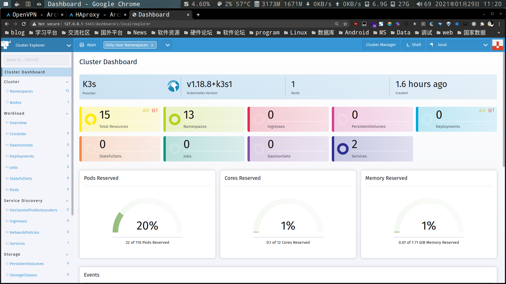
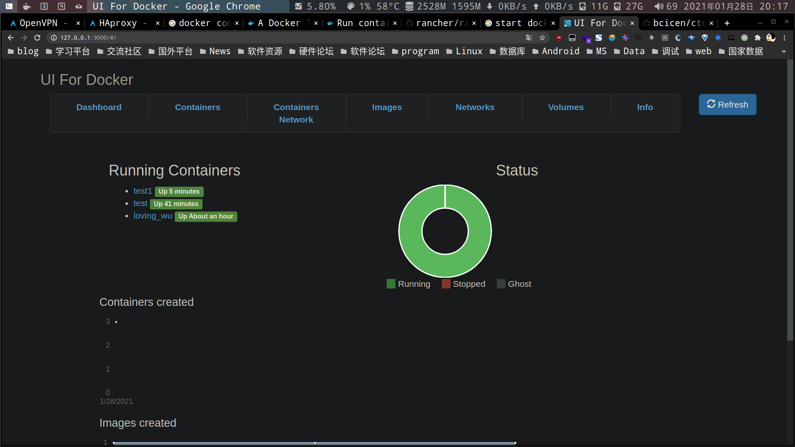
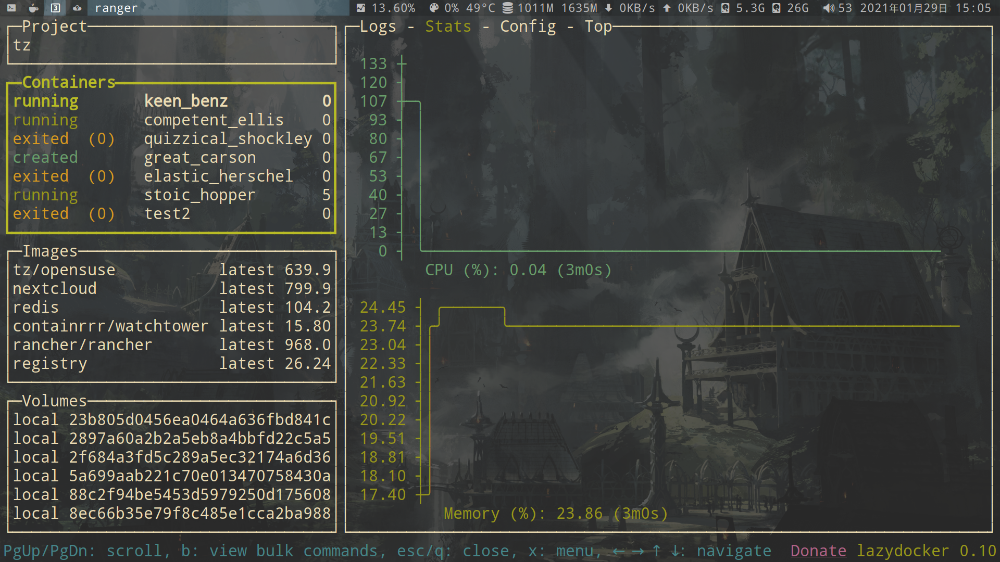

# docker

- path `/var/lib/docker`

- volumes 保存在`/var/lib/docker/volumes`

## 基本命令


```bash
# 查看docker信息
docker info

# 查看容器运行信息
docker inspect CONTAINER_ID

# 查看容器写入层的diff(类似git diff)
docker diff CONTAINER_ID

# 查看容器镜像信息
docker history IMAGE_ID

# 查看端口映射
docker ps -l

# 查看容器端口映射
docker port CONTAINER_ID

# 查看网络
docker network ls

# 查看网络接口,包含使用该接口的容器信息
docker network inspect NETWORK_NAME

# 将容器加入到网络接口,一个容器可以有多个网络
docker network connect NETWORK_NAME CONTAINER_ID

# 性能监控
docker stats

# 查看容器里的程序(pid是以本地命名空间)
docker top CONTAINER_ID

# 搜索容器
docker serch opensuse

# 搜索容器
docker rename CONTAINER_ID New_name
```

## docker run

- [docker run 官方文档](https://docs.docker.com/engine/reference/commandline/run/)

| 参数           | 简写           | 操作               |
| -------------- | -------------- | ------------------ |
| --interactive  | -i             | 开启 STDIN         |
| --tty          | -t             | 分配一个伪 tty     |
| --detach       | -d             | daemon 后台运行    |
| -v             | -v             | 卷挂载(目录映射)   |
| --volumes-from | --volumes-from | 加入其它容器的卷   |
| --publish      | -p             | 端口映射           |
| --publish-all  | -P             | 随机端口           |
| --hostname     | -h             | 设置容器 hostname  |
| --link         | --link         | 连接其他容器       |
| --rm           | --rm           | 退出时自动删除容器 |
| --expose       | --expose       | 暴露端口           |

---

```bash
# 运行容器opensuse,并命名为opensuse_1
docker run --name opensuse_1 \
    -it opensuse /bin/bash

# -it 默认是/bin/bash
docker run --name opensuse_1 \
    -it opensuse

# --rm 退出后自动删除容器
docker run --rm \
    --name opensuse_1 \
    -it opensuse

# -v 创建数据卷(如果目录不存在,会自动创建)
docker run -v /tmp/test \
    --rm --name opensuse_1 -it opensuse
# 目录映射
docker run -v /tmp/test:/tmp/test \
    --rm --name opensuse_1  -it opensuse

# 容器内只读
docker run -v /tmp/test:/tmp/test:ro \
    --rm --name opensuse_1  -it opensuse

# -p 端口映射
docker run -p 8080:80 \
    --rm -it nginx

# 指定回环ip(默认是0.0.0.0)
docker run -p 127.0.0.1:8080:80 \
    --rm -it nginx

# 指定回环ip,但本地端口随机分配
docker run -p 127.0.0.1::80 \
    --rm -it nginx
```

`--link` 连接容器

**注意:**

- 1.link 是不能递归连接容器的

  - a->b->c

  - 以上 b 容器 link c, 但 a 容器只会 link b,

- 2.link 是根据 ip 地址,进行连接

  - 连接容器 ip 的改变,会使连接失效

- 3.link 只能 link,运行的容器

  - 假设容器 stop,连接失效

```bash
# 启动redis数据库容器
docker run --name data
    -itd redis

# 连接redis
docker run --link data:db \
    -it centos
```

```bash
# -d 后台运行命令
docker exec -d opensuse_1 \
    touch /tmp/test

# 创建一个新的 bash 会话
docker exec opensuse_1 -it bash

# 在容器里,查看环境变量
cat /etc/hosts
env

# 附着opensuse_1,(注意附着退出后,容器也会退出)
docker attach opensuse_1

# 查看attach后的命令输出
docker logs opensuse_1
# -f 跟踪
docker logs -f opensuse_1

# 使用syslog,代替docker log
docker run --log-driver="syslog"\
    --name opensuse_1 -it opensuse /bin/bash
```

### cgroup(资源限制)

| cgroup 相关参数 | 简写          | 操作             |
| --------------- | ------------- | ---------------- |
| --memory        | -m            | 限制内存         |
| --cpu-shares    | -c            | 限制 cpu 使用率  |
| --name          | --name        | 自定义命名       |
| --cpuset-cpus   | --cpuset-cpus | 指定 cpu         |
| --read-only     | --read-only   | 只读             |
| --device        | --device      | 运行访问指定设备 |
| --privileged    | --privileged  | 运行访问所有设备 |

---

`-c` 代表相对权限(限制 cpu 使用率)

- 1.刚才开始权限为 0

- 2.此时开启 opensuse 容器

  - 总权限为 512

  - 而 opensuse 容器的 cpu 使用率 100%

```bash
docker run -c 512 \
    --rm -it opensuse
```

- 3.再次开启一个 1024 相对权限的 centos 容器

  - 总权限为 1024+512

  - 那么 opensuse 使用率为 33%

  - 而 centos 为 66%

```bash
docker run -c 1024 \
    --rm -it centos
```

- 4.注意:相对权限是在负载的情况下生效
  - 假设 centos 没有负载,那么 opensuse 使用率可达 100%

```bash
# --cpuset-cpus 指定cpu(减少上下文切换的开销)
docker run --cpuset-cpus=0,4,6 \
    --rm -it opensuse

# -m 限制内存
docker run -m 300M \
    --rm -it opensuse

# --device 运行访问指定设备
docker run --device=/dev/sda1 \
    --rm -it opensuse

# --privileged 运行访问所有设备
docker run --privileged \
    --rm -it opensuse
```

### namespace(命名空间)

| 命名空间相关参数 | 操作         |
| ---------------- | ------------ |
| --net            | 指定网卡     |
| `--net=none`     | 不指定网卡   |
| --pid            | pid          |
| --user           | 指定用户和组 |

---

`host` 表示与本地主机同一命名空间

```bash
docker run --pid=host \
    --rm -it opensuse

docker run --net=host \
    --rm -it opensuse

# 绕过部分sysctls
docker run --ipc=host \
    --rm -it opensuse
```

设置同一 `ipc` ,方便共享内存

```bash
docker run --name opensuse_c1 \
    --rm -it opensuse

docker run --ipc=container:opensuse_c1 \
    --name centos_c1 \
    --rm -it centos
```

指定 user

```bash
docker run -u=1000 \
    --rm -it centos
```

Capability:

```bash
docker run --cap-add=ALL --cap-drop=MKNOD \
    --rm -it opensuse
```

## 容器导入导出

**导出:**

```bash
docker run --name centos_export \
    --rm -it centos

# 导出
docker export centos_export > centos_export.tar

# 导出并压缩(推荐)
docker export centos_export | gzip > centos_export.tar.gz
```

**导入:**

```bash
cat centos_export.tar | sudo docker import - centos_import

# gz
zcat centos_export.tar.gz | sudo docker import - centos_import
```

## 容器之间的备份恢复

- 1.将 opensuse 容器备份到 centos 容器
  > opensuse -> centos
- 2.先用 `busybox` 备份到本地
- 3.再用 `busybox` 恢复到 centos

### 备份

创建 opensuse 的容器,并包含/data 数据卷(假设重要数据保存在 data)

```bash
docker run -v /data \
    --name opensuse_data -itd opensuse
```

加入刚才的数据卷(opensuse_data),并使用 tar 命令打包压缩到当前目录下的 backup($(pwd)/backup)

```
docker run --volumes-from=opensuse_data \
    -v $(pwd)/backup:/backup \
    busybox tar -zcpvf /backup/backup.tar.gz /data
```

### 恢复

- 注意本地`backup`目录下的权限,不然`tar`会显示找不到 `/backup/backup.tar.gz`

创建 centos 的容器

```bash
docker run -v /data \
    --name centos_data -itd centos
```

加入刚才的数据卷(centos_data),并使用 tar 命令当前目录下的 backup($(pwd)/backup)恢复到/data

```bash
# 使用 busybox 进行备份
docker run --volumes-from=centos_data \
    -v $(pwd)/backup:/backup \
    busybox tar xvzf /backup/backup.tar.gz -C /data
```

## 容器自定义 ip

```bash
# 创建新网络test
docker network create --subnet=172.18.0.0/16 test

# 查看
docker network ls

# 指定ip
docker run --net test --ip "172.18.0.10" \
    --rm -it centos
```

## 容器之间的网络隔离

- 1.当多个启动了容器

- 2.要设置两个容器之间可以通信,但与其它容器隔离

**步骤:**

- 1.分别为两容器设置命名空间

- 2.用 `veth` 使两命名空间想连接(当一方 down 后,链接关闭)

```bash
# 创建 enp1 网络命名空间
ip netns add enp1

# 查看
ip netns list

# 启动两个容器,网络设置none
docker run --net=none \
    -it --name net1 centos bash

docker run --net=none \
    -it --name net2 centos bash

# 设置v1,v2,分别为两容器的pid
v1=$(docker inspect -f '{{.State.Pid}}' net1)
v2=$(docker inspect -f '{{.State.Pid}}' net2)

# 创建软连接到netns(命名空间)
ln -s /proc/$v1/ns/net /var/run/netns/$v1
ln -s /proc/$v2/ns/net /var/run/netns/$v2

# 创建veth
ip link add e1 type veth peer name e2

# 将e1放入容器1,e2放入容器2
ip link set e1 netns $v1
ip link set e2 netns $v2

# 设置ip(此时在容器内,可用ip a查看)
ip netns exec $v1 ip addr add 10.1.1.1/32 dev e1
ip netns exec $v2 ip addr add 10.1.1.2/32 dev e2

# 启动
ip netns exec $v1 ip link set e1 up
ip netns exec $v2 ip link set e2 up

# 设置路由
ip netns exec $v1 ip route add 10.1.1.2/32 dev e1
ip netns exec $v2 ip route add 10.1.1.1/32 dev e2
```

## 创建容器

```bash
# 创建修改过的容器tz/opensuse
docker commit CONTAINER_ID tz/opensuse
```

创建本地 `registry`

```bash
# 下载镜像
docker pull registry

# 启动
docker run -p 5000:5000 registry

# 打上tag标签
docker tag IMAGE_ID localhost:5000/tz/opensuse

# 查看
docker image ls

# 推送到本地registry
docker push localhost:5000/tz/opensuse

# 运行
docker run -it localhost:5000/tz/opensuse /bin/bash
```

容器启动后立即退出解决方法:

```bash
docker container create -it --name opensuse_1 opensuse
docker container start opensuse_1
docker container exec -it opensuse_1 bash
```

## 第三方软件资源

- [awesome-docker](https://github.com/veggiemonk/awesome-docker)

  > 包含 docker 相关的文档资源和项目

- [自动更新 docker 镜像](https://github.com/containrrr/watchtower)

```bash
docker run -d \
    --name watchtower \
    -v /var/run/docker.sock:/var/run/docker.sock \
    containrrr/watchtower
```

- [k3s-rancher](https://github.com/rancher/rancher)
  

```bash
docker run -d \
    --restart=unless-stopped \
    -p 80:80 -p 443:443 \
    --privileged \
    rancher/rancher
```

- [docker-ui](https://github.com/kevana/ui-for-docker)
  

```bash
docker run -d -p 9000:9000 \
    --privileged \
    -v /var/run/docker.sock:/var/run/docker.sock \
    uifd/ui-for-docker
```

- [ctop](https://github.com/bcicen/ctop)
  

```bash
docker run --rm -ti \
    --name=ctop \
    --volume /var/run/docker.sock:/var/run/docker.sock:ro \
    quay.io/vektorlab/ctop:latest
```

- [lazydocker](https://github.com/jesseduffield/lazydocker)
  

## 优秀文章

- [docker 官方文档](https://docs.docker.com/engine/reference/run/)

- [docker 从入门到实践](https://github.com/yeasy/docker_practice)

- [docker-cheat-sheet](https://github.com/wsargent/docker-cheat-sheet)

- [Dockerfile 安全最佳实践](https://cloudberry.engineering/article/dockerfile-security-best-practices/)

# Kubernetes 是希腊语中的船长(captain)

## 第三方软件资源

- [lazykube](https://github.com/TNK-Studio/lazykube)

- [helm 包管理器](https://github.com/helm/helm)

- [k0s](https://github.com/k0sproject/k0s)
  > k0s 是一个包含所有功能的单一二进制 Kubernetes 发行版，它预先配置了所有所需的 bell 和 whistle，使构建 Kubernetes 集群只需将可执行文件复制到每个主机并运行它即可。

## 优秀文章

- [图解儿童 Kubernetes 指南](https://www.cncf.io/the-childrens-illustrated-guide-to-kubernetes/)
