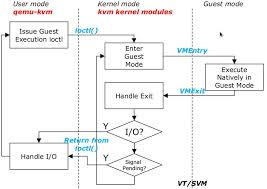
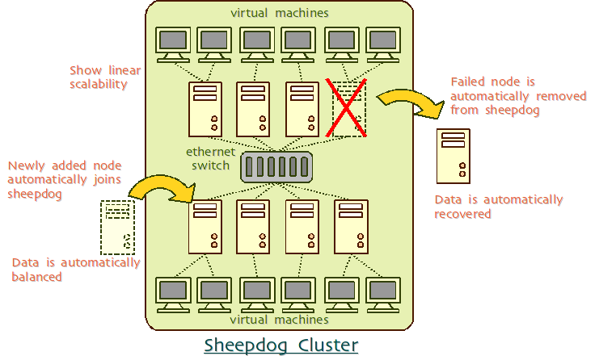
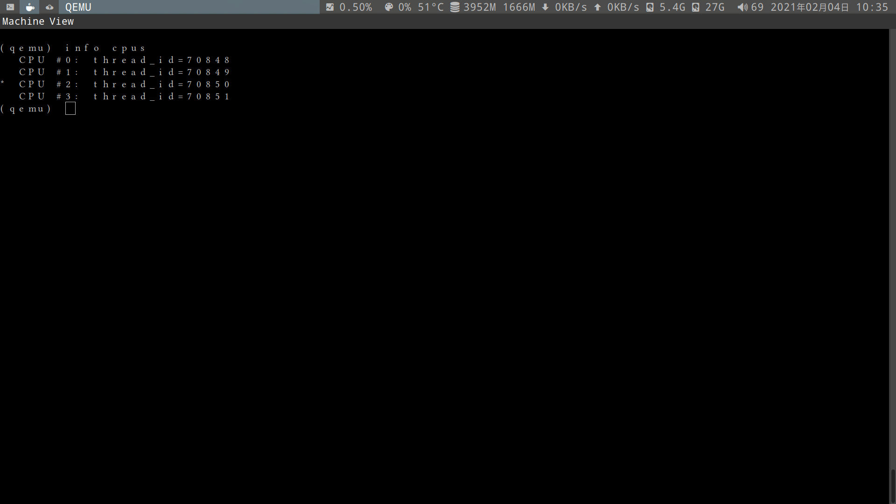

# kvm

guest(虚拟机) 运行在`guest mode`



查看是否开启硬件虚拟化:

```bash
egrep '(vmx|svm)' /proc/cpuinfo
```

## install(安装)

```bash
yum install -y qemu kvm libvirt virt-install virt-viewer libguestfs
```

## qemu

- [qemu 详细文档](https://qemu.readthedocs.io/en/latest/index.html)

- 提供 cpu,鼠标,键盘,设备等模拟

- 每个 guest 都是 qemu 的进程

  - 而每个 vcpu 是 qemu 进程的线程(cpu 可以过载分配 over-commit)

  - 当 guest 请求更多内存时,kvm 才会分配(memory 可以过载分配 over-commit,通过交换分区满足,如交换分区也不能满足,可能会被 kill)

- 配置文件`/etc/libvirt/qemu/`

### qemu-img

| 镜像格式                                         | 内容                          |
| ------------------------------------------------ | ----------------------------- |
| raw(默认)                                        | 性能最好                      |
| qcow2                                            | zlib 压缩,AES 加密,能使用快照 |
| vmdk                                             | VMware 格式                   |
| vhdx                                             | hyper-V 格式                  |
| vdi                                              | virtualbox 格式               |
| [sheepdog](https://github.com/sheepdog/sheepdog) | 分布式存储(见下图)            |



```bash
# 查看是否有错误(不能查看已启动的镜像)
qemu-img check file.img

# 查看镜像信息(不能查看已启动的镜像)
qemu-img info file.img
qemu-img info file.qcow2

# 格式转换
qemu-img convert -O raw file.qcow file.img
qemu-img convert -O qcow2 file.vmdk file.qcow2

# 查看快照
qemu-img snapshot -l centos7.0.qcow2
```

- 1.创建镜像:

```bash
# 随着使用逐渐增大
qemu-img create -f qcow2 arch.qcow2 10G

# -o preallocation=full 一开始便占用10G
qemu-img create -f qcow2 -o preallocation=full arch.qcow2 10G
```

- 2.安装虚拟机

  | 参数           | 操作               |
  | -------------- | ------------------ |
  | -m             | 内存               |
  | -smp           | cpu                |
  | -maxcpus=      | 最多,多少个 cpu    |
  | -boot once=d   | 首次启动顺序为光驱 |
  | -cdrom         | 分配 guest 光驱    |
  | -enable-kvm    | 开启 kvm 硬件加速  |
  | -ballon virtio | 分配 virtio 驱动   |

```bash
# 安装虚拟机.2G内存,4个cpu,首次启动顺序为光驱
qemu-system-x86_64 -enable-kvm -m 2G -smp 4 -boot once=d -cdrom archlinux-2020.11.01-x86_64.iso /mnt/Z/kvm/arch.qcow2

# -smp 4,maxcpus=$(nproc) 分配4个cpu,最多能有所有cpu
qemu-system-x86_64 -enable-kvm -m 2G -smp 4,maxcpus=$(nproc) -boot once=d -cdrom archlinux-2020.11.01-x86_64.iso /mnt/Z/kvm/arch.qcow2

qemu-system-x86_64 arch.qcow2 -net nic,model=virtio,addr=08 -net user
```

guest:

```bash
# 查看cpu模型
cat /proc/cpuinfo | grep 'model name'
```

- <kbd>ctrl + alt + 2</kbd> 可切换 `qemu monitor` 模式(qemu)

- <kbd>ctrl + alt + 2</kbd> 切换回去

- <kbd>ctrl + alt + g</kbd> guest 和 host 之间的切换

  

```qemu
# 查看cpu
info cpus

# 查看网络
info network
```

## libvirt

- `libvirt` 为用户提供 api, 对 `qemu` 和 `kvm` 的操作

  - 1.守护进程 libvirtd `libvirtd.service`

  - 2.应用程序接口 `virsh`(命令行) 和 `virt-manager`(图形界面)

  - 3.以上两者为`C/S`架构

连接:

```bash
# root用户
virsh -c qemu:///system
# 图形界面
virt-manager -c qemu:///system

# 当前用户
virsh -c qemu:///session

# ssh通道连接,远程root用户
virsh -c qemu+ssh:/user@ip//system

# tls通道连接,远程root用户(需要设置ca证书)
virsh -c qemu/user@ip//system

# tcp通道连接,远程root用户(非加密)
virsh -c qemu/user@ip//system
```

| 配置文件                   | 内容                    |
| -------------------------- | ----------------------- |
| /etc/libvirt/              | 配置文件目录            |
| /etc/libvirt/libvirt.conf  | libvirt 连接的别名      |
| /etc/libvirt/libvirtd.conf | libvirtd 守护进程的配置 |
| /etc/libvirt/qemu.conf     | qemu 进程的配置         |
| /etc/libvirt/qemu/         | guest 配置 和 网络配置  |

guest 的配置 `/etc/libvirt/qemu/arch.xml`

- cpuset 表示只允许调度 cpu1,2,4,6

- current 表示启动时只给 4 个 cpu,最多可以 32 个

```xml
<vcpu placement='static' cpuset="1-4,^3,6" current='4'>32</vcpu>
```

- features 标签表示要打开的硬件特性
  - acpi
  - apic

```xml
  <features>
    <acpi/>
    <apic/>
    <vmport state='off'/>
  </features>
```

- devices 设备
  - graphics 图形连接
  - sound 声卡
  - video 显卡

```xml
<devces>
    <graphics type='vnc' port='-1' autoport='yes'/>
    <sound>
    </sound>
    <video>
    </video>
<devces>
```

- cpu mode

  | cpu mode         | 内容                                      |
  | ---------------- | ----------------------------------------- |
  | custom           | 基础模型                                  |
  | host-model(默认) | 根据 cpu 物理特性,选择最接近标准 cpu 型号 |
  | host-passthrough | 直接暴露物理 cpu                          |

```xml
<cpu mode='host-model' check='partial'/>
```

### 普通用户连接 qemu:///system

```bash
# 将用户添加到libvirt组
sudo usermod -a -G libvirt $USER

# 修改配置文件
sudo vim /etc/libvirt/libvirtd.conf

unix_sock_group = "libvirt"
unix_sock_rw_perms = "0770"

# 重启(可能需要重新登陆)
sudo systemctl restart libvirtd.service

virsh -c qemu:///system
virt-manager -c qemu:///system
```

## virsh

```bash
# 查看虚拟机状态
virsh list --all

# 开启/关闭
virsh start opensuse15.2
virsh shutdown opensuse15.2

# 暂停/恢复
virsh suspend opensuse15.2
virsh resume opensuse15.2

# 查看cpu信息
vitsh vcpuinfo opensuse15.2

# 查看网络
virsh net-list --all

# 查看dhcp ip
virsh net-dhcp-leases --network default

# 查看运行中的虚拟机ip,mac
virsh domifaddr opensuse15.2_1

# 修改虚拟机ip地址.如虚拟机运行,需要重启
virsh net-update default add ip-dhcp-host \
      "<host mac='52:54:00:7f:81:df' \
       name='bob' ip='192.168.100.71' />" \
       --live --config
```

### 克隆虚拟机

opensuse15.2 -> opensuse15.2_1

```bash
# 暂停opensuse15.2
sudo virsh suspend opensuse15.2

# 克隆qcow2镜像
sudo virt-clone --original opensuse15.2 \
--name opensuse15.2_1 \
--file ./opensuse15.2_1.qcow2

grep mac /etc/libvirt/qemu/opensuse15.2_1.xml

# 连接
virsh start opensuse15.2_1
ssh user@ip

# 修改新的uuid
uuidgen eth0

# 如果是静态ip,则需要修改
vim /etc/sysconfig/network/ifcfg-eth0
systemctl restart network.service

# 如果是dhcp,在真机执行以下命令

# 查看mac地址
grep "mac address" /etc/libvirt/qemu/opensuse15.2_1.xml

# 通过mac地址修改ip
virsh net-update default add ip-dhcp-host \
      "<host mac='52:54:00:3d:62:04' \
       name='bob' ip='192.168.100.72' />" \
       --live --config
```

## correct way to move kvm vm

### dump

**source** host run

```sh
virsh dumpxml VMNAME > domxml.xml
```

**destination** host run

```sh
virsh define domxml.xml
```

### for net

**source** host run

```sh
virsh net-dumpxml NETNAME > netxml.xml
```

**destination** host run

```sh
virsh net-define netxml.xml && virsh net-start NETNAME & virsh net-autostart NETNAME
```

If the output is error

```sh
virsh net-destroy SOURCEname
virsh net-undefine SOURCEname
```

And then do it again

# 第三方软件资源

## [kvmtop](https://github.com/cha87de/kvmtop)

## [kvm management with wei ui](https://github.com/kimchi-project/kimchi)

# 优秀文章

## [QEMU KVM 学习笔记](https://yifengyou.gitbooks.io/learn-kvm/content/)

## [learn-kvm](https://github.com/yifengyou/learn-kvm)
