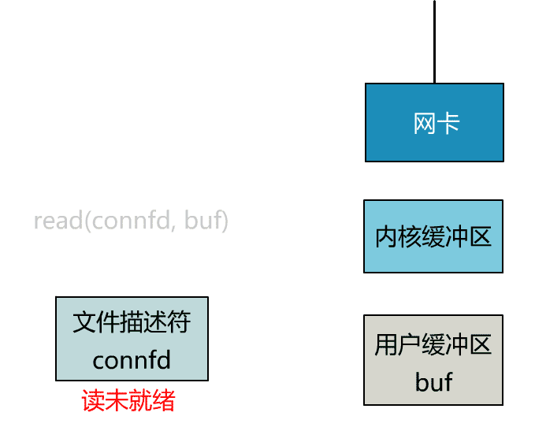

<!-- vim-markdown-toc GFM -->

* [CPU](#cpu)
    * [内核态](#内核态)
    * [中断](#中断)
* [memory（内存）](#memory内存)
    * [物理内存](#物理内存)
        * [热插拔（hotplug）](#热插拔hotplug)
        * [三种内存模型](#三种内存模型)
        * [UMA](#uma)
        * [NUMA（Non-uniform memory access，非一致存储访问结构）](#numanon-uniform-memory-access非一致存储访问结构)
            * [cache一致性](#cache一致性)
    * [虚拟内存](#虚拟内存)
        * [分段](#分段)
        * [分页](#分页)
            * [TLB](#tlb)
            * [段页式内存管理（分段 + 分页）](#段页式内存管理分段--分页)
            * [内存页面置换算法](#内存页面置换算法)
            * [linux实现](#linux实现)
                * [内核空间](#内核空间)
                * [用户空间](#用户空间)
            * [COW(copy-on-write，写时拷贝)](#cowcopy-on-write写时拷贝)
            * [malloc 是如何分配内存的？](#malloc-是如何分配内存的)
            * [内存回收](#内存回收)
                * [用户空间](#用户空间-1)
            * [在 4GB 物理内存的机器上，申请 8G 内存会怎么样？](#在-4gb-物理内存的机器上申请-8g-内存会怎么样)
* [Process、Thread(进程、线程)](#processthread进程线程)
    * [进程（Process）](#进程process)
        * [进程的状态](#进程的状态)
        * [进程控制块（process control block，PCB）](#进程控制块process-control-blockpcb)
        * [进程的通信](#进程的通信)
            * [管道](#管道)
        * [消息队列](#消息队列)
        * [共享内存](#共享内存)
        * [信号量](#信号量)
        * [锁](#锁)
            * [读写锁](#读写锁)
            * [乐观锁、悲观锁](#乐观锁悲观锁)
        * [socket](#socket)
    * [线程（Thread）](#线程thread)
    * [调度](#调度)
        * [调度算法](#调度算法)
    * [中断](#中断-1)
        * [硬中断](#硬中断)
        * [软中断](#软中断)
            * [tasklet：动态机制，基于 softirq](#tasklet动态机制基于-softirq)
            * [workqueue：动态机制，运行在进程上下文](#workqueue动态机制运行在进程上下文)
* [I/O](#io)
    * [磁盘调度算法](#磁盘调度算法)
    * [文件系统](#文件系统)
        * [文件的存储](#文件的存储)
            * [Linux ext2/3](#linux-ext23)
        * [空闲空间管理](#空闲空间管理)
            * [linux ext2](#linux-ext2)
        * [目录的存储](#目录的存储)
        * [硬链接、软链接](#硬链接软链接)
    * [文件I/O](#文件io)
        * [非直接I/O Page cache](#非直接io-page-cache)
            * [Page cache的零拷贝技术](#page-cache的零拷贝技术)
        * [直接I/O + 异步I/O 解决大文件传输问题](#直接io--异步io-解决大文件传输问题)
        * [缓冲区共享 (Buffer Sharing)](#缓冲区共享-buffer-sharing)
        * [I/O多路复用（select, poll, epoll）](#io多路复用select-poll-epoll)
            * [epoll()](#epoll)
            * [Reactor架构](#reactor架构)
            * [Proactor架构](#proactor架构)
    * [通用块层](#通用块层)
    * [设备控制器](#设备控制器)

<!-- vim-markdown-toc -->

# CPU

## 内核态

- [朱小厮的博客：进入内核态究竟是什么意思？]()

- 实模式：早期的DOS这样的操作系统，它其实将要执行的应用程序加载变成了操作系统的一部分

    - 单任务问题：用户程序自己可以访问大部分的硬件设备；用户程序甚至可以随意修改属于操作系统的数据。于是，当时的许多病毒也毫不客气地把自己直接连接到了操作系统的程序里面，一旦执行就永远驻留成为操作系统的一部分。

    - 多任务问题更严重：

        - 没有内存隔离：两个应用程序执意要使用同一个内存地址

        - 不管谁操作外部设备它都是一样响应。这样如果多个应用程序自己直接去操纵硬件设备，就会出现相互冲突
        - 如果应用程序自己把中断响应程序改掉了，整个操作系统都会崩溃

        - 操作系统没有能力在程序崩溃的下，清理这个应用程序使用的资源


- 内核态（保护模式）或者说CPU的特权模式

    - intel CPU每一代产品都会尽量兼容之前的产品，早期的CPU启动时是实模式，后来的CPU为了兼容早期的CPU，启动时也处于实模式，需要引导程序主动进入保护模式

    - 限制指令：判断当前状态，如果状态为用户模式则拒绝执行「特权指令

    - 限制内存：在cpu引入MMU的单元

        - 在用户模式下，所有内存访问经过MMU，从而对内存的访问受到了保护；在特权模式下，内存访问绕过MMU，直接访问物理内存

## 中断

- [Linux 中断（IRQ/softirq）基础：原理及内核实现（2022）](http://arthurchiao.art/blog/linux-irq-softirq-zh/)

- 中断（IRQ）：希望 CPU 停下手头的工作，优先处理重要的工作

- 硬中断流程：

    - 1.抢占当前任务：内核必须暂停正在执行的进程
    - 2.执行中断处理函数（ISR）：找到对应的中断处理函数，将 CPU 交给它（执行）
        - ISR 位于 Interrupt Vector table，这个 table 位于内存中的固定地址。

    - 3.中断处理完成之后：第 1 步被抢占的进程恢复执行

- 中断类型：

    - 异常（exception）：给被中断的进程发送一个 Unix 信号，以此来唤醒它，这也是为什么内核能如此迅速地处理异常的原因。

    - 外部硬件中断：
        - 1.I/O interrupts（IO 中断）： PCI 总线架构，多个设备共享相同的 IRQ line。
        - 2.Timer interrupts（定时器中断）
        - 3.Interprocessor interrupts（IPI，进程间中断）

```sh
# 最大中断数
dmesg | grep NR_IRQS
[    0.000000] NR_IRQS: 20736, nr_irqs: 1064, preallocated irqs: 16
```

- 软中断（softirq）：软中断是一个内核子系统

    - 每个 CPU 上会初始化一个 ksoftirqd 内核线程，负责处理各种类型的 softirq 中断事件

    ```sh
    systemd-cgls -k | grep softirq # 或者  ps -ef | grep ksoftirqd
    ├─   15 [ksoftirqd/0]
    ├─   24 [ksoftirqd/1]
    ├─   30 [ksoftirqd/2]
    ├─   36 [ksoftirqd/3]
    ├─   42 [ksoftirqd/4]
    ├─   48 [ksoftirqd/5]
    ├─   54 [ksoftirqd/6]
    ├─   60 [ksoftirqd/7]
    ├─   66 [ksoftirqd/8]
    ├─   72 [ksoftirqd/9]
    ├─   78 [ksoftirqd/10]
    ├─   84 [ksoftirqd/11]
    ```

    - 软中断占 CPU 的总开销
    ```sh
    # si 字段就是系统的软中断开销
    top -n1 | head -n3
    top - 23:01:35 up  3:49,  1 user,  load average: 0.84, 1.01, 1.14
    Tasks: 318 total,   1 running, 317 sleeping,   0 stopped,   0 zombie
    %Cpu(s):  2.6 us,  2.6 sy,  0.0 ni, 94.7 id,  0.0 wa,  0.0 hi,  0.0 si,  0.0 st
    ```

    - 每个软中断会经过下面几个阶段：

        - 1.通过 open_softirq() 注册软中断处理函数
        - 2.通过 raise_softirq() 将一个软中断 标记为 deferred interrupt，这会唤醒该软中断（但还没有开始处理）
        - 3.内核调度器调度到 ksoftirqd 内核线程时，会将所有等待处理的 deferred interrupt （也就是 softirq）拿出来，执行对应的处理方法（softirq handler）

    - 软中断类型
    ```sh
    cat /proc/softirqs
    ```

# memory（内存）

## 物理内存

- [小林coding：深入理解 Linux 物理内存管理](https://www.xiaolincoding.com/os/3_memory/linux_mem2.html)

- CPU通过物理内存地址向物理内存读写数据的完整过程：
    

### 热插拔（hotplug）

- 集群的规模一大，那么物理内存出故障的几率也会大大增加，物理内存的热插拔对提供集群高可用性也是至关重要的。

- 热插拔分为两个阶段：

    - 物理热插拔阶段：物理上将内存硬件插入（hot-add），拔出（hot-remove）主板的过程，其中涉及到硬件和内核的支持。

    - 逻辑热插拔阶段：由内核中的内存管理子系统来负责：

        - 如何动态的上线启用（online）对应的 hot-add 的内存

        - 如何动态下线（offline）对应的 hot-remove 的内存

- 拔出比插入更复杂

    - 拔出的物理内存中可能已经为进程分配了物理页，如何妥善安置这些已经被分配的物理页是一个棘手的问题。

### 三种内存模型

- 为了快速索引到具体的物理内存页，内核为每个物理页 struct page 结构体定义了一个索引编号：PFN（Page Frame Number）。

    - 内核提供了两个宏（page_to_pfn 与 pfn_to_page）：来完成 PFN 与 物理页结构体 struct page 之间的相互转换。

- 物理内存模型：如何组织管理这些物理内存页 struct page 的方式

- FLATMEM（平坦内存模型）：用一个数组来组织这些连续的、固定的物理内存页 struct page 结构，其在数组中对应的下标即为 PFN 。

    - Linux 早期使用的就是这种内存模型，因为在 Linux 发展的早期所需要管理的物理内存通常不大（比如几十 MB）

    

    - 缺点：存在大量不连续的内存地址区间这种情况时，这些不连续的内存地址区间就形成了内存空洞。

        - 为这些空洞而分配的 struct page（每个40Bytes） 将会占用大量的内存空间，导致巨大的浪费。

    

- DISCONTIGMEM（非连续内存模型）：为了解决FLATMEM的空洞，用node管理连续的物理内存页，每个node还是FLATMEM
    - 缺点：物理内存的热插拔依然会导致node的不连续

    

- SPARSEMEM（稀疏内存模型）：管理连续内存块的单元被称作 section（内核中用 struct mem_section 结构体表示）。用数组管理section

    - 物理页大小为 4k 的情况下， section 的大小为 128M ，物理页大小为 16k 的情况下， section 的大小为 512M。

    

    - 每个 mem_section 都可以在系统运行时改变 offline ，online 状态，以便支持内存的热插拔

        - offline 时：内核会把这部分内存隔离开，使得该部分内存不可再被使用，然后再把 mem_section 中已经分配的内存页迁移到其他 mem_section 的内存上. 。

        

        - 并非所有的物理页都可以迁移：迁移只是物理内存地址的变化，对用户空间的虚拟地址没有问题

            - 但内核空间的虚拟地址中的直接映射区，它的虚拟地址与物理地址是直接映射的关系，虚拟内存地址直接减去一个固定的偏移量（0xC000 0000 ） 就得到了物理内存地址。

            - 解决方法：内存分类：分为不可迁移页，可回收页，可迁移页。将可能会被拔出的内存中只分配那些可迁移的内存页

### UMA

- SMP（Symmetric multiprocessing 对称多处理器）：

    - 一个物理 CPU 可以存在多个物理 Core，而每个 Core 又可以存在多个硬件线程。

    - 例子：1 个 x86 CPU 有 4 个物理 Core，每个 Core 有两个 HT (Hyper Thread)
        - L1 和 L2 Cache 都被两个 HT 共享，且在同一个物理 Core。而 L3 Cache 则在物理 CPU 里，被多个 Core 来共享。
        - 在操作系统看来，就是一个 8 个 CPU 的 SMP 系统。

- SMP 系统的 CPU 和内存的互连方式分为：

    - 1.UMA (一致内存访问)

        

        - 所有的 CPU 访问内存都要过总线，并且它们的速度都是一样的。

        - 多路处理器通过 FSB (前端系统总线) 和主板上的内存控制器芯片 (MCH) 相连，DRAM 是以 UMA 方式组织的，延迟并无访问差异，

        - 缺点：总线很快就会成为性能瓶颈，随着 CPU 个数的增多导致每个 CPU 可用带宽会减少

    - 2.NUMA (非一致内存访问)

        

        - 内存控制器芯片被集成到处理器内部：多个处理器通过 QPI 链路相连，从此 DRAM 有了远近之分。
        - 片外的 IOH 芯片也集成到了处理器内部：至此，内存控制器和 PCIe Root Complex 全部在处理器内部了。

        - 一个 NUMA 节点通常可以被认为是一个物理 CPU 加上它本地的 DRAM 和 Device 组成。
            - 四路服务器就拥有四个 NUMA 节点。

        - 优点：CPU 在读取自己拥有的内存的时候就会很快；缺点：读取别 U 的内存的时候就会比较慢。

            - 这个技术伴随着服务器 CPU 核心数越来越多，内存总量越来越大的趋势下诞生的，因为传统的模型中不仅带宽不足，而且极易被抢占，效率下降的厉害。

        - Cache：除物理 CPU 有本地的 Cache 的层级结构以外，还存在跨越系统总线 (QPI) 的远程 Cache 命中访问的情况。
            - 远程的 Cache 命中，对发起 Cache 访问的 CPU 来说，还是被记入了 LLC Cache Miss。

        - DRAM：在两路及以上的服务器，远程 DRAM 的访问延迟，远远高于本地 DRAM 的访问延迟，有些系统可以达到 2 倍的差异。
            - 即使服务器 BIOS 里关闭了 NUMA 特性，也只是对 OS 内核屏蔽了这个特性，这种延迟差异还是存在的。

        - Device：对 CPU 访问设备内存，及设备发起 DMA 内存的读写活动而言，存在本地 Device 和远程 Device 的差别，有显著的延迟访问差异。

### NUMA（Non-uniform memory access，非一致存储访问结构）

- NUMA 的内存分配策略

| 内存分配策略      | 策略描述                                                                       |
|-------------------|--------------------------------------------------------------------------------|
| MPOL_BIND         | 必须在绑定的节点进行内存分配，如果内存不足，则进行 swap                        |
| MPOL_INTERLEAVE   | 本地节点和远程节点均可允许分配内存                                             |
| MPOL_PREFERRED    | 优先在指定节点分配内存，当指定节点内存不足时，选择离指定节点最近的节点分配内存 |
| MPOL_LOCAL (默认) | 优先在本地节点分配，当本地节点内存不足时，可以在远程节点分配内存               |

- numa的物理内存模型：

    - node_start_pfn 指向 NUMA node 内的第一个物理页 PFN。每个物理页的 PFN 都是全局唯一的

    - node_present_pages：统计 NUMA node 真正可用的物理页面数量（不包含内存空洞）

    - node_spanned_pages：统计 NUMA node 内所有的内存页（包含内存空洞）

    

- zone_type除了四大物理内存区域还有两个区域：

    - ZONE_DEVICE 是为支持热插拔设备而分配的非易失性内存（ Non Volatile Memory ），也可用于内核崩溃时保存相关的调试信息。

    - ZONE_MOVABLE：是一个虚拟区域包含这些物理区域（ZONE_DMA，ZONE_NORMAL，ZONE_HIGHMEM）。

        - 该区域的全部物理页都是可迁移的，主要是为了防止内存碎片和支持内存的热插拔。

        

    - 只有第一个 NUMA node 可以包含所有的物理内存区域

        

    | NUMA node状态   | 内容
    |-----------------|--------------------------------------------|
    | N_NORMAL_MEMORY | 只有 ZONE_NORMAL，没有 ZONE_HIGHMEM        |
    | N_HIGH_MEMORY   | 有 ZONE_NORMAL 或者有 ZONE_HIGHMEM         |
    | N_MEMORY        | 有 ZONE_NORMAL，ZONE_HIGHMEM，ZONE_MOVABLE |
    | N_CPU           | 包含一个或多个 CPU。                       |

    - numa node状态中的热插拔（需要SPARSEMEM 稀疏内存模型）

        | NUMA node状态 | 内容                           |
        |---------------|--------------------------------|
        | N_POSSIBLE    | 在某个时刻可以变为 online 状态 |
        | N_ONLINE      | 当前的状态为 online 状态       |

    ```sh
    # /proc/zoneinfo 维护着vm_stat结构（物理内存使用的统计信息）
    # 查看NUMA node中内存区域的分布情况

    cat /proc/zoneinfo | grep Node
    Node 0, zone      DMA
    Node 0, zone    DMA32
    Node 0, zone   Normal
    Node 0, zone  Movable
    Node 0, zone   Device
    ```

    - struct zone：是内核中用于描述和管理 NUMA node中的物理内存区域的结构体。

        - 由于是一个访问非常频繁的结构体，因此使用了 spinlock_t lock 自旋锁来防止并发错误

        - 内核会为每一个内存区域分配一个伙伴系统用于管理该内存区域下物理内存的分配和释放。

            

```sh
# 查看 numa 配置
numactl --hardware

# 查看内存
numactl -s

# 查看node 的内存分配情况
numastat

# --interleave=all内存分配是应该尽量均匀地分布在各个节点上，启动mongodb
numactl --interleave=all mongod --port 27017 --dbpath ~/mongodb
```

- 通过调整 `/proc/sys/vm/zone_reclaim_mode` ：当某个 Node 内存不足时，系统可以从其他 Node 寻找空闲内存，也可以从本地内存中回收内存。

    - 访问远端 Node 的内存比访问本地内存要耗时很多

    ```sh
    cat /proc/sys/vm/zone_reclaim_mode
    0
    ```

    | 值           | 操作                                                                       |
    |--------------|----------------------------------------------------------------------------|
    | 0 （默认值） | 在回收本地内存之前，在其他 Node 寻找空闲内存                               |
    | 1            | 只回收本地内存                                                             |
    | 2            | 只回收本地内存，在本地回收内存时，可以将文件页中的脏页写回硬盘，以回收内存 |
    | 4            | 只回收本地内存，在本地回收内存时，可以用 swap 方式回收内存                 |

#### cache一致性

- [云巅论剑：CPU Cache Line伪共享问题的总结和分析]()

- Cache Line ：是 CPU 和主存之间数据传输的最小单位。当一行 Cache Line 被从内存拷贝到 Cache 里，Cache 里会为这个 Cache Line 创建一个条目。

    - Cache 容量小于主存：多个主存地址可以被映射到同一个 Cache 条目

        - 通常是由内存的虚拟或者物理地址的某几位决定的，取决于 Cache 硬件设计是虚拟地址索引，还是物理地址索引。

            - 一个主存的物理或者虚拟地址，可以被分成三部分：
                - 高地址位当作 Cache 的 Tag，用来比较选中多路 (Way) Cache 中的某一路 (Way)
                - 低地址位可以做 Index，用来选中某一个 Cache Set。
                    - 由于索引位一般设计为低地址位，通常在物理页的页内偏移以内，因此，不论是内存虚拟或者物理地址，都可以拿来判断两个内存地址，是否在同一个 Cache Line 里。

        ```sh
        # 查看cache line的大小
        getconf -a | grep -i cache
        ```

- 在多个处理器的本地 Cache 里存在多份拷贝的可能性，因此就存在数据一致性问题。

    - 处理器都实现了 Cache 一致性 (Cache Coherence）协议。如历史上 x86 曾实现了 MESI 协议以及 MESIF 协议。

    - 假设两个处理器 A 和 B, 都在各自本地 Cache Line 里有同一个变量的拷贝流程：

        - 一：此时该 Cache Line 处于 Shared 状态。

        - 二：处理器 A 在本地修改了变量，除去把本地变量所属的 Cache Line 置为 Modified 状态以外，
            - 还必须在另一个处理器 B 读同一个变量前，对该变量所在的 B 处理器本地 Cache Line 发起 Invaidate 操作，标记 B 处理器的那条 Cache Line 为 Invalidate 状态。

        - 三：处理器 B 在对变量做读写操作时，如果遇到这个标记为 Invalidate 的状态的 Cache Line，即会引发 Cache Miss
            - 从而将内存中最新的数据拷贝到 Cache Line 里，然后处理器 B 再对此 Cache Line 对变量做读写操作

- Cache Line 伪共享：多个 CPU 上的多个线程同时修改自己的变量引发的。

    - 这些变量表面上是不同的变量，但是实际上却存储在同一条 Cache Line 里。

    - 由于 Cache 一致性协议，两个处理器都存储有相同的 Cache Line 拷贝的前提下

        - 本地 CPU 变量的修改会导致本地 Cache Line 变成 Modified 状态，然后在其它共享此 Cache Line 的 CPU 上，导致 Cache Line 变为 Invalidate 状态，从而使 Cache Line 再次被访问时，发生本地 Cache Miss，从而伤害到应用的性能。

        - 多个线程在不同的 CPU 上高频反复访问这种 Cache Line 伪共享的变量，则会因 Cache 颠簸引发严重的性能问题。

- Perf c2c 发现伪共享

    - 当应用在 NUMA 环境中运行，或者应用是多线程的，又或者是多进程间有共享内存，满足其中任意一条，那么这个应用就可能因为 Cache Line 伪共享而性能下降。

    - 要怎样才能知道一个应用是不是受伪共享所害呢？
        - Joe 的 patch 是在 Linux 的著名的 perf 工具上，添加了一些新特性，叫做 c2c，意思是“缓存到缓存” (cache-2-cache)。

    - 此处省略：perf c2c介绍和使用

## 虚拟内存

- [小林coding：深入理解 Linux 虚拟内存管理](https://www.xiaolincoding.com/os/3_memory/linux_mem.html)

- [小林coding：为什么要有虚拟内存？](https://www.xiaolincoding.com/os/3_memory/vmem.html)

- `ps aux`： VSZ 为虚拟内存大小；RSS 为物理内存大小

    ```sh
    ps aux
    USER         PID %CPU %MEM    VSZ   RSS TTY      STAT START   TIME COMMAND
    root           1  0.0  0.1 169088 13040 ?        Ss   Feb10   0:00 /sbin/init
    ```

### 分段

- 映射机制：

    - 段选择子：保存在段寄存器里面，包含段号用作段表的索引

    - 段表：包含段的基地址、段的界限和特权等级等。分段机制会分成4个段，每个段在段表都有段的基地址。段的基地址加上段内偏移量得到物理内存地址。

        
        

- 缺点：

    - 没有内部碎片，而有外部碎片（进程之间的间隙）

    - 解决外部碎片的方法（swap效率低）：

        - 1.把音乐程序占用的那 256MB 内存写到swap上

        - 2.然后再从swap上读到紧跟 512MB 内存的后面。这样就能空缺出连续的 256MB 空间。

        

### 分页

- 解决分段的缺点：在内存交换时只写入少量固定的数据Page（页）。

- 「页表」保存的是虚拟内存地址与物理内存地址的映射关系。把整个虚拟和物理地址切割成固定页（4KB），由cpu集成的硬件MMU（内存管理单元）负责转换

- 进程要访问的虚拟地址，在页表找不到的时候，就会产生**缺页中断**。`Page Fault Handler （缺页中断函数）` 就会分配物理地址，建立虚拟与物理地址的正向映射，更新页表。

- 页表项中除了物理地址之外，还有一些标记属性的比特，比如控制一个页的读写权限，标记该页是否存在等。在内存访问方面，操作系统提供了更好的安全性。

- 映射机制：

    - 页号：作为页表的索引

    - 页表：包含物理页每页所在物理内存的基地址。基地址加上页内偏移得到物理地址

        

- 优点：

    - swap效率高：

        - 内存不够时，根据机制把一部分页换出（写入）swap；需要时再换入（读取）

            

- 缺点：

    - 没有外部碎片，而有内部碎片（进程大小不足一页时，也要分配一页）

    - 页表本身占用很大的内存：

        - 一个页的大小是 4KB（2^12）

        - 在 32 位的环境下虚拟地址空间共有4GB，也就是100万（2^20）个页

        - 一个「页表项」需要 4Bytes，4GB 就需要有 4Bytes * 2^20 = 4MB 的内存来存储页表。

        - 100 个进程的话，就需要 400MB 的内存来存储页。那64 位就更大了

    - 解决方法：多级页表

        - 二级分页：将一级页表分为 1024 个二级页表（4Bytes * 1024 = 4KB），每个二级页表中包含 1024 个「页表项」（4Bytes * 1024 * 1024 = 4MB)

            

            - 总大小：4KB + 4MB 比之前的一级分页还大4KB

                - 但一级页表就可以覆盖整个 4GB 虚拟地址空间，如果某个一级页表的页表项没有被用到，也就不需要创建这个页表项对应的二级页表了。

                    - 假设只有 20% 的一级页表项被用到：4KB（一级页表） + 20% * 4MB（二级页表）= 0.804MB

        - 64位需要四级分页：

            | 四级分页                                  |
            |-------------------------------------------|
            | 全局页目录项 PGD（Page Global Directory） |
            | 上层页目录项 PUD（Page Upper Directory）  |
            | 中间页目录项 PMD（Page Middle Directory） |
            | 页表项 PTE（Page Table Entry）            |

            
            
            

#### TLB

- [TLB原理](https://zhuanlan.zhihu.com/p/108425561)

TLB（Translation Lookaside Buffer）：页表的缓存，集成在cpu内部，根据虚拟地址查找cache

#### 段页式内存管理（分段 + 分页）

段页式内存管理：先分段，每个段再分页

- 段页式地址变换中要得到物理地址须经过三次内存访问：
    - 1.访问段表，得到页表起始地址
    - 2.访问页表，得到物理页号
    - 3.将物理页号与页内位移组合，得到物理地址

    

#### 内存页面置换算法

- [小林coding：进程调度/页面置换/磁盘调度算法](https://www.xiaolincoding.com/os/5_schedule/schedule.html#%E5%86%85%E5%AD%98%E9%A1%B5%E9%9D%A2%E7%BD%AE%E6%8D%A2%E7%AE%97%E6%B3%95)

- 缺页中断的处理流程

    - 第四步如果内存满了：就需要「页面置换算法」选择一个物理页，如果该物理页有被修改过（脏页），则把它换出到磁盘，然后把该被置换出去的页表项的状态改成`无效的`，最后把正在访问的页面装入到这个物理页中。

    

    

     | 页表项字段 | 内容                                                                                                                                                                                                             |
     |------------|------------------------------------------------------------------------------------------------------------------------------------------------------------------------------------------------------------------|
     | 状态位     | 是否在物理内存中                                                                                                                                                                                                 |
     | 访问字段   | 在一段时间被访问的次数                                                                                                                                                                                           |
     | 修改位     | 表示该页在调入内存后是否有被修改过。由于内存中的每一页都在磁盘上保留一份副本，如果没有修改，在置换该页时就不需要将该页写回到磁盘上；如果已经被修改，则将该页重写到磁盘上，以保证磁盘中所保留的始终是最新的副本。 |
     | 硬盘地址   | 用于指出该页在硬盘上的地址，通常是物理块号，供调入该页时使用。                                                                                                                                                   |

- 最佳页面置换算法（OPT）：置换在「未来」最长时间不访问的页面。但是实际系统中无法实现，因为程序访问页面时是动态的，我们是无法预知每个页面在「下一次」访问前的等待时间。

    - 该算法可以衡量你的算法的效率，你的算法效率越接近该算法的效率，那么说明你的算法是高效的。

    

- 先进先出（FIFO）：选择在内存驻留时间很长的页面进行中置换

- 最近最久未使用（LRU）：选择最长时间没有被访问的页面进行置换

    - 缺点：开销大。LRU算法需要在内存中维护一个所有页面的链表，最近最多使用的页面在表头，最近最少使用的页面在表尾。在每次访问内存时都必须要更新「整个链表」。在链表中找到一个页面，删除它，然后把新的移动到表头是一个非常费时的操作。

- 时钟页面置换算法（Clock）：把所有的页面都保存在一个类似钟面的「环形链表」中，一个表针指向最老的页面。

    - 如果访问位是 1 就修改为0，并把表针前移一个位置，重复这个过程直到找到了一个访问位为 0 的页面为止
    - 如果它的访问位位是 0 就淘汰该页面，并把新的页面插入这个位置，然后把表针前移一个位置

    

- 最不常用算法（LFU）：选择「访问次数」最少的那个页面，并将其淘汰

    - 每个页面加一个计数器就可以实现。但只考虑了频率问题，没考虑时间的问题：比如有些页面在过去时间里访问的频率很高，但是现在已经没有访问了，而当前频繁访问的页面由于没有这些页面访问的次数高，而被置换时淘汰。

        - 因此需要定期减少访问的次数：当发生时间中断时，把过去时间访问的页面的访问次数除以 2，也就说，随着时间的流失，以前的高访问次数的页面会慢慢减少

#### linux实现

- Linux的虚拟地址空间：分为内核空间和用户空间两部分

    - 32位
    

    - 64 位：只使用了 48 位来描述虚拟内存空间，寻址范围为 2^48（256TB）。多出的高 16 位就形成了这个地址空洞（canonical address）。
        - 用户空间高16位全为0；内核空间高16位全为1；空洞地址的高16位不全为0也不全为1
    

##### 内核空间

- [小林coding：内核虚拟内存空间](https://www.xiaolincoding.com/os/3_memory/linux_mem.html#_7-%E5%86%85%E6%A0%B8%E8%99%9A%E6%8B%9F%E5%86%85%E5%AD%98%E7%A9%BA%E9%97%B4)

    

    > 自底向上解释每个映射区

    - 1.DMA:在 X86 体系结构下，ISA 总线的 DMA （直接内存存取）控制器，只能对内存的前16M 进行寻址，这就导致了 ISA 设备不能在整个 32 位地址空间中执行 DMA，只能使用物理内存的前 16M 进行 DMA 操作。

    - 2.直接映射区（ZONE_NORMAL）：

        - 一共896MB。前 1M 已经在系统启动的时候被系统占用，1M 之后的物理内存存放的是内核代码段，数据段，BSS 段

        - 在内核运行的过程中，会涉及内核栈的分配，内核会为每个进程分配一个固定大小的内核栈（一般是两个页大小，依赖具体的体系结构），每个进程的整个调用链必须放在自己的内核栈中，内核栈也是分配在直接映射区。

    - 3.vmalloc 动态映射区：将不连续的物理内存映射到连续的虚拟内存上。因此它只能将这些物理内存页一个一个地进行映射，在性能开销上会比直接映射大得多。

        

    - 4.永久映射区：内核通过 `alloc_pages()` 申请的物理内存页，可以通过调用 kmap 映射到永久映射区
    - 5.固定映射区：在固定映射区中虚拟地址是固定的，而被映射的物理地址是可以改变的
    - 6.临时映射区：临时映射，所以在拷贝完成之后，调用 kunmap_atomic 将这段映射再解除掉。

- 内核内存分配两种方式：

    - 1.当进程请求内核分配内存时，如果此时内存比较充裕，那么进程的请求会被立刻满足，如果此时内存已经比较紧张，内核就需要将一部分不经常使用的内存进行回收，从而腾出一部分内存满足进程的内存分配的请求，在这个回收内存的过程中，进程会一直阻塞等待。

    - 2.进程是不允许阻塞的，内存分配的请求必须马上得到满足，比如执行中断处理程序、执行持有自旋锁等临界区内的代码时，进程就不允许睡眠，因为中断程序无法被重新调度。这需要提前为预留一部分内存，当内存紧张时，可以分配。

- 高位内存区域对低位内存区域进行挤压

    - 当 ZONE_HIGHMEM 区域中的内存不足时，内核可以从 ZONE_NORMAL 进行内存分配

    - ZONE_NORMAL 区域内存不足时可以进一步降级到 ZONE_DMA 区域进行分配

    - 但不允许无限制挤压占用

        - 每个内存区域会给自己预留一定的内存（`lowmem_reserve` 数组）

            ```sh
            # 从左到右： ZONE_DMA，ZONE_DMA32，ZONE_NORMAL，ZONE_MOVABLE，ZONE_DEVICE 物理内存区域的预留内存比例
            # 64位没有ZONE_HIGHMEM
            cat /proc/sys/vm/lowmem_reserve_ratio
            256 256 32  0   0

            # sysctl命令查看lowmem_reserve_ratio
            sysctl vm.lowmem_reserve_ratio
            vm.lowmem_reserve_ratio = 256	256	32	0	0
            ```

            | 物理内存区域 | lowmem_reserve_ratio | 内存区域大小 | 物理内存页个数 |
            |--------------|----------------------|--------------|----------------|
            | ZONE_DMA     | 256                  | 8M           | 2048           |
            | ZONE_NORMAL  | 32                   | 64M          | 16384          |
            | ZONE_HIGHMEM | 0                    | 256M         | 65536          |

        - 预留的物理内存页个数：

            ZONE_DMA 为防止被 ZONE_NORMAL 挤压侵占：16384 / 256 = 64。

            ZONE_DMA 为防止被 ZONE_HIGHMEM 挤压侵占：(65536 + 16384) / 256 = 320。

            ZONE_NORMAL 为防止被 ZONE_HIGHMEM 挤压侵占：65536 / 32 = 2048。


##### 用户空间


| 用户空间           |                                                                          |
|--------------------|--------------------------------------------------------------------------|
| 代码段（text）     | 二进制可执行代码                                                         |
| 数据段（data）     | 已初始化的静态常量和全局变量                                             |
| BSS 段             | 未初始化的静态变量和全局变量                                             |
| 堆段（heap）       | 动态分配的内存，从低地址开始向上增长                                     |
| 文件映射段（mmap） | 动态库（如glibc）的代码段、数据段、BSS 段，mmap 系统调用映射的共享内存区 |
| 栈段（stack）      | 局部变量、函数调用的上下文等。默认为 8 MB                                |

- 修改栈段（stack）大小：

    ```sh
    # 查看stack大小，默认为8MB
    ulimit -s
    8192

    # 修改为16MB
    ulimit -s 16384
    ```

- 7 个内存段中，堆 `malloc()` 和文件映射段 `mmap()` 的内存是动态分配的。

- 图片的灰色部分是保留区（非法），比如C 的代码里会将无效的指针赋值为 NULL

- 子进程与线程的虚拟内存：

    > 进程和线程之间的本质区别：是否共享地址（mm_struct 结构体）

    - 子进程：`fork()` 函数创建的子进程虚拟内存，是直接父进程的拷贝

    - 线程：`vfork()` 或者 `clone()` 系统调用创建出的子进程会设置 `CLONE_VM 标识` ，父进程和子进程的虚拟内存空间就变成共享的了，并不是一份拷贝。

- 进程的虚拟内存空间包含一段一段的虚拟内存区域（Virtual memory area, 简称 VMA），每个VMA描述虚拟内存空间中一段连续的区域，每个VMA由许多虚拟页组成，即每个VMA包含许多页表项PTE。

    - 在默认fork中，父进程遍历每个VMA，将每个VMA复制到子进程，并自上而下地复制该VMA对应的页表项到子进程，对于64位的系统，使用四级分页目录，每个VMA包括PGD、PUD、PMD、PTE，都将由父进程逐级复制完成。
        - 在Async-fork中，父进程同样遍历每个VMA，但只负责将PGD、PUD这两级页表项复制到子进程。

- 在操作系统中，PTE的修改分为两类：
    - 1.VMA级的修改。例如，创建、合并、删除VMA等操作作用于特定VMA上，VMA级的修改通常会导致大量的PTE修改，因此涉及大量的PMD。
    - 2.PMD级的修改。PMD级的修改仅涉及一个PMD。

- [小林coding：定义虚拟内存区域的访问权限和行为规范](https://www.xiaolincoding.com/os/3_memory/linux_mem.html#_5-4-%E5%AE%9A%E4%B9%89%E8%99%9A%E6%8B%9F%E5%86%85%E5%AD%98%E5%8C%BA%E5%9F%9F%E7%9A%84%E8%AE%BF%E9%97%AE%E6%9D%83%E9%99%90%E5%92%8C%E8%A1%8C%E4%B8%BA%E8%A7%84%E8%8C%83)

    | vm_flags     | 访问权限               |
    |--------------|------------------------|
    | VM_READ      | 可读                   |
    | VM_WRITE     | 可写                   |
    | VM_EXEC      | 可执行                 |
    | VM_SHARD     | 可多进程之间共享       |
    | VM_IO        | 可映射至设备 IO 空间   |
    | VM_RESERVED  | 内存区域不可被换出     |
    | VM_SEQ_READ  | 内存区域可能被顺序访问 |
    | VM_RAND_READ | 内存区域可能被随机访问 |

    | 虚拟内存段           | 可读 | 可写 | 可执行 |
    |----------------------|------|------|--------|
    | 栈                   | yes  | yes  | no     |
    | 文件映射与匿名映射区 | yes  | yes  | yes    |
    | 堆                   | yes  | yes  | yes    |
    | 数据段               | yes  | yes  | no     |
    | 代码段               | yes  | no   | yes    |

    

- [小林coding：虚拟内存区域在内核中是如何被组织的](https://www.xiaolincoding.com/os/3_memory/linux_mem.html#_5-7-%E8%99%9A%E6%8B%9F%E5%86%85%E5%AD%98%E5%8C%BA%E5%9F%9F%E5%9C%A8%E5%86%85%E6%A0%B8%E4%B8%AD%E6%98%AF%E5%A6%82%E4%BD%95%E8%A2%AB%E7%BB%84%E7%BB%87%E7%9A%84)

    - vm_area_struct 会有两种组织形式：

        - 双向链表获取：`cat /proc/<pid>/maps` 或者 `pmap <pid>` 查看进程的虚拟内存空间布局

        - 红黑树：查找特定的虚拟内存区域时使用

        

- ELF

    - 磁盘文件中的段 Section；内存中的段 Segment

    - 进程运行之前：磁盘的Section 会加载到内存中并映射到内存中的 Segment。通常是多个 Section 映射到一个 Segment。

    | Section         | Segment              |
    |-----------------|----------------------|
    | .text（只读）   | 代码段（只读可执行） |
    | .rodata（只读） | 代码段（只读可执行） |
    | .data（可读写） | 数据段（可读写）     |
    | .bss （可读写） | BSS 段（可读写）     |

#### COW(copy-on-write，写时拷贝)

- 简单来说就是可以延迟拷贝页

- COW流程：
    - fork出的子进程共享父进程的物理空间，当父子进程有内存写入操作时，
    - 内存管理单元MMU检测到内存页是read-only内存页，于是触发缺页中断异常（page-fault）
    - 处理器会从中断描述符表（IDT）中获取到对应的处理程序。
    - 在中断程序中，内核就会把触发异常的物理内存页复制一份，并重新设置其内存映射关系，将父子进程的内存读写权限设置为可读写，于是父子进程各自持有独立的一份，之后进程才会对内存进行写操作

    

- 缺点：

    - 只适用于多读少写：其它场景下反而可能造成负优化，因为 COW事件所带来的系统开销要远远高于一次 CPU 拷贝所产生的。

    - 内存页的只读标志 (read-ony) 更改为 (write-only)需要TLB flush

    - 还是会造成父进程出现短时间阻塞，阻塞的时间跟页表的大小有关，页表越大，阻塞的时间也越长。

- 应用例子：redis的 `bgsave` , `bgwriteaof` 命令

#### malloc 是如何分配内存的？

- [小林coding：malloc 是如何分配内存的？](https://www.xiaolincoding.com/os/3_memory/malloc.html)

- malloc的两种分配内存方式：

    - 1.内存小于 128 KB：brk() 系统调用从堆分配内存

        

        - `cat /proc/<pid>/maps` 查看内存分配：有 `[heap]` 的标志

        - `free()` 释放内存后，会缓存在内存池，再次申请 相同的内存时就可以直接复用。减少了系统调用的次数，也减少了缺页中断的次数

            - 为什么不全部使用 `brk()` 来分配？ 堆内将产生越来越多不可用的碎片，导致“内存泄露”。而且无法使用 valgrind的工具 检测出来。

                


    - 2.内存大于等于 128 KB：mmap() 系统调用在文件映射区域分配内存

        

        - `cat /proc/<pid>/maps` 查看内存分配：没有 `[heap]` 的标志

        - `free()` 释放内存后，会真正的释放

- malloc分配的是虚拟内存，只有访问虚拟内存时才会触发 `缺页中断`

- malloc(1) 会分配多大的虚拟内存？malloc()会预分配更大的空间作为内存池，与内存管理器有关。

    | 内存管理器 | 实现者                    |
    |------------|---------------------------|
    | dlmalloc   | General purpose allocator |
    | ptmalloc2  | glibc                     |
    | jemalloc   | FreeBSD and Firefox       |
    | tcmalloc   | Google                    |
    | libumem    | Solaris                   |

    - 可以通过`cat /proc/<pid>/maps` 查看：

        ```
        562c319c2000-562c319e3000 rw-p 00000000 00:00 0                          [heap]
        ```

        - ptmalloc的`malloc(1)` 内存分配为：562c319e3000 - 562c319c2000 = 21000（转换为十进制135168 / 2 ^ 10 = 132KB）

- malloc() 返回的起始地址多了 16 字节：这16 字节就是保存了该内存块的描述信息，比如有该内存块的大小。执行 free() 函数时，就能知道释放多大的内存了

    

#### 内存回收

##### 用户空间

- [小林coding：内存满了，会发生什么？](https://www.xiaolincoding.com/os/3_memory/mem_reclaim.html)

- 发生缺页中断后，缺页中断函数会看是否有空闲的物理内存，如果没有就执行内存回收

- 文件页回收：通过 pflush 内核线程

- 匿名页回收：

    

    - 后台内存回收（kswapd）：异步的，不会阻塞进程的执行

    - 直接内存回收（direct reclaim）：同步的，会阻塞进程的执行

    - 直接内存回收后还是不够：触发 OOM （Out of Memory）机制：

        - `oom_badness()` 可以被杀掉的进程扫描一遍，并对每个进程打分，得分最高的进程就会被首先杀掉；如果还是不够，找到下一个进程继续杀掉，直到够。得分计算：

            - 1.进程已经使用的物理内存页面数。

            - 2.每个进程的oom_score_adj。可以通过 `/proc/<pid>/oom_score_adj` 来调整的进程被 OOM Kill 的几率，数值为-1000 到 1000 

    - `sar -B 1` 命令，查看后台、直接内存回收的指标

        

        | 指标      | 内容                                                                                                    |
        |-----------|---------------------------------------------------------------------------------------------------------|
        | pgscank/s | kswapd(后台回收线程) 每秒扫描的 page 个数                                                               |
        | pgscand/s | 应用程序在内存申请过程中每秒直接扫描的 page 个数。如果在抖动的时数值很大，那么大概率是**直接内存回收** |
        | pgsteal/s | 扫描的 page 中每秒被回收的个数（pgscank+pgscand）                                                       |

- 什么条件下才能触发 kswapd 内核线程回收内存呢？定义了三个内存阈值（watermark，也称为水位），用来衡量当前剩余内存（pages_free）是否充裕

    

    - kswapd 会定期扫描内存的使用情况，根据剩余内存（pages_free）的情况来进行内存回收的工作。

         | 剩余内存量               | 操作                                                                                  |
         |--------------------------|---------------------------------------------------------------------------------------|
         | pages_free在图中绿色部分 | 充足                                                                                  |
         | pages_free在图中蓝色部分 | 内存有一定压力，但还可以满足应用程序申请内存的请求                                    |
         | pages_free在图中橙色部分 | 内存压力比较大，剩余内存不多了。触发 kswapd0 执行内存回收，直到回到图中绿色部分为止。 |
         | pages_free在图中红色部分 | 用户可用内存都耗尽了。触发**直接内存回收**                                            |

    - 通过 `/proc/sys/vm/min_free_kbytes` 调整pages_min值，并间接调整其他值：

        ```sh
        # kswapd 的活动空间只有 pages_low 与 pages_min 之间（也就是图中橙色部分）
        cat /proc/sys/vm/min_free_kbytes
        67584
        ```

        - pages_high和pages_low都是根据pages_min计算的：

            ```
            pages_min = min_free_kbytes
            pages_low = pages_min*5/4
            pages_high = pages_min*3/2
            ```

    - 调整`min_free_kbytes`时要考虑应用程序关注什么：如果关注延迟，就增大；如果关注内存的使用量，就调小
        - 增大：会使得系统预留过多的空闲内存，从而在一定程度上降低了应用程序可使用的内存量，这在一定程度上浪费了内存。

        - min_free_kbytes 接近实际物理内存大小时：可能会频繁地导致 OOM 的发生。

- 哪些内存可以被回收？

    - 文件页（File-backed Page）：内核缓存的磁盘数据（Buffer）和内核缓存的文件数据（Cache）都叫作文件页。大部分文件页，都可以直接释放内存，以后有需要时，再从磁盘重新读取就可以了。

        - 而那些被应用程序修改过，并且暂时还没写入磁盘的数据（也就是脏页），就得先写入磁盘，然后才能进行内存释放。所以，回收干净页的方式是直接释放内存，回收脏页的方式是先写回磁盘后再释放内存。

            - 进程可以通过 `fsync()` 系统调用：将指定文件的所有脏页同步回写到磁盘

        - 对性能的影响：干净页直接释放内存，不影响；脏页会先写回到磁盘再释放内存，影响

    - 匿名页（Anonymous Page）：这部分内存没有实际载体，不像文件缓存有硬盘文件这样一个载体，比如堆、栈数据等。

        - 这部分内存很可能还要再次被访问，所以不能直接释放内存，它们回收的方式是通过 Linux 的 Swap 机制，Swap 会把不常访问的内存先写到磁盘中，然后释放这些内存，给其他更需要的进程使用。再次访问这些内存时，重新从磁盘读入内存就可以了。

            

        - 对性能的影响：Swap 会影响性能

    - 调整文件页和匿名页的回收倾向

        | 值  | 策略                                                                           |
        |-----|--------------------------------------------------------------------------------|
        | 0   | linux3.5以上：宁愿oom killer也不用swap；linux3.4以下：宁愿swap也不用oom killer |
        | 1   | linux3.5以上：宁愿swap也不用oom killer                                         |
        | 60  | 默认值                                                                         |
        | 100 | 操作系统主动使用swap                                                           |

        ```sh
        # 数值为0-100（默认为60）。越大越积极回收匿名页；越小越积极回收文件页，因此一般建议设置为0，但是并不代表不会回收匿名页。
        cat /proc/sys/vm/swappiness
        60
        ```

        ```sh
        # 查看swap的使用量
        free -h

        # 实时查看swap的使用。si和so表示swap in swap on
        dstat --vmstat 1
        # 或者
        vmstat 1

        # 查看进程 swap 换出的虚拟内存大小，它保存在 /proc/pid/status 的 Vmswap 字段中
        # 查看redis进程的swap使用情况，求和可以得出总的swap量
        cat /proc/$(pidof redis-server)/smaps | grep -i swap

        # 找出当前系统中 swap 占用最大的几个进程，并列出它们的进程号、进程名和 swap  大小。-k 3 表示按第三列进行排序，即按照交换空间大小排序
        for file in /proc/*/status;
            do awk '/VmSwap|Name|^Pid/{printf $2 " " $3}END{ print ""}' $file;
        done | sort -k 3 -n -r | head

        # 如果 swap 过高导致告警。可以关闭swap
        swapoff -a

        # 查看是否已经关闭，如果输出为空则表示 swap 成功关闭。
        cat /proc/swaps
        # 为了下一次重启机器后 swap 还是关闭状态我们还要编辑 /etc/fstab 文件，将其中关于 swap 的配置注释掉或者删除掉。
        ```

    - 文件页、匿名页都是根据LRU算法进行回收，维护着 active 和 inactive 两个双向链表：

        - 1.active_list 活跃内存页链表，这里存放的是最近被访问过（活跃）的内存页

        - 2.inactive_list 不活跃内存页链表，这里存放的是很少被访问（非活跃）的内存页

        ```sh
        # 查看两个链表内的文件页、匿名页
        cat /proc/meminfo | grep -i active | sort

        Active:          1173476 kB
        Active(anon):      22620 kB
        Active(file):    1150856 kB
        Inactive:        5501408 kB
        Inactive(anon):  4441512 kB
        Inactive(file):  1059896 kB
        ```

    - 为何要设置有两个链表？

        - [小林coding：如何避免预读失效和缓存污染的问题？](https://www.xiaolincoding.com/os/3_memory/cache_lru.html)

        - linux有预读机制。read 系统调动读取 4KB 数据，实际上内核使用预读机制（ReadaHead） 机制完成了 16KB 数据的读取，也就是通过一次磁盘顺序读将多个 Page 数据装入 Page Cache。

        - 如果预读失效，传统的LRU单链表就可能淘汰了热点数据，降低缓冲命中率。因此加入双链表。

            - inactive：存放预读的页

            - active：inactive预读的页成功的访问后，在从inactive中升级到active头部；而active末尾的页，降级inactive的头部

            

            - MySQL Innodb也有相应的机制：分为old、young，在同一个链表内young的比例为7，old为3

                
                

        - 缓存污染：大量的预读页只访问一次就进active、young，淘汰到可能是热点的页。如果以后都不访问，就导致缓存污染。

            - 解决方法：提高门槛

                - Linux：在内存页被访问第二次的时候，才将页从 inactive list 升级到 active list 里。

                - MySQL Innodb：在内存页被访问第二次访问的时候，以及第二次访问与第一次的间隔时间：

                    - 1 秒内（默认值）：不会升级

                    - 超过 1 秒：升级

#### 在 4GB 物理内存的机器上，申请 8G 内存会怎么样？

- [小林coding：在 4GB 物理内存的机器上，申请 8G 内存会怎么样？](https://www.xiaolincoding.com/os/3_memory/alloc_mem.html)

- 3G内存，申请8G内存：

    - 32 位：进程最多只能申请 3 GB 大小的虚拟内存空间，所以进程申请 8GB 内存的话，在申请虚拟内存阶段就会失败

    - 64位：进程申请 8GB 内存是没问题的，只要不读写这个虚拟内存，操作系统就不会分配物理内存。

- 64位，2G内存，申请4G内存：

    - `/proc/sys/vm/overcommit_memory` 调整申请内存是否允许overcommit

        | 值          | 操作                                                                                                                                                                                                                                                                                                                                     |
        |-------------|------------------------------------------------------------------------------------------------------------------------------------------------------------------------------------------------------------------------------------------------------------------------------------------------------------------------------------------|
        | 0（默认值） | Heuristic overcommit handling，它允许overcommit，但过于明目张胆的overcommit会被拒绝，比如malloc一次性申请的内存大小就超过了系统总内存。Heuristic的意思是“试探式的”，内核利用某种算法猜测你的内存申请是否合理，大概可以理解为单次申请不能超过free memory + free swap + pagecache的大小 + SLAB中可回收的部分 ，超过了就会拒绝overcommit。 |
        | 1           | Always overcommit. 允许overcommit，对内存申请来者不拒。                                                                                                                                                                                                                                                                                  |
        | 2           | Don’t overcommit. 禁止overcommit。                                                                                                                                                                                                                                                                                                       |

    - `overcommit_memory`为0时：Cannot allocate memory 错误

    - `overcommit_memory`为1时：成功

- 64位，2G内存，`overcommit_memory` 设置为1，，申请128T内存：

    - 关闭swap：触发oom后被kill掉。因为申请虚拟内存过程中本身需要内存，2G内存不够。

    - 开启swap：成功申请

# Process、Thread(进程、线程)

- [小林coding：进程、线程基础知识](https://www.xiaolincoding.com/os/4_process/process_base.html)

## 进程（Process）

- 并发：当进程执行磁盘io操作时，cpu会阻塞，此时cpu可以执行其它进程；完成磁盘io操作后，再发送一个中断通知cpu，cpu切换回来继续执行这个进程

    

### 进程的状态

- 3种基本状态

    | 基本状态            | 内容                                                                                                          |
    |---------------------|---------------------------------------------------------------------------------------------------------------|
    | 运行状态（Running） | 该时刻进程占用 CPU                                                                                            |
    | 就绪状态（Ready）   | 可运行，由于其他进程处于运行状态而暂时停止运行                                                                |
    | 阻塞状态（Blocked） | 该进程正在等待某一事件发生（如等待输入/输出操作的完成）而暂时停止运行，这时，即使给它CPU控制权，它也无法运行 |

    

- 另外2种基本状态

    | 基本状态         | 内容                         |
    |------------------|------------------------------|
    | 创建状态（new）  | 进程正在被创建时的状态       |
    | 结束状态（Exit） | 进程正在从系统中消失时的状态 |

    

- 2种挂起状态：有没有占用实际的物理内存空间的情况，通常会把阻塞状态的进程的换出(swap out)，等再次运行的时候，再swap in（换入）

    - 按<kbd>Ctrl+Z</kbd>可以主动挂起

    | 挂起状态     | 内容                                             |
    |--------------|--------------------------------------------------|
    | 阻塞挂起状态 | 进程在外存（硬盘）并等待某个事件的出现           |
    | 就绪挂起状态 | 进程在外存（硬盘），但只要进入内存，即刻立刻运行 |

    

- 状态的变迁：

    | 状态的变迁           | 过程                                                       |
    |----------------------|------------------------------------------------------------|
    | NULL -> 创建状态     | 新进程被创建时的第一个状态                                 |
    | 创建状态 -> 就绪状态 | 当进程被创建完成并初始化后，变为就绪状态，这个过程是很快的 |
    | 就绪态 -> 运行状态   | 被调度器选中后，就分配给 CPU 正式运行该进程                |
    | 运行状态 -> 结束状态 | 当进程已经运行完成或出错时                                 |
    | 运行状态 -> 就绪状态 | 时间片用完了，调度器接着从就绪状态中，选另外一个进程运行   |
    | 运行状态 -> 阻塞状态 | 当进程请求某个事件且必须等待时，例如请求 I/O 事件          |
    | 阻塞状态 -> 就绪状态 | 当进程要等待的事件完成时，它从阻塞状态变到就绪状态         |

- 终止进程的2种情况：

    - 子进程被终止时：在父进程处继承的资源应当还给父进程。
    - 父进程被终止时：子进程就变为孤儿进程，会被1号进程收养，并由1号进程对它们完成状态收集工作。

### 进程控制块（process control block，PCB）

- 操作系统用PCB数据结构来描述进程

    - PCB 是进程存在的唯一标识，有则意味着进程存在；进程消失了，那么 PCB 也会随之消失。


    | PCB                                 | 内容                                                         |
    |-------------------------------------|--------------------------------------------------------------|
    | pid(Process Number)                 | 进程唯一标识符                                               |
    | uid                                 | 用户标识符                                                   |
    | 状态(state)                         | 当前状态(运行/就绪/等待)                                     |
    | 优先级(priority)                    | 相对 于其他进程的优先级别                                    |
    | 程序计数器(program counter)         | 即将被执行的下一条程序指令的地址                             |
    | 内存指针(memory pointers)           | 包括指向程序代码、相关数据和共享内存的指针                   |
    | 寄存器(CPU Registers)               | 进程被中断时处理器寄存器中的数据                             |
    | l/O状态信息(I/0 status information) | 包括显示I/O请求、分配给进程的I/O设备、被解除使用的文件列表等 |
    | 记帐信息(accounting information)    | 包括占用处理器时间、时钟数总和、时间限制、账号等             |

- PCB通过链表的方式进行组织，把具有相同状态的进程链在一起，组成各种队列

    

### 进程的通信

- [小林coding：进程间有哪些通信方式？](https://www.xiaolincoding.com/os/4_process/process_commu.html)

#### 管道

- 管道传输数据是单向的。遵循先进先出原则

- `|` 管道

    

    shell创建ps和grep子进程

    ```sh
    ps auxf | grep nvim
    ```

- 命名管道

    ```sh
    # 创建管道文件
    mkfifo pipe_file

    # 向管道文件写入数据。此时会卡住
    echo 'hello' > pipe_file

    # 读取管道文件的数据
    cat < pipe_file
    ```

### 消息队列

- A 进程要给 B 进程发送消息，A 进程把数据放在对应的消息队列后就可以正常返回了，B 进程需要的时候再去读取数据就可以了。

    - 如果没有释放消息队列或者没有关闭操作系统，消息队列会一直存在。不像管道`|`那样用完即毁

- 消息队列是保存在内核中的消息链表，在发送数据时，会分成一个一个消息体（数据块），用户可以自定义消息体，每个消息体都是固定大小的存储块

    - 消息队列不适合比较大数据的传输：在 Linux 内核中 `MSGMAX` 和 `MSGMNB`两个宏，它们以字节为单位，分别定义了一条消息的最大长度和一个队列的最大长度。

- 存在用户态与内核态之间的数据拷贝开销：

    - 进程写入数据到内核中的消息队列时，会发生从用户态拷贝数据到内核态的过程
    - 进程读取内核中的消息数据时，会发生从内核态拷贝数据到用户态的过程

### 共享内存

- 共享内存的机制，就是拿出一块虚拟地址空间来，映射到相同的物理内存中

    - 解决了消息队列中用户态与内核态切换的开销

    

- 问题：多个进程同时修改同一个共享内存，那先写的那个进程会发现内容被别人覆盖了

### 信号量

- 共享的资源，在任意时刻只能被一个进程访问

    - 解决共享内存多进程冲突的问题

- 信号量是一个整型的计数器

    - P 操作：会把信号量减去 1

        - 如果信号量 < 0，则表明资源已被占用，进程需阻塞等待
        - 如果信号量 >= 0，则表明还有资源可使用，进程可正常继续执行

    - V 操作：会把信号量加上 1

        - 如果信号量 <= 0，则表明当前有阻塞中的进程，于是会将该进程唤醒运行
        - 如果信号量 > 0，则表明当前没有阻塞中的进程

    - P 操作是用在进入共享资源之前，V 操作是用在离开共享资源之后，这两个操作是必须成对出现的。


- 互诉信号量：初始化信号量为 1

    - 互斥信号量的值仅取 1、0 和 -1 三个值

        - 互斥信号量为 1：表示没有线程进入临界区
        - 互斥信号量为 0：表示有一个线程进入临界区
        - 互斥信号量为 -1：表示一个线程进入临界区：另一个线程等待进入

    - 进程 A 在访问共享内存前，先执行了 P 操作信号量变为 0，表示共享资源可用，于是进程 A 就可以访问共享内存。

    - 若此时，进程 B 也想访问共享内存，执行了 P 操作，结果信号量变为了 -1，这就意味着临界资源已被占用，因此进程 B 被阻塞。

    - 直到进程 A 访问完共享内存，才会执行 V 操作，使得信号量恢复为 0，接着就会唤醒阻塞中的线程 B，使得进程 B 可以访问共享内存，最后完成共享内存的访问后，执行 V 操作，使信号量恢复到初始值 1。

    

- 同步信号量：初始化信号量为 0

    - 进程 A 是负责生产数据，而进程 B 是负责读取数据

    - 如果进程 B 比进程 A 先执行了，那么执行到 P 操作时，信号量会变为 -1，表示进程 A 还没生产数据，于是进程 B 就阻塞等待

    - 接着，当进程 A 生产完数据后，执行了 V 操作，就会使得信号量变为 0，于是就会唤醒阻塞在 P 操作的进程 B

    - 最后，进程 B 被唤醒后，意味着进程 A 已经生产了数据，于是进程 B 就可以正常读取数据了。

### 锁

- [小林coding：什么是悲观锁、乐观锁？](https://www.xiaolincoding.com/os/4_process/pessim_and_optimi_lock.html)

- 自旋锁（spin lock）：加锁失败后，线程就会一直 while 循环，直到它拿到锁

- 互斥锁：加锁失败后，线程会释放 CPU ，给其他线程；

    - 由内核实现。当加锁失败时，内核会将线程置为「睡眠」状态，等到锁被释放后，内核会在合适的时机唤醒线程
        - 开销：互斥锁加锁失败时，会从用户态陷入到内核态；并且有两次线程上下文切换的成本（一次线程上下文切换大概几十纳秒到几微秒之间）

            - 1.加锁失败时，内核会把线程设置为「睡眠」状态，然后把 CPU 切换给其他线程运行

            - 2.当锁被释放时，线程变为「就绪」状态，然后内核会在合适的时间，把 CPU 切换给该线程运行

            - 因此如果你能确定，被锁住的代码执行时间比线程上下文切换还短，就不应该用互斥锁，而应该选用自旋锁，否则使用互斥锁。

        

- 无等待锁：当没获取到锁的时候，就把当前线程放入到锁的等待队列

- [小林coding：怎么避免死锁？](https://www.xiaolincoding.com/os/4_process/deadlock.html)

    - 死锁：使用不当两个互斥锁，导致两个线程都在等待对方释放锁

    - 死锁的必须满足的4个条件：

        - 1.互斥条件：指多个线程不能同时使用同一个资源

        - 2.持有并等待条件：线程 A 在等待资源 2 的同时并不会释放自己已经持有的资源 1

        - 3.不可剥夺条件：当线程已经持有了资源 ，在自己使用完之前不能被其他线程获取，线程 B 如果也想使用此资源，则只能在线程 A 使用完并释放后才能获取

        - 4.环路等待条件：线程 A 已经持有资源 2，而想请求资源 1， 线程 B 已经获取了资源 1，而想请求资源 2

        - 破坏其中一个条件，就能解决死锁：

            - 资源有序分配法（避免环路）：线程 A 和 线程 B 总是以相同的顺序申请自己想要的资源。

#### 读写锁

读锁：可以有多个线程持有，因此是共享锁

写锁：只能有一个线程持有，因此是互诉锁

- 优先算法

    - 读优先：线程A获取读锁后，接着线程B获取写锁时会阻塞，此时线程C也想获取读锁，即使在有线程B被阻塞的情况依然获取读锁

    

    - 写优先：线程 C 获取读锁时会阻塞，而不是读优先的可以获取

    

    - 不管是读优先、写优先都有另一方被饿死的情况

#### 乐观锁、悲观锁

悲观锁：互斥锁、自旋锁、读写锁

- 乐观锁：先修改完共享资源，再验证这段时间内有没有发生冲突，如果没有其他线程在修改资源，那么操作完成，如果发现有其他线程已经修改过这个资源，就放弃本次操作。

    - 乐观锁虽然去除了加锁解锁的操作，但是一旦发生冲突，重试的成本非常高，所以只有在冲突概率非常低，且加锁成本非常高的场景时，才考虑使用乐观锁。

    - 通过`版本号`检验冲突：带上原始版本号，服务器收到后将它与当前版本号进行比较，如果版本号不一致则提交失败，如果版本号一致则修改成功，然后服务端版本号更新到最新的版本号。

- 例子：

    - 在线编辑文档

    - SVN 和 Git 也是用了乐观锁的思想，先让用户编辑代码，然后提交的时候，通过版本号来判断是否产生了冲突，发生了冲突的地方，需要我们自己修改后，再重新提交。

### socket

- 可以跨网，也可以在同一主机下通信

## 线程（Thread）

- 对比进程：

    - 优点：

        - 创建和终止时间更快
        - 线程切换更快。不像进程那样需要切换页表
        - 线程之间的通信效率更高。**用户线程**在数据传递的时候，就不需要经过内核

    - 缺点：

        - 当进程中的一个线程崩溃时，会导致其所属进程的所有线程崩溃

            - [小林coding：线程崩溃了，进程也会崩溃吗？](https://www.xiaolincoding.com/os/4_process/thread_crash.html)

            - 线程崩溃后，内核会发送kill信号让进程退出

            - 如果进程没有注册自己的信号处理函数，那么操作系统会执行默认的信号处理程序（一般最后会让进程退出）

                - JVM 自己定义了信号处理函数，这样当发送 kill pid 命令（默认会传 15 也就是 SIGTERM）后，JVM 就可以在信号处理函数中执行一些资源清理之后再调用 exit 退出。

- TCB（Thread Control Block, 线程控制块）

- 3种线程：

    - 用户线程（User Thread）： TCB是在库里面来实现的，对于操作系统而言是看不到这个 TCB 的，它只能看到整个进程的 PCB。

        - 优点：

            - 用户线程切换也是由线程库函数来完成的，无需用户态与内核态的切换，所以速度特别快

        - 缺点：

            - 除非它主动地交出 CPU 的使用权，否则它所在的进程当中的其他线程无法运行

            - 由于时间片分配给进程，故与其他进程比，在多线程执行时，每个线程得到的时间片较少

    - 内核线程（Kernel Thread）：TCB 放在操作系统里的，操作系统负责线程的创建、终止和管理

        - 优点：某个内核线程发起系统调用而被阻塞，并不会影响其他内核线程的运行
        - 缺点：线程的创建、终止和切换都是通过系统调用的方式来进行，开销更大

    - 轻量级线程（LightWeight Process, LWP）：内核中来支持用户线程

- 不同线程的对应关系：

    | 用户线程和内核线程的对应关系 |                                                |
    |------------------------------|------------------------------------------------|
    | 多对一：                     |   |
    | 一对一：                     |  |
    | 多对多：                     |  |

    - LWP 和内核线程是：一对一

    - 用户线程和LWP的对应关系跟内核线程一样，有3种对应关系：

        

        - 一对一模式（图片上的进程4）：一个用户线程 -> 一个 LWP -> 一个内核线程

            - 优点：当一个 LWP 阻塞，不会影响其他 LWP
            - 缺点：每一个用户线程，就产生一个内核线程，创建线程的开销较大。

        - 多对一模式（图片上的进程2）：

            - 优点：用户线程要开几个都没问题，且上下文切换发生用户空间，切换的效率较高
            - 缺点：一个用户线程如果阻塞了，则整个进程都将会阻塞，另外在多核 CPU 中，是没办法充分利用 CPU 的。

        - 多对多模式（图片上的进程3）：

            - 优点：综合了前两种优点，大部分的线程上下文发生在用户空间，且多个线程又可以充分利用多核 CPU 的资源。

        - 组合模式（图片上的进程5）：综合了一对一，多对多。开发人员可以针对不同的应用特点调节内核线程的数目来达到物理并行性和逻辑并行性的最佳方案。

- [小林coding：一个进程最多可以创建多少个线程？](https://www.xiaolincoding.com/os/4_process/create_thread_max.html)

- 32位：用户内存为3G
- 64位：用户内存128T

- 查看进程创建线程时默认分配的栈空间大小

    ```sh
    # 为8M
    ulimit -a | grep 'stack size'
    -s: stack size (kbytes)             8192
    ```

    - 32位只有3G，假设一个线程需要占用 10M 虚拟内存，最多大概能创建300 个（3G/10M）左右的线程
        ```sh
        # 可以缩小为512K，从而创造更多的线程
        ulimit -s 512
        ```

- 64为的用户空间有128T,根本用不完。可创建线程还会受以下参数影响

    ```sh
    # 最大线程数
    cat /proc/sys/kernel/threads-max
    63059

    # pid、tid的数量。超过这个数就不能创建进程和线程
    cat /proc/sys/kernel/pid_max
    4194304

    # 一个进程可以拥有的最大虚拟内存区域数量。如果它的值很小，也会导致创建线程失败
    cat /proc/sys/vm/max_map_count
    65530
    ```

## 调度

- 非抢占式调度算法：

    ```mermaid
    flowchart LR
        直到进程被阻塞或者直到该进程退出 ==> 才会调用另外一个进程
    ```

- 抢占式调度算法：只运行某段时间，如果在该时段结束时，该进程仍然在运行时，则会把它挂起，接着从就绪队列挑选另外一个进程：

    ```mermaid
    flowchart LR
        进程 == 只运行某段时间 ==> 挂起.接着从就绪队列挑选另外一个进程
    ```

| 调度指标   |                                                                                                                                               |
|------------|-----------------------------------------------------------------------------------------------------------------------------------------------|
| CPU 利用率 | 程序发生了 I/O 事件的请求，那 CPU 使用率必然会很低，调度程序需要从就绪队列中选择一个进程来运行                                                |
| 系统吞吐量 | 单位时间内 CPU 完成进程的数量，长作业的进程会占用较长的 CPU 资源，因此会降低吞吐量，相反，短作业的进程会提升系统吞吐量                       |
| 周转时间   | 周转时间是进程运行+阻塞时间+等待时间的总和，如果进程的等待时间很长而运行时间很短，那周转时间就很长，一个进程的周转时间越小越好               |
| 等待时间   | 进程处于就绪队列的时间，等待的时间越长，用户越不满意                                                                                          |
| 响应时间   | 用户提交请求到系统第一次产生响应所花费的时间，对于鼠标、键盘这种交互式比较强的应用，我们当然希望它的响应时间越快越好，否则就会影响用户体验了 |

### 调度算法

- 非抢占式的先来先服务（First Come First Serve, FCFS）：从就绪队列选择最先进入队列的进程，然后一直运行，直到进程退出或被阻塞

    - 对长作业有利，不利于短作业。适用于 CPU 繁忙型作业的系统，而不适用于 I/O 繁忙型作业的系统

    

- 最短作业优先（Shortest Job First, SJF）：优先选择运行时间最短的进程来运行，这有助于提高系统的吞吐量。

    - 缺点：会使得长作业不断的往后推，周转时间变长，致使长作业长期不会被运行

    

- 高响应比优先调度算法 （Highest Response Ratio Next, HRRN）：权衡了短作业和长作业

    - 调度时先计算「响应比优先级」，然后把「响应比优先级」最高的进程投入运行

        $$响应比优先级 = {等待时间 + 要求服务时间 \over 要求服务时间}$$

        - 「等待时间」相同时，「要求的服务时间」越短，「响应比」就越高。短作业会被选中
        - 「要求的服务时间」相同时，「等待时间」越长，「响应比」就越高。长作业会被选中

    - 但由于进程「要求的服务时间」无法预知。这只是个理性算法

- 时间片轮转（Round Robin, RR）：每个进程被分配一个时间片，时间片用完，进程还在运行，并把 CPU 分配给另外一个进程

    - 时间片长度：一般为 `20ms~50ms`

        - 太短：导致过多的进程上下文切换，降低了 CPU 效率
        - 太长：又可能引起对短作业进程的响应时间变长

- 最高优先级（Highest Priority First，HPF）：

    - 两种优先级

        - 静态优先级：创建进程时候，就已经确定了优先级了，然后整个运行时间优先级都不会变化；
        - 动态优先级：根据进程的动态变化调整优先级，比如如果进程运行时间增加，则降低其优先级，如果进程等待时间（就绪队列的等待时间）增加，则升高其优先级

    - 该算法也有两种处理优先级高的方法，非抢占式和抢占式：

        - 非抢占式：当就绪队列中出现优先级高的进程，运行完当前进程，再选择优先级高的进程。
        - 抢占式：当就绪队列中出现优先级高的进程，当前进程挂起，调度优先级高的进程运行。

    - 缺点：低优先级的进程永远不会运行

- 多级反馈队列（Multilevel Feedback Queue，MFQ）：综合「时间片轮转算法」和「最高优先级算法」

    

    - 「多级」表示有多个队列，每个队列优先级从高到低，同时优先级越高时间片越短

        - 如果在第一级队列规定的时间片没运行完成，则将其转入到第二级队列的末尾，以此类推，直至完成

    - 「反馈」如果进程运行时，有新进程进入较高优先级的队列，则停止当前运行的进程并将其移入到原队列末尾，接着让较高优先级的进程运行

    - 顾了长短作业，同时有较好的响应时间

## 中断

### 硬中断

- 中断处理流程：
    - 1.抢占当前任务：内核必须暂停正在执行的进程
    - 2.执行中断处理函数（ISR）：找到对应的中断处理函数，将 CPU 交给它（执行）
    - 3.中断处理完成之后，处理器恢复执行被中断的进程

| 外部硬件中断                                 |
|----------------------------------------------|
| I/O interrupts（IO 中断）                    |
| Timer interrupts（定时器中断）               |
| Interprocessor interrupts（IPI，进程间中断） |

```sh
# 最大硬中断数量。有 16 个是预分配的 IRQs
sudo dmesg | grep NR_IRQS
[    0.000000] NR_IRQS: 20736, nr_irqs: 1096, preallocated irqs: 16
```

### 软中断

- 每个 CPU 上会初始化一个 ksoftirqd 内核线程，负责处理各种类型的 softirq 中断事件

    ```sh
    # 查看ksoftirqd
    systemd-cgls -k | grep softirq 
    ```

    ```sh
    # 软中断的cpu开销
    top | grep -i si
    ```

- softirqs 是在 Linux 内核编译时就确定好的。一共 9 种 softirq。如果想加一种新 softirq 类型，就需要修改并重新编译内核
    ```c
    // include/linux/interrupt.h

    enum {
        HI_SOFTIRQ=0,          // tasklet
        TIMER_SOFTIRQ,         // timer
        NET_TX_SOFTIRQ,        // networking
        NET_RX_SOFTIRQ,        // networking
        BLOCK_SOFTIRQ,         // IO
        IRQ_POLL_SOFTIRQ,
        TASKLET_SOFTIRQ,       // tasklet
        SCHED_SOFTIRQ,         // schedule
        HRTIMER_SOFTIRQ,       // timer
        RCU_SOFTIRQ,           // lock
        NR_SOFTIRQS
    };
    ```
    ```sh
    # 等同于上面的类型
    cat /proc/softirqs
                  CPU0     CPU1
          HI:        2        0
       TIMER:   443727   467971
      NET_TX:    57919    65998
      NET_RX:    28728  5262341
       BLOCK:      261     1564
    IRQ_POLL:        0        0
     TASKLET:       98      207
       SCHED:  1854427  1124268
     HRTIMER:    12224    68926
         RCU:  1469356   972856
    ```

#### tasklet：动态机制，基于 softirq

- 可以在运行时（runtime）创建和初始化的 softirq

- 永远运行在指定 CPU

#### workqueue：动态机制，运行在进程上下文

- softirq 和 tasklet 依赖软中断子系统，运行在软中断上下文中

- workqueue 不依赖软中断子系统，运行在内核进程上下文中

    - 不能像 tasklet 那样是原子

- Workqueue工作队列是利用内核线程来异步执行工作任务的通用机制

```sh
systemd-cgls -k | grep kworker
```

# I/O


## 磁盘调度算法

- [小林coding：进程调度/页面置换/磁盘调度算法](https://www.xiaolincoding.com/os/5_schedule/schedule.html#%E7%A3%81%E7%9B%98%E8%B0%83%E5%BA%A6%E7%AE%97%E6%B3%95)


- 寻道的时间是磁盘访问最耗时的部分，如果请求顺序优化的得当，必然可以节省一些不必要的寻道时间，从而提高磁盘的访问性能。

- 假设初始磁头当前的位置是在第 53 磁道。有下面一个请求序列，每个数字代表磁道的位置：98，183，37，122，14，124，65，67

- 先来先服务（First-Come，First-Served，FCFS）：先到来的请求，先被服务

    - 总共移动了 640 个磁道的距离

    - 缺点：如果大量进程竞争使用磁盘，请求访问的磁道可能会很分散，在性能上就会显得很差，因为寻道时间过长。

    

- 最短寻道时间优先（Shortest Seek First，SSF）：优先选择从当前磁头位置所需寻道时间最短的请求

    - 那么请求的顺序变为：65，67，37，14，98，122，124，183

    - 总共移动了总 236 个磁道

    - 缺点：有饥饿问题。磁头有可能再一个小区域内来回得移动。

    

- 扫描算法（Scan）：也叫电梯算法。按一个方向移动，直到在那个方向上没有请求为止，然后改变方向。

    - 先朝磁道号减少的方向移动，那么请求的顺序变为：37，14，0，65，67，98，122，124，183

    - 缺点：虽不会产生饥饿现象，但是存在这样的问题，中间部分的磁道会比较占便宜，中间部分相比其他部分响应的频率会比较多，也就是说每个磁道的响应频率存在差异。

    

- 循环扫描（Circular Scan, CSCAN ）：按一个方向移动，直到在那个方向上没有请求为止，返回时直接快速移动至最靠边缘的磁道，但中途不处理任何请求

    - 对比扫描算法，对于各个位置磁道响应频率相对比较平均

    

- LOOK 与 C-LOOK算法： SCAN 算法的优化。移动到最远的请求位置，然后立即反向移动，而不需要移动到磁盘的最始端或最末端

    LOOK
    

    C-LOOK
    


## 文件系统

- 一切皆文件：每个文件有两个数据结构

    - inode（索引节点）：索引节点是文件的唯一标识，也会被存储在硬盘中。记录文件的元信息，比如 inode 编号、文件大小、访问权限、创建时间、修改时间、数据在磁盘的位置等等。

    - dentry（目录项）：记录文件的名字。由内核维护的一个数据结构，不存放于磁盘，而是缓存在内存。

        - 查询目录频繁从磁盘读，效率会很低，所以内核会把已经读过的目录用目录项这个数据结构缓存在内存

- 文件系统格式化时，分成三个存储区域

    - 超级块：用来存储文件系统的详细信息，比如块个数、块大小、空闲块等等
        - 当文件系统挂载时进入内存

    - 索引节点区：用来存储索引节点
        - 当文件被访问时进入内存

    - 数据块区：用来存储文件或目录数据

    

- VFS对用户提供统一的接口，这样程序员不需要了解文件系统的工作原理

    

- 操作系统为每个进程维护一个打开文件表，文件表里的每一项代表「文件描述符」

    | 文件表维护的信息 | 内容                                                                |
    |------------------|---------------------------------------------------------------------|
    | 文件指针         | 上次读写位置作为当前文件位置指针                                    |
    | 文件打开计数器   | 多个进程可能打开同一个文件，当该计数为 0 时才会关闭文件，删除该条目 |
    | 文件磁盘位置     | 该信息保存在内存中，以免每个操作都从磁盘中读取                      |
    | 访问权限         | 创建、只读、读写、添加等                                            |

- 文件系统的基本操作单位是数据块：用户习惯以字节的方式读写文件，而操作系统则是以数据块来读写文件，那屏蔽掉这种差异的工作就是文件系统了。

    - 用户进程从文件读取时：文件系统则需要获取字节所在的数据块，再返回数据块对应的用户进程所需的数据部分。

    - 用户进程写数据进文件时：文件系统则找到需要写入数据的数据块的位置，然后修改数据块中对应的部分，最后再把数据块写回磁盘。

### 文件的存储

- 连续空间存放方式

    - 文件存放在磁盘「连续的」物理空间中，但必须先知道一个文件的大小

    - inode（文件头）里需要指定「起始块的位置」和「长度」

    

    - 优点：读写效率高

    - 缺点：

        - 1.磁盘空间碎片
            

        - 2.文件长度不易扩展

            - 例如上图中的文件 A 要想扩大一下，需要更多的磁盘空间，唯一的办法就只能是挪动的方式

- 非连续空间存放方式

    - 优点：消除磁盘碎片，文件的长度可以动态扩展

    - 链表方式

        - 隐式链表：inode（文件头）要包含「第一块」和「最后一块」的位置，并且每个数据块里面留出一个指针空间，用来存放下一个数据块的位置

            - 缺点：

                - 无法直接访问数据块，只能通过指针顺序访问文件，以及数据块指针消耗了一定的存储空间

                - 如果软件或者硬件错误导致链表中的指针丢失或损坏，会导致文件数据的丢失。

            

        - 显式链接：把用于链接文件各数据块的指针，显式地存放在内存的一张文件分配表（File Allocation Table，FAT）

            - 缺点：整个表都存放在内存中的关系，不适用于大磁盘。

                - 对于 200GB 的磁盘和 1KB 大小的块，这张表需要有 2 亿项，每一项对应于这 2 亿个磁盘块中的一个块，每项如果需要 4 个字节，那这张表要占用 800MB 内存

    - 索引方式：

        - 为每个文件创建一个「索引数据块」（相当于书的目录），里面存放的是指向文件数据块的指针列表

        - 优点：

            - 文件的创建、增大、缩小很方便
            - 不会有碎片的问题
            - 支持顺序读写和随机读写

        - 缺点：

            - 需要额外分配一块来存放索引数据

        


        - 如果文件大到一个索引数据块放不下时的两种解决方法：

            - 1.链式索引块（链表 + 索引）：在索引数据块留出一个存放下一个索引数据块的指针，于是当一个索引数据块的索引信息用完了，就可以通过指针的方式，找到下一个索引数据块的信息。

                

            - 2.多级索引块（索引 + 索引）：通过一个索引块来存放多个索引数据块

                

####  Linux ext2/3 

- 组合了前面的文件存放方式的优点

    | 根据文件的大小的存放方式                                   | inode（文件头）包含 13 个指针 |
    |------------------------------------------------------------|-------------------------------|
    | 如果存放文件所需的数据块小于 10 块，则采用直接查找的方式   | 10 个指向数据块的指针         |
    | 如果存放文件所需的数据块超过 10 块，则采用一级间接索引方式 | 第 11 个指向索引块的指针      |
    | 如果前面两种方式都不够存放大文件，则采用二级间接索引方式   | 第 12 个指向二级索引块的指针  |
    | 如果二级间接索引也不够存放大文件，这采用三级间接索引方式   | 第 13 个指向三级索引块的指针  |

    

- 但是对于大文件的访问，需要大量的查询，效率比较低。ext4 做了一定的改变

### 空闲空间管理

- 效率太低：保存一个数据块，我应该放在硬盘上的哪个位置呢？难道需要将所有的块扫描一遍

- 空闲表法：

    - 当请求分配磁盘空间时：系统依次扫描空闲表里的内容，直到找到一个合适的空闲区域为止。

    - 当用户撤销一个文件时：系统回收文件空间时，也需顺序扫描空闲表，寻找一个空闲表条目并将释放空间的第一个物理块号及它占用的块数填到这个条目中。

    - 适用于建立连续文件

    

- 空闲链表法：

    - 每一个空闲块里有一个指针指向下一个空闲块

    - 缺点：
        - 不能随机访问
        - 每当在链上增加或移动空闲块时需要做很多 I/O 操作
        - 指向数据块的指针消耗了一定的存储空间。

    

- 位图法：

    - 所有的盘块都有一个二进制位与之对应。当值为 0 时，表示对应的盘块空闲，值为 1 时，表示对应的盘块已分配。

    ```
    1111110011111110001110110111111100111 ...
    ```

#### linux ext2

- 采用位图法。不仅用于数据空闲块的管理，还用于 inode 空闲块的管理

    - 位图是放在磁盘块里的，一个块 4K 可以存放 `4 * 1024 * 8 = 2^15` 个数据块，大小为 `2^15 * 4 * 1024 = 2^27` 个 byte，也就是 128M。

    | 块组                  | 存储的信息                                                                                                             |
    |-----------------------|------------------------------------------------------------------------------------------------------------------------|
    | 引导块                | 在系统启动时用于启用引导                                                                                               |
    | 超级块                | 包含的是文件系统的重要信息，比如 inode 总个数、块总个数、每个块组的 inode 个数、每个块组的块个数等等                   |
    | 块组描述符            | 包含文件系统中各个块组的状态，比如块组中空闲块和 inode 的数目等，每个块组都包含了文件系统中「所有块组的组描述符信息」 |
    | 数据位图和 inode 位图 | 用于表示对应的数据块或 inode 是空闲的，还是被使用中                                                                    |
    | inode 列表            | 包含了块组中所有的 inode，inode 用于保存文件系统中与各个文件和目录相关的所有元数据                                     |
    | 数据块                | 包含文件的有用数据                                                                                                     |

    

    - Ext2 的后续版本采用了稀疏技术。该做法是，超级块和块组描述符表不再存储到文件系统的每个块组中，而是只写入到块组 0、块组 1 和其他 ID 可以表示为 3、 5、7 的幂的块组中。

### 目录的存储

- 列表保存格式：一项一项地将目录下的文件信息（如文件名、文件 inode、文件类型等）

    

- 如果一个目录有超级多的文件，保存目录的格式改成哈希表

- 为了减少 I/O 操作，会把当前使用的文件目录缓存在内存

### 硬链接、软链接

- 硬链接（Hard Link） 是不可用于跨文件系统的。由于多个目录项都是指向一个 inode，那么只有删除文件的所有硬链接以及源文件时，系统才会彻底删除该文件。

    

- 软链接（Symbolic Link）相当于重新创建一个文件，这个文件有独立的 inode，但是这个文件的内容是另外一个文件的路径，所以访问软链接的时候，实际上相当于访问到了另外一个文件

    - 软链接是可以跨文件系统的，甚至目标文件被删除了，链接文件还是在的，只不过指向的文件找不到了而已。

    

## 文件I/O

- [小林coding：文件系统全家桶](https://www.xiaolincoding.com/os/6_file_system/file_system.html)

- [微信：你管这破玩意叫 IO 多路复用？](https://mp.weixin.qq.com/s?src=11&timestamp=1677635997&ver=4379&signature=FHMv9hT1cgc95fpEElGCyKw3ZTIzTE*L*ZacfLz41IPLk*8iB2Kt1X6Hqk7KxIoFcQHbuX53vi6KgaZxgc-tEOBjw2ji7nDM5QIQaRqrSphcOKejfeVUZBtkGWhIVhfs&new=1)

阻塞 I/O 好比，你去饭堂吃饭，但是饭堂的菜还没做好，然后你就一直在那里等啊等，等了好长一段时间终于等到饭堂阿姨把菜端了出来（数据准备的过程），但是你还得继续等阿姨把菜（内核空间）打到你的饭盒里（用户空间），经历完这两个过程，你才可以离开。

非阻塞 I/O 好比，你去了饭堂，问阿姨菜做好了没有，阿姨告诉你没，你就离开了，过几十分钟，你又来饭堂问阿姨，阿姨说做好了，于是阿姨帮你把菜打到你的饭盒里，这个过程你是得等待的。

基于非阻塞的 I/O 多路复用好比，你去饭堂吃饭，发现有一排窗口，饭堂阿姨告诉你这些窗口都还没做好菜，等做好了再通知你，于是等啊等（select 调用中），过了一会阿姨通知你菜做好了，但是不知道哪个窗口的菜做好了，你自己看吧。于是你只能一个一个窗口去确认，后面发现 5 号窗口菜做好了，于是你让 5 号窗口的阿姨帮你打菜到饭盒里，这个打菜的过程你是要等待的，虽然时间不长。打完菜后，你自然就可以离开了。

异步 I/O 好比，你让饭堂阿姨将菜做好并把菜打到饭盒里后，把饭盒送到你面前，整个过程你都不需要任何等待。


- 缓冲与非缓冲 I/O

    - 缓冲 I/O：利用的是标准库的缓存实现文件的加速访问，而标准库再通过系统调用访问文件。

        - 标准库暂时缓存，可以减少系统调用的次数

    - 非缓冲 I/O：直接通过系统调用访问文件，不经过标准库缓存。

- 直接与非直接 I/O

    - 页缓存（page cache）：在系统调用后，会把用户数据拷贝到内核中的内存

    - `open()` 设置 `O_DIRECT` 标志：表示直接 I/O；如果没有设置过，默认使用的是非直接 I/O。

    - 直接 I/O：绕过page cache（页缓存），直接让用户态和块IO层对接

        - 自缓存应用程序（ self-caching applications ）：对于某些应用程序来说，它会有它自己的数据缓存机制。数据库就是这样的程序。

        

    - 非直接 I/O：使用页缓存

        | 什么情况下内核会把缓存刷到磁盘？                    |
        |-----------------------------------------------------|
        | 在调用 write 的最后，当发现内核缓存的数据太多的时候 |
        | 用户主动调用 sync，                                 |
        | 当内存十分紧张，无法再分配页面时                    |
        | 内核缓存的数据的缓存时间超过某个时间时              |

- 阻塞与非阻塞 I/O VS 同步与异步 I/O

    - socket 设置 `O_NONBLOCK` 标志，表示非阻塞 I/O ；默认是阻塞 I/O。

    - 阻塞 I/O：

        - 服务端的线程阻塞在了两个地方：`accept()` , `read()` 
        

        - `read()`阻塞等待的是：「内核数据准备好」和「数据从内核态拷贝到用户态」这两个过程
        
        

    - 非阻塞 I/O：调用 `read` 时：不断轮询，直到数据准备好

        - 数据还未到达网卡，或者到达网卡但还没有拷贝到内核缓冲区之前，这个阶段是非阻塞的

        - 最后一步的「数据从内核缓冲区拷贝到用户缓冲区」依然是阻塞

        

        

        - 方法1：每次都创建一个新的进程或线程，去调用 read 函数

            ```c
            while(1) {
              connfd = accept(listenfd);  // 阻塞建立连接
              pthread_create（doWork);  // 创建一个新的线程
            }
            void doWork() {
              int n = read(connfd, buf);  // 阻塞读数据
              doSomeThing(buf);  // 利用读到的数据做些什么
              close(connfd);     // 关闭连接，循环等待下一个连接
            }
            ```

        - 方法2：一个线程处理了多个客户端连接

            - 每 accept 一个客户端连接后，将对应的文件描述符放到一个数组里fdlist。之后使用一个的线程去不断遍历这个数组

            - 缺点：依然是用户层，需要不断系统调用

            ```c
            while(1) {
              for(fd <-- fdlist) {
                if(read(fd) != -1) {
                  doSomeThing();
                }
              }
            }
            ```

            

    - I/O 多路复用（`select`, `poll`, `epoll`）：将一批文件描述符通过一次系统调用传给内核，由内核层去遍历

        - 当内核数据准备好时，再以事件通知应用程序进行操作。如果没有事件发生，那么当前线程就会发生阻塞，这时 CPU 会切换其他线程执行任务

        

    - IO模型之信号驱动模型

        - 信号驱动IO不再用主动询问的方式去确认数据是否就绪，而是向内核发送一个信号（调用sigaction的时候建立一个SIGIO的信号），然后应用用户进程可以去做别的事，不用阻塞。

        - 当内核数据准备好后，再通过SIGIO信号通知应用进程，数据准备好后的可读状态。应用用户进程收到信号之后，立即调用recvfrom，去读取数据。

        

    - 2.6版本的异步 I/O `aio`：「内核数据准备好」和「数据从内核态拷贝到用户态」这两个过程都不用等待。

        - 调用 `aio_read` 之后，就立即返回，内核自动将数据从内核空间拷贝到应用程序空间，这个拷贝过程同样是异步的，内核自动完成的

        

    - 5.1版本的真正异步 I/O `io_uring` ：

        - [[译] Linux 异步 I/O 框架 io_uring：基本原理、程序示例与性能压测（2020）](http://arthurchiao.art/blog/intro-to-io-uring-zh/)

        - 就是借助mmap技术，在应用程序和内核之间共享环形缓冲（ring buffer），使两者可以基于该共享内存进行交互，从而达到最小化系统调用频次（以及由此导致的系统上下文切换）的目的

        - 相比 linux-aio 提升5%左右

        - 应用：

            - Netty框架的io_uring实现目前已正在孵化阶段，而根据其作者在0.0.1.Final版本基于一个简单的echo-server的benchmarking数据来看，io_uring实现的QPS是epoll实现的3倍左右

            - Redis团队也正在考虑未来将io_uring技术整合至Redis（注14）

            - ceph已经支持io_uring了
                ```sh
                ceph config show osd.16 | grep ioring
                ```

### 非直接I/O Page cache

- [小林coding：进程写文件时，进程发生了崩溃，已写入的数据会丢失吗？](https://www.xiaolincoding.com/os/6_file_system/pagecache.html)

- 通过 mmap 以及 buffered I/O 将文件读取到内存空间实际上都是读取到 Page Cache 中

    

- Page Cache 与 buffer cache 的共同目的都是加速数据 I/O

    - 当内存不够用时也会用 LRU 等算法淘汰缓存页

    - linux2.4之前：两者分离。Page Cache 用于缓存文件的页数据，buffer cache 用于缓存块设备（如磁盘）的块数据。

        ```sh
        # cached 为Page Cache；buffers 为buffer cache

        free -h
                       total        used        free      shared     buffers       cache   available
        Mem:           7.7Gi       4.0Gi       1.5Gi       259Mi       112Mi       2.1Gi       3.3Gi
        Swap:          2.0Gi       0.0Ki       2.0Gi
        ```

    - linux2.4之后：两者合并。如果一个文件的页加载到了 Page Cache，那么同时 buffer cache 只需要维护块指向页的指针就可以了。现在提起 Page Cache，基本上都同时指 Page Cache 和 buffer cache 两者

        - 只有那些没有文件表示的块，或者绕过了文件系统直接操作（如dd命令）的块，才会真正放到 buffer cache 里。

- Page Cache 包含： `SwapCached（匿名页）` 和 `File-backed page（文件页）`

    - `Active(file) + Inactive(file) + Shmem + SwapCached = Buffers + Cached + SwapCached`

    - `Page Cache = Buffers + Cached + SwapCached`

    ```sh
    # 查看 page cache
    cat /proc/meminfo
    ```

- Page Cache 中的每个文件都是一棵基数树（radix tree）。page 为 4KB 大小，Page Cache 由多个 page 构成，则为 4KB 的整数倍

    

- 预读机制（PAGE_READAHEAD）：read 系统调动读取 4KB 数据，实际上内核使用 readahead 机制完成了 16KB 数据的读取

    

- 文件持久化的一致性的两种方法：

    - Write Through（写穿）：write操作将数据拷贝到Page Cache后立即和下层进行同步的写操作，完成下层的更新后才返回

        - `open()`文件时，传入 `O_SYNC` flag，实现写穿

        - 优缺点：以牺牲系统 I/O 吞吐量作为代价，一旦写入不会丢失

    - Write back（写回）（默认）：写完Page Cache就可以返回了。Page Cache中被修改的内存页称之为脏页（Dirty Page），脏页在特定的时候被一个叫做pdflush(Page Dirty Flush)的内核线程写入磁盘

        - 满足以下三个条件之一就会flush

            - 当空闲内存低于一个特定的阈值时，内核必须将脏页写回磁盘，以便释放内存。
            - 当脏页在内存中驻留时间超过一个特定的阈值时，内核必须将超时的脏页写回磁盘。
            - 用户进程调用sync、fsync、fdatasync系统调用时，内核会执行相应的写回操作。

            ```sh
            # 每隔5秒一次flush
            sysctl vm.dirty_writeback_centisecs
            500

            # 超过30秒，就flush
            sysctl vm.dirty_expire_centisecs
            vm.dirty_expire_centisecs = 3000

            # 若脏页占总物理内存10％以上，就flush
            sysctl vm.dirty_background_ratio
            vm.dirty_background_ratio = 10
            ```

        - 优缺点：系统发生宕机的情况下无法确保数据已经落盘，因此存在数据丢失的问题。不过，在程序挂了，例如被 kill -9，Page Cache 中的数据操作系统还是会确保落盘

        - 一个管理线程和多个刷新线程（每个持久存储设备对应一个刷新线程）

            - 管理线程：监控设备上的脏页面情况

                - 若设备一段时间内没有产生脏页面，就销毁设备上的刷新线程

                - 若监测到设备上有脏页面，并且该设备没有创建刷新线程，那么创建刷新线程处理脏页面回写

            - 刷新线程：刷新设备上脏页面

                - 每个设备保存脏文件链表，保存的是该设备上存储的脏文件的 inode 节点。所谓的回写文件脏页面即回写该 inode 链表上的某些文件的脏页面

    | 系统调用          | 操作                                                                                                                                                                                       |
    |-------------------|--------------------------------------------------------------------------------------------------------------------------------------------------------------------------------------------|
    | fsync(intfd)      | fsync(fd)：将 fd 代表的文件的脏数据和脏元数据全部刷新至磁盘中。                                                                                                                            |
    | fdatasync(int fd) | fdatasync(fd)：将 fd 代表的文件的脏数据刷新至磁盘，同时对必要的元数据刷新至磁盘中，这里所说的必要的概念是指：对接下来访问文件有关键作用的信息，如文件大小，而文件修改时间等不属于必要信息 |
    | sync()            | sync()：则是对系统中所有的脏的文件数据元数据刷新至磁盘中                                                                                                                                   |

#### Page cache的零拷贝技术

- [腾讯技术工程：从Linux零拷贝深入了解Linux-I/O](https://cloud.tencent.com/developer/article/2190176)

- [小林coding：什么是零拷贝？](https://www.xiaolincoding.com/os/8_network_system/zero_copy.html)

- 指CPU拷贝的次数为0

- 零拷贝实现思想，利用了虚拟内存这个点：多个虚拟内存可以指向同一个物理地址，可以把内核空间和用户空间的虚拟地址映射到同一个物理地址
    

- DMA（Direct Memory Access，直接内存访问）技术

    - 没有DMA的`read()`：需要 CPU 亲自参与搬运数据
    

    - 有DMA的`read()`：由 DMA 控制器负责数据拷贝到内核缓冲区（Page cache）中，之后cpu再拷贝到用户缓冲区
    


- 没有零拷贝的数据传输过程：

    
    

    - 1.需要4次用户态与内核态的上下文切换：一共read()和write()2次系统调用，而每次系统调用都得先从用户态切换到内核态，等内核完成任务后，再从内核态切换回用户态。

    - 2.有4次数据拷贝：2次DMA，1次cpu从内核Page Cache拷贝到用户缓冲区，1次从用户缓冲区拷贝到 Socket 缓冲区

    - 结论：需要减少「用户态与内核态的上下文切换」和「内存拷贝」的次数

- 零拷贝解决方法的演化过程：

    - 1.`mmap()` 代替 `read()`：`mmap()` 系统调用会把内核缓冲区**映射**到用户缓冲区。变成了4次上下文切换 + 3次数据拷贝（2次DMA拷贝和1次CPU拷贝）。

        - mmap使用了虚拟内存，可以把内核空间和用户空间的虚拟地址映射到同一个物理地址，从而减少数据拷贝次数

        ```c
        void *mmap(void *addr, size_t length, int prot, int flags, int fd, off_t offset);

        // addr：指定映射的虚拟内存地址
        // length：映射的长度
        // prot：映射内存的保护模式
        // flags：指定映射的类型
        // fd:进行映射的文件句柄
        // offset:文件偏移量
        ```

        - 1.用户进程通过mmap方法向操作系统内核发起IO调用，上下文从用户态切换为内核态。
        - 2.CPU利用DMA控制器，把数据从硬盘中拷贝到内核缓冲区。
        - 3.上下文从内核态切换回用户态，mmap方法返回。
        - 4.用户进程通过write方法向操作系统内核发起IO调用，上下文从用户态切换为内核态。
        - 5.CPU将内核缓冲区的数据拷贝到的socket缓冲区。
        - 6.CPU利用DMA控制器，把数据从socket缓冲区拷贝到网卡，上下文从内核态切换回用户态，write调用返回。

        

    - 2.`sendfile()` 代替 `read()` 和 `write()` 。变成了只有2次上下文切换 + 3次数据拷贝（2次DMA拷贝和1次CPU拷贝）

        - sendfile是Linux2.1内核版本后引入的一个系统调用函数

        ```c
        ssize_t sendfile(int out_fd, int in_fd, off_t *offset, size_t count);

        // out_fd:为待写入内容的文件描述符，一个socket描述符。，
        // in_fd:为待读出内容的文件描述符，必须是真实的文件，不能是socket和管道。
        // offset：指定从读入文件的哪个位置开始读，如果为NULL，表示文件的默认起始位置。
        // count：指定在fdout和fdin之间传输的字节数。
        ```

        - 1.用户进程发起sendfile系统调用，上下文（切换1）从用户态转向内核态
        - 2.DMA控制器，把数据从硬盘中拷贝到内核缓冲区。
        - 3.CPU将读缓冲区中数据拷贝到socket缓冲区
        - 4.DMA控制器，异步把数据从socket缓冲区拷贝到网卡，
        - 5.上下文（切换2）从内核态切换回用户态，sendfile调用返回。

        

    - 3.在`sendfile()` 基础之上，如果网卡支持SG-DMA：可以在减少1次 CPU 把内核缓冲区里的数据拷贝到 socket 缓冲区的过程。变成了2次上下文切换 + 2次数据拷贝。

        - linux 2.4版本之后，对sendfile做了优化升级，引入SG-DMA技术，其实就是对DMA拷贝加入了scatter/gather操作，它可以直接从内核空间缓冲区中将数据读取到网卡。

        - 这就是所谓的零拷贝技术，全程没有cpu参与

        - 1.用户进程发起sendfile系统调用，上下文（切换1）从用户态转向内核态
        - 2.DMA控制器，把数据从硬盘中拷贝到内核缓冲区。
        - 3.CPU把内核缓冲区中的文件描述符信息（包括内核缓冲区的内存地址和偏移量）发送到socket缓冲区
        - 4.DMA控制器根据文件描述符信息，直接把数据从内核缓冲区拷贝到网卡
        - 5.上下文（切换2）从内核态切换回用户态，sendfile调用返回。

        ```sh
        # 查看网卡是否开启SG-DMA
        ethtool -k eth0 | grep scatter-gather

        # 临时开启SG-DMA
        ethtool -K eth0 scatter-gather-fraglist on
        ```

        

    - 4.`splice()`的步骤过程：和 sendfile 不同的是，splice 不需要硬件支持。在 Linux 2.6.23 版本中， sendfile 机制的实现已经没有了，API 及相应的功能是利用了 splice 机制来实现的。

        - 1.用户进程调用 `pipe()` 创建匿名单向管道：1次系统调用，2次上下文切换
        - 2.用户进程调用 `splice()` DMA 控制器将数据从硬盘拷贝到内核缓冲区，从管道的写入端"拷贝"进管道：1次系统调用，2次上下文切换
        - 3.用户进程再次调用 splice()内核把数据从管道的读取端拷贝到socket缓冲区，DMA 控制器将数据从socket缓冲区拷贝到网卡：1次系统调用，2次上下文切换

        

    | 方法                          | CPU 拷贝 | DMA 拷贝 | 系统调用   | 上下文切换 | 硬件依赖 | 支持任意类型输入/输出描述符 |
    |-------------------------------|----------|----------|------------|------------|----------|-----------------------------|
    | 传统方法                      | 2        | 2        | read/write | 4          | 否       | 是                          |
    | 内存映射                      | 1        | 2        | mmap/write | 4          | 否       | 是                          |
    | sendfile                      | 1        | 2        | sendfile   | 2          | 否       | 否                          |
    | sendfile(scatter/gather copy) | 0        | 2        | sendfile   | 2          | 是       | 否                          |
    | splice                        | 0        | 2        | splice     | 2          | 否       | 是                          |

- 零拷贝技术的应用

    - kafka的文件传输代码，调用了 Java NIO 库里的 `transferTo()`——实际上它最终调用`sendfile`。缩短 65% 的时间
    .avif)

    - nginx
        ```nginx
        http {
        ...
            sendfile on
        ...
        }
        ```

### 直接I/O + 异步I/O 解决大文件传输问题

- 大文件传输 不使用Page cache零拷贝技术：Page cache 由于长时间被大文件占据，其他「热点」的小文件可能就无法充分使用到 Page cache，于是这样磁盘读写的性能就会下降了

- 使用绕开Page cache的直接I/O + aio（异步I/O）：

    

- 因为使用了直接I/O，无法享受page cache的2个优点：
    - 缓存到page cache后，合并成一个更大的I/O请求再发送给磁盘
    - page cache的预读

- 内存对齐通常是内核来处理的，而`O_DIRECT`绕过了内核空间，直接获取DMA的数据，因此需要自己对齐，必须是扇区（512字节）的倍数。

    ```sh
    blockdev --getpbsz /dev/sda
    512
    ```

### 缓冲区共享 (Buffer Sharing)

- 目前大多数的实现都还处于实验阶段

- 需要新的 API

- 使用一个 fbuf 缓冲区作为数据传输的最小单位，用户区和内核区、内核区之间的数据都必须严格地在 fbufs 这个体系下进行通信。

- fbufs 为每一个用户进程分配一个 buffer pool，里面会储存预分配 (也可以使用的时候再分配) 好的 buffers，这些 buffers 会被同时映射到用户内存空间和内核内存空间。fbufs 只需通过一次虚拟内存映射操作即可创建缓冲区，有效地消除那些由存储一致性维护所引发的大多数性能损耗。

### I/O多路复用（select, poll, epoll）


- [小林coding：I/O 多路复用：select/poll/epoll](https://www.xiaolincoding.com/os/8_network_system/selete_poll_epoll.html#%E5%A6%82%E4%BD%95%E6%9C%8D%E5%8A%A1%E6%9B%B4%E5%A4%9A%E7%9A%84%E7%94%A8%E6%88%B7)

- 最基础的 TCP 的 Socket 编程，它是阻塞 I/O 模型，基本上只能一对一通信

- C10K（单机同时处理 1 万个请求）模型：

    - 多进程模型：主进程负责监听客户的连接，一旦与客户端连接完成，accept() 函数就会返回一个「已连接 Socket」，这时就通过 fork() 函数创建一个子进程（把父进程所有相关的东西都复制一份）。因为子进程会复制父进程的文件描述符，于是就可以直接使用「已连接 Socket 」和客户端通信了

        - 缺点：在应对 100 个客户端还是可行的，但是当客户端数量高达一万时，肯定扛不住的，因为每产生一个进程，必会占据一定的系统资源，而且进程间上下文切换的“包袱”是很重的，性能会大打折扣。

        

    - 多线程模型：相比于多进程模式，线程上下文切换的开销要比进程小得多。

        - 方案1：一个连接对应一个线程

            - 缺点：运行完后销毁线程，虽说线程切换的上写文开销不大，但是如果频繁创建和销毁线程，系统开销也是不小的。

            - 优点：没有数据可读时，那么线程会阻塞在 read 操作上（ socket 默认情况是阻塞 I/O），不过这种阻塞方式并不影响其他线程。

        - 方案2：线程池

            - 新连接建立时将这个已连接的 Socket 放入到一个队列里，然后线程池里的线程负责从队列中取出「已连接 Socket 」进行处理。

            - 优点：避免线程运行完后销毁线程

            - 缺点：

                - socket队列是全局的，需要加锁

                - 如果遇到没有数据可读，就会发生阻塞，那么线程就没办法继续处理其他连接的业务。

                    - 最简单解决方法是将 socket 改成非阻塞，然后线程不断地轮询调用 read 操作来判断是否有数据。但轮询是要消耗 CPU

            

    - I/O多路复用：当连接上有数据的时候，线程才去发起读请求

        - 把我们要关心的连接传给内核，再由内核检测

            - 没有事件发生时：线程只需阻塞，无需像线程池方案那样轮询

            - 有事件发生时：内核会返回产生了事件的连接，线程就会从阻塞状态返回，然后在用户态中再处理这些连接对应的业务即可。

        - 进程可以通过一个系统调用函数从内核中获取多个事件

            - 一个进程虽然任一时刻只能处理一个请求，但是处理每个请求的事件时，耗时控制在 1 毫秒以内，这样 1 秒内就可以处理上千个请求

        

- `select()`：调用select函数，可以同时监控多个fd，在select函数监控的fd中，只要有任何一个数据状态准备就绪了，select函数就会返回可读状态，这时应用进程再发起recvfrom请求去读取数据。

    - 步骤：

        - 1.将已连接的 Socket 都放到一个文件描述符集合

        - 2.然后调用 select() 将文件描述符集合拷贝到内核里，让内核来检查是否有网络事件产生，检查的方式很粗暴，就是通过遍历文件描述符集合的方式，当检查到有事件产生后，将此 Socket 标记为可读或可写

        - 3.接着再把整个文件描述符集合拷贝回用户态里，然后用户态还需要再通过遍历的方法找到可读或可写的 Socket，然后再对其处理。

        
        

    - 总共2次遍历（内核+用户）每次的时间复杂度为 O(n)，2次拷贝文件描述符（从用户->内核，在从内核->用户）

    - select 使用固定长度的 Bitsmap，表示文件描述符集合。集合长度由内核中的 FD_SETSIZE 限制， 默认最大值为 1024，只能监听 0~1023 的文件描述符。

- `poll()`：与 `select()` 无本质区别。而是用链表代替bitsmap，突破了select的最大长度，但还是会受系统文件描述符的限制。

#### epoll()

- `epoll()`

    - 遍历socket用红黑树，时间复杂度为O(log n)

    ```c
    int s = socket(AF_INET, SOCK_STREAM, 0);
    bind(s, ...);
    listen(s, ...)

    int epfd = epoll_create(100) //创建epoll实例（红黑树数据结构），预计监听100个fd
    epoll_ctl(epfd, ...); //将所有需要监听的socket添加到epoll对象的管理中

    while(1) {
        int n = epoll_wait(...); //等待监听socket连接的事件
        for(接收到数据的socket){
            //处理
        }
    }
    ```

    - 使用事件驱动的机制，内核里维护了一个链表来记录就绪事件

        - 当某个 socket 有事件发生时，通过回调函数，内核会将其加入到这个就绪事件列表中，当用户调用 epoll_wait() 函数时，只会返回有事件发生的文件描述符的个数，不需要像 select/poll 那样轮询扫描整个 socket 集合，大大提高了检测的效率。

        

        

    - 两种事件触发机制：

        - 边缘触发（edge-triggered，ET）：当 epoll_wait 检测到描述符事件发生并将此事件通知应用程序，应用程序必须立即处理该事件。如果不处理，下次调用 epoll_wait 时，不会再次响应应用程序并通知此事件。

            - 程序会一直执行 I/O 操作，直到系统调用（如 read 和 write）返回错误，错误类型为 EAGAIN 或 EWOULDBLOCK。

            - 你的快递被放到了一个快递箱里，如果快递箱只会通过短信通知你一次，即使你一直没有去取，它也不会再发送第二条短信提醒你

        - 水平触发（level-triggered，LT）（默认）：当 epoll_wait 检测到描述符事件发生并将此事件通知应用程序，应用程序可以不立即处理该事件。下次调用 epoll_wait 时，会再次响应应用程序并通知此事件。

            - 如果快递箱发现你的快递没有被取出，它就会不停地发短信通知你，直到你取出了快递，它才消停

        - 边缘触发（ET）相比水平触发（LT），效率更高，减少 `epoll_wait` 的系统调用次数

            - select/poll 只有水平触发模式，epoll 默认是水平触发

        - [大佬的实验](https://github.com/cheerfuldustin/test_epoll_lt_and_et)： 客户端都是输入 “abcdefgh” 8 个字符，服务端每次接收 2 个字符。

            - 水平触发：服务端 4 次循环每次都能取到 2 个字符，直到 8 个字符全部读完。
            

            - 边缘触发：读到 2 个字符后这个读就绪事件就没有了。等客户端再输入一个字符串后，服务端关注到了数据的 “变化” 继续从缓冲区读接下来的 2 个字符 “c” 和”d”。
            

- [腾讯技术工程：十个问题理解 Linux epoll 工作原理](https://cloud.tencent.com/developer/article/1831360?areaSource=103001.1&traceId=BvF3fKyDKtNgcpPoiZcYP)

    

    - 那什么样的 fd 才可以被 epoll 监视呢？

        - 底层驱动实现了 `file_operations` 中 poll 函数的文件类型才可以被 epoll 监视！socket 类型的文件驱动是实现了 poll 函数的，因此才可以被 epoll 监视。

    - ep->wq 的作用是什么？

        - wq 是一个等待队列，保存对某一个 epoll 实例调用 epoll_wait() 的所有进程。一个进程调用 epoll_wait() 后，如果没有事件发生，就会放到 ep->wq 里；当 epoll 实例监视的文件上有事件发生后，在唤醒wq队列上的进程

    - 什么是 epoll 惊群？

        - 多个进程等待在 ep->wq 上，事件触发后所有进程都被唤醒，但只有其中 1 个进程能够成功继续执行的现象。其他被白白唤起的进程，导致开销

        - 解决方法：内核提供了 `EPOLLEXCLUSIVE` 选项和 `SO_REUSEPORT` 选项

            - `EPOLLEXCLUSIVE`：只唤起排在队列最前面的 1 个进程
            - `SO_REUSEPORT`：每个进程自己都有一个独立的 epoll 实例，内核来决策把连接分配给哪个 epoll
        - nginx的解决方法：配置加入`accept_mutex`

    - ep->poll_wait 的作用是什么？

        - epoll 也是一种文件类型。也实现了 file_operations 中的 poll 函数，因此 epoll 类型的 fd 可以被其他 epoll 实例监视。

        - ep->poll_wait 也是一个等待队列。当被监视的文件是一个 **epoll 类型** 时，需要用这个等待队列来处理递归唤醒。

        - 一个 epoll 实例监视了另一个 epoll 就会出现递归
            - epollfd1 监视了 2 个 “非 epoll” 类型的 fd
            - epollfd2 监视了 epollfd1 和 2 个 “非 epoll” 类型的 fd

            

    - ep->rdllist 的作用是什么？

        - rdlist是就绪事件的 fd 组成的链表

        - 扫描 ep->rdllist 链表，内核可以轻松获取当前有事件触发的 fd。而不是像 select()/poll() 那样全量扫描所有被监视的 fd，再从中找出有事件就绪的。

    - 事件就绪的 fd 会 “主动” 跑到 rdllist 中去，而不用全量扫描就能找到它们呢？

        - 调用 epoll_ctl 新增一个被监视的 fd 时，都会注册一下这个 fd 的回调函数 ep_poll_callback

        - 当网卡收到数据包会触发一个中断，中断处理函数再回调 ep_poll_callback 将这个 fd 所属的 “epitem” 添加至 epoll 实例中的 rdllist 中。

    - ep->ovflist 的作用是什么？

        - 由于 rdllist 链表业务非常繁忙，所以在复制数据到用户空间时，加了一个 ep->mtx 互斥锁来保护 epoll 自身数据结构线程安全

        - 但加锁期间很可能有新事件源源不断地产生，新触发的事件需要一个地方来收集，不然就丢事件了。这个用来临时收集新事件的链表就是 ovflist。

    - txlist 链表是什么？

        - 这个链表用来最后向用户态复制数据，rdllist 要先把自己的数据全部转移到 txlist，然后 rdllist 自己被清空。ep_send_events_proc 遍历 txlist 处理向用户空间复制，复制成功后如果是水平触发 (LT) 还要把这个事件还回 rdllist，等待下一次 epoll_wait 来获取它。ovflist 上的 fd 会合入 rdllist 上等待下一次扫描

        

    - epmutex、ep->mtx、ep->lock 3 把锁的区别是？

        - epmutex 全局互斥锁，只有 3 个地方用到这把锁：
            - ep_free() 销毁一个 epoll 实例时
            - eventpoll_release_file() 清理从 epoll 中已经关闭的文件时
            - epoll_ctl() 时避免 epoll 间嵌套调用时形成死锁

        - ep->mtx 内部的互斥锁，涉及对 epoll 实例中 rdllist 或红黑树的访问的锁
            - ep_scan_ready_list() 扫描就绪列表
            - eventpoll_release_file() 中执行 ep_remove() 删除一个被监视文件
            - ep_loop_check_proc() 检查 epoll 是否有循环嵌套或过深嵌套
            - epoll_ctl() 操作被监视文件增删改等处有使用

        - ep->lock 内部的自旋锁，用来保护 ep->rdllist 的线程安全

            - 自旋锁的特点是得不到锁时不会引起进程休眠，所以在 ep_poll_callback 中只能使用 ep->lock，否则就会丢事件。

    - epoll、epitem、和红黑树间的组织关系

        

#### Reactor架构

- [小林coding：高性能网络模式：Reactor 和 Proactor](https://www.xiaolincoding.com/os/8_network_system/reactor.html)

- 主流中间件的网络模型

    

- Reactor 是非阻塞同步网络模式

    - 主动调用 read 方法来完成数据的读取，也就是要应用进程主动将 socket 接收缓存中的数据读到应用进程内存中，这个过程是同步的，读取完数据后应用进程才能处理数据。

- Reactor：使用面向对象思想编写I/O 多路复用

    - 因为使用过程式编写 I/O 多路复用，效率不高

    - 也叫Dispatcher 模式：收到事件后，根据事件类型分配（Dispatch）给某个进程 / 线程

- 两部分（Reactor 和处理资源池）组成：

    - Reactor 负责监听和分发事件，事件类型包含连接事件、读写事件

    - 处理资源池负责处理事件，如 read -> 业务逻辑 -> send

    - Reactor 的数量可以只有一个，也可以有多个；处理资源池可以是单个进程 / 线程，也可以是多个进程 /线程
        - 单 Reactor 单进程 / 线程
        - 单 Reactor 多进程 / 线程
        - 多 Reactor 单进程 / 线程
        - 多 Reactor 多进程 / 线程

- 单 Reactor 单进程：

    - Reactor：通过select 监听，收到事件后，根据事件类型通过 dispatch 分发给 Acceptor， Handler

    - Acceptor：accept 方法获取连接，并创建一个 Handler 对象来处理后续的响应事件

        - 如果不是连接建立事件， 则交由当前连接对应的 Handler 对象来进行响应

    - Handler：通过 read -> 业务处理 -> send 的流程来完成完整的业务流程

    

    - 不适用计算机密集型的场景，只适用于业务处理非常快速的场景

        - 架构应用：Redis 6.0 之前的版本

    - 缺点：

        - 1.因为只有一个进程，无法充分利用 多核 CPU 的性能

        - 2.Handler 对象在业务处理时，整个进程是无法处理其他连接的事件的，如果业务处理耗时比较长，那么就造成响应的延迟

- 单 Reactor 多线程 / 多进程

    - 包含上一个模式的所有对象的处理

    - Handler 对象不再负责业务处理，只负责数据的接收和发送，Handler 对象通过 read 读取到数据后，会将数据发给子线程里的 Processor 对象进行业务处理

        - 子线程里的 Processor 对象就进行业务处理，处理完后，将结果发给主线程中的 Handler 对象，接着由 Handler 通过 send 方法将响应结果发送给 client


    - 引入多线程：

        - 优点：充分利用多核 CPU 

        - 缺点：操作共享资源前加上互斥锁

    

- 多 Reactor 多进程 / 线程

    - MainReactor：通过 select 监控事件，收到事件后通过 Acceptor 对象中的 accept 获取连接，将新的连接分配给某个子线程

    - SubReactor：将 MainReactor 对象分配的连接加入 select 继续进行监听，并创建一个 Handler 用于处理连接的响应事件。

        - 如果有新的事件发生时，调用当前连接对应的 Handler 对象来进行响应。

    - Handler（和之前一样）： 通过 read -> 业务处理 -> send 的流程来完成完整的业务流程。

    - 优点：看似复杂，但实现起来比前两个方案简单

        - 主线程和子线程分工明确，主线程只负责接收新连接，子线程负责完成后续的业务处理。

        - 主线程和子线程的交互很简单，主线程只需要把新连接传给子线程，子线程无须返回数据，直接就可以在子线程将处理结果发送给客户端。

    - 架构应用：

        - Java 语言一般使用线程：比如 Netty
        - C 语言使用进程和线程都可以：例如 Nginx 使用的是进程，Memcache 使用的是线程

    

#### Proactor架构

- Proactor 是异步网络模式

    - 不需要像 Reactor 那样还需要应用进程主动发起 read/write 来读写数据

- Proactor架构：

    - Proactor Initiator 负责创建 Proactor 和 Handler 对象，并将 Proactor 和 Handler 都通过 Asynchronous Operation Processor 注册到内核

    - Asynchronous Operation Processor：负责处理注册请求，并处理 I/O 操作

    - Asynchronous Operation Processor：完成 I/O 操作后通知 Proactor

    - Proactor：根据不同的事件类型回调不同的 Handler 进行业务处理

    - Handler：完成业务处理

    


- Linux 下的异步 I/O 是不完善的

    - aio 系列函数是由 POSIX 定义的异步操作接口，不是真正的操作系统级别支持的，而是在用户空间模拟出来的异步，并且仅仅支持基于本地文件的 aio 异步操作，网络编程中的 socket 是不支持的，这也使得基于 Linux 的高性能网络程序都是使用 Reactor 方案。

    - 而 Windows 里实现了一套完整的支持 socket 的异步编程接口，这套接口就是 IOCP，是由操作系统级别实现的异步 I/O，真正意义上异步 I/O，因此在 Windows 里实现高性能网络程序可以使用效率更高的 Proactor 方案。


## 通用块层

- 通过一个统一的通用块层，来管理不同的块设备，提供一个框架来管理这些设备的驱动程序

    - 处于文件系统和磁盘驱动之间

- I/O 调度：通用层还会给文件系统和应用程序发来的 I/O 请求排队，接着会对队列重新排序、请求合并等方式

- linux的 5 种 I/O 调度算法

    - 1.没有调度算法（NOOP）：不对文件系统和应用程序的 I/O 做任何处理

        - 应用场景：
            - 1.虚拟机 I/O 中，此时磁盘 I/O 调度算法交由物理机系统负责。
            - 2.SSD。SSD不存在机械磁盘中的局部问题
            - 3.带有缓存的RAID控制器，与SSD一样

    - 2.先入先出调度算法：先进入 I/O 调度队列的 I/O 请求先发生。

    - 完全公平调度算法（CFS）（默认）：它为每个进程维护了一个 I/O 调度队列，并按照时间片来均匀分布每个进程的 I/O 请求。

    - 优先级调度算法（DEADLINE）：在CFS的基础上分为读、写两个FIFO队列

        - 读队列：最大等待时间为500ms

        - 写队列：最大等待时间为5s

        - 优先级：FIFO(Read) > FIFO(Write) > CFQ

        - 最适合磁盘密集型的数据库

        - 应用场景：非虚拟机的物理机

    - 最终期限调度算法（ANTICIPATORY）：DEADLINE没有对顺序读做优化。为此在DEADLINE的基础上，为每个读IO都设置了6ms的等待时间窗口。如果在这6ms内OS收到了相邻位置的读IO请求，就可以立即满足。

        - 多个随机的小写入流合并成一个大写入流(相当于给随机读写变顺序读写)

            - 延时换取吞吐量

- 磁盘io调度器
    ```sh
    # 查看sda磁盘的io调度器为mq-deadline
    cat /sys/block/sda/queue/scheduler
    [mq-deadline] kyber bfq none
    ```

## 设备控制器

- [小林coding：键盘敲入 A 字母时，操作系统期间发生了什么？](https://www.xiaolincoding.com/os/7_device/device.html)

- 设备控制器里有芯片，它可执行自己的逻辑，也有自己的寄存器，用来与 CPU 进行通信

| 三种控制寄存器                 | 与cpu的通信操作                                                                                                                                                                            |
|--------------------------------|--------------------------------------------------------------------------------------------------------------------------------------------------------------------------------------------|
| 数据寄存器（Data Register）    | CPU 向 I/O 设备写入需要传输的数据，比如要打印的内容是「Hello」，CPU 就要先发送一个 H 字符给到对应的 I/O 设备。                                                                            |
| 命令寄存器（Command Register） | CPU 发送一个命令，告诉 I/O 设备，要进行输入/输出操作，于是就会交给 I/O 设备去工作，任务完成后，会把状态寄存器里面的状态标记为完成。                                                       |
| 状态寄存器（Status Register）  | 目的是告诉 CPU ，现在已经在工作或工作已经完成，如果已经在工作状态，CPU 再发送数据或者命令过来，都是没有用的，直到前面的工作已经完成，状态寄存标记成已完成，CPU 才能发送下一个字符和命令。 |

- 两种设备

    - 块设备（Block Device）：把数据存储在固定大小的块中，每个块有自己的地址

        - 硬盘、USB设备

        - 块设备通常传输的数据量会非常大，于是控制器设立了一个可读写的数据缓冲区：

            - CPU 写入数据到控制器的缓冲区时，当缓冲区的数据囤够了一部分，才会发给设备。
            - CPU 从控制器的缓冲区读取数据时，也需要缓冲区囤够了一部分，才拷贝到内存。

    - 字符设备（Character Device）：以字符为单位发送或接收一个字符流，字符设备是不可寻址的，也没有任何寻道操作

        - 鼠标

- CPU 两种方法通信：

    - 端口 I/O：每个控制寄存器被分配一个 I/O 端口，可以通过特殊的汇编指令操作这些寄存器，比如 in/out 类似的指令。

    - 内存映射 I/O：将所有控制寄存器映射到内存空间中，这样就可以像读写内存一样读写数据缓冲区。

- 设备控制器完成任务后，如何通知 CPU

    - 轮询等待：CPU 一直查寄存器的状态，直到状态标记为完成
    - 硬中断：当设备完成任务后触发中断到中断控制器通知 CPU
    - 软中断：例如代码调用 INT 指令触发

    - DMA（Direct Memory Access）：设备在 CPU 不参与的情况下，能够自行完成把设备 I/O 数据放入到内存。那要实现 DMA 功能要有 「DMA 控制器」硬件的支持。

        - 可以避免中断导致的CPU 被经常打断，会占用 CPU 大量的时间。

    - 步骤：

        - 1.CPU 需对 DMA 控制器下发指令，告诉它想读取多少数据，读完的数据放在内存的某个地方就可以了；

        - 2.接下来，DMA 控制器会向磁盘控制器发出指令，通知它从磁盘读数据到其内部的缓冲区中，接着磁盘控制器将缓冲区的数据传输到内存；

        - 3.当磁盘控制器把数据传输到内存的操作完成后，磁盘控制器在总线上发出一个确认成功的信号到 DMA 控制器；
        - 4.DMA 控制器收到信号后，DMA 控制器发中断通知 CPU 指令完成，CPU 就可以直接用内存里面现成的数据了；

        

- 设备驱动

    - 操作系统的内核代码可以像本地调用代码一样使用设备驱动程序的接口，而设备驱动程序是面向设备控制器的代码，它发出操控设备控制器的指令后，才可以操作设备控制器。

    - 设备驱动程序初始化的时候，要先注册一个该设备的中断处理函数

        

