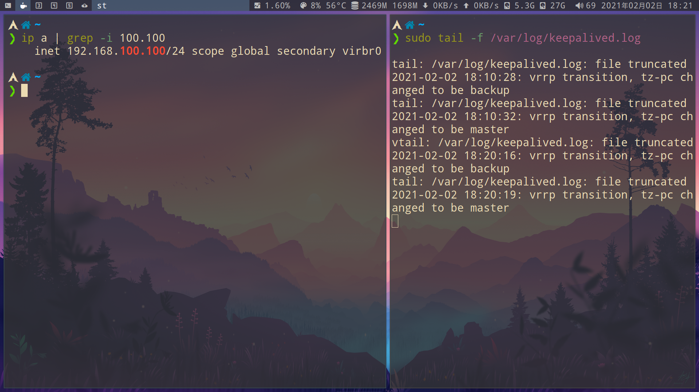

# lvs

## ipvs

```bash
# 添加模块
modprobe ip_vs
```

# [keepalived](https://github.com/acassen/keepalived)

> 是 lvs 的拓展项目
> 最初是服务器状态检测,后来加入 ipvs 模块实现负载均衡

## install(安装)

```bash
# 安装编译需要的工具
yum install -y gcc openssl openssl-devel

# 下载
curl -LO https://www.keepalived.org/software/keepalived-2.2.1.tar.gz
tar zxvf keepalived-2.2.1.tar.gz
cd keepalived-2.2.1

# 安装配置
# --sysconfdir 安装目录
./configure --sysconfdir=/usr/local

# 编译安装
make -j$(nproc) && make install
```

## 基本

- [参数介绍(官方文档)](https://www.keepalived.org/manpage.html)

- 配置文件 `/usr/local/keepalived/keepalived.conf`
  > 注意:keepalived 并不检查配置文件是否正确,要保证语法正确

配置可分为三类:

| 配置分类          | 内容                |
| ----------------- | ------------------- |
| global(全局配置)  | global_defs         |
| vrrpd(虚拟路由器) | vrrp_instance,group |
| lvs               | virtual_server      |

### global

```bash
   # 严格遵守VRRP协议，这一项最好关闭（加感叹号），若不关闭，可用vip无法被ping通
   ! vrrp_strict
```

### vrrp_instance

```bash
vrrp_instance VI_1 {
    ...
    # MASTER必须大于BACKUP
    priority 150

    # 虚拟ip,可以有多个
    virtual_ipaddress {
        192.168.100.100/24 dev virbr0
    }

    # 进入master状态时,执行脚本
    notify_master "/etc/keepalived/notify.sh master"

    # 进入backup状态时,执行脚本
    notify_backup "/etc/keepalived/notify.sh backup"

    # 进入fault状态时,执行脚本
    notify_fault "/etc/keepalived/notify.sh fault"

    # 非抢占模式
    nopreempt

    # 延迟抢占(在此时间内发生的故障不会切换)
    preempt_delay  300
}
```

<span id="notify.sh"></span>

#### notify 脚本

```bash
#!/bin/bash
# Author: hgzerowzh
# Description: An notify script
#
contact='root@localhost'

notify() {
        mailsubject="$(hostname) to be $1: vip floating"
        mailbody="$(date +'%F %H:%M:%S'): vrrp transition, $(hostname) changed to be $1"
        # echo $mailbody | mail -s "$mailsubject" $contact
        echo $mailbody > /var/log/keepalived.log
}

case $1 in
    master)
    notify master
    exit 0
    ;;
    backup)
    notify backup
    exit 0
    ;;
    fault)
    notify fault
    exit 0
    ;;
    *)
    echo "Usage: $(basename $0) {master|backup|fault}"
    exit 1
    ;;
esac
```

### vrrp_group

```
 # vrrp同步组(任何一个instance出现问题,都会进行主备切换)
 vrrp_sync_group  NAME  {
    group {
        VI_1
        VI_2
        VI_3
    }

    # 进入master状态时,执行脚本
    notify_master "/etc/keepalived/notify.sh master"

    # 进入backup状态时,执行脚本
    notify_backup "/etc/keepalived/notify.sh backup"

    # 进入fault状态时,执行脚本
    notify_fault "/etc/keepalived/notify.sh fault"
 }
```

### virtual_server

| lb_algo (算法) | 操作 |
| -------------- | ---- |
| rr(常用)       |      |
| wrr            |      |
| lc             |      |
| wlc(常用)      |      |
| lblc           |      |
| sh             |      |
| dh             |      |

| lb_kind (负载均衡机制) | 操作 |
| ---------------------- | ---- |
| NAT                    |      |
| TUN                    |      |
| DR                     |      |

```bash
virtual_server 192.168.100.1 80 {
    ...

    # 健康检查时间
    delay_loop 6

    # 调度算法
    lb_algo rr

    # 负载均衡机制
    lb_kind NAT
}
```

#### real_server

- 在 `virtual_server` 函数里

- ip 是后端服务器

```bash
real_server 192.168.100.208 80 {
    ...
    # 权重(性能高主机的设置高,低的设置低)
    weight <INT>

    # 后端层健康状态检测（web后端层检测）
    HTTP_GET | SSL_GET {
        url {
            # 路径
            path /etc/html/index.html
            # 使用genhash -s 192.168.100.208 -p 80 -u /etc/html/index.html
            digest 640205b7b0fc66c1ea91c463fac6334c
        }

        # 超时时间
        connect_timeout 3

        # 重连次数
        retry 3

        # 重连时间
        delay_before_retry 3
    }

    # 传输层健康状态检测（tcp协议层）
    TCP_CHECK {
        # tcp端口
        connect_port 80

        # ack超时时间
        connect_timeout 3

        # 重试次数
        nb_get_retry 3

        # 重试时间间隔
        delay_before_retry 3
    }

    # 外部脚本检查
    MISC_CHECK {

        # 脚本路径
        misc_path /bin/test.sh

        # 脚本超时时间
        misc_timeout 5

        # 是否动态调整real server的weight
        ! misc_dynamic
    }

    # 上线执行脚本
    notify_up

    # 下线执行脚本
    notify_down
}
```

## 负载均衡服务器配置

设置虚拟 ip

```
ip a add 192.168.100.100/24 dev virbr0 label virbr0:0
```

## 后端服务器配置

禁用 arp 对虚拟 ip 的响应

```bash
cat >> /etc/sysctl.conf << 'EOF'
net.ipv4.conf.eth0.arp_announce = 2
net.ipv4.conf.eth0.arp_ignore = 1
net.ipv4.conf.all.arp_announce = 2
net.ipv4.conf.all.arp_ignore = 1
EOF

sysctl -p
```

设置 lo 接口地址为虚拟 ip

```bash
ip a add 192.168.100.100/24 dev lo
```

## 自定义脚本监控

```
# 定义监控函数
vrrp_script check_nginx {
    # 发送信号0判断,进程是否存在
    script "killall -0 nginx"

    # 监控时间间隔2秒
    interval 2

    # 最大失败次数
    fall 2

    # 请求次数,判断节点是否正常
    rise 1
}

vrrp_script check_nginx_1 {
    # 通过pid文件判断,进程是否存在
    script "if [ -f /var/run/nginx.pid ];then exit 0; else exit 1;fi"

    interval 2
    fall 2
    rise 1
}

# 调用vrrp_script对集群进行监控
track_script {
    # 监控函数
    check_nginx
}
```

## 配置 1

- archlinux: priority 150 为 `master`

- centos: priority 100 为 `backup`

**视频步骤:**

- 1.当 archlinux 开启 keepalived 时

  - archlinux 为 `master`

  - 可查看虚拟 ip

- 2.当 centos 开启 keepalived

  - centos 最开始为`backup`

- 3.而 archlinux 关闭 keepalived

  - centos 转为 `master`

  - 虚拟 ip 也移动到 centos

    

- 4.当 archlinux 再次,启动 keepalived(以上视频并未录制,请看以下图片)

  - archlinux 会进入 `master` 状态(nopreempt 非抢占,并没有生效)

  - centos 转为 `backup`

  - 可查看虚拟 ip

  

**配置:**

```
! Configuration File for keepalived

global_defs {
   notification_email {
     acassen@firewall.loc
     failover@firewall.loc
     sysadmin@firewall.loc
   }
   router_id LVS_DEVEL
   vrrp_skip_check_adv_addr

   ! vrrp_strict
   vrrp_garp_interval 0
   vrrp_gna_interval 0
}

vrrp_instance VI_1 {
    # centos为BACKUP
    state MASTER

    interface virbr0
    virtual_router_id 51

    # centos为100
    priority 150
    advert_int 1
    authentication {
        auth_type PASS
        auth_pass 1111
    }
    # 虚拟ip,可以有多个
    virtual_ipaddress {
        192.168.100.100/24 dev virbr0
    }
    nopreempt

    preempt_delay  300

    notify_master "/var/lib/keepalived/notify.sh master"
    notify_backup "/var/lib/keepalived/notify.sh backup"
    notify_fault "/var/lib/keepalived/notify.sh fault"
}

vrrp_script check_nginx {
    # 发送信号0判断,进程是否存在
    script "killall -0 nginx"

    # 监控时间间隔2秒
    interval 2

    # 最大失败次数
    fall 2

    # 请求次数,判断节点是否正常
    rise 1
}

track_script {
    # 监控函数
    check_nginx
}
```

[notify.sh](#notify.sh)脚本

## 优秀文章

- [参数介绍(官方文档)](https://www.keepalived.org/manpage.html)

- [Keepalived 服务详解](https://mp.weixin.qq.com/s?src=11&timestamp=1612060965&ver=2861&signature=EJDqi25HIiZJQrXjvrlkWaEnM-nTuKdFALmUW6mdrbmA9dwGoqzzk4ovU4l0*z6W4OHKJk6*FdudC7v69dYeGRS-8zU0QHlpoe6vGnDdhOJmLxLsYeo805EM-5-VB-Qr&new=1)
