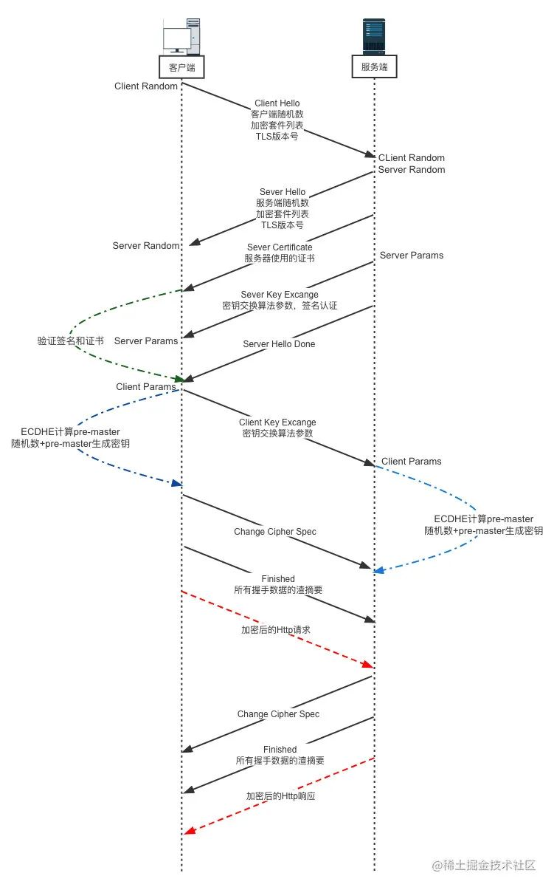
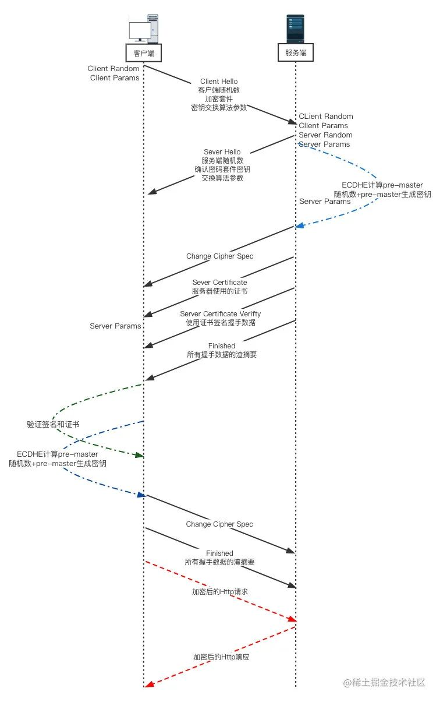
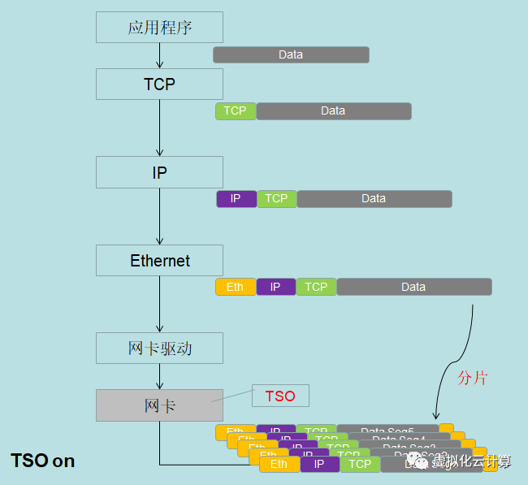
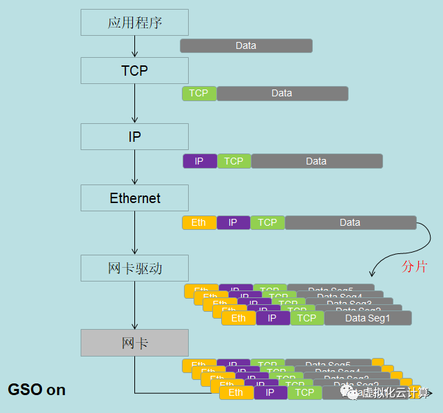
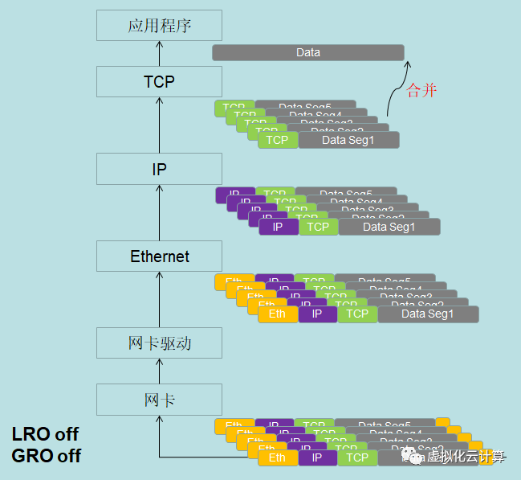
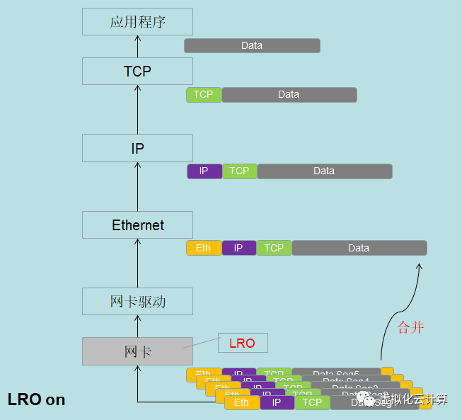
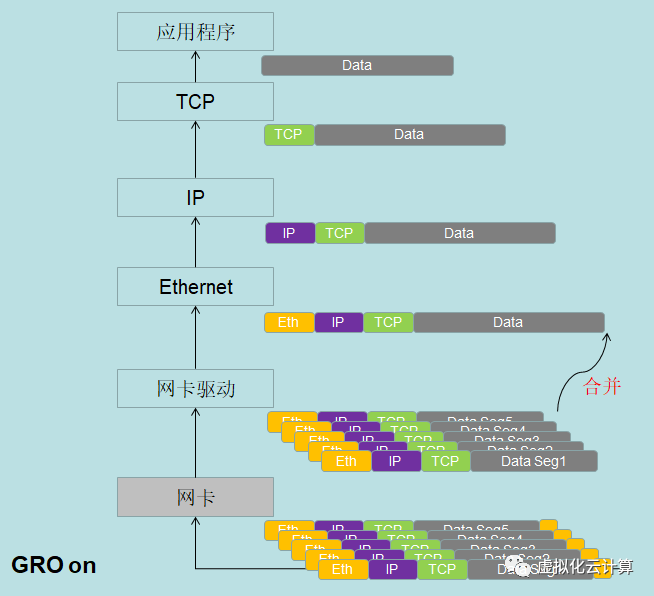

# OSI 7层

> 本文采用自顶向下的讲解

## 应用层

### HTTP

- [视频：2分钟了解 HTTP Verbs](https://www.bilibili.com/video/BV1DS4y187Ux)
    - 安全性：`GET`
    - 幂等性：`GET`、`DELETE`
    - 缓存性：`GET`、`POST`、`PATCH`

- [腾讯技术工程：了解 HTTP 看这一篇就够](https://cloud.tencent.com/developer/article/2083715)

- [《React进阶之路》作者：合并HTTP请求 vs 并行HTTP请求，到底谁更快？](https://segmentfault.com/a/1190000015665465)

- [腾讯技术工程：HTTP 请求之合并与拆分技术详解](https://cloud.tencent.com/developer/article/1837260)

    - 拆分的多个小请求耗时仍大于合并的请求

#### HTTP2

- [李银城：从Chrome源码看HTTP/2](https://zhuanlan.zhihu.com/p/34662800)

#### Quic

- [腾讯技术工程：HTTP/3 原理实战](https://cloud.tencent.com/developer/article/1634011)

    - 讲述了QUIC的优点，比另外两篇文章要好一些[《一文读懂 HTTP/1HTTP/2HTTP/3》](https://cloud.tencent.com/developer/article/1580468)和[科普：QUIC 协议原理分析](https://cloud.tencent.com/developer/article/1017235)

- [交互式解释Quic每个步骤](https://quic.xargs.org/)

## WebSocket

- [ruanyifeng:WebSocket 教程](https://www.ruanyifeng.com/blog/2017/05/websocket.html)

    

- 与http的区别

    - 全双工：服务端可以主动向客户端发送数据；不像http客户端发送request，服务端response

    - 不需要发送http header

## 加密层

- [ruanyifeng：数字签名是什么？](https://www.ruanyifeng.com/blog/2011/08/what_is_a_digital_signature.html)

- [李银城：https连接的前几毫秒发生了什么](https://www.rrfed.com/2017/02/03/https/)

### 密钥算法

- [视频：【不懂数学没关系】DH算法 | 迪菲-赫尔曼Diffie–Hellman 密钥交换](https://www.bilibili.com/video/BV1sY4y1p78s)

- [视频：数学不好也能听懂的算法 - RSA加密和解密原理和过程](https://www.bilibili.com/video/BV1XP4y1A7Ui)

- [视频（奇乐编程学院）：探秘公钥加密算法 RSA](https://www.bilibili.com/video/BV14y4y1272w)

    > 对比上一个rsa视频，对欧拉函数有进一步介绍

- [视频：公钥加密技术ECC椭圆曲线加密算法原理](https://www.bilibili.com/video/BV1BY411M74G)

### tls

- [交互式解释tls1.3每个步骤](https://tls13.xargs.org/)





## TCP

- [李银城：WebSocket与TCP/IP](https://www.rrfed.com/2017/05/20/websocket-and-tcp-ip/)

### 拥塞算法(流量控制)

- [腾讯技术工程：TCP 拥塞控制算法简介](https://cloud.tencent.com/developer/article/1401283)

- [TCP 流量控制、拥塞控制](https://zhuanlan.zhihu.com/p/37379780)

- [腾讯技术工程：TCP 拥塞控制详解](https://cloud.tencent.com/developer/article/1636214)

## DNS

- [李银城：从Chrome源码看DNS解析过程](https://www.rrfed.com/2018/01/01/chrome-dns-resolve/)

## 包的拆分与合并TSO、GSO、LRO、GRO

- 拆分

    
    
    

- 合并

    
    
    

```sh
# 查看是否开启
ethtool -k eth0

tcp-segmentation-offload: on # TSO
generic-segmentation-offload: on # GSO

large-receive-offload: on # LRO
generic-receive-offload: on # GRO
```

```sh
# 开启TSO
sudo ethtool -K eth0 tso on
```

# 内核网络协议栈

- TCP 相关配置在 `/proc/sys/net/ipv4/` ，但 Linux 的 TCP 协议栈不分 IPV4/IPV6，所有 ipv4.tcp 的设置将同时影响 V6 的 TCP 连接

## sysctl

- [linux sysctl net 字段 文档](https://www.kernel.org/doc/Documentation/networking/ip-sysctl.txt)
- [linux sysctl 每个字段文档](https://sysctl-explorer.net/)
- [linux net.netfilter 文档](https://www.kernel.org/doc/Documentation/networking/nf_conntrack-sysctl.txt)

sysctl 在运行时检查和更改内核参数的工具,在`procfs文件系统`(也就是`/proc`路径)中实现的

- `sysctl net.foo=bar` 等于 `echo bar > /proc/sys/net/foo` ，重启后失效，如需持久化需配置 `/etc/sysctl.conf`

```bash
# 查看所有配置
sysctl --all

# 加载配置
sysctl --system
```

## /proc/net/softnet_stat

记录了一些内核网络栈的状态:

| 列数 | 内容                                                                                               |
| ---- | -------------------------------------------------------------------------------------------------- |
| 1    | processed 网络帧的计数                                                                             |
| 2    | dropped 计数也就是因 input_pkt_queue 不能处理导致的丢包数（和 ring buffer 满导致的丢包是两个问题） |
| 3    | NAPI 中由于 budget 或 time limit 用完而退出 net_rx_action 循环的次数                               |
| 8    | 没有意义因此全是 0                                                                                 |
| 9    | CPU 为了发送包而获取锁的时候有冲突的次数                                                           |
| 10   | CPU 被其他 CPU 唤醒来处理 backlog 数据的次数                                                       |
| 11   | 触发 flow_limit 限制的次数                                                                         |

```bash
cat /proc/net/softnet_stat                                                                         ─
00000f0f 00000000 00000000 00000000 00000000 00000000 00000000 00000000 00000000 00000000 00000000
000007f2 00000000 00000000 00000000 00000000 00000000 00000000 00000000 00000000 00000000 00000000
00000ffb 00000000 00000000 00000000 00000000 00000000 00000000 00000000 00000000 00000000 00000000
00006d1b 00000000 00000000 00000000 00000000 00000000 00000000 00000000 00000000 00000000 00000000
0000102f 00000000 00000000 00000000 00000000 00000000 00000000 00000000 00000000 00000000 00000000
00000777 00000000 00000000 00000000 00000000 00000000 00000000 00000000 00000000 00000000 00000000
0000be12 00000000 00000000 00000000 00000000 00000000 00000000 00000000 00000000 00000000 00000000
00006447 00000000 00000000 00000000 00000000 00000000 00000000 00000000 00000000 00000000 00000000
0000b33e 00000000 00000000 00000000 00000000 00000000 00000000 00000000 00000000 00000000 00000000
000083b6 00000000 00000000 00000000 00000000 00000000 00000000 00000000 00000000 00000000 00000000
0000bd5f 00000000 00000000 00000000 00000000 00000000 00000000 00000000 00000000 00000000 00000000
00008710 00000000 00000000 00000000 00000000 00000000 00000000 00000000 00000000 00000000 00000000
```

## somaxconn

- 是一个 socket 上等待应用程序 accept() 的最大队列长度

```bash
sysctl net.core.somaxconn
net.core.somaxconn = 4096
```

## Tcp keepalive

- 一种 TCP 连接的机制

- 在空闲时，TCP 向对方发送空数据的 ack keepalive 探测包，如果没有响应，socket 关闭。

- TCP keepalive 进程在发送第一个 keepalive 之前要等待两个小时（默认值 7200 秒），然后每隔 75 秒重新发送一次。只要 TCP/IP socket 通信正在进行并处于活动状态，就不需要 keepalive。

- 一个比较有意思的是，由于 TCP keepalive 凭空增加了需要传输的数据量，可能造成一些意想不到的坑

```bash
# 在最后一个 data packet（空 ACK 不算 data）之后,多长时间开始发送keepalive
sysctl net.ipv4.tcp_keepalive_time
net.ipv4.tcp_keepalive_time = 7200

# 发送探测包的时间间隔.在此期间,连接上的任何传输内容,都不影响keepalive的发送
sysctl net.ipv4.tcp_keepalive_intvl
net.ipv4.tcp_keepalive_intvl = 75

# 最大失败次数.超过此值后,将通知应用层连接失效
sysctl net.ipv4.tcp_keepalive_probes
net.ipv4.tcp_keepalive_probes = 9
```

## recv_backlog

### netdev_max_backlog

- recv_backlog 收包队列，收到的所有报文都在 netdev backlog 队列中等待软中断处理

- 队列大小 × 中断频率 = packets per second

- 可以通过 `/proc/net/softnet_stat` 的第二列来验证, 如果第二列有计数, 则说明出现过 backlog 不足导致丢包

```bash
# 查看队列大小
sysctl net.core.netdev_max_backlog
net.core.netdev_max_backlog = 1000
```

### tcp_rmen & tcp_wmem

- 是 socket buffer 也就是内核源码中常见的 skb 数据结构

- kernel recv buffer,内核会根据可用内存大小动态进行调整：

- buffer 不是越大越好,过大的 buffer 容易影响拥塞控制算法对延迟的估测

```bash
# 接收包
sysctl net.ipv4.tcp_rmem
net.ipv4.tcp_rmem = 4096 131072 6291456

# 发送包
sysctl net.ipv4.tcp_wmem
net.ipv4.tcp_wmem = 4096 16384 4194304
```

| 列数                  | 内容                                           |
| --------------------- | ---------------------------------------------- |
| TCP socket 最小包缓冲 | 用于系统内存紧张时保证最低限度的连接建立       |
| TCP socket 默认包缓冲 | 此数值将会覆盖全局参数 `net.core.rmem_default` |
| TCP socket 最大包缓冲 | 此数值 不覆盖 全局参数 `net.core.rmem_max`     |

`net.core.rmem` & `net.core.wmem` 为全局配置

### 网络优化，有争议

```bash
# 回环接口的缓冲区大小
net.core.netdev_max_backlog = 16384

# 连接数上限
net.core.somaxconn = 8192

net.core.rmem_default = 1048576
net.core.rmem_max = 16777216
net.core.wmem_default = 1048576
net.core.wmem_max = 16777216
net.core.optmem_max = 65536
net.ipv4.tcp_rmem = 4096 1048576 2097152
net.ipv4.tcp_wmem = 4096 65536 16777216
net.ipv4.udp_rmem_min = 8192
net.ipv4.udp_wmem_min = 8192

# tcp-fast-open是tcp拓展，允许在tcp syn第一次握手期间建立连接,交换数据,减少握手的网络延迟
net.ipv4.tcp_fastopen = 3

# 最大传输单元（MTU）越长，性能越好，但可靠性越差。
net.ipv4.tcp_mtu_probing = 1
```

防止 ddos 攻击:

```bash
# tcp syn等待ack的最大队列长度
net.ipv4.tcp_max_syn_backlog = 8192

# TIME_WAIT状态下的最大套接字数
net.ipv4.tcp_max_tw_buckets = 2000000

# fin 秒数
net.ipv4.tcp_fin_timeout = 10

# 有助于抵御SYN flood攻击
net.ipv4.tcp_syncookies = 1

# 启用rp_filter(反向路径过滤)，内核将对所有接口收到的数据包进行源验证，可以防止攻击者使用IP欺骗
net.ipv4.conf.default.rp_filter = 1
net.ipv4.conf.all.rp_filter = 1

# 禁止 icmp 重定向接受
net.ipv4.conf.all.accept_redirects = 0
net.ipv4.conf.default.accept_redirects = 0
net.ipv4.conf.all.secure_redirects = 0
net.ipv4.conf.default.secure_redirects = 0
net.ipv6.conf.all.accept_redirects = 0
net.ipv6.conf.default.accept_redirects = 0

# 在非路由上禁止 icmp 重定向发送
net.ipv4.conf.all.send_redirects = 0
net.ipv4.conf.default.send_redirects = 0

# 忽略 icmp echo 请求
net.ipv4.icmp_echo_ignore_all = 1
net.ipv6.icmp.echo_ignore_all = 1
```

Tcp keepalive

```bash
# 设置为等待一分钟
net.ipv4.tcp_keepalive_time = 60
net.ipv4.tcp_keepalive_intvl = 10
net.ipv4.tcp_keepalive_probes = 6
```

关闭 tcp 慢启动:

- 因为 http1.1 采用多连接和域名分片,当一些连接闲置时,连接的网速会下降

- 以及 web 服务器的流量是间歇性

```bash
net.ipv4.tcp_slow_start_after_idle = 0
```

# reference

- [Linux 网络调优：内核网络栈参数篇(这篇文章非常好，可语文表达不太清晰)](https://www.starduster.me/2020/03/02/linux-network-tuning-kernel-parameter/#Linux_ingress)

- [sysctl-ArchWiki](https://wiki.archlinux.org/index.php/sysctl#Improving_performance)

- [What is TCP Fast Open?](https://www.keycdn.com/support/tcp-fast-open)
- [网络参数详情](https://trello.com/b/CqjvMapu/best-practices)

- [7 层网络完整介绍](https://codeburst.io/understanding-tcp-internals-step-by-step-for-software-engineers-system-designers-part-1-df0c10b86449)
- [MTU](https://netbeez.net/blog/troubleshooting-mtu-issues/)
- [MTU and TCP MSS](https://www.imperva.com/blog/mtu-mss-explained/)

- [traceroute and ttl](https://netbeez.net/blog/traceroute/)

- [tcp 带图详解](https://www.ictshore.com/free-ccna-course/transmission-control-protocol-advanced/)
- [tcp 三次握手,四次挥手 in wireshark](https://github.com/zqjflash/tcp-ip-protocol)

- [详解的 tcp 连接,丢包后的处理,keepalive,tcp window probes 丢包](https://blog.cloudflare.com/when-tcp-sockets-refuse-to-die/)
