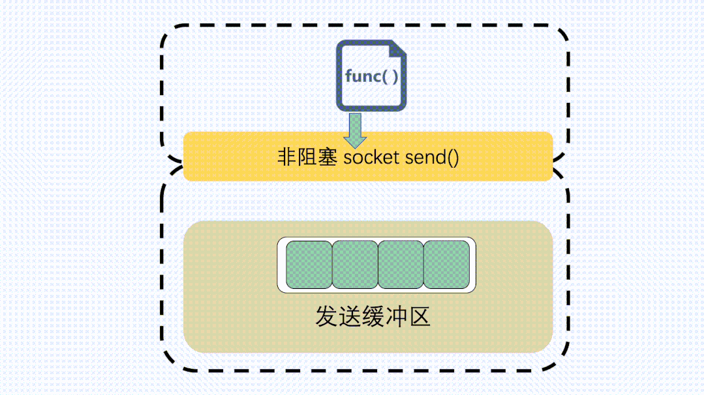

# OSI 7层

> 本文采用自顶向下的讲解


## 应用层

### HTTP

- [mozilla文档](https://developer.mozilla.org/zh-CN/docs/Web/HTTP)

- [视频：2分钟了解 HTTP Verbs](https://www.bilibili.com/video/BV1DS4y187Ux)
    - 安全性：`GET`
    - 幂等性：`GET`、`DELETE`
    - 缓存性：`GET`、`POST`、`PATCH`

- [小林coding：HTTP 常见面试题](https://www.xiaolincoding.com/network/2_http/http_interview.html)

- [腾讯技术工程：了解 HTTP 看这一篇就够](https://cloud.tencent.com/developer/article/2083715)

- [陶辉：HTTP性能极限优化](https://www.taohui.tech/2020/01/08/%E7%BD%91%E7%BB%9C%E5%8D%8F%E8%AE%AE/http%E6%80%A7%E8%83%BD%E6%9E%81%E9%99%90%E4%BC%98%E5%8C%96/)

- [杰瑞春：老师不会教你的，http协议在万维网世界中的一生！](https://www.bilibili.com/video/BV1Ee4y1c7Wq)

- [技术蛋老师视频：HTTP/1.1，HTTP/2和HTTP/3的区别](https://www.bilibili.com/video/BV1vv4y1U77y)


#### 状态码

- `1xx`：
    - `101 Switching Protocol`： 协议转换，比方说升级为`websocket`

- `2xx`：

    - `200 OK`

    - `201 Created`：成功创建资源，一般用于`POST`、`PUT`

    - `204 No Content`：没有body

    - `206 Partial Content`：分块下载和断点续传，在客户端发送“范围请求”、要求获取资源的部分数据时出现，它与 200 一样，也是服务器成功处理了请求，但 body 里的数据不是资源的全部，而是其中的一部分。

        - `Accept-Ranges` （它的值不为“none”），那么表示该服务器支持范围请求。

        - 还会伴随着头字段`Content-Range`，表示响应报文里 body 数据的具体范围，供客户端确认，例如`Content-Range：bytes 0-99/2000`，意思是此次获取的是总计 2000 个字节的前 100 个字节。

        ```sh
        curl http://www.example.com -i -H "Range: bytes=0-50, 100-150"
        ```

- `3××`：

    - `301 Moved Permanently`：“永久重定向”，含义是此次请求的资源已经不存在了，需要改用改用新的 URI 再次访问。

    - `302 Found`：“临时重定向”，意思是请求的资源还在，但需要暂时用另一个 URI 来访问。

        - 例子：访问`www.bing.com` 会出现`302`，重定向到`cn.bing.com`

    - `304 Not Modified`：它用于 `If-Modified-Since` 和`If-None-Match` 请求，表示资源未修改，用于缓存控制。它不具有通常的跳转含义，但可以理解成“重定向已到缓存的文件”（即“缓存重定向”）。

- `4××`：

    - `400 Bad Request`：表示客户端请求的报文有错误，但只是个笼统的错误。

    - `403 Forbidden`：表示服务器禁止访问资源，并不是客户端的请求出错。

#### Cache

- [腾讯技术工程：彻底弄懂浏览器缓存策略](https://cloud.tencent.com/developer/article/1660735)

    

- `Cache-Control: `：

    - `private`：只能浏览器缓存，代理服务器不能缓存

    - `no-cache`：浏览器可以缓存，但每次都需要向服务器确认；代理服务器不能缓存

    - `no-store`：不能缓存

    - `max-age=604800`：可以缓存；根据`Date: ` 字段的时间算起，604800秒后过期。

    - `Expires: Tue, 28 Feb 2022 22:22:22 GMT`：过期时间

    - `Expires` 和 `max-age`同时存在优先使用`max-age`

- `Last-Modified`(Response Header)与`If-Modified-Since`(Request Header)是一对报文头：

    - 当带着If-Modified-Since头访问服务器请求资源时，服务器会检查Last-Modified，如果Last-Modified的时间早于或等于If-Modified-Since则会返回一个不带主体的304响应，否则将重新返回资源。

    - 注意：在 Chrome 的 devtools中勾选 `Disable cache` 选项后，发送的请求会去掉If-Modified-Since这个 Header。

- `ETag`(Response Header)与`If-None-Match`(Request Header)是一对报文头：

    - 一致时返回不带实体的304，不然就是带有所请求资源实体的200响应

    

- `ETag` 和 `Last-Modified`同时存在优先使用`ETag`

- `X-Cache-Lookup:`：

    - `Hit From MemCache`：命中CDN节点的内存
    - `Hit From Disktank`：命中CDN节点的硬盘
    - `Hit From Upstream`：没有命中

- 缓存位置：

    - 优先级：Service Worker -> Memory Cache -> Disk Cache -> Push Cache

    - Chrome 的DevTools Network可以看到`Memory Cache`（內存缓存）和`Disk Cache`（硬盘缓存）

#### Cookie

- [技术蛋老师视频：cookie、localStorage 和 sessionStorage的区别及应用实例 - JavaScript前端Web工程师](https://www.bilibili.com/video/BV1SL4y1i7ZL)

- [技术蛋老师视频：Cookie、Session、Token究竟区别在哪？如何进行身份认证，保持用户登录状态？](https://www.bilibili.com/video/BV1ob4y1Y7Ep)

- 过期时间：

    - `Expires`：绝对时间

    - `max-age`：相对时间，单位为秒。

    - `Expires` 和 `max-age` 同时存在时优先使用`max-age`。

        - 如果服务器不设置`max-age`、`Expries`或者字段值为0指不能缓存cookie，但在会话期间是可用的，浏览器会话关闭之前可以用cookie记录用户的信息。

- 作用域：

    - `Domain`和`Path`指定了 Cookie 所属的域名和路径，浏览器在发送 Cookie 前会从 URI 中提取出 host 和 path 部分，对比 Cookie 的属性。如果不满足条件，就不会在请求头里发送 Cookie。

        - Domain=mozilla.org，则 Cookie 也包含在子域名中（如developer.mozilla.org）

        - Path (“/”) 作为路径分隔符，并且子路径也会被匹配

- 安全性

    - `HttpOnly`表示此 Cookie 只能通过浏览器 HTTP 协议传输，禁止其他方式访问。这也是预防“跨站脚本”（XSS）攻击的有效手段。

    - `SameSite`可以防范“跨站请求伪造”（XSRF）攻击

        - SameSite = strict表示禁止cookie在跳转链接时跨域传输

        - SameSite = lax稍微宽松一点，允许在GET、HEAD等安全请求方式中跨域携带。

            - 如果没有设置 SameSite 属性，则将 cookie 视为 Lax

        - 默认值为none，表示不限制cookie的携带和传输。

            - 必须设置 `Secure` 属性

    - `Secure`表示这个cookie仅能用HTTPS协议加密传输，明文的HTTP协议会禁止发送。但Cookie本身不是加密的，浏览器里还是以明文的形式存在。

#### 压缩算法


#### HTTP1.1 keepalive

- http短连接

    

- http keepalive（长连接）

    - 如果要关闭 HTTP Keep-Alive，需要在 HTTP 请求或者响应的 header 里添加 `Connection:close`

    


#### HTTP2

- [李银城：从Chrome源码看HTTP/2](https://zhuanlan.zhihu.com/p/34662800)

- [小林coding：HTTP/2 牛逼在哪？](https://www.xiaolincoding.com/network/2_http/http2.html)

- 全面采用二进制：收到报文后，无需再将明文的报文转成二进制，而是直接解析二进制报文

- Frame header：

    

    - Frame有多种类型

        

    - 帧数据：存放HPACK 算法压缩后的 HTTP 头部和包体


- 1个stream可以包含多个message；1个message可以包含多个Frame

    

- 多路服用：

    

- 服务器推送：客户端在访问 HTML 时，服务器可以直接主动推送 CSS 文件，减少了消息传递的次数

    - client的请求使用的是奇数号 Stream；server主动的推送，使用的是偶数号 Stream，并使用 `PUSH_PROMISE` 帧传输 HTTP 头部，并通过帧中的 `Promised Stream ID` 字段告知客户端，接下来会在哪个偶数号 Stream 中发送包体。

    

    ```nginx
    # nginx配置：客户端访问 /test.html 时，服务器直接推送 /test.css
    location /test.html {
        http2_push /test.css;
    }
    ```

##### HPACK（头部压缩）

- 客户端和服务器各自维护一份“索引表”，压缩和解压缩就是查表和更新表的操作。还釆用哈夫曼编码来压缩整数和字符串。

    

- 新增的头字段或者值保存在动态表（Dynamic Table）里，它添加在静态表后面，结构相同，但会在编码解码的时候随时更新。

    - 比如说，第一次发送请求时的“user-agent”字段长是一百多个字节，用哈夫曼压缩编码发送之后，客户端和服务器都更新自己的动态表，添加一个新的索引号“65”。那么下一次发送的时候就不用再重复发那么多字节了，只要用一个字节发送编号就好。

    

#### HTTP3(Quic)

- [小林coding：如何基于 UDP 协议实现可靠传输？](https://www.xiaolincoding.com/network/3_tcp/quic.html)

- [腾讯技术工程：HTTP/3 原理实战](https://cloud.tencent.com/developer/article/1634011)

    - 讲述了QUIC的优点，比另外两篇文章要好一些[《一文读懂 HTTP/1HTTP/2HTTP/3》](https://cloud.tencent.com/developer/article/1580468)和[科普：QUIC 协议原理分析](https://cloud.tencent.com/developer/article/1017235)

- [交互式解释Quic每个步骤](https://quic.xargs.org/)

- HTTP1 和 HTTP2 协议，TCP 和 TLS 是分层的。HTTP3 的 QUIC 协议并不是与 TLS 分层，而是QUIC 内部包含了 TLS，它在自己的帧会携带 TLS 里的“记录”。在第二次连接的时候：连接信息 + TLS 信息 + 数据一起发送（0RTT）

    

##### header


- Packet Header分为两种：

    

    - `Long Packet Header` 首次连接：三次握手，协商连接ID

        - 当移动设备的网络从 4G 切换到 WIFI 时，意味着 IP 地址变化了，那么就必须要断开连接，然后重新建立 TCP 连接。QUIC 协议没有用四元组的方式来“绑定”连接，而是通过`连接ID`来标记通信的两个端点，达到了连接迁移的功能。

    - `Short Packet Header` 传输数据：

        - `Packet Number` 是独一无二的编号，严格递增的（即使是重传的包）：

            - 解决了tcp重传RTT计算歧义的问题：

                tcp：
                quic：

            - 配合Frame Header里的 `Stream ID` 与 `Offset`字段，可实现乱序确认。tcp窗口滑动需要按顺序确认，丢包就无法滑动

                tcp发送窗口阻塞：
                

                tcp接受窗口阻塞：如果收到第 33～40 字节的数据，由于第 32 字节数据没有收到， 接收窗口无法滑动
                

                http2 复用tcp的队头阻塞：

                

                quic 每条Stream ID都有自己的滑动窗口：但同一个 Stream 的数据要保持顺序，不然也会造成窗口无法滑动

                


- Frame Header：

    - Packet 可以有多个Frame。每一种Frame类型的格式都不同

        

    - stream类型（http请求）的frame格式：

        

        - `Stream ID`：多路复用，类似http2
        - `Offset`：类似 TCP 的 Seq 序列号，保证数据的顺序性和可靠性
        - `Length`：Frame 的长度。

    - `window_update`类型：告诉对方，自己的接受窗口的字节数

    - `BlockFrame` 类型：告诉对方，被阻塞了无法发送数据

##### 窗口、流量控制，拥塞控制

- Stream 级别的流量控制：每条stream都有自己的滑动窗口互相独立，队头的 Stream A 被阻塞后，不妨碍 StreamB、C的读取；但同一个 Stream 的数据要保持顺序，不然也会造成窗口无法滑动

    接收窗口的左边界滑动条件取决于接收到的最大偏移字节数：
    

    接收窗口右边界触发的滑动条件：绿色部分数据超过最大接收窗口的一半后，最大接收窗口和接受窗口向右移动，同时给对端发送`window_update` frame；发送方收到后，发送窗口的右边界也向右移动
    

- Connection 流量控制：所有 Stream 窗口相加的总字节数

    

- 拥塞控制：默认使用了Cubic

    - QUIC 处于应用层：可以针对不同的应用设置不同的拥塞控制算法；升级算法不像tcp那样需要更新内核。

#### HTTP优化

- 代理服务器减少http重定向请求：

    优化前：
    

    重定向由代理服务器完成：
    

    代理服务器制定好重定向规则：
    

#### 合并请求

- 多个图片合并为一张雪碧图：

    

    - 问题：无法使用`hover`（鼠标悬浮）功能

- `webpack` 等打包工具将 js、css 等资源合并打包成大文件

- 将图片的二进制数据用 `base64` 编码后，以 URL 的形式嵌入到 HTML 文件`<image src="data:image/png;base64,iVBORw0KGgoAAAANSUhEUgAAAPoAAAFKCAIAAAC7M9WrAAAACXBIWXMAA ... /> `

##### 合并请求 vs 并行请求

- [《React进阶之路》作者：合并HTTP请求 vs 并行HTTP请求，到底谁更快？](https://segmentfault.com/a/1190000015665465)

- [腾讯技术工程：HTTP 请求之合并与拆分技术详解](https://cloud.tencent.com/developer/article/1837260)

    - 拆分的多个小请求耗时仍大于合并的请求

### RPC

- [小林coding：既然有 HTTP 协议，为什么还要有 RPC？](https://www.xiaolincoding.com/network/2_http/http_rpc.html)

    - gRPC底层用的是HTTP2

### WebSocket

- [ruanyifeng:WebSocket 教程](https://www.ruanyifeng.com/blog/2017/05/websocket.html)

    

- 与http的区别

    - 全双工：服务端可以主动向客户端发送数据；不像http客户端发送request，服务端response

    - 不需要发送http header

- [小林coding：既然有 HTTP 协议，为什么还要有 WebSocket？](https://www.xiaolincoding.com/network/2_http/http_websocket.html)

    - http轮询：

        - 网页的前端代码里不断定时发 HTTP 请求到服务器，服务器收到请求后给客户端响应消息

            - 例子：扫码登录。前端网页根本不知道用户扫没扫，于是不断去向后端服务器询问，看有没有人扫过这个码。

                - 点击[微信公众号官网](https://mp.weixin.qq.com/)，打开F12会发现每隔2秒发送一次请求


    - http长轮询：

        - 相比前者可以减少请求次数。每隔30秒，在这 30 秒内只要服务器收到了扫码请求，就立马返回给客户端网页。

            - 例子：百度网盘的扫码登陆

### DNS

- [朱小厮的博客：一文搞懂 DNS 基础知识，收藏起来有备无患~](https://mp.weixin.qq.com/s?src=11&timestamp=1678026571&ver=4388&signature=XbzLnBwAUMdDP2*TUw4OVETJ7xPZ9A7f9bfiGR7mHT7RCnrMvu9IQDuVHJ5*xMfO9aws0PENX5LpobXKiIuwvuU54*-uVJe*TyMb9JP6FYxHCdAH7Ov1tFRv1B9hbqaj&new=1)

- DNS 解析流程

    - 标准 glibc 提供了 libresolv.so.2 动态库，我们的应用程序就是用它进行域名解析（也叫 resolving）的， 它还提供了一个配置文件 `/etc/nsswitch.conf` 决定了 resolving 的顺序，默认是先查找 hosts 文件，如果没有匹配到，再进行 DNS 解析
    ```
    hosts:      files dns myhostname
    ```

    - 本地 DNS 服务器在 `/etc/resolv.conf`

    - 域名

        - 全球有13个根域名解析服务器，这13条记录持久化在dns服务器中
        

        - 域名劫持
        

    - 两种查询方式

        - 1.迭代查询：由dns服务器对每一层域名服务器一查到底
        

        - 2.递归查询：每查一层会return（返回）下一层的域名服务器给客户端，之后客户端继续查询下一层，以此类推。相比递归查询，可以减少dns服务器的压力

    - 转发：当前运营商(比如联通)的LocalDNS不访问百度权威DNS服务器，而是直接访问了其它运营商(比如电信)的LocalDNS服务器，有些小的运营商就是通过这样做来降低成本。如果电信的LocalDNS对非自家ip的访问限了速那么很明显会影响你的DNS解析时间。
    

- HTTPDNS：代替传统的基于UDP的DNS协议，域名解析请求直接发送到HTTPDNS服务端，从而绕过运营商的DNS

- 域名可以对应多个ip地址，从而实现负载均衡

    - 第1种方法：域名解析可以返回多个 IP 地址，客户端收到多个 IP 地址后，就可以自己使用轮询算法依次向服务器发起请求，实现负载均衡。

    - 第2种方法：智能解析。域名解析可以配置内部的策略，返回离客户端最近的主机，或者返回当前服务质量最好的主机，这样在 DNS 端把请求分发到不同的服务器，实现负载均衡。

        - 智能解析依赖 EDNS 协议（google 起草的 DNS 扩展协议）： 在 DNS 包里面添加 origin client IP, nameserver 据 client IP 返回距离 client 比较近的 server IP 了

        - 国内支持EDNS有DNSPod，已被腾讯收购

- [李银城：从Chrome源码看DNS解析过程](https://www.rrfed.com/2018/01/01/chrome-dns-resolve/)

- [arthurchiao：DNS 问题分析示例（2019）](http://arthurchiao.art/blog/dns-practice-zh/)

    - 1.没有配置合适的dns服务器`/etc/resolv.conf`

    - 2.`/etc/hosts` 中域名映射ip的问题：映射的ip未必是域名最优的地址，甚至可能不可用

    - 3.DNS 查询不稳定，时快时慢：有 tc 或 iptables 规则，导致到 DNS 服务器的 packet 变慢或丢失
        ```sh
        # 查看tc规则
        tc -p qdisc ls dev eth0
        # 删除规则
        tc qdisc del dev eth0 root
        ```

    - 4.DNS反向查询不稳定：ltrace -p <PID>跟踪 ping 域名进程发现问题，卡在 `gethostbyaddr()` 的函数
        - 解决方法是：修改 `/etc/resolv.conf` 更换 DNS 服务器

        ```sh
        # 使用以下命令进行验证
        nslookup <IP>
        host <IP>
        dig -x <IP>
        ```


### FTP


- 最常用的配置是`passive`。如果是`active`防火墙起不到保护作用。

## 表示层

### 密钥算法

- [视频：【不懂数学没关系】DH算法 | 迪菲-赫尔曼Diffie–Hellman 密钥交换](https://www.bilibili.com/video/BV1sY4y1p78s)

- [视频：数学不好也能听懂的算法 - RSA加密和解密原理和过程](https://www.bilibili.com/video/BV1XP4y1A7Ui)

- [视频（奇乐编程学院）：探秘公钥加密算法 RSA](https://www.bilibili.com/video/BV14y4y1272w)

    > 对比上一个rsa视频，对欧拉函数有进一步介绍

- [视频：公钥加密技术ECC椭圆曲线加密算法原理](https://www.bilibili.com/video/BV1BY411M74G)

    ```nginx
    # 在nginx上选择最快的 x25519 椭圆曲线
    ssl_ecdh_curve X25519:secp384r1;
    ```

- AES

    ```sh
    # 查看cpu是否支持AES指令集
    grep module /proc/crypto | grep aes
    ```

    ```nginx
    # nginx选用 AES_128_GCM，它比 AES_256_GCM 快一些
    ssl_ecdh_curve 'EECDH+ECDSA+AES128+SHA:RSA+AES128+SHA';
    ```

### 数字签名和数字证书

- [阮一峰：数字签名是什么？](https://www.ruanyifeng.com/blog/2011/08/what_is_a_digital_signature.html)

- 数字签名：的原理其实很简单，就是把公钥私钥的用法反过来，之前是公钥加密、私钥解密，现在是私钥加密、公钥解密。但又因为非对称加密效率太低，所以私钥只加密原文的hash值，这样运算量就小的多，而且得到的数字签名也很小，方便保管和传输。

    

- 数字证书和CA：因为公钥是任何人都可以发布的，所以我们需要引入第三方来保证公钥的可信度，这个“第三方”就是我们常说的 CA（Certificate Authority，证书认证机构）。小一点的 CA 可以让大 CA 签名认证，但链条的最后，也就是 Root CA

    
    

    - 1.首先 CA 会把持有者的公钥、用途、颁发者、有效时间等信息打成一个包，然后对这些信息进行 Hash 计算，得到一个 Hash 值；

    - 2.然后 CA 会使用自己的私钥将该 Hash 值加密，生成 Certificate Signature，也就是 CA 对证书做了签名；

- 证书验证：

    - 服务器会在 TLS 握手过程中，把自己的证书发给客户端，以此证明自己身份是可信的。

        - OCSP Stapling：服务器向 CA 周期性地查询证书状态，获得一个带有时间戳和签名的响应结果并缓存它。当有客户端发起连接请求时，服务器会把这个「响应结果」在 TLS 握手过程中发给客户端。由于有签名的存在，服务器无法篡改，因此客户端就能得知证书是否已被吊销了，这样客户端就不需要再去查询。

    - 服务器的证书应该选择椭圆曲线（ECDSA）证书，而不是 RSA 证书，因为在相同安全强度下， ECC 密钥长度比 RSA 短的多

### tls

- [技术蛋老师视频：HTTPS是什么？加密原理和证书。SSL/TLS握手过程](https://www.bilibili.com/video/BV1KY411x7Jp)

- [李银城：https连接的前几毫秒发生了什么](https://www.rrfed.com/2017/02/03/https/)


- tls分为握手协议和记录协议：

    握手协议：
    

    记录协议：
    

- tls1.2：四次握手

    - [小林coding：HTTPS RSA 握手解析](https://www.xiaolincoding.com/network/2_http/https_rsa.html#tls-%E6%8F%A1%E6%89%8B%E8%BF%87%E7%A8%8B)

    
    
    

    - 第一次握手 `Client Hello`：是客户端告诉服务端，它支持什么样的加密协议版本，比如 TLS1.2，使用什么样的加密套件，比如最常见的RSA，同时还给出一个客户端随机数。

    - 第二次握手 `Server Hello`：服务端告诉客户端，服务器随机数 + 服务器证书 + 确定的加密协议版本（比如就是TLS1.2）。

    - 第三次握手：

        - `Client Key Exchange`: 此时客户端再生成一个随机数，叫 `pre_master_key` 。从第二次握手的服务器证书里取出服务器公钥，用公钥加密 `pre_master_key`，发给服务器。

        - `Change Cipher Spec`: 客户端这边已经拥有三个随机数：客户端随机数，服务器随机数和`pre_master_key`，用这三个随机数进行计算得到一个"会话秘钥"。此时客户端通知服务端，后面会用这个会话秘钥进行对称机密通信。

        - `Encrypted Handshake Message`：客户端会把迄今为止的通信数据内容生成一个摘要，用"会话秘钥"加密一下，发给服务器做校验，此时客户端这边的握手流程就结束了，因此也叫Finished报文。

    - 第四次握手：

        - `Change Cipher Spec`：服务端此时拿到客户端传来的 pre_master_key（虽然被服务器公钥加密过，但服务器有私钥，能解密获得原文），集齐三个随机数，跟客户端一样，用这三个随机数通过同样的算法获得一个"会话秘钥"。此时服务器告诉客户端，后面会用这个"会话秘钥"进行加密通信。

        - `Encrypted Handshake Message`：跟客户端的操作一样，将迄今为止的通信数据内容生成一个摘要，用"会话秘钥"加密一下，发给客户端做校验，到这里，服务端的握手流程也结束了，因此这也叫Finished报文。

    - 设置环境变量SSLKEYLOGFILE就可以干预TLS库的行为，让它输出一份含有**随机数**的文件。
        ```sh
        export SSLKEYLOGFILE=/tmp/ssl.key
        ```


- tls1.3：三次握手。废除了不支持前向安全性的 RSA 和 DH 算法，只支持 ECDHE 算法。

    - [交互式解释tls1.3每个步骤](https://tls13.xargs.org/)

    
    

- 中间人攻击：前提是用户点击接受了中间人服务器的证书。

    

    - 中间人会发送自己的公钥证书给客户端，客户端验证证书的真伪，然后从证书拿到公钥，并生成一个随机数，用公钥加密随机数发送给中间人，中间人使用私钥解密，得到随机数，此时双方都有随机数，然后通过算法生成对称加密密钥（A），后续客户端与中间人通信就用这个对称加密密钥来加密数据了。

    - 抓包工具就是中间人，需要在客户端安装 Fiddler 的根证书。而这个证书会被浏览器信任，也就是抓包工具给自己创建了一个认证中心 CA

- 双向认证：不仅客户端会验证服务端的身份，而且服务端也会验证客户端的身份

    

#### 为什么我抓不到 baidu 的数据包？

- [小林coding：好气啊！为什么我抓不到 baidu 的数据包？
](https://mp.weixin.qq.com/s?src=11&timestamp=1676189895&ver=4345&signature=bI2NBASrj9x7Rn7H-G2WFFFYf7qKBiI07kAnlKk6aINC70hlR0nxe6gcrbQwQ-8FgKHQr*tKLon3RGlrIoTDS4rrtnjNjbCLlQTjQCZ7dy5Be*m*oDpZgZbT3fZ*LtGH&new=1)

- 因为被加密了，所以没办法通过wireshark中的`http.host`进行过滤。

    - 虽然被加密但还是可以通过 `tls.handshake.extensions_server_name == "baidu.com"` 筛选

- 解决方法：

    ```sh
    # 设置环境变量，从而获取tls的随机数之一pre_master_key
    export SSLKEYLOGFILE=/tmp/ssl.key

    # 在环境变量的环境下curl或打开浏览器，访问baidu。并不是所有应用程序都支持将SSLKEYLOGFILE
    curl 'https://www.baidu.com'

    # 然后在wireshark导入ssl.key：配置->Protocols->TLS->(pre)-master-secret log filename中输入ssl.key的路径
    ```
#### Session

- Session ID：

    - 首次 TLS 握手连接后，双方会在内存缓存会话密钥，并用唯一的 Session ID 来标识。再次连接时，hello 消息里会带上 Session ID，服务器收到后就会从内存找，如果找到就直接用该会话密钥恢复会话状态

    - 缺点：

        - 随着客户端的增多，服务器的内存压力也会越大

        - 多台服务器通过负载均衡提供服务时，客户端再次连接不一定会命中上次访问过的服务器，于是还要走完整的 TLS 握手过程

- Session Ticket：服务器不再缓存每个客户端的会话密钥，而是把缓存的工作交给了客户端，类似于 HTTP 的 Cookie

- 重放攻击：如果中间人截获了某个客户端的 Session ID 或 Session Ticket 以及 POST 报文，而一般 POST 请求会改变数据库的数据，中间人就可以利用此截获的报文，不断向服务器发送该报文，这样就会导致数据库的数据被中间人改变了。因此需要对会话密钥设定一个合理的过期时间。

## Session layer（会话层）

- [Session and Presentation layers in the OSI model](https://www.ictshore.com/free-ccna-course/session-and-presentation-layers/)

> 定义数据的重传、重排。tcp已经包含了这些功能，所以一般用于udp；为音视频、实时流（real-time-streams）提供服务。

### RTP

> VoIP技术基于rtp协议。rtp基于udp之上实现了重排、计时的功能

- header

    

    - `Sequence number`：可以重排，但不能重传

## 传输层

- 三种端口

| 端口类型             | 端口范围    | 内容                         |
|----------------------|-------------|------------------------------|
| Well-known(已知端口) | 0-1023      | HTTP FTP DNS 等              |
| Reserved(保留端口)   | 1024-49151  | 分配给服务端。需要从IANA购买 |
| Dynamic(动态端口)    | 49152-65535 | 分配给客户端                 |

### TCP

- [详解tcp1](https://codeburst.io/understanding-tcp-internals-step-by-step-for-software-engineers-system-designers-part-1-df0c10b86449)

- [详解tcp2](https://codeburst.io/understanding-tcp-internals-step-by-step-for-software-engineers-system-designers-part-2-8557c06c2f7b)

- [tcp 带图详解](https://www.ictshore.com/free-ccna-course/transmission-control-protocol-advanced/)

- [腾讯技术工程：彻底弄懂TCP协议：从三次握手说起](https://cloud.tencent.com/developer/article/1687824)

- [详解的 tcp 连接,丢包后的处理,keepalive,tcp window probes 丢包](https://blog.cloudflare.com/when-tcp-sockets-refuse-to-die/)

- [李银城：WebSocket与TCP/IP](https://www.rrfed.com/2017/05/20/websocket-and-tcp-ip/)

#### header(头部)


- 数据偏移（Data Offset）：该字段长 4 位，单位为 4 字节。表示为 TCP header的长度。所以 TCP 首部长度最多为 60 字节。

- flags

    | flags | 内容                                                                                             |
    |-------|--------------------------------------------------------------------------------------------------|
    | CWR   | 用于 IP 首部的 ECN 字段。ECE 为 1 时，则通知对方已将拥塞窗口缩小。                               |
    | ECE   | 在收到数据包的 IP 首部中 ECN 为 1 时将 TCP 首部中的 ECE 设置为 1，表示从对方到这边的网络有拥塞。 |
    | URG   | 紧急模式                                                                                         |
    | ACK   | 确认                                                                                             |
    | PSH   | 推送，接收方应尽快给应用程序传送这个数据。没用到                                                 |
    | RST   | 该位为 1 表示 TCP 连接中出现异常必须强制断开连接。                                               |
    | SYN   | 初始化一个连接的同步序列号                                                                       |
    | FIN   | 该位为 1 表示今后不会有数据发送，希望断开连接。                                                  |

- 窗口大小（Window）：长度 16 位：即 TCP 数据包长度为 65535字节（大概64KB）；可以通过 Options 字段的 WSOPT 选项(14位)：扩展到30位（2^30 = 1GB）

    ```sh
    # 查看是否启用WSOPT功能（默认开启）
    sysctl net.ipv4.tcp_window_scaling
    net.ipv4.tcp_window_scaling = 1
    ```

- TCP Options：

    - SACK_Permitted：只允许在前两次 TCP 握手的设置，表示两方是否支持 SACK。

    - SACK(选择性确认)。该选项参数告诉对方已经接收到并缓存的不连续的数据块，发送方可根据此信息检查究竟是哪些块丢失，从而发送相应的数据块。受 TCP 包长度限制，TCP 包头最多包含四组 SACK 字段。


    - TSOPT：对应linux内核参数`tcp_timestamps`（默认启用）

        - `tcp_timestamps`：每个 TCP 数据包都会携带一个timestamps（时间戳），用于检测延迟和丢失的数据，计算`RTT`。

            ```sh
            # 查看是否启用，1表示启用（默认启用）
            sysctl net.ipv4.tcp_timestamps
            net.ipv4.tcp_timestamps = 1
            ```

    - RTTM（RTT 测量）：发送方在 TSval 处放置一个时间戳，接收方则会把这个时间通过 TSecr 返回来。因为接收端并不会处理这个 TSval 而只是直接从 TSecr 返回来，因此不需要双方时钟同步。这个时间戳一般是一个单调增的值，[RFC1323] 建议这个时间戳每秒至少增加 1。

        - 第一次握手初始 SYN 包中因为发送方没有对方时间戳的信息，因此 TSecr 会以 0 填充，TSval 则填充自己的时间戳信息。

    - PAWS（防回绕序列号）：PAWS 假设接收到的每个 TCP 包中的 TSval 都是随时间单调增的，基本思想就是如果接收到的一个 TCP 包中的 TSval 小于刚刚在这个连接上接收到的报文的 TSval，则可以认为这个报文是一个旧的重复包而丢掉。

- [MTU and TCP MSS](https://www.imperva.com/blog/mtu-mss-explained/)

    

    - 3次握手建立连接时：双方互相告知自己期望接收到的MSS大小。内核的TCP模块在tcp_sendmsg方法里，会按照对方告知的MSS来分片，把消息流分为多个网络分组（如图1中的3个网络分组），再调用IP层的方法发送数据。

    - [小林coding：既然 IP 层会分片，为什么 TCP 层还需要 MSS 呢？](https://www.xiaolincoding.com/network/3_tcp/tcp_interview.html#%E6%97%A2%E7%84%B6-ip-%E5%B1%82%E4%BC%9A%E5%88%86%E7%89%87-%E4%B8%BA%E4%BB%80%E4%B9%88-tcp-%E5%B1%82%E8%BF%98%E9%9C%80%E8%A6%81-mss-%E5%91%A2)

        - 如果一个 IP 分片丢失，整个 IP 报文的所有分片都得重传。经过 TCP 层分片后，如果一个 TCP 分片丢失后，进行重发时也是以 MSS 为单位，而不用重传所有的分片

##### Header Compression(头部压缩)

- 此功能用于路由器和卫星连接

- 路由器接受到的包，如果有相同的源、目的ip和源、目的端口的时候。对头部的ip字段和端口字段进行压缩（使用hash id），而不会压缩其它字段。然后转发到下一个路由器，下一个路由器接受到后进行解压缩。

    - 40bytes的header压缩后的只有4bytes

    

#### TCP 连接

- [tcp 三次握手,四次挥手 in wireshark](https://github.com/zqjflash/tcp-ip-protocol)

- [腾讯技术工程：深入理解 Linux 的 TCP 三次握手（源码解析）](https://aijishu.com/a/1060000000343326)

- [腾讯技术工程：彻底弄懂 TCP 协议：从三次握手说起](https://cloud.tencent.com/developer/article/1687824)

- TCP 协议规范：不对 ACK 进行 ACK

- tcp建立连接；关闭连接

    
    

    - 三次握手：

        > 目的是初始化序列号

        - 1.client 端首先发送一个 SYN 包告诉 Server 端我的初始序列号是 X
        - 2.Server 端收到 SYN 包后回复给 client 一个 ACK 确认包，告诉 client 说我收到了；接着 Server 端也需要告诉 client 端自己的初始序列号，于是 Server 也发送一个 SYN 包告诉 client 我的初始序列号是 Y
        - 3.Client 收到后，回复 Server 一个 ACK 确认包说我知道了。

    - 四次挥手：TCP 是全双工的，需要 Peer 两端分别各自拆除自己通向 Peer 对端的方向的通信信道。这样需要四次挥手来分别拆除通信信道

        - 四次挥手变三次挥手：没有数据要发送 + 延迟ack（默认开启），那么第二和第三次挥手就会合并传输，这样就出现了三次挥手。

        - TCP 的连接信息是由内核维护的，所以当server的进程崩溃后，内核需要回收该进程的所有 TCP 连接资源，还是能与client完成 TCP 四次挥手的过程

    - client和server同时连接

        

    - client和server同时关闭连接

        

    - `RST`flag直接进入CLOSED状态

        

        - 第1种情况：server端发送`RST` 后进入`CLOSED`；client端接受`RST` 也进入`CLOSED`

        - 第2种情况：server端发送`RST` 后进入`CLOSED`；但`RST` 丢包了，client端仍在发送数据，但接受不到`ACK` ，超时后进入`CLOSED`

            - 一方发了RST以后，连接一定会终止么?

                

                - 不一定会终止，需要看这个RST的Seq是否在接收方的接收窗口之内，Seq号较小的情况下不是一个合法的RST被Linux内核无视了。

- [小林coding：为什么是三次握手？不是两次、四次？](https://www.xiaolincoding.com/network/3_tcp/tcp_interview.html#%E4%B8%BA%E4%BB%80%E4%B9%88%E6%98%AF%E4%B8%89%E6%AC%A1%E6%8F%A1%E6%89%8B-%E4%B8%8D%E6%98%AF%E4%B8%A4%E6%AC%A1%E3%80%81%E5%9B%9B%E6%AC%A1)

    - 防止历史连接：client发送syn，但出现故障重启后发送新的syn后；如果server响应了旧的syn，client收到后发送`RST` 就可以终止了历史连接。

        

    - 两次握手的两种问题：

        - client发送syn，但出现故障重启后发送新的syn后；server响应了旧的syn就进入ESTABLISHED状态后：server就建立了历史连接，开始向client发送数据，直到收到client的`RST` 才关闭连接。之前的数据就白白发送了。

            

        - 如果client发送的syn网络拥塞，超时后client重发了syn；server响应了旧的syn就进入ESTABLISHED状态后：server收到重发的syn，分配连接造成资源浪费。

- [小林coding：TCP 序列号和确认号是如何变化的？](https://www.xiaolincoding.com/network/3_tcp/tcp_seq_ack.html)

    - 序列号 = 上一次发送的序列号 + len（数据长度）。特殊情况，如果上一次发送的报文是 SYN 报文或者 FIN 报文，则改为 上一次发送的序列号 + 1。

    - 确认号 = 上一次收到的报文中的序列号 + len（数据长度）。特殊情况，如果收到的是 SYN 报文或者 FIN 报文，则改为上一次收到的报文中的序列号 + 1。

    

- [小林coding：为什么每次建立 TCP 连接时，初始化的序列号都要求不一样呢？](https://www.xiaolincoding.com/network/3_tcp/tcp_interview.html#%E4%B8%BA%E4%BB%80%E4%B9%88%E6%AF%8F%E6%AC%A1%E5%BB%BA%E7%AB%8B-tcp-%E8%BF%9E%E6%8E%A5%E6%97%B6-%E5%88%9D%E5%A7%8B%E5%8C%96%E7%9A%84%E5%BA%8F%E5%88%97%E5%8F%B7%E9%83%BD%E8%A6%81%E6%B1%82%E4%B8%8D%E4%B8%80%E6%A0%B7%E5%91%A2)

    - 防止接受历史包：如果连接中断，但发送的包还在网络中；而重新建立的连接之后，会收到了旧的包，由于ISN（序列号）一致，server会响应了旧的包，造成数据混乱

            

    - `ISN` Initial Sequence Number（初始序列号）随机生成算法：`ISN = M + F`

        - M 是一个计时器，这个计时器每隔 4 微秒加 1。溢出后从0开始。

        - F 是一个 Hash 算法，根据源 IP、目的 IP、源端口、目的端口生成一个随机数值。要保证 Hash 算法不能被外部轻易推算得出，用 MD5 算法是一个比较好的选择。

        - 防止攻击者猜测出`ISN`，攻击者如果知道`ISM` 可以伪造并发送`RST` 关闭连接

- [小林coding：已建立连接的TCP，收到SYN会发生什么？](https://www.xiaolincoding.com/network/3_tcp/challenge_ack.html#_4-9-%E5%B7%B2%E5%BB%BA%E7%AB%8B%E8%BF%9E%E6%8E%A5%E7%9A%84tcp-%E6%94%B6%E5%88%B0syn%E4%BC%9A%E5%8F%91%E7%94%9F%E4%BB%80%E4%B9%88)：

    - client故障重启，并且分配了和之前一样的port，重新发送syn；server只会按历史连接seq回复ack，client收到了不是自己期望的ack（这样的ack叫Challenge ACK），发送`RST`

    

- [小林coding：灵魂拷问 TCP ，你要投降了吗？](https://cloud.tencent.com/developer/article/2141541)

    ```sh
    # client发送syn后，未收到syn、ack的重发次数（默认为6次）（重试间隔为1s, 3s, 7s, 15s, 31s, 63s ）超过重发次数后，直接进入CLOSED状态
    sysctl net.ipv4.tcp_syn_retries
    net.ipv4.tcp_syn_retries = 6

    # server发送syn、ack后，未受到ack的重发次数（默认为5次）（重试间隔为1s, 3s, 7s, 15s, 31s）超过重发次数后，直接进入CLOSED状态
    sysctl net.ipv4.tcp_synack_retries
    net.ipv4.tcp_synack_retries = 5

    # 第三次握手丢失后server端进入CLOSED、client端进入ESTABLISHED状态后发数据的timeout；又或者两端都是ESTABLISHED状态的timeout。内核以第一次RTO的时间，根据次数（默认为15次）计算出timeout。假设第一次RTO为200ms，15次后为924.6秒，也就是15.4分钟。而不是总共重传15次的时间，因为实际RTO可能会根据RTT越来越大

    sysctl net.ipv4.tcp_retries2
    net.ipv4.tcp_retries2 = 15

    # 第一、二、三、四次挥手的重发次数。超过重发次数后，直接进入CLOSED状态
    sysctl net.ipv4.tcp_orphan_retries
    net.ipv4.tcp_orphan_retries = 0
    ```

- [小林coding：TCP 四次挥手的性能提升](https://www.xiaolincoding.com/network/3_tcp/tcp_optimize.html#tcp-%E5%9B%9B%E6%AC%A1%E6%8C%A5%E6%89%8B%E7%9A%84%E6%80%A7%E8%83%BD%E6%8F%90%E5%8D%87)

    - 进程调用 `close()` 和 `shutdown()` 发起 FIN 报文（shutdown 参数须传入 SHUT_WR 或者 SHUT_RDWR 才会发送 FIN）。

        - 调用 `close()` 的一方的连接叫做孤儿连接（不能发送、接受数据），用 `netstat -p` 命令，会发现连接对应的进程名为空。如果收到了服务端发送的数据，由于client已经不再具有发送和接收数据的能力，所以client的内核会回 RST 报文给server

            ```sh
            # 孤儿连接数量大于它，新增的孤儿连接将不再走四次挥手，而是直接发送 RST 复位报文强制关闭
            sysctl net.ipv4.tcp_max_orphans
            net.ipv4.tcp_max_orphans = 32768

            #  shutdown() 关闭连接可以一直处于 FIN_WAIT2 状态，因为它可能还可以发送或接收数据。close() 则不行时长为tcp_fin_timeout（默认为60秒）
            sysctl net.ipv4.tcp_fin_timeout
            net.ipv4.tcp_fin_timeout = 60
            ```

        - `shutdown()` 它可以根据参数，只关闭一个方向的连接：

            - SHUT_RD(0)：关闭连接的「读」这个方向，如果接收缓冲区有已接收的数据，则将会被丢弃，并且后续再收到新的数据，会对数据进行 ACK，然后悄悄地丢弃。也就是说，对端还是会接收到 ACK，在这种情况下根本不知道数据已经被丢弃了。

            - SHUT_WR(1)：关闭连接的「写」这个方向，这就是常被称为「半关闭」的连接。如果发送缓冲区还有未发送的数据，将被立即发送出去，并发送一个 FIN 报文给对端。

            - SHUT_RDWR(2)：相当于 SHUT_RD 和 SHUT_WR 操作各一次，关闭套接字的读和写两个方向。

##### TIME_WAIT相关

```sh
# tcp关闭连接后保持TIME_WAIT时间。目的是防止丢失Fin包，如果没有接受到ack会再次发送fin包（默认为60秒）
sysctl net.ipv4.tcp_fin_timeout
net.ipv4.tcp_fin_timeout = 60

# TIME_WAIT的最大并发数量。超过这个值时，系统就会将后面的 TIME_WAIT 连接状态重置
sysctl net.ipv4.tcp_max_tw_buckets
net.ipv4.tcp_max_tw_buckets = 32768
```

- 为什么要等待2MSL？

    > MSL：报文段最大生存时间，它是任何报文段被丢弃前在网络内的最长时间。

    - MSL 与 TTL 的区别： MSL 的单位是时间，而 TTL 是经过路由跳数。所以 MSL 应该要大于等于 TTL 消耗为 0 的时间，以确保报文已被自然消亡。

        - TTL 的值一般是 64，Linux 将 MSL 设置为 30 秒

        ```sh
        sysctl net.ipv4.ip_default_ttl
        net.ipv4.ip_default_ttl = 64
        ```

    - 防止历史连接中的数据，被后面相同四元组的连接错误的接收：TIME_WAIT 没有等待时间或时间过短，新的连接会收到，历史连接被延迟的包，导致数据错乱

        

    - 收到重发的第三次挥手fin后，会再次重置2MSL定时器。

        

- 为什么是主动关闭方才会有`TIME_WAIT` 状态：确保另一方，能正确的关闭连接

    - 主动关闭方在发送完 ACK 就走了的话，如果最后发送的 ACK 在路由过程中丢掉了，最后没能到被动关闭方，这个时候被动关闭方没收到自己 FIN 的 ACK 就不能关闭连接，接着被动关闭方会超时重发 FIN 包，但是这个时候已经没有对端会给该 FIN 回 ACK，被动关闭方就无法正常关闭连接了

    

- [小林coding：服务器出现大量 TIME_WAIT 状态的原因有哪些？](https://www.xiaolincoding.com/network/3_tcp/tcp_interview.html#%E6%9C%8D%E5%8A%A1%E5%99%A8%E5%87%BA%E7%8E%B0%E5%A4%A7%E9%87%8F-time-wait-%E7%8A%B6%E6%80%81%E7%9A%84%E5%8E%9F%E5%9B%A0%E6%9C%89%E5%93%AA%E4%BA%9B)

    - 没有开启长连接：如果其中一方的header有 `connection：close` 则不用长连接。

        - nginx（在服务器上跑）与后端进行大量的短连接请求，由于nginx 会主动挂断这个连接，在server上就会出现大量的 TIME_WAIT 状态。

    - clinet请求数量超过了server的长连接个数：比如 nginx 配置中的 `keepalive_requests` 参数，默认是100。对于QPS（每秒请求个数时）比较高时，nginx 就会很频繁地关闭连接，那么此时服务端上就会出大量的 TIME_WAIT 状态。

    - 长连接超时：client在超时时间内没有新的数据发送，那么server会主动挂断这个连接，在server上就会出现 TIME_WAIT 状态。（nginx配置中的`keepalive_timeout` 参数）

    - server进程挂掉了，会出现大量的 TIME_WAIT 状态。

        - TCP 的连接信息是由内核维护的，所以当服务端的进程崩溃后，内核需要回收该进程的所有 TCP 连接资源，于是内核会发送第一次挥手 FIN 报文，后续的挥手过程也都是在内核完成，并不需要进程的参与，所以即使服务端的进程退出了，还是能与客户端完成 TCP 四次挥手的过程。


- `TIME_WAIT` 状态过多有什么危害？

    - 1.占用系统资源，比如文件描述符、内存资源、CPU 资源等

    - 2.占用端口资源，端口资源也是有限的，一般可以开启的端口为 32768～61000，也可以通过 `net.ipv4.ip_local_port_range`参数指定范围

- `TIME_WAIT`消耗的 Client 的端口的解决方法：

    - 1.`tcp_tw_reuse` 和 `tcp_timestamps`（默认启用）对应tcp header的options的`TSOPT`

        - `tcp_tw_reuse`：调用 connect() 函数时，内核会随机找一个 TIME_WAIT 状态超过 1 秒的连接给新的连接复用

            ```sh
            # 查看是否启用。0表示不启用、1表示全局启用、2表示仅启用loopback（默认为2）
            sysctl net.ipv4.tcp_tw_reuse
            net.ipv4.tcp_tw_reuse = 2
            ```

            - [小林coding：tcp_tw_reuse 为什么默认是关闭的？](https://www.xiaolincoding.com/network/3_tcp/tcp_tw_reuse_close.html#%E4%B8%BA%E4%BB%80%E4%B9%88-tcp-tw-reuse-%E9%BB%98%E8%AE%A4%E6%98%AF%E5%85%B3%E9%97%AD%E7%9A%84)

                - 新连接接受了历史连接发送的延迟 RST 报文，导致连接关闭。因为 RST 段不携带时间戳，所以PAWS不会检查并丢弃

                    

                - 如果第四次挥手的ack丢失，server端重发，但此时TIME_WAIT被新连接复用，client收到后认为这是 Challenge ACK，就会回复`RST`

                    

        - `tcp_timestamps`：长度为32位（4G）。

            - 1.开启后可以计算 RTT

            - 2.防止序列号回绕（PAWS）：

                - 每收到一个新数据包都会读取数据包中的时间戳值跟 Recent TSval 值做比较，如果不是递增的，则表示该数据包是过期的，就会直接丢弃这个数据包

            ```sh
            # 查看是否开启（默认开启）
            sysctl net.ipv4.tcp_timestamps
            net.ipv4.tcp_timestamps = 1
            ```

    - 2.内核收到 RST 将会产生一个错误并终止该连接。我们可以利用 RST 包来终止掉处于 TIME_WAIT 状态的连接，其实这就是所谓的 RST 攻击了。以下为三个步骤

        - 1.client：利用 `IP_TRANSPARENT` 这个 socket 选项，它可以 bind 不属于本地的地址，因此可以从任意机器绑定 Client 地址以及端口 port1，然后向 Server 发起一个连接Server
        - 2.server：收到了窗口外的包于是响应一个 ACK，这个 ACK 包会路由到 Client 处
        - 3.client：这个时候 99% 的可能 Client 已经释放连接 connect1 了，这个时候 Client 收到这个 ACK 包，会发送一个 RST 包，server 收到 RST 包然后就释放连接 connect1 提前终止 TIME_WAIT 状态了

    - `tcp_tw_recycle` Linux 4.12直接取消了这一参数：它允许处于 TIME_WAIT 状态的连接被快速回收。与`tcp_timestamps` 一起使用在NAT网络下会有问题

        - NAT网络下的两个client，使用用相同的 IP 地址与server建立 TCP 连接，如果clinet B 的 timestamp 比 clinet A 的 timestamp 小；server 会启用per-host 的 PAWS（判断TCP 报文中时间戳是否是历史报文） 机制，丢弃clinet B 发来的 SYN 包。

- [小林coding：在 TIME_WAIT 状态的 TCP 连接，收到 SYN 后会发生什么？](https://www.xiaolincoding.com/network/3_tcp/time_wait_recv_syn.html#_4-11-%E5%9C%A8-time-wait-%E7%8A%B6%E6%80%81%E7%9A%84-tcp-%E8%BF%9E%E6%8E%A5-%E6%94%B6%E5%88%B0-syn-%E5%90%8E%E4%BC%9A%E5%8F%91%E7%94%9F%E4%BB%80%E4%B9%88)

    - 如果是合法的syn：进入 `SYN_RECV` 状态

        

    - 如果是非法的syn：再回复一个第四次挥手的 ACK 报文，client收到后，发现并不是自己期望收到确认号（Challenge ACK），就回 RST 报文给server。

        

- [小林coding：在 TIME_WAIT 状态，收到 RST 会断开连接吗？](https://www.xiaolincoding.com/network/3_tcp/time_wait_recv_syn.html#%E5%9C%A8-time-wait-%E7%8A%B6%E6%80%81-%E6%94%B6%E5%88%B0-rst-%E4%BC%9A%E6%96%AD%E5%BC%80%E8%BF%9E%E6%8E%A5%E5%90%97)

    ```sh
    # 默认值为0: 收到 RST 报文会提前结束 TIME_WAIT 状态，释放连接
    # 值为1：丢掉 RST 报文
    sysctl net.ipv4.tcp_rfc1337
    net.ipv4.tcp_rfc1337 = 0
    ```

##### TCP端口、连接问题

- TCP有多少端口可以使用？

    - `bind(0)`系统调用当参数为0时：Linux内核随机分配一个端口号，Linux内核会在 net.ipv4.ip_local_port_range 系统参数指定的范围内，随机分配一个没有被占用的端口。

    - 但`bind(0)` 不能绑定TIME_WAIT状态，也就是内核参数`net.ipv4.tcp_tw_reuse`

        - 解决方法：`bind()`指定端口

    .avif)

    ```sh
    sysctl net.ipv4.ip_local_port_range
    net.ipv4.ip_local_port_range = 32768	60999
    ```

    - 最大连接数 = 客户端 IP 数 × 客户端端口数

        - 客户端的 IP 数最多为 2 的 32 次方，客户端的端口数最多为 2 的 16 次方，也就是服务端单机最大 TCP 连接数约为 2 的 48 次方

    - 文件描述符限制：每个 TCP 连接都是一个文件，如果文件描述符被占满了，会发生 too many open files。
        - 系统级：当前系统可打开的最大数量：`cat /proc/sys/fs/file-max`
        - 用户级：指定用户可打开的最大数量：`ulimit -n`
        - 进程级：单个进程可打开的最大数量：`cat /proc/sys/fs/nr_open`

    - 内存限制：每个连接占用一定内存。[陈硕的测试为每个tcp占3.155 KB](https://zhuanlan.zhihu.com/p/25241630)

- tcp和udp可以绑定同一个端口吗？

    - 可以。sever端的tcp和udp的都可以同时拥有80端口

        


##### 如何关闭一个 TCP 连接？

- [小林coding：原来墙，是这么把我 TCP 连接干掉的！](https://mp.weixin.qq.com/s?src=11&timestamp=1676188303&ver=4345&signature=bI2NBASrj9x7Rn7H-G2WFFFYf7qKBiI07kAnlKk6aIMApYI*7ghxdOaAfjb4dHsYoIpC3pFFdJiFjq0hywVLFKoXi95HdydXg5yyIRWWOHVWK8jWamwMOhmDbLSAMpg0&new=1)

- TCP 重置攻击：伪造 RST 报文来关闭 TCP 连接

    > 问题：如何获取客户端序列号?

    - tcpkill：需要拦截双方的数据，只有目标连接有新 TCP 包发送/接收的时候，才能关闭一条 TCP 连接。

        ```sh
        # 模拟服务端，端口1234
        nc -l -p 1234
        # 模拟客户端，端口10000连接服务端的1234
        nc 2.1.4.3 1234 -p 10000

        # archliunx安装tcpkill
        pasman -S dsniff

        # 客户端的ip，端口。在客户端发送数据时，才会关闭
        tcpkill -1 host 192.168.1.221 and port 10000
        ```

    - killcx：主动发送一个 SYN 报文，通过对方回复的 Challenge ACK 来获取正确的序列号。然后伪造的 RST 报文发送给对方

        - 处于 Establish 状态的服务端，如果收到了客户端的 SYN 报文，会回复一个携带了正确序列号和确认号的 ACK 报文，这个 ACK 被称之为 Challenge ACK。

        ```sh
        # 在客户端就输入服务端的ip、端口；在服务端就输入客户端的ip和端口
        killcx ip:port
        ```

        

#### 队列

- `backlog队列`：

    - 当网卡接收数据包的速度大于内核处理的速度时，`backlog队列` 会保存这些数据包，等待软中断处理

    - 队列大小 × 中断频率 = packets per second

    - 可以通过 `/proc/net/softnet_stat` 的第二列来验证, 如果第二列有计数, 则说明出现过 backlog 不足导致丢包

    ```sh
    # 查看backlog队列大小
    sysctl net.core.netdev_max_backlog
    net.core.netdev_max_backlog = 1000
    ```

- [小林coding：TCP 半连接队列和全连接队列](https://www.xiaolincoding.com/network/3_tcp/tcp_queue.html#%E4%BB%80%E4%B9%88%E6%98%AF-tcp-%E5%8D%8A%E8%BF%9E%E6%8E%A5%E9%98%9F%E5%88%97%E5%92%8C%E5%85%A8%E8%BF%9E%E6%8E%A5%E9%98%9F%E5%88%97)

    > 内核为每个socket维护两个队列。`listen()`会创建半连接队列和全连接队列

    
    

    - SYN 半连接队列：Server 端收到 Client 的 SYN 包并回复 SYN,ACK 包后，该连接的信息就会被移到accept队列。超过队列长度后Server 会丢弃新来的 SYN 包

        ```sh
        sysctl net.ipv4.tcp_max_syn_backlog
        net.ipv4.tcp_max_syn_backlog = 512

        # 启用tcp_syncookies后：SYN半连接队列满后，后续的请求就不会存放到半连接队列，server端生成cookie，在第二次握手返回client；第三次握手时携带cookie发送给server验证，验证合法后放入accept全队列

        sysctl net.ipv4.tcp_syncookies
        net.ipv4.tcp_syncookies = 1
        ```

        

        ```sh
        # 查看当前SYN半队列的长度
        netstat -natp | grep -i "SYN_RECV" | wc -l

        # 查看SYN半队列溢出的次数
        netstat -s | grep -i "SYNs to LISTEN sockets dropped"
        ```

        - `SYN flood` 攻击原理：短时间内伪造大量不同ip地址并向server端发送syn，但不发送最后一次握手的ack；从而让server端一直处于`SYN_RCVD` 状态，占满syn半队列，并不断超时重发syn ack

            ```sh
            # 模拟syn flood攻击
            hping3 -S -p 80 --flood 127.0.0.1
            ```

            - 解决方法：

                - 增大`netdev_max_backlog`
                - 增大`net.ipv4.tcp_max_syn_backlog`
                - 开启`net.ipv4.tcp_syncookies`
                - 增大`net.core.somaxconn`
                - 减少`net.ipv4.tcp_synack_retries`（默认为5次）

            - [小林coding：cookies方案为什么不直接取代半连接队列？](https://www.xiaolincoding.com/network/3_tcp/tcp_no_accpet.html#cookies%E6%96%B9%E6%A1%88%E4%B8%BA%E4%BB%80%E4%B9%88%E4%B8%8D%E7%9B%B4%E6%8E%A5%E5%8F%96%E4%BB%A3%E5%8D%8A%E8%BF%9E%E6%8E%A5%E9%98%9F%E5%88%97)

                - 1.cookies通过通信双方的IP地址端口、时间戳、MSS等信息进行实时计算的，保存在TCP报头的seq里，如果传输过程中数据包丢了，也不会重发第二次握手的信息。

                - 2.攻击者构造大量的第三次握手包（ACK包），同时带上各种瞎编的cookies信息，服务端收到ACK包后以为是正经cookies，憨憨地跑去解码（耗CPU），最后发现不是正经数据包后才丢弃。

    - accept 全连接队列： Server 端收到第三次握手的ACK包后，就会将连接信息从SYN 半连接队列移到此队列（此时三次握手已经完成）。`accept()`，从`accept全队列`取出连接对象，返回用于传输的 socket 的文件描述符

        ```sh
        # 查看全队列的长度
        sysctl net.core.somaxconn
        net.core.somaxconn = 4096
        ```

        - 全队列满了后根据`tcp_abort_on_overflow` 值做出行动：

            - 值为1时：server 在收到 SYN_ACK 的 ACK 包后，协议栈会丢弃该连接并回复 RST 包给对端，这个是 Client 会出现 (connection reset by peer) 错误。

            - 值为0时：server 会丢弃这个第三次握手ACK包，并且开启定时器，重传第二次握手的SYN+ACK，如果重传超过一定限制次数，还会把对应的半连接队列里的连接给删掉。

            ```sh
            sysctl net.ipv4.tcp_abort_on_overflow
            net.ipv4.tcp_abort_on_overflow = 0
            ```
        在LISTEN状态下的Recv-Q：当前全连接队列的大小，也就是当前已完成三次握手并等待server端 accept() 的 TCP 连接

        在LISTEN状态下的Send-Q：当前全连接最大队列长度：`net.core.somaxconn`的值或`nginx backlog`的值（nginx backlog默认为511）

        ```sh
        # 显示LISTEN状态的tcp连接
        ss -lntp
        State      Recv-Q     Send-Q               Local Address:Port           Peer Address:Port     Process
        LISTEN     0          4096                      127.0.0.1:8861                0.0.0.0:*
        ```
        在Established状态下的Recv-Q：已收到但未被应用进程读取的字节数

        在Established状态下的Send-Q：已发送但未收到确认的字节数

        ```sh
        # 显示ESTABLISHED状态的tcp连接
        ss -tuap state ESTABLISHED
        State         Recv-Q    Send-Q            Local Address:Port              Peer Address:Port    Process
        SYN-SENT      0         1                 192.168.1.221:54900           172.217.163.42:443
        ```

        ```sh
        # 查看全队列溢出的次数
        netstat -s | grep overflowed
        ```

#### Tcp keepalive

- 在空闲时，TCP 向对方发送空数据的 ack keepalive 探测包，如果没有响应，socket 关闭。

- TCP keepalive 进程在发送第一个 keepalive 之前要等待两个小时（默认值 7200 秒），然后每隔 75 秒重新发送一次。只要 TCP/IP socket 通信正在进行并处于活动状态，就不需要 keepalive。

- socket接口需要设置`SO_KEEPALIVE`


```sh
# 在最后一个 data packet（空 ACK 不算 data）之后,多长时间开始发送keepalive
sysctl net.ipv4.tcp_keepalive_time
net.ipv4.tcp_keepalive_time = 7200

# 发送探测包的时间间隔.在此期间,连接上的任何传输内容,都不影响keepalive的发送
sysctl net.ipv4.tcp_keepalive_intvl
net.ipv4.tcp_keepalive_intvl = 75

# 最大失败次数
sysctl net.ipv4.tcp_keepalive_probes
net.ipv4.tcp_keepalive_probes = 9
```

#### TCP Fast Open

> 需要client和server端同时支持

- [What is TCP Fast Open?](https://www.keycdn.com/support/tcp-fast-open)

- [lwm:TCP Fast Open: expediting web services](https://lwn.net/Articles/508865/)

- 初始阶段比传统三次握手多了请求`cookie`

    

    - `cookie` 根据client的ip生成

- 之后的阶段

    

    - client端：首次syn包含`cookie` 和数据

    - server端：根据client的ip验证`cookie`

        - cookie有效：立即传送数据，不需要等待cilent端的第三次握手的ack

        - cookie无效：server端丢弃client的数据，对client的syn返回一个syn，ack。也就是回到传统三次握手

    - 配合tls1.3的话，tcp三次握手可以与tls1.3同时进行

```sh
# 查看是否开启tcp fast open（linux默认情况下是开启的）。返回0表示没有开启、1表示客户端开启、2表示服务端开启、3表示客户端服务端都开启
cat /proc/sys/net/ipv4/tcp_fastopen

# 永久启用
echo "net.ipv4.tcp_fastopen=3" > /etc/sysctl.d/30-tcp_fastopen.conf
```

##### nginx支持

编译时加入`-DTCP_FASTOPEN=23`

- 开启
```nginx
listen 80 fastopen=256
```

#### 重传与RTT、RTO

> RTT(Round Trip Time)：一个数据包从发出去到回来的时间

> RTO(Retransmission TimeOut)：重传时间

- RTT计算算法：

    - [ ] RFC793算法：

        - 1. 首先采样计算RTT值，会有以下图片的问题

            

        - 2.然后计算平滑的RTT，称为Smoothed Round Trip Time (SRTT)：SRTT = ( ALPHA * SRTT ) + ((1-ALPHA) * RTT)
            - ALPHA（加权移动平均）：取值在 0.8 到 0.9 之间

        - 3.RTO = min[UBOUND,max[LBOUND,(BETA*SRTT)]]
            - UBOUND 是 RTO 值的上限（可以定义为 1 分钟）
            - LBOUND 是 RTO 值的下限（可以定义为 1 秒）
            - BETA：取值在 1.3 到 2.0 之间

    - [ ] Karn/Partridge 算法解决RTT采样问题：当出现超时重传，接收到重传数据的确认信息时不更新 RTT

        - 问题：如果在某一时间，网络闪动，突然变慢了，产生了比较大的延时，这个延时导致要重转所有的包（因为之前的 RTO 很小），于是，因为重转的不算，所以，RTO 就不会被更新

    - [x] Jacobson / Karels算法解决以上问题（今天的tcp算法）：除了考虑每两次测量值的偏差之外，其变化率也应该考虑在内

- RTO定时器：

    - [ ] 为 TCP 中的每一个数据包维护一个定时器，在这个定时器到期前没收到确认，则进行重传。 这种方案将会有非常多的定时器，会带来巨大内存开销和调度开销。

    - [x] RFC2988以连接来确定定时器
        - 1.每一次发送包（包含重传的包）时如果定时器没有启动，则开启定时器

- Fast Retransmit(快速重传) 的算法：连续收到三个相同确认号的ack，立刻重传，而不需要等待定时器

    

- SACK（ Selective Acknowledgment）：解决重传一个，还是重传所有的问题。它允许设备单独确认段(segments)，从而只重传丢失的段

    

    ```sh
    # 查看是否开启sack（默认开启）
    sysctl net.ipv4.tcp_sack
    net.ipv4.tcp_sack = 1
    ```

- 伪重传（不必要的重传）机制：

    - D-SACK：发送端接受到D-SACK时，判断是发送端的包丢失了？还是接收端的 ACK 丢失了？

        > ACK大于SACK便是D-SACK

        - 发送端重传了一个包，发现并没有 D-SACK 那个包，那么就是发送的数据包丢了；否则就是接收端的 ACK 丢了，或者是发送的包延迟到达了

        - 发送端可以判断自己的 RTO 是不是有点小，导致过早重传

        
        

        ```sh
        # 查看是否开启D-SACK（默认开启）
        sysctl net.ipv4.tcp_dsack
        net.ipv4.tcp_dsack = 1
        ```

    - Eifel 检测算法 [RFC3522]：利用了 TCP 的 TSOPT 来检测伪重传。

        - 比仅采用 DSACK 更早检测到伪重传行为，因为它判断伪重传的 ACK 是在启动丢失恢复之前生成的。相反， DSACK 只有在重复报文段到达接收端后才能发送，并且在 DSACK 返回至发送端后才能有所响应。

    - F-RTO：只检测由重传计时器超时引发的伪重传

#### TCP window(窗口、流量控制)

- rwnd（接收端窗口）：接收端告诉发送端自己还有多少buffer（内核缓冲区）可以接收数据。

    - 进程调用read()后，数据被读入了用户空间，buffer就被清空，接收窗口就会变大。

    - 内核为每条tcp分配buffer(sk_buff数据结构，简称skb)

    - 如果sql查询的过大超过buffer会很慢，通过加大buffer可以减少查询时间

    - buffer 不是越大越好,过大的 buffer 容易影响拥塞控制算法对延迟的估测

    - 发送、接受buffer内核参数

        - `net.core.rmem` & `net.core.wmem` 为全局配置

        ```sh
        # 调节 TCP 内存范围
        sysctl net.ipv4.tcp_mem
        net.ipv4.tcp_mem = 93399	124535	186798
        ```
        | 列数   | 内容                                                                |
        | ------ | ------------------------------------------------------------------- |
        | 1      | 当 TCP 内存小于第 1 个值时，不需要进行自动调节                      |
        | 2      | 在第 1 和第 2 个值之间时，内核开始调节接收缓冲区的大小              |
        | 3      | 大于第 3 个值时，内核不再为 TCP 分配新内存，此时新连接是无法建立的  |

        ```sh
        # 值为1时：内核自动调整tcp连接的buffer（默认启用）
        sysctl net.ipv4.tcp_moderate_rcvbu

        # tcp接受端buffer。对应socket代码SO_RCVBUF（最好不要设置，让系统自动调整）
        sysctl net.ipv4.tcp_rmem
        net.ipv4.tcp_rmem = 4096 131072 6291456

        # tcp发送端buffer。对应socket代码SO_SNDBUF（最好不要设置，让系统自动调整）
        sysctl net.ipv4.tcp_wmem
        net.ipv4.tcp_wmem = 4096 16384 4194304
        ```

        | 列数                  | 内容                                                   |
        | --------------------- | ------------------------------------------------------ |
        | min（最小包缓冲）     | 动态范围的最小值                                       |
        | default（默认包缓冲） | 初始默认值，会覆盖全局参数 `net.core.rmem_default`     |
        | max（最大包缓冲）     | 动态范围的最大值，不会覆盖全局参数 `net.core.rmem_max` |

- 对于发送buffer：

    阻塞调用send()的时候，那就会等到缓冲区有空位可以发数据：

    

    非阻塞调用，就会立刻返回一个 EAGAIN 错误信息，意思是 Try again。让应用程序下次再重试。这种情况下一般不会发生丢包。

    

- 发送端其发送buffer内的数据都可以分为 4 类：

    

    - 1.已经发送并得到接收端 ACK 的
    - 2.已经发送但还未收到接收端 ACK 的
    - 3.未发送但允许发送的 (接收方还有空间)
    - 4.未发送且不允许发送 (接收方没空间了)

    - 窗口变化：收到 36 的 ACK 后，窗口向后滑动 5 个 byte：
        
        

- 窗口变0过程：

    

    - 当接受buffer满了，会发送通知一个 zero 窗口，发送端的收到后，发送窗口也变成了 0，也就是发送端不能发数据了。

        

        ```sh
        # 查看丢包
        grep -a1 'TCPRcvQDrop' /proc/net/netstat
        ```

- 窗口关闭的死锁问题：窗口关闭时，接收方处理完数据后，会向发送方通告一个窗口非 0 的 ACK 报文，如果这个通告窗口的 ACK 报文在网络中丢失了，导致死锁

    

    - 发送端在窗口变成 0 后，就启动计时器，超时后发 ZWP（Zero Window Probe） 的包给接收方，来探测目前接收端的窗口大小，一般这个值会设置成 3 次（以 3.4s、6.5s、13.5s 的间隔出现）

        

        - 如果 3 次过后还是 0 的话，有的 TCP 实现就会发 RST 关闭这个连接。

        - DDoS 攻击点：攻击者可以在和 Server 建立好连接后，就向 Server 通告一个 0 窗口，然后 Server 端就只能等待进行 ZWP，于是攻击者会并发大量的这样的请求，把 Server 端的资源耗尽。

- 糊涂窗口综合症：接收端的窗口被填满，然后接收处理完几个字节，腾出几个字节的窗口后，通知发送端，这个时候发送端马上就发送几个字节给接收端吗？

    - 在接收端解决方案David D Clark’s方案：如果收到的数据导致 window size 小于某个值，就 ACK 一个 0 窗口，等到接收端处理了一些数据后 windows size 大于等于了 MSS，或者 buffer 有一半为空，就可以通告一个非 0 窗口。

    - 在发送端解决方案Nagle’s algorithm：
        - 1.如果包长度达到 MSS ，则允许发送
        - 2.如果该包含有 FIN ，则允许发送
        - 3.设置了 TCP_NODELAY 选项，则允许发送
        - 4.设置 TCP_CORK 选项时，若所有发出去的小数据包（包长度小于 MSS）均被确认，则允许发送
            - Nagle 算法并不禁止发送小的数据包 (超时时间内)，而是避免发送大量小的数据包。
        - 5.上述条件都未满足，但发生了超时（一般为 200ms ），则立即发送

##### 延迟ACK

- 延迟ACK（默认开启）

    - 1.第二个包到后，再返回一个ack

    - 2.在收到数据后并不马上响应，而是延迟一段可以接受的时间200ms，在返回

    - 3.有数据发送，则立刻返回ack + 数据

    

- Nagle算法与延迟ack的一起使用的问题：

    

    - 解决方法：发送方关闭 Nagle 算法；或者接收方关闭延迟ACK

#### TCP congestion control(拥塞算法)

- [腾讯技术工程：TCP 拥塞控制算法简介](https://cloud.tencent.com/developer/article/1401283)

- [TCP 流量控制、拥塞控制](https://zhuanlan.zhihu.com/p/37379780)

- [腾讯技术工程：TCP 拥塞控制详解](https://cloud.tencent.com/developer/article/1636214)

- [小林coding：再谈 TCP 拥塞控制！](https://zhuanlan.zhihu.com/p/423509812)

> 流量控制是解决发送和接受端的缓存。拥塞算法是解决两端之间的网络拥堵问题

- 拥塞算法依赖于一个拥塞窗口 `cwnd`（以包为单位，因此乘以MSS），`cwnd` 由发送方维护

    - Linux 3.0 后采用了 Google 的论文[《An Argument for Increasing TCP’s Initial Congestion Window》](https://static.googleusercontent.com/media/research.google.com/zh-CN//pubs/archive/36640.pdf)的建议——把 cwnd 初始化成了 10 个 MSS。

    - 修改cwnd是网络性能优化的手段：并不是越大越好，它会增加瓶颈路由器的压力

        ```sh
        # 查看
        ip route show

        # 修改cwnd。永久保存需要写入 /etc/network/interfaces
        ip route change 将上面命令要修改行，全部复制到这里 initcwnd 10
        ```

        

- `swnd`（发送窗口） = min(rwnd, cwnd)

    

    - swnd决定了一口气能发多少字节，而 MSS 决定了这些字节要分多少包才能发完。


- BSD初始版本的Reno算法：

    - Slow Start（慢热启动算法）

        - 每当收到一个 ACK，cwnd = cwnd + 1; 呈线性上升

        - 每当过了一个 RTT，cwnd = cwnd * 2; 呈指数上升

        - 有一个慢启动门限 ssthresh（一般为65535 bytes）。 当 cwnd >= ssthresh 时进入拥塞避免算法

    - Congestion Avoidance（拥塞避免算法）

        - 每收到一个 ACK，cwnd = cwnd + 1 / cwnd; 呈线性上升

        - 出现 RTO 超时重传数据包时：
            - 1.ssthresh 的值为当前 cwnd 值的 1/2
            - 2.reset 自己的 cwnd 值为 1
            - 3.然后重新进入慢启动过程

            

        - 出现收到 3 个 duplicate ACK 进行重传数据包时（表示不太严重）：进入快速重传

    - Fast Retransimit（快速重传）

        > 表明网络只是轻微拥堵

        - 1.cwnd = cwnd/2
        - 2.ssthresh = cwnd
        - 3.进入快速恢复算法

    - Fast Recovery（快速恢复算法）

        > 快速恢复的思想是 “数据包守恒” 原则：即带宽不变的情况下，在网络同一时刻能容纳数据包数量是恒定的。当 “老” 数据包离开了网络后，就能向网络中发送一个 “新” 的数据包。既然已经收到了 3 个duplicated ACK，那么就是说可以在发送 3 个分段了。

        

        - 在进入快速恢复前：sshthresh = cwnd / 2，cwnd = sshthresh

        - 1.cwnd = cwnd + 3，重传 Duplicated ACKs 指定的数据包
        - 2.如果再收到 duplicated Acks：cwnd = cwnd + 1
        - 3.如果收到新的 ACK，而非 duplicated Ack：cwnd = sshthresh ，然后进入拥塞避免状态

        

- [ ] Linux rate halving 算法的快速恢复（已弃用）：

    - 1.sshthresh = cwnd / 2，cwnd不变
    - 2.每收到两个 ACK（不管是否重复）：cwnd = cwnd - 1
    - 3.新窗口值取 cwnd = MIN(cwnd, inflight+1)
        - inflight：发送了但还未收到的 Ack 的包
    - 4.直到退出快速恢复状态，cwnd = MIN(cwnd, ssthresh)

    - 优点：在快速恢复期间，取消窗口陡降过程，可以更平滑的发送数据
    - 缺点：降窗策略没有考虑 PIPE 的容量特征，考虑一下两点：
        - 如果快速恢复没有完成，窗口将持续下降下去
        - 如果一次性 ACK/SACK 了大量数据，in_flight 会陡然减少，窗口还是会陡降，这不符合算法预期。

- [ ] Linux 2.6版本Cubic 算法（已弃用）：

    

    - CWND 的增长和 RTT 长短无关，即不是每次 ACK 后就去增大 CWND，而是让 CWND 增长的三次函数跟时间相关，不管 RTT 多大，一定时间后 CWND 一定增长到某个值，从而让网络更公平，RTT 小的连接不能挤占 RTT 大的连接的资源。

- [x] Linux最新的快速恢复算法PRR(Proportional Rate Reduction)：

    - 1.在快速恢复过程中，拥塞窗口非常平滑地向 ssthresh 收敛
    - 2.在快速恢复结束后，拥塞窗口处在 ssthresh 附近

- New Reno 算法：慢启动算法、拥塞避免算法、快速重传算法和 prr 算法

    

- BDP(Bandwidth and Delay Product)：带宽 (单位 bps) 和延迟 (单位 s) 的乘积，单位是 bit。超过了BDP，就会导致网络过载，容易丢包

    

- BBR:

    - [BBR: Congestion-Based Congestion Control（论文）（中文）](http://arthurchiao.art/blog/bbr-paper-zh/)

    - [陶辉：一文解释清楚Google BBR拥塞控制算法原理](https://www.taohui.tech/2019/08/07/%E7%BD%91%E7%BB%9C%E5%8D%8F%E8%AE%AE/%E4%B8%80%E6%96%87%E8%A7%A3%E9%87%8A%E6%B8%85%E6%A5%9Agoogle-bbr%E6%8B%A5%E5%A1%9E%E6%8E%A7%E5%88%B6%E7%AE%97%E6%B3%95%E5%8E%9F%E7%90%86/)

    - 丢包反馈属于被动式机制：BBR算法认为随着网络接口控制器逐渐进入千兆速度时，分组丢失不应该被认为是识别拥塞的主要决定因素

    - BBR算法是一种主动式机制：以时间窗口内的最大带宽max_bw（链路带宽+链路缓存buffer） 和最小延时RTT min_rtt相乘得到发送速率

    - 发送速率和RTT曲线：纵轴上下分别为RTT和发送速率（发送速率与RTT成反比）；过程分为了3个阶段：

        

        - app limit（应用限制阶段）：该阶段为应用程序开始发送数据，RTT基本保持固定且很小，发送速率线性增长
        - band limit（带宽限制阶段）：发送速率的提高，RTT开始增加，但是此时链路中的缓存区（buffer）并没有占满
        - buffer limit（缓冲区限制阶段）：buffer被占满，开始出现丢包

    - 算法的不同阶段：和CUBIC类似

        

        - StartUp慢启动阶段：使用2ln2的增益加速，即使发生丢包也不会引起速率的降低，而是依据返回的确认数据包来判断带宽增长，直到带宽不再增长时就进入下一个阶段。在寻找最大带宽的过程中产生了多余的2BDP的数据量

        - Drain排空阶段：慢启动结束时多余的2BDP的数据量清空，此阶段发送速率开始下降，直到未确认的数据包数量<BDP时，排空阶段结束

        - ProbeBW带宽探测阶段：进入稳定状态进行数据的发送，在探测期中增加发包速率如果数据包ACK并没有受影响那么就继续增加，探测到带宽降低时也进行发包速率下降。

        - ProbeRTT延时探测阶段：前面三个过程在运行时都可能进入ProbeRTT阶段，当某个设定时间内都没有更新最小延时状态下开始降低数据包发送量，试图探测到更小的MinRTT，探测完成之后再根据最新数据来确定进入慢启动还是ProbeBW阶段。

- 对比CUBIC

    - 10Mbps和40msRTT的网络环境下CUBIC和BBR的一个对比曲线：

        

        - 在上面的图中蓝色表示接收者，红色表示CUBIC，绿色表示BBR，在下面的图中给出了对应上图过程中的RTT波动情况

    - 相比CUBIC对丢包不那么敏感：

        

    - YouTube应用BBR算法之后：吞吐量普遍有4%左右的提升，特别地在日本的提升达到14%；RTT的下降更为明显平均降低33%，其中IN(印度地区)达到50%以上；不像CUBIC这种基于丢包做拥塞控制，常导致瓶颈路由器大量报文丢失，所以重新缓存的平均间隔时间也有了11%提升

        
        
        

- TCP Westwood 算法简称 TCPW：和 bbr 算法类似是基于带宽、延时计算的一种拥塞控制算法。

```sh
# 查看拥塞算法（我这里为bbr）
sysctl net.ipv4.tcp_congestion_control
net.ipv4.tcp_congestion_control = bbr
```

- 同一网络下TCP对比UDP：

    

    - tcp每次进入拥塞后带宽会减少（图片上的tcp山峰）；而udp则不会，所以最后只剩下udp的带宽。

    - 在LAN（局域网）下不会有这类问题。但WAN则不同，因此需要设置`Qos`的规则控制udp带宽

#### socket相关

- 两个程序通过socket建立连接

    - 默认是阻塞 I/O，一对一通信

    - 在tcp里client调用 `connect()` 后，才开始建立握手

    

- socket文件的inode指向内核的`Socket`结构

    - `Socket`结构维持着两个队列（发送和接受队列）

        - 队列保存着 `struct sk_buff` 结构（简称skb）

- sk_buff 可以表示各个层的数据包，在应用层数据包叫 data，在 TCP 层我们称为 segment，在 IP 层我们叫 packet，在数据链路层称为 frame。

    - 发送报文时，创建 sk_buff 结构体：数据缓存区的头部预留足够的空间，每经过下层协议时，就减少 sk_buff->data 的值来增加协议头部。

    - 接收报文时，每经过上一层时：就增加 sk_buff->data 的值，来逐步剥离协议头部。

    

- [小林coding：服务端没有 listen，客户端发起连接建立，会发生什么？](https://www.xiaolincoding.com/network/3_tcp/tcp_no_listen.html)

    - client对server发起 SYN 报文后，server回了 RST 报文

- [陶辉：高性能网络编程（一）----accept建立连接](https://www.taohui.tech/2016/01/25/%E7%BD%91%E7%BB%9C%E5%8D%8F%E8%AE%AE/%E9%AB%98%E6%80%A7%E8%83%BD%E7%BD%91%E7%BB%9C%E7%BC%96%E7%A8%8B%EF%BC%88%E4%B8%80%EF%BC%89-accept%E5%BB%BA%E7%AB%8B%E8%BF%9E%E6%8E%A5/)

    - 在syn半队列和accept全队列的整个过程中后一步会阻塞前一步：如果不取出ACCEPT全队列，那么全队列会增满；又会进一步导致syn半队列增满

    - 而应用建立连接过程中，能控制的只有accept()（从accept全队列取出来）这一步：因此一旦不及时取出便会导致accept和syn队列增满，最后无法建立新连接

        - 所以tomcat等服务器会使用独立的线程，只做accept获取连接这一件事

        - 那为什么nginx不单单只用一个线程处理accept，而是除了accept还处理其它IO呢？因为nginx是非阻塞accept

            - 阻塞accept：

                

            - 非阻塞accept：要么返回成功，要么失败。不会长期占用所属线程的CPU时间片，使得线程能够及时的做其他工作。

                

- [陶辉：高性能网络编程3----TCP消息的接收](https://www.taohui.tech/2016/01/26/%E7%BD%91%E7%BB%9C%E5%8D%8F%E8%AE%AE/%E9%AB%98%E6%80%A7%E8%83%BD%E7%BD%91%E7%BB%9C%E7%BC%96%E7%A8%8B3-tcp%E6%B6%88%E6%81%AF%E7%9A%84%E6%8E%A5%E6%94%B6/)

    - 先收到报文，后调用阻塞recv的场景：

        

        - 1.判断为tcp报文后，会交由内核的tcp_v4_rcv()，去除了TCP头部放进`receive队列`

            - 用户进程可以直接读取`receive队列`（有序队列）

        - 2.S3-S4乱序的报文，会放进`out_of_order队列`

        - 3-4.每次向receive队列插入报文时都会检查out_of_order队列。收到S2-S3报文后，调用`tcp_ofo_queue()` 将out_of_order队列的S3-S4报文移出，插入到receive队列

        - 5-7.用户进程开始读取socket，假设使用默认值（socket是阻塞式，它的SO_RCVLOWAT是默认的1，MSG_WAITALL、MSG_PEEK、MSG_TRUNK为0）。调用`tcp_recvmsg()` 首先锁住socket，其它用户进程进来后只能休眠，而网卡收到的报文会进`backlog队列`（无序队列）

        - 8-10.将receive队列的3个报文拷贝到用户内存中，在从receive队列里删除；如果socket携带 `MSG_PEEK` flag则不会删除，用于多进程读取同一socket。

        - 11.receive队列清空后检查 `SO_RCVLOWAT` 如果是默认的1，就可以返回；如果复制的报文小于 `SO_RCVLOWAT` 就会休眠直到有新报文。

        - 12-13.检查backlog队列之后，释放socket锁；返回复制的字节数，继续执行接下来的代码。

    - 先调用阻塞recv，后收到报文的场景：

        

        - 4.由于receive、prequeue、backlog队列都是空的，即没有复制1个字节的消息到用户内存中，小于`SO_RCVLOWAT`的1。释放socket锁后，调用阻塞式套接字的等待函数`sk_wait_data()`，等待时间为`SO_RCVTIMEO`

        - 5-7.套接字上期望接收的序号也是S1，此时网卡恰好收到了S1-S2的报文，在tcp_v4_rcv方法中，通过调用tcp_prequeue方法把报文插入到`prequeue队列`中。接着调用wake_up_interruptible方法，唤醒在socket上睡眠的进程。用户进程被唤醒后，重新调用lock_sock()接管了这个socket，此后再进来的报文都只能进入backlog队列了。

        - 8-11.先去检查receive队列，再去检查prequeue队列，从prequeue队列复制到用户内存中，再删除prequeue队列的这个报文。之后检查复制的长度有没有大于 `SO_RCVLOWAT` 的值，小于就休眠。然后再检测backlog队列，若队列没有报文，就释放socket锁，然后返回复制的字节数。

    - 设置`SO_RCVLOWAT`和设置`tcp_low_latency` 为1的场景：

        

        - 5-8.将receive队列的S1-S2报文复制到用户内存中；而此时收到S3-S4报文，由于socket被锁住，进入backlog队列。之后检查复制的长度小于 `SO_RCVLOWAT` 的值，阻塞socket在进入睡眠前，先处理backlog队列的报文，释放socket锁后调用`sk_wait_data()` 睡眠，直到超时或receive队列不为空

        - 9.此时收到了S2-S3报文。由于设置了`tcp_low_latency`为1，所以不会进入prequeue队列

            ```sh
            # 查看tcp_low_latency（默认为0）
            sysctl net.ipv4.tcp_low_latency
            net.ipv4.tcp_low_latency = 0
            ```

        - 10-11.用户进程正在休眠等待接收数据，而且等待的正是S2，接着把S2-S3报文直接复制到用户内存。再检测out_of_order队列，然后把S3-S4复制到用户内存。之后唤醒用户进程。

        - 12-15.用户进程被唤醒了，锁住socket。检测复制的长度大于 `SO_RCVLOWAT` 的值后，再检测backlog队列；接着释放socket锁，返回复制的字节数。


- [陶辉：高性能网络编程4--TCP连接的关闭](https://www.taohui.tech/2016/01/27/%E7%BD%91%E7%BB%9C%E5%8D%8F%E8%AE%AE/%E9%AB%98%E6%80%A7%E8%83%BD%E7%BD%91%E7%BB%9C%E7%BC%96%E7%A8%8B4-tcp%E8%BF%9E%E6%8E%A5%E7%9A%84%E5%85%B3%E9%97%AD/)

    - `close()`与多线程和多进程有关

        - 子进程会复制父进程的文件描述符（包含socket），所以socket引用计数会加1；而close()只是将引用数减1
        - 线程会共享父进程中的文件描述符

    - `shutdown()`直接关闭连接。与多线程和多进程无关

### UDP

- header(头部)

    

    - `source port` 和 `checksum` 是可选域（fields）

    - udp的header比tcp的header要小；因此单个段（segment）可以更大/

- udp不可靠，也无法重排段（segment）

### [KCP](https://github.com/skywind3000/kcp)

- [KCP: 快速可靠的ARQ协议](http://kaiyuan.me/2017/07/29/KCP%E6%BA%90%E7%A0%81%E5%88%86%E6%9E%90/)
- [WeTest：可靠UDP，KCP协议快在哪？](https://cloud.tencent.com/developer/article/1148654)

## Network Layer（网络层）

- [traceroute and ttl](https://netbeez.net/blog/traceroute/)

- 网络层收发包逻辑：

    
    

    - 1.数据包通过 `ip_rcv` 进入网络层进行处理，该函数主要对上传到网络层的数据包进行前期合法性检查
    - 2.绿色方框内的 `IP_PRE_ROUTING` 为 Netfilter 框架的 Hook 点，该节点会根据预设的规则对数据包进行判决并根据判决结果做相关的处理，比如执行 NAT 转换
    - 3.数据包交由`ip_rcv_finish`处理，根据路由规则判断：是转发，还是交给上层

        - 1.ip_forward（转发）

            - 4.Netfilter 框架的`IP_FORWARD`节点会对转发数据包进行检查过滤

        - 2.ip_local_deliver(交给上层)

            - 4.`IP_LOCAL_INPUT` 节点用于监控和检查上交到本地上层应用的数据包，该节点是 Linux 防火墙的重要生效节点之一

## Data Link layer(数据链路层)

- [The Data Link layer of the OSI model](https://www.ictshore.com/free-ccna-course/data-link-layer/)

### 802.11 frame

- header

    

### MTU

- [Troubleshooting MTU Issues](https://netbeez.net/blog/troubleshooting-mtu-issues/)

- 如果ip层的网络包的长度比链路层的 MTU 还大，那么 IP 层就需要进行分片

| Packet Size | Interface MTU | DF option (IP header) | Layer 2 interface (switched) | Layer 3 interface (routed) |
|-------------|---------------|-----------------------|------------------------------|----------------------------|
| <= 1500     | 1500          | 0 (unset)             | Pass                         | Pass                       |
| <= 1500     | 1500          | 1 (set)               | Pass                         | Pass                       |
| >= 1500     | 1500          | 0 (unset)             | Discard                      | Fragment                   |
| >= 1500     | 1500          | 1 (set)               | Discard                      | Discard and Notify         |

```sh
# 查看每个网卡的MTU
ip a
```

## 包的拆分与合并TSO、GSO、LRO、GRO

- 拆分

    
    
    

- 合并

    
    
    

```sh
# 查看是否开启
ethtool -k eth0

tcp-segmentation-offload: on # TSO
generic-segmentation-offload: on # GSO

large-receive-offload: on # LRO
generic-receive-offload: on # GRO
```

```sh
# 开启GRO。修改 GRO 配置会涉及先 down 再 up 这个网卡
sudo ethtool -K eth0 gro on
```

## 物理层

### qdisc（排队规则）

- [[译]《Linux 高级路由与流量控制手册（2012）》第九章：用 tc qdisc 管理 Linux 网络带宽](http://arthurchiao.art/blog/lartc-qdisc-zh/)

```sh
# 查看所有网卡的qdisc
tc qdisc

# 查看指定网卡的qdisc
tc qdisc show dev eth0

# -s 详细信息
tc -s qdisc show dev eth0
```

```sh
# 查看队列长度，满了会丢包
ifconfig | grep txqueuelen

# 查看丢包数
ifconfig | grep dropped

# 增大队列长度
ifconfig eth0 txqueuelen 1500
```

- 设置延迟为600ms
```sh
# 设置延迟为600ms
tc qdisc add dev eth0 root netem delay 600ms

# 查询会发现变成了600ms
dig baidu.com

# 删除刚才设置的规则
sudo tc qdisc del dev eth0 root
```

- ingress（入口流量） 基本是不受本机控制的；egress（出口流量） 是本机可控的

- HTB、TBF 等方案依赖一把设备全局的 Qdisc spinlock 来进行同步

- 排队规则（queueing disciplines）分两类：classless qdisc（无类别）、classful qdisc（有类别）

#### classless qdisc（无类别）

- 1.pfifo_fast（先入先出队列）：有三个“band”（三个FIFO的队列0、1、2）

    - 如果 band 0 有数据，就不会处理 band 1；同理，band 1 有数据时，不会去处理 band 2。

    - 内核会检查数据包的 `TOS` 字段，将“最小延迟”的包放到 band 0。

        ```sh
        # 查看每个包的TOS
        tcpdump -vv

        # 第一列为TOS值，不同的TOS对应不同的内容。例如0x0表示band 1
        TOS     Bits  Means                    Linux Priority    Band
        ------------------------------------------------------------
        0x0     0     Normal Service           0 Best Effort     1
        0x2     1     Minimize Monetary Cost   1 Filler          2
        0x4     2     Maximize Reliability     0 Best Effort     1
        0x6     3     mmc+mr                   0 Best Effort     1
        0x8     4     Maximize Throughput      2 Bulk            2
        0xa     5     mmc+mt                   2 Bulk            2
        0xc     6     mr+mt                    2 Bulk            2
        0xe     7     mmc+mr+mt                2 Bulk            2
        0x10    8     Minimize Delay           6 Interactive     0
        0x12    9     mmc+md                   6 Interactive     0
        0x14    10    mr+md                    6 Interactive     0
        0x16    11    mmc+mr+md                6 Interactive     0
        0x18    12    mt+md                    4 Int. Bulk       1
        0x1a    13    mmc+mt+md                4 Int. Bulk       1
        0x1c    14    mr+mt+md                 4 Int. Bulk       1
        0x1e    15    mmc+mr+mt+md             4 Int. Bulk       1

        # RFC定义了不同协议的TOS值
        Protocol           TOS Value

        TELNET (1)         1000                 (minimize delay)

        FTP
          Control          1000                 (minimize delay)
          Data (2)         0100                 (maximize throughput)

        TFTP               1000                 (minimize delay)

        SMTP (3)
          Command phase    1000                 (minimize delay)
          DATA phase       0100                 (maximize throughput)

        Domain Name Service
          UDP Query        1000                 (minimize delay)
          TCP Query        0000
          Zone Transfer    0100                 (maximize throughput)

        NNTP               0001                 (minimize monetary cost)

        ICMP
          Errors           0000
          Requests         0000 (4)
          Responses        <same as request> (4)

        Any IGP            0010                 (maximize reliability)

        EGP                0000

        SNMP               0010                 (maximize reliability)

        BOOTP              0000
        ```

    

- 2.TBF（Token Bucket Filter，令牌桶过滤器）：没有超过预设速率的流量直接透传。可以容忍超过预 设速率的短时抖动
    - bucket：容纳的 token 数量。
    - Tokens：会以特定的速率，填充 bucket 缓冲区。

    - 当一个包到来时，会从 bucket 中拿到一个 token：

        - 1.数据速率 == token 速率：每个包都能找到一个对应的token，然后直接从队列出去，没有延时（delay）。

        - 2.数据速率 < token 速率：正常到来的数据都能及时发送出去，然后删除一个 token。 由于 token 速率大于数据速率，会产生 bucket 积压，极端情况会将 bucket 占满。

            - 如果数据速率突然高于 token 速率，就可以消耗这些积压的 token 。能够容忍短时数据速率抖动（burst）。

        - 3.数据速率 > token 速率：token 很快就会用完，然后 TBF 会关闭（throttle ）一会。这种 情况称为 overlimit（超过限制）。之后的包会丢包。

    

    ```sh
    # 修改为 tbf 排队规则。burst（累积可用的 token 所支持的最大字节数）
    tc qdisc add dev eth0 root tbf rate 220kbit latency 50ms burst 1540
    ```

- 3.SFQ（Stochastic Fairness Queueing，随机公平排队）：每个 TCP session 或 UDP stream 对应一个 FIFO queue

    - SFQ 会不断变换它使用的哈希算法，避免多个 session 会可能会哈希到同一个 bucket（哈希槽）

    ```sh
    # 修改为 sfq 排队规则。perturb为每个多少秒重置哈希算法
    tc qdisc add dev eth0 root sfq perturb 10
    ```

    

- 4.FQ（Fair Queue，公平排队）

#### classful qdisc（有类别）

- 内核需要遍历整棵树。 最终结果是classes dequeue 的速度永远不会超过它们的 parents 允许的速度

    - 每个 handle 由两部分组成，<major>:<minor>

        ```
        # 一个典型的 handle 层级。向 root qdisc 1: 发送一个 dequeue request. 1: 会将这个请求转发给 1:1，后者会进一步向下传递，转发给 10:、11:、12:

                  1:   root qdisc
                  |
                 1:1    child class
               /  |  \
              /   |   \
             /    |    \
             /    |    \
          1:10  1:11  1:12   child classes
           |      |     |
           |     11:    |    leaf class
           |            |
           10:         12:   qdisc
          /   \       /   \
       10:1  10:2   12:1  12:2   leaf classes
       ```

- 1.PRIO qdisc（优先级排队规则）：可以理解为pfifo_fast的升级版。有多个 band，每个 band 都是一个独立的 class

    - enqueue 到 PRIO qdisc 之后，它会根据设置的 filters 选择一个 class ，并将包送到这个 class。默认情况下会创建三个 class。

    - 取出（dequeue）一个包时，会先尝试 :1。只有 lower 没有数据包可取时，才会尝试 higher classes。

        ```
        # 高吞吐流量（Bulk traffic）将送到 30:，交互式流量（interactive traffic）将送到 20: 或 10:
                  1:   root qdisc
                / | \
               /  |  \
              /   |   \
            1:1  1:2  1:3    classes
             |    |    |
            10:  20:  30:    qdiscs    qdiscs
            sfq  tbf  sfq
            band  0    1    2
        ```

    ```sh
    # 修改为 PRIO 排队规则
    tc qdisc add dev eth0 root handle 1: prio # 会立即创建 classes 1:1, 1:2, 1:3

    tc qdisc add dev eth0 parent 1:1 handle 10: sfq
    tc qdisc add dev eth0 parent 1:2 handle 20: tbf rate 20kbit buffer 1600 limit 3000
    tc qdisc add dev eth0 parent 1:3 handle 30: sfq
    ```

    

- 2.CBQ（Class Based Queueing，基于类的排队）：

    - 最复杂、最花哨、最少被理解、也可能是最难用对的 qdisc

    - 在发送包之前等待足够长的时间，以将带宽控制到期望的阈值。因此需要计算包之间的等待间隔

    - 设置条件：
        - webserver 限制为5Mbps。
        - SMTP 流量限制到 3Mbps。
        - webserver + SMTP 总共不超过6Mbps。
        - 物理网卡是 100Mbps。
        - 每个 class 之间可以互借带宽。

    ```

               1:           root qdisc
               |
              1:1           child class
             /   \
            /     \
          1:3     1:4       leaf classes
           |       |
          30:     40:       qdiscs
         (sfq)   (sfq)
    ```

    ```sh
    tc qdisc add dev eth0 root handle 1:0 cbq bandwidth 100Mbit avpkt 1000 cell 8

    # 总共不超过6Mbps，优先级为8，
    tc class add dev eth0 parent 1:0 classid 1:1 cbq bandwidth 100Mbit  \
    rate 6Mbit weight 0.6Mbit prio 8 allot 1514 cell 8 maxburst 20      \
    avpkt 1000 bounded

    # 这两个 leaf class 的总带宽不会超过 6Mbps
    tc class add dev eth0 parent 1:1 classid 1:3 cbq bandwidth 100Mbit  \
    rate 5Mbit weight 0.5Mbit prio 5 allot 1514 cell 8 maxburst 20      \
    avpkt 1000

    tc class add dev eth0 parent 1:1 classid 1:4 cbq bandwidth 100Mbit  \
    rate 3Mbit weight 0.3Mbit prio 5 allot 1514 cell 8 maxburst 20      \
    avpkt 1000

    tc qdisc add dev eth0 parent 1:3 handle 30: sfq
    tc qdisc add dev eth0 parent 1:4 handle 40: sfq

    # webserver 限制为5Mbps。 SMTP 流量限制到 3Mbps。
    tc filter add dev eth0 parent 1:0 protocol ip prio 1 u32 match ip \
    sport 80 0xffff flowid 1:3

    tc filter add dev eth0 parent 1:0 protocol ip prio 1 u32 match ip \
    sport 25 0xffff flowid 1:4
    ```

- 3.HTB（Hierarchical Token Bucket，层级令牌桶）

    - HTB 配置越来越复杂，这些配置还是能比较好地扩展（scales well）。而使用 CBQ 的话，即使在简单场景下配置就很复杂了

    - 功能几乎与 前面的 CBQ 示例配置 一样的 HTB 配置：

        ```sh
        tc qdisc add dev eth0 root handle 1: htb default 30
        tc class add dev eth0 parent 1: classid 1:1 htb rate 6mbit burst 15k

        tc class add dev eth0 parent 1:1 classid 1:10 htb rate 5mbit burst 15k
        tc class add dev eth0 parent 1:1 classid 1:20 htb rate 3mbit ceil 6mbit burst 15k
        tc class add dev eth0 parent 1:1 classid 1:30 htb rate 1kbit ceil 6mbit burst 15k
        # 设置 SFQ

        tc qdisc add dev eth0 parent 1:10 handle 10: sfq perturb 10
        tc qdisc add dev eth0 parent 1:20 handle 20: sfq perturb 10
        tc qdisc add dev eth0 parent 1:30 handle 30: sfq perturb 10
        # 设置 class 的过滤器（filters）

        U32="tc filter add dev eth0 protocol ip parent 1:0 prio 1 u32"
        $U32 match ip dport 80 0xffff flowid 1:10
        $U32 match ip sport 25 0xffff flowid 1:20
        ```

    

- 4.fq_codel（Fair Queuing Controlled Delay，延迟受控的公平排队）

- 5.MQ （Multi Queue）：拆散全局 spinlock 的软件方案

    - 为网络设备的每一个硬件队列分别创建一个软件 Qdisc，再通过一个 ->attach()操作将它们挂载到各个硬件队列上
    

    - child Qdisc都有各自的 spinlock，一把锁被「拆」成了多个锁

    - mq Qdisc 本身并不实现任何限速机制，仅仅提供了一个框架，须和其它具有限速功能的 child Qdisc（HTB、SFQ 等）配合使用。

    - Mellanox 网卡推出了一个通过硬件来实现限速的方案，给 HTB Qdisc 添加了「offload 模式」，模拟 mq Qdisc 的 ->attach() 操作
    

- 6.ifb：

    - 为每一种流量类型新建一个软件 ifb 设备

    - 在原发送设备的 clsact Qdisc 上对流量进行分类，通过 mirred action 将不同类型的流量转发到对应的 ifb 设备，再由各个 ifb 设备上的 TBF Qdisc 完成限速

    - 相比 mq Qdisc 方案和硬件 offload 方案，可以更灵活地满足业务所需的限速需求。

    - 由于各个 ifb 设备上的限速由 TBF Qdisc 实现，仍然可能会出现多个 CPU 同时竞争同一把 spinlock

- 7.EDT (Earliest Departure Time) ： clsact Qdsic + eBPF filter + mq Qdisc + fq Qdisc

    - 1.数据包出口先经过 eBPF filter（包含着主要的限速逻辑），并贴上timestamp（时间戳）
    - 2.之后被分发到设备的各个硬件队列，且每个硬件队列都有一个自己的 fq Qdisc
    - 3.fq Qdisc 按照时间戳对数据包进行排序，并确保每个数据包最终出队的时间都不早于数据包上的时间戳，从而达到限速的目的

    - 复杂度：O(1)

    

### 数据包流程

- 网卡处理数据包流程

    

    - 网卡会通知DMA将数据包信息放到RingBuffer中，再触发一个硬中断给CPU，CPU触发软中断让ksoftirqd去RingBuffer收包，于是一个数据包就这样顺着物理层，数据链路层，网络层，传输层，最后从内核空间拷贝到用户空间里的聊天软件里。

    - `RingBuffer`满了会丢包

        ```sh
        # 查看RingBuffer丢包
        ifconfig | grep overruns
        ```

    - 一个网卡可以有多个`RingBuffer`
        ```sh
        ethtool -g eth0

        # ethtool命令查看第一个RingBuffer（0_drops表示第一个）
        ethtool -S eth0 | grep rx_queue_0_drops

        # 修改RingBuffer长度为4096
        # 会使网卡先 down 再 up，因此会造成丢包。请谨慎操作。
        ethtool -G eth0 rx 4096 tx 4096
        ```

# sysctl

- [sysctl-ArchWiki](https://wiki.archlinux.org/index.php/sysctl#Improving_performance)

- [linux sysctl net 字段 文档](https://www.kernel.org/doc/Documentation/networking/ip-sysctl.txt)
- [linux sysctl 每个字段文档](https://sysctl-explorer.net/)
- [linux net.netfilter 文档](https://www.kernel.org/doc/Documentation/networking/nf_conntrack-sysctl.txt)

sysctl 在运行时检查和更改内核参数的工具,在`procfs文件系统`(也就是`/proc`路径)中实现的

- 基本用法：

```sh
# 以下两条命令相同，重启后失效，如需持久化需配置 /etc/sysctl.conf
echo bar > /proc/sys/net/foo
sysctl -w net.foo=bar

# 写入/etc/sysctl.conf的配置，需要以下命令进行加载
sysctl --system

# 查看所有配置
sysctl --all
```

## /proc/net/softnet_stat

记录了一些内核网络栈的状态:

| 列数 | 内容                                                                                               |
| ---- | -------------------------------------------------------------------------------------------------- |
| 1    | processed 网络帧的计数                                                                             |
| 2    | dropped 计数也就是因 input_pkt_queue 不能处理导致的丢包数（和 ring buffer 满导致的丢包是两个问题） |
| 3    | NAPI 中由于 budget 或 time limit 用完而退出 net_rx_action 循环的次数                               |
| 8    | 没有意义因此全是 0                                                                                 |
| 9    | CPU 为了发送包而获取锁的时候有冲突的次数                                                           |
| 10   | CPU 被其他 CPU 唤醒来处理 backlog 数据的次数                                                       |
| 11   | 触发 flow_limit 限制的次数                                                                         |

```bash
cat /proc/net/softnet_stat                                                                         ─
00000f0f 00000000 00000000 00000000 00000000 00000000 00000000 00000000 00000000 00000000 00000000
000007f2 00000000 00000000 00000000 00000000 00000000 00000000 00000000 00000000 00000000 00000000
00000ffb 00000000 00000000 00000000 00000000 00000000 00000000 00000000 00000000 00000000 00000000
00006d1b 00000000 00000000 00000000 00000000 00000000 00000000 00000000 00000000 00000000 00000000
0000102f 00000000 00000000 00000000 00000000 00000000 00000000 00000000 00000000 00000000 00000000
00000777 00000000 00000000 00000000 00000000 00000000 00000000 00000000 00000000 00000000 00000000
0000be12 00000000 00000000 00000000 00000000 00000000 00000000 00000000 00000000 00000000 00000000
00006447 00000000 00000000 00000000 00000000 00000000 00000000 00000000 00000000 00000000 00000000
0000b33e 00000000 00000000 00000000 00000000 00000000 00000000 00000000 00000000 00000000 00000000
000083b6 00000000 00000000 00000000 00000000 00000000 00000000 00000000 00000000 00000000 00000000
0000bd5f 00000000 00000000 00000000 00000000 00000000 00000000 00000000 00000000 00000000 00000000
00008710 00000000 00000000 00000000 00000000 00000000 00000000 00000000 00000000 00000000 00000000
```

# 网络优化

- [arthurchiao：Linux 网络栈接收数据（RX）：配置调优（2022）](http://arthurchiao.art/blog/linux-net-stack-tuning-rx-zh/)

    - 这里的RX queue应该就是ringbuffer

    - RX/TX queue数量
        ```sh
        # 查看是否支持 RSS/多队列
        ethtool -l eth0

        # 修改rx、tx queue的数量为8
        ethtool -L eth0 rx 8
        ethtool -L eth0 tx 8
        ```

    - RX 队列大小
        ```sh
        # 查看队列大小
        ethtool -g eth0

        # 修改为4096
        ethtool -G eth0 rx 4096
        ```

    - RX 队列权重（weight）。权重越大， 每次网卡 poll() 能处理的包越多。

        - queue 一般是和 CPU 绑定

        ```sh
        # 查看是否支持 flow indirection
        ethtool -x eth0

        RX flow hash indirection table for eth0 with 40 RX ring(s):
            0:      0     1     2     3     4     5     6     7
            8:      8     9    10    11    12    13    14    15
           16:     16    17    18    19    20    21    22    23
           24:     24    25    26    27    28    29    30    31
           32:     32    33    34    35    36    37    38    39
           40:      0     1     2     3     4     5     6     7
           48:      8     9    10    11    12    13    14    15
        ```

            - 第一行的哈希值是 0~7，分别对应 RX queue 0~7；
            - 第六行的哈希值是 40~47，分别对应的也是 RX queue 0~7。

        ```sh
        # 在前两个 RX queue 之间均匀的分发接收到的包
        ethtool -X eth0 equal 2

        # 设置自定义权重：给 rx queue 0 和 1 不同的权重：6 和 2
        ethtool -X eth0 weight 6 2
        ```

    - 一些网卡支持 “ntuple filtering” 特性。可以在硬件过滤包
        ```sh
        # 查看是否开启ntuple
        ethtool -k eth0 | grep -i ntuple

        # 开启ntuple
        ethtool -K eth0 ntuple on

        # 查看当前的 ntuple rules
        ethtool -u eth0

        # 设置规则 80 目的端口，绑定到 CPU 2 处理
        ethtool -U eth0 flow-type tcp4 dst-port 80 action 2
        ```

    - 硬中断合并

        - 优点：防止中断风暴，提升吞吐，降低 CPU 使用量
        - 缺点：延迟变大

        ```sh
        # 查看是否支持
        ethtool -c eth0
        Coalesce parameters for eth0:
        Adaptive RX: on  TX: on        # 自适应中断合并
        ......

        # 开启中断合并
        ethtool -C eth0 adaptive-rx on
        ```

    - cpu轮询收包的相关参数

        ```sh
        # 触发二者中任何一个条件后，都会导致一次轮询结束
        sysctl -a | grep netdev_budget
        net.core.netdev_budget = 300         # 一个 CPU 单次轮询所允许的最大收包数量
        net.core.netdev_budget_usecs = 2000  # 最长允许时间，单位是 us

        # 临时修改值（重启后失效）
        sysctl -w net.core.netdev_budget=3000
        sysctl -w net.core.netdev_budget_usecs = 10000
        ```

    - 开启GRO（generic-receive-offload）
        ```sh
        # 查看是否开启GRO
        ethtool -k eth0 | grep generic-receive-offload

        # 修改 GRO 配置会涉及先 down 再 up 这个网卡
        ethtool -K eth0 gro on
        ```

    - RPS 记录一个全局的 hash table，包含所有 flow 的信息
        ```sh
        # 查看hash table 的大小
        sysctl -a | grep rps_
        net.core.rps_sock_flow_entries = 0 # kernel 5.10 默认值

        # 临时修改
        sysctl -w net.core.rps_sock_flow_entries=32768

        # 设置每个 RX queue 的 flow 数量
        sudo bash -c 'echo 2048 > /sys/class/net/eth0/queues/rx-0/rps_flow_cnt'
        ```

    - 老驱动调优
        ```sh
        # backlog默认值为1000
        sysctl -w net.core.netdev_max_backlog=3000

        # backlog poll loop 可以消耗的整体 budget。默认值64
        sysctl -w net.core.dev_weight=600
        ```

- [Linux 网络调优：内核网络栈参数篇](https://www.starduster.me/2020/03/02/linux-network-tuning-kernel-parameter/#Linux_ingress)

    ```bash
    # 回环接口的缓冲区大小
    net.core.netdev_max_backlog = 16384

    # 连接数上限
    net.core.somaxconn = 8192

    net.core.rmem_default = 1048576
    net.core.rmem_max = 16777216
    net.core.wmem_default = 1048576
    net.core.wmem_max = 16777216
    net.core.optmem_max = 65536
    net.ipv4.tcp_rmem = 4096 1048576 2097152
    net.ipv4.tcp_wmem = 4096 65536 16777216
    net.ipv4.udp_rmem_min = 8192
    net.ipv4.udp_wmem_min = 8192

    # tcp-fast-open是tcp拓展，允许在tcp syn第一次握手期间建立连接,交换数据,减少握手的网络延迟
    net.ipv4.tcp_fastopen = 3

    # 最大传输单元（MTU）越长，性能越好，但可靠性越差。
    net.ipv4.tcp_mtu_probing = 1
    ```

    防止 ddos 攻击:

    ```bash
    # tcp syn等待ack的最大队列长度
    net.ipv4.tcp_max_syn_backlog = 8192

    # TIME_WAIT状态下的最大套接字数
    net.ipv4.tcp_max_tw_buckets = 2000000

    # fin 秒数
    net.ipv4.tcp_fin_timeout = 10

    # 有助于抵御SYN flood攻击
    net.ipv4.tcp_syncookies = 1

    # 启用rp_filter(反向路径过滤)，内核将对所有接口收到的数据包进行源验证，可以防止攻击者使用IP欺骗
    net.ipv4.conf.default.rp_filter = 1
    net.ipv4.conf.all.rp_filter = 1

    # 禁止 icmp 重定向接受
    net.ipv4.conf.all.accept_redirects = 0
    net.ipv4.conf.default.accept_redirects = 0
    net.ipv4.conf.all.secure_redirects = 0
    net.ipv4.conf.default.secure_redirects = 0
    net.ipv6.conf.all.accept_redirects = 0
    net.ipv6.conf.default.accept_redirects = 0

    # 在非路由上禁止 icmp 重定向发送
    net.ipv4.conf.all.send_redirects = 0
    net.ipv4.conf.default.send_redirects = 0

    # 忽略 icmp echo 请求
    net.ipv4.icmp_echo_ignore_all = 1
    net.ipv6.icmp.echo_ignore_all = 1
    ```

    Tcp keepalive

    ```bash
    # 设置为等待一分钟
    net.ipv4.tcp_keepalive_time = 60
    net.ipv4.tcp_keepalive_intvl = 10
    net.ipv4.tcp_keepalive_probes = 6
    ```

    关闭 tcp 慢启动:

    - 因为 http1.1 采用多连接和域名分片,当一些连接闲置时,连接的网速会下降

    - 以及 web 服务器的流量是间歇性

    ```bash
    net.ipv4.tcp_slow_start_after_idle = 0
    ```
