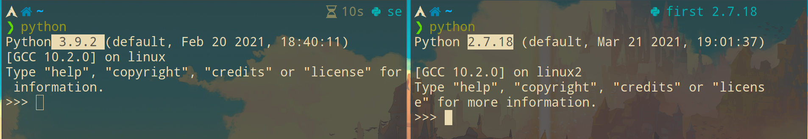
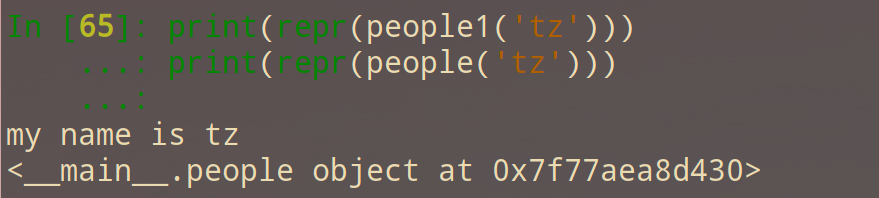

# python

<!-- vim-markdown-toc GFM -->

    * [环境配置](#环境配置)
        * [交互更友好的解释器](#交互更友好的解释器)
        * [pyenv](#pyenv)
        * [常用命令:](#常用命令)
    * [基本概念](#基本概念)
    * [解释器](#解释器)
        * [python 慢的原因](#python-慢的原因)
    * [动态类型](#动态类型)
    * [import and from](#import-and-from)
    * [if](#if)
    * [函数式编程](#函数式编程)
        * [fib(斐波那契)](#fib斐波那契)
            * [循环 while, for](#循环-while-for)
            * [迭代](#迭代)
            * [泛函](#泛函)
            * [tuple(元组)](#tuple元组)
        * [pi(圆周率)](#pi圆周率)
        * [黄金分割](#黄金分割)
        * [树形递归](#树形递归)
        * [平方根](#平方根)
    * [str(字符串)](#str字符串)
    * [rlist(序列)](#rlist序列)
    * [tuple(元组)](#tuple元组-1)
    * [dict(字典)](#dict字典)
        * [json](#json)
    * [yield](#yield)
        * [协程](#协程)
    * [def(函数)](#def函数)
        * [内置函数,属性](#内置函数属性)
        * [装饰器](#装饰器)
    * [class(类)](#class类)
        * [内置函数,属性](#内置函数属性-1)
        * [itertools(迭代器)](#itertools迭代器)
        * [class的内置装饰器](#class的内置装饰器)
    * [file](#file)
    * [lib(库)](#lib库)
        * [logging](#logging)
        * [pathlib](#pathlib)
        * [os](#os)
        * [subprocess](#subprocess)
            * [Popen](#popen)
                * [asyncio(异步)](#asyncio异步)
            * [clipboard](#clipboard)
        * [argparse(参数)](#argparse参数)
        * [re](#re)
        * [requests](#requests)
        * [httpx](#httpx)
        * [Image](#image)
        * [pynput.keyboard](#pynputkeyboard)
        * [psutil](#psutil)
        * [asciimatics(tui)](#asciimaticstui)
    * [向量计算](#向量计算)
        * [numpy](#numpy)
            * [numpy 处理图片](#numpy-处理图片)
        * [pygal](#pygal)
    * [sort(排序)](#sort排序)
    * [调试](#调试)
        * [timeit](#timeit)
        * [面向对象的性能损耗](#面向对象的性能损耗)
        * [cProfile](#cprofile)
        * [Scalene](#scalene)
* [reference article(优秀文章)](#reference-article优秀文章)
* [第三方软件资源](#第三方软件资源)

<!-- vim-markdown-toc -->
## 环境配置

### 交互更友好的解释器

- [ptpython](https://github.com/prompt-toolkit/ptpython)比`ipython`更好

- [jupyter notebooks](https://github.com/jupyterhub/jupyterhub)
    > 可以显示plot画的图

- [在线jupyter(需要科学上网)](https://colab.research.google.com/notebooks/intro.ipynb#recent=true)

### pyenv

> 多版本共存或相互隔离

安装两个包: `pyenv` `pyenv-virtualenv`

```bash
# 获取可安装的版本
pyenv install --list

# 安装2.7.18版本
pyenv install -v 2.7.18

# 查看当前版本和可选版本
pyenv versions

pyenv global 2.7.18
```

virtualenv:

> pip 也是独立的环境

```bash
# 终端1
eval "$(pyenv init -)"
eval "$(pyenv virtualenv-init -)"

pyenv virtualenv 2.7.13 first
pyenv activate first

# 终端2
eval "$(pyenv init -)"
eval "$(pyenv virtualenv-init -)"
pyenv virtualenv system second
pyenv activate second
```

```py
# 删除虚拟环境
pyenv virtualenv-delete first
pyenv virtualenv-delete second
```



### 常用命令:

```bash
# 转换json格式
echo '{"1": "123", "2": "321"}' | python -m json.tool

# 共享当前目录下的文件
python -m http.server 8080

# 浏览器查看文档
python -m pydoc -p 1234

# 监控文件变动
python -m pyinotify -v /tmp
```

## 基本概念

- 一切皆是对象

  - 每个对象由 `id(地址)` `type(类型)` `value(值)` 组成

    `a is b` 实际上为 `id(a) == id(b)`. `is` 效率高于 `==`

  - `list` `dict` `set` 为**可变数据**,值的修改**不需要创建新对象**
     ```py
     a = [1, [2], 3]
     b = a
     # 由于b引用a, 所以a和b一样
     b[0] = 2
 
     import copy
     # 浅复制不会复制所有子对象
     b = copy.copy(a)
     # 父对象修改不会影响a
     b [0] = 2
     # 子对象修改会影响a
     b [1][0] = 1

     # 深复制, 两个对象完全不会影响
     b = copy.deepcopy(a)
     ```


  - `int` `str` `tuple` 为**不可变数据**,值的修改**需要创建新对象**

    - `a = 256` `b = 256` 两者 id 相同

      > python 维护一个(0, 256)的常量值, 这范围内的值的变量 id 相同

    - `a = 257` `b = 257` 两者 id 不相同

    - `a = 257` `b = a` 两者 id 相同

- 语法糖
    ```py
    a, b = 1, 2
    a + b 等同于 a.__add__(b)

    list1 = [1, 2]
    list[0] 等同于 a.__getitem__(0)
    ```

- exec

    ```py
    kv = {'1': 1}
    table_name = 'linux'

    # 设置 linux = kv
    exec(f'{table_name} = {kv}')

    错误: 声明变量后是无法print()的
    print(linux)
    ```

## 解释器

### python 慢的原因

> 官方的 python 版本是 cpython

> CPython 会对代码进行一系列的读取、语法分析、解析、编译、解释和执行的操作。

- GIL(Global Interpreter Lock)全局解释器锁:

  - python 变量使用引用计数,次数为 0 时则释放内存.当多个线程共享变量, 每次只能一个线程操作变量

- JIT(Just-in-time):

  - 优点: 将代码拆分成多个块,分析哪些代码会多次运行,运行时依然使用字节码

  - 缺点: 启动时间慢

- Jpython: java 实现

  - [] GIL
  - [] JIT

- Cpython:库是 C 写的

  - [x] GIL:没有使用引用计数
  - [] JIT

- [PyPy](https://doc.pypy.org/en/latest/faq.html):比 cpython2.7 版块 3 倍.库是 RPython 写的

  - [x] GIL
  - [x] JIT

- [python 性能对比](https://hackernoon.com/which-is-the-fastest-version-of-python-2ae7c61a6b2b)

## 动态类型

- 字典的 `key`, `value` 可以是其它类型

  - 注意:

    **key** 不能为 `list`, `set`

  - 错误:

    `lv = {['hello', 'nihao']: 1}`

    `lv = {{'hello', 'nihao'}: 1}`

    ```py
    kv = {1: 'hello', 2: 'nihao'}
    kl = {1: ['hello', 'nihao']}
    kt = {1: ('hello', 'nihao')}
    ks = {1: {'hello', 'nihao'}}

    sv = {'hello': 1, 'nihao': 2}
    tv = {('hello', 'nihao'): 1}
    ```

- `list`, `tuple`, `set` 转 `dict`

  ```py
  dict([(3, 9), (4, 16), (5, 25)])
  dict(([3, 9], [4, 16], [5, 25]))
  dict(({3, 9}, {4, 16}, {5, 25}))
  ```

- `dict` 转 `list`, `tuple`, `set` 只能保留 `key`:

  ```py
  tuple({1: 'a', 2: 'b'})
  list({1: 'a', 2: 'b'})
  set({1: 'a', 2: 'b'})
  ```

- 要想同时保留 `key` `value` 可以利用 list 保存 key,再循环赋值

  ```py
  D = {'a':1, 'c':3, 'b':2}
  D1 = list(D.keys())
  D1.sort()
  s = tuple()
  for i in D1:
    s = s + (i, D[i])
  ```

- 循环赋值

  ```py
  (x for x in range(1,5))
  tuple(x * 2 for x in 'abc')
  [x for x in range(1,5) if x % 2 == 0]
  ['x' * 2 for x in 'abc']
  {x: x * x for x in range(1,5)}
  ```

## import and from

file test:

```py
# 文件test
__all__ = ['a']
a = 1
b = 2
```

- `import` 用法

> 创建新namespace, 只会加载一次

> 注意:import只在函数里有效

file test1:

```py
# 文件test1
import test
print(test.a)
print(test.b)
```

- `from module import name, name1` 用法

> 在当前 `namespace` 引用

> 注意:from不能在`class`, `function`里使用

```py
a = 0
from test import *

# a的值会被覆盖
print(a)

# __all__ = ['a']因为导入文件没有指定b,所以会报错
print(b)

# 此时再导入b
from test import b
print(b)
```

## if

| 正确写法        | 错误写法        |
|-----------------|-----------------|
| `if not v:` or  `if v is None:`| `if v == None:` |
| `if v:`         | `if v != None:` |

判断变量是否定义: `if 'v' in locals():`

- or

    ```py
    # 最后v = 1

    b = None
    c = None
    v = b or c or 1
    ```

## 函数式编程

lambda:

```py
def mul_add(f, g):
    def h(x):
        return f(g(x, x), g(x, x))
    return h

def mul_add(f, g):
    return lambda x: f(g(x, x), g(x, x))

# test
test = mul_add(mul, add)
test(12)
```

- 字典的value放入函数.注意字典的value不能放入lambda

```py
def plus(x):
    return x + 1

func_list = {1: abs, 2: plus}

def wrapper(value):
    return func_list[value]

# test
func = wrapper(1)
func(-1)

func = wrapper(2)
func(-1)
```

### fib(斐波那契)

#### 循环 while, for

```py
def fib(n):
    x = n
    while n > 1:
        n = n - 1
        x = x + n
    return x

def fib(n):
    prev, curr = 1, 0
    for _ in range(n):
        prev, curr = curr, prev + curr
    return curr

# test
fib(10)

def fib1(f, n):
    x = n
    while n > 1:
        n = n - 1
        x = f(x, n)
        print(x)
    return x

# test
fib1(add,10)
fib1(mul,10)
```

#### 迭代

```py
def fib2(x, n):
    def diedai(x, n, s):
        if n >= x:
            s = diedai(x, n - 1, s + n)
        return s
    return diedai(x, n - 1, n)

# test
fib2(0,10)

# 自选函数: f

def fib2(f, x, n):
    def diedai(f, x, n, s):
        if n >= x:
            s = diedai(f, x, n - 1, f(s, n))
        return s
    return diedai(f, x, n - 1, n)


# test
fib2(add, 0, 10)
fib2(mul, 1, 5)

# 步进: y

def fib2(f, x, n, y):
    def diedai(f, x, n, s):
        if n >= x:
            s = diedai(f, x, n - y, f(s, n))
        return s
    return diedai(f, x, n - y, n)

# test
fib2(add, 0, 10, 2)
fib2(mul, 10, 100, 10)
```

#### 泛函

```py
def sum(n, term, next):
    s, x = 0, 1
    while x <= n:
        s, x = s + term(x), next(x)
    return s

def fib(x):
    def fib_next(x):
        return x + 1
    def fib_term(x):
        return x
    return sum(x, fib_term, fib_next)

fib(100)
```

#### tuple(元组)

```py
def maporder(n):
    return tuple(map(lambda x: x + 1, range(0, n)))

def sumorder(n):
    return sum(map(lambda x: x + 1, range(0, n)))

def mapfib(n):
    return tuple(map(fib, range(2, n + 1)))

def mapfib(n):
    return tuple(x for x in range(1, n + 1))

def sumfib(n):
    return sum(map(fib, range(2, n + 1)))

def sumfib(n):
    return sum(fib(x) for x in range(2, n + 1))

# test
maporder(10)
sumorder(10)
mapfib(10)
sumfib(10)

# odd, even
def exfib(n, culc, f):
    return f(filter(culc, range(1, n)))

def odd(n, f):
    return exfib(n, lambda x: x % 2 != 0, f)

def even(n, f):
    return exfib(n, lambda x: x % 2 == 0, f)

odd(10, tuple)
even(10, sum)
```

### pi(圆周率)

```py
def pi(n):
    s, x = 0, 1
    while x <= n:
        s, x = s + 8 / (x * (x + 2)), x + 4
    return s

def pi(n):
    def pi_sum(s, x, n):
        if n >= x:
            s = pi_sum(s + 8 / (x * (x + 2)), x + 4, n)
        return s
    return pi_sum(0, 1, n)

# test
pi(100)
```

```py
def sum(n, term, next):
    def pi_sum(s, x, n, pi_term, pi_next):
        if n >= x:
            s = pi_sum(s + term(x), next(x), n, pi_term, pi_next)
        return s
    return pi_sum(0, 1, n, pi_term, pi_next)

# pi
def pi(x):
    def pi_next(x):
        return x + 4
    def pi_term(x):
        return 8 / (x * (x + 2))
    return sum(x, pi_term, pi_next)

# test
# 8 / (x * (x + 2))
pi(100)
```

### 黄金分割

```py
def square(x):
    return x * x

def successor(x):
    return x + 1

def near(x, f, g):
    return approx_eq(f(x), g(x))

def approx_eq(x, y, tolerance = 1e-5):
    return abs(x - y) < tolerance

def golden_update(guess):
    return 1 / guess + 1

def golden_test(guess):
    return near(guess, square, successor)

def iter_improve(update, test, guess = 1):
    while not test(guess):
        guess = update(guess)
    return guess

# test
# 1 / guess + 1
iter_improve(golden_update, golden_test)
```

### 树形递归

```py
# 指数增长

def tree(n):
    if n == 1:
        return 0
    if n == 2:
        return 1
    return tree(n - 2) + tree(n - 1)

# test
tree(6)
```

### 平方根

```py
def square(x):
    return x * x

def average(x, y):
    return (x + y) / 2

def approx_eq(x, y, tolerance = 1e-5):
    return abs(x - y) < tolerance

def iter_improve(update, test, guess = 1):
    while not test(guess):
        guess = update(guess)
    return guess

def sqrt_update(guess, x):
    return average(guess, x / guess)

def square_root(x):
    def update(guess):
        return average(guess, x / guess)
    def test(guess):
        return approx_eq(square(guess), x)
    return iter_improve(update, test)

# test
# ((x / guess) + guess) / 2
square_root(256)
```

牛顿法:

```py
def square(x):
    return x * x

def successor(k):
    return k + 1

def approx_eq(x, y, tolerance = 1e-5):
    return abs(x - y) < tolerance

def approx_derivative(f, x, delta = 1e-5):
    df = f(x + delta) - f(x)
    return df / delta

def newton_update(f):
    def update(x):
        return x - f(x) / approx_derivative(f, x)
    return update

def iter_improve(update, test, guess = 1):
    while not test(guess):
        guess = update(guess)
    return guess

def find_root(f, initial_guess = 10):
    def test(x):
        return approx_eq(f(x), 0)
    return iter_improve(newton_update(f), test, initial_guess)

def square_root(a):
    return find_root(lambda x: square(x) - a)

def logarithm(a, base = 2):
    return find_root(lambda x: pow(base, x) - a)


# test
square_root(16)

logarithm(32, 2)
```

## str(字符串)

- strip()

```py
# 去除空格符号
'   \t123\n  '.strip()

'####123####'.strip('#')

'####123####'.strip('#13')
```

- format()

```py
# 对象
"my name is {a.name} , age is {a.age}".format(a=people())

# 小数保留
"{:.2f}".format(3.1415926)
```

## rlist(序列)

```py
def first(rlist):
    return rlist[0]

def rest(rlist):
    return rlist[1]

# insert
def insert(rlist, x):
    return (rlist,x)

def finsert(rlist, x):
    return (x,rlist)

# lengh
def lengh(rlist):
    n = 0
    while rlist != None:
        rlist, n = rest(rlist), n + 1
    return n

# test
rlist = (1, (1, (2, (2, None))))
lengh(rlist)

# get item
def get(rlist, n):
    while n > 0:
        rlist, n = rest(rlist), n - 1
    return first(rlist)

# test
get(rlist, 2)

# nonone
def nonone(rlist):
    if rest(rlist) == None:
        return first(rlist)
    return rlist

# reverse 反转
def reverse(rlist):
    x, rlist = insert(first(rlist),None), rest(rlist)
    while rlist != None:
        x, rlist = insert(first(rlist),x), rest(rlist)
    return x

# 递归
def test(rlist, x):
    if rlist != None:
       x = test(rest(rlist), (first(rlist),x))
    return x

def reverse(rlist):
    return test(rlist, None)

# test
reverse(rlist)

# insert
def ninsert(rlist, x, n):
    len, y, rerlist = lengh(rlist) - n, None, reverse(rlist)
    while rerlist != None:
        y, rerlist = insert(first(rerlist),y), rest(rerlist)
        len = len - 1
        if len == 0:
            y = insert(x, y)
    return y

# test
ninsert(rlist, 0, 2)

def einsert(rlist, x):
    return ninsert(rlist, x, lengh(rlist))

def einsert(rlist, x):
    x = insert(0, None)
    rerlist = reverse(rlist)
    link(x, rerlist)
    return x

# test
einsert(rlist, 0)
```

元组操作序列:

```py
# count 计算一个值,在序列出现的次数
def count(rlist, x):
    n = 0
    while rlist != None:
        if (x == first(rlist)):
            n = n + 1
        rlist = rest(rlist)
    return n

# bug
def count(rlist, x):
    n = 0
    for i in rlist:
        print(i)
        if i == x:
            n = n + 1
    return n

count(rlist, 1)
```

## tuple(元组)

```py
word = "hello Worrld ! in Python"

# 字符串传元组
tuple(word.split())
tuple(w[0] for w in word.split())
tuple(w[0] for w in word.split() if w[0].isupper())
tuple(w[0] for w in word.split() if w[0].islower())

def first(list):
    return list[0]

def iscap(word):
    return word[0].isupper()

def acronym(word, f):
    return tuple(map(f, filter(iscap, word.split())))

def acronym1(word, f):
    return tuple(f(w) for w in word.split() if iscap(w))

# 提取首字母为大写的单词
acronym(word, lambda x: x)

# 提取首字母为大写的字母
acronym(word, lambda x: x[0])

# 转换为小写
acronym(word, lambda x: x[0].lower())
```

```py
def insert(s, x):
    s = s + x
    s = s + ' '
    return s

# insert
def ninsert(n, y, x):
    l, s = 0, ''
    for i in n:
        s = insert(s, i)
        l = l + 1
        if l == y:
            s = insert(s, x)
    return tuple(s.split())

n = ('hello', 'Worrld', '!', 'in', 'Python')
ninsert(n, 3, 'test')
```

## dict(字典)

```py
from collections import Counter
c = Counter()

# 统计命令次数
with open('/home/tz/.bash_history', 'r') as f:
    for line in f:
       cmd = line.strip().split()
       c[cmd[0]] += 1
```

### json

- 对变量的转换: 带s的方法loads(), dumps()

- 对文件的读写: 不带s的方法load(), dump()

```py
import json

# loads() str内的dict转json.注意:字符串外层必须是',字典内必须是"
str_dict = '{"a": 1, "b": 2}'
json.loads(str_dict)

# dumps() dict转换json.'' 变成 ""
dict1 = {'a': 1, 'b': 2}
json.dumps(dict1)
json.dumps(dict1, indent = 4, sort_keys=True)

# load() 读取json文件
with open('test.json') as file:
  data = json.load(f)

# dump() 写入json文件
with open('test.json', 'w') as file:
  json.dump(dick1, file)
```

## yield

> 生成器,像`return`那样返回后,函数会暂停运行,可使用`__next__()`方法让函数继续执行

```py
def grep(search, filename):
    with open(filename) as file:
        for line in file.readlines():
            if search in line:
                yield line

yd = grep('2', '/tmp/test')

# 让函数继续执行
yd.__next__()
yd.__next__()
```

```py
def count(start, stop):
    while True:
        yield start
        start += stop

yd = count(10, 1)
yd.__next__()
yd.__next__()
```

### 协程
> (yield),通过send()传递值

```py
def xicheng():
    while True:
        n = (yield)
        print(n)

# test
r = xicheng()

# send之前需要__next__()
r.__next__()
r.send('123')
r.send('hello')

# 通过装饰器包一层函数,让它自动__next__()
def wrapper(func):
    def newxicheng():
        r = func()
        r.__next__()
        return r
    return newxicheng

@wrapper
def xicheng():
    while True:
        n = (yield)
        print(n)

# test
r = xicheng()
r.send('123')

# 生成器
def xicheng():
    r = None
    while True:
        line = (yield r)
        r = line.split(',')

# test
r = xicheng()
r.__next__()
r.send('123,321')
```

## def(函数)

### 内置函数,属性

```py

# 普通函数和匿名函数
def a (x, y):
    """This is the module docstring."""
    c = {'a': 1, 'b': 2}
    return x + y

b = lambda x, y: x + y

# dir查看方法
dir(a)
dir(b)

# __doc__返回 """This is the module docstring."""
a.__doc__

# 调用是使用内置的方法__call__()
a.__call__(1, 2)
b.__call__(1, 2)
a(1, 2)
b(1, 2)

# __dict__查看内部使用字典保存a.name, a.age属性变量
def test():
    test.a = 1

# 一开始函数没有运行,此时还没有赋值,结果为空
test.__dict__

# 函数运行后可查看
test()
test.__dict__
```

### 装饰器

> 输入输出函数

```py
def wrapper(func):
    def newfunc(*args, **kw):
        print("我真的是一个装饰器")
        return func
    return newfunc

@wrapper
def func():
    print("我是原函数")

# @的表达式.个人理解为面向对象遇上函数的表达方法.等同于以下
func = wrapper(func)

# test
# 这里执行的是newfunc
func()
# 执行newfunc后会返回func函数,第二个()就是执行func
func()()

# 再包一层
def wrapper1(func):
    def newfunc(*args, **kw):
        print("我真的是第二个装饰器")
        return func
    return newfunc

def wrapper(func):
    def newfunc(*args, **kw):
        print("我真的是一个装饰器")
        return func
    return newfunc

@wrapper1
@wrapper
def func():
    print("我是原函数")

# 以上等同于
func = wrapper1(wrapper(func))

# test
func()()()

# 类装饰器
def wrapper(cls):
    class newcls:
        def __init__(self):
            self.name = "我真的是一个装饰器"
            self.cls = cls
    return newcls

@wrapper
class cls:
    def __init__(self):
        self.name = "我是原函数"

# test
a = cls()
a.name

b = a.cls()
b.name
```

## class(类)

### 内置函数,属性

- ` __new__()`创建实例,` __init__()`初始化实例

    > 类实例化的内部函数

    ```py
    class cls(object):
        pass

    a = cls.__new__(cls)
    if isinstance(a, cls):
        cls.__new__(a)

    # 以上等同于
    a = cls()
    ```

- `__del__()` destructors(析构函数)

    > 类引用次数为0时,删除资源的内部析构函数

    尽量不要自定义`__del__()`,否则在以下循环引用的例子会导致内存泄漏

    ```py
    class A:
        def __init__(self, b):
            self.b = b

    class B:
        def __init__(self):
            self.a = A(self)
        def __del__(self):
            print("die")

    b = B()
    ```

- `__call__` 像函数那样调用类.class()

    ```py
    class people(object):
        def __init__(self):
            self.name = 'tz'
        def __call__(self):
            print('class call')

    # test
    a = people
    a()
    ```


- `__file__`查看模块路径

    ```py
    import re

    re.__file__
    ```

- `__dict__` 查看class的self变量

    > clss的self变量,使用字典保存

    ```py
    class people(object):
        height = 180
        __weight = 100
        def __init__(self):
            self.name = 'tz'
        def age(self, n):
            self.age = n

    a = people()
    a.age(24)

    a.__dict__
    # a.name 等同于a.__dict__['name']
    a.__dict__['name']
    ```

-  `__slots__` 不使用dictionary(字典)保存self变量

    > 每个class的dictionary浪费大量内存, 而__slots__是一种减少内存的方法

    > 注意: 依赖__dict__代码将无法使用

    ```py
    class people(object):
        __slots__ = ['name', 'age']
        def __init__(self):
            self.name = 'tz'
            self.age = 24

    a = people()
    print(a.__slots__)
    ```

- `__str__()` 和 ` __repr__()`

    > str(class),repr(class)后返回的值

    ```py
    # 当使用str(object) 执行 __str__函数
    class people(object):
        height = 180
        def __init__(self, name):
            self.name = name
        def age(self, n):
            self.age = n
        def __str__(self):
            return 'my name is %s' % self.name

    class people1(object):
        height = 180
        def __init__(self, name):
            self.name = name
        def age(self, n):
            self.age = n
        def __repr__(self):
            return 'my name is %s' % self.name

    # test
    print(str(people1('tz')))
    print(str(people('tz')))

    # repr 与 str 的区别.repr()无法输出__str__
    print(repr(people1('tz')))
    print(repr(people('tz')))
    ```

    

- iterator迭代器:

    `__iter__()` 和 `__ next__()`实现简单的`range()`函数

        ```py
        class range:
            def __init__(self, x, y):
                self.x = x
                self.y = y

            def __iter__(self):
                return self

            def __next__(self):
                if self.x <= self.y:
                    x = self.x
                    self.x += 1
                    return x
                else:
                    raise StopIteration


        a = range(1, 10)
        for i in a:
            print(i)
        ```

### itertools(迭代器)

- [默认迭代函数实现](https://docs.python.org/3/library/itertools.html#itertools.product)


### class的内置装饰器

- @property

    > 类的方法转换成只读属性

    ```py
    class people(object):
        def __init__(self, name = 'tz'):
            self.name = name
        @property
        def age(self):
            return 24

    # test
    a = people().age
    # 实例化后无法修改
    a.age = 23
    ```

    访问私有变量

    ```py
    class people(object):
        __age = 24
        def __init__(self, name = 'tz'):
            self.name = name
        @property
        def age(self):
            return self.__age

    # test
    people().age
    ```

- @setter

    > 可以修改`@property`的属性

    ```py
    class people(object):
        def __init__(self, name = 'tz'):
            self.name = name

        @property
        def age(self):
            return 24

        @age.setter
        def age(self, age):
            # 这里不能是self.age = age
            people.age = age

    a = people()
    a.age
    a.age = 100
    ```

    修改私有变量

    ```py
    class people(object):
        __age = 24
        def __init__(self, name = 'tz'):
            self.name = name

        @property
        def age(self):
            return self.__age

        @age.setter
        def age(self, age):
        # 这里不能是__age = age
            people.__age = age

    a = people()
    a.age
    a.age = 100
    ```

- @classsmethod

    > 不需要实例化,就能访问方法

    ```py
    # 访问私有变量
    class people(object):
        __height = 180
        def __init__(self, name = 'tz'):
            self.name = name

        @classmethod
        def height(cls):
            return cls.__height

    people().height()
    ```

- @staticmethod

    > 类外的函数, 不需要强制传递self参数, 不能对类造成影响

    ```py
    class people(object):
        def __init__(self, name = 'tz'):
            self.name = name

        def inside(self):
            a = 1
            # 可以修改类的属性
            self.name = 'inside_tz'
            return a

        @staticmethod
        # 不需要传递self参数
        def outside():
            a = 1
            return a

    # test
    a = people()
    a.name
    a.outside()
    a.inside()
    a.name
    ```

## file

```py
# 写入文件
with open('/tmp/test', 'w') as file:
    data = "123 321 abc ABC"
    file.write(data)

# 使用print()写入
with open('/tmp/test', 'w') as file:
    print('123 321 abc ABC', file=file)
```

```py
# 读取文件

# 指定编码 file = open('/tmp/test', 'r', encoding='utf-8')

file = open('/tmp/test')
# 只能读取一次
print(file.read())
file.close()

# with格式, 能多次读取, 并且自动close()
with open('/tmp/test') as file:
        data = file.read()
        print(data)

# 简单修改后写入到test1
data = data.swapcase()
with open('/tmp/test1', 'w') as file:
        file.write(data)

# 边读边写,将首字符转为大写
with open('/tmp/test', 'r') as intf, open('/tmp/test1', 'w') as outf:
    for line in intf:
        print([word.capitalize() for word in line.split()], file=outf)

# 读取多文件
file = ('test', 'test1')
for i in file:
    f = open(i)
    print(f.read())

f.close()
```

## lib(库)

### logging

```py
import logging

# 设置日志输出文件
# filemode='w' 为重头输出, 'a' 追加输出

logging.basicConfig(filename='app.log', filemode='w', format='%(name)s - %(levelname)s - %(message)s')

# 设置时间格式
logging.basicConfig(filename='app.log', filemode='w',format='%(asctime)s - %(message)s', datefmt='%d-%b-%y %H:%M:%S')

logging.warning('This will get logged to a file')

# 设置等级debug以上才输出
logging.basicConfig(level=logging.DEBUG)
```

### pathlib

- [你应该使用 pathlib 替代 os.path](https://zhuanlan.zhihu.com/p/87940289)

  > 面向对象

```py
from pathlib import Path
p = Path('/home/tz/notes/python.md')

# 查看当前程序的绝对路径
Path(__file__).parent.absolute()

# 当前目录
Path().absolute()

# 父目录
p.parent
p.parents[0]
p.parents[1]
p.parents[2]

p.cwd().is_dir()

# 文件名
p.name
# 去除拓展名
p.stem
# 只显示拓展名
p.suffix

# 以.为分格符返回列表
Path('my.tar.bz2').suffixes

# touch
p = Path('/tmp/test')
p.touch()

# 写入文件,会删除文件原有内容
p.write_text('123\n123\n')

# 读取文件
p.read_text()
# 或者
with p.open() as f:
    for line in f:
        print(line)

# ls
for i in p.iterdir():
        print(i)

# 返回PosixPath对象
p = Path('.')
[i for i in p.glob('*')]

# 区分文件和目录
for i in p.glob('*'):
    if i.is_file():
        print('file: ' + i)
    elif i.is_dir():
        print('dir: ' + i)

# find .
for i in p.glob('**/*'):
    print(i)
```

### os

```py
from os import walk
# 输出文件和目录
for root, dirs, files in os.walk(".", topdown=False):
   for name in files:
      print(os.path.join(root, name))
   for name in dirs:
      print(os.path.join(root, name))

# 将名为BBB的目录,改名为AAA
for root, dirs, files in os.walk(".", topdown=False):
   for name in dirs:
      if name == 'BBB':
          src = (os.path.join(root, name))
          dst = (os.path.join(root, 'AAA'))
          os.rename(src,dst)
```

fnmatch:

```py
import fnmatch
import os

pattern = '*py*'
files = os.listdir('.')
print ('Matches :', fnmatch.filter(files, pattern))
```

### subprocess

- 返回值:

    - subprocess.call 返回$?(是否执行成功)

    - subprocess.check_output 返回 str

        - 如果报错则出现CalledProcessError

    - subprocess.run 返回对象(subprocess.CompletedProcess)

    - subprocess.Popen 返回对象(subprocess.Popen)

    - 更建议使用 run, Popen

```py
# 默认以列表类型运行
subprocess.call(['echo', '123'])

# shell = True 以字符串类型执行
subprocess.call('echo 123', shell = True)

# check_output 获取stdout
output = subprocess.check_output('echo 123', shell=True)

# 将二进制的输出结果转换为str
output = output.decode('utf-8')
# 或者
# universal_newlines=True 将输出转换为str
output = subprocess.check_output('echo 123', shell=True, universal_newlines=True)
output.rstrip() # 去除换行符\n

# 获取标准stdout, stderr, return code
output = subprocess.run('echo 123', shell=True, universal_newlines=True, stdout=subprocess.PIPE, stderr=subprocess.PIPE)

output.stdout
output.stderr
output.returncode
```

#### Popen

- [Popen](https://queirozf.com/entries/python-3-subprocess-examples)

```py
from subprocess import Popen
# 在后台以子进程运行
p = Popen(["ls","-l"])

# wait()则会阻塞,等待并获取返回值.也就是wait()后才能获取returncode
p.wait()

# pid返回子进程pid
p.pid

# terminate()终止运行
p.terminate()

# 获取stdout, error.注意:必须stdout=subprocess.PIPE,不然output为空
p = Popen("echo 123",shell=True, stdout=subprocess.PIPE, stderr=subprocess.PIPE, universal_newlines=True)
output, error = p.communicate()

# 重定向输入输出
test = '/tmp/test'
file = open(test,'w+')
# stdout=file.重定向输出
p = Popen("echo 123",shell=True, stdout=file, stderr=subprocess.PIPE, universal_newlines=True)

# p2 stdin=p1.stdout.重定向输出

# PIPE ls -lha | grep foo bar
from subprocess import Popen,PIPE
p1 = Popen(["ls","-lha"], stdout=PIPE)
p2 = Popen(["grep", "foo bar"], stdin=p1.stdout, stdout=PIPE)
p1.stdout.close()
```
##### asyncio(异步)
```py
import asyncio

p = await asyncio.create_subprocess_exec(
    'ls','-lha',
    universal_newlines=True,
    stdout=asyncio.subprocess.PIPE,
    stderr=asyncio.subprocess.PIPE)

output, error = p.communicate()
```

#### clipboard

```py
def getClipboard():
    cmd = 'xclip -selection clipboard -o'
    output = subprocess.check_output(cmd, shell=True, universal_newlines=True)
    return output

def setClipboard(data):
    p = subprocess.Popen(['xclip','-selection','clipboard'], stdin=subprocess.PIPE)
    p.stdin.write(data)
    p.stdin.close()
    retcode = p.wait()

setClipboard('data'.encode())
```
### argparse(参数)

- [文档](https://zetcode.com/python/argparse/)


```py
import argparse
parser = argparse.ArgumentParser()

# 如果有-o, --output参数,有则为true
# 注意: 必须要有参数-o
parser.add_argument('-o', '--output', action='store_true', help="shows output")

# 自定义属性now
parser.add_argument('-a', '--add', dest='now', action='store_true', help="shows output")

# required赋值
parser.add_argument('--name', required=True)

# type定义类型
parser.add_argument('-n', type=int, required=True) 

# default
parser.add_argument('-e', type=int, default=2, help="defines the exponent value")

# append 多个重复参数
parser.add_argument('-n', '--name', dest='names', action='append')

args = parser.parse_args()
print(args)

# 如果为true,则执行
if args.output:
    print("This is some output")
    print(f'Hello {args.name}')

if args.now:
    print("This is add")
```

### re

```py
a = '123abc 192.168.1.1 ABC\n1.1.1.1\nabc ABC\n999.999.999.999'
re.findall('\d', a)

# 匹配ip地址
re.findall('\d{1,3}\.\d{1,3}\.\d{1,3}\.\d{1,3}', a)

# match 匹配成功则返回对象
aa = re.match('\d{1,3}', a)
ip = aa.group()
# 匹配失败则返回false
aa = re.match('\d{1,3}\.', a)

# compile 对象匹配
pattern = re.compile('\d{1,3}')
re.findall(pattern, a)

# sub 替换
# 所有数字替换成0
aa = re.sub('\d','0', a)

# split 拆分
aa = re.split('[\n\b.]',a)
```
### requests

- [官方文档](https://requests.readthedocs.io/en/master/)

```py
import requests
p = {'s?wd': '123'}
r = requests.get('https://www.baidu.com/', params=p)

# post方法的测试网站
url = 'https://httpbin.org/post'

# dict
data1 = {'test': [1, 2]}
# or
data1 = [('test', 1), ('test', 2)]

# 参数data,但实际上是form
r = requests.post(url, data = data1)
# 响应报文
r.headers
# 请求报文
r.request.headers
# 查看text
r.json()

# json
r = requests.post(url, json = data1)
r.json()

# files
# 建议使用二进制模式打开文件
url = 'https://httpbin.org/post'
ultiple_files = [
     ('images', ('foo.png', open('foo.png', 'rb'), 'image/png')),
     ('images', ('bar.png', open('bar.png', 'rb'), 'image/png'))]
 r = requests.post(url, files=multiple_files)
 r.text

# cookies
url = 'https://httpbin.org/cookies'
cookies = dict(cookies_are='working')
r = requests.get(url, cookies=cookies)
r.text

# session
s = requests.Session()
r = s.get('https://httpbin.org/cookies/set/sessioncookie/123456789')
r.text

# 确认session是否关闭
with requests.Session() as s:
    s.get('https://httpbin.org/cookies/set/sessioncookie/123456789')

# stream=True时只下载响应头,和保持链接.因此需要使用with关闭链接
with requests.get('https://httpbin.org/get', stream=True) as r:
    # Do things with the response here.

# hook
def print_url(r, *args, **kwargs):
    print(r.url)

requests.get('https://httpbin.org/', hooks={'response': print_url})

# hook multpie
def record_hook(r, *args, **kwargs):
    r.hook_called = 'my name is tz'
    return r

r = requests.get('https://httpbin.org/', hooks={'response': [print_url, record_hook]})
r.hook_called

# session hook
s = requests.Session()
s.hooks['response'].append(print_url)
s.get('https://httpbin.org/')

# proxy
proxies = {
  'http': 'http://10.10.1.10:3128',
  'https': 'http://10.10.1.10:1080',
}

requests.get('http://example.org', proxies=proxies)
```
### httpx

> 语法类似`requests`.支持同步,异步,HTTP2

- [官方文档](https://www.python-httpx.org/)

- 向同一主机发出多个请求时，客户端将重用底层TCP连接(HTTP keep-alive)，而不是为每个请求重新创建一个

- 默认 `encoding` 为 `utf-8`, 而requests的 `encoding` 为 `ISO-8859-1`

```py
import httpx
import asyncio

# async

async with httpx.AsyncClient() as client:
    r = await client.get(url)

# unix domain socket
transport = httpx.HTTPTransport(uds="/var/run/docker.sock")
client = httpx.Client(transport=transport)
response = client.get("http://docker/info")
response.json()

# http2
client = httpx.AsyncClient(http2=True)
r = await client.get(url)
r.http_version
```

log

```py
# test.py
import httpx

url = 'https://www.baidu.com'

with httpx.Client() as client:
    r = client.get(url)
```

```bash
HTTPX_LOG_LEVEL=debug python3 test.py
DEBUG [2021-03-27 11:45:16] httpx._client - HTTP Request: GET http://www.baidu.com "HTTP/1.1 200 OK"
```
```bash
HTTPX_LOG_LEVEL=trace python3 test.py
TRACE [2021-03-27 11:47:18] httpx._config - load_ssl_context verify=True cert=None trust_env=True http2=False
TRACE [2021-03-27 11:47:18] httpx._config - load_verify_locations cafile=/home/tz/.local/lib/python3.9/site-packages/certifi/cacert.pem
TRACE [2021-03-27 11:47:18] httpcore._sync.connection_pool - get_connection_from_pool=(b'http', b'www.baidu.com', 80)
TRACE [2021-03-27 11:47:18] httpcore._sync.connection_pool - created connection=<SyncHTTPConnection http_version=UNKNOWN state=0>
TRACE [2021-03-27 11:47:18] httpcore._sync.connection_pool - adding connection to pool=<SyncHTTPConnection http_version=UNKNOWN state=0>
TRACE [2021-03-27 11:47:18] httpcore._sync.connection - open_socket origin=(b'http', b'www.baidu.com', 80) timeout={'connect': 5.0, 'read': 5.0, 'write': 5.0, 'pool': 5.0}
TRACE [2021-03-27 11:47:18] httpcore._sync.connection - create_connection socket=<httpcore._backends.sync.SyncSocketStream object at 0x7f51d618eb20> http_version='HTTP/1.1'
TRACE [2021-03-27 11:47:18] httpcore._sync.connection - connection.request method=b'GET' url=(b'http', b'www.baidu.com', None, b'/') headers=[(b'Host', b'www.baidu.com'), (b'Accept', b'*/*'), (b'Accept-Encoding', b'gzip, deflate'), (b'Connection', b'keep-alive'), (b'User-Agent', b'python-httpx/0.17.1')]
TRACE [2021-03-27 11:47:18] httpcore._sync.http11 - send_request method=b'GET' url=(b'http', b'www.baidu.com', None, b'/') headers=[(b'Host', b'www.baidu.com'), (b'Accept', b'*/*'), (b'Accept-Encoding', b'gzip, deflate'), (b'Connection', b'keep-alive'), (b'User-Agent', b'python-httpx/0.17.1')]
TRACE [2021-03-27 11:47:18] httpcore._sync.http11 - send_data=Data(<0 bytes>)
DEBUG [2021-03-27 11:47:18] httpx._client - HTTP Request: GET http://www.baidu.com "HTTP/1.1 200 OK"
TRACE [2021-03-27 11:47:18] httpcore._sync.http11 - receive_event=Data(<241 bytes>)
TRACE [2021-03-27 11:47:18] httpcore._sync.http11 - receive_event=Data(<2654 bytes>)
```
### Image

```py
from PIL import Image
image = Image.open('/tmp/test.jpg')

# 裁剪
rect = 80, 20, 500, 550
image.crop(rect).show()

# 缩略
size = (128, 128)
# image.thumbnail(size)

# 旋转
image.rotate(180).show()

# 翻转
image.transpose(Image.FLIP_LEFT_RIGHT).show()

# 滤镜
from PIL import ImageFilter
image.filter(ImageFilter.CONTOUR).show()
```
### pynput.keyboard

> 自动输入

```py
# 键盘
from pynput.keyboard import Key, Controller

keyboard = Controller()

# 按一下enter
keyboard.press(Key.enter)

# 按住c
keyboard.release('c')


# 鼠标
from pynput.mouse import Button, Controller as MouseController
mouse = MouseController()
```
### [psutil](https://github.com/giampaolo/psutil)

- [官方文档](https://psutil.readthedocs.io/en/latest/)

psutil.Popen:

```py
import psutil
from subprocess import PIPE
p = psutil.Popen(["/usr/bin/python", "-c", "print('hello')"], stdout=PIPE)
p.name()
p.communicate()
p.wait(timeout=2)
```

bytes2human():

```py
def bytes2human(n):
    # http://code.activestate.com/recipes/578019
    # >>> bytes2human(10000)
    # '9.8K'
    # >>> bytes2human(100001221)
    # '95.4M'
    symbols = ('K', 'M', 'G', 'T', 'P', 'E', 'Z', 'Y')
    prefix = {}
    for i, s in enumerate(symbols):
        prefix[s] = 1 << (i + 1) * 10
    for s in reversed(symbols):
        if n >= prefix[s]:
            value = float(n) / prefix[s]
            return '%.1f%s' % (value, s)
    return "%sB" % n
```

```py
# 统计time_wait的连接
cons =psutil.net_connections()
len([c for c in cons if c.status == 'TIME_WATI'])
```
### asciimatics(tui)

```py

```

## 向量计算

### numpy

- [官方文档](https://numpy.org/doc/stable/user/quickstart.html)

> 默认数据类型是 `float64`

```py
import numpy as np

# zeros() 创建3行2列数组,全0的数组
a = np.zeros((3, 2))

# astype 对现有转换数据类型
a.astype(int)

# 或者 dtype 指定数据类型
a = np.zeros((3, 2), dtype=np.int32)

# random.rand() 创建3行2列的随机数组
np.random.rand(3, 2)

# shape 获取数组行列
a.shape

# arange()创建0到8的数组
np.arange(0, 9)

# arange()创建0到9的数组
np.arange(10)

# arange() 每个元素 * 2
np.arange(10) * 2

# arange() 每个元素平方
np.arange(10) ** 2


# linspace() 创建有步进的数组
np.linspace(0, 9, 4)
np.linspace(0, 1, 5)

# r_ 自定义数组.把0放在中间
np.r_[1:5,0,6:10]

# array()自定义数组

# 1行2列
np.array([2, 4])

# 3行1列
np.array([[10], [20], [30]])

# 配合arange()
np.array([np.arange(1, 9),
          np.arange(0, 8)])
```

- 计算

```py
a = np.arange(10)

# 左右交换
np.append(a[4:],a[:4])

# 或者
b = int(a.size / 2)
np.append(a[b:],a[:b])

# 或者使用split()
b, c = np.split(a, 2)
np.append(c, b)

# 左右交换后,分别翻转
np.append(a[b::-1], a[9:b:-1])

# 以步进为2,左右交换后,分别翻转
np.append(a[b::-1][::2], a[9:b:-1][::2])
```

- 维度变换

```py
a= np.array([[ 0,  1,  2,  3],
               [10, 11, 12, 13],
               [20, 21, 22, 23],
               [30, 31, 32, 33],
               [40, 41, 42, 43]])

# 转换为单行单维
a.ravel()
np.hstack(a)

# 转换成2行
a.reshape(2,-1)
# 或者手动转换,并重新赋值
a.resize((2,10))

# 行列交换
a.T

# column_stack()列表类型转数组,并进行同维度的合并
a = [[0,0],[1,1],[2,2]]
b = [[9,9],[8,8],[7,7]]
np.column_stack((a,b))
# 或者
np.c_[a, b]
```

- 以数组i,j的行列分布,获取数组a值

```py
a = np.arange(10)
i = np.array([0,1])
j = np.array([[0],[1]])
a[i]
a[j]
a[l]

# 以i为行, j为列截取数组b(像截图一样)
b = np.arange(12).reshape(3,4)
l = (i, j)
b[l]

i = np.array([[0, 1],[1, 2]])
j = np.array([[2, 1],[3, 3]])
b[:,i]
b[:,j]
```

```py
a = np.arange(2, 4)
b = np.arange(3, 5)
```

- a + b

    ```py
    [2, 3]
      +
    [3, 4]
      =
    [5, 7]
    ```

- np.dot(a, b)

    ```py
    ??
    ```

- np.sum()

    ```py
    a = np.array([np.arange(1, 9),
              np.arange(0, 8)])

    # axis=0 行相加
    a.sum(axis=0)

    # axis=1 列相加
    a.sum(axis=1)
    ```

- 不同尺寸也能计算

    > 自动扩展相同尺寸

    - a + b

    ```py
    a = np.array([2, 4])
    b = np.array([[10], [20], [30]])
    ```

    ```py
    [2, 4] + [10, 10] = [12, 14]
    [2, 4] + [20, 20] = [22, 24]
    [2, 4] + [30, 30] = [32, 34]
    ```
#### numpy 处理图片

- [Image Processing with Numpy](https://www.degeneratestate.org/posts/2016/Oct/23/image-processing-with-numpy/)

```py
import numpy as np
from PIL import Image

# 打开图片并转换数组
image = np.array(Image.open('/tmp/test.jpg'))
image.shape

# 提取红色
image_red = image[:,:,0]
# 显示
Image.fromarray(image_blue).show()
```

- 合并图片

```py
image1 = Image.open('/home/tz/1.jpg')
image2 = Image.open('/home/tz/2.jpg')

# 裁剪为800 * 600
rect = 0, 0, 600, 800
image1 = image1.crop(rect)
image2 = image2.crop(rect)
image1 = np.array(image1)
image2 = np.array(image2)

# 合并
image_merge = image1 * 0.5 + image2 * 0.5
# 转换整数
image_merge = image_merge.astype(np.uint8)

Image.fromarray(image_merge).show()
```

### pygal

## sort(排序)

- [算法实现](https://zhuanlan.zhihu.com/p/49271189)

## 调试

### timeit

```py
from timeit import time

mysetup = 'from math in sqrt'

def mycode():
    sqrt(3)

timeit(setup = mysetup, # 执行的函数的预设
               stmt = mycode,  # 执行的函数
               number = 10000) # 执行的次数
```

- 直接初始化 比 函数初始化要快3倍以上
    ```py
    timeit('a=tuple()')
    timeit('a=()')
    ```
    输出:
    ```
    0.0321451320005508
    0.009014002999720105
    ```
- 3种字符串格式化对比

    > 区别不大

    ```py
    a = '123'
    b = '321'
    print('timeit test {} {}'.format(a,b))
    ```

    ```py
    a = '123'
    b = '321'
    print(f'timeit test {a} {b}')
    ```

    ```py
    a = '123'
    b = '321'
    print('timeit test' + a + b)
    ```
    测试:
    ```py
    timeit('import test')
    timeit('import test1')
    timeit('import test2')
    ```
    输出:
    ```
    0.07623226299995167
    0.076570758999992
    0.07589723899997125
    ```

- 字典的key, 列表的值.相同情况下的循环对比

    > 区别不大

    ```py
    list1 = ['linux', 'xueshu', 'library', 'social', 'waiguosocial', 'video', 'shop', 'search', 'wiki', 'network']

    dict1 = {'linux': 'linux', 'xueshu': 'xueshu', 'library': 'library', 'social': 'social', 'waiguosocial': 'waiguosocial', 'video': 'video', 'shop': 'shop', 'search': 'search', 'wiki': 'wiki', 'network': 'network'}

    def list_test():
        for i in list1:
            print(i)

    def dict_test():
        for i in dict1:
            print(i)

    timeit(stmt = test, number = 10000)
    timeit(stmt = test1, number = 10000)
    ```

- 对比3种方法获取字典值: if, get(), try

    > 区别不大

    测试文件:test.py
    ```py
    # file test.py

    key = 'a'
    if key in items:
        v = items[key]
    else:
        v = None
    ```
    测试文件:test1.py
    ```py
    # file test1.py
    v = items.get(key)
    ```
    测试文件:test2.py
    ```py
    # file test2.py

    items = {'a': 1, 'b': 2, 'c': 3}
    key = 'n'
    try:
        v = items[key]
    except KeyError:
        v = None
    ```

    测试:
    ```py
    items = {'a': 1, 'b': 2, 'c': 3}
    key = 'a'
    timeit('import test')
    timeit('import test1')
    timeit('import test2')
    ```
    输出:
    ```
    0.07695441999931063
    0.07400108000001637
    0.07423666900012904
    ```

    把key换成字典之外的值
    ```py
    key = 'n'
    ```
    输出:
    ```
    0.07498021500032337
    0.07673525599966524
    0.07963845299946115
    ```

- from 导入比import 导入要快

    > 如果使用math.sqrt(), 解释器首先需要找到math模块,再去找对应的sqrt()方法

    - sqrt() 比 math.sqrt() 快1.5到2倍

    ```py
    timeit('math.sqrt(9)', 'import math')
    timeit('sqrt(9)', 'from math import sqrt')
    ```
    输出:
    ```
    0.06219652999971004
    0.030946962999678362
    ```

### 面向对象的性能损耗

- 单独使用字典赋值比对象内部赋值快3倍, 而使用`__slots__` 快15%

    测试文件test.py:
    ```py
    # file test.py
    class test():
        def __init__(self, a, b, c):
            self.a = a
            self.b = b
            self.c = c
    ```
    测试文件test1.py:
    ```py
    # file test1.py
    class test1():
        __slots__ = ['a', 'b', 'c']
        def __init__(self, a, b, c):
            self.a = a
            self.b = b
            self.c = c
    ```

    测试:
    ```py
    timeit("r = test(1, 2, 3)", 'from test import test')
    timeit("r = test1(1, 2, 3)", 'from test1 import test1')
    timeit("r = {'a': 1, 'b': 2, 'c': 3}")
    ```
    输出:
    ```
    0.2395006189999549
    0.20651085099962074
    0.07340252900030464
    ```

- 值计算对比

    > 对象内部的字典快于 __slot__() 和 直接字典计算

    ```py
    # test.py
    code = 'r.a * r.b * r.c'
    setup = '''
    from test import test
    r = test(1, 2, 3)'''

    timeit(setup=setup, stmt=code)

    # test1.py
    code = 'r.a * r.b * r.c'
    setup = '''
    from test1 import test1
    r = test1(1, 2, 3)'''

    timeit(setup=setup, stmt=code)

    # test2.py
    timeit("r['a'] * r['b'] * r['c']", "r = {'a': 1, 'b': 2, 'c': 3}")
    ```
    输出:
    ```
    0.08434765600009086
    0.10209759400004259
    0.10072487599995839
    ```

### cProfile

```py
import cProfile

a = []
def test():
    for i in range(10000):
        a.append(i)

cProfile.run('test()')
```
输出:能看到一共1004个函数,以及每个函数的执行次数
```
ncalls  tottime  percall  cumtime  percall filename:lineno(function)
    1    0.000    0.000    0.000    0.000 <stdin>:2(test)
    1    0.000    0.000    0.000    0.000 <string>:1(<module>)
    1    0.000    0.000    0.000    0.000 {built-in method builtins.exec}
 1000    0.000    0.000    0.000    0.000 {method 'append' of 'list' objects}
    1    0.000    0.000    0.000    0.000 {method 'disable' of '_lsprof.Profiler' objects}
```

- pstat

    > 查看执行时间

```py
import pstat

profiler = cProfile.Profile()
profiler.enable()
test()              #测试函数
profiler.disable()
stats = pstats.Stats(profiler).sort_stats('ncalls')
stats.print_stats()
```


### [Scalene](https://github.com/emeryberger/scalene)

> 适用于 Python 的高性能，高精度 CPU 和内存分析器

> 注意: gpu的分析,只支持nvidia

```py
import psutil
from subprocess import PIPE
p = psutil.Popen(["/usr/bin/python", "-c", "print('hello')"], stdout=PIPE)
p.name()
```


# reference article(优秀文章)

- [python官方文档](https://docs.python.org/)

- [python - 100 天从新手到大师](https://github.com/jackfrued/Python-100-Days)

- [python-cheatsheet](https://github.com/gto76/python-cheatsheet)

- [pandas中文教程](http://joyfulpandas.datawhale.club/Content/index.html)

- [Python/Golang Web 入坑指南](https://python-web-guide.readthedocs.io/zh/latest/)

# 第三方软件资源

- [Best-of Python: python资源分类](https://github.com/ml-tooling/best-of-python)

- [awesome-python-cn: Python资源大全](https://github.com/jobbole/awesome-python-cn)

- [Awesome Python: python资源分类排行](https://python.libhunt.com/)

- [awesome-jupyter](https://github.com/markusschanta/awesome-jupyter)

- [rich: 可以很容易的在终端输出添加各种颜色和不同风格](https://github.com/willmcgugan/rich)

- [rembg: 一键扣图](https://github.com/danielgatis/rembg)

- [mitmproxy: http抓包](https://github.com/mitmproxy/mitmproxy)
