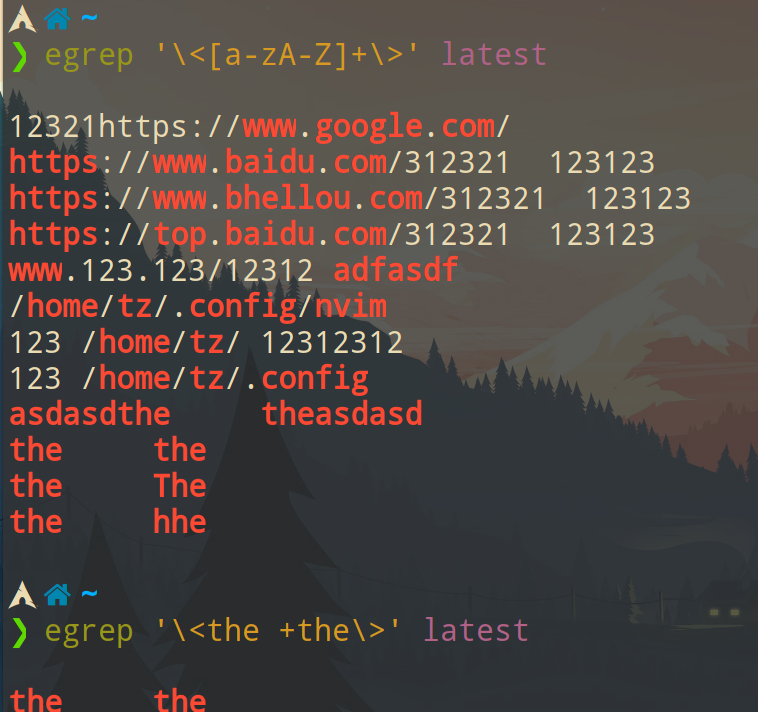
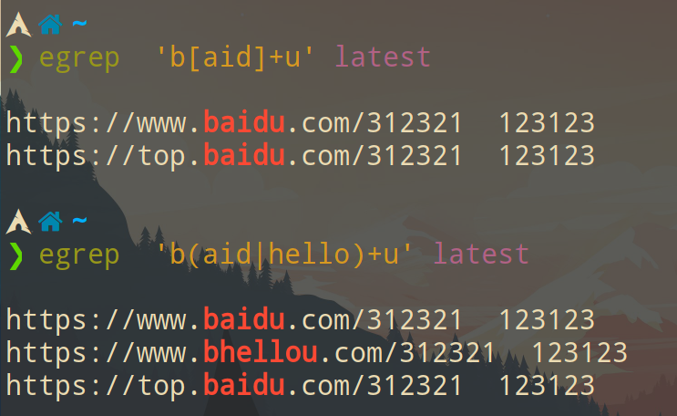
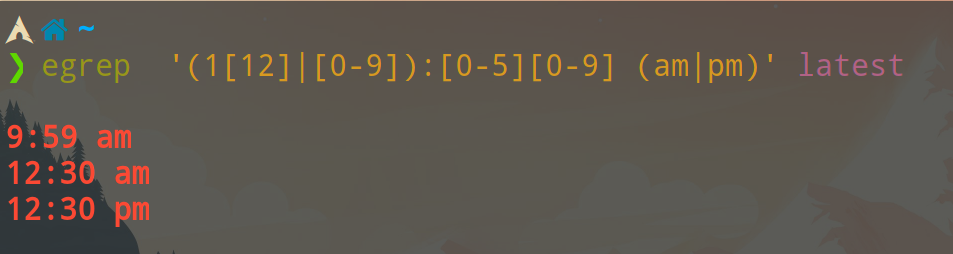

<!-- vim-markdown-toc GFM -->

* [regex](#regex)
    * [egrep](#egrep)
        * [`\<word\>` 匹配单词](#word-匹配单词)
        * [`\1` 反向引用,等同于前一个字符序列(结果和上面的 the 一样)](#1-反向引用等同于前一个字符序列结果和上面的-the-一样)
        * [`?` `*` `+` 表示前面的元素的数量(包含 `()` `[]` )](#---表示前面的元素的数量包含---)

<!-- vim-markdown-toc -->

# regex

## egrep

测试文件:

```
12321https://www.google.com/
123123
https://www.baidu.com/312321  123123
https://www.bhellou.com/312321  123123
https://top.baidu.com/312321  123123
www.123.123/12312 adfasdf
321312
/home/tz/.config/nvim
123 /home/tz/ 12312312
123 /home/tz/.config
asdasdthe     theasdasd

the     the
the     The
the     hhe

$123
$123.123
$.49

9:59 am
12:30 am
12:30 pm
13:61 am
33:61 am

23:33
20:33
19:33
```

### `\<word\>` 匹配单词

```bash
egrep '\<[a-zA-Z]+\>' latest

egrep '\<the +the\>' latest
```



### `\1` 反向引用,等同于前一个字符序列(结果和上面的 the 一样)

```bash
egrep '\<([a-zA-Z]+) + \1\>' latest
```


### `?` `*` `+` 表示前面的元素的数量(包含 `()` `[]` )

```bash
egrep  'b[aid]+u' latest
```

```bash
egrep  'b(aid|hello)+u' latest
```



匹配美元: `$123.123`

```bash
egrep  '\$[0-9]+(\.[0-9]*)?' latest
```

匹配时间: `12:30 am`

```bash
egrep  '(1[12]|[0-9]):[0-5][0-9] (am|pm)' latest
```



匹配时间: `23:30`

```bash
egrep  '(2[0-3]|1[0-9]|[0-9]):[0-5][0-9]' latest
```
