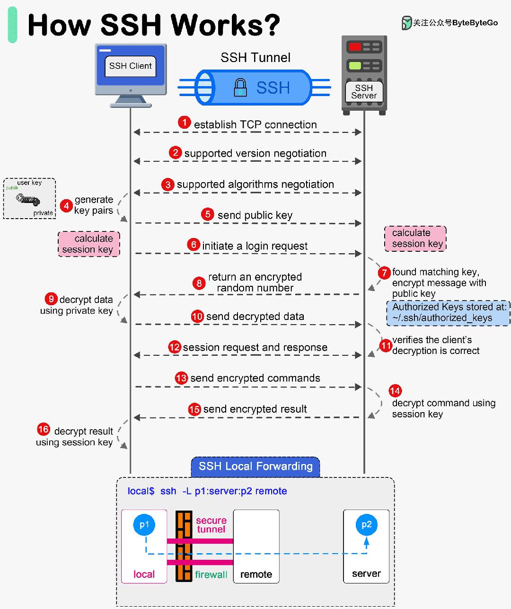

<!-- vim-markdown-toc GFM -->

* [server(服务配置)](#server服务配置)
    * [系统优化](#系统优化)
        * [trim(统一文件系统与ssd删除)](#trim统一文件系统与ssd删除)
        * [irqbalance(中断分配多cpu)](#irqbalance中断分配多cpu)
        * [关闭按Control-Alt-Delete就重启](#关闭按control-alt-delete就重启)
    * [su, sudo](#su-sudo)
    * [ssh](#ssh)
        * [ByteByteGo：SSH 是如何工作的？](#bytebytegossh-是如何工作的)
        * [基本概念](#基本概念)
        * [远程连接](#远程连接)
        * [/etc/ssh/sshd_config 配置文件](#etcsshsshd_config-配置文件)
        * [ssh-agent管理私钥的passphrase密码，日后不需要输入passphrase就可以远程连接](#ssh-agent管理私钥的passphrase密码日后不需要输入passphrase就可以远程连接)
        * [快速连接](#快速连接)
        * [knowclub：史上最全 SSH 暗黑技巧详解](#knowclub史上最全-ssh-暗黑技巧详解)
            * [内部堡垒机、跳板机都需要密码+动态码，太复杂了，怎么解？](#内部堡垒机跳板机都需要密码动态码太复杂了怎么解)
            * [我有很多不同机房（或者说不同客户）的机器都需要跳板机来登录，能一次直接ssh上去吗？](#我有很多不同机房或者说不同客户的机器都需要跳板机来登录能一次直接ssh上去吗)
            * [将隔离环境中的web端口映射到本地（本地代理）](#将隔离环境中的web端口映射到本地本地代理)
            * [指定算法来强制client端使用某种和server一致的加密方式](#指定算法来强制client端使用某种和server一致的加密方式)
            * [SSH 三大转发模式](#ssh-三大转发模式)
        * [autossh：启动 ssh 服务并进行监控的命令行应用程序，可以在程序问题或者是网络问题的时候，重启 ssh 服务。](#autossh启动-ssh-服务并进行监控的命令行应用程序可以在程序问题或者是网络问题的时候重启-ssh-服务)
        * [ssh3：使用 QUIC + TLS 重新实现的 SSH 加密登陆工具，支持 UDP 端口转发](#ssh3使用-quic--tls-重新实现的-ssh-加密登陆工具支持-udp-端口转发)
        * [sshfs：ssh将远程目录挂载到本地](#sshfsssh将远程目录挂载到本地)
        * [pdsh(ssh 并行管理)](#pdshssh-并行管理)
        * [pssh](#pssh)
    * [服务(server)](#服务server)
        * [DNS](#dns)
            * [systemd-resolved (DNS over tls,cache server,LLMNR)](#systemd-resolved-dns-over-tlscache-serverllmnr)
        * [nfs](#nfs)
        * [proxy(代理)服务器](#proxy代理服务器)
            * [squid](#squid)
            * [stunnel](#stunnel)
        * [VPN](#vpn)
            * [openvpn](#openvpn)
            * [wireguard](#wireguard)
    * [安全(security)](#安全security)
        * [以redis为例的服务检查](#以redis为例的服务检查)
        * [ssh](#ssh-1)
            * [sshguard：阻止SSH暴力攻击](#sshguard阻止ssh暴力攻击)
            * [fail2ban：阻止SSH暴力攻击](#fail2ban阻止ssh暴力攻击)
            * [denyhosts：阻止SSH暴力攻击](#denyhosts阻止ssh暴力攻击)
        * [重要文件加锁chattr -i](#重要文件加锁chattr--i)
        * [ntp(同步时间服务)](#ntp同步时间服务)
        * [关闭 core dump](#关闭-core-dump)
        * [selinux](#selinux)
        * [tcp_wrappers: 第二层防火墙](#tcp_wrappers-第二层防火墙)
        * [aide：保存当前文件的状态（新增的文件、修改时间、权限、文件哈希值），日后可以对比](#aide保存当前文件的状态新增的文件修改时间权限文件哈希值日后可以对比)
        * [metasploit](#metasploit)
        * [rkhunter: 检查 rookit](#rkhunter-检查-rookit)
        * [clamav: 病毒扫描](#clamav-病毒扫描)
        * [sqlmap: 自动检测和利用 SQL 注入漏洞，获得数据库服务器的权限。](#sqlmap-自动检测和利用-sql-注入漏洞获得数据库服务器的权限)
        * [ghauri：自动检测和利用 SQL 注入漏洞](#ghauri自动检测和利用-sql-注入漏洞)
        * [beef: web渗透测试](#beef-web渗透测试)
        * [lynis（安全审计以及加固工具）](#lynis安全审计以及加固工具)
        * [hydra：密码破解](#hydra密码破解)
        * [fscan：开源的内网安全扫描工具提供了一键自动化全方位的漏洞扫描。它使用方便、功能全面，支持端口扫描、常见的服务器爆破、Web 应用漏洞扫描、NetBIOS 嗅探等功能。](#fscan开源的内网安全扫描工具提供了一键自动化全方位的漏洞扫描它使用方便功能全面支持端口扫描常见的服务器爆破web-应用漏洞扫描netbios-嗅探等功能)
        * [clamav：cisco的反病毒引擎](#clamavcisco的反病毒引擎)
    * [系统监控](#系统监控)
        * [cockpit(系统监控的webui)](#cockpit系统监控的webui)
    * [自动化任务](#自动化任务)
        * [cron](#cron)
        * [anacron](#anacron)
        * [jenkins](#jenkins)
            * [安装](#安装)
            * [插件与配置](#插件与配置)
            * [新建任务 Maven项目](#新建任务-maven项目)
            * [pipeline流水线](#pipeline流水线)
            * [Jenkins：手把手教会你 Jenkins 备份与恢复](#jenkins手把手教会你-jenkins-备份与恢复)
        * [Gitlab-CI](#gitlab-ci)
    * [Gitlab-CE](#gitlab-ce)
            * [安装](#安装-1)
    * [日志软件](#日志软件)
        * [logrotate（自带的日志分割工具）](#logrotate自带的日志分割工具)
        * [rsyslog](#rsyslog)

<!-- vim-markdown-toc -->

# server(服务配置)

## 系统优化

### trim(统一文件系统与ssd删除)

- 方法1: 修改`/etc/fstab`
```sh
# 在<options>, 加入discard
UUID=3453g54-6628-2346-8123435f  /home  xfs  defaults,discard   0 0
```

- 方法2: systemctl启动fstrim服务. 如果之前使用了方法1, 记得删除discard

```sh
# 每周一0点, 清理一次
systemctl enable fstrim.timer
systemctl start fstrim.timer
```

### irqbalance(中断分配多cpu)

- centos的默认中断分配服务

- 会根据系统的负载情况, 将中断分配到不同的cpu

```sh
systemctl status irqbalance
```

### 关闭按Control-Alt-Delete就重启

```sh
# 删除以下文件
rm /usr/lib/systemd/system/ctrl-alt-del.target

# 重新加载配置文件
init q
```

## su, sudo

- `/etc/sudoers` 

```
# sudo无需输入密码
tz ALL = NOPASSWD: ALL

# sudo cat /etc/shadow 此命令无需输入密码
tz ALL = NOPASSWD: /bin/cat /etc/shadow
```


- 禁止 wheel 组以外的用户使用 `su - root` 命令 
    ```sh
    # 在/etc/pam.d/su文件下配置
    auth sufficient pam_rootok.so
    auth required pam_wheel.so group=wheel
    ```
- 设置口令最大的出错次数 5 次，系统锁定后的解锁时间为 180 秒： 在`/etc/pam.d/system-auth` 和 `/etc/pam.d/password-auth` 文件中添加
    ```sh
    auth required pam_faillock.so preauth audit silent deny=5 unlock_time=180
    auth [success=1 default=bad] pam_unix.so
    auth [default=die] pam_faillock.so authfail audit deny=5 unlock_time=180
    auth sufficient pam_faillock.so authsucc audit deny=5 unlock_time=180
    ```

    - 测试
    ```sh
    # ssh登陆时输错密码

    # 查看锁定
    faillock

    # 解锁用户
    faillock --user username --reset
    ```


- 修改密码有效期

    - 相同的配置下 `/etc/shadow` 文件的优先级高于 `/etc/login.defs`

    | 参数          | 内容                       | 建议设置值 |
    |---------------|----------------------------|------------|
    | PASS_MAX_DAYS | 口令最大有效期             | 90         |
    | PASS_MIN_DAYS | 两次修改口令的最小间隔时间 | 10         |
    | PASS_WARN_AGE | 口令过期前开始提示天数     | 7          |

    ```sh
    # 在/etc/login.defs文件下修改

    # 修改前
    PASS_MAX_DAYS	99999
    PASS_MIN_DAYS	0
    PASS_MIN_LEN	5
    PASS_WARN_AGE	7

    # 修改后
    PASS_MAX_DAYS	90
    PASS_MIN_DAYS	10
    PASS_MIN_LEN	5
    PASS_WARN_AGE	7
    ```

- 设置密码复杂度：

    | 参数         | 内容                      |
    |--------------|---------------------------|
    | minlen = 8   | 口令长度至少包含 8 个字符 |
    | dcredit = -1 | 口令包含N个数字           |
    | ucredit = -1 | 口令包含N大写字母         |
    | ocredit = -1 | 口令包含N个特殊字符       |
    | lcredit = -1 | 口令包含N个小写字母       |

    - 在`/etc/pam.d/password-auth` 和`/etc/pam.d/system-auth` 未配置 minlen、dcredit、ucredit、ocredit、lcredit 时，`/etc/security/pwquality.conf` 文件设置才会生效
    ```sh
    cat >>/etc/security/pwquality.conf << EOF
    minlen = 8
    dcredit = -1
    ucredit = -1
    ocredit = -1
    lcredit = -1
    EOF
    ```


## ssh

### [ByteByteGo：SSH 是如何工作的？](https://mp.weixin.qq.com/s/oC3cD_xo5mWK-jYPtU_uhQ)

- SSH 的三个主要层： 传输层、验证层和连接层

    

- 传输层

    > 传输层提供加密、完整性和数据保护，确保客户端和服务器之间的通信安全。

    - 1.建立 TCP 连接
        - 客户端启动与 SSH 服务器的 TCP 连接，通常是在 22 端口。

    - 2.协议版本交换
        - 客户端和服务器交换包含各自支持的 SSH 协议版本的标识字符串。

    - 3.算法协商
        - 客户端和服务器就加密、密钥交换、MAC（消息验证码）和压缩所使用的加密算法达成一致。

    - 4.密钥交换
        - 密钥交换算法（如 Diffie-Hellman）用于安全生成共享秘密。这一过程可确保双方在不直接传输的情况下获得相同的会话密钥。

    - 5.会话密钥推导
        - 会话密钥是从共享秘密和其他交换信息中推导出来的。这些密钥用于加密和解密通信。

    - 6.密码初始化
        - 双方使用导出的会话密钥初始化各自选择的加密和 MAC 算法。

    - 7.数据完整性和加密
        - 传输层为客户端和服务器之间的所有后续通信提供数据完整性检查和加密。

- 验证层

    > 验证层验证客户端的身份，确保只有授权用户才能访问服务器。

    - 1.服务请求
        - 客户端请求 "ssh-userauth "服务。

    - 2.身份验证方法广告
    服务器公布可用的身份验证方法（如密码、公钥、键盘交互）。

    - 3.客户端身份验证

        - 客户端尝试使用一种或多种可用方法进行身份验证。常见方法包括：

        - 密码验证：客户端向服务器发送密码，由服务器进行验证。
        - 公钥验证：客户端证明拥有与先前注册的公钥相对应的私钥。
        - 键盘交互式身份验证：服务器向客户端发送提示，客户端回复所需的信息（如 OTP、安全问题）。

    - 4.身份验证成功/失败
        - 如果客户端的凭据有效，服务器将允许访问。否则，客户端可尝试其他认证方法或关闭连接。

- 连接层

    > 连接层将加密和认证通信复用为多个逻辑通道。

    - 1.创建通道
        - 客户端请求为各种类型的通信（如 shell 会话、文件传输、端口转发）打开通道。

    - 2.信道请求
        - 每个通道请求包括所需服务类型和任何附加参数等详细信息。

    - 3.信道数据传输
        - 数据通过已建立的信道传输。每个通道独立运行，允许多个服务在一个 SSH 连接上同时运行。

    - 4.关闭通道
        - 通道可以相互独立关闭，而不会影响整个 SSH 连接。关闭所有通道后，客户端即可终止 SSH 会话。

    - 5.全局请求
        - 连接层还支持全局请求，全局请求会影响整个连接而不是单个通道（例如，重新加密钥会话）。

### 基本概念

- 默认为22端口，安全起见可更改为其它端口，如8022

- 参数的优先级是：`命令行配置选项` > `~/.ssh/config` > `/etc/ssh/ssh_config`

- SSH支持多种身份验证机制，它们的验证顺序如下：gssapi-with-mic,hostbased,publickey,keyboard-interactive,password

    - 这些认证顺序可以通过ssh配置文件(注意，不是sshd的配置文件)中的指令PreferredAuthentications改变。

    - 但常见的是密码认证机制(password)和公钥认证机制(public key). 当公钥认证机制未通过时，再进行密码认证机制的验证。

- 服务器公钥保存路径：`~/.ssh/authorized_keys`

    - 注意:服务端`authorized_keys`和客户端`私钥文件`权限必须是**600**

- debug：

    ```sh
    # 客户端debug：-vvv参数是debug，把所有流程在控制台显示出来。卡在哪个环节；密码不对还是key不对一看就知道
    ssh -vvv centos7

    # 服务端debug：看输出信息验证为什么pub key不能login等
    /usr/sbin/sshd -ddd -p 2222
    ```

- 列出本地所支持默认的加密算法

    ```sh
    ssh -Q key
    ssh -Q cipher       # List supported ciphers
    ssh -Q mac          # List supported MACs
    ssh -Q key          # List supported public key types
    ssh -Q kex          # List supported key exchange algorithms
    ```

- 公钥、私钥常见扩展名
    - 公钥：`.pub` `.pem` `ca.crt`
    - 私钥：`.prv` `.pem` `ca.key` `.key`

### 远程连接

- [技术蛋老师：OpenSSH核心操作 | GitHub SSH连接](https://www.bilibili.com/video/BV1Sx4y1y7B2)

- 服务器会保存曾经尝试连接（因为要输入密码，未必真的连接成功）的主机记录：`~/.ssh/known_hosts`

```sh
# 生成公私密钥。-t为rsa算法 -C为注释。
ssh-keygen -t rsa -b 4096 -C "your_mail@example.com"
# 生成公私密钥。github建议使用ed25519算法，openssh9.5开始默认使用ed25519算法
ssh-keygen -t ed25519 -C "your_mail@example.com"
# 执行后。第一次输入需要修改文件名，默认会覆盖id_rsa文件；第二次passphrase为输入密码，就算密钥被盗也没用。

# 添加公钥到远程服务器
ssh user@ip 'mkdir -p .ssh && cat >> .ssh/authorized_keys' < ~/.ssh/id_rsa.pub
# or 使用ssh-copy-id -i
sudo ssh-copy-id -i ~/.ssh/id_rsa.pub ip

# ssh连接远程服务器
ssh user@ip
# -i 指定私钥路径
ssh -i ~/.ssh/id_rsa user@ip
```

- 修改 `/etc/ssh/sshd_config` 配置文件

    ```
    # 允许密钥连接
    PubkeyAuthentication yes
    ```

- 重启sshd服务

    ```sh
    systemctl restart sshd
    ```

### /etc/ssh/sshd_config 配置文件

```
# 允许密钥连接
PubkeyAuthentication yes

# 允许密码连接
PasswordAuthentication yes

# 允许用户
AllowUsers user1 user2

# 禁止root登陆
PermitRootLogin no

# 修改默认端口
Port 22221

# 不使用dns反查, 提高ssh连接速度
UseDNS no

# Banner指定用户登录后，sshd 向其展示的信息文件（Banner /usr/local/etc/warning.txt），默认不展示任何内容。/etc/ssh/my_banner 中可以放置提示内容
Banner /etc/ssh/my_banner
```

### ssh-agent管理私钥的passphrase密码，日后不需要输入passphrase就可以远程连接

```sh
# 后台启动ssh-agent
eval `ssh-agent -s`

# 添加私钥。需要输入passphrase密码
ssh-add ~/.ssh/id_rsa

# 查看私钥
ssh-add -L

# 关闭ssh-agent。ssh-agent把密码写入内存，可能会有被入侵的风险。
ssh-agent -k
```

### 快速连接

- 配置`~/.ssh/config`文件:

| ssh option   | 内容                       |
|--------------|----------------------------|
| IdentityFile | 私钥路径                   |
| Compression  | 启动压缩(会对性能产生影响) |

```sh
Host centos7
  HostName 192.168.100.208
  User root
  Port 22
  IdentityFile ~/.ssh/id_rsa
  Compression yes

Host opensuse
  HostName 192.168.100.71
  User root
  Port 22
  IdentityFile ~/.ssh/id_rsa
  Compression yes
```

- 配置好后,即可`ssh Host`连接:

```sh
ssh centos7
ssh opensuse
```

### [knowclub：史上最全 SSH 暗黑技巧详解](https://mp.weixin.qq.com/s/oqHV9lNfkHUH1X9QJp5ofA)

#### 内部堡垒机、跳板机都需要密码+动态码，太复杂了，怎么解？

- 在ssh配置文件`~/.ssh/config `增加以下参数：意味着72小时内登录同一台跳板机只有第一次需要输入密码，以后都是重用之前的连接，所以也就不再需要输入密码了。

    ```
    #reuse the same connection --关键配置
    ControlMaster auto
    ControlPath /tmp/ssh_mux_%h_%p_%r

    #查了下ControlPersist是在OpenSSH5.6加入的，5.3还不支持
    #不支持的话直接把这行删了，不影响功能
    #keep one connection in 72hour
    ControlPersist 72h
    #复用连接的配置到这里，后面的配置与复用无关

    #其它也很有用的配置
    GSSAPIAuthentication=no
    #这个配置在公网因为安全原因请谨慎关闭
    StrictHostKeyChecking=no
    TCPKeepAlive=yes
    CheckHostIP=no
    # "ServerAliveInterval [seconds]" configuration in the SSH configuration so that your ssh client sends a "dummy packet" on a regular interval so that the router thinks that the connection is active even if it's particularly quiet
    ServerAliveInterval=15
    #ServerAliveCountMax=6
    ForwardAgent=yes

    UserKnownHostsFile /dev/null
    ```

- 这个就是保存好的socket，下次可以重用，免密码。 in 259200 seconds 对应 72小时

    ```sh
    ssh -vvv centos7
    OpenSSH_9.6p1, OpenSSL 3.2.1 30 Jan 2024
    debug1: Reading configuration data /home/tz/.ssh/config
    debug1: /home/tz/.ssh/config line 1: Applying options for centos7
    debug1: Reading configuration data /etc/ssh/ssh_config
    debug2: resolve_canonicalize: hostname 192.168.100.208 is address
    debug1: auto-mux: Trying existing master at '/tmp/ssh_mux_192.168.100.208_22_root'
    debug2: fd 3 setting O_NONBLOCK
    debug2: mux_client_hello_exchange: master version 4
    debug3: mux_client_forwards: request forwardings: 0 local, 0 remote
    debug3: mux_client_request_session: entering
    debug3: mux_client_request_alive: entering
    debug3: mux_client_request_alive: done pid = 4169
    debug3: mux_client_request_session: session request sent
    debug1: mux_client_request_session: master session id: 2

    # 查看文件类型
    ls -l /tmp/ssh_mux_192.168.100.208_22_root
    srw------- 1 - tz tz 27 Mar 16:46 /tmp/ssh_mux_192.168.100.208_22_root=
    ```

#### 我有很多不同机房（或者说不同客户）的机器都需要跳板机来登录，能一次直接ssh上去吗？

- 比如有一批客户机房的机器IP都是192.168.., 然后需要走跳板机100.10.1.2才能访问到，那么我希望以后在笔记本上直接 ssh 192.168.1.5 就能直接连上

- 方法1：ProxyCommand

    - `/etc/ssh/ssh_config`配置

        ```
        Host 192.168.*.*
            ProxyCommand ssh -l ali-renxijun -p 8022 100.10.1.2 exec /usr/bin/nc %h %p
        ```

    - 以上配置等价下面的命令

        ```sh
        ssh -o ProxyCommand="ssh -l root -p 8022 100.10.1.2 exec /usr/bin/nc %h %p" 192.168.1.5
        # or 等价
        ssh -o ProxyCommand="ssh -l root -p 8022 -W %h:%p 100.10.1.2 " 192.168.1.5
        # or 等价。ProxyCommand和ProxyJump很类似，ProxyJump使用：
        ssh -J root@100.10.1.2:8022 192.168.1.5
        ```

- 方法2：ProxyJump

    - OpenSSH 7.3 以上版本才可以使用 ProxyJump, 相对 ProxyCommand 更简洁方便些

    - `/etc/ssh/ssh_config`配置

        ```
        Host 192.168.*.*
            ProxyJump root@100.10.1.2:8022
        ```

#### 将隔离环境中的web端口映射到本地（本地代理）

- 192.168.100.208为开启了nginx的web服务器

```sh
# 映射到本地的8088端口
ssh -CNfL 0.0.0.0:8088:192.168.100.208:80 root@192.168.100.208

# 测试是否成功
curl 127.0.0.1:8088
```

#### 指定算法来强制client端使用某种和server一致的加密方式

- 连服务器报如下错误：

    ```sh
    # 表示服务端支持 diffie-hellman-group1-sha1,diffie-hellman-group14-sha1 加密，但是client端不支持
    debug1: kex: algorithm: (no match)
    Unable to negotiate with server port 22: no matching key exchange method found. Their offer: diffie-hellman-group1-sha1,diffie-hellman-group14-sha1
    ```

- 解决方法

    ```sh
    ssh  -oKexAlgorithms=+diffie-hellman-group14-sha1 -l user
    ```

    - 或者 ~/.ssh/config 配置

    ```
    host server_ip
    KexAlgorithms +diffie-hellman-group1-sha1
    ```

    - 如果仍然报以下错误：

        ```
        debug2: first_kex_follows 0
        debug2: reserved 0
        debug1: kex: algorithm: diffie-hellman-group14-sha1
        debug1: kex: host key algorithm: (no match)
        Unable to negotiate with server_ip port 22: no matching host key type found. Their offer: ssh-rsa
        ```

    - 那么可以配置来解决：

        ```
        Host *
            HostKeyAlgorithms +ssh-rsa
            PubkeyAcceptedKeyTypes +ssh-rsa
        ```

#### SSH 三大转发模式

- 三个转发模式的比较：
    - 动态转发（socks5代理）：完全可以代替本地转发，只是动态转发是socks5协议，当科学上网用，本地转发是tcp协议
    - 本地转发（正向代理）：完全是把动态转发特例化到访问某个固定目标的转发，类似 iptable 的 port forwarding
    - 远程转发（反向代理）：是启动转端口的机器同时连上两端的两个机器，把本来不连通的两端拼接起来，中间显得多了个节点。

    - 三个转发模式可以串联使用
    - 动态转发常用来科学上网，本地转发用来打洞，这两种转发启动的端口都是在本地；远程转发也是打洞的一种，只不过启用的端口在远程机器上。

    

- 动态转发 (-D) SOCKS5 协议

    - 动态转发指的是，本机与 SSH 服务器之间创建了一个加密连接，然后本机内部针对某个端口的通信，都通过这个加密连接转发。它的一个使用场景就是，访问所有外部网站，都通过 SSH 转发。

    - 动态转发需要把本地端口绑定到 SSH 服务器。至于 SSH 服务器要去访问哪一个网站，完全是动态的，取决于原始通信，所以叫做动态转发。

    

    ```sh
    # 注意，这种转发采用了 SOCKS5 协议。访问外部网站时，需要把 HTTP 请求转成 SOCKS5 协议，才能把本地端口的请求转发出去。-N参数表示，这个 SSH 连接不能执行远程命令，只能充当隧道。
    ssh -D 4444 ssh-server -N
    # 或者如下方式：
    nohup ssh -qTfnN -D *:13658 root@192.168.100.208 vmstat 10  >/dev/null 2>&1
    ```
    ```sh
    # 测试
    curl -x socks5://localhost:4444 http://www.example.com
    # or
    curl --socks5-hostname localhost:4444 https://www.twitter.com
    ```

- 本地转发 (-L)

    - SSH 服务器作为中介的跳板机，建立本地计算机与特定目标网站之间的加密连接。本地转发是在本地计算机的 SSH 客户端建立的转发规则。

    - 典型使用场景就是，打洞，经过跳板机访问无法直接连通的服务。它会指定一个本地端口（local-port），所有发向那个端口的请求，都会转发到 SSH 跳板机（ssh-server），然后 SSH 跳板机作为中介，将收到的请求发到目标服务器（target-host）的目标端口（target-port）。

    

    ```sh
    # ssh -L :local-port:target-host:target-port ssh-server
    # local-port是本地端口，target-host是你想要访问的目标服务器，target-port是目标服务器的端口，ssh-server是 SSH 跳板机。
    # target-host是ssh-server的target-host, target-host 域名解析、路由都是由ssh-server完成

    ssh -L 53682:remote-server:53682 ssh-server

    # 测试。访问本机的53682端口，就是访问remote-server的53682端口.
    curl http://localhost:53682
    ```

    - 将9900转发到5900(vnc端口), 实现更安全的vnc连接
    ```sh
    ssh 127.0.0.1 -L 9900:127.0.0.1:5900
    ssh 127.0.0.1 -L 8080:192.168.100.208:80 root@192.168.100.208
    ```

    - 如果经常使用本地转发，可以将设置写入 ~/.ssh/config
    ```
    Host test.example.com
    LocalForward client-IP:client-port server-IP:server-port
    ```

- 远程转发(-R)

    - 远程端口指的是在远程 SSH 服务器建立的转发规则。主要是执行ssh转发的机器别人连不上，所以需要一台client能连上的机器当远程转发端口，要不就是本地转发了。

    - 由于本机无法访问内网 SSH 跳板机，就无法从外网发起 SSH 隧道，建立端口转发。必须反过来，从 SSH 跳板机发起隧道，建立端口转发，这时就形成了远程端口转发。

    

    - 注意远程转发需要：

        - 1.sshd_config里要打开AllowTcpForwarding选项，否则-R远程端口转发会失败。

        - 2.默认转发到远程主机上的端口绑定的是127.0.0.1，如要绑定0.0.0.0需要打开sshd_config里的GatewayPorts选项(然后ssh -R 后加上*:port )。这个选项如果由于权限没法打开也有办法，可配合ssh -L将端口绑定到0.0.0.0。

    ```sh
    # 首先需要注意，不是在30.1.2.3 或者166.100.64.1 上执行的，而是找一台能联通 30.1.2.3 和166.100.64.1的机器来执行，在执行前Remote clients能连上 30.1.2.3 但是 30.1.2.3 和 166.100.64.1 不通，所以需要一个中介将 30.1.2.3 和166.100.64.1打通
    ssh -fNR 30.1.2.3:30081:166.100.64.1:3128 root@30.1.2.3 -p 2728

    # 测试在Remote Client上执行下面的命令，命令就会输出服务器 166.100.64.1 的3128端口返回的内容。
    curl http://30.1.2.3:30081

    # 开通远程转发后，如果需要动态代理（比如访问所有web服务），那么可以在30081端口机器上(30.1.2.3)执行：表示在30081机器上(30.1.2.3)启动了一个socks5动态代理服务
    nohup ssh -qTfnN -D *:13658 root@127.0.0.1 -p 30081 vmstat 10  >/dev/null 2>&1
    ```

    - 如果经常使用本地转发，可以将设置写入 ~/.ssh/config
    ```
    Host test.example.com
    RemoteForward local-IP:local-port target-ip:target-port
    ```

### autossh：启动 ssh 服务并进行监控的命令行应用程序，可以在程序问题或者是网络问题的时候，重启 ssh 服务。

```sh
# -M 用于有问题时就会自动重连，服务器 echo 机制使用的端口。-D 动态转发
ssh -vvv -N -D localhost:8527 [email protected] -p 8000
autossh -M 5678 -vvv -N -D localhost:8527 [email protected] -p 8000
```

### [ssh3：使用 QUIC + TLS 重新实现的 SSH 加密登陆工具，支持 UDP 端口转发](https://github.com/francoismichel/ssh3)

### [sshfs：ssh将远程目录挂载到本地](https://github.com/deadbeefsociety/sshfs)

```sh
# 将根目录，挂载到本地
sshfs root@192.168.100.208:/ dir
```

### [pdsh(ssh 并行管理)](https://github.com/chaos/pdsh)

- 支持正则表达式

- 复制文件到多个 ssh 的主机时,需要两边都安装 pdsh(因此建议使用 pssh)

```bash
git clone https://github.com/chaos/pdsh.git
cd pdsh

# 配置
# 自动将主机信息写入/etc/pdsh/machines
# 开启分组管理
./configure --with-machines=/etc/pdsh/machines \
            --with-dshgroups

# 编译,安装
make -j$(nproc) && make install
```

```bash
# 设置变量
centos7="root@192.168.100.208"
opensuse="root@192.168.100.71"

# -w 指定主机,运行 uptime 命令
pdsh -w $centos7,$opensuse "uptime"

# 效果同上,[71,208]指定71和208
pdsh -w "root@192.168.100.[71,208]" "uptime"

# [1-254]指定整个子网
pdsh -w "root@192.168.100.[1-254]" "uptime"

# 进入交互模式
pdsh -R ssh -w $centos7
```

### [pssh](https://github.com/robinbowes/pssh)

- 需要将 ssh 主机写入文件,才能并行执行命令

```bash
# 设置变量
centos7="root@192.168.100.208"
opensuse="root@192.168.100.71"

# centos7上执行uptime
pssh -H $centos7 -P uptime

# 生成ssh主机的文件
echo $centos7 > /etc/pssh/hosts
echo $opensuse >> /etc/pssh/hosts

# 通过文件,执行命令
pssh -i -h /etc/pssh/hosts "uptime"
# -O "StrictHostKeyChecking=no" 不需要每次手动输入yes
pssh -i -O "StrictHostKeyChecking=no" -h /etc/pssh/hosts "uptime"

# prsync将当前file文件,复制到tmp目录(等同于rsync)
prsync -h /etc/pssh/hosts -l opsuser -a -r file /tmp

# pslurp将远程主机的/tmp/file文件,复制到家目录并改名为newname
pslurp -h /etc/pssh/hosts -r -L ~ \
/tmp/file newname

# pnuke杀掉nginx进程(类似于pkill)
pnuke -h /etc/pssh/hosts nginx
```

- [wishlist: tui](https://github.com/charmbracelet/wishlist)

## 服务(server)

### DNS

#### systemd-resolved (DNS over tls,cache server,LLMNR)

- [arch wiki](https://wiki.archlinux.org/index.php/Systemd-resolved)

- 配置文件 `/etc/systemd/resolved.conf`

```bash
# 启动
systemctl enable systemd-resolved.service
systemctl start systemd-resolved.service

# 查看状态
resolvectl status

# 测试是否开启DNSSEC
resolvectl query sigok.verteiltesysteme.net

# 查找baidu.com的ip(类似于nslookup)
resolvectl query baidu.com

# 查看统计数据(缓存)
systemd-resolve --statistics

# 测试是否开启dns over tls
ngrep port 853
```

### nfs

两端安装 nfs

```bash
yum install -y nfs-utils
```

- server:

只允许 `192.168.100.0/24` 访问

```bash
cat >> /etc/exports <<'EOF'
root/test      192.168.100.0/24(rw,sync)
EOF

# 更新
exportfs -arv

# 更新nfs
systemctl reload nfs
```

- clinent:

```bash
mount 192.168.100.208:/root/test test
```

### proxy(代理)服务器

#### squid

- [教程文档](https://phoenixnap.com/kb/setup-install-squid-proxy-server-ubuntu)

- 配置文件：`/etc/squid/squid.conf`

```
# 设置代理端口8080
http_port 8080
```

- 启动squid服务
```sh
systemctl start squid
```

- 测试
```sh
curl --proxy http://127.0.0.1:8080 www.baidu.com
```

#### stunnel

- [教程文档](https://www.digitalocean.com/community/tutorials/how-to-set-up-an-ssl-tunnel-using-stunnel-on-ubuntu)

- server端配置文件:`/etc/stunnel/stunnel.conf`

```
# client = no并非必要，只是stunnel默认为server模式
client = no

# ssl证书路径
cert = /etc/stunnel/stunnel.pem

[squid]
# 监听端口
accept = 8888

# squid端口
connect = 127.0.0.1:8081
```

- client端配置文件:`/etc/stunnel/stunnel-client.conf`

```
client = yes

# ssl证书路径
cert = /etc/stunnel/stunnel.pem

[squid]
# stunnel client监听端口
accept = 127.0.0.1:1234

# stunnel server端口
connect = 127.0.0.1:8888
```

- 生成ssl证书
```sh
# 创建私钥
openssl genrsa -out key.pem 2048

# 使用私钥生成证书
openssl req -new -x509 -key key.pem -out cert.pem -days 1095

# 合并私钥和证书为stunnel.pem
cat key.pem cert.pem >> /etc/stunnel/stunnel.pem
```

- 测试
```sh
# 启动stunnel server
systemctl start stunnel

# 启动 squid
systemctl start squid

# 启动stunnel client
stunnel /etc/stunnel/stunnel-client.conf

# 测试
curl --proxy http://127.0.0.1:1234 www.baidu.com
```

### VPN

#### openvpn

```sh
cp /usr/share/openvpn/examples/server.conf /etc/openvpn/server/server.conf
```

- 安装easyrsa
```sh
pacman -S easy-rsa

# 初始化pki
easyrsa init-pki

# 生成ca
easyrsa build-ca
cp pki/ca.crt /etc/openvpn/server

# 生成servername.req servername.key
easyrsa gen-req servername nopass
cp pki/private/servername.key /etc/openvpn/server

# 生成Diffie-Hellman（DH）参数文件
openssl dhparam -out /etc/openvpn/server/dh.pem 2048

# 生成HMAC(哈希消息认证码)密钥
openvpn --genkey secret /etc/openvpn/server/ta.key
```

#### wireguard

- [Getting Started with WireGuard](https://miguelmota.com/blog/getting-started-with-wireguard/)

- 从 2020 年 1 月开始，它已经并入了 Linux 内核的 5.6 版本

- wireguard是组网的『乐高积木』，就像 ZFS 是构建文件系统的『乐高积木』一样。

- Linus Torvalds在邮件中称其为一件艺术品：work of art

    > Can I just once again state my love for it and hope it gets merged soon? Maybe the code isn't perfect, but I've skimmed it, and compared to the horrors that are OpenVPN and IPSec, it's a work of art.
    > 我能再说一次我非常喜欢它并且希望它能尽快并入内核么？或许代码不是最完美的，但是我大致浏览了一下，和OpenVPN、IPSec的恐怖相比，它就是一件艺术品。

-  OpenVPN：大约有 10 万行代码；WireGuard 只有大概 4000 行代码


- 服务端（server）：

    - 安装
    ```sh
    yum install -y wireguard-tools
    ```

    - 生成公私钥
    ```sh
    mkdir /etc/wireguard/keys
    cd /etc/wireguard/keys
    umask 077

    # 同时生成公私钥
    wg genkey | tee privatekey | wg pubkey > publickey
    ```

    - 配置文件
    ```sh
    # ini格式
    touch /etc/wireguard/wg0.conf

    [Interface]
    PrivateKey = <server private key>
    Address = 10.0.0.1/24
    ListenPort = 51820

    ; NAT则需要设置iptables
    PostUp = iptables -A FORWARD -i %i -j ACCEPT; iptables -A FORWARD -o %i -j ACCEPT; iptables -t nat -A POSTROUTING -o eth0 -j MASQUERADE
    PostDown = iptables -D FORWARD -i %i -j ACCEPT; iptables -D FORWARD -o %i -j ACCEPT; iptables -t nat -D POSTROUTING -o eth0 -j MASQUERADE

    PublicKey = <client public key>
    AllowedIPs = 10.0.0.2/32
    ```

    - 开启转发ip数据包
    ```sh
    echo "net.ipv4.ip_forward = 1" >> /etc/sysctl.conf
    sysctl -p
    ```

    - 配置网卡 + 启动wireguard
    ```sh
    # 新建wireguard网卡, kernel必须大于5.6
    ip link add wg0 type wireguard
    wg setconf wg0 /dev/fd/63
    ip -4 address add 10.0.0.1/24 dev wg0
    ip link set mtu 8921 up dev wg0
    iptables -A FORWARD -i wg0 -j ACCEPT; iptables -A FORWARD -o wg0 -j ACCEPT; iptables -t nat -A POSTROUTING -o eth0 -j MASQUERADE

    # 启动wireguard
    wg-quick up wg0

    # 开机自启动
    systemctl enable wg-quick@wg0.service
    ```

- 客户端（client）：
    - 安装
    ```sh
    pacman -S wireguard-tools wireguard-dkms
    ```

    - 生成公私钥（和服务端一样）
    ```sh
    mkdir /etc/wireguard/keys
    cd /etc/wireguard/keys
    umask 077

    # 同时生成公私钥
    wg genkey | tee privatekey | wg pubkey > publickey
    ```

    - 配置文件
    ```sh
    touch /etc/wireguard/wg0.conf

    [Interface]
    Address = 10.0.0.2/32
    PrivateKey = <client private key>
    DNS = 1.1.1.1

    [Peer]
    PublicKey = <server public key>
    Endpoint = <server public ip>:51820
    AllowedIPs = 0.0.0.0/0

    ; 如果服务端开启了NAT，不能访问公共ip，则需要开启PersistentKeepalive（定期的心跳机制）
    PersistentKeepalive = 25
    ```

    - 启动wireguard
    ```sh
    wg-quick up wg0
    ```

## 安全(security)

### 以redis为例的服务检查

- 检查端口是否有暴露

```sh
# 查看本不应该对外暴露的服务redis, 是否监听0.0.0.0
netstat -antlp
# 查看INPUT链是否有暴露端口
iptables -L -n

# 扫描redis端口6379
nmap -A -p 6379 -script redis-info 127.0.0.1
```

- 使用普通用户, 而不是root启动redis

- redis配置文件加入密码验证

    ```
    # redis.conf
    requirepass password
    ```

### ssh

- 修改密钥权限
```sh
# 设置为只读
chmod 400 ~/.ssh/authorized_keys

# 加入i特殊权限, 即使是root用户也无法修改和删除
chattr +i ~/.ssh/authorized_keys
```

- 修改`/etc/ssh/sshd_config`
```
# 修改默认端口
Port 22221

# 禁止root登陆
PermitRootLogin no

# 不使用dns反查, 提高ssh连接速度
UseDNS no
```

#### [sshguard：阻止SSH暴力攻击](https://www.sshguard.net/)

- sshguard可以从标准输入中读取日志消息（适用于管道syslog）或监视一个或多个日志文件。日志消息被逐行解析以识别模式。如果检测到攻击，例如在几秒钟内多次登录失败，则会阻止有问题的IP。

- SSHGuard最初旨在为OpenSSH服务提供额外的保护层，SSHGuard还保护范围广泛的服务，例如Vsftpd和Postfix。

- SSHGuard 与 Fail2ban 非常相似，只是它是用C编写的（Fail2ban是用Python 编写的），更轻巧，提供的功能更少

- centos安装

    ```sh
    yum install sshguard
    # 复制配置文件
    cp /usr/share/doc/sshguard-2.4.2/examples/sshguard.conf.sample /etc/sshguard.conf
    ```

    - 修改`/etc/sshguard.conf`配置文件，注销以下行。
    ```
    BACKEND="/usr/libexec/sshguard/sshg-fw-iptables"
    FILES="/var/log/auth.log /var/log/authlog /var/log/maillog"
    LOGREADER="LANG=C /usr/bin/journalctl -afb -p info -n1 -t sshd -t sendmail -o cat"

    BLACKLIST_FILE=90:/etc/sshguard.blacklist
    WHITELIST_FILE=/etc/sshguard.whitelist
    ```

    - 启动sshguard
    ```sh
    systemctl enable sshguard
    systemctl start sshguard
    systemctl status sshguard
    ```

    - 测试
    ```sh
    # 生成10000个密码。进行一个个尝试
    for i in {1..10000}
    do
      echo $i >> /tmp/password
    done

    # 暴力破解
    hydra -l root -P /tmp/password 192.168.100.208 ssh -v

    # 查看阻断的IP
    firewall-cmd --permanent --info-ipset="sshguard4"
    ipset list sshguard4
    ```

#### [fail2ban：阻止SSH暴力攻击](https://github.com/fail2ban/fail2ban)

- fail2ban可以监视你的系统日志，然后匹配日志的错误信息（正则式匹配）执行相应的屏蔽动作（一般情况下是调用防火墙屏蔽）

- 当有人在试探你的HTTP、SSH、SMTP、FTP、nginx、apache密码，只要达到你预设的次数，fail2ban就会调用防火墙屏蔽这个IP，而且可以发送e-mail通知系统管理员，是一款很实用、很强大的安全工具

- 在外网环境下，有很多的恶意扫描和密码猜测等恶意攻击行为，使用Fail2ban配合iptables/firewalld，实现动态防火墙是一个很好的解决方案

- 所有配置文件保存在 `/etc/fail2ban/` 目录中
    - 尽量不要修改主配置文件 `jail.conf`，它包含一组预定义的过滤器。
    - 应该复制`jail.conf`创建一个名为 `jail.local` 的新配置文件，并根据您的意愿进行修改

    ```sh
    # 复制jail.conf，创建jail.local文件
    cd /etc/fail2ban
    cp jail.conf jail.local
    ```

- 修改`jail.local`配置文件

    ```
    # 启动sshd
    [sshd]
    enabled = true

    # 本部分允许我们列出 IP 白名单地址列表，Fail2Ban 不会禁止与列表中的地址匹配的主机
    ignoreip = 127.0.0.1/8 ::1

    # 主机被禁止的秒数
    bantime  = 300

    # 如果在最近 findtime 秒期间已经发生了 maxretry 次重试，则主机会被禁止
    findtime  = 300

    # 是主机被禁止之前的失败次数
    maxretry = 8
    ```

- 启动

    ```sh
    # 启动
    systemctl start fail2ban.service
    systemctl enable fail2ban.service

    # 查看日志
    tail -f /var/log/fail2ban.log
    ```

- 测试

    ```sh
    # 生成10000个密码。进行一个个尝试
    for i in {1..10000}
    do
      echo $i >> /tmp/password
    done

    # 暴力破解
    hydra -l root -P /tmp/password 192.168.100.208 ssh -v

    # 查看阻断的IP
    firewall-cmd --permanent --info-ipset="sshguard4"
    ipset list sshguard4
    ```

- fail2ban相关命令用法

    ```sh
    # 查看启用的监狱列表
    fail2ban-client status

    # 获取sshd服务被禁止的 IP 地址
    fail2ban-client status sshd
    # or
    fail2ban-client get sshd banip
    # 可以看到iptables防火墙联动生成、被禁止IP对应的拒绝规则
    iptables -nvL

    # 从 Fail2Ban 中删除禁止的 IP 地址
    fail2ban-client set ssh unbanip 104.218.13.80
    ```

#### [denyhosts：阻止SSH暴力攻击](https://github.com/denyhosts/denyhosts)

- DenyHosts是Python语言写的一个程序，它会分析sshd的日志文件（/var/log/secure），当发现重复的攻击时就会记录IP到/etc/hosts.deny文件，从而达到自动屏IP的功能，以帮助阻止SSH 服务器攻击（也称为基于字典的攻击和暴力破解攻击）。

- centos7安装
```sh
wget http://mirror.neu.edu.cn/fedora-epel/7/x86_64/d/denyhosts-2.9-4.el7.noarch.rpm
rpm -ivh denyhosts-2.9-4.el7.noarch.rpm
```

### 重要文件加锁chattr -i

- `chattr -i` 不能修改和删除文件
```sh
chattr -i /etc/sudoers
chattr -i /etc/shadow
chattr -i /etc/passwd
chattr -i /etc/grub.conf
```

- `chattr -a` 只能添加内容
```sh
# 适用于日志
chattr -i /var/log/lastlog
```

### ntp(同步时间服务)

- 如果超过100台服务器, 建议搭建一台ntp服务器

- 如果少则可以, 通过cron计划任务同步
    ```sh
    # 每小时同步1次. 写入日志, 并将系统时间同步到硬件时间
    10 * * * * /usr/sbin/ntpdate ntp1.aliyun.com >> /var/log/ntp.log 2>&1; /sbin/hwclock -w
    ```

```sh
systemctl enable ntpd
```

### 关闭 core dump

```sh
echo -e "\n* soft core 0" >> /etc/security/limits.conf 
echo -e "\n* hard core 0" >> /etc/security/limits.conf 
```

### selinux

- 三种状态:
    - enforcing: 开启
    - permissive: 提醒
    - disabled: 关闭

```sh
# 查看selinux状态
sestatus

# 临时关闭selinux
setenforce 0
```

- 永久关闭selinux 修改配置文件`/etc/selinux/config`

```
SELINUX=disabled
```

### tcp_wrappers: 第二层防火墙

> tcp_wrappers 为第二层防火墙, iptables 为第一层防火墙

- 两个配置文件 `/etc/hosts.allow` `/etc/hosts.deny` 


    - 先检查`/etc/hosts.allow`如果条件满足, 就不会去检查`/etc/hosts.deny`

```
# sshd服务允许/拒绝192.168.1.1
sshd: 192.168.1.1

# sshd服务允许/拒绝所有主机
sshd: ALL

# ALL表示所有服务
ALL: 192.168.1.1

# ALL EXCEPT表示除了192.168.1.1之外
ALL:ALL EXCEPT 192.168.1.1
```

- 可以配置好`/etc/hosts.allow`后, 配置`/etc/hosts.deny`
    ```
    # /etc/hosts.deny
    sshd:ALL
    ```


### aide：保存当前文件的状态（新增的文件、修改时间、权限、文件哈希值），日后可以对比

```sh
# 生成数据库，时间比较长
aide -i

# 改名
mv /var/lib/aide/aide.db.new.gz /var/lib/aide/aide.db.gz

# 把现在的文件对比之前保存的状态，时间比较长
aide -C
```

### [metasploit](https://github.com/rapid7/metasploit-framework)

```sh
# 启动控制台
msfconsole

# 查看模块
show exploits

# 查看辅助模块
show auxiliary

# 搜索kvm模块
search kvm

# 查看当前模块负载
show payloads
```

### rkhunter: 检查 rookit

> 检测基本的文件, 文件的权限, 内核模块等

- [archwiki](https://wiki.archlinux.org/index.php/Rkhunter)

- rookit

    - 1.文件级别rookit:

        - 通过软件漏洞, 从而替换命令文件. 比方说/bin/login命令, 每个用户登陆都会执行该命令, 替换后从而获取密码

    - 2.内核级别rookit:

        - 可以修改内核, 从而劫持api, 使本是执行a程序, 变为执行b程序

```bash
# 更新数据库
sudo rkhunter --update

# 检查
sudo rkhunter --check
```

### clamav: 病毒扫描

```sh
# 更新病毒库
sudo freshclam

# 扫描根目录, 发现病毒就响动
clamscan -r --bell -i /

# 扫描根目录, 并删除感染文件
clamscan -r --remove /
```

### [sqlmap: 自动检测和利用 SQL 注入漏洞，获得数据库服务器的权限。](https://github.com/sqlmapproject/sqlmap)

### [ghauri：自动检测和利用 SQL 注入漏洞](https://github.com/r0oth3x49/ghauri)

- 支持布尔注入、错误注入、时间注入、堆叠注入
- 支持 MySQL、Microsoft SQL Server、Postgres、Oracle、Microsoft Access 的注入
- 支持基于 GET/POST的注入、基于 Header 注入、基于 Cookie 注入、表单数据注入、基于 JSON 注入
- 支持代理选项
- 支持从 txt 文件解析请求
- 支持针对数据库、表、列和转储数据提取
- 支持操作阶段恢复
- 支持 urlencoding 跳过
- 支持基于布尔值/时间注入的提取字符验证
- 支持根据用户需求处理重定向

### [beef: web渗透测试](https://github.com/beefproject/beef)

### lynis（安全审计以及加固工具）

```sh
# 扫描系统
lynis audit system
```

### [hydra：密码破解](https://github.com/vanhauser-thc/thc-hydra)

### [fscan：开源的内网安全扫描工具](https://github.com/shadow1ng/fscan)提供了一键自动化全方位的漏洞扫描。它使用方便、功能全面，支持端口扫描、常见的服务器爆破、Web 应用漏洞扫描、NetBIOS 嗅探等功能。

### [clamav：cisco的反病毒引擎](https://github.com/Cisco-Talos/clamav)

- [KubeSec：ClamAV开源的反病毒引擎](https://mp.weixin.qq.com/s/iaTz7YqbkteaGo4XuX9lHg)

- 它广泛应用于邮件网关、文件服务器和终端设备上，用于检测和删除各种恶意软件，包括病毒、木马、间谍软件等。


- 特征

    - ClamAV 旨在快速扫描文件。

    - 实时保护（仅限 Linux）

    - ClamAV 可检测数百万种病毒、蠕虫、木马和其他恶意软件，包括 Microsoft Office 宏病毒、移动恶意软件和其他威胁。

    - ClamAV 的字节码签名运行时由 LLVM 或我们自定义的字节码解释器提供支持，允许 ClamAV 签名编写者创建和分发非常复杂的检测例程并远程增强扫描仪的功能。

    - 签名的签名数据库确保 ClamAV 只执行受信任的签名定义。

    - ClamAV 不仅扫描档案和压缩文件，还能防御档案炸弹。内置档案提取功能包括：

        - Zip（包括 SFX，不包括一些较新或较复杂的扩展）
        - RAR（包括 SFX，大多数版本）
        - 7Zip
        - ARJ (including SFX)
        - Tar
        - CPIO
        - Gzip
        - Bzip2
        - DMG
        - IMG
        - ISO 9660
        - PKG
        - HFS+ partition
        - HFSX partition
        - APM disk image
        - GPT disk image
        - MBR disk image
        - XAR
        - XZ
        - Microsoft OLE2 (Office documments)
        - Microsoft OOXML (Office documments)
        - Microsoft Cabinet Files (including SFX)
        - Microsoft CHM (Compiled HTML)
        - Microsoft SZDD compression format
        - HWP (Hangul Word Processor documents)
        - BinHex
        - SIS (SymbianOS packages)
        - AutoIt
        - InstallShield
        - ESTsoft EGG

    - 支持 32/64 位 Windows 可执行文件解析，也称为可移植可执行文件 (PE)，包括压缩或混淆的 PE 文件：

        - AsPack
        - UPX
        - FSG
        - Petite
        - PeSpin
        - NsPack
        - wwpack32
        - MEW
        - Upack
        - Y0da Cryptor

- 支持 ELF 和 Mach-O 文件（32 位和 64 位）

- 支持几乎所有邮件文件格式

- 对其他特殊文件/格式的支持包括：

    - HTML
    - RTF
    - PDF

- 使用 CryptFF 和 ScrEnc 加密的文件

    - uuencode
    - TNEF（winmail.dat）

- 高级数据库更新程序，支持脚本更新、数字签名和基于 DNS 的数据库版本查询

```sh
# 启动服务
systemctl start clamav-daemon
# 查看服务
systemctl status clamav-daemon
```

- ClamAV工具

    - `clamd`：是ClamAV的守护进程，为病毒扫描提供一个长期运行的服务，可以通过TCP或Unix套接字与客户端通信
    - `clamdscan`：是一个命令行工具，通过clamd守护进程进程病毒扫描，扫描速度比clamscan更快
    - `clamscan`：是一个独立的命令行病毒扫描工具，直接加载病毒库进行扫描，而不需要clamd
    - `clamdtop`：是一个实时监控工具，用于显示clamd的活动状态，包括内存使用、线程状态等。
    - `freshclamd`: 是CLamAV的病毒库更新工具

- 配置ClamAV

    - 配置文件是 `/etc/clamav/clamd.conf` 和 `/etc/clamav/freshclam.conf`

    - 启用TCPSocket

    ```
    vim /etc/clamav/clamd.conf
    # Comment out or remove the LocalSocket line if it exists
    # LocalSocket /var/run/clamav/clamd.ctl

    # Uncomment and set the TCPSocket to your desired port number
    TCPSocket 3310

    # Uncomment and set the TCPAddr to your desired IP address (usually 127.0.0.1 for local access)
    TCPAddr 0.0.0.0
    ```

    ```sh
    # 重启clamd服务
    systemctl restart clamav-daemon

    # 验证clamd是否启用了TCP socket
    ss -tulnp | grep clamd
    tcp   LISTEN 0      15           0.0.0.0:3310      0.0.0.0:*    users:(("clamd",pid=895,fd=4))
    ```

## 系统监控

### cockpit(系统监控的webui)

- port: 9090

```sh
systemctl enable cockpit.socket
systemctl start cockpit.socket

# 防火墙设置
firewall-cmd --add-service=cockpit --permanent
```

## 自动化任务

### cron

- 查看任务

```sh
sudo cat /var/spool/cron/root
```

```bash
# 开启服务
systemctl start cronie.service
```

- [在线计算工具](https://tool.lu/crontab/)

```bash
# .---------------- 分 (0 - 59)
# |  .------------- 时 (0 - 23)
# |  |  .---------- 日 (1 - 31)
# |  |  |  .------- 月 (1 - 12)
# |  |  |  |  .---- 星期 (0 - 7) (星期日可为0或7)
# |  |  |  |  |
# *  *  *  *  * 执行的命令
```

- `sudo crontab -e` #编辑 root 的任务
- `crontab -e` #编辑当前用户的任务
- `crontab -l` #显示任务
- `crontab -r` #删除所有任务

```
* * * * * COMMAND      # 每分钟
*/5 * * * * COMMAND    # 每5分钟

0 * * * * COMMAND      # 每小时
0,5,10 * * * * COMMAND # 每小时运行三次，分别在第 0、 5 和 10 分钟运行

0 0 * * * COMMAND      # 每日凌晨0点执行
0 3 * * * COMMAND      # 每日凌晨3点执行

0 0 1 * * COMMAND      # 每月1号0点执行
0 3 1-10 * * COMMAND   # 每月1日到10日凌晨3点执行

0 0 * * 1 COMMAND      # 每周一0点执行
```

### anacron

- 配置文件: `/etc/anacrontab`

| cron                         | anacron                                                              |
| ---------------------------- | -------------------------------------------------------------------- |
| 它是守护进程                 | 它不是守护进程                                                       |
| 适合服务器                   | 适合桌面/笔记本电脑                                                  |
| 可以让你以分钟级运行计划任务 | 只能让你以天为基础来运行计划任务                                     |
| 关机时不会执行计划任务       | 如果计划任务到期，机器是关机的，那么它会在机器下次开机后执行计划任务 |
| 普通用户和 root 用户         | 只有 root 用户可以使用（使用特定的配置启动普通任务）                 |

```
7	5	cron.weekly	/bin/bash /home/user/.mybin/logs.sh
```

```bash
# 测试配置
anacron -T

# 启动
anacron -d
```

### jenkins

- 默认端口: `http://127.0.0.1:8090/`

- 主目录: `/var/lib/jenkins`
- 项目路径: `/var/lib/jenkins/workspace/项目名`

#### 安装

- docker安装

    ```yml
    version: '3.8'
    # 执行脚本；docker-compose -f docker-compose-v1.0.yml up -d
    services:
      jenkins:
        image: jenkins/jenkins:2.439
        container_name: jenkins
        privileged: true
        user: root
        ports:
          - "9090:8080"
          - "50001:50000"
        volumes:
          - ./jenkins_home:/var/jenkins_home # 如果不配置到云服务器路径下，则可以配置 jenkins_home 会创建一个数据卷使用
          - /var/run/docker.sock:/var/run/docker.sock
          - /usr/bin/docker:/usr/local/bin/docker
          - ./maven/conf/settings.xml:/usr/local/maven/conf/settings.xml # 这里只提供了 maven 的 settings.xml 主要用于修改 maven 的镜像地址
          - ./jdk/jdk1.8.0_202:/usr/local/jdk1.8.0_202 # 提供了 jdk1.8，如果你需要其他版本也可以配置使用。
        environment:
          - JAVA_OPTS=-Djenkins.install.runSetupWizard=false # 禁止安装向导「如果需要密码则不要配置」docker exec jenkins cat /var/jenkins_home/secrets/initialAdminPassword
        restart: unless-stopped

    volumes:
      jenkins_home:
    ```

    ```sh
    docker-compose -f docker-compose-v1.0.yml up -d
    ```

#### 插件与配置

- 换源：在http://127.0.0.1:8090/manage/pluginManager/advanced

    - 原本是：`https://updates.jenkins.io/update-center.json`
    - 替换成华为：`https://mirrors.huaweicloud.com/jenkins/updates/update-center.json`
        - [其他源地址](https://www.jenkins-zh.cn/tutorial/management/plugin/update-center/)

- 有用的插件：[插件搜索](https://plugins.jenkins.io/)

    - locale 汉化插件
        - 安装后，需要重启生效
    - Git
    - docker
    - Maven Integration

- 在[全局工具配置](http://localhost:8090/manage/configureTools/)里配置插件

    - 用于构建部署的 SpringBoot 应用的环境，都需要在全局工具中配置好。包括；Maven、JDK、Git、Docker。注意这里的环境路径配置，如果配置了是会提示你没有对应的路径文件夹。

        

- [添加凭证](http://localhost:8090/manage/credentials/store/system/domain/_/)
    - 配置了Git仓库的连接凭证，才能从Git仓库拉取代码。
    - 如果你还需要操作如 ssh 也需要配置凭证。

    - 可以选择csdn的gitcode的用户和密码。新建任务时源码管理的git地址为你自己的gitcode仓库。

        

- jenkins-cli命令[说明和下载](http://127.0.0.1:8090/manage/cli/)
    ```sh
    # 下载jenkins-cli.jar
    curl -LO http://127.0.0.1:8090/jnlpJars/jenkins-cli.jar

    # 执行help命令
    java -jar jenkins-cli.jar -s http://127.0.0.1:8090/ -webSocket -auth user:passwd help

    # 启动名为test的任务
    java -jar jenkins-cli.jar -s http://127.0.0.1:8090/ -webSocket -auth user:passwd enable-job test

    # 获取test任务的xml
    java -jar jenkins-cli.jar -s http://127.0.0.1:8090/ -webSocket -auth user:passwd get-job test
    ```

#### 新建任务 Maven项目

- [bugstack虫洞栈：用上了 Jenkins，个人部署项目是真方便！](https://mp.weixin.qq.com/s/tWuse0ejDOTQho2182iYWw)

#### pipeline流水线

- [360技术工程：Jenkins实践——创建Pipeline的两种方式](https://mp.weixin.qq.com/s/Hh5IOjrF4XZse730XaCM_Q)

- [阿里巴巴中间件：通过Jenkins构建CI/CD实现全链路灰度](https://mp.weixin.qq.com/s/JLuSqcYMwrqhyn1993t7lg)

#### [Jenkins：手把手教会你 Jenkins 备份与恢复](https://mp.weixin.qq.com/s/fU7YFvJoaK2lX9yW_Q_IDw)

### Gitlab-CI

- [岁寒博客：初创公司 CI 系统终极解决方案：gitlab-ci]()

- Continuous Integration，持续集成，本意是指编写大量的单元测试和集成测试，在尽量小的代码变更粒度上进行 提交 -> 测试 -> 自动部署 的完整流程。

    - 因为测试很难覆盖所有业务场景特别是前端场景，而且测试只会在最重要的地方存在，因为写测试理论上讲比写业务逻辑更费时间，而且枯燥。

    - 所以，中国互联网界的 CI 多数只有两个目的：① 跑测试保证核心模块质量顺便消灭低级错误 ② APP 打包。

- CI 基本原理
    - 检测到 git 有新的代码提交（定时检测或主动触发），生成任务
    - agent（真正干活的进程，可以分布在多台机器） 领取任务，拉取代码，运行一段脚本（无论是单元测试还是 APP 打包，都可以用脚本完成）
    - 展示结果：成功与否、测试覆盖率、apk ipa 下载链接等

- Gitlab-CI

    - 优点：

        - Gitlab-CI 是 Gitlab 自带的持续集成引擎，免去了第三方 CI 服务器只能定时检测 git 仓库带来的延迟和对 git server 造成的性能压力。我司弃用 oschina 的原因就是 CI 服务器一分钟检测一次，压力太大导致仓库被封。

        - 触发成本低，系统已经提供了完善的触发功能
        - 结果直接展示在 Gitlab 页面上的多个地方：成功/失败，测试覆盖率等
        - 无需复杂配置。（Jenkins 的页面逻辑太落后了，极其的复杂。TeamCity 我本以为配置算简单的，直到我用上了 Gitlab-CI）
            - yaml 语言描述的 CI 配置，很容易读懂

    - 缺点：

        - 资源消耗过高。它需要 2G 内存机器，而且在 pull 或 push 的瞬间磁盘 IO 相当高，部署在阿里云会直接导致虚拟机假死，只适合内存大，磁盘强的物理机部署。

        - 必须使用 Gitlab

## Gitlab-CE

- [hellogitlab：GitLab的安装和配置](https://hellogitlab.com/CI/gitlab/)

- GitLab Runner：如果有多台服务器的话，不建议将GitLab Runner安装在GitLab服务器上，运行GitLab Runner可能消耗大量内存。

#### 安装

- yum安装

- 新建一个gitlab的repo
    ```sh
    cat > /etc/yum.repos.d/gitlab-ce.repo << EOF
    [gitlab-ce]
    name=Gitlab CE Repository
    # 清华源
    baseurl=https://mirrors.tuna.tsinghua.edu.cn/gitlab-ce/yum/el\$releasever/
    gpgcheck=0
    enabled=1
    EOF
    ```

    ```sh
    # 查找yum源中gitlab-ce的版本
    yum list gitlab-ce --showduplicates

    # 安装需要的版本
    yum install -y gitlab-ce-16.8.1
    ```

- 手动下载安装

    ```sh
    # 下载
    wget https://mirrors.tuna.tsinghua.edu.cn/gitlab-ce/yum/el7/gitlab-ce-16.8.1-ce.0.el7.x86_64.rpm

    # 安装
    rpm -ivh gitlab-ce-16.8.1-ce.0.el7.x86_64.rpm
    ```

- 配置文件：`/etc/gitlab/gitlab.rb`
    ```sh
    # 先备份配置文件
    cp /etc/gitlab/gitlab.rb /etc/gitlab/gitlab.rb.bak
    ```

    ```
    # gitlab访问地址。内网主机的 ip 地址
    external_url 'http://gitlab.example.com'

    # 设置为tcp,而不是unix
    gitlab_workhorse['listen_network'] = "tcp"

    # ip和端口
    gitlab_workhorse['listen_addr'] = "127.0.0.1:8181"

    # 将IP子网段添加到可信代理中
    gitlab_rails['trusted_proxies'] = ['127.0.0.1']

    # git仓库路径。记得mkdir /root/gitlab-gitdir
    git_data_dirs({
      "default" => {
        "path" => "/root/gitlab-gitdir"
       }
    })

    # 设置时区为上海
    gitlab_rails['time_zone'] = 'Asia/Shanghai'

    # 设置邮箱
    gitlab_rails['gitlab_email_enabled'] = true
    # 设置自己的邮箱
    gitlab_rails['gitlab_email_from'] = 'mzh_love_linux@163.com'
    gitlab_rails['gitlab_email_display_name'] = 'Example'
    # 设置自己的邮箱
    gitlab_rails['gitlab_email_reply_to'] = 'mzh_love_linux@163.com'
    gitlab_rails['gitlab_email_subject_suffix'] = '[GitLab]'

    # 设置smtp
    gitlab_rails['smtp_enable'] = true
    gitlab_rails['smtp_address'] = "smtp.163.com"
    gitlab_rails['smtp_port'] = 465
    gitlab_rails['smtp_user_name'] = "mzh_love_linux@163.com"
    gitlab_rails['smtp_password'] = "authCode"  # <--- 说明：先在邮箱设置中开启客户端授权码，防止密码泄露，此处填写网易邮箱的授权码，不要填写真实密码
    gitlab_rails['smtp_domain'] = "163.com"
    gitlab_rails['smtp_authentication'] = "login"
    gitlab_rails['smtp_enable_starttls_auto'] = true
    gitlab_rails['smtp_tls'] = true

    # 禁止用户修改用户名
    gitlab_rails['gitlab_username_changing_enabled'] = true

    # Git用户和组信息
    user['username'] = "git"
    user['group'] = "git"
    user['home'] = "/home/git"
    user['git_user_name'] = "GitLab"
    user['git_user_email'] = "mzh_love_linux@163.com"

    # web服务器
    web_server['external_users'] = ['nginx', 'root']
    web_server['username'] = 'nginx'
    web_server['group'] = 'nginx'

    # 默认自带了nginx，不需要手动配置。以下为禁用gitlab自带的nginx
    nginx['enable'] = false
    ```

- 配置nginx集成gitlab

- 启动gitlab和nginx
    ```sh
    # 加载配置
    systemctl start gitlab-runsvdir
    gitlab-ctl reconfigure

    # 启动gitlab
    gitlab-ctl start

    # 启动nginx
    systemctl start nginx
    ```

## 日志软件

- [小米技术：Linux日志服务初识]()

- [Linux开源日志分析](https://cloud.tencent.com/developer/inventory/116450)

| 路径             | 描述                                                                                                                         |
|------------------|------------------------------------------------------------------------------------------------------------------------------|
| /var/log/message | 核心系统日志文件，包含系统启动引导，系统运行状态和大部分错误信息等都会记录到这个文件，因此这个日志是故障诊断的首要查看对象。 |
| /var/log/dmesg   | 核心启动日志，系统启动时会在屏幕显示与硬件有关的信息，这些信息会保存在这个文件里面。                                         |
| /var/log/secure  | 验证，授权和安全日志，常见的用户登录验证相关日志就存放在这里。                                                               |
| /var/log/spooler | UUCP和news设备相关的日志信息                                                                                                 |
| /var/log/cron    | 与定时任务相关的日志信息                                                                                                     |
| /var/log/maillog | 记录每一个发送至系统或者从系统发出的邮件活动                                                                                 |
| /var/log/boot    | 系统引导日志                                                                                                                 |

### logrotate（自带的日志分割工具）

- 默认配置`/etc/logrotate.conf`
```
# 按周轮训
weekly

# 保留4周日志备份
rotate 4

# 标记分割日志并创建当前日志
create

# 使用时间作为后缀
dateext

# 对 logrotate.d 目录下面的日志种类使用
include /etc/logrotate.d

# 对于wtmp 和 btmp 日志处理在这里进行设置
/var/log/wtmp {
    monthly
    create 0664 root utmp
 minsize 1M
    rotate 1
}
/var/log/btmp {
    missingok
    monthly
    create 0600 root utmp
    rotate 1
}
```
### rsyslog

- [前端日志展示工具 loganalyzer，其利用的工具有 httpd，php和mysql。](https://github.com/rsyslog/loganalyzer)

- 需要注意的是，虽然rsyslog支持直接从/dev/log中读取日志，但是当前上游以及发行版都关闭了此选项，默认从journal获取日志，防止与journal争夺/dev/log的所有权。

- rsyslog 是syslog 的升级版

- rsyslog负责/var/log/下大部分日志文件的日志生产，当前在/etc/rsyslog.conf中这些日志文件都有默认的配置。

    ```
    *.info;mail.none;authpriv.none;cron.none                /var/log/messages <== 记录除了mail、authpriv、cron之外，所有的info等级以上的日志
    authpriv.*                                              /var/log/secure <== 记录权限相关日志pam
    mail.*                                                  -/var/log/maillog <== 记录邮件相关日志
    cron.*                                                  /var/log/cron <== 记录定时任务相关日志
    *.emerg                                                 :omusrmsg:* <== omusrmsg：后的*表示所有用户都会接收到emerg等级的消息，这里可以指定用户
    uucp,news.crit                                          /var/log/spooler  <== 新闻相关日志
    local7.*                                                /var/log/boot.log <== 启动相关的所有等级日志(local*用来实现灵活配置设施，local7用于记录系统启动和关机)
    ```

- rsyslog中，日志按严重程度从低到高，分为下面11类

    ```
    debug, info, notice, warning, warn (same as warning), err, error (same as err), crit, alert, emerg, panic (same as emerg)
    ```

    - 以 systemd 中打印日志为例，打印emerg等级的日志函数log_emergency_errno最后就是通过给journal socket发送消息完成，后续日志的回显和打印都是交给journal操作。

- 两种配置模式：

    - 1.客户端-服务器：客户端发送日志到服务器

    - 2.服务器-远程服务器：服务器在网络收集主机的日志，发送到远程服务器

- 客户端-服务器模式：

    - 服务器配置：
        ```sh
        # 取消这2行注释，开启udp514端口
        $ModLoad imudp
        $UDPServerRun 514

        # 在$ActionFileDefaultTemplate RSYSLOG_TraditionalFileFormat下面添加这5行
        # 根据客户端的IP单独存放主机日志在不同目录，设置远程日志存放路径及文件名格式
        $template Remote,"/var/log/syslog/%fromhost-ip%/%fromhost-ip%_%$YEAR%-%$MONTH%-%$DAY%.log"

        # 排除本地主机IP日志记录，只记录远程主机日志
        :fromhost-ip, !isequal, "127.0.0.1" ?Remote
        ```

    - 客户端配置：
        ```sh
        # 取消这5行注释
        $ActionQueueFileName fwdRule1
        $ActionQueueMaxDiskSpace 1g
        $ActionQueueSaveOnShutdown on
        $ActionQueueType LinkedList
        $ActionResumeRetryCount -1

        # 在最后一行添加服务器IP地址。@表示使用udp
        *.* @192.168.31.80
        ```

