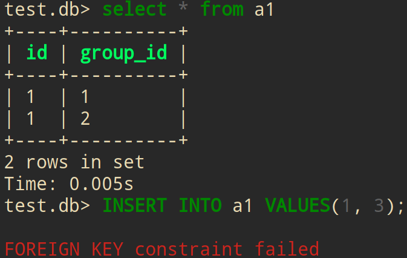
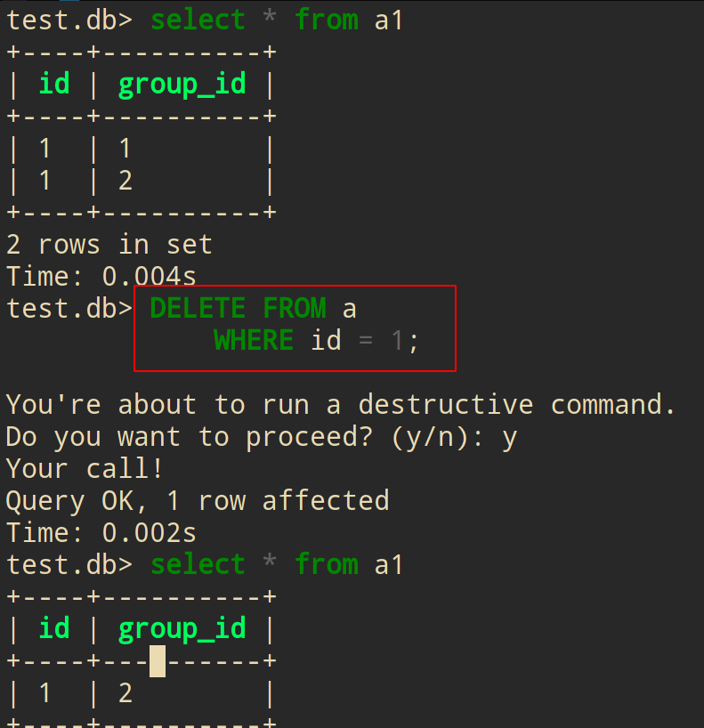
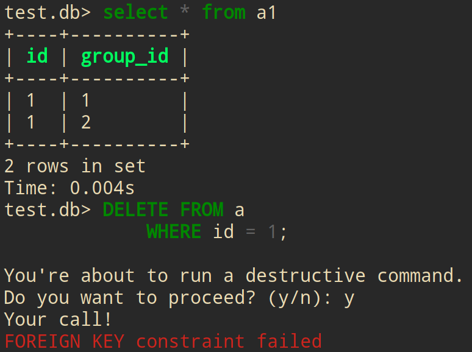
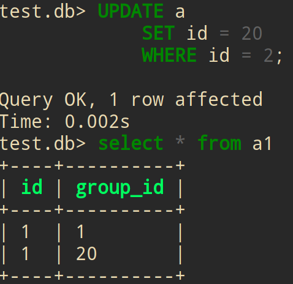

<!-- vim-markdown-toc GFM -->

* [sqlite](#sqlite)
    * [基本命令](#基本命令)
        * [重定向I/O](#重定向io)
    * [output forms(输出格式)](#output-forms输出格式)
    * [Dynamic type(动态类型)](#dynamic-type动态类型)
        * [datetime(日期和时间)](#datetime日期和时间)
    * [SELECT(查询)](#select查询)
        * [JOIN, UNION, EXCEPT, INTERSECT(集合)](#join-union-except-intersect集合)
    * [CREATE(创建)](#create创建)
        * [PRIMARY KEY (主键)](#primary-key-主键)
        * [FORIGN KEY (外键)](#forign-key-外键)
        * [FORIGN KEY 字段](#forign-key-字段)
    * [ALTER](#alter)
    * [增删改(行)](#增删改行)
        * [文件I/O](#文件io)
    * [Index(索引)](#index索引)
        * [基本使用](#基本使用)
        * [多列索引](#多列索引)
        * [Partial Indexes(部分索引)](#partial-indexes部分索引)
    * [Transaction(事务)](#transaction事务)
    * [trigger(触发器)](#trigger触发器)
        * [INSTEAD OF 让view(视图)可写入](#instead-of-让view视图可写入)
    * [VACUUM(整理碎片)](#vacuum整理碎片)
    * [Extensions(拓展)](#extensions拓展)
    * [python](#python)
* [优秀文章](#优秀文章)
* [第三方软件资源](#第三方软件资源)

<!-- vim-markdown-toc -->

# sqlite

## 基本命令

- 终端:

```sh
-- 创建并连接数据库文件test.db
sqlite3 test.db
```

- 数据库:

```sql
-- 查看帮助
.help

-- .open打开数据库
.open /tmp/database_name.db

-- 查看数据库
.databases

-- 查看所有表
.tables

-- 模糊匹配'z'结尾的表
.table '%z'

-- 查看所有表的schema(表结构)
.schema

-- 模糊匹配'z'结尾的schema(表结构)
.schema '%z'

-- 查询输出列字段(默认为off)
.headers on
```

### 重定向I/O

```sql
-- .output 将之后所有查询输出至文件
.output /tmp/test

-- .once 只是下一次查询输出至文件
.once /tmp/test

-- .once -x 使用编辑器打开下一次查询的结果(不能搭配.mode)
.once -x

-- .read 读取并执行文件里的sql查询语句
.read /tmp/read

-- .import 导入csv
.import /tmp/file.csv tabname

-- .export 导出csv
.headers on
.mode csv
.once /tmp/file.csv
SELECT * FROM tab;
.system /tmp/file.csv

-- 使用默认excel程序打开
.excel
SELECT * FROM tab;

-- 备份数据库. 将数据库的所有sql语句导出为dump文件, 并压缩
sqlite3 database.db .dump | gzip -c > database.dump.gz

-- 恢复数据库
zcat database.dump.gz | sqlite3 database.db

-- 整理碎片并备份
VACUUM main INTO '/tmp/backup.db';
```

- 在终端下执行查询数据库, 并输出文本

```sh
sqlite3 database.db 'select * from table'
sqlite3 database.db 'select * from table' | grep pattern
```

## output forms(输出格式)

```sql
-- 查看mode
.mode

-- 修改mode
.mode column

-- insert mode(输出insert语句)
.mode insert new_table

-- .width 修改每列之间的宽度
.width 2 -1

-- 修改separator(分隔符)
.separator ,
.separator ',  '
```

## Dynamic type(动态类型)

- 声明类型:列的类型.而不是指列property(字段)的类型

    - 列的字段可以存储任何类型

| type    | size            |
|---------|-----------------|
| INTEGER | 可选1 - 8 bytes |
| REAL    | 8 bytes         |
| TEXT    | 无限制          |
| BLOB    | 无限制          |
| NULL    | NULL            |

- 查询类型: `SELECT typeof()`

```sql
SELECT typeof(100),
       typeof(100.0),
       typeof('100'),
       typeof(x'0100'),
       typeof(NULL)
```

- 声明`INTEGER`类型, 但它可以存储任何类型:

    ```sql
    CREATE TABLE test_datatypes (
        id INTEGER PRIMARY KEY,
        value
    );

    INSERT INTO test_datatypes (value)
    VALUES
        (100),
        (100.0),
        ('100'),
        (x'0100'),
        (NULL);
    ```
    

### datetime(日期和时间)

```sql
-- 查询日期
SELECT date();

-- 查询当前时间
SELECT time();

-- 查询当前日期时间
SELECT datetime();
```

- `INT` 类型的日期时间:

    ```sql
    -- 创建int类型进行测试. 其它类型同理
    CREATE TABLE datetime_int (d1 int);

    -- 插入当前日期时间
    INSERT INTO datetime_int (d1)
    VALUES(datetime());

    -- 查询
    SELECT d1, typeof(d1)
    FROM datetime_int;
    ```

    

- `TEXT` 类型的日期时间:

    

- `REAL` 类型的日期时间:

    

## SELECT(查询)

- 创建表

```sql
CREATE TABLE test (id INT, name TEXT);
INSERT INTO test VALUES(5, 'tz5');
INSERT INTO test VALUES(1, 'tz1');
INSERT INTO test VALUES(10, 'tz10');
INSERT INTO test VALUES(10, 'tz10');

CREATE TABLE test1 (id INT, name TEXT);
INSERT INTO test1 VALUES(1, 'hello1');
INSERT INTO test1 VALUES(10, 'hello10');
```

```sql
-- 运算
SELECT 1 + 1
SELECT 1 + 1, 2 * 2

-- 查询全表
SELECT * FROM test

-- 查询指定字段
SELECT id FROM test
SELECT id, name FROM test

-- 合并为1列
SELECT id ||' '|| name FROM test

-- AS 别名
SELECT id ||' '|| name AS people FROM test

-- TYPEOF()查询类型
SELECT TYPEOF(id) FROM test;

-- COUNT() 统计总行数
SELECT COUNT(id) FROM test

-- SUM() 统计列值的总数
SELECT SUM(id) FROM test

-- AVG() 统计列值的平均数
SELECT AVG(id) FROM test;

-- LENGTH() 统计每个列值的字符数
SELECT LENGTH(id) FROM test;

-- LIMIT 只显示前2行
SELECT * FROM test LIMIT 2;
-- OFFSET 从第1行开始算, 显示后2行
SELECT * FROM test LIMIT 2 OFFSET 1;

-- WHERE 对列字段进行条件过滤
SELECT * FROM test WHERE id >= 5;

-- 是否为NULL
SELECT * FROM test WHERE id IS NOT NULL
SELECT * FROM test WHERE id IS NULL

-- BETWEEN 从1到5 两者相等
SELECT * FROM test WHERE id >= 1 AND id <=5;
SELECT * FROM test WHERE id BETWEEN 1 AND 5;
-- 错误
SELECT * FROM test WHERE id BETWEEN 5 AND 1;

-- IN 1和5
SELECT * FROM test WHERE id == 1 OR id ==5;
SELECT * FROM test WHERE id IN (1,5);

-- LIKE 过滤. %(通配符)
SELECT * FROM test WHERE name LIKE 't%'
SELECT * FROM test WHERE name LIKE '%1'
SELECT * FROM test WHERE name LIKE '%z%'

-- GLOB 正则表达式过滤
SELECT * FROM test WHERE name GLOB 't*'
SELECT * FROM test WHERE name GLOB '*[1-5]'

-- ORDER BY 排序
SELECT * FROM test ORDER BY id;
-- DESC 倒序
SELECT * FROM test ORDER BY id DESC;

-- DISTINCT 取消重复行
SELECT DISTINCT * FROM test;

-- GROUP BY 取消重复行并排序.两者相等
SELECT DISTINCT * FROM test ORDER BY name;
SELECT * FROM test GROUP BY name;

-- 取消重复行, 并统计重复行
SELECT id, name, COUNT(name) FROM test GROUP BY name;

-- HAVING 对GROUP BY的结果进行条件过滤
SELECT id, name, COUNT(name) FROM test GROUP BY name HAVING COUNT(name) > 1;

-- subselect(子查询)
SELECT id,
(
   SELECT name
   FROM test1
)
FROM test;

-- CASE 修改列值
SELECT id,
       CASE name
           WHEN 'tz1'
               THEN 'hello10'
           WHEN 'tz5'
               THEN 'hello5'
           ELSE 'c'
       END new_name
FROM
    test;
```

### JOIN, UNION, EXCEPT, INTERSECT(集合)

- sqlite不支持 `RIGHT JOIN`, `FULL JOIN`
```sql
-- INNER JOIN 交集
SELECT * FROM test INNER JOIN test1
ON test.id = test1.id;
-- or
SELECT * FROM test INNER JOIN test1
USING(id);

-- LEFT JOIN 左表加上交集
SELECT * FROM test LEFT JOIN test1
ON test.id = test1.id;

-- CROSS JOIN 合并表
SELECT * FROM test CROSS JOIN test1;

-- UNION ALL 全集
SELECT * FROM test
UNION ALL
SELECT * FROM test1;

-- UNION 取消重复行
SELECT * FROM test
UNION
SELECT * FROM test1;

-- EXCEPT 右补集
SELECT * FROM test
EXCEPT
SELECT * FROM test1;

-- INTERSECT 指定列的交集
SELECT id FROM test
INTERSECT
SELECT id FROM test1;
```

## CREATE(创建)

- 注意: 表名不能以 `sqlite_` 开头, 这是保留给内部使用

**语法:**

> ```sql
> CREATE TABLE [IF NOT EXISTS] [schema_name].table_name (
>     column_1 data_type PRIMARY KEY,
>     column_2 data_type NOT NULL,
>     column_3 data_type DEFAULT 0,
>     table_constraints
> ) [WITHOUT ROWID];
> ```

- `IF NOT EXISTS` 创建不存在的新表

- `schema_name`

    - 主数据库

    - 临时数据库

        - 创建不需要声明类型

        ```sql
        # 创建临时数据库
        CREATE TABLE temp.test
        (col, col1);

        # 插入数据
        INSERT INTO temp.test
        values (1, 2)

        SELECT * from temp.test
        ```

        

- `WITHOUT ROWID` 去除隐藏列ROWID. 适合非整型,非长字符, blob的主键的表.[官网介绍](https://www.sqlite.org/withoutrowid.html)

    - 隐藏列 `ROWID` 是真正的主键, 而`INTEGER PRIMARY KEY`只是别名

    - ROWID使用64位符号整数, 唯一的标识表中的行

    - ROWID是sqlite独有的,是早期的简化实现.在优秀的系统中不应该有ROWID, 但为了向后兼容不得已保留下来, 所以提供`WITHOUT ROWID`

    - 优点:

        - 提升速度, 减少磁盘空间

        - 只有1张B-tree, 存储1次, 只有1次二进制搜索

            - 默认声明PRIMARY KEY的表, 加上ROWID会有2张B-tree, index字段会存储2次. 搜索时先找index提取rowid后再找表, 因此有2次二进制搜索

    - 缺点:

        - `sqlite3_last_insert_rowid()` 函数无法使用

        - `incremental blob I/O ` 机制无法使用, 因此无法创建sqlite3_blob 对象

        - `sqlite3_update_hook() ` 表更改时不会调用此hook

    ```sql
    CREATE TABLE rowid_test(d1 INT);

    -- 插入rowid
    INSERT INTO rowid_test(rowid, d1) VALUES(123, 5);

    -- 查看rowid
    SELECT rowid, * FROM rowid_test
    ```

    ```sql
    -- 创建WITHOUT ROWID的表, 必须有一个主键, 并且最好是非整型, 不然可能还不如rowid表
    CREATE TABLE test (
        d1 REAL PRIMARY KEY
    )
    WITHOUT ROWID;
    ```

> ```sql
> CREATE TABLE test(
>    id INTEGER,
>    group_id INTEGER,
>    name TEXT CHECK (length(name) >= 10),
>    PRIMARY KEY (id),
>    FOREIGN KEY (id)
>       REFERENCES contacts (id)
>          ON DELETE CASCADE
>          ON UPDATE NO ACTION
> );
> ```

- `PRIMARY KEY (property, property1)`: 声明主键

- `FOREIGN KEY (property)`: 声明外键

- `CHECK (length(name) >= 3)` name 字段必须大于等于3个字符

- 列字段可以不指定数据类型

    ```sql
    create table test (a, b, c)
    ```

### PRIMARY KEY (主键)

- `ROWID` 是真正的主键, 而`INTEGER PRIMARY KEY`只是别名

- `INTEGER PRIMARY KEY`默认开启`AUTOINCREMENT`
    ```sql
    CREATE TABLE autoincre_test (
        id INTEGER PRIMARY KEY,
        d1 INTEGER
    );

    INSERT INTO autoincre_test (d1) VALUES(100);
    INSERT INTO autoincre_test (d1) VALUES(100);
    SELECT * FROM autoincre_test;

    # 查看rowid
    SELECT rowid, * FROM autoincre_test;
    ```

    - 由于AUTOINCREMENT 会改变 ROWID 算法, 所以不能在`INTEGER PRIMARY KEY`以外的字段使用
    ```sql
    -- 报错
    CREATE TABLE autoincre_test1 (
        id INTEGER PRIMARY KEY,
        d1 INTEGER AUTOINCREMENT
    );
    ```

- 多主键
    ```sql
    CREATE TABLE muti_pk (
        id,
        d1,
        PRIMARY KEY(id, d1)
    );
    ```

### FORIGN KEY (外键)

- 外键必须是主键

```sql
-- 查看是否开启外键. 1启动, 0关闭
PRAGMA foreign_keys;

-- 创建a表. 外键必须是主键

CREATE TABLE a (
    id INT PRIMARY KEY
);

-- 创建a1表, group_id列的外键为a表id列
CREATE TABLE a1 (
    id INT,
    group_id INT,
    FOREIGN KEY(group_id)
     REFERENCES a (id)
         ON DELETE CASCADE
         ON UPDATE NO ACTION
);

-- 外键值必须存在
INSERT INTO a VALUES(1);
INSERT INTO a VALUES(2);
INSERT INTO a1 VALUES(1, 1);
INSERT INTO a1 VALUES(1, 2);
```

- 报错: 外键值3不存在
    ```sql
    INSERT INTO a1 VALUES(1, 3);
    ```
    

### FORIGN KEY 字段

- `CASCADE`: 允许对父表外键对应值进行操作

- `NO ACTION`: 不允许对父表外键对应值进行操作

- `RESTRICT`: 类似于`NO ACTION`

- `ON DELETE CASCADE` 删除父表的值后, 子表对应的外键值也会删除
    ```sql
    DELETE FROM a
        WHERE id = 1;
    ```
    

- 报错: 如果`ON DELETE`没有指定任何字段
    


- `ON UPDATE CASCADE` 父表`UPDATE`对应的值, 子表也会修改
    ```sql
    UPDATE a
        SET id = 20
        WHERE id = 2;
    ```
    


- 报错: `ON UPDATE NO ACTION` 当子表的外键存在时, 父表不能`UPDATE`对应的值
    

## ALTER

> 修改表结构

```sql
CREATE TABLE create_test (id int);

-- RENAME TO 改名
ALTER TABLE create_test
    RENAME TO alter_test;

-- ADD COLUMN 添加列字段
ALTER TABLE alter_test
ADD COLUMN name TEXT;

-- RENAME COLUMN 列字段改名
ALTER TABLE alter_test
RENAME COLUMN name TO new_name;

-- 删除列
ALTER TABLE alter_test
DROP COLUMN new_name;
```

## 增删改(行)

```sql
-- 创建名为insert_test的表
CREATE TABLE insert_test
    (d1 int, t1 TEXT);

-- INSERT 插入2行数据
INSERT INTO insert_test
    VALUES(1, 'hello'),(2, 'tz');

-- REPLACE 插入
REPLACE INTO insert_test
    VALUES(3, 'hello')

-- 创建唯一索引后, REPLACE对索引列的插入, 变为修改值
CREATE UNIQUE INDEX idx_d1
ON insert_test(d1);

-- 修改值为 hello -> change_name
REPLACE INTO insert_test
    VALUES(3, 'change_name')
```

```sql
-- 修改d1列
UPDATE insert_test
    SET d1 = 10
    WHERE d1 = 1;
```

```sql
-- 删除第10行
DELETE FROM table
WHERE d1 = 2;

-- 删除表里的数据. 删除表: DROP TABLE table
DELETE FROM table
```

### 文件I/O

```sql
CREATE TABLE images(name TEXT, type TEXT, img BLOB);

INSERT INTO images(name,type,img)
    VALUES('websocket','png',readfile('~/websocket.png'));
```

- 导入多个文件

```sh
sqlite3 new_archive.db -Acv file1 file2 file3

-- 查看文件
.ar -- list

-- 查看表
select * from sqlar
```


- zip

```sql
-- 创建zip表
CREATE TABLE zip(
  name,     /* Name of the file */
  mode,     /* Unix-style file permissions */
  mtime,    /* Timestamp, seconds since 1970 */
  sz,       /* File size after decompression */
  rawdata,  /* Raw compressed file data */
  data,     /* Uncompressed file content */
  method    /* ZIP compression method code */
);

-- 插入zip文件
INSERT INTO zip(name,type,img)
    VALUES('icon','jpeg',readfile('icon.jpg'));
```

- zipfile 拓展

- [官方文档](https://www.sqlite.org/zipfile.html)

```sql
-- 读取zip文件的文本
SELECT * FROM zipfile('/tmp/test.zip');
-- or
SELECT * FROM zipfile( readfile('/tmp/test.zip') );

-- 通过Virtual Table Interface(虚拟表接口) 创建临时表
CREATE VIRTUAL TABLE temp.zip
    USING zipfile('/tmp/test.zip');

-- 写入文件
INSERT INTO temp.zip(name, data)
    VALUES('hello.txt', 'hello');

INSERT INTO temp.zip(name, mode, data)
    VALUES('tz.txt', 'lrwxrw-rw-', 'tz');

-- 删除文件
DELETE FROM temp.zip
    WHERE name = 'tz.txt';
```

## Index(索引)

- sqlite 使用`B-tree`数据结构保存索引数据

>```sql
> CREATE [UNIQUE] INDEX index_name
> ON table_name(column_list);
>```

- 查询条件必须与索引条件相同, 才能使用索引

### 基本使用

```sql
--  查看索引
.indexes

--  创建表
CREATE TABLE idx_test(x, y);

-- 创建x列的索引
CREATE INDEX idx_x ON idx_test(x);

-- 创建y列的唯一索引
CREATE UNIQUE INDEX idx_u_y ON idx_test(y);

-- 创建x+y的索引
CREATE INDEX idx_x+y ON idx_test(x+y);

-- 创建LENGHT(x)的索引
CREATE INDEX idx_length_x ON idx_test(LENGTH(x));

-- 创建x, y多列的索引
CREATE INDEX idx_xy ON idx_test(x, y);

-- 列出表的索引
PRAGMA index_list('idx_test')

-- 查看索引
PRAGMA index_info('idx');

-- 重建索引
REINDEX idx

-- 删除索引
DROP INDEX idx
-- or
DROP INDEX IF EXISTS idx
```

- `EXPLAIN QUERY PLAN`: 判断查询是否使用索引

```sql
CREATE TABLE t2(x,y);

-- 创建索引x+y
CREATE INDEX t2xy ON t2(x+y);

-- 因为查询是y+x, 并没有使用索引
EXPLAIN QUERY PLAN
SELECT * FROM t2 WHERE y+x=22;

-- 这次查询是x+y, 使用索引. 两者数学上等价, 但sqlite查询器并不等价
EXPLAIN QUERY PLAN
SELECT * FROM t2 WHERE x+y=22;
```


- `CREATE UNIQUE INDEX`创建唯一索引
    - 值必须唯一, 不然会报错
    - 允许插入多个NULL值

```sql
CREATE TABLE idx_unique (
    name TEXT
);

-- 创建索引name
CREATE UNIQUE INDEX idx_name ON idx_unique(name)

-- 允许插入多个NULL值
INSERT INTO idx_unique VALUES(NULL);
INSERT INTO idx_unique VALUES(NULL);

-- 插入数据name
INSERT INTO idx_unique VALUES('tz');

-- 报错 插入相同数据name
INSERT INTO idx_unique VALUES('tz');
```


### 多列索引

- 创建多列索引时, 列的顺序非常重要(先按第一列, 然后到第二列以此类推)

    - 查询条件必须与索引条件**顺序相同**, 才能使用索引

```sql
CREATE TABLE idx_mul (
    first_name text NOT NULL,
    last_name text NOT NULL
);

-- 建立第一列为first_name,第二列为last_name的索引
CREATE INDEX idx
ON idx_mul (first_name, last_name);

-- 使用索引
EXPLAIN QUERY PLAN
SELECT * FROM idx_mul WHERE first_name='tz';

-- 因为索引第一列为first_name, 因此不使用索引
EXPLAIN QUERY PLAN
SELECT * FROM idx_mul WHERE last_name='tz';

-- and语句 使用索引
EXPLAIN QUERY PLAN
SELECT * FROM idx_mul WHERE last_name='tz' and first_name='hello';

-- or语句 不使用索引
EXPLAIN QUERY PLAN
SELECT * FROM idx_mul WHERE last_name='tz' or first_name='hello';

EXPLAIN QUERY PLAN
SELECT * FROM idx_mul WHERE first_name='tz' or last_name='hello';
```

### Partial Indexes(部分索引)

```sql
CREATE TABLE idx_part(
    x int,
    y int
);

-- 使用where从句, 创建部分索引
CREATE INDEX ex1 ON idx_part(x,y)
WHERE x=5 OR y=6;

-- 使用索引
EXPLAIN QUERY PLAN
SELECT * FROM idx_part
WHERE x = 5 OR y = 6

-- 使用索引
EXPLAIN QUERY PLAN
SELECT * FROM idx_part
WHERE x = 5 OR y = 1

-- 不使用索引
EXPLAIN QUERY PLAN
SELECT * FROM idx_part
WHERE x = 1 OR y = 6

-- AND语句 使用索引
EXPLAIN QUERY PLAN
SELECT * FROM idx_part
WHERE x = 5 AND y = 6

-- AND语句 使用索引
EXPLAIN QUERY PLAN
SELECT * FROM idx_part
WHERE x = 5 AND y = 1

-- AND语句 使用索引
EXPLAIN QUERY PLAN
SELECT * FROM idx_part
WHERE x = 1 AND y = 6
```

## Transaction(事务)

```sql
-- 开启事物
BEGIN TRACSCATION;

-- 回滚
ROLLBACK;

-- 提交
COMMIT;
```

## trigger(触发器)

- 如果表改名了, trigger也需要手动修改

- 如果表被删除了trigger也会删除, 如果此表关联其它表, 则不会删除

| 支持trigger的操作 | 支持旧,新数据的情况 |
|-------------------|---------------------|
| INSERT            | NEW                 |
| UPDATE            | NEW, OLD            |
| DELETE            | OLD                 |

```sql
CREATE TABLE trigger_test (
    name TEXT,
    email TEXT
);

-- 创建判断是否为email格式的触发器
CREATE TRIGGER tr_email
   BEFORE INSERT ON trigger_test
BEGIN
   SELECT
      CASE
    WHEN NEW.email NOT LIKE '%_@__%.__%' THEN
      RAISE (ABORT,'Invalid email address')
       END;
END;

-- 插入数据
INSERT INTO trigger_test
    VALUES('tz', '1124486160@qq.com')

-- 触发触发器
INSERT INTO trigger_test
    VALUES('test', '123')

-- 删除触发器
DROP TRIGGER tr_email
```

```sql
-- UPDATE之前备份原数据
CREATE TRIGGER tr_backup
   BEFORE UPDATE ON trigger_test
BEGIN
    INSERT INTO backup_table
        VALUES(old.name, old.email);
END;

-- 创建备份表
CREATE TABLE backup_table (
    name TEXT,
    email TEXT
);

-- 触发
UPDATE trigger_test
    SET name = 'hello'
    WHERE name = 'tz';
```

### INSTEAD OF 让view(视图)可写入

- `INSTEAD OF` 触发只能在view上使用

```sql
-- 创建view
CREATE VIEW v_tr(
    id,
    name
) AS
SELECT
    *
FROM
    trigger_test

-- 插入view, 则插入表
CREATE TRIGGER tr_insert
    INSTEAD OF INSERT ON v_tr
BEGIN
    INSERT INTO trigger_test
    VALUES(NEW.id, NEW.name);
END;

-- 测试
INSERT INTO v_tr
    VALUES('hello', '123@gmail.com')
```

## VACUUM(整理碎片)

> 整理碎片, 删除未标记的数据库

- `DROP TABLE`, `DROP VIEW`,`DROP INDEX` 等操作: 数据库文件大小并不会改变, 只是删除了标记

- `INSERT`, `DELETE` 等操作: 会增加碎片

```sql
-- 整理碎片, 删除未标记的数据库. 注意:如果有事务开启, 可能报错
VACUUM;

-- 自动VACUUM
PRAGMA auto_vacuum = FULL;

-- 增量VACUUM
PRAGMA auto_vacuum = INCREMENTAL;

-- 关闭
PRAGMA auto_vacuum = NONE;

-- 整理碎片并备份
VACUUM main INTO '/tmp/backup.db';
```

## Extensions(拓展)

```sh
-- 加载拓展
.load /path

-- zipfile下载连接
https://sqlite.org/src/file/ext/misc/zipfile.c

-- 编译
gcc -g -fPIC -shared zipfile.c -o zipfile.so
```

## python

- [官方文档](https://docs.python.org/3/library/sqlite3.html)

```py
import sqlite3

-- 连接文件
con = sqlite3.connect('test.db')

-- 获取cursor后, 便能使用execute()执行sql命令
cur = con.cursor()

-- 创建表
cur.execute('''CREATE TABLE python_test
        (name TEXT, type TEXT, img BLOB)''')

-- IF NOT EXISTS
cur.execute('''CREATE TABLE IF NOT EXISTS python_test
        (name TEXT, type TEXT, img BLOB)''')

-- 插入文件数据
cur.execute('''INSERT INTO python_test VALUES
        ('image','png','image.png')''')

-- 返回的对象是元组
istuple = cur.execute('SELECT * FROM python_test')

-- 将数据写入新文件.SELECT writefile需要安装插件
cur.execute("SELECT writefile('new_image.png',img) FROM python_test WHERE name='image'")

-- commit()后, 之前的insert才会生效
con.commit()
con.close()
```

# 优秀文章

- [官方文档](https://www.sqlite.org/doclist.html)

- [sql函数](https://www.sqlite.org/lang_corefunc.html)

- [sql tutorial](https://www.sqlitetutorial.net/)

# 第三方软件资源

- [litecli](https://github.com/dbcli/litecli)

    > 更友好的补全和语法高亮的终端(cli)

    > 注意:如果使用外部程序修改数据,需要重启litecli, 才会正确显示

- [sqlitebrowser](https://github.com/sqlitebrowser/sqlitebrowser)

    > 图形客户端
