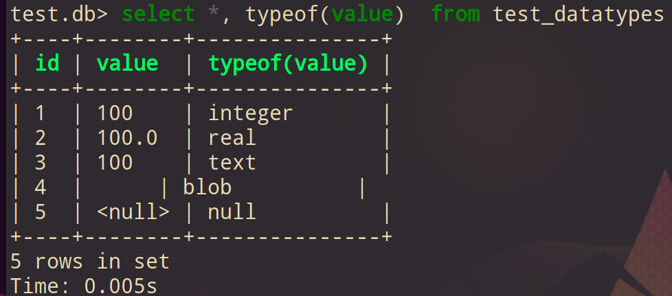
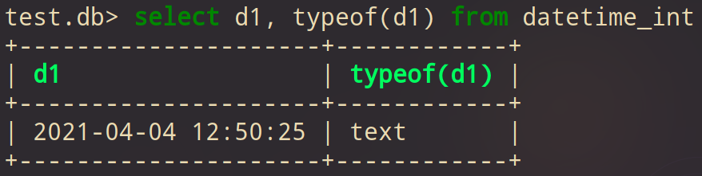
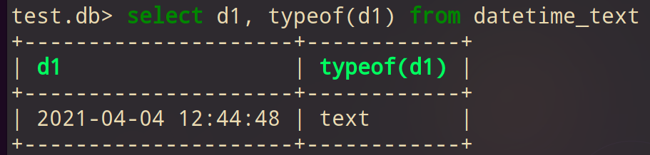
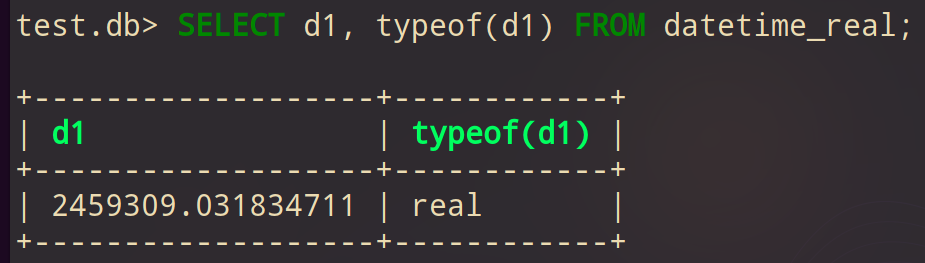
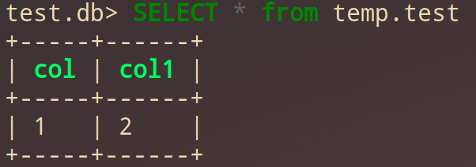
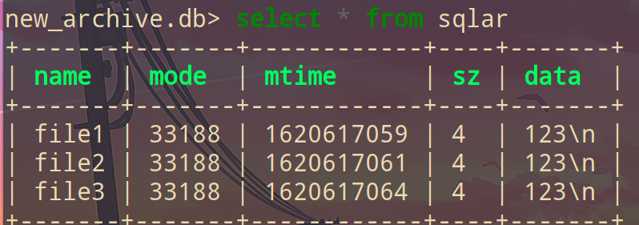
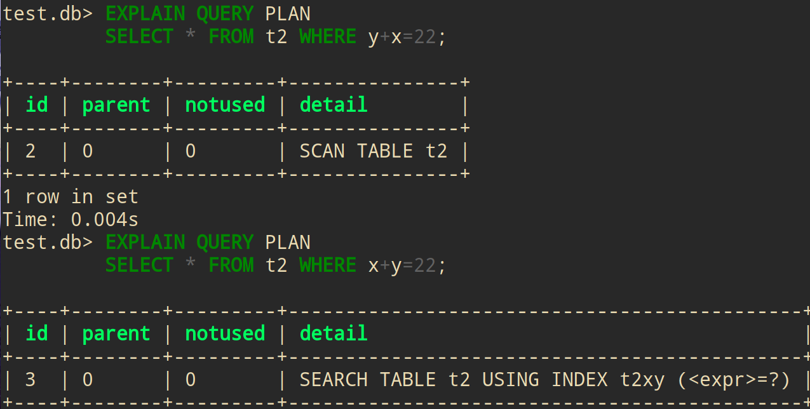
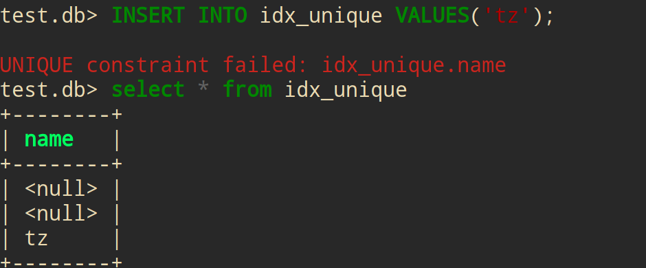

<!-- vim-markdown-toc GFM -->

* [sqlite](#sqlite)
    * [基本命令](#基本命令)
        * [重定向I/O](#重定向io)
    * [output forms(输出格式)](#output-forms输出格式)
    * [Dynamic type(动态类型)](#dynamic-type动态类型)
        * [datetime(日期和时间)](#datetime日期和时间)
    * [SELECT(查询)](#select查询)
    * [CREATE(创建)](#create创建)
    * [SELECT(查询)](#select查询-1)
    * [增删改(行)](#增删改行)
        * [文件I/O](#文件io)
    * [Index(索引)](#index索引)
        * [基本使用](#基本使用)
        * [多列索引](#多列索引)
        * [Partial Indexes(部分索引)](#partial-indexes部分索引)
    * [Extensions(拓展)](#extensions拓展)
    * [python](#python)
* [优秀文章](#优秀文章)
* [第三方软件资源](#第三方软件资源)

<!-- vim-markdown-toc -->

# sqlite

## 基本命令

- 终端:

```sh
# 创建并连接数据库文件test.db
sqlite3 test.db
```

- 数据库:

```sql
# 查看帮助
.help

# 查看数据库
.databases

# 查看所有表
.tables

# 模糊匹配'z'结尾的表
.table '%z'

# 查看所有表的schema(表结构)
.schema

# 模糊匹配'z'结尾的schema(表结构)
.schema '%z'

# 查询输出列字段(默认为off)
.headers on
```

### 重定向I/O

```sql
# .output 将之后所有查询输出至文件
.output /tmp/test

# .once 只是下一次查询输出至文件
.once /tmp/test

# .once -x 使用编辑器打开下一次查询的结果(不能搭配.mode)
.once -x

# .read 读取并执行文件里的sql查询语句
.read /tmp/read

# .import 导入csv
.import /tmp/file.csv tabname

# .export 导出csv
.headers on
.mode csv
.once /tmp/file.csv
SELECT * FROM tab;
.system /tmp/file.csv

# 使用默认excel程序打开
.excel
SELECT * FROM tab;

# 备份数据库. 将数据库的所有sql语句导出为dump文件, 并压缩
sqlite3 database.db .dump | gzip -c > database.dump.gz

# 恢复数据库
zcat database.dump.gz | sqlite3 database.db
```

- 在终端下执行查询数据库, 并输出文本

```sh
sqlite3 database.db 'select * from table'
sqlite3 database.db 'select * from table' | grep pattern
```

## output forms(输出格式)

```sql
# 查看mode
.mode

# 修改mode
.mode column

# insert mode(输出insert语句)
.mode insert new_table

# .width 修改每列之间的宽度
.width 2 -1

# 修改separator(分隔符)
.separator ,
.separator ',  '
```

## Dynamic type(动态类型)

- 声明类型:列的类型.而不是指列property(字段)的类型

    - 列的字段可以存储任何类型

| type    | size            |
|---------|-----------------|
| INTEGER | 可选1 - 8 bytes |
| REAL    | 8 bytes         |
| TEXT    | 无限制          |
| BLOB    | 无限制          |
| NULL    | NULL            |

- 查询类型: `SELECT typeof()`

```sql
SELECT typeof(100),
       typeof(100.0),
       typeof('100'),
       typeof(x'0100'),
       typeof(NULL)
```

- 声明`INTEGER`类型, 但它可以存储任何类型:

    ```sql
    CREATE TABLE test_datatypes (
        id INTEGER PRIMARY KEY,
        value
    );

    INSERT INTO test_datatypes (value)
    VALUES
        (100),
        (100.0),
        ('100'),
        (x'0100'),
        (NULL);
    ```

    


### datetime(日期和时间)

```sql
# 查询日期
SELECT date();

# 查询当前时间
SELECT time();

# 查询当前日期时间
SELECT datetime();
```

- `INT` 类型的日期时间:

    ```sql
    # 创建int类型进行测试. 其它类型同理
    CREATE TABLE datetime_int (d1 int);

    # 插入当前日期时间
    INSERT INTO datetime_int (d1)
    VALUES(datetime());

    # 查询
    SELECT d1, typeof(d1)
    FROM datetime_int;
    ```

    

- `TEXT` 类型的日期时间:

    

- `REAL` 类型的日期时间:

    

## SELECT(查询)

## CREATE(创建)

- 注意: 表名不能以 `sqlite_` 开头, 这是保留给内部使用

**语法:**

> ```sql
> CREATE TABLE [IF NOT EXISTS] [schema_name].table_name (
>     column_1 data_type PRIMARY KEY,
>     column_2 data_type NOT NULL,
>     column_3 data_type DEFAULT 0,
>     table_constraints
> ) [WITHOUT ROWID];
> ```

- `IF NOT EXISTS` 创建不存在的新表

- `schema_name`

    - 主数据库

    - 临时数据库

        - 创建不需要声明类型

        ```sql
        # 创建临时数据库
        CREATE TABLE temp.test
        (col, col1);

        # 插入数据
        INSERT INTO temp.test
        values (1, 2)

        SELECT * from temp.test
        ```

        

- `WITHOUT ROWID` 去除隐藏列ROWID. 适合非整型,非长字符, blob的主键的表.[官网介绍](https://www.sqlite.org/withoutrowid.html)

    - 隐藏列 `ROWID` 是真正的主键, 而`PRIMARY KEY`只是ROWID的别名

    - ROWID使用64位符号整数, 唯一的标识表中的行

    - ROWID是sqlite独有的,是早期的简化实现.在优秀的系统中不应该有ROWID, 但为了向后兼容不得已保留下来, 所以提供`WITHOUT ROWID`

    - 优点:

        - 提升速度, 减少磁盘空间

        - 只有1张B-tree, 存储1次, 只有1次二进制搜索

            - 默认声明PRIMARY KEY的表, 加上ROWID会有2张B-tree, index字段会存储2次. 搜索时先找index提取rowid后再找表, 因此有2次二进制搜索

    - 缺点:
        - `AUTOINCREMENT` 选项无法使用

        - `sqlite3_last_insert_rowid()` 函数无法使用

        - `incremental blob I/O ` 机制无法使用, 因此无法创建sqlite3_blob 对象

        - `sqlite3_update_hook() ` 表更改时不会调用此hook

    ```sql
    CREATE TABLE rowid_test(d1 INT);

    # 插入rowid
    INSERT INTO rowid_test(rowid, d1) VALUES(123, 5);

    # 查看rowid
    SELECT rowid, * FROM rowid_test
    ```

    ```sql
    # 创建WITHOUT ROWID的表, 必须有一个主键, 并且最好是非整型, 不然可能还不如rowid表
    CREATE TABLE test
    (d1 REAL PRIMARY KEY)
    WITHOUT ROWID;
    ```

> ```sql
> CREATE TABLE test(
>    id INTEGER,
>    group_id INTEGER,
>    PRIMARY KEY (id),
>    FOREIGN KEY (id)
>       REFERENCES contacts (id)
>          ON DELETE CASCADE
>          ON UPDATE NO ACTION,
> );
> ```

- `PRIMARY KEY (property, property1)`: 声明主键

- `FOREIGN KEY (property)`: 声明外键

- `ON DELETE CASCADE`:

- `ON UPDATE NO ACTION`:

- AUTOINCREMENT

    - 由于AUTOINCREMENT 会改变 ROWID 算法, 所以不能在INTEGER PRIMARY KEY以外的字段使用

    ```sql
    CREATE TABLE autoincre_test
    (id INTEGER PRIMARY KEY AUTOINCREMENT, d1 int);

    INSERT INTO autoincre_test (d1) VALUES(100);
    SELECT * FROM autoincre_test;
    ```

- 列字段的数据类型是可选的

    ```sql
    create table test (a, b, c)
    ```

## SELECT(查询)

```sql
# 查询id字段
SELECT id
FROM test_datatypes;

# * 查询所有
SELECT *
FROM test_datatypes;

# typeof()查询类型
SELECT *, typeof(value)
FROM test_datatypes;
```

## 增删改(行)

```sql
# 创建名为insert_test的表
CREATE TABLE insert_test
    (d1 int, t1 TEXT);

# 插入2行数据
INSERT INTO insert_test
    VALUES(1, 'hello'),(2, 'tz');
```


```sql
# 修改d1列
UPDATE insert_test
    SET d1 = 10
    WHERE d1 = 1;
```

```sql
# 删除第10行
DELETE FROM table
WHERE d1 = 2;

# 删除表里的数据. 删除表: DROP TABLE table
DELETE FROM table
```

### 文件I/O

```sql
CREATE TABLE images(name TEXT, type TEXT, img BLOB);

INSERT INTO images(name,type,img)
    VALUES('websocket','png',readfile('~/websocket.png'));
```

- 导入多个文件

```sh
sqlite3 new_archive.db -Acv file1 file2 file3

# 查看文件
.ar --list

# 查看表
select * from sqlar
```



- zip

```sql
# 创建zip表
CREATE TABLE zip(
  name,     /* Name of the file */
  mode,     /* Unix-style file permissions */
  mtime,    /* Timestamp, seconds since 1970 */
  sz,       /* File size after decompression */
  rawdata,  /* Raw compressed file data */
  data,     /* Uncompressed file content */
  method    /* ZIP compression method code */
);

# 插入zip文件
INSERT INTO zip(name,type,img)
    VALUES('icon','jpeg',readfile('icon.jpg'));
```

- zipfile 拓展

- [官方文档](https://www.sqlite.org/zipfile.html)

```sql
# 读取zip文件的文本
SELECT * FROM zipfile('/tmp/test.zip');
# or
SELECT * FROM zipfile( readfile('/tmp/test.zip') );

# 通过Virtual Table Interface(虚拟表接口) 创建临时表
CREATE VIRTUAL TABLE temp.zip
    USING zipfile('/tmp/test.zip');

# 写入文件
INSERT INTO temp.zip(name, data)
    VALUES('hello.txt', 'hello');

INSERT INTO temp.zip(name, mode, data)
    VALUES('tz.txt', 'lrwxrw-rw-', 'tz');

# 删除文件
DELETE FROM temp.zip
    WHERE name = 'tz.txt';
```

## Index(索引)

- sqlite 使用`B-tree`数据结构保存索引数据

>```sql
> CREATE [UNIQUE] INDEX index_name
> ON table_name(column_list);
>```

- 查询条件必须与索引条件相同, 才能使用索引

### 基本使用

```sql
CREATE TABLE idx_test(x, y);

# 创建x列的索引
CREATE INDEX idx_x ON idx_test(x);

# 创建y列的唯一索引
CREATE UNIQUE INDEX idx_u_y ON idx_test(y);

# 创建x+y的索引
CREATE INDEX idx_x+y ON idx_test(x+y);

# 创建LENGHT(x)的索引
CREATE INDEX idx_length_x ON idx_test(LENGTH(x));

# 创建x, y多列的索引
CREATE INDEX idx_xy ON idx_test(x, y);

# 列出表的索引
PRAGMA index_list('idx_test')

# 查看索引
PRAGMA index_info('idx');

# 重建索引
REINDEX idx

# 删除索引
DROP INDEX idx
# or
DROP INDEX IF EXISTS idx
```

- `EXPLAIN QUERY PLAN`: 判断查询是否使用索引

```sql
CREATE TABLE t2(x,y);

# 创建索引x+y
CREATE INDEX t2xy ON t2(x+y);

# 因为查询是y+x, 并没有使用索引
EXPLAIN QUERY PLAN
SELECT * FROM t2 WHERE y+x=22;

# 这次查询是x+y, 使用索引. 两者数学上等价, 但sqlite查询器并不等价
EXPLAIN QUERY PLAN
SELECT * FROM t2 WHERE x+y=22;
```



- `CREATE UNIQUE INDEX`创建唯一索引
    - 值必须唯一, 不然会报错
    - 允许插入多个NULL值

```sql
CREATE TABLE idx_unique (
	name TEXT
);

# 创建索引name
CREATE UNIQUE INDEX idx_name ON idx_unique(name)

# 允许插入多个NULL值
INSERT INTO idx_unique VALUES(NULL);
INSERT INTO idx_unique VALUES(NULL);

# 插入数据name
INSERT INTO idx_unique VALUES('tz');

# 报错 插入相同数据name
INSERT INTO idx_unique VALUES('tz');
```



### 多列索引

- 创建多列索引时, 列的顺序非常重要(先按第一列, 然后到第二列以此类推)

    - 查询条件必须与索引条件**顺序相同**, 才能使用索引

```sql
CREATE TABLE idx_mul (
	first_name text NOT NULL,
	last_name text NOT NULL
);

# 建立第一列为first_name,第二列为last_name的索引
CREATE INDEX idx
ON idx_mul (first_name, last_name);

# 使用索引
EXPLAIN QUERY PLAN
SELECT * FROM idx_mul WHERE first_name='tz';

# 因为索引第一列为first_name, 因此不使用索引
EXPLAIN QUERY PLAN
SELECT * FROM idx_mul WHERE last_name='tz';

# and语句 使用索引
EXPLAIN QUERY PLAN
SELECT * FROM idx_mul WHERE last_name='tz' and first_name='hello';

# or语句 不使用索引
EXPLAIN QUERY PLAN
SELECT * FROM idx_mul WHERE last_name='tz' or first_name='hello';

EXPLAIN QUERY PLAN
SELECT * FROM idx_mul WHERE first_name='tz' or last_name='hello';
```

### Partial Indexes(部分索引)

```sql
CREATE TABLE idx_part(
    x int,
    y int
);

# 使用where从句, 创建部分索引
CREATE INDEX ex1 ON idx_part(x,y)
WHERE x=5 OR y=6;

# 使用索引
EXPLAIN QUERY PLAN
SELECT * FROM idx_part
WHERE x = 5 OR y = 6

# 使用索引
EXPLAIN QUERY PLAN
SELECT * FROM idx_part
WHERE x = 5 OR y = 1

# 不使用索引
EXPLAIN QUERY PLAN
SELECT * FROM idx_part
WHERE x = 1 OR y = 6

# AND语句 使用索引
EXPLAIN QUERY PLAN
SELECT * FROM idx_part
WHERE x = 5 AND y = 6

# AND语句 使用索引
EXPLAIN QUERY PLAN
SELECT * FROM idx_part
WHERE x = 5 AND y = 1

# AND语句 使用索引
EXPLAIN QUERY PLAN
SELECT * FROM idx_part
WHERE x = 1 AND y = 6
```

## Extensions(拓展)

```sh
# 加载拓展
.load /path

# zipfile下载连接
https://sqlite.org/src/file/ext/misc/zipfile.c

# 编译
gcc -g -fPIC -shared zipfile.c -o zipfile.so
```

## python

- [官方文档](https://docs.python.org/3/library/sqlite3.html)

```py
import sqlite3

# 连接文件
con = sqlite3.connect('test.db')

# 获取cursor后, 便能使用execute()执行sql命令
cur = con.cursor()

# 创建表
cur.execute('''CREATE TABLE python_test
        (name TEXT, type TEXT, img BLOB)''')

# IF NOT EXISTS
cur.execute('''CREATE TABLE IF NOT EXISTS python_test
        (name TEXT, type TEXT, img BLOB)''')

# 插入文件数据
cur.execute('''INSERT INTO python_test VALUES
        ('image','png','image.png')''')

# 返回的对象是元组
istuple = cur.execute('SELECT * FROM python_test')

# 将数据写入新文件.SELECT writefile需要安装插件
cur.execute("SELECT writefile('new_image.png',img) FROM python_test WHERE name='image'")

# commit()后, 之前的insert才会生效
con.commit()
con.close()
```

# 优秀文章

- [官方文档](https://www.sqlite.org/docs.html)

- [sql函数](https://www.sqlite.org/lang_corefunc.html)

- [sqltutorial](https://www.sqlitetutorial.net/)

# 第三方软件资源

- [litecli](https://github.com/dbcli/litecli)

    > 更友好的补全和语法高亮的终端(cli)

    > 注意:如果使用外部程序修改数据,需要重启litecli, 才会正确显示

- [sqlitebrowser](https://github.com/sqlitebrowser/sqlitebrowser)

    > 图形客户端
