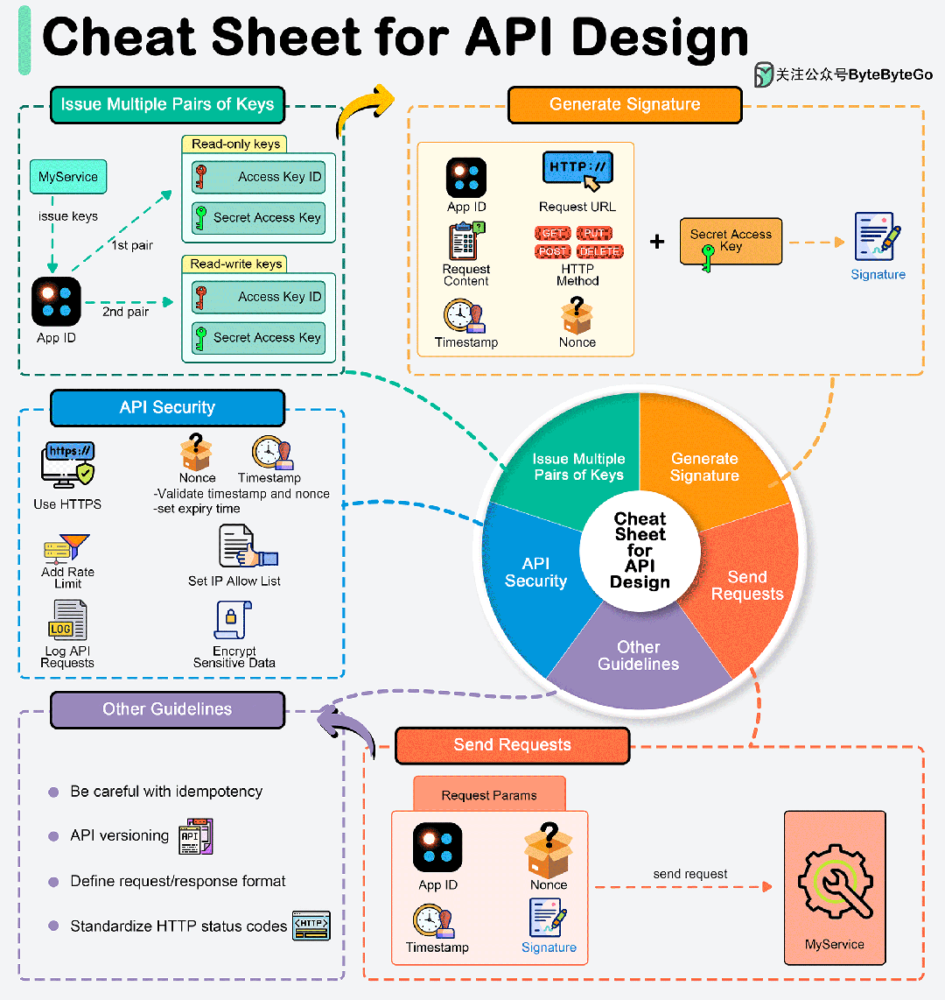

<!-- vim-markdown-toc GFM -->

* [browsers](#browsers)
    * [chrome插件](#chrome插件)
* [CGI和FastCGI](#cgi和fastcgi)
    * [CGI](#cgi)
    * [FastCGI](#fastcgi)
* [REST API](#rest-api)
* [WebAssembly](#webassembly)
* [数据库](#数据库)
* [HTML](#html)
* [CSS](#css)
* [js](#js)

<!-- vim-markdown-toc -->

# browsers

- [chrome浏览器F12官方文档](https://developer.chrome.com/docs/devtools/network/reference/?utm_source=devtools#timing-explanation)

- 《Inside look at modern web browser》

    - [Inside look at modern web browser (part 1)](https://developer.chrome.com/blog/inside-browser-part1/)
    - [Inside look at modern web browser (part 2)](https://developer.chrome.com/blog/inside-browser-part2/)
    - [Inside look at modern web browser (part 3)](https://developer.chrome.com/blog/inside-browser-part3/)
    - [Inside look at modern web browser (part 4)](https://developer.chrome.com/blog/inside-browser-part4/)

    - [Inside look at modern web browser (part 1)中文翻译](https://zhuanlan.zhihu.com/p/99394757)

    - [Inside look at modern web browser (part 2 3 4)的中文翻译](https://lisongfeng.cn/2019/06/05/understanding-modern-browsers.html)

    - [腾讯技术工程：深入理解浏览器原理](https://cloud.tencent.com/developer/article/1489018)

        > 从第二部分开始，对Inside look at modern web browser，进行翻译、理解、总结提炼、条理化、加入应用示例、进行相关知识补充扩展而来。

        

    [腾讯云开发者：揭秘字节码到像素的一生！Chromium 渲染流水线](https://cloud.tencent.com/developer/article/2187276)

    - [objtube的卢克儿视频：【干货】浏览器是如何运作的？](https://www.bilibili.com/video/BV1x54y1B7RE)

        > 主要基于Inside look at modern web browser讲解，还有其他技术文档

- [How browsers work](https://web.dev/howbrowserswork/)

- [Chromium Design Docs](https://chromium.googlesource.com/chromium/src/+/main/docs/design/README.md)

- [rail用户性能模型](https://web.dev/rail/)

- [67 Weird Debugging Tricks Your Browser Doesn't Want You to Know（67 种浏览器中调试技巧）](https://alan.norbauer.com/articles/browser-debugging-tricks)

## chrome插件

- [Bypass Paywalls：](https://github.com/iamadamdev/bypass-paywalls-chrome)帮助用户绕过一些新闻网站和其他网站的付费墙，让用户可以免费阅读这些网站的文章和内容。
    - 实现原理：因为付费网站的付费内容为了搜索流量就给谷歌爬虫开白名单，允许抓取付费内容。这样，谷歌就有了付费文章缓存，然后插件把网站链接的内容替换为谷歌的缓存内容，以此绕过付费。
    - 目前 Chrome 商店和 Firefox 商店都已经将 Bypass Paywalls 下架，所以只能离线安装。

- [best-cookier](https://github.com/Dolov/chrome-best-cookier)：管理cookier

- [code-box：CSDN/知乎/脚本之家/博客园/博客园/51CTO博客/php中文网等网站,实现无需登录一键复制代码](https://github.com/027xiguapi/code-box)

# CGI和FastCGI

- Web服务器能解析HTTP请求，返回静态资源（HTML页、图片等），但要输出动态内容，必须得PHP/C#/Ruby/Java/Python/C/C++这些外部程序来实现。

## CGI

- 早期有个技术叫CGI（Common Gateway Interface，通用网关接口），是用于Web服务器和外部程序之间传输数据的一种标准。

- 一个简单的CGI程序（C++语言）如下：

    ```cpp
    #include <stdio.h>
    #include <stdlib.h>
    int main()
    {
        printf("Content-type: text/html\r\n\r\n");
        printf("your name is:%s\n",  getenv("QUERY_STRING"));
        return 0;
    }
    ```

    - 浏览器访问这个CGI程序，就会显示：`your name is:name=xxx`

- CGI规定了Web服务器如何和CGI程序之间传输数据，具体过程大体是这样：

    - 1.Web服务器收到的请求信息后，启动CGI程序（apache是fork进程exec CGI程序）；
    - 2.Web服务器通过环境变量和标准输入把请求信息传递给CGI程序；
    - 3.CGI程序执行业务逻辑后，通过标准输出和标准错误把响应数据返回给Web服务器，CGI程序exit；
    - 4.Web服务器再组织成HTTP响应包发给浏览器。

    - 在上面的例子中，第一行printf是输出HTTP头（还记得HTTP Header和Body是用\r\n\r\n分割的么？），`getenv("QUERY_STRING")`是从环境变量获取URL，printf是通过标准输出返回内容。

- Web服务器会把哪些信息通过环境变量传递给CGI程序？常用的有这些：

    - 1.CONTENT_LENGTH ：向标准输入发送的数据的字节数(POST)
    - 2.QUERY_STRING：实际存放发送给CGI程序的数据(GET)
    - 3.REQUEST_METHOD：传送数据所用的CGI方法(GET或POST)
    - 4.HTTP_COOKIE：cookie值
    - 5.REMOTE_ADDR：用户IP
    - 6.SCRIPT_NAME：请求的CGI

- 可以看到CGI只是一种标准，可以用任何一种语言编写CGI程序，只要这种语言具有标准输入、标准输出和环境变量，比如：C/C++，perl，PHP、ruby。按照CGI标准要求，就能和Web服务器交互起来。

## FastCGI

- CGI是通过环境变量/标准输入、标准输出/标准错误来传输数据，运行性能比较低，主要有两点：

    - 1.每个请求都需要Web服务器去fork出CGI程序，频繁fork进程比较耗时
    - 2.CGI程序每次都是从头运行，读配置、连接其他服务都得重新来，也比较耗时

- FastCGI是对CGI的改进，FastCGI模式下，Web服务器和FastCGI程序传输数据的过程大体是：

    - 1.Web服务器收到的请求信息后，按FastCGI协议把请求信息通过socket发给FastCGI程序；
    - 2.FastCGI程序执行业务逻辑后，通过socket把响应数据返回给Web服务器，FastCGI程序不exit；
    - 3.Web服务器再组织成HTTP响应包发给浏览器。

    

    - 对比CGI的通过，可以发现主要是少了每次fork的过程，并且用socket来传输数据，这是FastCGI接口更高效的原因。

- FastCGI有这些特点：

    - 1.FastCGI程序常驻内存，启动后可以反复处理请求
    - 2.FastCGI 就是进程池/线程池模型的通用同步服务器框架

    - FastCGI程序处理请求后不会退出，可以反复处理请求，那么在启动后就把配置解析、与其他后台的连接建立好，不用每次请求时搞一边，自然更快了。

- 至于这个FastCGI内部如何实现进城池/线程池，就是FastCGI进程管理器（FastCGI引擎）的事情了。C/C++ FastCGI常用apache的`mod_fastcgi`模块，PHP常用`spawn-fcgi`和`PHP-FPM`。

- CGI/FastCGI每次执行时，会从数据层（db或数据cache）获得数据，修改后再写回到数据层，也就是说CGI/FastCGI并不会缓存数据。这就是无状态。

- 无状态的架构中，请求是这台Web服务器处理，还是那台处理，都没有区别，因为数据都是从数据层获得的。这种架构的扩容非常方便，但需注意，要防范一个请求同时多并发时，可能出现的数据不一致的漏洞，即要做防并发处理。

- 有状态是与无状态相对的概念，是指服务器中缓存了数据。这种架构中，因为不需要反复的从数据层取数据，性能会高很多，但因为服务器缓存了数据，为了保持数据一致性，只能把该数据的请求都分发到这台服务器来处理。对于游戏来说，每个区的用户数据是独立的，对交互的实时性要求高，采用有状态的架构正好合适。

# REST API

- [ByteByteGo：REST API 设计小抄](https://mp.weixin.qq.com/s/rDOc_ugNCr6VYpua9qXOFQ)



- API 将业务逻辑和数据暴露给外部系统，因此安全高效地设计 API 非常重要。今天为大家带来一份 API 设计的小抄。

- 1.生成 API 密钥

    - 我们通常为每个客户端生成一个唯一的应用程序 ID，并生成不同对的公钥（访问密钥）和私钥（保密密钥），以满足不同授权的需要。例如，我们可以为只读访问生成一对密钥，为读写访问生成另一对密钥。

- 2.生成签名

    - 签名用于验证 API 请求的真实性和完整性。签名使用秘钥生成，通常包括以下步骤：

        - 收集参数
        - 创建要签名的字符串
        - 对字符串进行散列：使用加密散列函数，如结合 SHA-256 的 HMAC（基于散列的消息验证码），使用秘钥对字符串进行散列。

- 3.发送请求

    - 设计 API 时，决定 HTTP 请求参数中应包含哪些内容至关重要。在请求参数中包含以下内容：

        - 身份验证凭据
        - 时间戳：防止重放攻击。
        - 请求特定数据：处理请求所必需的数据，如用户 ID、交易详情或搜索查询。
        - Nonce：随机生成的字符串，包含在每个请求中，以确保每个请求都是唯一的，并防止重放攻击。

- 4.安全指南

    - 要保护 API 免受常见漏洞和威胁的攻击，请遵守以下安全指南：

    - 使用 HTTPS：使用 HTTPS 确保 API 端点安全，以加密客户端和服务器之间传输的数据。

    - 严格验证输入：确保通过 API 请求接收的所有输入都经过验证，以防止 SQL 注入、跨站脚本 (XSS) 和其他注入攻击。

    - 验证时间戳和 nonce： 这可防止重放攻击。

    - 实施速率限制：通过限制用户或令牌在一定时间内发出请求的频率，防止滥用和 DDoS（分布式拒绝服务）攻击。

    - 为有效 IP 设置白名单：这样可以防止来自未知 IP 地址的恶意攻击。

    - 日志记录每个请求：这样可以进行监控和跟踪。

    - 加密敏感数据：对于用户配置文件、医疗记录等敏感数据，应在传输过程中对数据进行加密。

# WebAssembly

- [李银城：WebAssembly与程序编译](https://www.rrfed.com/2017/05/21/webassembly/)

# 数据库

- [李银城：前端与 SQL](https://www.rrfed.com/2017/06/11/sql/)

- [Web 文件系统（OPFS 及工具）介绍](https://hughfenghen.github.io/posts/2024/03/14/web-storage-and-opfs/)

# HTML

- [Templating in HTML](https://kittygiraudel.com/2022/09/30/templating-in-html/)

- [李银城：HTML/CSS/JS编码规范](https://www.rrfed.com/2017/08/20/html-css-js-code-specification/)

- [李银城：我知道的跨域与安全](https://www.rrfed.com/2018/01/20/cross-origin/)

- [jsonplaceholder： restful api测试网站](https://jsonplaceholder.typicode.com/)

    - `GET`(查)

        ```sh
        # 返回json格式
        curl 'https://jsonplaceholder.typicode.com/todos/1'

        # 返回userid=5
        curl 'https://jsonplaceholder.typicode.com/todos?userId=5'
        ```

    - `POST`(增)

        ```sh
        curl -d "userId=100&title=post test" -X POST 'https://jsonplaceholder.typicode.com/todos'
        ```

    - `PATCH`(改)

        ```sh
        curl -d "title=patch test" -X PATCH 'https://jsonplaceholder.typicode.com/todos/123'
        ```

    - `DELETE`(删)

        ```sh
        curl -X DELETE 'https://jsonplaceholder.typicode.com/todos/321'
        ```

- 图片优先选择avif

```html
<picture>
  <source type="image/avif" srcset="cow.avif" />
  <source type="image/webp" srcset="cow.webp" />
  
</picture>
```

# CSS

- [Chrome 团队制作的 CSS 教程](https://web.dev/learn/css/)

- [css教程](https://www.pengfeixc.com/tutorial/css/introduction)

- [css技巧](https://github.com/AllThingsSmitty/css-protips)

- [How to create high-performance CSS animations](https://web.dev/animations-guide/)

- [Color Formats in CSS（详细介绍 CSS 颜色的各种格式）](https://www.joshwcomeau.com/css/color-formats/)

- [按照 GitHub 的星星数量，为 CSS 框架排名](https://www.libhunt.com/css)

- 图片优先选择avif
```css
.box {
  background-image: url("cow.jpg"); /* fallback */
  background-image: image-set(
    url("cow.avif") type("image/avif"),
    url("cow.jpg") type("image/jpeg"));
}
```

# js

- [阮一峰：Deno 运行时入门教程：Node.js 的替代品](https://www.ruanyifeng.com/blog/2021/01/deno-intro.html)

- [objtube的卢克儿的视频：【干货】8分钟带你了解V8引擎是如何运行JS！都2020年了还不知道什么是V8？](https://www.bilibili.com/video/BV1zV411z7RX)

    - v8旧架构

        

    - v8新架构（2017年后）

        

        

        - 假设优化后的热点代码一直传递的是int类型，如果下一次传递的是其它类型，就需要`deoptimization` 返回解析器生成bytecode运行，这样执行速度就会变慢。因此每次传递的参数最好保持同一类型。
