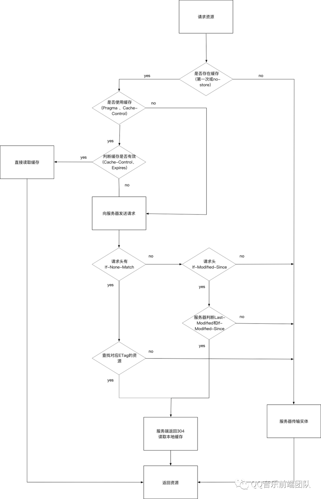

# browsers

- [chrome浏览器F12官方文档](https://developer.chrome.com/docs/devtools/network/reference/?utm_source=devtools#timing-explanation)

- [腾讯技术工程：深入理解浏览器原理](https://cloud.tencent.com/developer/article/1489018)

- [腾讯技术工程：彻底弄懂浏览器缓存策略](https://cloud.tencent.com/developer/article/1660735)

    

- [rail用户性能模型](https://web.dev/rail/)

- [How browsers work](https://web.dev/howbrowserswork/)

# WebAssembly

- [李银城：WebAssembly与程序编译](https://www.rrfed.com/2017/05/21/webassembly/)

# 数据库

- [李银城：前端与 SQL](https://www.rrfed.com/2017/06/11/sql/)

# HTML

- [Templating in HTML](https://kittygiraudel.com/2022/09/30/templating-in-html/)

- [李银城：HTML/CSS/JS编码规范](https://www.rrfed.com/2017/08/20/html-css-js-code-specification/)

- [李银城：我知道的跨域与安全](https://www.rrfed.com/2018/01/20/cross-origin/)

- 图片优先选择avif
```html
<picture>
  <source type="image/avif" srcset="cow.avif" />
  <source type="image/webp" srcset="cow.webp" />
  
</picture>
```

# CSS

- 图片优先选择avif
```css
.box {
  background-image: url("cow.jpg"); /* fallback */
  background-image: image-set(
    url("cow.avif") type("image/avif"),
    url("cow.jpg") type("image/jpeg"));
}
```
