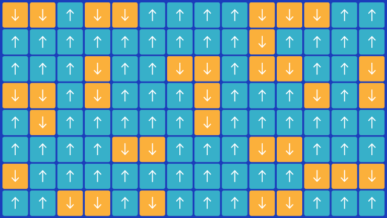

<!-- vim-markdown-toc GFM -->

* [传统科学与复杂科学对比](#传统科学与复杂科学对比)
* [复杂性科学](#复杂性科学)
    * [复杂科学的发展史](#复杂科学的发展史)
    * [老三论](#老三论)
        * [控制论（维纳）自然与人工的比较](#控制论维纳自然与人工的比较)
            * [《协调心理学与控制论》（奥多布莱扎）](#协调心理学与控制论奥多布莱扎)
        * [信息论（香农）](#信息论香农)
            * [熵](#熵)
        * [系统论（贝塔郎菲）整体>局部之和](#系统论贝塔郎菲整体局部之和)
    * [新三轮](#新三轮)
        * [耗散结构（普里高津）非平衡态](#耗散结构普里高津非平衡态)
            * [城市地理](#城市地理)
        * [协同论（哈肯）自然与人工的比较](#协同论哈肯自然与人工的比较)
        * [突变论（德弗里希）（托姆）（塞曼）](#突变论德弗里希托姆塞曼)
    * [钱学森](#钱学森)
        * [《工程控制论》](#工程控制论)
            * [宋健《人口控制论》](#宋健人口控制论)
        * [复杂巨系统](#复杂巨系统)
    * [涌现](#涌现)
        * [AI](#ai)
        * [黏菌](#黏菌)
        * [克莱伯定律](#克莱伯定律)
            * [城市S型曲线](#城市s型曲线)
* [对称性破缺](#对称性破缺)
    * [自相似结构，混沌边缘，自组织临界](#自相似结构混沌边缘自组织临界)
    * [自组织临界](#自组织临界)
        * [自私牧群原理（Selfish Herd Theory）](#自私牧群原理selfish-herd-theory)
        * [外卖员自组织](#外卖员自组织)
    * [伊辛模型（Ising Model）](#伊辛模型ising-model)
* [统计](#统计)
    * [幂律分布](#幂律分布)
        * [莱维飞行](#莱维飞行)
    * [非线性](#非线性)
* [生命科学](#生命科学)
* [AI](#ai-1)
* [艺术与表达](#艺术与表达)
* [企业管理](#企业管理)
    * [华为熵减](#华为熵减)

<!-- vim-markdown-toc -->

# 传统科学与复杂科学对比

- [对称性破缺与涌现——复杂科学与艺术之间的共鸣](https://m.thepaper.cn/baijiahao_19440930)

- [多者异也：破缺的对称性与科学层级结构的本质 | 经典回顾]()

- 整体

    - 还原论（Reductionism）：

        - 世界及存在的各种现象，都可以通过研究恰当分割所得到的部分，进而得到整体本身的性质和规律。

        - 机械决定论典型的线性思维的：整体 = 部分之和，既包括空间也包括时间尺度。

            - 例子：法国数学家拉普拉斯（Laplace），他认为，只要知道宇宙某一时刻的所有物体的初始状态，就能预测整个宇宙任意时刻的状态。

    - 复杂科学：

        - 为什么彻底的还原论是错误的？

            - 1.忽略了系统部分之间的信息：仅仅通过分解成部分以了解整体是不充分的。一旦整体被不当分解，各部分间的相互作用和联系就丧失了。

                - 将揭示各门具体学科之间的共同形式、共同规律作为自己的追求，使自己成为介于各门具体学科和一般哲学之间的学科

            - 2.忽略系统要素与环境之间的信息

            - 3.忽略了不同观察尺度得到不同的模式和信息

        - 用亚里士多德的一句话来概括，“整体大于部分之和”（1+1＞2）。——系统与其组成部分相比，具有各部分线性叠加之后不具备的新的属性。

            - 凝聚态物理学家安德森说：“more is different。”

                - 还原论：分为内涵性（intensive）和外延性（extensive）研究：

                    - 内涵性研究旨在研究基本定律，外延性研究旨在根据已知的基本定律解释现象。这种区分并不是绝对的，但是大多数情况下是清晰的。固体物理学、等离子体物理学和生物学属于外延性研究。高能物理学和原子核物理学的绝大部分内容属于内涵性研究。正在进行的内涵性研究总是比外延性研究少得多。一旦发现新的基本定律，大量的研究开始考虑将这些发现应用于迄今未解的现象。

                    - 主要谬误在于还原论假说从来都不意味着“建构论（constructionist）

                    - 将世间万物还原成基本单元和基本规律，并不意味着从这些规律出发能够重建整个宇宙。
                - 高层次物质的规律不一定是低层次规律的应用，并不是只有底层基本规律是基本的，每个层次皆要求全新的基本概念的构架，都有那一个层次的基础原理。

                    - 心理学不是应用生物学，生物学也不是应用化学。

                - 还原论自顶向下（Top-down）构建理论；演生论和复杂性科学自底向上（Bottom-up）形成理论。

        - 复杂是一种处于有序和无序之间的状态。
        

- 因果关系：

    - 传统科学：最核心的方法论原则之一是简单的线性因果决定论原则。但因果关系是极其复杂的，通常人们将产生某些现象的各种原因分为直接原因与间接原因、主要原因与次要原因、内部原因与外部原因等等。多种因果关系是共存的，人们很早就注意到一因多果、一果多因、多因多果等复杂局面的存在。

    - 复杂科学：从因果关系的这种复杂多样性来看，由结果不可能必然推出原因的存在，这意味着准确的单一还原的风险。当代系统科学在对复杂系统进行分析时，进一步具体、丰富和深化了人们对因果关系复杂性的认识，例如提炼出了“多重可实现性”的论题等，有力地揭示了简单因果还原的局限性。

- 客观世界的层级结构

    - 传统科学：认为一个现象领域可以归结到另一个更低层或更深层的现象领域来加以理解。
    - 复杂科学：每一个层次的事物都有自己独特的性质，从而使自己作为一个独立的层次而存在。
        - 所以，物质的高级运动形式是由低级形式发展而来的，但它并不能完全归结为低级形式，而是具有自己独特的形式。
        - 不同的层次特别是相邻层次之间必然存在某种关系。
        - 从部分到整体的因果关系是上行因果关系，从整体到部分的因果关系则是下行因果关系。
        - 高层次的整体对低层次的部分的这种控制能力、协调能力、选择能力等，是被传统科学完全忽略了的。

- 非线性系统（Nonlinear System）：线性是指成比例，而非线性则指输入和输出不成比例，比如抛物线就是非线性的。

    - 在物理科学中，如果描述某个系统的方程其输入（自变数）与输出（应变数）不成正比，则称为非线性系统。
    - 自然界中大部分的系统本质上都是非线性的，非线性系统和线性系统最大的差别在于，非线性系统可能会导致混沌、不可预测，或是不直观的结果，混沌来源于非线性。

    - 复杂系统内部的非线性相互作用，系统才可以在相同的外部环境条件下通过“初值敏感”的不稳定机制，实现不同的可能状态，从而使世界变得更加丰富多彩。

- 不确定性

    - 除了统计力学和量子力学，复杂系统科学中混沌现象等的发现，进一步揭示出复杂系统的突变行为的不可预测性。

    - 传统科学中那些微不足道的涨落，借助于复杂系统所能提供的“初值敏感”的机制，以四两之力而拨千斤之重，使我们这个世界步入了一个不断创造的不可逆的发展道路

- 混沌是一个由非线性效应引起的一个相当独特的现象，具有对初值的敏感性、无周期性、长期不可预测性以及分形性和普适性等特点。

    - 系统从有序突然变为无序状态的一种演化理论

    - 三体问题：三个质量、初始位置和初始速度都是任意的可视为质点的天体，在相互之间万有引力的作用下的运动规律问题。

        - 二体问题非常简单，但是三体问题要复杂得多。庞加莱通过研究，发现一般三体问题无解，即没有解析解。

            - 没有解析解，但有数值解。——可以针对性的输入几个数，获取一定时间内的不那么精确的结果

    - 例子：

        - 心脏紊乱、湍流、电路、水滴等

        - 蝴蝶效应：南美洲一只蝴蝶扇一扇翅膀，就可能会在佛罗里达引起一场飓风。

        - 逻辑斯蒂映射（logistic map）

        - 康威生命游戏的元胞自动机

- 涌现：
    - 弱涌现：晶体、湍流、鸟群
    - 强涌现：生命、语言、意识、文化
    
    

# 复杂性科学

## 复杂科学的发展史

| 系统学派 | 基础理论                                 | 代表人物      | 工具              | 研究起点                                     | 核心概念                                 |
|----------|------------------------------------------|---------------|-------------------|----------------------------------------------|------------------------------------------|
| 欧洲学派 | 自组织理论 耗散结构 协同论 超循环 突变论 | 普利高津 哈肯 | 非线性数学        | 物理系统 化学系统                            | 耗散结构 序参量 吸引子                   |
| 美国学派 | 复杂自适应理CAS                          | 圣塔菲研究所    | 霍兰              | 计算模拟                                     | 经济系统                                 | 涌现 隐秩序 |
| 中国学派 | 开放的复杂巨系统理论                     | 钱学森        | 人机结合 以人为主 | 宇宙系统 地理系统 社会系统 人体系统 大脑系统 | 系统态 功能态 灵感思维 集体思维 大成智慧 |

- 欧洲学派：使用非线性数学工具把物理系统和化学系统的自组织理论(耗散结构理论、协同学)严密化、体系化，并使这些理论普适化，拓展到生物系统、经济系统和社会系统。

- 美国学派：主要研究基地是美国的圣菲研究所。把系统元素理解为“活的”、具有主动适应能力的主体，引进了宏观状态变化的“涌现”(emergence)概念，从而对从简单中能够产生复杂的观念进行了逻辑性的阐述。

- 中国学派：把研究基点放在“人的因素”上，就是说放在以人为元素的系统或者有人的因素的系统。

- 1.前概念阶段（～1930）：演化论、统计力学等一些抽象系统规律

- 2.系统科学阶段（1930-1980）：老三论 + 新三论

    - 信息论（1948）、控制论（1948）、系统论

    - 混沌理论（1963）

    - 复杂自适应系统（1968）/ 自创生（瓦雷拉，1972）

    - 耗散结构论（1977，普利高津）、协同学（1974）、突变论（1972）

- 3.复杂科学阶段（1980－1990）：圣塔菲研究所（Santa Fe Institute），计算机建模与模拟，回答真实世界难以通过做实验的手段解决的问题

    - 涌现（emergence）

    - 群体行为 / 复杂系统层级

- 4.复杂网络阶段（2000-2010）：骨架、关系数据获得。

    - 巴拉巴西（The network takeover, Albert-László Barabási, 2012）

- 5.大数据时代与复杂系统的物理学（2010～）：大数据时代，数据驱动而非仅仅计算模拟。数学方程描述统一规律。生物学的 Kleiber 定律、规模理论（Scale, Geoffrey West, 2017）

## 老三论

### 控制论（维纳）自然与人工的比较

- [科学思维——系统思维：控制论思维方法](https://mp.weixin.qq.com/s/G-gsCKQaqXWEf91bCFTdNw)

#### 《协调心理学与控制论》（奥多布莱扎）

### 信息论（香农）

- [CCCF专栏 | 黄铁军：电脑前传(1)：信息]()

    - 1928年，拉尔夫·哈特利信息定义也不过是“信息是指有新内容、新知识的消息”

        - 也是信息论创始人克劳德·艾尔伍德·香农思考的出发点。1948年在信息论奠基论文《通信的数学理论》中，他把信息定义为“用以消除不确定性的东西”。

    - 认识论角度看：

        - 香农的信息概念就暗含了信息的作用对象，即认识主体，也就是信宿；相应地，产生各类信息的实体称为信源；传输和存储信息的载体称为信道。

            - 信息是连接认识主体（信宿）和客体（信源）的桥梁，信道是物质或能量的载体，信息是信道上传递的内容。

    - 本体论角度看：
        - 信息是事物运动的状态和方式，而与是否被他事物所反映无关。
        - 维纳在《控制论》中给出了一个更为本体论的定义：“信息就是信息，既不是物质，也不是能量。”实际上隐含了很重要的一层含义：信息和物质与能量一样，是刻画这个世界的基础概念。

- 最大熵原理：在所有满足已知条件的概率分布中选择熵最大的那个
    - 无约束条件下均匀分布具有最大的不确定性（即最大熵）。
    - 应用：语音识别，网络搜索，股票投资

#### 熵

- [科普 | 用绵羊解释熵——从冰块融化到时间箭头之谜](https://www.163.com/dy/article/DO58QL6T0511D05M.html)

    - 通常的物质含有约10^24（一千万亿）个原子

    - 熵：

        - 描述“可能的分布数量”的一个特定的词而已。熵描述了你可以用多少种方法重排物质“内部”（微观内部），而同时保持其“外部”（宏观）状态不变。

            - 例子：你给我一个气球，那么我可以测量其内部气体的压力、体积、温度等物理量，这些数字记录了气体的宏观状态。而在这样的宏观状态下，微观尺度下的气体分子可能存在很多种排列方式。它们可以有不同的位置，并且可以在不同的方向上以不同的速率移动。熵正是所有这些分布方式的度量。
            

    - 熵增：

        - 有些状态比其他状态更有可能发生。

            - 例子：在绵羊农场中，我们拆除两个相邻农场之间的栅栏，每个农场有3块土地，从而6只绵羊可以在其中自由活动（每种物质有3个原子共6个能量包）。这时将会发生什么？
            

                - 如果你将直方图中各部分纵坐标数值相加，即可得到这6只绵羊状态总共有462种情况。
                
                

                - 假设绵羊处于其中任何一种状态的概率相等。在这种情况下，绵羊在两个农场中平均分布，因为平均状态所对应的绵羊分布的状态数最多（对应直方图中最高的一栏）。

                - 绵羊（能量）集中分布对应的情况较绵羊（能量）分散时对应的情况更少
                

                - 绵羊例子中所有能量集中在一种物质中的可能性约为1/8。当我们将物质组分扩大到每个含50个原子，并共享50个单位的能量时，在一种物质中找到所有能量的概率大约是1330亿分之一。这也只是50个原子的情况。当我们在一杯水中投入一块冰块，会有约10^25个分子。

            - 回到物理事件中。起初能量不均匀地分布在两种物质之间，然后我们将物质混合，并使其自由交换能量。于是，随着时间的推移，我们会发现最可能的结果是两种物质的能量均匀分布。热的物体逐渐变冷，同时冷的物体逐渐升温。此时，它们的熵也随之增加了。

                - 与绵羊的例子一样，其中并没有新的物理定律使得能量扩散，或者熵增加。只是能量扩散的情况多于能量聚集在某一处的情况。即事件向熵增方向的可能性较降低方向更大。这只是一个概率问题。

        - 整个星球的运转，包括所有生命过程，都在引起熵的增加。

            - 地球上的所有生命都依赖于我们从太阳获得的能量。阳光由浓缩的熵较低的能量组成。地球摄取这些有用的能量，将其用于内部运作，并相应地散发热量。这是一种更加分散的能量形式，于是使得熵增加。

            - 我们获得的这种较低熵的能量之源是太阳。像所有恒星一样，太阳辐射其聚集的能量，使得熵逐渐增加，并且与宇宙中相对低温的真空环境达到平衡。终有一天，太阳将变冷耗尽。由此推断一下遥远的未来，那时所有恒星将会熄灭，所有星系将辐射出热量，我们的宇宙将达到热平衡态，即没有任何部分比其他部分更冷或更热。终于，我们的宇宙将达到熵的峰值。

            - 平衡态的宇宙是非常无聊的。那里没有生命，没有机器，也没有什么状态变化。这个世界末日的场景被称为热寂，而这也正是目前宇宙学家通常认为我们的宇宙结束的一种方式。但是你也不需要为此过分担忧，因为这可能发生在一个googol年（即10^100年）之后

### 系统论（贝塔郎菲）整体>局部之和

## 新三轮

### 耗散结构（普里高津）非平衡态

#### 城市地理

- [中国国家地理2023年第一期]()

    - 普里戈金看到，在生物进化过程中，有些生命现象正好与此相反，是向熵减少的方向进行的。如单细胞到多细胞，是从无序到有序以至高度有序的。

        - 例子：西瓜生长时，土地干得很，水不仅不会从西瓜里渗到泥土里去，反而会从泥土里聚集到西瓜里去
        - 例子：海带和紫菜能把海水里的碘集中起来

    - 但是普里戈金告诉我们，要使“熵减”情况出现得满足几个条件：

        - 1.系统必须远离平衡状态，接近或距离不远都不行。

            - 例子：一个村庄，当这个村庄新生的孩子与死去的老人数量相等时，这个系统的人口是稳定的，食物和资源都能满足人口需要，这个系统就处于平衡状态；假如某年出生的孩子超过了老人一些，但超得不多，则系统能够进行自我调节，不会失衡，这时的系统被称为“接近平衡的系统”；假如新生儿猛然增加很多，系统就处于了远离平衡的状态,于是开始出现混乱，系统就处于了熵迅速增加的状态。此时这个系统无法依靠过去的物质和能量循环解决问题，必须靠外部源源不断地输入新的物质和能量，才能在更高层次上组成新的系统——这种新出现的系统被称为“耗散结构”。

    - 回看前面提到的“江西现象”。江西周边的省其实都属于“远离平衡状态”的“耗散结构”，广东省的系统平衡绝不是在自我运行的封闭系统内达成的，广东濒临海洋，沿海港口众多，还有香港、澳门这样的特别行政区相邻，因此，广东省高度依靠省外的巨大输入与输出来实现更高层次上的平衡。同理，福建省、浙江省也是如此，安徽省、湖北省和湖南省虽然不是沿海省，但是长江相当于它们的海岸线……而且它们并无一个“独立的完整的地理单元”自成一体，它们都属于向周边开放的“远离平衡”的耗散系统。

        - 江西并非一个完全封闭的系统，它北有长江，省内也有京九、浙赣铁路等通过，还有各种高速公路贯穿。但是由于地理环境的阻隔，江西缺乏与周边地区民间的水乳交融式的物质、能量和信息的输入与输出。最重要的是，江西的周边缺乏与其自身文化异质的外来文化——即使江西与周边的交通网络畅通，但是如果周边都是与自己同样的文化形态，那么这种与系统外的输入和输出就缺乏不同文明碰撞产生的那种核裂变式的效果。

### 协同论（哈肯）自然与人工的比较

### 突变论（德弗里希）（托姆）（塞曼）

## 钱学森

### 《工程控制论》

#### [宋健《人口控制论》](https://book.sciencereading.cn/shop/book/Booksimple/show.do?id=B2231865BC5454139B5FF3F4BDC262FD2000)

### 复杂巨系统

- [八号院研讨厅：钱学森系统科学思想概述]()

- 四类典型系统：

    - 地理与生态环境系统、社会经济系统、人体系统、人脑系统

    - 其共同特点是都涉及生命现象，而且是涉及人的高级生命现象。人具有意识，人的主动性的本质，体现在能动地认识世界和改造世界

- 系统分类：

    - 简单系统：是指组成系统的于系统数量比较少，它们之间关系自然比较单纯。简单系统小系统。如果子系统数量相对较多（如几十、上百），如一个大工厂，则可称作大系统。

        - 不管是小系统还是大系统，研究这类简单系统都可从子系统相互之间的作用出发，直接综合成全系统的运动功能。

    - 巨系统：若子系统数量非常大（如成千上万、上百亿、万亿），则称作巨系统。

        - 简单巨系统：若巨系统中子系统 种类不太多（几种、几十种），且它们之间关联关系又比较简单，如激光系统。

        - 开放的复杂巨系统：
            - 如果子系统种类很多并有层次结构，它们之间关联关系又很复杂，这就是复杂巨系统。
            - 如果这个系统又是开放的，就称作开放的复杂巨系统。
            - 这些系统无论在结构、功能、行为和演化方面，都很复杂。

    - 开放的特殊复杂巨系统再上一个层次：以人为子系统主体而构成的系统，而这类系统的子系统还包括由人制造出来具有智能行为的各种机器。

        - “开放”与“复杂”具有新的更广的含义。

            - 开放性：指系统与外界有能量、信息或物质的交换。
                - 1.系统与系统中的子系统分别与外界有各种信息交换
                - 2.系统中的各子系统通过学习获取知识。由于人的意识作用，子系统之间关系不仅复杂而且随时间及情况有极大的易变性。

            - 复杂性：
                - 1.系统的子系统间可以有各种方式的通讯
                - 2.子系统的种类多，各有其定性模型
                - 3.各子系统中的知识表达不同，以各种方式获取知识
                - 4.系统中子系统的结构随着系统的演变会有变化，所以系统的结构是不断改变的。

        - 如社会系统

- 发展系统科学基本理论，需要从各相关学科的发展中去综合、抽象和提炼，除了需要从系统工程实践以及运筹学、控制论、信息论等这些系统科学体系内的技术科学去提炼、概括以外，还需要从自然科学中的物理学、化学、生物学等学科中汲取素材，特别是与系统的演化与协同有关的自组织理论、非线性系统动力学、超循环理论等，它们都揭示了许多的系统规律。

    - 他说：“我认为把运筹学、控制论相信息论同贝塔朗菲、普里高津、哈肯、弗洛里希、艾根等人的工作融会贯通，加以整理，就可以写出《系统学》这本书。

- 应该从一个一个具体的开放复杂巨系统入手进行研究，当这些具体的开放复杂巨系统的研究成果多了，才能从中提炼出一般的开放复杂巨系统理论，形成开放的复杂巨系统学，作为系统学的一部分。
    - 《工程控制论》就是采用这个办法，从一个一个自动控制技术中提炼出来的。

## 涌现

- [张江丨21世纪为什么需要复杂科学？](https://m.thepaper.cn/baijiahao_20329423)

    - 涌现现象：

        - 1.椋鸟是一种生活在欧洲的鸟，身长约22厘米，也就一个巴掌大小，但它们经常会集合形成规模庞大的鸟群，像一只巨大的水母飘浮在巴黎上空。椋鸟群飞翔时井然有序，彼此不会发生碰撞；而当规模庞大的鸟群朝埃菲尔铁塔飞去时，又会灵活地分裂成两个新的鸟群，分别从铁塔的两侧绕过，然后重新会合到一起。

        - 2.路网：很多人都有在城市中开车的经验：每天清晨，当你开车行驶在公路上时，其实就在和路网上所有汽车所构成的复杂系统互动。每辆车都在跟随着前一辆车，即使在没有发生交通事故的情况下，只要车流密度很大、车速很快，一辆车的猛然刹车就有可能造成后续车辆的大堵塞——第一辆车的减速导致了后续车辆的减速，后续车辆的减速又会导致再后面的车辆减速，当这些减速连接到一起，就有可能形成由减速构成的“驻波”，像水面上的涟漪一样顺着路网传播开来。

        - 3.蚂蚁：蚂蚁在通过相互作用形成一个整体时展现出了非凡的智慧，如蚁群可以通过信息素来完成彼此之间的相互作用，从而在多条巢穴和食物之间的搬运路径中选择最短的一条。

        - 4.霓虹灯：无非就是一堆小灯泡在闪烁，不停地变换颜色。但当你退后一步，就会看到由很多的小灯泡组成的霓虹灯整体呈现出图案或文字，且它们无法被还原到每个单独的灯泡上。每个灯泡的闪烁似乎都是无意义的，你只能通过它们形成的整体来解读它的意义

        - 5.鸟类：V形通常被认为可以提高飞鸟的效率和飞行距离。除头鸟外，所有飞鸟均处于前方飞鸟的翼尖涡流中，上升气流帮助每只鸟在飞行中支撑自己的体重，后面飞翔的鸟无需像前鸟那样费劲就能获得升力。
        

    - 集体涌现的属性或规律可以反过来作用到微观个体身上。

        - 1.互联网巨头争先恐后地收购和投资一些小型创新企业，从而搭建自己的“生态系统”，实际上就是在尝试利用涌现属性对个体的反作用这一规律。

        - 2.很多国家的政府和地方部门也在主动培育产业生态，希望获得系统的力量加持。

        - 结论：系统内大大小小的公司会获得更稳定的客源、更低的成本和更高的收入，相较系统外的公司有了比较优势。

### AI

- 计算不可约性：Stephen Wolfram 最近在其发表博客文章《Will AIs Take All Our Jobs and End Human History—or Not? Well, It’s Complicated…》认为，计算不可约性意味着，即使知道给AI制定的基本规则，我们也不能预期或确定 AI 的最终行为。

    - ChatGPT的底层规则并不复杂，但它们运行起来，且不断被喂料（数据输入）与训练，就会产生先前无法预知的复杂性态。
    - 意味着始终存在“惊喜的可能性”或“意外后果的潜在可能性”。

### 黏菌

- 由大量可以独立自主地在环境中爬行的单细胞生物体——阿米巴虫构成的“超级生物体”。

- 阿米巴虫在多处找到了食物，它们就开始修建一条条类似“高速公路”的管道将食物联通起来——这一切在显微镜下清晰可辨。

- 黏菌修建的“高速公路”竟然可以跟人类的高速公路网相媲美。

    - 1.将整个东京市以及周边36个城市的地图等比例缩进实验室的培养皿中，其长度大概只有20厘米。然后，他们在地图上东京市附近的主要城市的位置上放上了阿米巴虫爱吃的食物，再把黏菌放到东京市的位置上。一天之后，当实验人员再次打开培养皿时，他们惊奇地发现，一张完整的高速公路网络刚好将周围的几个城市和中心的东京市联通到了一起。
    

    - 2.几位研究者受到黏菌实验的启发，对宇宙的大尺度结构进行了研究。物理学家认为，从大尺度看，宇宙中的星系、星云等并不是独立飘浮的天体，而是被暗物质气体所构成的细丝连接在一起，构成了宇宙网络。暗物质被认为占宇宙物质总量的85%，但难以直接探测到。于是，研究者借鉴黏菌生长的模型，设计了一种“黏菌算法”

        - 最终，黏菌算法计算的结果——星系间的暗物质网络与通过最先进的宇宙学方法得出的结果并无二致。

### 克莱伯定律

- 生物体：尽管不同生物体的新陈代谢率和体重不尽相同，但是它们遵循着简单的幂律关系

    - 生物体的新陈代谢率与其体重的3/4次幂成正比，这意味着生物体体重增大一倍，其新陈代谢率增长近3/4倍。

    - 新陈代谢的增长要比体重更慢，因此越大的生物体需要的代谢率其实相对来说反而更小。

    - 例子：LSD的致幻剂被用于动物的实验
        - 猫的安全适用剂量大约是0.5毫克，于是推测体重约是猫600倍的大象的安全剂量应该是猫的安全剂量的600倍，即300毫克。
        - 在一次实验中，研究人员将297毫克致幻剂注射给大象，但在两个小时内，这头大象接连经历了尖叫、瘫倒、癫痫，最终死亡。这是因理论不足而预测失败的悲剧。
        - 事实上，动物能接受多少致幻剂或者吸收多少药物、营养物质，都与其新陈代谢能力有关，而新陈代谢率并不是随着体重线性增长的。根据克莱伯定律，一种体重是猫的600倍的动物，其代谢率仅仅是猫的120倍左右，也就是60毫克。因此，297毫克显然严重超量了。

- 企业研究：如果我们将企业的总资产看作生物体的体重，将企业的净利润看作生物的新陈代谢率，则二者存在着类似克莱伯定律的规律，即存在着可以用幂律函数描述的定量关系，但其幂律指数与生物体的不同

- 城市：城市的新陈代谢与规模之间的幂律指数是一个大于1的数。直观地说，城市人口增加一倍，城市的国内生产总值（GDP）、专利数、人均收入等都要增加超过一倍。
    - 这意味着城市越大，其新陈代谢也就越快——大城市有更多的工作机会，也拥有更高的人均GDP和财富，这解释了为什么人们更倾向于挤到大城市。更拥挤的环境承载了更丰富的人际互动、更频繁的信息交换、更复杂的分工协作和更容易被激发与应用的创新想法，但新陈代谢的加快也会让人们的生活更加繁忙，有更多处理不过来的工作邮件和更少的闲暇时光。
    - 城市要想具备创新能力，有一定的人口规模门槛。研究者甚至测算出这个门槛是120万人，即超过120万人的城市才可能形成创新经济结构，并实现超线性增长。

- 大脑：人类的脑容量最大，白质占比达到了哺乳类动物中最高的48%。也即人类不仅有更大的大脑，人脑神经元的局部互动密度也更高，这与其脑区的高度分化和高级认知功能的出现密切相关。

#### 城市S型曲线

- 城市S型曲线

    - 生物体的克莱伯定律可与生物体内的能量收支方程相结合，推导出一个普遍适用于各种生物体的生长方程，从而精准预测不同物种在不同发育阶段的体重大小，以及解释为什么所有的生物体发展到一定规模大小后就不再生长这一事实。

    - 从企业的广义克莱伯定律出发，配合上企业的财务平衡方程，我们也能推导出一个企业的生长方程，用来刻画不同市场中代表企业在不同时期的生长行为，甚至预测其发展的天花板。

    - 这一逻辑也适用于城市复杂系统。不同的是，由于城市的幂律指数大于1，它的生长方程会呈现出非常复杂的模式。首先，在城市发展规律的制约下，城市人口、GDP、碳排放等指标都会快速增长，在有限的时间内趋近于一个城市无法承载的最高阈值，从而将城市推到崩溃的边缘。这就是我们看到的发生在各个国家的经济危机或战争的原因。
        - 为了避免崩溃，城市必须重启生长轨迹，唯一的办法就是通过科技的颠覆式创新重置方程中的各个系数，将城市推入一条新的快速发展轨道。
        - 然而，城市发展在新的轨道之中仍然会遭遇同样的问题。再次逼近城市无法承载的极限点，新的危机需要新的科技创新，才能让城市进入一条更新的发展轨道……
        - 最终，在更长的时间尺度下，城市的发展曲线呈现出波动性的特点。在科技界，这是人们熟知的S型阶跃式发展轨迹。每一次阶跃都是一次全新的重大技术革命，从早期的互联网革命，到大数据、人工智能革命，不同的科技革命推动了一个全新的S型发展曲线，而不同科技革命之间的间隔却变得越来越短。
            - 用韦斯特的话说，人们不仅要不停地在跑步机上奔跑才能赶上社会发展的步伐，还要经常性地跳跃到一架更快的跑步机上。

- 城市S型曲线与技术奇点

    - 在科技领域，人们用“技术奇点”来形容人工智能的能力超越人类能力的特殊时间点。

    - 基于复杂科学的城市发展理论却预测，如果存在这样的技术奇点，那必然是超人工智能出现和环境崩溃同时发生的奇异时空点。

    - 一切的根源都在于耗散结构和熵。我们知道，所有的复杂系统要想生存下去，就必须不断地从外界获取资源，以抵抗自身内部不断的熵增，从而让系统演化越来越有秩序。

    - 如果说人工智能、区块链、元宇宙等高新技术的发展是人类城市系统的高度秩序性的产物，那么它们的代价就是被城市复杂系统排放到外界的各种污染物和温室气体。而且，秩序的产生和废弃物的产生并非完全对称平衡。

        - 由于热力学第二定律的普遍存在，为了获得一点点秩序，我们需要排放更多的废弃物。

            - 城市就好比一台大空调，它不停地在城市内部制造着冷气（更多的秩序），代价却是不得不往外部环境中排放大量的废热（更多的污染物和温室气体）。

    - 人类社会正在以更快的步伐奔向奇点。奇点的到来表现为两个方面：一方面是以人工智能为代表的技术的快速发展和社会财富的超高速创造，另一方面则是更加快速的熵的产生和对环境更深层次的迫害。这二者几乎是同步的。

# 对称性破缺

- [对称性破缺之美与物质世界的统一 | 于禄]()

- [中科院物理所：对称破缺——凝聚态中的物理美](https://baijiahao.baidu.com/s?id=1682903719068594219&wfr=spider&for=pc)

- 对称性：进行某种操作之后，该对象保持不变的性质。

    - 例子：

        - 旋转一个花瓶，看上去还是一样的。那么这个花瓶就有旋转对称性、空间反射对称性

        - 在地面上和运动的火车上做同一个实验，结果相同。这是时间平移对称性

- 对称性破缺（对称性降低）：越有序的结构，对称性反而越低。

    - 液态中的水分子做着随机而无规则的布朗运动（Brownian Motion）——没有固定的方向，没有固定的位置，处于完全无序的状态，在任何方向、任何点看起来都是一样的。但结成冰后，转5度、10度，可以很明显看到雪花发生了变化。

    

    - 一个正方形有八个对称元素，如果把它变成长方形，对称元素就只剩下四个。自旋从既可以向上或向下，变成只能向上或向下，是从两个对称元素变成一个元素，这就没有对称了。
    
    

    - 克劳修斯：“热量从低温到高温传递，不产生其他任何影响是不可能的。”即破坏了高温和低温的对称性。

    - 开尔文说：“从单一热源吸收热量转换为功，不产生任何其他影响是不可能的。”即不存在100%效率的热机，攻和热可以相互转换，但不是完全对称。破坏了热和攻的对称性。

- 守恒律与对称性：

    - 诺特定理（Noether's theorem）：由德国女数学家埃米·诺特（Emmy Noether，1882-1935）发现，它将物理中的每个对称性都存在一个守恒量。例如，能量守恒定律对应时间对称性；动量守恒对应空间平移对称——用哈密顿或格朗日力学表达；角动量守恒对应旋转对称性等等。

- 对称破缺分为两大类：

    - 1.明显对称性破缺（Explicit Symmetry Breaking）：自然规律决定的，是因为某些物理系统本身就不具有某些物理规律对应的对称性

        - 例子：李政道与杨振宁发现的“弱相互作用中宇称不守恒”（CP violation）。

    - 2.自发对称性破缺（Spontaneous Symmetry Breaking）：物理系统仍然遵循某种对称性，但物理系统更低的能量态（包括真空态）却不具有此种对称性。

        - 例子：BCS超导理论，希格斯机制（Higgs Mechanism）

## 自相似结构，混沌边缘，自组织临界

- [唐乾元丨行走在混沌边缘：从鸟群到人工智能](https://swarma.org/?p=38256)

    - 计算机图形学家雷诺兹（Craig Reynolds）就将动物的集体行为总结为三条简单的规则
        - 1.避免碰撞：个体会占据一定的体积，且这些体积不会互相交叠
        - 2.对齐：个体和它邻近的个体保持速度同步
        - 3.靠近：个体不倾向于独立行动，而是会尽量与周围的邻居靠近，避免被孤立。

    - 不论是鸟群、昆虫群、鱼群还是羊群，在面对捕猎者的入侵时，似乎总能以高度协调的集体行为做出应对。

        - 例子：飞翔的鸟群常常遭到捕食者（主要是游隼等猛禽）的攻击，个体显然不是这些猛禽的对手，但鸟群在面对猛禽的袭击时会做出集体反应——个体会彼此靠近，收拢队伍，迅速改变鸟群的运动方向，使得捕食者不得不一次又一次发起进攻。鸟群作为一个整体，涌现出了应对天敌的能力。我们无法找到究竟是鸟群中的哪一个模块、部门或者个体具有这方面的功能。

        - 假如有一只鸟注意到了不远处的天敌或者障碍物，它能否将这个危险的信号传遍整个鸟群？

            - 鸟群中任意两个个体之间的运动“关联”。关联描述的是复杂系统中两件事情的“相关关系”，它常常容易跟“因果”混淆，但关联绝不等于因果。

                - 在物理学中，只有直接的相互作用才对应于因果，比如两只相邻的鸟为了防止相互碰撞，做出了相互排斥的动作，二者就有明确的因果关系。

                - 而关联是由间接的相互作用造成的，鸟群中有两只距离遥远的小鸟A和B，A在鸟群的外围，B则位于鸟群的内侧，两只鸟距离太远，互相看不到对方，它们之间不存在直接的相互作用，但它们的运动依然能相互影响，这就是一种关联。

            - 在鸟群中，尽管鸟类个体的飞行只受身边邻居的影响，但任何个体的速度发生改变，这一信息都可以在鸟群中不断传递，遍及整个鸟群。随着鸟群的规模扩大，其中距离遥远的个体之间始终可以保持一定的关联，这种特征是鸟群对外界各种危险信号保持敏感性的来源。

        - 对鸟群而言，最佳的组织形态应该是处在有序和无序之间的某种 “团结紧张”的状态，也叫“临界现象”。
            - 如果鸟群过于有序，对其来说可能是致命的。试想，鸟群中的一员注意到了前方的障碍物，但其他个体没有注意到这一危险，这时集体选择很有可能压倒个体反应，导致鸟群撞上障碍物。
            - 如果鸟群过于无序，它们不仅无法团结起来应对天敌，甚至还有可能在飞行过程中互相擦撞。

            - 有序和无序，看似充满矛盾，却在鸟群中实现了统一。
                - 鸟群协调一致地对外界的捕食者做出反应，发生集体运动，又显示出“有序”和“稳定”的特征。
                - 在空中不断变换队形，表现出“无序”和“可变”的特征

    - 自相似结构：鸟群、大脑等复杂系统似乎恰好处在有序和无序相互转变的临界点附近。

        - 鸟群与大脑之间的这种相似性并不只是某种类比，这背后有相同的数学描述（幂律、自相似性）和物理规律（临界现象）支撑。

        - 各种“分形”的图像也具有自相似的特征，它们都可以用“幂律”来描述。

        - 细菌的集体运动，也包含许多非生命的复杂现象，如地震、太阳耀斑等。

        - 例子：冰块融化成水，从微观结构上来看，其实是有序的固体融化为无序的液体，在这样的物相转变（即“相变”）过程中，就存在着临界点。在临界点附近，系统的微观状态既不完全像冰块那样有序，也不像水那样无序，而是形成了某种介于有序和无序之间的“自相似结构”。

    - 混沌边缘

        - 在非线性科学和复杂科学领域，这种临界点常被称为“混沌边缘”，指的是系统的一种特殊状态：系统既不处在“周期态”，也不处在“混沌态”，而是恰好处在两种状态之间的某种状态。
            - 周期态：是指系统的演化以固定的周期重复出现固定的模式，对应于前文所提的有序态
            - 混沌态：是指系统按照一定的规则演化，可系统下一个时刻出现的状态却难以捉摸，甚至一个微小的扰动就能影响系统的未来演化，它对应于前文所提的无序态。

        - 混沌边缘的系统，其演化既不会单调地重复各种原有的模式，也不会在各种混沌无序的状态中看似随机地切换，而是呈现出极其复杂的模式。有趣的是，许多复杂的自适应系统都处在混沌边缘，因此，“是否处在混沌边缘”往往也被用作判断系统是否足够“复杂”、是否具有“智能”的重要标志。

        - 经典的元胞自动机“康威生命游戏”。λ变化就能得到四种元胞自动机之间转化过程：固定点->周期->复杂->混沌

            - =0.001，所有的细胞被吸引到一种固定的状态，这相当于我们上一节叙述的第一类细胞自动机；
            - λ=0.2附近，系统在一些固定的状态之间周期的循环，这相当于第二类细胞自动机，的细胞自动机比的在开始的时候具有更复杂的结构；
            - λ介于0.3大约到0.6之间的时候，会出现相当复杂的结构。这些结构既不属于固定的周期或者固定值，也不属于完全的随机，因此这些细胞自动机属于第四类即「复杂型」。并且，随着的增长，复杂结构的维持时间也会变得越来越大；
            - λ>=0.6的时候，复杂的结构消失，系统将被吸引于一种完全随机的混沌状态。

            

## 自组织临界

- 自组织临界与对称性破缺：

    - 对称性破缺的结果是降低了事物的自由度：我们还可以用一个立着的棍子来说明，如果这根棍子是圆柱体，那么它就可能往所有方向倒下，但如果横截面破缺为正方体，那就只有4个方向可能了。

    - 当因为对称性破缺产生多样性后，这些要素或主体之间就可能发生局部相互作用，从而使得系统产生出某种形式的整体秩序，这就是自组织（Spontaneous order），在社会科学中也被称为自发秩序。

    - 自组织产生复杂性或复杂系统，主要由是在时间上的动力系统行为，它往往基于一些简单的规则，在足够演化后，抵达一个临界点作为吸引子（Attractor），从而呈现出某些区别于以往的秩序。这个过程也被称为自组织临界性（Self-organized criticality）。

    - 例子：我们很难让一根竖立的棍子保持稳定，因为处于竖立状态的棍子即使能达到受力平衡状态，也无法达到稳定态，而是处于类似临界态的某种不稳定状态。

        - 本来，一根竖立的棍子正处于它最敏感的状态，一个微小的扰动就可能让它倒下，平放在地面的棍子则处在稳定态，对于外界的扰动不那么敏感。

        - 假如有一根棍子，不管你怎么去推它，它始终可以维持在竖立的状态。你是不是觉得这根棍子仿佛有了生命和智能？或许你曾经在网络上看过某些智能机器人或机器犬的视频展示，那些产品像我们所想象的这根神奇的棍子一样，可以在面对各种复杂的环境甚至攻击的情况下仍然保持工作状态。由此我们似乎会觉得，这根棍子同它们一样具有了某种“智能”。这种现象也被称为“自组织临界”。

- 人类的敏感性是人与人工智能的区别

    - 假如我们在一本画册上见到了一张动物（例如大象）的图片，并将它记在脑海中，一旦到了动物园亲眼见到大象时，我们马上可以认出这是“大象”。虽然我们在动物园看到的真实动物与图片上的差异可能非常巨大，但我们之所以能成功认出真实的动物，是因为从单一的样本中成功提取出了最关键的信息。这种敏感性正是人类智能与机器智能的一个重要区别，目前的大量机器学习算法仍然需要海量的数据，针对小样本的学习能力仍然是人类智能的一种独特的优势。

    - 对集体而言，这种敏感性与信息处理和整合的能力有关。

        - 假如现在一个组织需要进行集体决策，组织中每个成员收集的信息都很重要——只有当每个成员所收集的信息都能影响决策结果时，才能说明最终的决策整合了所有人收集的信息。只有能充分整合各种信息，这个组织才能对外界瞬息万变的各种情况做出反应，表现出高度的敏感性。

        - 反之，如果这个组织是一言堂，或者个体收集的重要情报在传递过程中逐渐损耗，那么个体所收集的信息很可能无法影响最终的决策，这样的系统就不具有敏感性，也无法有效地整合各种信息。

        - 如果一个群体包含更多元的个体，即每个成员能从不同的角度思考问题和获取信息，同时成员之间有大量互动，在贡献自己的想法的同时，也对其他人的想法做出响应，这样的群体更容易实现“1+1>2”。只有意见能得到充分碰撞、顺畅交流的群体，才能更好地整合个体的信息，表现出更高的集体智慧。

        - 对于集体而言，整合信息并非总是最重要的目的

            - 例子：蜂在筑巢或者保育的时候，它们彼此并不需要过于密集的交流和互动，每只工蜂所面对的问题也是相对单一的，它们的集体行为不需要高度的信息整合。但当工蜂结成蜂群，在复杂的环境中采蜜时，它们就可能需要利用临界的特征，整合各种信息，适应各种复杂的环境情况。

    - 开发通用智能是人工智能理论领域的一大难题。

        - 现在见到的各种人工智能系统，大多用来解决某些特定问题，例如图像识别、翻译、下围棋、玩游戏等。在不同的目标下，智能的表现也有所不同，因此各种人工智能系统往往不能通用。

        - 人类智能却具有很强的通用性，例如要完成上面提到的这些任务，人类的表现可能不如机器，但人类的优势在于凭借较低的能耗、较少的数据就可以在一定程度上找到解决这些问题的方法。

- 自组织临界与幂律分布

    - 沙堆模型：假设有人将沙粒从距桌面几十厘米的地方洒落到桌子上。随着沙粒不断增多，一个沙堆开始形成。最终，沙子的堆积会达到临界状态，此后每加一次沙子都可能导致“沙崩”。

        - 在这种临界状态下，多加入的沙子通常要么没有影响，要么最多只会导致一些沙子下滑。这些属于幂律分布中的数量众多的小事件。但有时，只要再加入一粒沙子就会导致大规模的“沙崩”，这就是大事件。

    - 森林火灾模型：假设树木可以在一个二维网格上生长，这些树木也可能会随机地被闪电击中。当树木的密度较低时，由闪电引发的任何火灾的规模都很小，最多只会蔓延到几个格点。当树木密度变得足够高时，再被闪电击中就会导致森林大火。

        - 森林火灾系统是一个开放系统,存在着能量的交换：它的能量输入就是可燃物树木的增长，它的能量输出就是火灾。

        - 系统的能量注入是持续、缓慢而均匀的；能量耗散相对于能量注入来说是瞬时的、“雪崩式”的,但发生的次数相对比较少。具有这种性质的系统通常可以自发地演化到一个临界状态,最终导致大事件的发生。

### 自私牧群原理（Selfish Herd Theory）

- 被捕食者会寻求中心位置以减少自身危险，群体边缘的个体更容易成为捕食者的目标

### 外卖员自组织

- [李延昊 苏竣 | 智能技术背景下的新兴自组织形态研究]()

    - 在组织发展的过程中，骑手之间通过紧密和松散的直接交互和间接交互产生自组织适应，共享信息资源，形成自组织认同。最终，骑手通过自组织对算法进行反馈，形成自我规劝的内向算法适应、成员调整的互动算法应对以及外部求助的外向算法逃离。

    - 自组织、自治组织与非正式组织

        - 自治组织强调功能倾向。从制度经济学的视角出发，自治组织是一种用来协调各方利益的制度安排(陈效林，2018)，它为了解决因避责行为而导致的集体行动失败，产生出一套组织大家行动的权力体系(陶传进，2007)。在这一体系中，某些积极分子成为主导，实现了个人利益和公共利益间的平衡(盛智明，2019)。所以，自治组织是一种经协调而实现公共利益的制度安排。

        - 按照巴纳德对于非正式组织的定义，非正式组织是指，组织中区别于正式组织的、具有特别密度的部分，表示个体之间联系和互动的集聚。其具有如下特征：互动是基于人的特征而不是基于联合目的或共识；非正式组织的形式是不确定的，不具有组织结构；非正式组织内联系的紧密程度与个体在组织内的距离，以及其所在的正式组织的目的有关；正式组织与非正式组织存在紧密的联系
            - 可能存在他组织的非正式组织，以及自组织的正式组织。所以，自组织与非正式组织之间，并不存在可比的对应关系。

    - 笔者曾于2021年1月至3月在重庆市S区两个骑手集聚地和专送站点进行了半结构化访谈和参与式观察，以便更好地适应外卖骑手灵活机动的特点。在实操过程中，以研究的逻辑主线为依托，灵活使用一对一、一对多的方式进行

        - 本文共访谈专送骑手、中层骑手(注：中层骑手是众包骑手的另一种形式，每周与众包平台签订协议组成战队，进行类似专送骑手的管理，并规定每日的在线时长和必须完成的单量)及众包骑手52名，年龄从20岁至54岁不等，从业年限从1月至5年不等。

    - 外卖骑手形成自组织的动机是多元的，有内向、互动和外向三种。

        - 1.内向动机反映出外卖骑手需要获得对于自身情感的支持。按照戈夫曼的拟剧论，人们会在“后台”展现出自己在“前台”为了适应某些情境而压抑的行为。

            - 在外卖骑手的工作过程中，因站长克扣、顾客冷眼和商家推卸等难以在工作“前台”展现的不满情绪，需要借助“后台”进行排遣。出于排遣不满、自我安慰及鼓舞士气等获取对自身情感支持的内向动机，骑手拥有了形成自组织的动机基础。因而，在跑单之余，骑手会通过闲谈交流、联机手游、纸牌娱乐等方式，依托自组织搭建“后台”，并在此交流和宣泄负面情感，以获取对自身情感的支持。

        - 2.互动动机反映出外卖骑手需要应对工作过程中的紧急情况和信息不对称。

            - 例如，骑手在跑单途中突遇摩托车皮带损坏，但手上仍有未配送的订单。在这种情况下，外卖骑手可以通过各自的自组织，及时进行互助和信息传递。自组织内顺路的或手上没单的“兄弟”，就会去帮助该骑手完成剩余外卖的配送。同时，平台的数据垄断机制产生了骑手端的信息不对称，因而，骑手会通过自组织交流交通情况、商家单量和警察查证等情况，并以此来帮助组织内成员合理规划路线、挑选商家和规避行驶证抽查。

        - 3.外向动机反映出外卖骑手需要在智能算法的监视下寻求生存空间，具体表现为规避算法监视和抢占生产资源。

            - 外卖骑手作为能动的个体，会自发探寻算法监视下的生存空间。但个体经验总是有限的，为汲取更多经验，骑手们产生了分享上报到店、提前送达、抄近路及脱离平台解决纠纷等经验的需求，并基于这些需求缔结了自组织，以改善工作状况，扩大获利空间。同时，由于平台通过分配原则和计算规则，将订单派遣向中层骑手倾斜，众包骑手与中层骑手之间的单量矛盾日益突出，导致不同类型的骑手之间会抢夺派送订单，即产生了生产资源的矛盾。出于防御目的，为抢占生产资源、维持收入，众包骑手缔结了自组织，甚至举行过罢工。

    - 自组织形成后的三种空间形态

        | 稳定形态 | 联系紧密度 | 规模             | 地域隔阂 | 存在空间       |
        |----------|------------|------------------|----------|----------------|
        | 实体态   | 松散       | 适中（50-100人） | 是       | 物理空间       |
        | 虚拟态   | 松散       | 较大（150+人）   | 否       | 赛博空间       |
        | 交互态   | 紧密       | 较小（20-30人）  | 是       | 物理和赛博空间 |

        - 实体态：组织内的骑手在某一特定空间产生聚集。骑手在等单或休息时，会聚集在某一特定地点，他们之间会基于实体的联系认识并相互熟悉。这种自组织的特点是联系松散、规模适中和地域隔阂。由于骑手仅能在特定的场所接触，且骑手之间总是基于职业认同和职业身份进行交流，所以，骑手在见面之外几乎没有联系。

            - 它是以遇见和共情作为交互发生的契机。在实体态自组织中，外卖骑手以“感觉大家做这一行的都挺不容易的”(210209－CQ27)和“只要是外卖骑手，不管是在哪个平台跑的，只要多见几次了都能聊得来”(210305－CQ39)为共情出发点，就可以建立松散的直接交互。这种交互的具体形式多体现为吐槽工作和互动娱乐。外卖骑手会与不特定对象交流工作上遇到的不顺心和不如意，且都能收到对方感同身受的回应。

                - 例子：送餐时遇到提出无理要求的顾客；导航的平面路径规划与实际路线不符，导致超时却不能申诉；以及系统总是不派单或乱派单的情况；等等。

                - 例子：骑手也会通过在等单之余进行纸牌游戏，或组队完成多塔类手游的方式建立实体联系，并在游戏的过程中进行取餐送餐、路径规划等经验的分享交流，互相安慰，形成松散的直接交互。

        - 虚拟态：骑手在缔结联系的过程中，并不会关注对方是谁，也不会关注对方的背景和过往。即以线上群聊等方式维系虚拟身份两端。

            - 该种联系虽然是基于现实接触而产生的，但是联系本身完全脱离了个体社会身份，是一种以特征组合为导向的联系缔结，即满足某些特征组合便可以产生联系。

            - 在虚拟态自组织中，形成了骑手们的宣泄渠道和信息池。
                - 例子：
                    - “像我们下午没有单子的时候就会在群里面抱怨，说今天都没有单子跑，好无聊哦”
                    - “有的时候有人遇到了很多顺路的单子，也会发在群里向大家小小炫耀一下”
                    - “我们很多众包骑手都是没有摩托车驾驶证的，哪里要是查证的时候我们就在群里吼一声，叫大家别往那里去”
                    - “有的时候商家爆单，或者小区电梯不好等的时候，就会在群里提醒大家不要接那个方向的单子”

        - 交互态：其中的成员多为专送骑手或中层骑手中的一种，没有专送骑手与中层骑手均存在于同一交互态自组织中的情况。该种形态的自组织特点是联系紧密、范围较小和地域隔阂。该种自组织中成员间的熟悉程度远高于其余两种形态，部分成员在生活和工作上有诸多交集，甚至是知根知底的好友。

            - 在原有松散交互的基础上产生了基于真实身份的次级联系，并由此产生外卖工作场景之外的互动。
                - 例子：
                    - “在进一步了解玩得比较好的几个骑手之后，我就想和他们一起创业，做个小生意”
                    - “有的时候手头比较紧张，就会找他(指着旁边的骑手)借点钱”
                    - “有些不方便在群里说的，就和几个好朋友私底下骂一下队长或者平台，一吐为快”
                    - “平时要是碰到不熟悉路线的外卖员，还是会给大家指指路，但是到底怎么抄近道，就只和几个兄弟伙分享”

    - 卖骑手形成的自组织共产生了三个层次的自组织反馈结果

        - 这三种自组织反馈的逻辑层次从内向的、个体的微观层面，互动的、群体的中观层面，到外向的、环境的宏观层面

        - 1.自我规劝：内向算法适应

            - “算法并不像我们想象的那么聪明”(210225－CQ32)，在骑手的劳动过程中，算法在路径规划、派单过程和实时运算上都需要骑手作为算法的补充，调整和修改算法的部分计算结果。由于算法的路径规划是基于2D平面的，而现实中的道路构造却是3D的，这就导致系统显示的配送距离小于实际的配送距离，或产生单行道逆行的路径规划。因此，骑手在接单时需要根据个人和自组织提供的经验，在算法计算结果的基础上补充预估实际距离，再根据计算结果决定接单、转单或拒绝订单。

            - 算法的计算对象是单笔订单，在综合考虑距离、骑手运力、骑手密度等因素后计算派送时间，而不会对订单间的关系进行网络分析，“特别是中午爆单的时候，系统总是给我派很多反向的订单，完全没有考虑过我手上本来有的单子”(210130－CQ18)。因此，骑手需要就各订单之间的关系，在算法计算的路径之外对所有订单的路径进行再优化和再组合，最终动态地形成满意的配送路径。

            - 虽然基于大数据的智能算法可以在零点几秒之内完成顾客提交订单到分配订单给骑手的全过程，但其对于现实情况的实时算力却是严重不足的。例如，配送路线上出现了施工修路、车祸封路等即时情况，算法就不能将其考虑在内，“高峰期的配送时间是统一延长10分钟左右，不管路况如何都是这个时间”(210112－CQ03)。此时，外卖骑手就将通过自组织提供的实时路况信息，进行实际配送时间的计算，补充算法的计算结果。正如一名骑手所说，“算法看似控制了我们的全部，但实际上仍有很多需要我们自己思考的问题”(210208－CQ26)。

            - 应用替代策略是外卖骑手的另一种内向算法适应策略。首先是由自组织内的骑手集体探究的、在算法和规则框架内的、依靠经验的算法压榨应对方式。

                - “每单配送的时间是越来越紧了，从之前的40多分钟到了现在的30多分钟”(210111－CQ02)，为应对平台算法的时间压榨，外卖骑手们探索出了少量多次的替代策略。通过在高峰期下调接单权限上限，减少同时配送的订单数量，在保证各单均不超时的情况下，规避超时扣费的风险。

                - 针对“这半年时间，每单的单价就下降了2元左右，从之前的5－7元到现在的4.50元左右”(210228－CQ35)这一类平台的单价压榨，骑手们探索出合理延长在线时间的策略，保证自身的收入水平。

                - 自组织不仅提供了经验和信息基础，还提供了基于组织认同的情感支持，帮助骑手内向适应算法变化，增强劳动韧性。

                - 在实践中，骑手还探索出通过上报异常情况来取消订单的模式，即通过两次间隔10分钟的商家出餐异常情况上报，可以不支付费用取消系统的强制派单。

        - 2.成员调整：互动算法应对

            - 通过自组织成员间的协作共谋，在一定程度上转移和脱离算法监视。这是一种以至少两名骑手的互动为基础的行为模式，表现为一个或几个骑手对某一骑手的帮助。

            - 1.转单

                - 专送骑手可以通过联系站长请求调单，中层骑手每日有5次免费转单的机会和5次付费转单的机会，众包骑手则可以相对自由地转单，但若转单过多，则会受到系统派单限制。

                - 当自组织内的某一骑手有转单意愿时，会将订单信息截图发送到自组织群内，或询问周边的骑手是否有接单意愿，如果线上或周围有骑手提供了接受转单的确认信息，骑手便会发起转单，该订单就能够确保被转出。

                    - “如果兄弟伙都不愿意接单子，那我就算是挂在平台上加钱也没人接了，到头来不仅还是要自己跑，还浪费一次转单机会”

                - 骑手们会通过自组织内的商议，将3名左右骑手手上不太顺路的订单全部重新拆分，再分配、组合到每名骑手身上进行配送，以节省时间。“有时候我的单子别人跑起来更顺路，他的单子我也更喜欢，我们就换着跑，大家都赚钱，彼此都高兴”(210207－CQ25)。

                - 通过登录该骑手的账号，自组织内的成员可以使用这一骑手的ID身份进行接单跑单，以完成规定任务，保证收益。“之前我要是出了车祸就只能自己赔餐损，但是现在好了，出了事群里一喊，大家都帮忙送我手上剩下的单，真的是救我的命”(210301－CQ36)。

        - 3.外部求助：外向算法逃离

            - 站长：为激励众包骑手工作，各外卖平台均推出了针对恶劣天气的订单补贴，补贴金额是平台依据气象数据决定的。但是，重庆地区经常出现河东下雨、河西放晴的情况，致使现有算法无法实时变更补贴金额。所以，骑手通过联合片区站长，实时反馈天气情况，能够在算法尚未识别恶劣天气的情况下及时获得天气补贴，增加自身收入。对于商家来说，骑手自组织通过长期到店用餐，可以拉拢与商家的关系。

            - 出餐商家：由于在用餐高峰期容易出现商家出餐后无骑手配送，以及商家出餐较慢时需要骑手等待较长时间才能取餐的情况，所以，骑手以承诺优先接商家订单和优先配送的方式，换取商家优先出餐的特权。此时，骑手将会优先对该商家的餐品进行配送，提升该商家的客户满意度，而商家也会优先制作该组织内骑手的餐品，减少骑手的等餐时间。这种联合在为商家和骑手双方带来更多收益的同时，也突破了算法的时间规制，节省了骑手配送该单的时间，实现了双方收益的增加。

            - 配送转移是一种饶有趣味的、脱离算法的配送实践。在笔者访谈过程中，某小队的外卖骑手详细描述了这种方式的操作过程。该小队成员利用某一骑手与某小区老年人熟悉的关系，形成了外卖小队与老年人团体的联系。在此基础上，外卖骑手让渡部分订单收益，老年人让渡部分闲散时间，达成联合配送行为。当骑手接到该小区的订单时，会在双方共同建立的微信群中发布该订单信息，由该小区的老年人群体进行“抢单”。若该单骑手的收益是6元，则骑手以4元的单价将餐品交到抢单成功的老年人手中，由该老年人完成进小区和上楼配送的后续过程。这种联合行为既节省了骑手的时间，也为老年人带来了闲散收益，在算法监视的范围内产生了逃离空间，完成了配送，实现了共赢。

## 伊辛模型（Ising Model）

- [什么是伊辛模型 Ising Model | 集智百科]()

- 伊辛模型的提出是为了解释铁磁物质的相变，即磁铁在加热到一定临界温度以上会出现磁性消失的现象，而降温到临界温度以下又会表现出磁性。这种有磁性、无磁性两相之间的转变，是一种连续相变（也叫二级相变）。

    - 伊辛模型假设铁磁物质是由一堆规则排列的小磁针构成，每个磁针只有上下两个方向（自旋）。

        - 相邻的小磁针之间通过能量约束发生相互作用，同时又会由于环境热噪声的干扰而发生磁性的随机转变（上变为下或反之）。

        - 伊辛模型1维，2维，3维。真实的磁铁是3维的
        
        
        

    - 涨落的大小由关键的温度参数决定

        - 温度越高，随机涨落干扰越强，小磁针越容易发生无序而剧烈地状态转变（随意的），从而让上下两个方向的磁性相互抵消，整个系统消失磁性

        - 温度很低，则小磁针相对宁静，系统处于能量约束高的状态，大量的小磁针方向一致，铁磁系统展现出磁性。逐渐聚集起许多有序的“岛屿”，并越长越大，在这些岛屿内部，所有箭头都指向同一方向。临界指数可以描述这一过程的细节，例如最大的岛屿的是怎样生长的。
        

    - 当系统处于临界温度Tc的时候，伊辛模型表现出一系列幂律行为和自相似现象。
    

- 应用

    - 1.投票模型（Voter Model）

        - 假设有一个村落，每家每户都规则地排列在一个网格上。每个人都有自己的政治观点，假设第i个村民的政治观点是Si，其中Si可以在有限状态集合V中取值。其中每个村民都有6种不同的政治观点。我们用不同的颜色来表示不同人的政治观点。

        

        - 演化规则：

            - 1.每一个时刻，有n个村民会改变自己的政治观点，他们会随机地从自己周围的八个邻居中选择一个邻居，拷贝他的政治观点（被他的邻居说服了）。n越大，就会有越多的村民改变自己的观点，系统变化会很快，而n越小，则系统演化就会越慢。

                - 6种观点中的5个将会消失，只剩下一种观点，但具体是哪一个我们无法预测。但我们可以确定系统必然收敛到一种确定的政治观点
                

            - 2.如果我们稍作变化，只要每个村民在每个周期都会有一个小概率v发生政治观点的随机变化（并不拷贝邻居的颜色）。那么这个系统就将持续演化下去，不会停留在固定的状态上。
                - 在这种改进的模型中，Voter模型与伊辛模型很相似。小磁针朝能量减小的方向演化。而每个村民按小概率v发生观点随机变化就相当于环境噪声的影响。
                - 如果适当地选择v参数的大小，Voter模型将会达到和伊辛模型类似的效果，即存在着临界的概率Vc，使得系统处于临界状态。

    - 2.经济学诺贝尔奖得主Thomas C. Schelling的种族隔离模型：假设一个街区中随机分布着两种肤色的人，例如黑人和白人。假如一个黑人周围的白人过多，则黑人会搬家（移动到周边的方格），否则如果白人周围是黑人，他也会搬家。这样经过足够长时间的演化，系统将形成不同的肤色的区块。

    - 3.Hopfield神经网络模型

# 统计
## 幂律分布

- [117思维模型：幂律分布一强者恒强 弱者愈弱]()

- 在幂律分布中，小事件的数量要比大事件要多得多。大事件的可能性将幂律分布与正态分布区分开来，因为在正态分布中，我们实际上从未见过大事件

- 优先链接模型
    - Barabási与Albert针对复杂网络中普遍存在的幂律分布现象，提出了网络动态演化的BA模型
    - 成长性是指网络节点数的增加，像路由器的添加、网站或网页的增加等，优先连接性是指新加入的节点总是优先选择与度值较高的节点相连。
    - 新网站总是优先选择人们经常访问的网站作为超链接。随着时间的演进，网络会逐渐呈现出一种“富者愈富，贫者愈贫”的现象。

- 财富分配的模拟实验：

    - 房间里有100人，每人都有100元，他们在玩一个游戏，每轮游戏每个人都要拿出1元钱随机给到另一人。如果你没钱了，这一轮就不必再拿出1元进行分配，而是等到哪次能从别人那里获得了新的收入后，再继续参与分配。那么请问，当这个游戏进行了数万轮之后，最后这100个人的财富分布会是怎样的呢？

    - 穷则越穷，富者越富

    

- 工作还是创业？

    - 工作：随着时间的积累，你的收入只能获得线性增长，你拥有的财富很难指数级增长。

        一名职场人士通过不断的换工作来提升收入，通过10年时间换了5次工作，做到了部门总监，也不过年薪百万，因为很少公司为部门总监开出1千万的年薪。

    - 创业就不一样了，虽然风险比较大，但通过持续学习，可以降低创业风险，如果创业5次，一旦一次成功就可能收入千万

        - 当然创业之前一定要评估一下自己的风险承受力，设定好止损线，不能让自己血本无归，永无翻身之日。

    - 结论：同样是10年时间，同样是5次选择，因为一个是正态分布（上班收入）一个是幂律分布（创业收入），导致了不同的结果。

### 莱维飞行

- 信天翁的飞行为研究对象，后来拓展至海鱼的游动。随着研究的推进，发现它们的运动规律都遵循莱维飞行。与随机游走相比，其每次移动的距离符合幂律分布，指数是-2。

    - 在指数为-2的莱维飞行移动模式中，鸟类移动的目的是能够最大限度地在某区域里发现食物，在资源有限的情况下，其移动轨迹能有效地覆盖到这些地面，发现食物。

- 美国一位社会学家曾通过美联储特制的一批印有编号的1美元钞票来追踪人的移动轨迹。实验过程中，他告知人们如果使用了印有编号的钞票，就登陆其建立的网站进行登记。

    - 发现人的移动也符合幂律分布，指数是-1.59，有了更多的手机定位数据以后是-1.75。

## 非线性

- [120思维模型：非线性模型一真实的世界]()

- 非线性是自变量与变量之间不成线性关系，而是成曲线或抛物线关系

    - 与线性相比，非线性更接近客观事物性质本身

    - 线性关系是互不相干的独立关系，而非线性则是相互作用，而正是这种相互作用，使得整体不再是简单地等于部分之和，而可能出现不同于"线性叠加"的增益或亏损。

    - 例子：
        - 线性：我们把钱存入银行，存款越多，利息收入越高，存款和利息收入是线性关系。
        - 非线性：如果换做股票投资，投入资金越多，收益不一定越高，也有可能亏得越多，股票的资金和收益就是典型的非线性关系。

- 中药毒性对免疫系统的影响不是线性的，并不是有毒就简单线性地降低免疫力，实际上，当药量较低时，它会刺激系统并提升免疫系统的能力，只有当剂量超过一定值时，才会降低免疫系统的能力，对人体造成危害。

- 时间延迟
    - 例子：
        - 热水器，拧开龙头，一开始流出的是冷水，经过一段时间后，才有热水流出；
        - 病毒感染与症状发作，潜伏期要几天到几年不等
        - 再比如设计一款新车并投放市场需要3—8年、销售的生命周期约为5年、平均行驶10—15年。

- 72法则：如果一个变量在每个周期内以R（增长率小于15%）的百分比增长，那么多久可以翻倍呢？
    - 100万元，复息年利率9%，利用“72法则”，将72除以9（增长率），得8，即需约8年时间
    - 如果人口每年增长6%，那么人口在12年内就会翻一番，在36年内会翻三番，在100年内则会翻八番，即增长256倍。

- 马尔萨斯人口陷阱：

    - 如果人口数量呈指数增长，生产粮食的能力是呈线性增长的，就会出现粮食危机。

# 生命科学

- 生命起源的基本问题是“自我复制”（或自复制）怎样产生。

- 生命，包括组成生命的细胞，都可以自我复制：从一个变成两个，两个变成四个。但非生命物质——大到一块石头，小到一个分子——都无法复制自身。为什么一群不能自我复制的分子放在一起形成了系统，这个系统却能够自我复制？这是一种涌现现象，也是生命起源的关键。

- 在微观层面的“自催化集”理论：

    - 虽然任何基本的化学反应都不能实现物质的自我复制，但通过某些方法能够把许多化学反应耦合在一起，变成一个系统，这个系统就有可能实现自我复制。化学反应系统要实现自我复制需要具备两个条件

        - 1.这个系统里的每一个方程的反应物都来自系统里其他方程的生成物，相当于一个头尾咬合的过程
        - 2.化学反应的产出比，要求方程中某种物质的产出量比消耗量多。
            - 如果产出不比消耗多，就只是单纯的催化反应。
            - 如果输入的反应物充足，那么系统里的东西的个数就会以指数形式增长。从更高层次看，系统就实现了自我复制。

- 在生命起源的过程中，蛋白质和脱氧核糖核酸（DNA）何者先出现？

    - 像“蛋生鸡还是鸡生蛋”的问题。生命或者组成生命的细胞要实现任何功能，都需要蛋白质的参与，即便是DNA的复制也是如此。

        - 1.蛋白质参与实现细胞功能的过程，被统称为代谢。

        - 2.DNA是储存信息的物质，蛋白质的信息被编码在DNA中，所以蛋白质的形成也离不开DNA。

        - 也就有了相对于的两派观点：
            - 信息优先：认为DNA或RNA等储存信息的遗传物质先出现
            - 代谢优先：认为蛋白质等功能分子先出现

- 生命并不是从简单到复杂的演化

    - 人类从单细胞生物演化而来，但这并不意味着单细胞生物消失了。

    - 类比细菌复杂多少”这个问题也有待深入研究，二者的差异可能并没有想象中那么大。所以，如何找到合适的工具来度量复杂性也是关键问题之一

- 从动力系统的角度来看，生物多样性主要取决于其所在的环境

    - 尤其是某种环境下生态系统中相互作用的强度、丰富程度及韧性。

        - 在一个竞争较弱的环境里，生物多样性可能较高
        - 在一个竞争较为激烈的环境中，生物多样性则相对较低

        - 例子：这也是为什么一些入侵物种非常有害，因为它们和当地原有物种的相互作用很强，如形成激烈的捕食或竞争关系，可能导致当地物种灭绝。

    - 高度多样化的生态系统，其复杂性一定有所减弱，物种间的相互作用也更弱。

# AI

- 在传统机器学习的基础上引入因果机制，用结构因果模型来建模数据生成过程。这样就可以提供一个非常通用的框架，来描述数据分布是怎么变化的，从而更好地预测和应对外部的变化。因果机器学习是处理数据变化的理想框架之一，正在成为新一代人工智能的重要基础。

- 其两个重要的子方向是因果表征学习和因果强化学习。

    - 因果表征学习：从低层次、高维度的数据中学习高层次、低维度的因果表征。一个好的因果表征不仅可以极大简化机器学习分类器或预测器的设计和学习，还可以有效地应对新场景中的数据分布变化。

        - 例子：对于分类任务，例如判别某张图片是否为猫，人们会根据形状是否像猫而做出判断，所以，在该任务中，形状是因果表征。而人们不会根据背景、颜色、姿态等判断出图片是否为猫，所以这些特征不是因果表征。对于预测任务，例如场景中猫的背景等变化并不会影响分类器的性能，因为背景信息不是猫的因果表征，它不会被分类器利用。

    - 因果强化学习：传统的强化学习无法应对环境的变化，即在一个环境中学习到的策略很难迁移到另一个环境中。

        - 传统强化学习是让智能体（agent）在与环境交互的过程中学习的策略，因其在AlphaGo等击败人类顶尖玩家的游戏中的运用而广为人知。

        - 因果强化学习则是让智能体在和环境的交互过程中学习和发现其因果模型。因为因果模型是描述环境变化的理想工具之一，根据因果模型来优化自身策略，可以更好地应对环境变化，进而指导、优化下一步交互——这正是对人类行为的模仿。

        - 因果强化学习实质上是一种通用学习算法，有广泛的应用潜力，正在向计算机视觉、医药健康、推荐系统、自动驾驶等领域渗透。

# 艺术与表达

- 从形式系统到非形式系统

- 形式系统（Formal system）：无论是节奏、韵律，还是对称、比例，都源自现实世界的数学和物理特性。能被形式语言刻画，并基于种种规则组成或生成的系统。例如欧里几得几何。

- 媒介、叙事方式、结构

    - 以镜头语言为媒介电影，和以文字媒介的小说不同（结构不同），但这不妨碍二者都能以非线性结构叙事，讲述相同的故事

    - 在同种媒介中，例如文字中诗歌和小说，现实主义和后现代文学的结构迥然不同。同样故事或内容，在不同的媒介、叙事方式、结构下往往呈现出完全不同的艺术效果。

- 非形式系统（Informal Systems）：包括自然系统、心智系统等，大多数艺术也是一种非形式系统。

- 复杂系统正处于形式和非形式系统之间。

    - 埃舍尔：从形式系统到非形式系统，其中渐变的部分即混沌，充满递归和交互

    
 
 - 递归（自指）

    - 侯世达在《哥德尔、埃舍尔、巴赫：集异璧之大成》一书中，指出了一种横跨数学、绘画、音乐，甚至人类一切领域的「怪圈」现象：自指（Self-reference），以及更广义的递归（Recursion）。

    - 语言学家乔姆斯基（Noam Chomsky）在其生成语法理论中，将递归性视为语言的核心属性

        - 即「有限的手段，无限的使用」。由于存在物之间句具有一个包含等级序列（例如，无机物、有机物、动物、人…），因此递归的运用赋予了人类语言生成各种意义不同的、结构更复杂、形态丰富多样的句法的能力，从而得以表达人类心智所能存在最复杂、最细微的思想。

        - 语言的界限，就是我的世界的界限。就是因为递归和自指机制的存在。这也使得语言本身能够兼容多种模态的表达，例如，诗歌能以通感形式以一种感官表达另一种感官的感受。

# 企业管理

- [李国飞：《失控》与投资](https://weibo.com/ttarticle/p/show?id=2309404100536885462655)

- [李国飞：向大自然学习企业的进化之道 ——失控、熵减与投资](https://www.sohu.com/a/347224726_117959)

    - KK理论

        - 丛林中的每一个蚁穴都隐藏着鲜活的、后工业时代的壮丽蓝图。

            - 对新生物文明来说，摧毁一片草原，毁掉的不仅仅是一个生物基因库，还毁掉了一座蕴藏着各种启示、洞见和新生物文明的宝藏。

            - 他看到鸟儿在灌木丛中歌唱，周围有弹跳飞舞的昆虫，还有爬过湿地的蠕虫，整个网络形成‘盘根错节的一堆，以非常复杂的方式相互依存。’

        - 每一个节点的属性，都可以用连接来描述，离开连接，属性也就无从谈起。有强的连接，也有弱的连接，有直接的连接，也有间接的连接，有链条很长的连接，也有链条很短的连接，从而构成千丝万缕的复杂的关系。
            > 马克思说过：“人的本质不是单个人所固有的抽象物，在其现实性上，它是一切社会关系的总和”
            - 例子：宇宙是大约135亿年前由于大爆炸而诞生的。当时还没有生物的存在，一片空寂，后来出现了双螺旋分子，接着形成了有机体的单细胞，然后内部渐渐分工，进化成多细胞，再然后进化形成了各种生物，最后人类（严格说智人）诞生了。人类群居形成部落，然后形成国家、政权、企业，等等。这个世界就是这样进化的，就是这样由“无”而生“有”的，这太神奇了！

            - 例子：我们谈论某个人，我们会说他是哪的人，哪个大学读书，在哪工作，和谁共事，其实都是在谈论他和这个世界的连接。

            - 例子：研究一家公司，其本质也是考察这家公司和它的员工，它的上下游供应商，它的客户的关系如何，公司的本质也是社会关系的总和。巴菲特说要投资护城河很深的公司，实质上也是指那些公司的产品和客户的关系非常牢固。护城河本质就是连接的强度。

        - KK认为，错综复杂的世界可以用“网络”这种结构来表达，没有中心、无我、分布式。

            - 去中心化

                - 蜜蜂例子：没有领导，蜂王只是傀儡，是专门负责生育的。少数的雄蜂是专门用来交配的。大部分的都是工蜂，没有领导，但是蜂群的管理井井有条。它们怎么做到的？他观察了蜂群搬家如何选择新地方，少数的侦察员看好地址后，用约定的舞蹈向蜂群汇报，在报告中侦察员舞蹈越夸张，就说明它认为选择的地方越好。别的一些工蜂就去那几个待选地点考察，考察后，如果同意这个侦察员选的地点，它们就在这边跳舞，如果同意另外一个侦察员的选择，它们就去那边跳舞，渐渐地，以滚雪球的方式形成了几个大的蜂群，最终最大的蜂群获胜。

                    - 这是一个白痴的选举大厅，由白痴选举白痴，其产生的效果极为惊人，这是民主制度的真髓，是彻底的分布式管理。

                - 人体例子：我们的人体功能也是分布式的。我们不要以为我们的大脑控制我们全部器官的运作。以眼睛为例，眼睛的功能是非常灵敏精巧的，一颗沙子飞过来，眼睛的神经马上做出反应：闭上！并不是眼睛向我们的大脑请示，然后大脑评估情况后向眼睛发出闭上的指令。我们身上的所有器官都是独立在运作的，但是彼此间有联系。大脑可以说是这些器官的上一层级，但并不是这些器官的领导，它完全不知道眼睛、心脏是怎么运作的，它的功能就是有认知的能力，并且能够协调。

                - 优点：

                    - 1.可适性、有弹性。高度灵活，能适应多种不可的环境。某个部件发生突变，不会影响整个系统。在某些部件失效的情况下，仍然能够生存并适应新环境。抗风险能力高。

                    - 2.可进化。环境发生改变，系统会与时俱进发生改变以适应。随着连接丰富性和复杂性的提升，可能衍生出新的功能。拥有像生物体那样的进化能力。

                    - 3.无限性和新颖性。网络是结构最简单的系统，其实根本谈不上有什么结构。它能够无限地重组，也可以不改变其基本形状而向任意方向发展。系统间的联系可以呈现出指数性增长，蕴藏着无数新颖的可能性。“自发的秩序有助于创造更多的秩序---生命能够繁殖更多的生命，财富能够创造更多的财富，信息能够孕育更多的信息，这一切都突破了原始的局限，而且永无止境。”

                - 缺点：

                    - 1.非最优、有冗余。没有中央控制，系统的效率是低下的，资源分配高度混乱，重复努力比比皆是。

                    - 2.不可知。网络间节点千丝万缕的连接，导致所产生的因果关系不是传统的直线传导，而是非线性的传导。一个条件发生变动，它的影响可能如汹涌的潮水一般，向四处同时扩散，以至可能产生不可思议的结果。

                        - 例子：2016年1月，微信的张小龙在演讲中讲了一个真实的案例，为了搞这次微信公开课，他们悄然上线了一个H5游戏：你还记得自己是何年何月加入微信吗？打开一个链接后微信告诉你什么时候加入微信，排第几。玩得人非常踊跃，结果发生了一件事，就是服务器被挤得宕机了，结果就有人在微信里造谣说打开这个链接后微信支付被人盗刷了，这个谣言被人疯狂转发以至引起恐慌，结果是有数以百万计的人解绑了微信支付的银行卡，同时把支付宝的银行卡也解绑了。在微信上线一个H5游戏导致数以百万计的支付宝的银行卡被解绑，这个后果太神奇了，我不相信谁在一开始就能预测。

                    - 3.不可控。没有中控，没有权威，各自为政，发展可能失去控制。

                    - 结论：对大自然的进化可能不必太担心，这就是它的本来面目。但是如果一个公司采用这种失控的方法进行管理，会出问题吗？

                        - KK自己就做了反省，在2013年12月做的一个采访中，他说:“失控虽然是事物起始的最佳模式，也会引领事物以超过我们预期的方式发展，但它并不能完全做到有始有终——人们无法仅仅依靠去中心化的失控模式而获得我们所期望的完美工作结果，虽然这种模式可以超出预料，走得更远。最终人们希望在这个自下而上的系统中添加领导力和控制的元素——所以我认为我会调整原先的说法。是的，过了二十年，我会做新的补充说明，失控模型是一个很好的起始模型，可以将事情推得很远，但并不能完全从始至终、尽善尽美。”如何在系统中“添加领导力和控制的元素”，KK并没有进一步深入研究。

                        - KK还是认为需要一定程度的中央控制，在《必然》这本书里写道“由于现在科技发展，构建一个既能分散化运作同时有一定程度等级制度已经成为可能，可以有无数种方式将大量的失控元素与少量的自上而下的控制相混合，这是最激动人心的前沿。”

                            - 2012年4月，马化腾和KK在一个论坛里对话，就探讨了这个问题，马化腾说：“我们其实是两种结合，一方面是要对成熟的业务，就是它已经进入到相对清晰的业务，是用比较稳健的管理方式。但是对于新兴的模糊的地带，是需要鼓励自下而上的，但都是客观辩证的。一旦成熟的时候，不能完全失控，其实要依靠你成熟的那一部分帮助它。”

                            - 例子：维基百科的发展是超出所有人预期的，包括创始人，它现在拥有290多种语言版本、3600多万个词条，而且目前还维持着每小时编辑一万五千次、新建七千个词条的惊人速度在成长。维基百科开创了全民编辑百科全书的年代，任何人都可申请成为维基的编辑，维基根据编辑的贡献度给予排名，并给予虚拟的荣誉奖励。这看似简单的机制却产生了惊人的效果，鼓励成千上万的互联网用户把自己的智力盈余免费贡献出来，2012年英文百科全书的编辑高达3.5万人。但是一个可以想象的结果就是，编辑的内容可能良莠不齐，为了提升维基词条的权威性，维基不断增加控制层级，例如它很早就在编辑权限上建立了“普通编辑-管理员”两层体系。管理员从贡献卓著的普通编辑中提拔，大部分内容都是普通编辑撰写好后最终由管理员修改完成的，一些有争议的词条可以由管理员暂时“冷冻”起来，不再能被随意的个人修改，只能由指定的编辑修订，将来还会有越来越多的格式要求和审批，但同时词条整体的内容质量也提高了，未来维基的进化趋势是增加更多的专家评审、认证证书等等。大规模的自下而上的编辑努力和很小部分的自上而下的控制，奠定了维基成功的基础。
                                - 维基和谷歌也是一种连接，它连接人与知识，它们的存在，极大促进了知识的分享和流动，对一个国家科技地发展、国民素质的提升，意义重大，现在Great wall 把它们墙了，把知识和智慧拒之门外，长远来看，伤害很大。

        - 涌现：

            > 随着成员数目的增加，两个或更多成员之间可能的联系呈指数级增长。当连接度高且成员数目大时，就产生了群体行为的动态特性——量变引起质变

            - 例子：一滴水，一片汪洋大海，都是由水组成,但所呈现出来的特性是非常不一样的。你研究水的分子式H2O，在实验室做各种实验，对一滴水的特性了如指掌，但是你能预见得到一片汪洋大海的特性吗？它的潮汐，它的海啸，它所引起的狂风雷暴？不可能。

            - 例子：Ebay和淘宝。Ebay很早就来到了中国，它的商业模式和美国一样，向卖货的商家收取佣金，这似乎是天经地义的事情。淘宝本来是抄袭Ebay的,它用了一招，Ebay在中国就兵败如山倒了。淘宝宣布在它的平台里商家卖东西不收任何佣金，利润全归商家自己。还有这么好的事情？于是大量卖家从Ebay 迁到淘宝开店，现在淘宝卖家有多少呢?官方说是有1000万，买家用户数有4.2亿。那么不收佣金后，淘宝怎么赚钱呢？连接了海量的卖家和买家之后，新的商业模式“商品搜索”就涌现了，例如在淘宝里搜索 “杯子”，列表排在前面的商家是要收费的。这个完全创新的商业模式发展至今，利润极为丰厚。去年阿里巴巴收入1011亿元，其中搜索及广告占542亿元，占比54%，佣金收入只占25%（是天猫收的，淘宝至今仍是免费）。

                - 阿里巴巴新的商业模式还在继续涌现。大家在淘宝购物时都使用支付宝支付货款。现在支付宝用户数是4.5亿，2013年至2015年复合增长率39%，支付宝把人和资金连接在一起了，于是新的商业模式涌现了出来，蚂蚁金服横空出世，它给各种商家贷款，给用户贷款理财。

                - 在淘宝购物需要快递，淘宝把人和物流又连接在一起了。物流的发货量是如此巨大以至新的商业模式又涌现了出来。马云几年前成立了一个菜鸟物流，到全国各地很便宜地拿地建物流中心，搭建一套物流管理系统，据说现在中国快递量的七成都用上了菜鸟的软件管理系统。可以想象，菜鸟未来也会很值钱。

            - 公司与外界上下游及客户存在很多连接，在互联网出现以前，这种连接是线下点对点的实体连接，连接规模很难扩大。互联网尤其是移动互联网出现后，一些互联网公司连接规模井喷式扩大，数以亿计，当这种连接数量越来越大、越来越复杂后，各种创新就源源不断地涌现了出来，一些互联网公司因此疯狂进化，似乎已经进入了一种无边界失控式扩张的状态，传统的企业发展理论已经无法解释。

                - 例子：QQ，很快就达到了几亿用户，他们有玩游戏的这种需求，QQ游戏应运而生，几亿人有情感倾述的需求，涌现出了QQ空间，有看新闻的需求，涌现出了QQ.com。

                - 例子：2011年移动互联网崛起，微信横空出世，真正第一次实现了全民互联，有转账付款的需求，涌现了微信支付，紧接着就有了理财的需求，于是涌现出了理财通，2017年小程序正式发布，我觉得是微信非常重大的一次进化，它连接的能力因此有了质的飞跃。

        - 要完成一项复杂的任务，应该怎么做？

            - 1.由中央控制系统统筹指挥。前苏联的计划经济就是这么运作的，刚开始的时候运作得不错，但随着情况越来越复杂，某一天它就突然崩溃了。

            - 2.搭积木的方法：将复杂功能分解成小单元模块并且以层级的形式组织起来，一个层级叠加着另一个层级，每个层级都是独立运作的，层级之间紧密连接，每个层级的运作由层级之间传导的信息所驱动。

                - 最底层的层级可以非常简单和愚蠢，但是层层组合之后整个系统就能完成非常复杂的任务，而且适应性很强，这就是所谓“众愚成智”。

                - 《失控》书中写道：“必须从简单的局部控制中衍生出分布式控制;必须从已有运作良好的简单系统上衍生出复杂系统。”

                - 方法：
                    - 1.先做简单的事情
                    - 2.学会准确无误地做简单的事情
                    - 3.在简单任务的成果上添加新的活动层级
                    - 4.不要改变简单事物
                    - 5.让新层级像简单层级那样准确无误地工作
                    - 6.重复以上步骤，无限类推

            - 机器人例子：是搭积木的方法去创造一大群小型、便宜、愚蠢的微型机器人好呢？还是设计一个体积巨大、功能强大、相当昂贵但非常聪明的机器人好呢？

                - 微型机器人可以用现成的部件快速搭建。发射它们很便宜，而且一旦成群释放，它们就会脱离控制，无需持续的管理。这种粗犷但却实用的逻辑，完全颠覆了大多数工业设计者在设计复杂机械时采用的缓慢、精细、力图完全掌控的解决之道。这种离经叛道的工程原理简化成了一个口号：快速、廉价、失控！。”

            - 美国政府例子：

                - 从一个小镇开始实现自治，整修公路，敷设水管，提供照明，然后由多个小镇组建成一个市，再组建成一个州，最后组建成联邦政府。联邦政府的领导与州、市、镇政府的领导是什么关系？是上下级关系吗？是由上级领导任命下级领导的吗？不是的，各级官员都是由同级的议会选举任命的。越大的机构功能越复杂，主要是各种协调，最顶端的联邦政府协调货币政策，国防外交等。

                - 如果某一层级的级政府出了问题，别的层级的政府也不会因此出现系统性的崩溃。

                    - 各级政府都是独立运作的，上一级政府出了问题，也没太大影响，只是执行效率会差一些。美国切分各种权力，不但在纵向上把立法、司法、行政的权力进行切分，而且在横向上把各级政府的权力也彻底切分。

        - 鼓励犯错，谋求持久的不均衡。

            - 进化可以看作是一种系统化的错误管理机制。同时，冗余和资源浪费是必须的。书里写道：“网络不断孕育着小的故障，以此来避免大故障的频繁发生。正是其容纳错误而非杜绝错误的能力，使分布式存在成为学习、适应和进化的沃土。” 均衡即死亡，不均衡即活力。

        - 腾讯：马化腾就深受KK的影响

            - 小马哥在2012年7月给合作伙伴写了一封信《灰度法则的七个维度》，详细介绍了他的管理哲学

            - “在面对创新的问题上，要允许适度的浪费。怎么理解？就是在资源许可的前提下，即使有一两个团队同时研发一款产品也是可以接受的，只要你认为这个项目是你在战略上必须做的。去年以来，很多人都看到了微信的成功，但大家不知道，其实在腾讯内部，先后有几个团队都在同时研发基于手机的通讯软件，每个团队的设计理念和实现方式都不一样，最后微信受到了更多用户的青睐。你能说这是资源的浪费吗？我认为不是，没有竞争就意味着创新的死亡。即使最后有的团队在竞争中失败，但它依然是激发成功者灵感的源泉，可以把它理解为“内部试错”。并非所有的系统冗余都是浪费，不尝试失败就没有成功，不创造各种可能性就难以获得现实性。”

            - “在传统机械型组织里，一个“异端”的创新，很难获得足够的资源和支持，甚至会因为与组织过去的战略、优势相冲突而被排斥，因为企业追求精准、控制和可预期，很多创新难以找到生存空间。这种状况，很像生物学所讲的“绿色沙漠”——在同一时期大面积种植同一种树木，这片树林十分密集而且高矮一致，结果遮挡住所有阳光，不仅使其他下层植被无法生长，本身对灾害的抵抗力也很差。”“要想改变它，唯有构建一个新的组织型态，所以我倾向于生物型组织。那些真正有活力的生态系统，外界看起来似乎是混乱和失控，其实是组织在自然生长进化，在寻找创新。那些所谓的失败和浪费，也是复杂系统进化过程中必须的生物多样性。”

            - “如果一个企业已经成为生态型企业，开放协作度、进化度、冗余度、速度、需求度都比较高，创新就会从灰度空间源源不断涌出。从这个意义上讲，创新不是原因，而是结果；创新不是源头，而是产物。企业要做的，是创造生物型组织，拓展自己的灰度空间，让现实和未来的土壤、生态充满可能性、多样性。这就是灰度的生存空间。”

            - “互联网越来越像大自然，追求的不是简单的增长，而是跃迁和进化。腾讯最近的组织架构调整，就是为了保持创新的活力和灵动性，而进行的由大变小，把自己变成整个互联网大生态圈中的一个具有多样性的生物群落。”

            - 腾讯公司的管理制度也深受KK去中心化思想的影响，非常鼓励自下而上的创新，鼓励内部竞争，同时，它还特别强调各个业务部门（BG）的独立性，鼓励这些部门自主失控式地进化

                - 1.充分授权，鼓励由下而上的业务推动。腾讯的组织架构是总办--事业部制，总办决定一些全局性的重大问题，主要是分配资源。每个事业部都是独立运作的，事业部管理层的权力很大，可以自主做出很多重大的决策，包括决定开发新的产品，进行各种新的商业模式的尝试。大部分业务都是由下而上往前推动，各种创新由下而上源源不断地产生。

                    - BG领导人很稳定，任职时间可达数年。员工工作岗位也比较稳定（有一个“活水计划”，允许员工跨部门的转岗）。各级管理层和员工都不需要轮岗。

                - 2.相对宽松的KPI考核,容忍甚至一定程度鼓励失败。腾讯每年末和各事业部讨论来年的KPI,双方讨价还价，但是一般都很宽松，很少会有事业部是不能完成的，超过KPI部分和员工的年终奖励是直接挂钩的。宽松的好处是事业部的管理层不必为了完成业绩急功近利，而是有心情考虑长远布局，会有积极性做各种创新。

                    - 一个新产品不成功，项目负责人一般不用负什么责任，一般情况下并不影响他的收入。当然，如果成功了他就有机会脱颖而出，收入也会大为增加。这种看似奖罚不太对等的文化，腾讯员工反而敢于放开手脚非常拼命，自觉加班的文化深入骨髓。

                - 3.非常鼓励内部竞争，不担心资源浪费。经常一个项目会有多个部门一起立项来做，竞争是非常残酷的，往往只有一个赢家跑出来。最近一个例子，直播很火，腾讯布局速度很快，内部直接立项的，还有外部参股投资的，一共有九个直播团队同时开干（当然其中一些团队有差异化，例如龙珠主打游戏直播），谁赢就支持谁。不管哪方胜出，腾讯都是赢家。

                - 腾讯的这套管理制度风格鲜明，被称为“诸侯制”（相对应阿里的制度被称为“郡县制”），它高度发挥各个BG的积极性，鼓励自下而上的创新，对腾讯过去的快速成长起了积极的作用。

                    - 近两三年来，这套制度碰到了重大的问题，表征为中年危机综合症，中高层管理有所懈怠，员工上升通道不畅，工作积极性不足，创新乏力，新零售、云、新闻和短视频信息流等业务在和阿里和字节跳动的竞争中明显处于下风，被寄以厚望的广告业务增长乏力。

                    - 但是遗憾的是，这么多年了就是卖得不太好，和最有可比性的Facebook广告相比有一个数量级的差距，而流量远小于腾讯的字节跳动，广告就卖得风生水起，今年会比腾讯好很多。这是为什么呢？十几年了，腾讯广告的巨大潜力始终无法变成现实，令人非常困惑。

        - 阿里的数据战略（奔月计划）

            - 马云几年来反复强调说阿里是数据公司，而不是电商公司，17年底他接受一个采访时说：“九年前，当阿里巴巴从电商公司转型为数据公司时，我们内部有过巨大的争议，最终才决定转型。数据对于人类社会发展来说太重要了，就像上世纪的石油一样珍贵，所以我们必须着眼于数据。”

            - 2015年更是在业内首创“大中台（包括技术和数据），小前台”的架构，这是一个重大的组织创新。

                - 大中台每天吸收各个业务部门的数据（不仅有电商数据，还有金融、物流、娱乐、出行等各种数据），进行深度分析后再予以反馈，对业务部门以及产品创新帮助很大。

                - 盒马例子：
                    - 1.选址，淘宝天猫积累了大量的购买及快递地址数据，分析这些数据，能给正确选址提供很大的帮助。
                    - 2.一个店里该上架什么样的商品，对提高坪效意义巨大，例如在深圳华侨城开的一家盒马与在深圳坪山开的一家盒马，所上架的商品一定会有很大的差异，怎么决定呢？分析这一区顾客在淘宝和天猫的购物数据，会很有帮助。
                    - 3.盒马店里有不少餐饮店，如何选择呢？分析饿了么的送餐数据，会很有帮助。
                    - 4.超市业态竞争中，仓库和物流效率是至关重要的，阿里的菜鸟积累多年的相关设施、数据，以及各种调度算法，能给盒马提供很大帮助。

                    - 5.半小时送货上门，对最后三公里配送的要求是非常高的，饿了么所积累的能力、数据和调度算法，能给盒马提供很大帮助。

                    - 6.打开盒马app，每个人看到的推送内容是不相同的，也就是所谓的“千人千面”，分析你在淘宝天猫的消费记录以及在盒马的消费记录，并调用之前已经完善的算法，就能达到这个效果。

                    - 家乐福、永辉在做相似的尝试，看店里的布局还挺像的，腾讯也给予很多支持，但我看了一下，腾讯所支持的只是一些技术上的，如人脸识别、云服务、小程序等，而这些公司进行商业决策时所非常需要的很多大数据以及相应算法，公司本身积累得还很不够，同时腾讯也无法提供，因此与盒马的差距还是比较大的。

        - 华为：非互联网行业。由硬件连接而进化的

            - 鸿蒙操作系统：打通手机、电脑、平板、电视、汽车和智能穿戴等多种设备的统一操作系统，如果成功，华为的连接能力会有质的飞跃，未来它就可能发展到由高度智能的操作系统进行更广泛的连接而进化。

        - 平安集团：金融行业

            - 一个全牌照的金融企业，他们自身业务和多个重要的行业如医疗、地产、汽车等有广泛和深度的连接，多年前就已经积极布局四大生态圈：金融服务、医疗健康、汽车服务和地产金融。

            - 创立了陆金所、壹帐通、平安好医生、平安医保等科技公司，现在都获得了很高的估值并陆续上市。

            - 很难想象一家卖保险的公司，现在拥有数百位科学家、三万多名技术人员，十万多名员工从事高科技产业。平安全部客户的底层数据是统一的，虽然存在防火墙，但一定程度是打通的。

    - 耗散结构：

        - 任正非认为，自然科学与社会科学有着相同的规律，企业也必然会从有序走向混乱并最终完全丧失活力从而消亡，如何尽可能地延长企业的寿命呢？任正非认为，华为也要建立耗散型结构，持续的系统的提升企业的活力。

            - 他说：“公司长期推行的管理结构就是一个耗散结构，我们有能量一定要把它耗散掉，通过耗散，使我们自己获得一个新生。什么是耗散结构？你每天去锻炼身体跑步，就是耗散结构。为什么呢？你身体的能量多了，把它耗散了，就变成肌肉了，就变成了坚强的血液循环了。能量消耗掉了，糖尿病也不会有了，肥胖病也不会有了，身体也苗条了，漂亮了，这就是最简单的耗散结构。我们要通过把我们潜在的能量耗散掉，从而形成新的势能。”

            - 大自然具有远离平衡、开放和非线性发展这三个特性，天然如此，不需要有人刻意干预，而这三种特性，对一个公司而言，并非必然如此，如果我们不刻意地控制，它就有可能走向反面。

        - 耗散结构：一个远离平衡的开放系统，通过不断与外界进行物质和能量交换，熵会减少

            - 3个特征：
                - 1.远离平衡
                - 2.开放
                - 3.非线性发展

            - 对应公司：

                - 1.促使公司远离平衡

                    - 1.持续开拓新业务：新业务分为好几种：

                        - 1.原有业务的拓展
                            - 例子：
                                - 原先生产低端芯片，现在要生产高端芯片
                                - 原先产品只内销，现在也要销往欧洲了

                        - 2.沿着产业链上下游拓展
                            - 例子：原先组装电脑，现在要生产电脑中的主板了

                        - 3.横向开拓新业务
                            - 例子：腾讯原先做即时通讯,现在又要拍电影了。

                        - 新业务风险高，失败机率大，以上三种新业务，风险一个比一个高

                        - 华为开拓新业务是极为进取的，而且普遍进展良好，极大鼓舞了员工的士气，当然也有失败的，失败了就关掉，再寻求推出新的业务。

                        - 阿里的张勇最近在一个最新的采访里说，“这也是为何每年春节我都会自我评估一番。我会问自己：‘上一年我提出了多少新想法？多少新业务因我而生？’我并不过分关注对现有业务表现的自我评估，我看重的是新机遇。也许它们现在只是些新想法，是些微小的念头，但也许将来会变成大机遇，甚至变成阿里巴巴的主要业务。”

                        - 腾讯创立以来，对新业务的开展是非常积极的，业务遍及互联网各个领域，成果丰硕，奠定了今日的江湖地位。

                            - 但3Q大战之后进行总结，却把自己开展新业务影响了竞争对手的发展，当作一种罪过，因此自我设限，把自己的新业务开展只限于“两个半”（两个是指社交和内容，半个现指“互联网+”）。

                                - 马化腾说要把自己能做的范围定到“很薄的一层”，“最关键的是定位要定好，有为有不为。别人能做好的就让别人去做，千万不要去抢。”，从此之后腾讯内部产品创新深受重创， “两个半”之外的新产品，如搜索电商等固然没有。

                                - “两个半”之内的非游戏产品，如微视和天天快报，在和竞品抖音、今日头条的竞争中输得惨不忍睹
                                - 即使是“两个半”范围内的新产品，如果有别的对手已经先行推出，马化腾也会出手阻止进一步发展，有一个新闻应用“即刻”就是这种遭遇。

                    - 2.投资并购

                        - 谷歌的安卓业务是收购来的，创造阿尔法狗的DeepMind公司也是收购来的

                        - 阿里多年前就表示，只做战略并购，不做财务投资。分两种：

                            - 绝对控股甚至全资收购：把收购过来的公司的数据与技术彻底融入阿里体内，增强公司的核心竞争力，如高德地图、优酷、饿了么、UC等

                            - 战略性中小股东：但非常强调业务合作，而且努力通过合作获取对方的数据，如小红书、微博等。

                        - 腾讯多年前有几个投资如控股阅文、海洋音乐和LOL的母公司是很成功的，后来参股京东、美团、滴滴、拼多多等也很不错，对促进微信支付的发展

                            - 腾讯做了大量撒胡椒面式的投资，2017年和2018年投资总额高达1024亿和1194亿元，大部分都是没有谋求业务协同的财务投资。去年腾讯与安踏等合作成立基金，以46亿英磅收购了运动品牌“始祖鸟”的母公司，试问这样的投资对腾讯有什么意义呢？是为了上市赚点钱吗？莫非腾讯的进化之路真的是要成为“南山高盛”？
                                - 2017年腾讯对外投资额高达1023亿元了，今年第一季度投资额高达540亿元，这种投资中绝大部分都是只做小股东、不能获取核心数据的财务投资。投了这么多，最近不少公司正在陆续上市，最新的一个例子是，投资三年的拼多多上市了，300亿美金市值，腾讯有18%的股份，也就是赚了几十亿美元，从投资收益的角度来看是极其成功了，但是资本市场会由于腾讯的这次成功投资而提升腾讯估值吗？事实告诉我们，不会，最近腾讯的股价并没有因为拼多多的上市而上涨，相反最近跌个不停，资本市场的逻辑很简单，这只是一笔成功的投资，但对腾讯的核心竞争力影响非常小，而腾讯是一家科技公司而不是一家投资公司

                    - 3.内部赛马机制，鼓励内部竞争：与其让竞争对手把自己颠覆了，还不如自己把自己颠覆。

                        - 华为强调对于重点项目，要多路径、多梯次和饱和攻击，其实就是某种形式的内部赛马

                        - 腾讯也非常推崇赛马机制而且取得了非常好的效果，一些超级明星产品如微信和王者荣耀，就是内部赛马的结果。

                            - 管理层一度对这种机制产生了迷信和依赖，什么项目都搞赛马，但发现效果并不总是很好，有些项目本来就弱于对手很多，正需要整合全公司的资源去强攻，内部搞赛马，人为地削弱了自己的实力，幸好现在腾讯内部做了反省，有些项目适合搞赛马，有些项目不适合赛马，作了区分，这是管理上的重大进步。

                    - 4.部门整合

                        - 阿里基本上每年都做组织架构的调整。

                            - 马云说，“战略如果调整了，组织没调整，等于瞎调整，我们过去十多年来阿里巴巴内部的组织调整非常多，阿里老员工你问他换过多少部门？很多三年内换过七八个部门，换过五六个老板，极其痛苦，但是没办法，因为形势变得太快，竞争变得太快，社会变得太快，组织一定要做到最佳效率。”

                            - 最近四年，阿里小的调整超过十次，非常重大的调整有三四次，每一次都引起极大关注，例如2015年12月，创造性地设立了中台事业群，让组织结构从“树状”变为更灵动的“大中台、小前台”的“网状”结构，这种组织结构避免了不同业务对应不同基础能力的重复建设，也为持续创新提供基础，事实证明这是一次非常成功的组织调整。

                            - 阿里是个中央集权比较严重的公司（华为也是如此），所有的名将功臣都没有一块稳定的地盘可以长久据为已有，而是年复一年地被调往各处轮岗，优胜劣汰，十分残酷，但事实证明，这种制度非常有利于公司活力的提升，这种组织制度被称为“郡县制”，核心就是“不稳定”。

                        - 腾讯的“诸侯制”核心就是“稳定”，BG设置很稳定，领导很稳定，员工也比较稳定。

                - 2.促使公司更加开放

                    - 1.学习美国企业文化精髓

                        - 华为前常务副总裁费敏在一个采访中表示，华为从发展初期乃至到后来的很长时间里，“方方面面像是一个小版本的美国，无论企业文化、工作氛围、人际关系、团队协作、价值评价、部门间的配合、从上到下的创业干劲，以及对产品、对市场的看法……都与美国很相似，这使得华为在内部管理上既简单又容易理顺，在对外的全球合作和与客户打交道方面也自然容易接轨。”

                            - “美国是最发达的市场经济体，各方面都有很好的基础，企业内外各方面资源条件都要好一些，建起一座百年企业大厦相对容易些。而在中国，当时几乎是在沙漠里建一座这样的大厦，华为比美国硅谷同样的公司要难很多很多。”

                            - 聘请国内外顶级咨询公司

                                - 1998年，成立仅十年的华为引入IBM参与华为IPD和ISC项目的建立，5年期间共计花费4亿美元升级了管理流程。其手笔之大，决心之强烈，震惊业内。

                                - 从1996年开始，华为历年来累计支付给各类咨询公司的咨询费高达几十亿美金，这些咨询机构帮助华为构建了战略管理、品牌、领导力、研发、销售、交付、供应链和人力资源等各个方面的世界顶尖水平的管理体系。

                                - 任正非曾对记者说：“日本丰田公司的董事退休后带着一个高级团队在我们公司工作了10年，德国的工程研究院团队在我们公司也待了十几年，才使我们的生产过程走向了科学化、正常化。”

                        - 中国平安曾经在1996年请麦肯锡帮助制定各项制度，也取得了很好的效果 。借助外脑快速提升管理水平，事实证明是可行的，虽然也会碰到水土不服等很多问题。

                    - 2.一杯咖啡吸取宇宙能量

                        - 华为一位朋友和我说过，华为非常重视了解全世界技术领袖的最新思想，有非常系统的方法与这些杰出人才交流。任正非鼓励华为的管理者和科学家，要敢于用一杯咖啡，与世界上的大人物碰撞思想。

                        - 华为在世界各个领域的技术组织都很活跃;赞助全世界重要的各个高校和研究机构，不需要知识产权，只需要知情权;与世界上重要的各种智囊机构合作等。

                        - 这些系统性多层次全方位的举措，保证了华为在了解科技趋势方面走在世界的最前列，一方面防止一些黑天鹅技术在不知情的情况下出现把自己颠覆了，另一方面，如果发现有重大的技术机会，自己有机会率先展开研究。

                    - 3.扩大生态圈、合作共赢

                        - 对重大核心技术 ，华为选择自我研发，但在可选择领域，华为更愿意采用合作伙伴的解决方案并对其持续优胜劣汰。

                            - 华为为了维持和美国同行的关系，虽然自己可以生产，但仍然会采购它们的产品，例如虽然已经可以生产手机的所有芯片，但过去几年每年仍然向高通采购大量的芯片，采购量高达总需芯片的一半。虽然现在受美国制裁暂停交易，但华为说如果制裁可以解除，它仍然会大量买入美国公司的很多产品。

                        - 对于生态圈的一些重要伙伴，阿里总是争取数据级别的深度合作，例如与物流公司共建菜鸟，阿里要它们的全部物流数据，最近甚至还收购了申通，从面完全纳入自身管理体系

                - 3.集中资源发力突变性机会,从而让公司的成长曲线变得陡峭。这是指管理层对未来要有预见性，一旦觉察重大的机遇爆发点，要敢于集中资源出击，促进公司突变式的发展。

                    - 1.研发：

                        - 华为把加大技术研发称为“厚积薄发”，这是华为最核心的战略，2018年的研发费用高达1015亿元，占销售收入比重为14.1%。华为近十年投入研发费用总计超过4800亿元。世界知识产权组织公布的数据称，2018年华为向该机构提交了5405份专利申请，在全球所有企业中排名第一。

                            - 华为对企业财富的态度，它坚称财富绝对不是个很好的东西，要尽快以研发的方式消耗出去以提升企业的势能（腾讯应该不会同意这样的观点，它认为还可以以财务投资的方式消耗出去从而以钱生钱），如果不消耗出去，就会因为过度财富积累而失去危机感，造成惰怠而失去发展动力。把消耗财富与提升企业活力挂钩，前所未闻，也足见任总的高度和格局。

                            - 华为诞生之初在通讯领域是非常弱小的，而竞争对手实力极为强大，光专利门槛就高得难以想像。
                                - 任正非说，“华为坚定不移２８年只对准通信领域这个“城墙口”冲锋。我们成长起来后，坚持只做一件事，在一个方面做大。华为只有几十人的时候就对着一个“城墙口”进攻，几百人、几万人的时候也是对着这个“城墙口”进攻，现在十几万人还是对着这个“城墙口”冲锋。

                        - 阿里在2017年组建了达摩院，聘请了很多国际顶级的科学家进行大数据、AI、芯片等尖端科技的研发，计划三年投入1000亿元，气魄很大，现在陆续出了一些成果。

                    - 2.人才：

                        - 华为的一个重要理念是：“人力资本不断增值的目标优先于财务增值的目标。”《华为基本法》写道，“华为没有可以依存的自然资源，唯有在人的头脑中挖掘出大油田、大森林、大煤矿”。

                            - 同样一个头脑，在别的公司可能认为是贫矿，但华为一挖掘，可能就成了富矿;一个老矿山，挖着挖着，别的公司认为已经资源衰竭了，但在华为的挖掘下，可能又挖出了新的大矿区。

                            - 人天生就是会懈怠的，绝大部分的人一旦有了一定的成就，他就会变得懒惰，就会不思进取，慢慢就会丧失活力，这就是人性，我们要把他这种逐渐丧失的活力激活。

                                - 任正非说，“我把热力学第二定理从自然科学引入到社会科学中来，意思就是要拉开差距，由数千中坚力量带动十五万人的队伍滚滚向前。我们要不断激活我们的队伍，防止“熵死”。我们决不允许出现组织 “黑洞”，这个黑洞就是惰怠，不能让它吞噬了我们的光和热，吞噬了活力。”

                            - 人才管理的核心是利益分配体系，任正非说，“企业的活力除了来自于目标的牵引和来自机会的牵引以外，在很大程度上是受利益的驱动。企业的经营机制，说到底就是一种利益的驱动机制。价值分配系统必须合理，那些真正为企业做出贡献的人才能到合理的回报，企业才能有持续的活力，”

                                - “公司的价值分配体系要向奋斗者和贡献者倾斜，给火车头加满油。”华为公司的核心价值观之一是“以奋斗者为本”，强调“不让雷锋吃亏，奋斗者必将得到回报”。

                            - 华为引入人才一个重要特点是全球布局，为防止黑天鹅出现颠覆公司业务，华为选择在黑天鹅栖息地进行人才布局，最大限度网罗黑天鹅。

                                - 任正非说“我们要引入一批‘胸怀大志，一贫如洗’的优秀人才，他们不会安于现状，不会受旧规范的约束，从而促使我们的人力资源管理体系再次裂变，促进企业的再次增长。他们为老员工做出榜样，带动公司创新，激活沉淀的组织体系。

                                - 华为在俄罗斯做数学算法研究，在法国做美学研究，在日本做材料应用，在德国研究工程制造，在美国研究软件架构……，意大利有一个世界级的微波技术权威,只愿意在家乡生活工作,华为专门为了他在其家乡设立了一个研究所,结果他帮助华为把微波做到了全球第一的水平。

                                - 华为在海外建立了16个研发中心，包含十几个能力中心，90%都是外籍专家。今年6月任正非说：“今年我们将从全世界招进20-30名天才少年,明年我们还想从世界范围招进200-300名。这些天才少年就像泥鳅一样,钻活我们的组织,激活我们的队伍。”这种世界性大规模引进人才的气魄，今日中国，只有华为。

                        - 阿里还求贤若渴，不断从外界寻找高级人才加盟并委以重任，张勇说，每年问自己两个问题，第一问题就是今年我为集团找了哪几个人，记住关键词是“找”，不是“招”。外来高管能够迅速融入阿里，说明阿里的企业文化足够强大。
                            - 蒋凡,2013年由于自己创业的公司被收购而进入阿里体系，过了短短5年，已经提升为万众瞩目的淘宝和天猫的双料负责人
                            - 侯毅，原是京东老员工，2015年被张勇延揽入阿里即身负重任创立盒马生鲜，取得了重大成绩，今年盒马已被提升为独立事业部
                            - 朱顺炎，2014年由于UC被收购进入阿里，很快受重用担当阿里妈妈总裁、移动事业部总裁等职位，最近成为阿里创新业务事业群的总裁。

                        - 平安延揽高级人才也是非常积极的，排名前100名的平安高管中，超过60%为海外人才，来自新加坡、美国、韩国、加拿大、港澳台等国家和地区的顶尖企业，平均经验超过20年。据了解，我国金融业迄今为止仅4位外籍高管荣膺中国政府“友谊奖”，而这4位均出自平安。

                    - 3.干部轮岗机制（轮岗是打破一个人的稳定状态非常重要的方法）

                        - 华为认为，管理者在一个位置待久了，必然产生惰怠，因此必须流动，另外，管理者在不同岗位工作，他就必须持续学习新的知识，在解决不同业务各种问题的过程中，他会逐步掌握领导力的一些共性的规律，这样的领导力是超越具体的业务特性的。

                            - 任正非也说，“一定要先有领袖再立项做产品，而不是产品立项了再找主管。否则这是最大的错误，不明白的人，把结构体制全弄乱了，再改就难了。对于领袖，我们要早点选拔培养。”

                        - 阿里普通员工的岗位调整也相当频繁，工作三四年换过五六种岗位是非常普遍的，由于经常换岗，在每个新岗位都要打仗，打着打着战斗力就出来了，阿里员工公认狼性十足，特别能打硬仗，和经常换岗锻炼有重大关系。

                            - 马云告诉张勇要从“做事用人”走向“用人做事”。
                                - “做事用人”就是你把事情怎么做想得清清楚楚，但越往后走，团队越来越大，组织越来越复杂，你要考虑整个组织每个板块结构怎么设计。
                                - “用人做事”指的是这事儿怎么干你也没搞清楚，你根本不是这方面的专家，但要找到最有可能把这个事情想清楚和做出来的人，让他来带一个合适的组织。

                        - 腾讯的中高管很稳定，没有轮岗制度，他们长期只从事熟悉的一些业务，可以做得很好，但如果调到一个新公司开拓新业务，可能就会吃力。

                            - 普通员工也不需要频繁调整岗位，他可以在一个岗位上工作很长时间。腾讯的这样一种组织方式，人力资源管理相对简单多了，但也放弃了非常有效的一种培养领导力的途径，我是觉得非常可惜。
                            - 多年前腾讯也决定做搜索和电商这些新业务，决心很大，资金投入很大，人才引进力度也很大（高薪招聘了包括吴军在内的一群业界大神），但输得一塌糊涂，最终只好一卖了之，那次失利这对腾讯的信心打击非常大，直到今天还没缓过气来。

                    - 4.优胜劣汰：

                        - 生物能够进化的核心不是某些个体如何强大，而是把不能适应的个体持续淘汰，这样整体素质才会自然持续提升。华为优胜劣汰的强度非常大，任正非说“不管你是高级干部还是创始人，都有可能被淘汰，包括我。不然公司不会有希望，公司不迁就任何人。”

                            - 2019年6月18日为应对美国制裁，华为决定加大优胜劣汰的力度，任总发文称，“主官、主管一定实行每年10%的末位淘汰” “我们现在就要通过这3－5年把一批平庸或惰怠的干部更替掉，要下决心换一批血。”任正非还表示今年上半年有1500多名干部调整，降级只有13人，这么温和的干部部门，怎么胜任战胜制裁。

                            - 历史上，华为尝试过多次全体管理层集体辞职再考核上岗的事情，这种看起来比较激进的做法，如果没有强大的文化认同，要推行非常困难。

                            - 华为特别强调破格提拔，每年都有明确的数量指标，为什么呢？因为如果按部就班提拔的话，一个人哪怕再能干，但是如果他的上司不升迁的话，他也没位置提拔，而如果能够破格提拔，就会打破这种稳定的状态，让每个人都觉得自己有机会迅速升迁，而不是年复一年论资排辈。

                        - 阿里的优胜劣汰也是出了名的严厉，对高管的要求是必须“ALL IN”工作，如果不能做到，即使历史上战功显赫，也要被淘汰，同时，阿里对人才培养方面极为重视，阿里最高权力机构---合伙人大会有38人，其中80后已有5名，最年轻的蒋凡才34岁。

                            - 截止今年9月份，阿里企业员工平均年龄32岁，阿里管理干部和技术骨干中，80后已经占到80%，90后管理者超1400人，占管理者总数的5%。

                        - 腾讯马化腾very nice ,对优胜劣汰一直比较温和（制度一直是有的）。我一位腾讯朋友说中高管过得很幸福，不少人已经名利双收，边工作边过着愉快的半退休生活。不过这种幸福生活据说要过去了，今年腾讯今年已经开刀裁撤了10%的中高层干部。

                            - 去年马化腾开会时问“腾讯一两千个总监级干部里，30岁以下的有多少”，答案是不到10人，腾讯管理层年轻化不足已经严重制约了公司的活力。马化腾有一句话说得特别好，“可能你什么错都没有，最后就是错在自己太老了。”说明他早就意识到管理层要年轻化，但是，知与行之间的距离，正是世界上最遥远的距离。

- [李国飞：全面反思腾讯的战略](https://baijiahao.baidu.com/s?id=1608786549683527313&wfr=spider&for=pc)

    - 算法：

        - 互联网已从传统的从流量1.0时代进化到了由算法驱动的流量 2.0新时代！

            - 流量1.0：是指传统意义上的用户的浏览量，其实也是一种数据，这种数据的一个特点是，它是被动地被用户触达的，而不是主动地精准地送达给用户，原因是算法不精准，导致用户与内容不能精准匹配，这种1.0的流量的转化效率是很低的

                - 这种流量的最强表现形式就是腾讯的入口流量，腾讯的QQ和微信作为互联网最重要的社交入口，用户量非常高，使用率也非常高，因此通过点击它们设定的按钮（例如微信里的九宫格）进入腾讯所推荐的应用或者内容，就会带来很强的传统意义的流量，虽然这种流量仍然是1.0的流量，仍然不太精准，但是相比很多其他引流方式已经有巨大的优势了。

            - 流量2.0：是比较精准的、转化效率大幅提升的流量

                - 字节跳动公司在2017年8月上线“懂车帝”，从零开始，到今天大约一年时间，我们看一下它与成立了十几年的传统老大汽车之家的对比，Questmobile截止7月的数据，它的活跃用户数已经达到 964万，跻身行业第三，已经达到了汽车之家活跃用户数3744万的25.7 %，它的次日活跃用户留存率高达73.2%，而汽车之家只有43.5%，更恐怖的是，它的月人均使用时长高达826分钟，而汽车之家只有169分钟，以至它的月总使用时长已经超越了汽车之家，按这个趋势发展下去，全面超越汽车之家不过是时间问题

                    - 最新的Questmobile的数据，今年六月，腾讯系移动app月度使用时长份额从一年前的54.3%下降了6.6个百分点至47.7%，而字节跳动系的份额则从3.9%疯涨了6.2个百分点至10.1%，可谓触目惊心。

                - 阿里也是非常注重算法的，从2013年起就投放大量资源进行千人千面算法的研究，大家打开淘宝，每个人看到的展示商品都是不一样的，搜索同一种商品，每个人看到的搜索结果也是不一样的，我的体验是越来越精准了。

                    - 星巴克2016年11月和腾讯达成战略合作，声势很大，但一年多来一直停留在接入微信支付以及在小程序里发送礼品卡这些表皮上，今年8月，随着双方排他协议即将到期，星巴克牵手阿里进行有相当深度的全面合作，最重要的是它居然同意把公司最重要的资产----中国区的全部会员与阿里打通，令人大吃一惊。星巴克为什么作出这种改变，背后原因值得我们深思。

                - 在流量2.0时代，未来社交产品会发生什么变化？

                    - 今天有十个人加我微信，如果我想从中找个志同道合的朋友，我需要和十位朋友通过微信经常聊天，可能还要线下饭局聚会，太累了，而且效率还非常低，微信其实拥有我们各种喜好的数据，如果它有好的算法进行分析，就能给出我和某一位朋友的匹配度，如果比较高，我们就多联系，或者在我的同意下，我愿意把我的兴趣与朋友共享，比如我很喜欢潜水摄影跑马，微信用算法分析一下全部好友的大数据，发现我的好友中有几个也有同样强烈的爱好，匹配一下，那么我交友的效率就会有质的飞跃。

        - 科技公司其原理是基本一样的。分两部分：

            - 1.用户画像算法，包括兴趣、职业、年龄、性别、学历等，这个算法目的就是深度分析客户数据从而给用户打上各种各样的标签，例如“曼联球迷”、“喜欢打网球”、“喜欢看美女视频”“宝马车主”、“高圆圆粉丝”、“喜欢看段子”等等
            - 2.内容分发算法，包括对内容特征的分析以及用户所处的环境特征分析（也就是当时用户是在办公室、家里、出差地等）

        - 今日头条广告效果就特别好，点击率达到了3—4%，而其他新闻类只有1%左右，这意味着在同样流量的情况下，今日头条的广告收入是竞争对手的数倍，一旦流量数倍于对手，那么其广告收入将一骑绝尘，而随着广告收入的增长，它会反哺内容提供商，鼓励其提供更多优质内容，从而形成良性循环。

        - 与字节跳动公司相比，腾讯这两大算法都做得不太好，我想谈谈用户画像算法，腾讯的客户数据从二十年前QQ时代就开始积累，自从微信成为全民应用后，客户数据积累就更加完善了，大家在微信里大量阅读、购物、看电影、订机票等，除此之外，大家还使用了腾讯的很多应用,例如QQ音乐、腾讯视频、王者荣耀、腾讯浏览器等，因此腾讯所积累的客户数据数量非常大，而且维度非常多，可以说是今日头条所望尘莫及的，如果有好的算法，应该可以给用户非常精准地画像，这会带来巨大的商业价值，对腾讯的广告业务、金融业务等都有显而易见的巨大的促进作用，但是非常遗憾的是，尽管数据非常多非常好，腾讯的算法给用户画像仍然还很不精准，近年来虽然有一定的进步，但和Facebook、字节跳动公司相比，还差得很远，为什么呢？

            - 1.腾讯的客户数据分散在各个部门成为部门的“私有财产”，至今没有内部打通，也没有一个畅通的分享的机制。

                - 几个月前看了一份券商报告说，现在微信朋友圈广告里“效果广告”所占比重还是不高，大约占五成，另外占约五成的“品牌广告“在朋友圈的收费水平是很高的，在一线城市的投放价格可以和央视一台的价格相比了，这么贵的价格当然会影响广告主的投放意愿，但是，如果算法很好，所插播广告与浏览客户喜好精准匹配，价格虽然贵，广告主还是有兴趣在这里做广告的。“效果广告”对算法的要求很高，如果与用户需求不精准匹配，用户点击自然就少，收入就上不来。也就是说，无论“效果广告”还是“品牌广告”，要卖得好，都非常依赖算法的精准度，但是，遗憾的是，这么重要的算法，几年下来，还是缺乏重大的突破。

            - 2.没有强大的数据算法研究部门，各个部门都有自己的算法工程师，低水平重复建设，各自为政，至今没有听说有什么顶尖的研究成果。

                - 作为对比，字节跳动公司对算法极为重视，从人才结构就可以看出端倪。据报导，2017年时，公司一共有1500名工程师，其中算法工程师占了800名，而且还表示愿意以300万美元的薪水（主要是期权）招聘最顶尖的算法工程师，而腾讯有多少专门的算法工程师呢，委托分析师朋友问了一下，和字节跳动公司相比，少得可怜。

            - 例子：微信的广告业务，不是由微信这个部门负责的，而是由另一个部门的广点通团队负责的，我们每天在朋友圈看到什么广告，是由广点通团队开发的分发算法决定的，这个算法如果能够用上微信用户的各种行为数据，当然会精准得多，例如对一个每天发大红包的土豪，多给他推些奔驰宝马或奢侈品的广告，效果当然会很好，但是，非常遗憾的是，并没有。

                - 朋友圈广告分“品牌广告”和“效果广告”两种：

                    - 1.“品牌广告”是按浏览量收费的

                    - 2.“效果广告”是按点击量收费的

                    - 两者对比：“品牌广告”发布后，有没有达到引起客户关注的效果，很难衡量。现在广告业的趋势是，品牌商做“效果广告”的意愿远比做“品牌广告”的意愿要强得多。谷歌、Facebook和今日头条里的广告绝大部分都是“效果广告”。

            - 例子：近两年由于抖音发展非常迅猛，腾讯下了很大决心重启微视，抽调精兵强将，并出重金奖励优质内容（曾有传言说本年度会补贴30亿元），同时通过QQ、QQ空间、大王卡以各种奖励形式强推微视，上个月还把时下最火爆的综艺节目《创造101》的点赞机制引入微视，可以说传统上最强的拉新手段全都用上了，效果如何呢？曾经有几天时间上了iOS免费榜的前几名，但可惜昙花一现，很快又跌回到100名以外。为什么效果这么差呢？最重要的原因是微视的算法还不行，用户画像还不精准，内容与用户的匹配并不精准，微视用户的粘性就培养不起来，同样的内容，在抖音的分发效果就比在微视里要好得多。腾讯强推微视的决心不可谓不大，但是在算法没有突破的情况下，再砸钱，哪怕是100亿，其实都是扔到水里去的。

## 华为熵减

- 任正非：熵减的过程是痛苦的，前途是光明的水从青藏高原流到大海，是能量释放的过程，一路欢歌笑语，泉水叮咚，泉水叮咚，泛起阵阵欢乐的浪花。遇山绕过去，遇洼地填成湖，绝不争斗。若流到大海再不回来，人类社会就死了。当我们用水泵把水抽到高处的时候，是用外力恢复它的能量，这个熵减过程多么痛苦呀！水泵叶片飞速地旋转，狠狠击打着水，把水打向高处，你听到过水在管子里的呻吟吗？我听见过：“妈妈我不学钢琴呀！”“我想多睡一会。”“妈妈痛，好痛呀！我不要让叶片舅舅打我呀！我做作业了。”人的熵减同样。从幼儿园认字、弹琴到小学学数学，从中学历史、物理到本科、硕士、博士，考试前的不眠之夜……好不容易毕业了，又要接受ABC的考核、末位淘汰等的挤压。熵减的过程十分痛苦，十分痛苦呀！但结果都是光明的。从小就不学习，不努力，熵增的结果是痛苦的，我想重来一次，但没有来生。人和自然界，因为都有能量转换，才能增加势能，才使人类社会这么美好。
