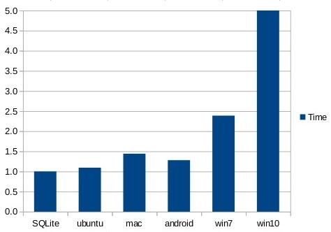

# 数据库理论基础

要深入了解各种概念推荐看《数据库系统概论》

## 数据库模型

- 关系性数据库

  - 关系模型在逻辑层和视图层描述数据,不必关注数据存储的底层细节

    - 元组指 行

    - 属性指 列

    - 关系指 表

      - 关系是元组(行)的集合,但和元组的排列顺序没关

    - 关系模式:由属性(列)组成,数据库的逻辑设计

    - 关系实例:数据库的数据值

      - 关系模式不会发生变化,而关系实例会随时间变化

- 查询

  - 过程化语言

    - 以计算为操作的结果

    - 从单个关系中(id),选出满足一定条件的特殊元组(> 10)

      ```sql
      select * from cnarea_2019
      where id > 100
      ```

    - 从单个关系中,选出特定的属性(id)

      ```sql
      select id from cnarea_2019
      ```

    - 两种计算:id > 100,选出 id,name 属性

      ```sql
      select id,name from cnarea_2019
      where id > 100
      ```

    - 连接合并多个关系的元组

  - 非过程化语言

- NOSQL(非关系数据库)

  - 不存在行字段的数据结构

  - 优点

    - 可扩展性

    - kv (key/value),分布式等结构

  - 缺点:

    - 缺乏事务支持,因此也没有 ACID

## MySQL

Port:3306

- Mysql 是一个单进程多线程架构的关系性数据库

- `client/server` 架构

    - 即使用TCP/IP进行通信

**特点：**

- 免费开源

- 因为开源提供高度多样性支持 C+，Perl，Java，PHP，以及 Python，以及各种客户端

- MySQL 区别于其他数据库的一个最重要的特点是插件式存储引擎。它是基于表的，而不是数据库。

- MySQL 数据库实例由后台线程以及一个共享内存区组成，负责操作数据库文件

---

**缺点:**
?? N + 1查询: 数据库的频繁访问,导致性能降低
- 没有一种存储过程(Stored Procedure)语言
- 其安全系统，主要是复杂而非标准，另外只有到调用 mysqladmin 来重读用户权限时才发生改变
- [十款常见的开源数据库学习资料大汇总](https://linux.cn/article-3758-1.html)
- [深入理解 InnoDB -- 架构篇](https://mp.weixin.qq.com/s?__biz=MzI2MDQzMTU2MA==&mid=2247483850&idx=1&sn=4611d9744b70a00d411eb4c91246eb7d&chksm=ea688a6ddd1f037bd6bc592bd13feb76abb36c3ea0aeb13e3fb355753d1a64f20f1521f2e1df&token=1896344902&lang=zh_CN#rd)

mariadb10 主要是基于 mysql5.6 的原型

## sqlite

- 关系性数据库

- 不采用 `client/server` 架构

- 没有任何配置

- self-contained(少量的外部库)

- 支持Transactional(事务),符合ACID

- 动态类型

- 文件保存格式像版本控制系统

    - 性能:比文件系统的fread(), fwrite()快35%

    - sqlite打包所有blob,而open(),close()对单个文件的每个blob,都要调用一次

    - 只需覆盖文件修改的部分,减少ssd的损耗

    - 只需读取文件所需的数据进内存,而不是读取整个文件

    - 不需要自己写文件I/O

    - 读取性能对比

        

    - 写入性能对比

        

- 使用N + 1, 但没有传统N + 1的问题(因此可以使用大量查询)

    - 第一组查询是从`Fossil数据库` 的`config`, `global_config`中提取

    - timeline的代码可以对不同部分进行分离

    - sqlite与应用程序共同使用进程空间

    - 查询只是函数调用,而不是消息往返

        - `client/server` 架构的数据库,每条sql语句都需要应用程序与数据库之间来回往返


## Redis

Port:6379

有多种数据结构的键值数据库系统(key/value).简称 kv 系统

## memcached

Port:11211

多线程 key/value 数据库，扮演的是 cache(缓存)角色,和 LNMP 一起使用时被称为 LNMMP

## MonogoDB

Port:27017

面向文档的数据库系统(Document Stores)

## HBase

- 列数据库,Google BigTable 的开源版本

## [PostgreSQL](https://www.postgresql.org/about/)

数据类型丰富，可以自定义类型的关系型数据库:

- 提供外围数据库的接口连接

- [PostgreSQL 详细配置参数](https://postgresqlco.nf/en/doc/param/)

## [leveldb](https://github.com/google/leveldb)

- LevelDB 是单进程采用 LSM 算法的服务

- LevelDB 只是一个 C/C++ 编程语言的库, 不包含网络服务封装, 所以无法像一般意义的存储服务器(如 MySQL)那样, 用客户端来连接它. LevelDB 自己也声明, 使用者应该封装自己的网络服务器.

## [dolt:git 命令的数据库](https://github.com/dolthub/dolt)

# reference

- [System Properties Comparison MongoDB vs. MySQL vs. Redis
  ](https://db-engines.com/en/system/MongoDB%3BMySQL%3BRedis)
